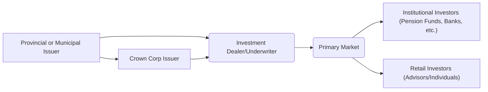

## 6.4 Provincial and Municipal Government Securities

In addition to federal government bonds, Canada’s fixed-income market includes a variety of “sub-sovereign” debt instruments issued by provincial and municipal governments. These securities play a vital role in funding regional infrastructure, social services, and community development projects, while offering investors diversification, attractive yields, and stable income.

Below, we’ll explore the unique features of provincial and municipal government securities, discussing their credit ratings, tax treatments, maturities, liquidity considerations, and related best practices. We’ll also provide examples of how certain Canadian investors—ranging from individual financial planners to major institutions like RBC or TD—analyze and incorporate sub-sovereign debt into their portfolios.

---

## Overview of Sub-Sovereign Debt

Sub-sovereign debt typically refers to debt issued by entities below the national level, such as provinces and municipalities. These securities are often used to finance:

• Healthcare, education, and other public services  
• Infrastructure and development projects  
• Transit systems and facility upgrades  

Compared to federal bonds, sub-sovereign securities generally carry a slightly higher yield, partly reflecting a somewhat higher (though still relatively low) credit risk. Within the Canadian context, many provinces and municipalities maintain strong credit standings, but the yield spread over Government of Canada bonds (GoC bonds) compensates investors for marginally increased credit risk and lower liquidity.

### Crown Corporation Bonds

In addition to direct obligations of provincial governments, investors may also encounter bonds issued by Crown corporations owned by the provincial or federal government. For instance, Ontario Power Generation or BC Hydro can issue their own bonds. Some Crown corporation bonds carry guarantees from the respective provincial government, effectively transferring the credit risk to the provincial level.

---

## Credit Quality Considerations

### Credit Ratings

Bond ratings for provinces and municipalities are determined by credit rating agencies such as Moody’s, DBRS Morningstar, and Standard & Poor’s (S&P). The rating evaluates the issuer’s:

• Economic stability and long-term growth prospects  
• Revenue generation (e.g., taxes, transfers)  
• Debt management and borrowing practices  
• Financial reserves and governance standards  

Provinces like Ontario, Québec, British Columbia, and Alberta typically hold credit ratings in the high grade (e.g., AA to AAA range), while smaller provinces or municipalities may have slightly lower ratings. For instance, major municipalities like Toronto or Vancouver often enjoy strong credit ratings due to diversified tax revenue bases.

### Impact of Economic Cycles

Although Canadian provinces and municipalities tend to have broad and stable tax bases, their financial health can still be influenced by shifts in commodity prices, demographic changes, and federal transfers. For example, an energy-dependent province might experience rating pressure during prolonged low oil prices. Similarly, a municipality reliant on manufacturing could see tax revenue fluctuate in response to changing industry trends.

### Monitoring Credit Risk

To effectively manage credit risk in a portfolio, investors often review:
1. Annual budget reports and debt guidelines from authorities such as the Ontario Financing Authority or Alberta Treasury Board and Finance.  
2. Credit rating agency updates.  
3. Municipal Finance Officers’ Association of Ontario (MFOA) guidelines for local government debt issuance best practices.  

Many Canadian pension funds or large institutional investors—like RBC Asset Management—employ dedicated research teams to track the credit profiles of provincial and municipal issuers, ensuring timely decisions around buying, holding, or selling these bonds.

---

## Interest Rates and Yields

### Comparing Yields to Federal Bonds

Canadian provincial bonds typically offer yields that are slightly, but consistently, above GoC bonds of comparable maturity, reflecting the incremental credit risk. The yield premiums (or “spreads”) vary over time based on market sentiment and the issuer’s perceived financial strength. Similarly, municipal bonds can offer higher yields than provincial bonds if investors perceive greater localized risks or lower liquidity.

For instance, Ontario 10-year bonds might trade at 15 to 50 basis points above comparable Government of Canada bonds. Meanwhile, a city-level green bond—or a debenture funding a specific transit project—may offer an additional 15 basis points or more over provincial bonds, dependent on the project risk and liquidity profile.

### Market Cycles and Spreads

During periods of economic uncertainty, yield spreads for sub-sovereign debt may widen as investors demand higher compensation for any perceived risk of regional economic slowdown or budgetary constraint. Conversely, improving economic conditions and stronger fiscal positions can cause spreads to tighten and bond prices to rise.

---

## Tax Considerations

In Canada, interest income from provincial or municipal bonds is taxable at an investor’s marginal tax rate. However, some specialized municipal issues may provide tax advantages depending on provincial legislation. For example, a small municipality might introduce tax-incentivized bonds for local residents to fund critical infrastructure. It is essential to verify any tax benefits, especially if participating in local bond programs.

Additionally, by holding these bonds in registered plans—such as an RRSP or TFSA—investors can shield interest income from immediate taxation, optimizing their overall net returns. Always consult the relevant disclosures, review the offering memorandum for tax treatment specifics, and coordinate with a tax professional for personalized advice.

---

## Maturities and Liquidity

Sub-sovereign debt maturities in Canada can range from a few years to several decades:

• Short to medium terms (2–10 years) are common for project-oriented municipal securities.  
• Longer maturities (up to 30 or even 40 years) are issued by provinces to fund large-scale infrastructure such as highways or power grids.  

Although the Canadian bond market is well-developed, provincial and municipal bonds still typically have lower trading volumes than equivalent GoC bonds. Consequently, investors may encounter wider bid-ask spreads, especially for less-populous regions or small-scale municipal issues. Large provinces like Ontario or Québec generally see more active secondary markets, while smaller municipalities may have markedly less liquidity.

---

## Practical Examples and Case Studies

### Large Pension Fund Strategy

Major institutional investors such as the Canada Pension Plan Investment Board (CPPIB) or Ontario Teachers’ Pension Plan often purchase provincial bonds for their fixed-income allocations. These securities balance modest credit risk with relatively higher yields. The liquidity profile of larger provincial issues helps these pension funds quickly adjust their portfolios if needed.

### RBC or TD Managed Portfolios

Banks like RBC or TD often hold a blend of federal, provincial, and municipal bonds in their mutual funds or managed portfolios to align with Canadian investor preferences for stable, income-generating securities. For instance, an RBC bond fund might hold Ontario, Québec, and City of Toronto bonds to slightly increase yield while remaining in high-grade, relatively low-risk territory.

### Small Municipality Debenture

Consider a smaller municipality in Northern Ontario issuing a 10-year debenture to expand broadband internet infrastructure. While the bond’s AA- rating (compared to Ontario’s AA rating) reflects a slight credit risk differential, it might offer a yield premium of 25 basis points over a similarly dated provincial bond. Investors comfortable analyzing local economic conditions and liquidity constraints may find this premium worthwhile.

---

## Step-by-Step Guide to Evaluating Provincial and Municipal Bonds

Below is a recommended framework investors can follow:

1. **Assess Credit Ratings:** Start with evaluating the rating from Moody’s, DBRS Morningstar, or S&P. Investigate any recent rating changes or outlook updates.  
2. **Review Fiscal Health:** Examine the issuer’s budget data, debt levels, and growth prospects. Check official provincial or municipal websites (e.g., the Ontario Financing Authority) for updates.  
3. **Compare Yields:** Benchmark against GoC bonds and similar sub-sovereign issuers. Seek clarity on yield spreads, responsiveness to economic conditions, and potential upside.  
4. **Evaluate Liquidity:** Assess secondary market trading volumes. Understand how easily you can buy or sell the bond without incurring sizable transaction costs.  
5. **Confirm Tax Benefits:** Determine whether the bond is eligible for any special local tax incentives or is suitable for a registered account to defer or avoid immediate tax.  
6. **Align with Portfolio Goals:** Match bond duration, yield, and credit profile with your investment objectives—whether you seek stable income, diversification, or long-term growth.  
7. **Monitor and Rebalance:** Stay vigilant about changes to fiscal policies, economic conditions, or credit rating actions. Revisit your holdings periodically and adjust positions as needed.

Below is a simplified mermaid diagram illustrating the relationship between the major parties involved in sub-sovereign debt issuance.

**Diagram Explanation:**  
• The provincial or municipal issuer (A) works with an investment dealer (B) to structure and bring the bond to the primary market (C).  
• Both institutional (D) and retail investors (E) can purchase these bonds.  
• Crown corporations (F) may also tap the market via the same underwriters, often with a provincial or federal guarantee.

---

## Common Pitfalls and Best Practices

### Overlooking Liquidity Constraints

A typical challenge is assuming that provincial or municipal bonds are as liquid as GoC bonds. Smaller issues, especially from remote municipalities, may have limited trading activity. Build a cushion in case you need to exit positions prematurely.

### Insufficient Due Diligence on Local Economic Factors

While provincial macro data is often well-documented, municipal investors must investigate the specific municipality’s finances, demographics, and industry reliance. Even a highly rated municipality can face sudden budget shortfalls if major employers close or shift operations.

### Neglecting Tax Considerations

Some investors forget that interest income from a municipal bond is taxed at their full marginal rate when held outside registered accounts. If your goal is to minimize taxes, placing interest-bearing securities in an RRSP or TFSA can significantly boost after-tax returns.

### Failing to Monitor Credit Updates

Market conditions and rating outlooks can change rapidly. Regularly review updates from rating agencies or provincial/municipal finance offices. This ongoing vigilance will allow timely adjustments to protect capital and lock in gains when spreads tighten.

---

## Glossary

• **Sub-Sovereign Bonds:** Debt issued by provincial, state, or municipal entities below the national level.  
• **Crown Corporation Bonds:** Bonds issued by entities owned by provincial or federal governments. Some of these debts are explicitly guaranteed by the government owner.  
• **Liquidity:** The ease and cost-effectiveness of buying or selling a security without causing significant price changes.  
• **Debenture:** A type of bond that is not secured by any specific asset but backed by the general creditworthiness of the issuer.

---

## References and Additional Resources

• Provincial regulatory websites for official issuance and budget reports (e.g., Ontario Financing Authority, Alberta Treasury Board and Finance).  
• Municipal Finance Officers’ Association of Ontario (<https://www.mfoa.on.ca/>) for best practices and guidelines on municipal finances.  
• Credit rating agency reports (Moody’s, DBRS Morningstar, S&P) for up-to-date credit assessments.  
• Open-source financial analytics tools (e.g., Python libraries like Pandas and NumPy for bond pricing models).  
• Relevant books and articles on provincial financing—easily accessible at local libraries or online.  

---

## Summary

Provincial and municipal government securities form an essential part of Canada’s fixed-income landscape. By offering slightly higher yields than federal bonds, sub-sovereign debt can bolster portfolio returns while maintaining relatively low credit risk, particularly for top-tier provinces and large, financially stable municipalities. Investors who conduct thorough credit and liquidity analysis, remain abreast of economic developments, and optimize their holdings through registered accounts can unlock significant portfolio value from these instruments.

---

## Test Your Knowledge: Canadian Provincial and Municipal Bonds Quiz



### Which term refers to debt issued by provincial and municipal governments within Canada?
- [x] Sub-sovereign bonds
- [ ] Corporate bonds
- [ ] Convertible debentures
- [ ] Treasury bills

> **Explanation:** Sub-sovereign bonds are issued by government entities below the national level, including provinces and municipalities.

### Which of the following typically offers the best liquidity among Canadian government bonds?
- [x] Federal Government of Canada bonds
- [ ] Provincial bonds
- [ ] Municipal bonds
- [ ] Crown corporation bonds

> **Explanation:** Federal GoC bonds typically have the highest trading volume, making them more liquid compared to sub-sovereign and Crown corporation issues.

### What is one reason that provincial bonds typically offer a higher yield than federal bonds?
- [ ] Provincial bonds are risk-free.
- [x] They carry a slightly higher credit risk than federal bonds.
- [ ] They have lower default risk.
- [ ] They always have longer maturities.

> **Explanation:** Since provinces have a higher credit risk than the federal government, they must compensate investors by offering a higher interest rate.

### Which agency is responsible for assessing the creditworthiness of provincial and municipal bonds in Canada? 
- [ ] Canada Revenue Agency (CRA)
- [ ] Canada Mortgage and Housing Corporation (CMHC)
- [x] DBRS Morningstar
- [ ] Financial Consumer Agency of Canada (FCAC)

> **Explanation:** DBRS Morningstar (along with Moody’s and S&P) is one of the major rating agencies that evaluates the credit quality of sub-sovereign debt.

### Which factor most strongly influences the credit risk of a Canadian municipality’s bond issuance?
- [x] The stability and diversity of its tax base
- [x] The municipality’s overall debt levels and budget practices
- [ ] The volatility of global oil prices only
- [ ] Federal bond issuance volume

> **Explanation:** A municipality’s creditworthiness depends on its fiscal health: the strength and diversity of its tax revenues, debt management, and budget discipline.

### What is the main benefit of placing provincial or municipal bonds in a registered retirement savings plan (RRSP)?
- [x] Deferral of tax on interest income
- [ ] Improved credit rating
- [ ] Automatic liquidity through RRSP funds
- [ ] Guaranteed risk-free returns

> **Explanation:** RRSPs allow for tax deferral on interest earnings, which may increase an investor’s long-term after-tax return.

### Which of the following describes the general relationship between yields and economic uncertainty for sub-sovereign debt?
- [x] Yields tend to rise relative to federal bonds during economic uncertainty.
- [ ] Yields remain flat regardless of global economic conditions.
- [x] Credit spreads may widen when the market perceives greater risk.
- [ ] Yields never change once the bond is issued.

> **Explanation:** Sub-sovereign yield spreads usually widen during tough market conditions, reflecting increased perceptions of default risk compared to federal debt.

### Which statement regarding municipal bond liquidity is most accurate?
- [x] Liquidity varies, but is generally lower than that of federal issues.
- [ ] All municipal bonds trade continuously 24/7.
- [ ] Municipal bonds are easily traded with no bid-ask spread.
- [ ] Liquidity is irrelevant for municipal bonds.

> **Explanation:** Municipal bonds often have lower trading volumes and wider bid-ask spreads than federal bonds, meaning liquidity can be a concern.

### Which step should an investor take first when evaluating a provincial bond?
- [x] Review the credit rating and outlook from agencies such as S&P or Moody’s.
- [ ] Immediately purchase the bond based on yield alone.
- [ ] Check liquidity only.
- [ ] Sell all existing bonds in their portfolio.

> **Explanation:** Understanding the issuer’s credit quality and rating is crucial before making an investment decision.

### True or False: Some municipalities in Canada may issue bonds with special tax benefits for local residents.
- [x] True
- [ ] False

> **Explanation:** Certain local issuers can provide incentives or tax advantages to encourage investment in specific infrastructure or community projects.



---

