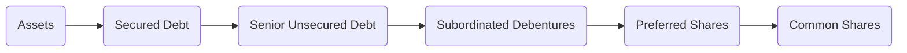

## 6.5 Types of Corporate Bonds

Corporate bonds remain a fundamental tool for companies seeking to raise capital for expansion, mergers, acquisitions, or even day-to-day operations. Compared to government bonds, these instruments often come with higher yields to compensate investors for additional credit risk. In Canada, corporate debt issuance is governed by several regulatory frameworks, including those from the Canadian Securities Administrators (CSA) and the Canadian Investment Regulatory Organization (CIRO). In this section, we will delve into the various types of corporate bonds—secured and unsecured, callable and convertible—and examine how they are structured and regulated within the Canadian market.

---

## Introduction to Corporate Debt Instruments

When corporations need to raise funds, they typically have two routes: issuing equity (e.g., common shares) or issuing debt (e.g., bonds). While equity financing expands the ownership base (diluting existing shareholders) and requires no repayment at maturity, bond financing creates a fixed, legal obligation to pay interest at regular intervals and repay principal at maturity.

There are distinct advantages for both issuers and investors:

• For the issuer:  
  – Interest payments are tax-deductible.  
  – No dilution of ownership or control (unlike issuing shares).  
  – The bond structure can be tailored (e.g., secured, subordinated, callable).

• For the investor:  
  – Potential for steady income through coupon payments.  
  – Relative stability in the form of a known maturity date and principal repayment (barring default).  
  – Opportunity to diversify by credit risk and industry sector.

In Canada, corporate bonds are made available to investors via public offerings, private placements, or prospectus-exempt distributions under frameworks like the National Instrument (NI) 45-106 Prospectus Exemptions.

---

## Secured Bonds

Secured bonds are backed by specific, identifiable assets that serve as collateral. In the event the issuer defaults, bondholders holding secured bonds have a claim on these assets.

### How Secured Bonds Work

If a Canadian corporation, such as a large manufacturing firm, needs capital to upgrade its machinery, it might issue a secured bond backed by that equipment. If the corporation defaults (fails to meet its payment obligations), the secured bondholders can enforce their claim on the pledged equipment, potentially selling it to recoup part or all of their investment.

### Real-World Example

• A hypothetical example could be a bond from a major railway company like Canadian National (CN) that is secured by its fleet of locomotives. While CN is also known for strong cash flows and stable operations, pledging these assets makes the bond more attractive to investors and lowering the interest rate the company must pay.

### Common Pitfalls and Best Practices

• Issuers should ensure that the collateral’s market value is sufficiently high and stable.  
• Investors must carefully review the valuation and liquidity of collateral. For instance, highly specialized equipment may be more difficult to liquidate.

---

## Debentures (Unsecured Bonds)

Debentures are unsecured corporate bonds backed only by the general creditworthiness of the issuer. Investors’ claims on assets are not prioritized by specific collateral but by the issuer’s promise and overall financial strength. Since they carry higher risk, debentures often yield higher returns compared to secured bonds.

### Ranking of Debentures

A debenture typically ranks alongside other unsecured debt, which means payment to debenture holders usually comes after secured creditors have been paid in liquidation. However, debentures can carry varying seniority levels:

• Senior Debentures: Rank above subordinated debentures (but below secured creditors).  
• Subordinated Debentures: Rank below senior unsecured debt. We cover subordinated debentures in Section 5.

### Practical Example with Canadian Banks

Canadian banks like RBC or TD frequently issue debentures to meet funding and capital requirements. These instruments may form part of the bank’s capital structure and are typically viewed favorably by institutional investors who closely monitor the bank’s credit rating.

### Risk-Reward Profile

• Higher default risk without collateral.  
• Potentially higher coupon rates to compensate investors.

---

## Mortgage Bonds

Mortgage bonds are a specific type of secured bond that uses real estate or physical property (e.g., corporate office buildings, distribution centers) as collateral. The bond issuer (a corporation) may create a mortgage lien on properties it owns, giving mortgage bondholders a right to seize and sell the property in case of default.

### How Mortgage Bonds are Structured

In a typical mortgage bond structure, a trust is set up to hold legal title to the property. This security interest is clearly outlined in the bond indenture. Mortgage bonds often have lower yields than unsecured bonds because of their reduced credit risk.

### Case Study: Real Estate Investment Trust (REIT) Mortgage Bonds

A Canadian real estate investment trust (REIT) might issue mortgage bonds using its portfolio of commercial properties as collateral. If they face financial trouble and default on payments, bondholders could potentially take control of these assets—though, in practice, a negotiated settlement often occurs long before a fire sale of properties is required.

---

## Subordinated Debentures

Subordinated debentures are unsecured bonds that rank lower (or “subordinate”) to other categories of debt in case of liquidation. In simpler terms, they are among the last levels of claims that will be repaid if the issuing corporation fails.

### Position in the Capital Structure

The capital structure can be visually depicted as follows:

• Secured Debt: First claim on pledged assets.  
• Senior Unsecured Debt: Next in line after secured creditors.  
• Subordinated Debentures: Lower priority than senior unsecured claims.  
• Preferred Shares: Ownership interest with a fixed dividend but ranks below all debt.  
• Common Shares: Residual claim on earnings and assets.

### Why Issuers Use Subordinated Debentures

Corporations may issue subordinated debentures to raise capital without tying up (or risking) specific collateral. The subordinated nature allows other creditors to remain comfortable with their higher-priority status. However, this means investors in subordinated debentures typically demand higher coupon rates.

### Potential Investor Considerations

• High potential yield due to greater default risk.  
• Closer review of the issuer’s financial health is essential.  
• Often used by financial institutions to bolster Tier 2 capital (subject to regulatory requirements).

---

## Callable and Convertible Features

Beyond being secured or unsecured, many corporate bonds come with special features that give either the issuer or the investor added flexibility.

### Callable Bonds

Callable bonds allow the issuing corporation to pay off (or “call”) the bond before its maturity date. Typically, issuers exercise this right when interest rates have fallen significantly and they can refinance their debt at a more favorable rate.

• Callable Premium: If a bond is called early, the issuer often pays bondholders a premium above par value to compensate them for reinvestment risk.  
• Call Protection: A specified period (often the first few years after issuance) during which the bond cannot be called.

#### Canadian Example

A large Canadian energy company, facing decreasing interest rates, might choose to call its bonds if the market now offers a significantly lower coupon for new issues. By refinancing at a reduced rate, the company cuts its interest expense, improving cash flow.

### Convertible Bonds

Convertible bonds give the holder the right (but not the obligation) to convert their bonds into a set number of the issuer’s common shares. This hybrid structure offers both fixed-income and potential equity upside if the company’s share price rises above a certain level.

• Conversion Ratio: Specifies how many shares one bond can be converted into.  
• Conversion Price: The effective share price for the conversion.  
• Dilution Risk: If many bondholders convert, existing shareholders are diluted.

#### Investor Benefits and Considerations

• Potential capital appreciation if the share price surges.  
• Coupon payments if the bond is not converted.  
• The yield might be lower compared to a similar non-convertible bond due to the embedded equity option.

---

## Higher Credit Risk, Higher Potential Yield

Corporate bonds, particularly compared to government securities (e.g., Government of Canada bonds), carry more credit risk. If the issuing company faces financial distress, there is a risk of default. As a result, corporate bonds often offer higher yields to compensate investors for this added risk.

### Credit Ratings

Agencies like DBRS Morningstar, Moody’s, S&P Global, or Fitch evaluate issuers and assign credit ratings. A high rating (e.g., AA) suggests a lower credit risk and thus typically commands lower coupon rates. In contrast, a bond issued by a lower-rated or non-investment-grade issuer (often called high-yield or “junk” bonds) must offer higher coupons to attract buyers.

### Credit Spreads

A key factor to observe in the bond market is the credit spread: the difference in yield between a corporate bond and an equivalent maturity government bond. Credit spreads widen when investors perceive higher default risk in the corporate sector or during market stress.

---

## Bond Indentures: Terms, Conditions, and Covenants

At the heart of every bond issuance lies the bond indenture—a detailed legal contract between the issuer and bondholders that outlines:

• Maturity date, coupon rate, and payment schedule.  
• Call or conversion provisions, if applicable.  
• Covenants: Agreements the issuer makes to preserve certain financial ratios or restrict new debt issuance.  
• Security or collateral (for secured bonds).  
• Default and remedy provisions.

### Common Covenants

• Negative Pledge: Issuer promises not to issue new debt secured by the same assets.  
• Dividend Restriction: Limits on the maximum dividend payments to shareholders to ensure the issuer can continue to service its debt.  
• Financial Ratios: Maintaining certain levels of debt-to-equity or times-interest-earned.

### Accessing Bond Indentures

In Canada, you can find official copies of corporate bond indentures and other regulatory disclosures on SEDAR+ (https://www.sedarplus.ca/). This public database allows investors to examine prospectuses, offering memoranda, and key financial documents.

---

## Regulatory Environment in Canada

### National Instrument 45-106 Prospectus Exemptions

This set of rules from the CSA provides guidelines on offering securities (including corporate bonds) without filing a full prospectus under specific conditions (e.g., accredited investor exemptions, private placements). Staying compliant with NI 45-106 benefits both issuers and investors due to streamlined processes and reduced regulatory burdens, while still ensuring adequate disclosure.

### CIRO Supervision of Corporate Bond Trading

The Canadian Investment Regulatory Organization (CIRO) oversees the activities of investment dealers and ensures that bond trading in Canada is conducted in a fair and transparent manner. CIRO’s guidelines and rules, alongside provincial securities commissions, help maintain orderly markets and protect investors.

---

## Practical Tools and Resources

Investors, analysts, and issuers alike can benefit from open-source financial tools. For instance:

• QuantLib (quantlib.org): A C++ library for quantitative finance that can be used to price bonds, model yield curves, and run scenario analyses.  
• SEDAR+ (sedarplus.ca): Central repository for public company documents in Canada, including bond offering documents and ongoing disclosure.  
• Bank of Canada (bankofcanada.ca): Provides economic data, bond yield curves, and periodic financial system reviews.  

For deeper learning, the Canadian Securities Institute (CSI) and various provincial Securities Commissions also publish resources and studies that can illuminate best practices in corporate debt issuance and trading.

---

## Best Practices and Potential Challenges

### Best Practices

• Thoroughly Review the Indenture: Ensure clarity on collateral, covenants, and default terms.  
• Monitor Creditworthiness: Close tracking of the company’s financial health and credit rating changes is essential.  
• Compare Yield Spreads: Understand how the bond’s pricing compares to both government securities and similarly rated corporates.  
• Diversification: While yields may be attractive, do not overexpose to one issuer or sector.

### Common Challenges

• Liquidity Risk: Trading in corporate bonds can be less liquid than government bonds, potentially causing price volatility.  
• Reinvestment Risk: For callable bonds, investors risk having to reinvest their proceeds at lower prevailing rates if the bond is called early.  
• Interest Rate Fluctuations: Bond values decrease when interest rates rise. Longer-term bonds typically have higher interest rate sensitivity.

---

## Summary

Corporate bonds—secured or unsecured, callable or convertible—offer Canadian investors a range of opportunities to diversify their fixed-income portfolios while potentially earning higher returns than government bonds. However, these higher yields accompany higher risks, such as credit and liquidity risk. A clear understanding of bond indentures, corporate creditworthiness, and covenant structures is critical to making prudent investment decisions.

By leveraging resources like SEDAR+, staying informed on CIRO guidelines, and understanding regulatory frameworks such as National Instrument 45-106, investors and finance professionals in Canada can confidently navigate the corporate bond market. Whether analyzing RBC’s debentures, evaluating mortgage bonds from a REIT, or exploring convertible bonds offered by a high-growth technology firm, due diligence remains paramount.

Investors are encouraged to apply these principles when constructing their portfolios, always taking into account broader market conditions, interest rate trends, and the issuer’s credit profile. In so doing, they can optimize their risk-reward balance while adhering to best practices endorsed by regulatory bodies and industry experts alike.

---

## Quiz: Master Corporate Bonds in Canada



### Which of the following statements best describes a secured bond?

- [ ] A bond that can only be issued by federal government agencies.  
- [ ] A bond explicitly backed by only the issuer’s creditworthiness.  
- [x] A bond backed by specific pledged assets as collateral.  
- [ ] A bond that offers the option to convert into equity shares.  

> **Explanation:**( Secured bonds are collateralized by a specific asset (e.g., equipment or property). If the issuer defaults, bondholders have a direct claim on these assets.)

### Which of the following is considered an unsecured corporate bond?

- [x] Debenture  
- [ ] Mortgage bond  
- [ ] Equipment trust certificate  
- [ ] Asset-backed security  

> **Explanation:**( A debenture is an unsecured debt instrument supported only by the creditworthiness of the issuer, not by any pledged collateral.)

### Why do subordinated debentures typically offer higher yields?

- [ ] They are always convertible.  
- [ ] They have a claim above preferred shares and common shares.  
- [ ] They are always collateralized by real estate.  
- [x] They rank below senior unsecured and secured debt in liquidation.  

> **Explanation:**( Subordinated debentures sit lower in the capital structure, so investors face a higher loss potential in case of default and thus demand higher yield.)

### What is the primary advantage for an issuer of a callable bond?

- [ ] It guarantees investors a fixed coupon until maturity.  
- [ ] It protects investors from interest rate increases.  
- [ ] It can be converted into common shares at the issuer’s discretion.  
- [x] It allows the issuer to redeem the bond early if interest rates fall or if refinancing becomes cheaper.  

> **Explanation:**( Callable bonds enable the issuer to repay the bond early and refinance at a lower interest rate, saving on future coupon payments.)

### Which statement best describes a convertible bond?

- [x] It can be exchanged for a specific number of the issuer’s common shares.  
- [ ] It is redeemable at any time at par value.  
- [x] It includes both debt and equity characteristics.  
- [ ] It guarantees a fixed yield regardless of stock performance.  

> **Explanation:**( Convertible bonds let bondholders convert debt into the issuer’s common shares, yielding both fixed-income and potential equity upside.)

### In a liquidation scenario, which of the following typically has priority of claim above subordinated debentures?

- [x] Senior unsecured debt  
- [ ] Preferred shares  
- [ ] Common shares  
- [ ] Warrants  

> **Explanation:**( Senior unsecured debt is repaid before subordinated debentures in case of default or liquidation.)

### What is the purpose of a negative pledge covenant in a bond indenture?

- [x] To prevent the issuer from issuing additional debt secured by the same assets.  
- [ ] To enable the issuer to raise capital from any source without bondholder approval.  
- [x] To limit stock option grants to employees.  
- [ ] To guarantee that the issuer will pay a fixed coupon at all times.  

> **Explanation:**( A negative pledge clause ensures the issuer will not pledge the same assets for new debt, thus preserving collateral for existing secured bondholders.)

### Which resource allows investors to review public filings, including corporate bond indentures, in Canada?

- [ ] QuantLib  
- [ ] Bank of Canada website  
- [x] SEDAR+  
- [ ] CIRO website  

> **Explanation:**( SEDAR+ (https://www.sedarplus.ca/) is the centralized repository of regulatory filings for Canadian public companies, including bond indentures.)

### What typically causes the issuer of a corporate bond to pay investors a higher coupon rate?

- [ ] A high credit rating and secure revenue streams.  
- [x] The bond is unsecured and ranks lower in the capital structure.  
- [ ] The issuer is a government entity.  
- [ ] Market interest rates are stable.  

> **Explanation:**( When the bond is unsecured or carries higher credit risk, the issuer must offer a higher coupon to attract investors.)

### True or False: A callable bond always pays a lower coupon rate than a non-callable bond from the same issuer and of the same maturity.

- [ ] True  
- [x] False  

> **Explanation:** Callable bonds often pay a higher coupon compared to similar non-callable bonds because they carry reinvestment risk for investors.



---

