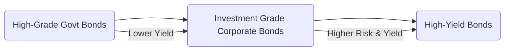

## 6.6 Other Fixed-Income Securities

In addition to conventional government and corporate bonds, the Canadian fixed-income market features a variety of specialized instruments that cater to specific investor needs. This section explores three of these securities—Floating Rate Notes (FRNs), Zero-Coupon Bonds (also known as Strip Bonds), and High-Yield Bonds (often referred to as “junk bonds”). Each category serves a unique purpose in an investment portfolio, providing distinct risk-return profiles that appeal to different investment objectives. As always, it is critical to understand the structure, advantages, and potential pitfalls of these instruments before integrating them into a portfolio.

---

## Floating Rate Notes (FRNs)

### Definition and Key Features
A Floating Rate Note (FRN) is a debt instrument whose coupon payments reset periodically based on a benchmark reference rate, such as the Canadian Dealer Offered Rate (CDOR) or the prime rate, plus a predetermined spread. This reset mechanism means that the coupon you receive can change frequently, often every three or six months. By design, FRNs reduce interest rate risk because their coupons adjust to reflect current market interest rates.

### How They Work
When you invest in an FRN, you initially purchase the security at par value or at a discount/premium, depending on market conditions. At each payment interval—let’s say every three months—the issuer recalculates the coupon by adding a fixed spread to the benchmark interest rate. The new rate applies to upcoming coupon payments until the next reset date.

Below is a simplified visual diagram illustrating how an FRN’s coupon resets:

```mermaid
flowchart LR
    A[Market Reference Rate (e.g., CDOR)] --> B[+ Spread]
    B --> C(Coupon Payment Calculation)
    C --> D[Coupon Paid to Investors]
    D --> E[Next Reset Cycle]
```

### Advantages and Disadvantages
• Advantage: Reduced interest rate risk. Because the coupon rate adjusts regularly, FRNs are less sensitive to market rate fluctuations than traditional fixed-rate bonds.  
• Advantage: Steady (though fluctuating) income stream. Investors receive regular coupon payments that track current rates, which can be beneficial in a rising interest rate environment.  
• Disadvantage: Limited upside if rates fall. When interest rates decrease, the coupon resets downward, potentially reducing the investor’s yield over time.  
• Disadvantage: Credit risk. If the issuer’s credit profile deteriorates, the FRN’s value could also decline, especially if the spread does not adequately compensate for increased risk.

### Use Cases and Strategies
FRNs are particularly suitable for investors seeking:  
• Protection against rising interest rates.  
• Income that adjusts with the market.  
• Exposure to short- and medium-term debt instruments.  

Canadian banks (such as TD and RBC) frequently issue FRNs, which can also be found in money market funds or bond mutual funds focusing on short-duration strategies.

---

## Zero-Coupon Bonds (Strip Bonds)

### Definition and Structure
A Zero-Coupon Bond, or “strip bond,” is sold at a deep discount and does not pay periodic interest (coupons). Instead, the investor’s entire return comes from the bond’s appreciation from its discounted purchase price to its face value at maturity. Issuers may create strip bonds by literally separating (“stripping”) the coupon payments from the principal payment of a bond. The result is two sets of securities:  
1. The principal portion, which pays no coupon and redeems at maturity.  
2. Individual coupons, each of which can be sold separately and redeemed when the respective coupon date arrives.

### Pricing Mechanics
The price of a zero-coupon bond depends primarily on:  
• Time to maturity.  
• Current interest rates.  
• Credit quality of the issuer.

Because there is no coupon income, zero-coupon bonds often have higher duration (i.e., they are more sensitive to changes in interest rates) than comparable coupon-paying bonds of the same maturity.

### Tax Implications
In Canada, even though no cash interest payments are received annually, zero-coupon bondholders with non-registered accounts generally must report and pay tax on the “accreted interest” each year. The Canada Revenue Agency (CRA) treats the annual increase in the bond’s value (based on an amortized cost method) as taxable interest income. For precise guidance, review the official CRA documentation on the tax treatment of zero-coupon bonds.

### Risk-Return Profile
• Interest Rate Risk: Higher sensitivity to rate fluctuations because all cash flow is realized at maturity.  
• Credit Risk: The risk that the issuer may default before maturity.  
• Opportunity for Capital Appreciation: Because zero-coupon bonds trade at a discount, they can offer significant lump-sum gains at maturity. This makes them attractive for long-term goals, such as retirement planning through Registered Retirement Savings Plans (RRSPs), where interest income is tax-deferred.

### Real-World Example
Consider a 10-year zero-coupon bond with a face value of $1,000 purchased for $600. Over the next decade, it matures at $1,000, offering a $400 gain. Although the investor doesn’t receive periodic interest, they must account, for tax purposes, for the proportion of the accrued gain each year (unless held in a tax-deferred or tax-free account like an RRSP or TFSA).

---

## High-Yield Bonds (Junk Bonds)

### Definition and Key Characteristics
High-Yield Bonds, commonly referred to as “junk bonds,” are corporate bonds that carry a lower credit rating (below BBB- by S&P Global Ratings or DBRS Morningstar) and hence present higher default risk. In return for this increased risk, issuers must offer higher coupon rates to attract investors.

### Credit Ratings and Default Risk
Credit rating agencies such as DBRS Morningstar, S&P Global Ratings, and Moody’s assess an issuer’s creditworthiness. A rating below investment grade indicates a potentially elevated risk of default. Investors can consult open-source platforms or academic research (e.g., SSRN) to review empirical studies on high-yield bond performance, assessing default rates and risk premia over time.

Below is a simple chart illustrating how the risk and yield potential of different types of bonds often compare:



### Benefits and Risks
• Potential for Higher Returns: High-yield bonds can offer substantially more interest income than investment-grade securities.  
• Increased Credit Risk: The primary risk is default, which could cause significant losses.  
• Market Liquidity Risk: In periods of market stress, high-yield bonds may be more difficult to sell at a fair price.  
• Economic Sensitivity: High-yield issuers may be more vulnerable to economic downturns, further elevating credit risk.

### Portfolio Considerations
High-yield bonds can serve as a diversification tool within fixed-income allocations, but investors should carefully weigh the enhanced credit risk. Portfolio managers often use high-yield bonds to boost total returns, especially in a low-interest-rate environment. However, during economic downturns, these bonds can experience greater price volatility and default risk.

---

## Comparing Key Features

The table below summarizes the defining characteristics, advantages, and main risks of FRNs, zero-coupon bonds, and high-yield bonds—providing a convenient reference for Canadian investors evaluating these instruments:

| Instrument               | Key Features                                                   | Advantages                                                      | Main Risks                                             |
|--------------------------|----------------------------------------------------------------|-----------------------------------------------------------------|--------------------------------------------------------|
| Floating Rate Notes (FRNs) | • Coupon resets periodically to a benchmark + spread.         <br>• Lower duration than fixed-rate bonds.          | • Protection against rising interest rates. <br>• Steady income that tracks market rates. | • Credit risk of issuer. <br>• Limited benefit if rates fall. |
| Zero-Coupon Bonds        | • Sold at deep discount. <br>• No periodic coupon payments. <br>• Return realized at maturity. | • Potential for significant capital appreciation. <br>• Often used for long-term goals.   | • Higher interest rate sensitivity. <br>• Annual tax on accrued interest in non-registered accounts. |
| High-Yield Bonds         | • Lower credit ratings. <br>• Higher coupon rates.             | • Potential for elevated yield. <br>• Portfolio diversification. | • Elevated default risk. <br>• Price volatility in economic downturns.                      |

---

## Regulatory Considerations and Additional Resources

• The Canada Revenue Agency (CRA) provides official guidelines for the annual accrual taxation of zero-coupon bonds and other debt instruments. Consult the CRA website (canada.ca) for the latest documentation and bulletins.  
• Rating agencies (DBRS Morningstar, S&P Global, Moody’s) publish extensive research on corporate default rates, essential reading for anyone interested in high-yield bonds.  
• SEDAR+ (www.sedarplus.ca) and SSRN (www.ssrn.com) offer open-access and academic research on bond market metrics, regulatory filings, and corporate disclosures.  
• Provincial Securities Commissions (e.g., the Ontario Securities Commission) regulate public offerings of debt securities, including high-yield issues.

---

## Best Practices for Investors

1. ► Evaluate Credit Quality: Look into the issuer’s fundamentals and the credit rating of the bond before investing.  
2. ► Match Instruments with Objectives: Zero-coupon bonds may be ideal for long-term capital accumulation, while FRNs can be safer during rising rate cycles.  
3. ► Diversify: High-yield bonds can improve returns but should represent only a fraction of a well-balanced portfolio, balanced against government bonds, equity holdings, and other assets.  
4. ► Monitor Economic Indicators: Particularly relevant for high-yield markets. Carefully watch default rates, corporate earnings, and overall market sentiment.  
5. ► Consider Tax-Advantaged Accounts: Placing zero-coupon bonds in an RRSP, RRIF, or TFSA can significantly mitigate annual taxation of accrued interest.

By carefully selecting and managing these additional fixed-income instruments, investors can enhance both the income and total return potential of their portfolios. Understanding the unique characteristics, tax implications, and regulatory framework surrounding FRNs, zero-coupon bonds, and high-yield bonds is imperative for making informed decisions in Canada’s debt markets.

---

## Master Your Knowledge: Other Fixed-Income Securities Quiz



### Which of the following best describes a floating rate note (FRN)?

- [ ] A bond with a coupon rate that remains fixed for life.  
- [ ] A bond with no coupons, sold at a deep discount.  
- [x] A bond whose coupon resets periodically based on a reference rate plus a spread.  
- [ ] A bond with a coupon rate that only adjusts annually.

> **Explanation:** FRNs have variable coupon rates that adjust at specified intervals according to a benchmark rate (e.g., CDOR) plus a spread.

### What is a primary advantage of FRNs in a rising interest rate environment?

- [x] They adjust the coupon payments upward to reflect rising rates.  
- [ ] They pay no interest until maturity.  
- [ ] They completely eliminate credit risk.  
- [x] They can maintain a more stable price compared to fixed-rate bonds.

> **Explanation:** FRNs automatically reset coupon rates in line with market rates, making their prices more stable in rising interest scenarios. However, credit risk remains, as with any corporate or governmental debt.

### Which statement about zero-coupon bonds is correct?

- [ ] They pay monthly interest at a floating rate.  
- [x] They are sold at a discount and pay no coupon.  
- [ ] They are always shorter-term than other bonds.  
- [ ] They have zero duration risk.

> **Explanation:** Zero-coupon bonds are sold at a discount and pay no coupon. Their return is the difference between the purchase price and the redemption amount at maturity.

### In Canada, how is the “accreted interest” on zero-coupon bonds typically taxed in non-registered accounts?

- [ ] No tax is due until maturity.  
- [x] Tax is due annually based on the bond’s amortized increase in value.  
- [ ] It is taxed only when the investor sells the bond.  
- [ ] It is always taxed as a capital gain.

> **Explanation:** For non-registered accounts, the investor must pay tax on the accrued interest each year, as per CRA rules.

### What is the main reason high-yield bonds offer higher interest rates than investment-grade bonds?

- [ ] They have more favourable tax treatment.  
- [ ] They are guaranteed by the government.  
- [x] They present greater default risk.  
- [x] Their credit rating is below investment grade.

> **Explanation:** High-yield bonds, rated below investment grade, compensate investors for greater default risk by offering higher interest rates.

### Which of the following could be a suitable rationale for adding zero-coupon bonds to a Canadian investor’s portfolio?

- [x] They provide substantial capital appreciation potential over the long term.  
- [ ] They are immune to interest rate fluctuations.  
- [ ] They pay monthly tax-free coupons.  
- [ ] They have no default risk at all.

> **Explanation:** Zero-coupon bonds can appreciate significantly if held to maturity, making them valuable for long-term goals. However, they remain sensitive to interest rate changes and default risk.

### Which statement about FRNs is correct?

- [x] Their coupon payments are recalculated at each reset date.  
- [ ] They are typically sold at a substantial discount and redeemed at par.  
- [x] They can help manage interest rate risk in a rising rate environment.  
- [ ] They typically offer higher returns than high-yield bonds.

> **Explanation:** FRNs recalculate coupons at each reset date, providing a hedge against rising interest rates. However, they generally do not offer higher yields than high-yield bonds.

### What might be the biggest disadvantage of holding high-yield bonds?

- [x] They carry a higher risk of default.  
- [ ] They cannot be traded in secondary markets.  
- [ ] They offer tax advantages.  
- [ ] Their coupons increase if the issuer’s credit rating improves.

> **Explanation:** High-yield bonds are characterized by a greater default risk due to issuers having lower credit ratings.

### Each statement below about high-yield bonds is true EXCEPT:

- [x] They always outperform government bonds in every economic cycle.  
- [ ] They can serve as a diversification tool in a broader bond portfolio.  
- [ ] They generally offer higher coupons than investment-grade bonds.  
- [ ] They may exhibit higher liquidity risk during market stress.

> **Explanation:** High-yield bonds do not always outperform government bonds. Their performance depends on economic conditions and issuer-specific factors.

### True or False: Strip bonds can be split into separate securities composed of individual coupons and a principal component.

- [x] True  
- [ ] False  

> **Explanation:** When a bond is stripped, the investor can trade its coupons and principal separately as individual securities, hence the name “strip bonds.”



---

## For Additional Practice and Deeper Preparation

**Elevate your exam readiness with our comprehensive app, "Securities CA: Mock Exams," designed to challenge and refine your skills.**

* **Master Challenging Questions:** Dive into expertly crafted sample exam questions that go beyond standard references.
* **Scenario-Driven Learning:** Experience scenario-driven case questions and in-depth solutions to build practical expertise.
* **Sharpen Exam Strategies:** Build confidence with step-by-step explanations designed to refine your exam-day tactics.
* **Gain Real-World Insights:** Acquire practical tips and detailed rationales that demystify complex concepts.
* **CIRO and CSI Alignment:** Stay current with CIRO guidelines and CSI’s exam structure, with questions intentionally more challenging than the actual exam.

**Download the App Today:**

[](https://apps.apple.com/us/app/securities-ca-mock-exams/id1667869674)
[](https://play.google.com/store/apps/details?id=ca.tokenizer.cscexams)


> Note: While these courses are specifically crafted to align with the CSC® exams outlines, they are independently developed and not endorsed by CSI or CIRO.
