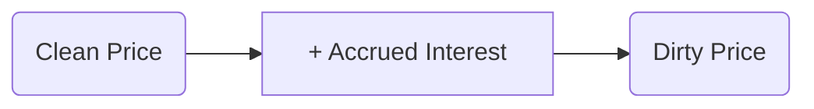

## 6.7 How to Read Bond Quotes and Ratings

Bond quotes and ratings are essential tools for evaluating fixed-income investments. The ability to accurately read these quotes and interpret credit ratings can markedly influence investment decisions, inform portfolio adjustments, and promote a deeper understanding of the Canadian bond market. In this section, we will explore how bond quotes are displayed, discuss the difference between clean and dirty prices, examine how credit ratings from major agencies work, and learn how changes in these ratings can impact bond yields and prices. We will also look at benchmark indices used as performance comparisons.

---

### Understanding Bond Quotes

Bond quotes represent the current market price and other essential data you need when evaluating or trading a fixed-income security. These quotes typically appear on financial data platforms such as Bloomberg, Refinitiv Eikon, or online brokerage sites. While each platform has its design, most bond quote displays include the following core components:

1. **Price**  
   - Bond prices are quoted as a percentage of the bond's par value (also called face value). Par value is usually 100 in Canada (e.g., $1,000 or any other stated face amount).  
   - For example, a price quote of 99.50 means the bond is trading at 99.50% of its par value. If par value is 100, then the bond costs $99.50 per $100 of face value.

2. **Coupon**  
   - The bond's stated interest rate, usually expressed as an annual percentage of par value.  
   - If you see “3.5%” as the coupon, it means the bond pays an annual interest of 3.5% of the par value.  

3. **Maturity Date**  
   - The date on which the issuer returns the bond’s face amount to the bondholders and ceases to pay interest.  
   - This date helps you assess the time horizon of the bond and how it fits into your investment strategy.

4. **Yield**  
   - The yield quoted often refers to the Yield to Maturity (YTM). This is an annualized return estimate, accounting for the purchase price, coupon payments, reinvestment assumptions, and redemption at maturity.  
   - Alternatively, databases may display the Current Yield (annual coupon / market price) or Yield to Call if the bond is callable.

5. **Special Features**  
   - Annotations such as **CALL** (callable bond), **PUT** (putable bond), or **CONV** (convertible bond) may appear alongside quotes. These features can affect pricing and yield, as they introduce additional rights or obligations.

---

### Clean Price vs. Dirty Price

When you see a bond priced on a financial platform (e.g., quoted as 99.50), that quote typically reflects the **clean price**. The clean price excludes any accrued interest the seller is owed since the last coupon payment. However, when you purchase a bond, you actually pay the **dirty price**, which is:

Dirty Price = Clean Price + Accrued Interest

Accrued interest is the interest that has accumulated between coupon payments. It compensates the seller for holding the bond over part of the coupon period.

To visualize the relationship:

- **Clean Price:** The quoted price ignoring accrued interest.  
- **Accrued Interest:** The interest accumulated since the last coupon date, owed to the bondholder who sells the bond.  
- **Dirty Price (Full Price):** The final price the buyer pays; includes accrued interest.

Understanding the distinction between clean and dirty prices is crucial for both traders and long-term investors, especially in Canada where bond trades settle with a standard T+2 settlement cycle. From a tax perspective and a return perspective, you should carefully monitor accrued interest, as it influences your actual out-of-pocket expenses (and potential tax implications).

---

### Credit Rating Systems

A bond’s credit rating reflects the issuer’s ability to meet its financial obligations. Ratings are typically assigned by recognized credit rating agencies, including DBRS Morningstar, Standard & Poor’s (S&P), and Moody’s Investor Services. In Canada, DBRS Morningstar is widely referenced, but many global investors also rely on S&P and Moody’s scales for comparative context.

Below is an approximate comparison:

- **Standard & Poor's (S&P)**: AAA, AA, A, BBB, BB, B, CCC, CC, C, D  
- **Moody's**: Aaa, Aa, A, Baa, Ba, B, Caa, Ca, C  
- **DBRS Morningstar**: AAA, AA, A, BBB, BB, B, CCC, CC, C, D

Investment-grade ratings generally start from AAA (highest quality) to BBB- (i.e., BBB-, Baa3, or BBB low). Anything below these thresholds is considered high yield or “junk” status, implying a higher risk of default.

#### Key Takeaways About Ratings  
1. **Default Risk Assessment**: A higher rating (e.g., AAA or Aaa) means lower perceived default risk, and thus typically lower yields.  
2. **Market Confidence**: Institutional investors—like pension funds—often limit their bond holdings to investment-grade securities to control risk.  
3. **Refinancing Implications**: Issuers with higher ratings can often refinance at more favorable rates, reinforcing their advantage in the market.

---

### Effect of Rating Upgrades and Downgrades

Credit rating agencies frequently review issuers and update ratings as new financial data emerges or sector-wide changes occur. When a bond’s credit rating is upgraded, its perceived default risk decreases, often leading to a price increase and a corresponding yield decrease.

Conversely, a downgrade signals heightened credit risk. Investors may sell the bond to reduce exposure, causing the bond’s price to fall and its yield to rise. It can also affect market liquidity, as some large institutional investors have mandates restricting the credit quality of their portfolio holdings—and they might be forced to sell downgraded bonds.

---

### Benchmark Indices for Bonds

To measure how well a bond or bond portfolio is performing, investors often compare the yield or total return against a relevant benchmark index. In Canada, the most commonly referenced benchmark is the **FTSE Canada Universe Bond Index**, which covers a broad spectrum of Canadian investment-grade bonds. Other specialized indices track specific market segments, such as:

- FTSE Canada All Corporate Bond Index  
- FTSE Canada All Federal Bond Index  
- FTSE Canada Short-Term, Mid-Term, and Long-Term Bond Indices

These indices serve as reference points:  
• **Portfolio Managers** compare their portfolios’ returns and risk metrics to these benchmarks.  
• **Retail Investors** can gauge whether their bond investments are in line with the broader market performance.

---

### Putting It All Together: A Canadian Example

Imagine you access a financial terminal like Bloomberg or Refinitiv Eikon to review a recently issued Government of Canada bond quote. You see:

- **Price**: 101.20 (clean)  
- **Coupon**: 2.50%  
- **Maturity**: 2032-06-01  
- **Yield to Maturity (YTM)**: 2.30%  
- **Accrued Interest**: $0.30 per $100 of face value

To figure out what you pay if you buy 10 bonds at a face value of $1,000:  
• Clean price per $1,000 = $1,012.00  
• Accrued interest per $1,000 = $3.00  
• Dirty price per $1,000 = $1,012.00 + $3.00 = $1,015.00  
• For 10 bonds (each with $1,000 face), total cost = 10 × $1,015 = $10,150

Since this is a Government of Canada bond, it likely has a top-tier credit rating (AAA from S&P, for instance). An upgrade in this context is unlikely, but if interest rates or the Canadian fiscal outlook changes, you might see an impact on its price.

---

### Best Practices for Reading Quotes and Ratings

1. **Validate Sources**: Use reputable data providers. Check at least two sources to confirm accuracy.  
2. **Check Features**: Always verify if a bond is callable, putable, or convertible. Special features interact with market dynamics and can drastically alter returns.  
3. **Monitor Rating Actions**: Sign up for alerts from credit agencies or your brokerage to be informed about rating changes immediately.  
4. **Watch Accrued Interest**: For exact cost and yield calculations, work with the dirty price rather than the clean price.  
5. **Benchmark Regularly**: If aligning your performance with the FTSE Canada Universe Bond Index, revisit your bond holdings periodically to see how you’re performing relative to that benchmark.  
6. **Stay Compliant**: Follow CIRO (formerly IIROC) rules on transaction reporting and transparency for any bond trading activity.  

---

### Summary

Bond quotes provide crucial market data—price, yield, coupon, maturity date, and special features. However, understanding whether that price is clean or includes accrued interest is essential in determining the actual cost. Credit ratings serve as a compass for evaluating credit risk, guiding both institutional and retail investors in asset allocation. An upgrade usually supports higher bond prices and lower yields, whereas a downgrade triggers the opposite trend. Finally, benchmark indices such as the FTSE Canada Universe Bond Index help measure performance in comparison to the broader Canadian bond market.

This concludes Chapter 6, which introduces the foundational concepts of fixed-income securities, their key features, various types, and the practical knowledge required to understand how they are issued, traded, regulated, and analyzed in Canada. Mastery of this chapter is essential for anyone preparing for the Canadian Securities Course (CSC®) and for anyone working with bonds and related debt instruments under the oversight of the Canadian Investment Regulatory Organization (CIRO) and the broader framework set by the Canadian Securities Administrators (CSA).

---

### Glossary

• **Clean Price** – The bond price quoted in the market that does not factor in accrued interest.  
• **Dirty Price (Full Price)** – The actual purchase price of a bond (Clean Price + Accrued Interest).  
• **Credit Rating** – A grade assigned by a credit rating agency based on the issuer’s ability to meet its financial obligations.  
• **Benchmark Index** – A standard index against which bond or portfolio performance is measured, such as the FTSE Canada Universe Bond Index.

---

## Test Your Knowledge: How to Read Bond Quotes and Ratings in Canada



### Which of the following is typically included in a standard bond quote?

- [x] Coupon, price, maturity date, yield
- [ ] Equity share price, yield spread, and dividend rate
- [ ] Corporate financial statements
- [ ] The rating agency’s analyst report

> **Explanation:**( Standard bond quotes typically feature the coupon rate, price, maturity date, and yield. An analyst report or financial statements may be separate.)

### When you see a bond quoted as 99.50, what percentage of par are you effectively paying?

- [ ] 9.95%
- [x] 99.50%
- [ ] 88.50%
- [ ] 100.50%

> **Explanation:**( A quote of 99.50 indicates 99.50% of the bond's face (par) value.)

### Which price typically includes accrued interest?

- [ ] Clean price
- [ ] Listed price
- [x] Dirty price
- [ ] Nominal price

> **Explanation:**( The dirty price (also called the full price) is the clean price plus accrued interest.)

### What is a primary reason for paying attention to accrued interest on a bond you buy?

- [ ] It doubles your coupon payment
- [x] It accurately reflects the total cash amount you must pay
- [ ] It is paid by the issuer as a penalty
- [ ] It never impacts the bond’s yield to maturity

> **Explanation:**( Accrued interest determines the actual (dirty) price you pay, which affects your out-of-pocket expense.)

### Which combination below generally represents an investment-grade rating category from S&P?

- [x] AAA, AA, A, BBB
- [ ] BB, B, CCC, Default
- [x] AAA, BBB, CCC, D
- [ ] C, CC, B, BB

> **Explanation:**( AAA, AA, A, and BBB (and their “+” or “-” notations) are considered investment-grade ratings by S&P.)

### How does an upgrade to a bond’s credit rating usually affect its yield?

- [x] The yield tends to decrease because the bond’s price goes up
- [ ] The yield remains unchanged
- [ ] The yield tends to increase because the bond’s price goes down
- [ ] The yield becomes negative

> **Explanation:**( When a bond is upgraded, investors perceive lower default risk, pushing up price and generally lowering the yield.)

### Which index serves as a broad benchmark for the Canadian investment-grade bond market?

- [ ] S&P/TSX Composite Index
- [x] FTSE Canada Universe Bond Index
- [ ] Dow Jones Industrial Average
- [ ] NASDAQ 100

> **Explanation:**( The FTSE Canada Universe Bond Index tracks a broad range of Canadian investment-grade fixed-income securities.)

### A bond’s clean price is 101.25, and the accrued interest is $2.75 per $1,000 face value. What is the dirty price per $1,000 face value?

- [ ] $99.00
- [ ] $101.25
- [ ] $102.50
- [x] $104.00

> **Explanation:**( Dirty Price = Clean Price + Accrued Interest = $101.25 + $2.75 = $104.00 per $100, which translates to $1,040 if the par is $1,000.)

### If a bond’s credit rating is downgraded from BBB to BB, which scenario is most likely?

- [ ] The bond will be classified as a risk-free asset
- [ ] The yield will increase significantly
- [x] Some institutional investors may be forced to sell the bond
- [ ] The bond’s price will likely increase

> **Explanation:**( A downgrade from investment-grade (BBB) to non-investment-grade (BB) often triggers forced selling by institutional investors restricted to investment-grade holdings, likely increasing yield and decreasing price.)

### The “dirty price” of a bond is also known as the “full price.”

- [x] True
- [ ] False

> **Explanation:** The dirty price is indeed the “full price,” including accrued interest.



---

