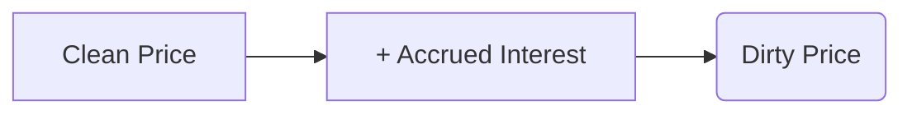

## 7.1 Calculating Price and Yield of a Bond

Bond pricing and yield calculations are essential components of fixed-income analysis in Canada and abroad. Understanding these concepts helps you effectively assess the risks, returns, and suitability of bond investments. This section covers key elements of bond valuation, including price and yield relationships, calculation methods, clean versus dirty pricing, and special yield measures such as Yield to Call (YTC). We will use Canadian examples and note relevant regulations from organizations like the Canadian Investment Regulatory Organization (CIRO) and the Bank of Canada.

---

## Overview: Price-Yield Relationship

At the heart of bond valuation lies the inverse relationship between bond prices and market interest rates (yields):  
• When market interest rates rise, existing bonds with lower coupon rates become less attractive, decreasing their market price.  
• When market interest rates fall, existing bonds with higher coupon rates become more attractive, increasing their market price.

Bondholders and potential investors should be aware of this relationship because changes in prevailing interest rates directly influence bond prices and yields. This inverted price-yield dynamic transcends all types of bonds, from Government of Canada bonds to corporate bonds issued by major financial institutions like RBC or TD Bank.

---

## Key Concepts in Bond Pricing

### Par Value (Face Value)
The par value (or face value) is the amount the issuer promises to pay at maturity. In the Canadian market, par value is often $1,000, though it can vary.

### Coupon Rate
The bond’s coupon rate specifies the annual interest paid on the face value. A 5% coupon on a $1,000 bond, for example, pays $50 in interest per year (often in semi-annual installments of $25 each).

### Discounting
Discounting is the process of determining the present value of future cash flows. Each coupon payment and the repayment of par value at maturity are discounted back to the present using the appropriate market yield (or required rate of return).

### Clean Price vs. Dirty Price
In Canadian fixed-income markets, bond prices are typically quoted on a clean price basis, which excludes accrued interest. However, when settling a trade, the buyer must pay the dirty price, which is:
  
Dirty Price = Clean Price + Accrued Interest  

Accrued interest is the interest earned since the last coupon date but not yet paid; it compensates the seller for the coupon portion that has built up during the holding period.

---

## Calculating Bond Price

The standard formula for the price (P) of a coupon-paying bond is the sum of the present value (PV) of all future coupon payments plus the present value of the bond’s par value at maturity:


P = \sum_{t=1}^{n} \frac{C}{(1 + R)^t} + \frac{\text{Face Value}}{(1 + R)^n}


Where:  
• \\( C \\) = Coupon payment per period (annual coupon divided by the number of coupon payments per year).  
• \\( n \\) = Total number of coupon periods.  
• \\( R \\) = Yield per coupon period (the required market yield divided by the number of coupon payments per year).  

If coupons are paid semi-annually, the coupon payment is halved, and the yield is also expressed on a semi-annual basis.

### Example: Pricing a Corporate Bond from RBC
Consider a fictitious RBC 5-year bond with a 4% annual coupon (2% paid semi-annually), par value of $1,000, and a required yield (market yield) of 5% per year (2.5% per semi-annual period).

Step-by-Step Calculation:
1. Semi-annual coupon payment (C) = 4% of $1,000 / 2 = $20.  
2. Yield per coupon period (R) = 5% / 2 = 2.5%.  
3. Total number of coupon payments (n) = 5 years × 2 payments/year = 10.  
4. Present Value of coupons:
   
   \sum_{t=1}^{10} \frac{20}{(1 + 0.025)^t}
   
5. Present Value of par value at maturity:
   
   \frac{1{,}000}{(1 + 0.025)^{10}}
   
6. Add these present values to get the total bond price.

You can use a financial calculator, spreadsheet, or open-source Python library like QuantLib to perform these steps quickly.  

---

## Yield to Maturity (YTM)

Yield to Maturity (YTM) is the annualized rate of return an investor can expect if they purchase the bond at the current market price and hold it until maturity, assuming all coupons are reinvested at the same yield. Because it incorporates all future coupon payments and the redemption of par value, YTM is widely referenced as a comprehensive measure of return.

### Example: Yield to Maturity Computation
Suppose you can purchase a TD Bank bond with a 3.5% coupon, five years remaining until maturity, priced at $970. The problem is to find the YTM. Here’s a simplified conceptual approach:

1. Use a trial-and-error method or a financial calculator function such as IRR/YTM.  
2. Input the bond’s current price as the present value (PV = –$970), coupon flows of $35 per year (3.5% of $1,000), plus $1,000 redemption at maturity.  
3. Solve for the annual yield (i.e., the discount rate) that sets the net present value (NPV) of all cash flows to zero.

This yields the annual YTM. Bonds quoted in the Canadian market usually reference a semi-annual yield, so the calculator would typically split the annual coupon into two equal payments and solve for the semi-annual discount rate, then annualize it.

---

## Alternative Yield Measures

### Current Yield
Current Yield = Annual Coupon / Current Market Price

While quick to compute, current yield does not account for the time value of money or the maturity value. It only measures the annual coupon relative to the bond’s current market price.

### Yield to Call (YTC)
For callable bonds, the Yield to Call (YTC) calculation assumes that the issuer will call the bond at the first available call date (and at the stated call price). This can significantly alter the bond’s expected cash flows.

### Yield to Put (YTP)
Less common in the Canadian market but still relevant is Yield to Put, which applies when the bond has a put feature allowing the holder to demand early redemption.

---

## Clean Price vs. Dirty Price in Context

### Accrued Interest
In the Canadian market, bond prices on statements and quotes exclude accrued interest. However, the prudent investor must remember that the total settlement amount (the dirty price) will be adjusted upward or downward due to accrued interest.

Let’s visualize the concept:

• Clean Price: Quoted price seen in the market or on trading platforms.  
• Accrued Interest: Compensation to the bond seller for holding the bond and accruing its coupon between payment dates.  
• Dirty Price: Actual amount the buyer pays upon settlement.

---

## Practical Tools and Techniques

### Financial Calculators
Specialized financial calculators can handle time value of money (TVM) functions, allowing quick computation of bond price or YTM with just a few inputs:  
• N: number of periods to maturity  
• I/Y: yield or discount rate per period  
• PMT: coupon payment per period  
• FV: face (par) value  
• PV: present value (bond’s price)

### Spreadsheet Software
Microsoft Excel, Google Sheets, or LibreOffice Calc offer built-in functions such as:  
• =PRICE()  
• =YIELD()  

These formulas automate discounting calculations. Always keep your compounding frequency aligned with the bond’s coupon frequency.

### Open-Source Libraries
QuantLib (https://www.quantlib.org/) is a widely used open-source C++ library for quantitative finance. It supports Python bindings as well, making it a popular option among analysts for complex bond analytics.

---

## Common Pitfalls and Best Practices

1. Neglecting Semi-Annual Payments  
   Canadian bonds often pay coupons semi-annually. Ensure formulas and financial calculator settings match the correct frequency.

2. Ignoring Accrued Interest  
   Failing to account for accrued interest leads to underestimating the actual cost of purchasing a bond.

3. Overlooking Callable/Put Features  
   Bonds with embedded options may significantly alter potential returns, making YTC or YTP more relevant than YTM.

4. Incorrectly Handling Yields in Calculations  
   Always convert annual yields to the proper periodic yields (semi-annual, quarterly, etc.) before discounting.

5. Reinvestment Assumption for YTM  
   YTM assumes coupon reinvestment at the same yield, which may not be realistic if interest rates change.

6. Monitoring Market Shifts and Economic Indicators  
   Keep an eye on Bank of Canada announcements, which can affect interest rates and, therefore, bond yields. 

---

## Real-World Case Study: Canadian Pension Fund

A Canadian pension fund investing in long-term Government of Canada bonds must carefully manage bond portfolios to align with liabilities. By calculating YTM for various maturities and coupons, the pension fund ensures sufficient cash flow to meet future obligations. The fund might reinvest coupons in shorter-term instruments or additional bonds, aiming to maintain a stable and predictable income stream over decades.

---

## Regulatory Framework and Additional Resources

• Canadian Investment Regulatory Organization (CIRO): Oversees investment dealers in Canada, requiring proper disclosures and transparency in bond trading.  
• Canadian Securities Administrators (CSA): Provides collective policy frameworks for provincial and territorial regulators.  
• Bank of Canada (https://www.bankofcanada.ca/): Primary source for benchmark interest rates and monetary policy.  
• QuantLib (https://www.quantlib.org/): Popular open-source library for bond analytics, providing extensive bond pricing and yield functions.  
• “Bond Markets, Analysis and Strategies” by Frank J. Fabozzi: Comprehensive resource on bond valuation.  
• “Fixed Income Securities: Tools for Today’s Markets” by Bruce Tuckman and Angel Serrat: In-depth coverage of various fixed-income instruments and valuation models.  
• CFA Institute (https://www.cfainstitute.org/): Offers professional study materials and certification in fixed-income and other areas of finance.

---

## Glossary

• Par Value (Face Value): The amount the bond issuer agrees to pay at maturity. Usually $1,000 in Canada.  
• Coupon Rate: The annual interest rate the bond pays, expressed as a percentage of the par value.  
• Yield to Maturity (YTM): The bond’s annualized rate of return over its remaining life, assuming reinvestment of coupons.  
• Current Yield: Annual coupon divided by current market price, overlooking time value of money.  
• Yield to Call (YTC): The yield calculation assuming the bond issuer redeems (calls) the bond at the earliest call date.  
• Accrued Interest: Interest accrued since the last coupon payment, not yet paid to the holder.  
• Discounting: Calculating the present value of future cash flows using a required yield or discount rate.

---

## Summary

Bond pricing and yield calculations form the cornerstone of fixed-income analysis. By applying time value of money principles, accounting for coupon frequencies, and being mindful of Canadian market conventions, investors can accurately evaluate the attractiveness of a bond. YTM captures the overall return if the bond is held to maturity, while current yield and YTC cater to different investment needs and considerations. Whether you are a retail investor or a buy-side manager overseeing billions of dollars in securities, mastering these valuation fundamentals is critical to prudent decision-making in the Canadian fixed-income marketplace.

---

## Master Bond Pricing and Yield Quiz



### Which statement best describes the relationship between bond prices and market interest rates?

- [x] Bond prices and market interest rates move in opposite directions.
- [ ] Bond prices and market interest rates move in the same direction.
- [ ] Bond prices completely ignore changes in market interest rates.
- [ ] Bond prices only respond to interest rates at maturity.

> **Explanation:**( As market interest rates increase, existing bond prices fall (and vice versa) due to their relative attractiveness to new issues.)

### What best describes the “dirty price” of a bond?

- [ ] The quoted price only.
- [x] The quoted price plus accrued interest.
- [ ] The price with brokerage fees included.
- [ ] The price minus accrued interest.

> **Explanation:**( The dirty price is the total settlement amount paid by the buyer, which includes the clean price (quoted) plus accrued interest since the last coupon date.)

### When calculating bond price, which of the following do you discount back to the present?

- [x] Coupon payments and the par value.
- [ ] Coupon payments only.
- [ ] The par value only.
- [ ] Future taxes on coupon payments.

> **Explanation:**( Bond price is the sum of the present value of all future coupon payments and the redemption amount at maturity.)

### Which measure gives the annual return of a bond if held until maturity, assuming coupons are reinvested at the same rate?

- [x] Yield to Maturity.
- [ ] Current Yield.
- [ ] Yield to Call.
- [ ] Clean Yield.

> **Explanation:**( Yield to Maturity (YTM) factors in the time value of money on all coupons and principal repayment until maturity, assuming coupon reinvestment at the same yield.)

### A bond trading at $1,050 with a $40 annual coupon has a current yield of:

- [x] 3.81%.
- [ ] 4.00%.
- [ ] 3.33%.
- [ ] 5.21%.

> **Explanation:**( Current Yield = Annual Coupon / Price = $40 ÷ $1,050 = 3.81%.)

### Which regulatory body is primarily responsible for overseeing investment dealers that facilitate bond trading in Canada?

- [x] Canadian Investment Regulatory Organization (CIRO).
- [ ] Canada Revenue Agency (CRA).
- [ ] Bank of Canada.
- [ ] Office of the Superintendent of Financial Institutions (OSFI).

> **Explanation:**( CIRO is responsible for the oversight of investment dealers in Canada, ensuring compliance and fair practices in bond market transactions.)

### When is Yield to Call (YTC) most relevant?

- [x] When a bond can be redeemed by the issuer at a specified date before maturity.
- [ ] When the purchaser is planning to sell the bond immediately.
- [ ] When the bond is considered high yield or “junk.”
- [ ] When the bond does not have a coupon attached.

> **Explanation:**( YTC is calculated for callable bonds, assuming the bond is called (redeemed early) at the first call date.)

### Which bond pricing input is frequently overlooked but particularly important in the Canadian market?

- [ ] The coupon rate.
- [x] The effect of semi-annual coupon payments.
- [ ] The face value convention.
- [ ] The rating agency’s credit risk assessment.

> **Explanation:**( Many newer investors forget that Canadian bonds typically pay coupons semi-annually, requiring specific adjustments to yield calculations.)

### What is the main assumption behind Yield to Maturity that can be difficult to achieve in practice?

- [ ] That the bond’s coupon will be cut in half.
- [ ] That the bond’s price will remain constant.
- [ ] That interest rates will fall for the entire holding period.
- [x] That coupons can be reinvested at the same YTM.

> **Explanation:**( YTM assumes reinvestment of each coupon payment at the same yield, which may not be achievable if interest rates change over time.)

### A 4% coupon bond (paid annually) was purchased one month after its last coupon payment. The buyer must pay:

- [x] The clean price plus accrued interest for one month.
- [ ] Only the clean price, because there is no accrued interest in Canada.
- [ ] The annual coupon upfront.
- [ ] The dirty price minus the next coupon payment.

> **Explanation:** In Canada, bonds are quoted on a clean price basis. The buyer must also compensate the seller for the accrued interest since the last coupon date.



---

## For Additional Practice and Deeper Preparation

**Elevate your exam readiness with our comprehensive app, "Securities CA: Mock Exams," designed to challenge and refine your skills.**

* **Master Challenging Questions:** Dive into expertly crafted sample exam questions that go beyond standard references.
* **Scenario-Driven Learning:** Experience scenario-driven case questions and in-depth solutions to build practical expertise.
* **Sharpen Exam Strategies:** Build confidence with step-by-step explanations designed to refine your exam-day tactics.
* **Gain Real-World Insights:** Acquire practical tips and detailed rationales that demystify complex concepts.
* **CIRO and CSI Alignment:** Stay current with CIRO guidelines and CSI’s exam structure, with questions intentionally more challenging than the actual exam.

**Download the App Today:**

> Note: While these courses are specifically crafted to align with the CSC® exams outlines, they are independently developed and not endorsed by CSI or CIRO.

---
