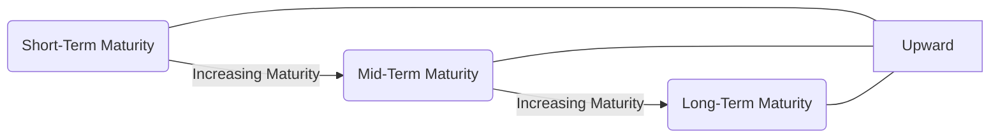

## 7.2 Term Structure of Interest Rates

The term structure of interest rates lies at the heart of fixed-income securities pricing, offering a snapshot of how bond yields vary based on maturity. In Canada, understanding the yield curve—the graphical representation of these yields over different time horizons—provides crucial insights into monetary policy shifts, economic expectations, and investment strategies. This section explores the various shapes of the yield curve, theories explaining its slope, and the practical impact on Canadian institutions and investors.

---

### Defining the Yield Curve

A yield curve plots yields (typically shown on the vertical axis) against a range of maturities (on the horizontal axis). The most commonly used yield curve references Government of Canada bonds, as these bonds are considered the benchmark for risk-free rates in Canada.

Here is an illustrative representation of a yield curve using a Mermaid diagram:

• The left side (A) shows short-term maturities.  
• The mid-point (B) indicates intermediate maturities (e.g., five-year bonds).  
• The right side (C) represents long-term maturities (e.g., 30-year bonds).

When plotted on a graph with yield on the vertical axis and time to maturity on the horizontal axis, the curve demonstrates how yields can shift based on investor expectations, central bank policy, inflation pressures, and more.

---

### Common Shapes of the Yield Curve

The yield curve can exhibit several shapes, each providing different signals about the market’s view of future economic conditions and monetary policy.

#### Normal (Upward-Sloping) Yield Curve
• Longer-term bonds typically yield more than shorter-term bonds.  
• Reflects expectations of continued economic growth, modest inflation, and stable monetary policy.  
• Often considered the “standard” shape, as investors typically demand higher premiums (yields) for taking on longer-term risk.

#### Inverted (Downward-Sloping) Yield Curve
• Occurs when short-term yields exceed long-term yields.  
• Frequently interpreted as a signal of an impending economic slowdown or recession.  
• May prompt investors to re-examine their bond portfolios, as the short end of the curve can offer better yields with less duration risk.

#### Flat Yield Curve
• Yields across short, medium, and long maturities converge and differ relatively little.  
• Often observed during economic transitions, such as the late stages of an expansion period or the early stages of a recession.  
• Can be a precursor to an inverted yield curve or a normalization phase after a flat period.

---

### Influences on the Yield Curve

Several factors drive the shape and level of the yield curve in Canada:

1. **Monetary Policy:** The Bank of Canada’s actions—raising, lowering, or holding the policy interest rate—significantly influence short-term interest rates.  
2. **Inflation Expectations:** If markets expect higher inflation, yields tend to rise to compensate investors for diminished purchasing power.  
3. **Credit Market Conditions:** In periods of market stress or liquidity shortages, investors may fly to quality (e.g., Government of Canada bonds), temporarily distorting yield relationships.  
4. **Investor Sentiment and Growth Outlook:** Expectations about the business cycle—whether expansion, peak, contraction, or trough—impact how investors position their portfolios across maturities.

---

### Theories Explaining Term Structure

Various theories seek to explain why and how long-term interest rates differ from short-term rates. While each has its nuances, together, they offer a holistic understanding of market behavior.

#### Expectations Theory

The Expectations Theory posits that the long-term yield on a bond reflects the market’s expectations for future short-term rates. For example, if investors anticipate the Bank of Canada will raise rates over time, long-term yields will incorporate these expected increases. In mathematical terms:

Let Rᵣₙ be the yield on an n-year bond, and r₁, r₂, …, rₙ be the expected short-term rates over each future period. Then,

Rᵣₙ ≈ (r₁ + r₂ + … + rₙ) / n

Where the long-term rate is essentially an average of expected short-term rates. This theory helps explain why yield curves often slope upward: if short-term rates are expected to rise, the average of future short rates will be higher than the current short-term rate.

#### Liquidity Preference Theory

According to the Liquidity Preference Theory, investors generally prefer liquidity and will require a premium for holding longer-term bonds. This premium cushions against uncertainties such as price volatility, interest-rate risk, and inflation. As a result, long-term yields will be higher than the expected short-term interest rates to compensate for the additional risk—helping explain why yield curves typically slope upward.

#### Market Segmentation Theory

This theory suggests that the bond market is “segmented” by investor preferences for specific maturities. Pension funds and insurance companies, for instance, often invest in long-term bonds to match their long-duration liabilities, while corporations with periodic liquidity needs may concentrate on shorter maturities. The supply and demand dynamics in each segment can create distinct yield patterns, contributing to a yield curve shape that might deviate from purely rational expectations.

---

### Practical Applications and Examples

#### Case Study: Portfolio Management at a Canadian Pension Fund

A large Canadian pension fund, such as the Ontario Teachers’ Pension Plan (OTPP), might have a mandate to match long-term obligations (future pension payouts) with long-term assets like 30-year Government of Canada bonds. When a normal upward-sloping yield curve is present, the fund might buy longer-term bonds to lock in higher yields. If the curve inverts, the fund might adjust its strategy—perhaps favoring shorter-term bonds or alternative asset classes—to minimize interest-rate and economic risks.

#### Example: RBC’s Treasury Operations

Royal Bank of Canada (RBC) often issues short-term and long-term debt. If the yield curve is upward sloping, RBC would find it cheaper to issue shorter-term debt (since yields are lower). Conversely, if the yield curve flattens or inverts, RBC’s decision to issue short- vs. long-term debt might reflect its view on future interest rates, potential refinancing risk, and market reception.

#### Spot Rate Curve in Practice

The spot rate curve represents the yields of zero-coupon bonds across different maturities. Practitioners often use the spot rate curve to discount each coupon of a bond to present value, providing a more precise valuation. For instance, if a five-year coupon bond has annual coupons, you would discount each coupon by the corresponding yearly spot rate. This methodology is common in advanced bond pricing tools, including certain open-source platforms in Python (e.g., libraries in the quantitative finance ecosystem like “QuantLib”).

---

### Best Practices, Common Pitfalls, and Strategies

1. **Stay Informed:** Monitor the Bank of Canada’s policy announcements and check yield curve data regularly at <https://www.bankofcanada.ca/>.  
2. **Avoid Over-Reliance on a Single Theory:** The yield curve is complex, and no single theory explains all movements. Track macroeconomic indicators, inflation data, and investor sentiment to understand yield shifts comprehensively.  
3. **Assess Market Liquidity:** Low liquidity can temporarily distort yield levels, particularly if large institutional investors move in or out of certain maturities.  
4. **Balance Long-Term and Short-Term Objectives:** Investors solely focusing on long-term bonds for higher yields may overlook the benefits of shorter-term liquidity, missing opportunities to reinvest at potentially higher rates.  
5. **Diversify Across the Curve:** Construct bond ladders (e.g., investing in 2-year, 5-year, and 10-year maturities) to hedge against unexpected shifts in the curve.  

---

### Step-by-Step Guidance: Analyzing the Yield Curve for a Canadian Portfolio

1. **Collect Data:** Obtain current yield curve figures from the Bank of Canada’s daily data by maturity buckets (e.g., 1-year, 2-year, 5-year, 10-year).  
2. **Plot the Curve:** Plot yields against maturities to visualize the current shape (normal, inverted, or flat).  
3. **Compare Historical Curves:** Determine if the curve is shifting up, down, or pivoting. Historical data can be downloaded from the Bank of Canada’s website.  
4. **Apply Theories:** Assess whether recent economic developments align with the Expectations Theory (are rate hikes expected?), Liquidity Preference Theory (are investors demanding a premium?), or Market Segmentation Theory (are certain maturities in high demand?).  
5. **Construct Scenarios:** Develop multiple scenarios (economic growth, mild recession, severe recession) and estimate how the yield curve might move.  
6. **Rebalance Portfolio:** Adjust holdings in line with expectations, liquidity needs, and risk tolerance guidelines specified by CIRO and other regulators.

---

### Regulatory and Compliance Considerations

• **CIRO (Canadian Investment Regulatory Organization):** Monitors the practices of investment dealers to ensure they provide suitable recommendations on bond allocations, factoring in yield curve conditions.  
• **CSA (Canadian Securities Administrators):** Issues guidelines on disclosure and risk assessment, which can influence how advisors communicate yield curve shifts and potential pricing impacts.  
• **Bank of Canada:** Acts as the central monetary authority, influencing short-term rates through policy decisions that profoundly affect the yield curve’s shape.  

Staying current with updates from these regulators ensures compliance when advising clients or structuring bond portfolios.

---

### Additional Resources

• **Bank of Canada Yield Curves:** <https://www.bankofcanada.ca/> for current and historical data.  
• **Canadian Securities Institute (CSI):** Provides comprehensive resources and courses on integrating yield curve analysis into portfolio management strategies.  
• **“Yield Curve Modeling and Forecasting” by Francis X. Diebold and Glenn D. Rudebusch:** An advanced guide to modeling yield curves using econometric methods.  
• **Open-Source Quantitative Finance Libraries:** Tools like “QuantLib” in Python can help model spot rates and forward rates, perform bond valuations, and analyze yield curve movements.

---

## Test Your Knowledge: Term Structure of Interest Rates Quiz



### Which term best describes a yield curve where longer-term bonds have higher yields than shorter-term bonds?

- [ ] Inverted yield curve
- [ ] Flat yield curve
- [x] Normal yield curve
- [ ] Stagnant yield curve

> **Explanation:** A normal (or upward-sloping) yield curve occurs when yields on longer-term bonds exceed those on shorter-term bonds, often reflecting expectations of economic growth and moderate inflation.

### According to the Expectations Theory, long-term rates are:

- [x] An average of expected future short-term rates
- [ ] Always higher than short-term rates
- [ ] Mainly influenced by market segments’ preferences
- [ ] Based on historical inflation data only

> **Explanation:** The Expectations Theory states that the long-term rate is the geometric or arithmetic average of expected future short-term rates, depending on the precise model used.

### If the Bank of Canada unexpectedly lowers the overnight lending rate, which part of the yield curve is likely to be most immediately affected?

- [x] Short-term maturities
- [ ] Intermediate maturities
- [ ] Long-term maturities
- [ ] Corporate high-yield bonds only

> **Explanation:** Monetary policy actions typically have a direct and immediate impact on short-term interest rates, although they can influence the entire yield curve over time.

### Which scenario is often associated with an inverted yield curve?

- [ ] Central bank tightening leads to lower short-term rates
- [x] Markets anticipating an economic downturn
- [ ] Decreasing money supply
- [ ] Major corporate default events

> **Explanation:** An inverted yield curve frequently signals that investors expect economic growth to slow or contract, which typically precedes a recession.

### Liquidity Preference Theory suggests which of the following about long-term bonds?

- [x] Investors demand a premium for locking funds longer
- [ ] They carry no additional risk over short-term bonds
- [x] They generally have higher yields due to risk premiums
- [ ] They are unaffected by short-term market fluctuations

> **Explanation:** Because investors forgo the flexibility of reinvesting, they demand extra compensation for the risk of holding longer-term bonds—often leading to an upward-sloping curve.

### Flat yield curves commonly appear in which circumstance?

- [x] During periods when economic transitions are underway
- [ ] When central banks are raising interest rates aggressively
- [ ] Only in emerging markets
- [ ] Never in stable economies

> **Explanation:** A flat yield curve often emerges in transitional periods and may precede either a normal or inverted curve, reflecting uncertainty in economic conditions.

### Under Market Segmentation Theory, the shape of the yield curve is driven primarily by:

- [x] Supply and demand in distinct maturity segments
- [ ] Central banks forcing yields up or down
- [x] Investor preferences for specific maturities
- [ ] Seasonal fluctuations in bond issuance

> **Explanation:** Market Segmentation Theory maintains that different investor groups have distinctive maturity preferences, impacting supply and demand within each segment and shaping the overall curve.

### Which yield curve strategy involves holding bonds with staggered maturities to manage reinvestment risk?

- [x] Bond laddering
- [ ] Convexity hedging
- [ ] Leverage strategy
- [ ] Yield parity trading

> **Explanation:** A bond ladder is a strategy in which an investor allocates funds to multiple maturities, spreading out reinvestment points and balancing short-term liquidity with longer-term yields.

### Which institution provides official Canadian yield curve data and influences short-term interest rates through monetary policy decisions?

- [x] Bank of Canada
- [ ] Canada Revenue Agency
- [ ] Canadian Securities Institute
- [ ] TSX Venture Exchange

> **Explanation:** The Bank of Canada sets the policy rate and publishes daily yield curve information for Government of Canada bonds, playing a critical role in shaping the term structure of interest rates.

### Spot rates are typically associated with zero-coupon bonds and help to value coupon bonds accurately.

- [x] True
- [ ] False

> **Explanation:** By discounting each bond coupon and its principal with the appropriate spot rate, a more precise valuation is achieved than using a single yield-to-maturity figure.



---

## For Additional Practice and Deeper Preparation

**Elevate your exam readiness with our comprehensive app, "Securities CA: Mock Exams," designed to challenge and refine your skills.**

* **Master Challenging Questions:** Dive into expertly crafted sample exam questions that go beyond standard references.
* **Scenario-Driven Learning:** Experience scenario-driven case questions and in-depth solutions to build practical expertise.
* **Sharpen Exam Strategies:** Build confidence with step-by-step explanations designed to refine your exam-day tactics.
* **Gain Real-World Insights:** Acquire practical tips and detailed rationales that demystify complex concepts.
* **CIRO and CSI Alignment:** Stay current with CIRO guidelines and CSI’s exam structure, with questions intentionally more challenging than the actual exam.

**Download the App Today:**

> Note: While these courses are specifically crafted to align with the CSC® exams outlines, they are independently developed and not endorsed by CSI or CIRO.
