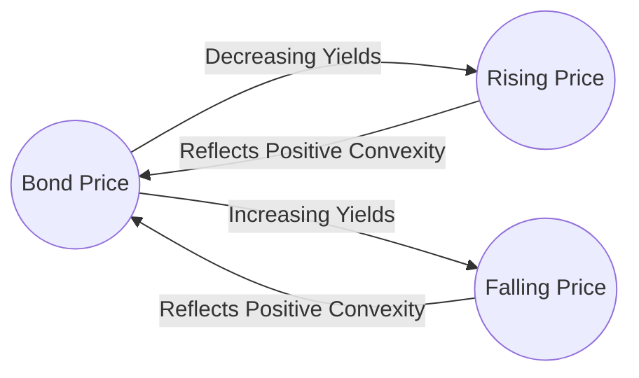

## 7.3 Fundamental Bond Pricing Properties

Bond pricing in Canada—or any modern capital market—is shaped by how sensitive a bond’s price is to fluctuations in interest rates, shifts in the issuer’s credit profile, and other market factors such as coupon and maturity. This section provides a comprehensive understanding of the core principles driving bond price movements, focusing on Canadian regulations, examples, and practical insights.

---

### Introduction

Investors purchase fixed-income securities (bonds) to receive regular coupon payments and the eventual return of principal at maturity. However, if prevailing market interest rates change, the value (price) of these bonds will typically move in the opposite direction of interest rates. This inverse relationship is due to new security issuance becoming more (or less) attractive relative to existing bonds. The extent of this price change is governed by several key properties:

• Duration (including Modified Duration)  
• Convexity  
• Coupon Rate  
• Maturity  
• Credit Risk  

Mastering these core concepts empowers investors to anticipate bond price volatility, hedge interest rate risk more effectively, and make more informed portfolio decisions in the Canadian market.

---

### Interest Rate Sensitivity (Duration)

Duration measures how sensitive a bond’s price is to changes in interest rates. In essence, it represents the average time (in years) an investor needs to wait to receive all coupon and principal payments, weighted by their present value. Duration is one of the most important metrics for fixed-income analysis in Canada and around the world.

#### Macauley Duration vs. Modified Duration

• **Macauley Duration**:  
  – The classic definition of duration.  
  – Represents the weighted average time to receive all cash flows (coupons and final principal redemption).

• **Modified Duration**:  
  – Adjusts Macauley Duration to estimate the sensitivity of bond price to a change in yield.  
  – A Modified Duration of 5 implies that if the bond’s yield rises by 1%, the bond’s price will drop by approximately 5%, and vice versa.  

#### Practical Example

Imagine RBC issues a 5-year bond with an annual coupon of 2.5%. Suppose its Modified Duration is calculated at 4.2. If the yield of this bond suddenly increases by 1% (e.g., from 3% to 4%), the price of the bond is expected to decrease by roughly 4.2%. The reverse applies if yields fall.

#### Why Duration Matters to Canadian Investors

• **Portfolio Immunization**: Pension funds (like the Canada Pension Plan Investment Board) or large institutional investors use duration strategies to match asset and liability durations, mitigating interest rate risk.  
• **Risk Management**: You can dynamically hedge interest rate exposure in a portfolio by balancing high-duration assets (longer maturity, lower coupons) with short-duration holdings.  

---

### Convexity

Convexity refines the understanding of price sensitivity by illustrating how duration changes as yields fluctuate. It accounts for the curvature in the price–yield relationship.

• **Positive Convexity**: Bonds typically exhibit positive convexity, meaning that when interest rates drop, bond prices rise more than the duration estimate would predict. Conversely, when interest rates rise, bond prices fall less than the duration estimate would predict.  
• **Higher Convexity**: Usually found in lower-coupon or longer-term bonds. These bonds benefit more from falling interest rates but also lose more value when rates rise (compared to a similar bond with lower convexity).  

Below is a simplified depiction of the bond price–yield curve, showing convexity:

In this diagram, the curvature around the bond price node illustrates that the rate of price change is not a straight line but bends based on convexity.

---

### Coupon Effect

The coupon rate influences duration and price volatility:

• **Lower-Coupon Bonds**:  
  – Typically have a higher duration (all else being equal), making them more sensitive to interest rate changes.  
  – Offer less cash flow in earlier years, so more of the bond’s total value is concentrated in its final redemption, extending the effective “time” investors must wait for payments.

• **Higher-Coupon Bonds**:  
  – Usually have a lower duration, because they provide investors with more immediate cash flows.  
  – Less sensitive to rising interest rates relative to lower-coupon bonds.

Example:  
A 3.0% coupon bond issued by a provincial government (like the Province of Ontario) usually experiences smaller percentage price swings than a 1.5% coupon bond of the same maturity, because the higher coupon helps offset changes in interest rates by providing more income throughout the bond’s lifespan.

---

### Maturity Effect

Maturity is a crucial determinant of bond risk:

• **Longer-Maturity Bonds**:  
  – Exposed to interest rate risk for a longer period of time, thus they tend to be more volatile.  
  – Typically have a higher duration, particularly if coupon rates are low.

• **Shorter-Maturity Bonds**:  
  – Less price sensitive to interest rate moves because principal repayment is closer, reducing investor uncertainty.

Example:  
A 10-year TD Bank bond with a 3.2% coupon will generally display more price volatility than a 2-year TD Bank bond with a 3.2% coupon, simply because the market perceives more potential shifts in rates over the next decade than over two years.

---

### Credit Risk Impact

In addition to interest rate risk, bond prices can also fluctuate due to changes in credit risk perceptions:

• **Credit Profile**: A downgrade from top rating agencies recognized by Canadian regulators (DBRS Morningstar, S&P Global Ratings, Moody’s) can increase the issuer’s credit spread, lowering bond prices.  
• **Credit Spread**: The extra yield investors demand to compensate for default risk, relative to a risk-free benchmark such as Government of Canada bonds. As credit spreads widen, bond prices drop.

For instance, if market participants develop concerns about a corporate issuer’s ability to repay its debt, the yield demanded by investors will increase—even if general interest rates remain stable. This results in a price decline for that issuer’s existing bonds.

---

### Best Practices and Common Pitfalls

1. **Best Practices**:  
   – Continuously monitor both interest rate trends and the credit profile of your holdings, especially for corporate or high-yield bonds.  
   – Consider using tools like QuantLib—an open-source library with sophisticated bond analytics and risk metrics—to perform scenario analysis on your portfolio.  
   – Stay updated on regulations from the Office of the Superintendent of Financial Institutions (OSFI) (https://www.osfi-bsif.gc.ca/) that influence the capital adequacy and risk management requirements for financial institutions.  

2. **Common Pitfalls**:  
   – Focusing solely on interest rate risk without accounting for potential credit spread widening.  
   – Ignoring the coupon rate’s effect and inadvertently holding portfolios with excessively high duration.  
   – Overlooking the maturity effect, assuming shorter-term bonds have similar volatility profiles to longer-term instruments.  

---

### Applying These Properties in a Canadian Context

A balanced fixed-income portfolio might include both federal and provincial government bonds and investment-grade corporate bonds from major Canadian banks, with laddered maturities to manage interest rate risk. Investors could also add higher-yielding corporate bonds for enhanced returns but must carefully monitor credit rating changes to avoid excessive price volatility.

---

### Glossary of Terms

• **Duration (Macauley Duration)**: The weighted average time (in years) an investor must wait to receive all coupon and principal payments.  
• **Modified Duration**: Adjusts Macauley Duration to quantify a bond’s percentage price change for a 1% change in yield.  
• **Convexity**: Measures the curvature of the price-yield relationship. Higher convexity provides an additional cushion against interest rate fluctuations.  
• **Credit Spread**: The difference in yield between a corporate or lower-rated bond and a comparable risk-free government bond, reflecting credit risk.

---

### Additional Resources and References

• Credit Rating Agencies in Canada: DBRS Morningstar, S&P Global Ratings, Moody’s Investors Service  
• [Office of the Superintendent of Financial Institutions (OSFI)](https://www.osfi-bsif.gc.ca/)  
• QuantLib: An open-source library for advanced bond analytics and interest rate risk metrics  
• Fabozzi, Frank. “Handbook of Fixed Income Securities” – A comprehensive resource for advanced bond pricing and risk management.

---

## Test Your Knowledge: Fundamental Bond Pricing Properties Quiz



### Which metric gives a bond’s sensitivity to changes in interest rates?

- [x] Modified Duration
- [ ] Maturity
- [ ] Coupon Rate
- [ ] Convexity

> **Explanation:** Modified Duration measures how much the bond’s price changes with a 1% change in yield.

### How does higher convexity generally affect a bond’s price response when interest rates drop?

- [ ] It reduces the price increase.
- [x] It increases the price increase.
- [ ] It has no effect on price changes.
- [ ] It only affects coupon payments.

> **Explanation:** High convexity means a bond’s price increases more than duration alone would suggest when rates decline.

### Which of the following tends to have the highest interest rate sensitivity?

- [ ] A 1-year bond with a 3% coupon
- [ ] A 2-year bond with a 5% coupon
- [x] A 10-year bond with a 2% coupon
- [ ] A 5-year bond with a 5% coupon

> **Explanation:** Longer maturity and lower coupon together increase duration, resulting in higher price volatility.

### What is a credit spread?

- [ ] The difference in price between two classes of stock
- [ ] A measure of a bond’s interest rate risk
- [x] The yield difference between a corporate bond and a comparable risk-free bond
- [ ] The coupon payment minus accrued interest

> **Explanation:** Credit spread represents the additional yield investors require for taking on higher credit risk versus government bonds.

### Which statement is true about a bond’s duration?

- [x] Duration typically decreases as the coupon rate increases.
- [ ] Duration is higher for short-term bonds than long-term bonds.
- [ ] Duration isn’t influenced by changes in yield.
- [ ] Duration remains constant over a bond’s life.

> **Explanation:** Higher coupon payments lower the average time to recover cash flows, thus lowering duration.

### If a bond has a Modified Duration of 5 and yield increases by 1%, which outcome is most likely?

- [ ] The bond’s price remains unchanged.
- [ ] The bond’s price increases by 5%.
- [x] The bond’s price decreases by about 5%.
- [ ] The bond’s price decreases by about 1%.

> **Explanation:** Modified Duration indicates the approximate percentage change in price for a given change in yield.

### Which Canadian institution oversees capital adequacy guidelines that affect bond-issuing financial entities?

- [ ] Canada Revenue Agency
- [x] Office of the Superintendent of Financial Institutions (OSFI)
- [ ] S&P Global Ratings
- [ ] Ontario Securities Commission

> **Explanation:** OSFI is responsible for monitoring and guiding capital adequacy and risk management at Canadian financial institutions.

### Which factor primarily explains why long-term bonds are more sensitive to interest rate changes than short-term bonds?

- [x] They have a longer duration, exposing them to rate changes over a longer period.
- [ ] They have more stable coupon payments.
- [ ] They are issued only by corporations, not governments.
- [ ] Their coupon payments adjust automatically with interest rates.

> **Explanation:** Longer maturity means more time for interest rate fluctuations to impact the bond’s cash flows.

### How does higher coupon income typically affect duration?

- [x] It lowers duration because investors recover more of their investment sooner.
- [ ] It always doubles duration regardless of bond maturity.
- [ ] It eliminates duration sensitivity altogether.
- [ ] It has no effect on duration.

> **Explanation:** Higher coupons mean investors receive more money in the near term, reducing the bond’s weighted average time to cash flows.

### Convexity ensures that bond price changes are linear with respect to interest rate changes.

- [ ] True
- [x] False

> **Explanation:** Convexity implies a curved relationship. Bond price changes are not strictly linear with interest rate changes.



---

## For Additional Practice and Deeper Preparation

**Elevate your exam readiness with our comprehensive app, "Securities CA: Mock Exams," designed to challenge and refine your skills.**

* **Master Challenging Questions:** Dive into expertly crafted sample exam questions that go beyond standard references.
* **Scenario-Driven Learning:** Experience scenario-driven case questions and in-depth solutions to build practical expertise.
* **Sharpen Exam Strategies:** Build confidence with step-by-step explanations designed to refine your exam-day tactics.
* **Gain Real-World Insights:** Acquire practical tips and detailed rationales that demystify complex concepts.
* **CIRO and CSI Alignment:** Stay current with CIRO guidelines and CSI’s exam structure, with questions intentionally more challenging than the actual exam.

**Download the App Today:**

> Note: While these courses are specifically crafted to align with the CSC® exams outlines, they are independently developed and not endorsed by CSI or CIRO.
