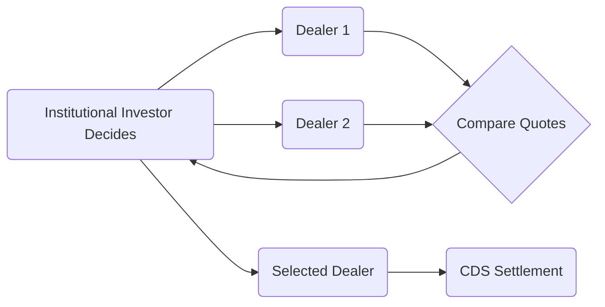

## 7.4 Bond Market Trading

Bond markets are central to the global financial system, facilitating the flow of capital between issuers—governments, municipalities, and corporations—and investors such as pension funds, banks, and individuals. In Canada, bond market structures involve various trading venues, regulatory requirements, and best practices that participants need to navigate to achieve optimal outcomes. This section explores the nuances of bond market trading in Canada, focusing on Over-the-Counter (OTC) trading versus exchange platforms, differences in liquidity and spreads across bond categories, the critical role of dealers and brokers, settlement conventions, and emerging trends such as electronic trading platforms.

---

## Overview of the OTC and Exchange-Traded Bond Markets

### Bond Market Structures

In Canada, most bond trading happens in the Over-the-Counter (OTC) market, which is a decentralized marketplace where dealers negotiate directly with buyers and sellers. Individuals, institutional investors (e.g., pension funds), and investment dealers conduct transactions primarily via telephone or electronic communication networks (ECNs). As opposed to stocks—commonly listed on centralized exchanges such as the Toronto Stock Exchange (TSX)—very few bonds are listed on exchanges.

Exchange-traded bond products do exist, most notably fixed-income exchange-traded funds (ETFs). These ETFs hold various baskets of fixed-income securities, allowing retail and institutional investors alike to gain instant exposure to diversified bond portfolios. Bond ETFs trade on exchanges, offering transparency in pricing and real-time liquidity, but the underlying bonds typically remain traded OTC at the dealer level.

### Key Advantages and Challenges of OTC Trading

• Advantages:  
  – Negotiated pricing: Dealers can provide flexible pricing based on dynamic market conditions, investor relationships, and specialist knowledge of specific bonds.  
  – Wide range of instruments: OTC dealers offer access to a broad spectrum of bond issuers (federal, provincial, municipal, and corporate) and maturities that might not be available on an exchange.  
  – Deeper liquidity: Large institutional orders can often find a counterparty more efficiently with an OTC dealer network.  

• Challenges:  
  – Potentially wider spreads: Liquidity can be uneven, especially for lower-rated bonds or those from smaller issuers, translating into higher bid-ask spreads.  
  – Limited transparency: Unlike exchange order books, OTC transactions are generally not visible in real time, although post-trade reporting requirements in Canada do enhance transparency.  
  – Counterparty risk: Buyers and sellers in the OTC market typically rely on dealer creditworthiness to ensure settlement.  

---

## Trading Characteristics of Different Bond Categories

### Government of Canada Bonds

• Issued by the federal government, these bonds (and Treasury bills) are considered to have the lowest credit risk in the Canadian market.  
• The high trading volumes and stable investor demand for Government of Canada bonds foster tight bid-ask spreads and robust liquidity.  
• These securities are commonly used as benchmarks for pricing corporate issues and are integral to the risk management strategies of financial institutions.

### Provincial and Municipal Bonds

• Provincial bonds, also referred to as “provincials,” carry a higher yield than federal bonds because of slightly higher credit risk and lower liquidity.  
• Municipal (or “muni”) bonds fund local government projects such as infrastructure, schools, and transit systems. They can be relatively less liquid than provincial bonds, but they fill a critical need in the fixed-income ecosystem.  
• Trading spreads and volumes can vary widely among provinces and municipalities, reflecting differences in fiscal positions, debt levels, and market demand.

### Corporate Bonds

• Corporate bonds in Canada encompass a large range of credit qualities, from highly rated (investment-grade) issuers to more speculative, high-yield offerings.  
• Liquidity and trading spreads for corporate bonds depend significantly on the issuer’s credit rating, sector, and issuance size.  
• Investment-grade corporate bonds—such as those from major banks like RBC or TD—tend to trade with comparatively lower spreads than high-yield issuances from smaller or riskier companies.

---

## Role of Dealers and Brokers

### Market-Making and Inventory

Investment dealers play an essential part in bond markets by acting as intermediaries:  
• Market Liquidity: Dealers use their capital to hold inventory in various bonds, enabling them to offer immediate execution for buy or sell orders.  
• Price Discovery: By posting bid and ask prices—and updating them as market conditions change—dealers facilitate fair pricing of bonds.  
• Specialized Research and Sales: Many dealers maintain relationships with institutional clients, providing bespoke research, market insights, and advice for portfolio management.

### Regulatory Oversight and Best Execution

Dealers operating in Canada must comply with regulations set by the Canadian Investment Regulatory Organization (CIRO). Key CIRO obligations include:  
• Best Execution: Dealers are required to obtain the most advantageous execution terms for their clients, considering factors like price, speed, and likelihood of execution.  
• Transparency and Reporting: Dealers must follow post-trade transparency rules, ensuring timely reporting of trades.  
• Code of Conduct: Robust internal controls, compliance protocols, and high ethical standards are core requirements in maintaining investor confidence.

For more details on best execution policies, refer to CIRO’s official documents at [www.ciro.ca](https://www.ciro.ca/).

---

## Settlement Conventions in the Canadian Bond Market

### Standard T+2 Cycle

Bond market transactions in Canada typically settle on a T+2 basis—meaning the settlement date is two business days after the trade date. This timeline applies to most Government of Canada, provincial, municipal, and corporate bonds.

### Accrued Interest and Clean vs. Dirty Pricing

Unlike stocks, bonds often trade with accrued interest that accumulates between coupon payments.  
• Clean Price: The quoted price for a bond, excluding accrued interest.  
• Dirty Price: The price investors actually pay at settlement; it equals the clean price plus accrued interest.  

During settlement, the Canadian Depository for Securities (CDS) handles the clearing and settlement infrastructure, ensuring orderly and accurate disbursement of payments and transfer of title.

### Example Calculation of Dirty Price

Suppose you buy a bond with a clean price of $1,000. Suppose the bond’s annual coupon is 4% ($40 per year), paid semi-annually ($20 every six months). If you purchase the bond exactly halfway between coupon dates (i.e., it has accrued three months of interest since the last coupon), then:

• Accrued Interest for three months = (Coupon per year / 12 × number of months accrued)  
• For a semi-annual coupon of $20, the monthly interest is $20 / 6 ≈ $3.33. Over three months, accrued interest is 3 × $3.33 = $9.99.  
• Dirty Price = Clean Price + Accrued Interest = $1,000 + $9.99 ≈ $1,009.99.

---

## Electronic Trading Platforms

### Shift to Electronic Markets

Historically, bond trading revolved around telephone-based negotiations. Over the past decade, increased adoption of electronic trading systems has aimed to enhance price transparency, reduce transaction costs, and accelerate execution. Institutional investors increasingly use electronic platforms to request quotes from multiple dealers simultaneously, creating a mini-auction dynamic that can lead to tighter bid-ask spreads.

### Canadian Electronic Bond Platforms

• CanDeal ([www.candeal.com](https://www.candeal.com/)): A leading electronic marketplace for Canadian dollar debt securities, providing real-time quotes from multiple dealers.  
• CBID: Focuses primarily on retail-oriented fixed-income trading, enabling users to compare multiple offerings for bonds, GICs, and other fixed-income instruments.  
• MarketAxess, Bloomberg, and Tradeweb: While more global in scope, these platforms also serve Canadian institutions seeking cross-border trades or a broader range of liquidity pools.

### Benefits and Considerations

• Benefits:  
  – Greater Price Transparency: Investors can easily compare quotes, reducing the likelihood of overpaying or receiving suboptimal bids.  
  – Faster Execution: Automated processes handle multiple quotes simultaneously, often cutting down on manual negotiations.  
  – Audit Trail: Electronic platforms maintain timestamped records of orders and execution, aiding regulatory compliance.  

• Considerations:  
  – Limited Depth for Certain Issues: Some less-liquid bonds may still require a traditional phone-based negotiation to find a counterparty willing to provide a fair price.  
  – Technological Requirements: Institutional investors must maintain robust connectivity and cybersecurity measures.  
  – Evolving Regulation: As electronic trading grows, CIRO and other organizations might implement additional rules aimed at ensuring fair access and competition.  

---

## Practical Example: Trading a Provincial Bond via OTC

Imagine a pension fund wants to purchase $10 million in Ontario provincial bonds maturing in 2030 for yield pickup compared to an equivalent federal government bond. The fund’s manager might:  
1. Contact multiple dealers—such as RBC Capital Markets, TD Securities, and BMO Nesbitt Burns—to request quotes.  
2. Compare yield and price quotes, factoring in the credit rating of the province, maturity date, and potential market volatility.  
3. Select the dealer offering the best combination of price and trade execution reliability, ensuring that the estimated yield aligns with the pension fund’s investment mandate.  
4. Execute the trade via the dealer’s OTC desk, finalizing settlement instructions with CDS for a T+2 settlement.  
5. Pay the dirty price, which includes accrued interest, and reflect the newly acquired securities on the pension fund’s balance sheet on the settlement date.

---

## Best Practices and Common Pitfalls

### Best Practices

• Diversify Dealer Relationships: Maintaining relationships with multiple dealers helps investors compare quotes for better pricing.  
• Stay Informed on Credit Conditions: Monitor issuer fundamentals, credit rating changes, and macroeconomic factors only to understand potential shifts in spreads.  
• Leverage Electronic Platforms: For improved price comparisons, especially on liquid, high-grade bonds where multiple dealers are active.  
• Monitor Regulations: Keep abreast of CIRO guidance on best execution, transparency, and corporate governance changes that can affect bond pricing.

### Common Pitfalls

• Overlooking Liquidity Risks: Lower-tier corporate or thinly traded municipal bonds may incur larger spreads and pose challenges if you need to sell quickly.  
• Ignoring Settlement Nuances: Failing to account for accrued interest can lead to unexpected costs at settlement.  
• Focusing Solely on Yield: Investors who chase the highest yields without considering credit risk and duration can face large mark-to-market losses if interest rates or credit quality shift unfavorably.

---

## Diagram: Simplified OTC Bond Trading Flows

Below is a simple Mermaid.js diagram illustrating how a trade flows between an institutional investor, multiple dealers, and the clearing system:

• The institutional investor checks pricing from multiple dealers.  
• After comparing quotes, the investor decides on a single dealer for execution.  
• The dealer coordinates settlement through CDS.

---

## Glossary

• **OTC (Over-the-Counter) Market:** A decentralized market where participants trade fixed-income instruments directly without using a formal exchange.  
• **Liquidity:** The ease with which a bond can be bought or sold in the market without significantly affecting the price.  
• **Spread:** The difference between the bid price (dealers buy at) and the ask price (dealers sell at). For bonds, it can also refer to the yield difference over risk-free benchmarks.  
• **T+2 Settlement:** The standard settlement cycle where a trade settles two business days after the trade date.  

---

## Regulatory and Supplemental Resources

• **CIRO Rules on Best Execution** ([www.ciro.ca](https://www.ciro.ca/)): CIRO provides guidelines ensuring client orders and trades receive the most advantageous execution terms.  
• **Canadian Depository for Securities (CDS)**: Central clearing and settlement for the Canadian fixed-income market.  
• **CanDeal** ([www.candeal.com](https://www.candeal.com/)) and **CBID**: Key electronic trading venues for Canadian bonds.  
• **“Debt Markets and Analysis” by R. Stafford Johnson**: In-depth perspective on global bond structures, with relevant insights for Canadian markets.

---

## Key Takeaways

1. Most Canadian bond trading is OTC, offering flexibility but potentially less transparency compared to exchange markets.  
2. Government of Canada bonds typically exhibit the tightest spreads due to strong liquidity and low credit risk.  
3. Settlement for most bonds follows a T+2 cycle, with accrued interest added to the clean price.  
4. Electronic trading platforms are increasingly important for price discovery, particularly for large institutional trades.  
5. Compliance with CIRO regulations is essential for maintaining market integrity and investor confidence.

---

## Quiz: Bond Market Trading in Canada



### What is the primary way most bonds trade in Canada?  
- [x] Through Over-the-Counter (OTC) markets, facilitated by dealers.  
- [ ] On regulated exchanges, such as the Toronto Stock Exchange.  
- [ ] Via central limit order books operated by government agencies.  
- [ ] Exclusively through online electronic networks for retail investors.  

> **Explanation:** The vast majority of Canadian bonds trade through OTC markets, where dealers connect buyers and sellers privately.

### Which type of bond typically trades with the tightest spreads in Canada?  
- [x] Government of Canada bonds.  
- [ ] Municipal bonds.  
- [ ] High-yield corporate bonds.  
- [ ] Preferred shares.  

> **Explanation:** Government of Canada bonds have high liquidity and are considered the least risky, resulting in tighter bid-ask spreads.

### What does T+2 mean in the context of Canadian bond settlement?  
- [x] The trade settles two business days after execution.  
- [ ] There is a two-minute settlement window to finalize the trade.  
- [ ] Two months elapse before funds and securities exchange hands.  
- [ ] Settlement is delayed until the second business day of the following month.  

> **Explanation:** T+2 is the standard settlement cycle for Canadian bond trades, meaning completion occurs two business days after the trade date.

### What is the difference between a bond’s clean price and dirty price?  
- [x] A bond’s dirty price includes accrued interest, while the clean price does not.  
- [ ] A bond’s dirty price is adjusted for credit risk, while the clean price is not.  
- [ ] The dirty price is always below the face value, while the clean price is always above.  
- [ ] There is no significant difference; both terms are used interchangeably.  

> **Explanation:** Dirty price = Clean price + Accrued interest. Investors pay the dirty price at settlement.

### In the OTC market, what is the primary role of investment dealers in bond trading?  
- [x] They provide market liquidity and maintain inventories of bonds for client trades.  
- [ ] They only track bond index performance on behalf of the central bank.  
- [x] They set official interest rates for government securities.  
- [ ] They do not participate in the bond market; only clearing houses do.  

> **Explanation:** Investment dealers act as intermediaries, quoting prices, facilitating trades, and sometimes holding an inventory of bonds to ensure liquidity.

### Which of the following is an example of an electronic bond trading platform in Canada?  
- [x] CanDeal  
- [ ] TSX Venture Exchange  
- [ ] New York Stock Exchange  
- [ ] Forex Board  

> **Explanation:** CanDeal is a well-known electronic marketplace for Canadian dollar debt securities, offering real-time prices from multiple dealers.

### When might bond trading rely more heavily on telephone negotiations rather than electronic platforms?  
- [x] For illiquid or specialized bonds with a small pool of potential buyers and sellers.  
- [ ] For high-grade, highly liquid Government of Canada bonds.  
- [ ] For trades that need no price consolidation.  
- [ ] For trades under $100.  

> **Explanation:** Less-liquid bonds often require more negotiation and relationship-driven trading, making telephone-based transactions more practical.

### What role does the Canadian Depository for Securities (CDS) play in the Canadian bond market?  
- [x] CDS provides clearing and settlement infrastructure for bond transactions.  
- [ ] CDS sets interest rates and issues government bonds.  
- [ ] CDS regulates bond dealers and mutual funds.  
- [ ] CDS acts as a rating agency for corporate issuers.  

> **Explanation:** CDS ensures proper clearing and settlement of trades, transferring ownership and payments securely between parties.

### What is a primary benefit of using electronic trading platforms for bond transactions?  
- [x] Improved price transparency through real-time quote comparisons.  
- [ ] Guarantee of no commissions on trades.  
- [ ] Elimination of any settlement risk.  
- [ ] Complete protection against fluctuations in interest rates.  

> **Explanation:** Electronic platforms centralize quotes from multiple dealers, making it easier for buyers to ensure a competitive price.

### Liquidity in the bond market refers to:  
- [x] The ability to buy or sell a bond easily without causing major price movements.  
- [ ] The speed at which coupons are paid by the issuer.  
- [ ] The bond’s face value being adjusted daily by the exchange.  
- [ ] The principle of buying lower-rated bonds to achieve higher returns.  

> **Explanation:** Liquidity measures how quickly and efficiently a security can be traded with minimal price impact.



---

