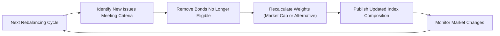

## 7.5 Bond Indexes

Bond indexes serve as critical benchmarks in the fixed-income market. They help investors, portfolio managers, and analysts measure trends, assess performance, and evaluate risk. By tracking a basket of bonds that share similar characteristics—such as issuer type, maturity range, and credit quality—bond indexes provide a snapshot of market conditions and a comparative yardstick for managed bond portfolios. In this section, we explore the importance, construction, and application of bond indexes within the Canadian financial landscape.

---

## Purpose and Importance of Bond Indexes

### Benchmarking and Performance Measurement
Bond indexes act as benchmarks that reflect the performance of specific segments of the bond market. When a Canadian pension fund or a mutual fund manager wants to evaluate the effectiveness of their bond investment strategy, they typically compare their portfolio returns to a relevant bond index (e.g., the FTSE Canada Universe Bond Index). By doing so, they can determine whether their active management decisions have added value relative to a passive or “baseline” approach.

### Market Transparency and Insight
Indexes also enhance market transparency, offering a concise measure of how a particular bond market segment performs over time. Investors can spot trends in interest rates, credit spreads, and issuers’ market sentiment by observing index fluctuations—helping them make well-informed decisions about allocating assets, modifying bond maturities, or adjusting credit exposure.

### Role in Passive Investing
The popularity of passive investing has grown in the bond market, much as it has in equities. Investors and portfolio managers can use exchange-traded funds (ETFs) or index mutual funds that replicate a bond index, aiming to match its returns rather than outperform it. This strategy often provides lower cost, broad diversification, and convenience.

---

## Key Canadian Bond Indexes

Canada’s bond market boasts several widely tracked bond indexes published by credible institutions such as FTSE Russell, MSCI, and other providers. Among them, the FTSE Canada Universe Bond Index is one of the most recognized benchmarks.

### FTSE Canada Universe Bond Index
• Encompasses a broad range of investment-grade government and corporate bonds denominated in Canadian dollars.  
• Commonly used by Canadian portfolio managers to benchmark the performance of active bond funds or institutional portfolios.  
• Includes both short-term, mid-term, and long-term maturities, providing a comprehensive view of Canada’s investment-grade bond market.

### Other Canadian Bond Indexes
• FTSE Canada Short Term Bond Index: Focuses on shorter-dated issues, primarily capturing bonds with lower interest rate risk.  
• FTSE Canada Long Term Bond Index: Tracks longer maturity issues, including both government and high-quality corporate debt.  
• MSCI Fixed Income Indexes: Although primarily known for equity indexes, MSCI also provides global fixed-income indexes that can include Canadian bonds.

---

## Index Construction and Methodology

### Inclusion Criteria
Each index provider establishes specific rules determining which bonds merit inclusion in the benchmark. Typical requirements may include:  
• Minimum issue size (e.g., $100 million or more) to ensure sufficient liquidity.  
• Credit rating threshold (e.g., only investment-grade ratings of BBB- or higher).  
• Specified maturity range (e.g., at least one year to maturity).  

By enforcing these inclusion standards, indexes aim to capture securities that accurately represent the investable portion of the market.

### Weighting Methods

#### Market Capitalization Weighting
Most bond indexes assign weight according to market capitalization (i.e., the total value of outstanding debt). Larger issuers with more debt outstanding, such as the Government of Canada or major financial institutions like RBC and TD, carry a greater weight in the index.

#### Alternative Weighting (e.g., Fundamental Weighting)
Some indexes use non-traditional weighting schemes. For instance, fundamental weighting may base a bond’s weight on metrics such as the issuer’s credit quality, cash flows, or the economic footprint—rather than face value or market capitalization.  
• Pros: May reduce concentration risk in highly indebted issuers.  
• Cons: Can be more complex and require frequent data updates, potentially increasing index turnover and costs.

### Rebalancing Frequency
Index providers typically rebalance their bond indexes monthly, quarterly, or semi-annually to ensure that:  
• Newly issued bonds meeting the criteria are added.  
• Bonds that no longer meet rating or maturity requirements are removed.  
• Weights are adjusted to reflect changes in outstanding debt and market valuations.

Below is a simplified diagram illustrating the rebalancing process for a bond index:

---

## Using Bond Indexes for Passive Investing

### ETFs and Index Mutual Funds
In Canada, passive investing has grown in popularity for fixed-income portfolios. One method of implementing a passive bond strategy is through ETFs that track indexes like the FTSE Canada Universe Bond Index or through index mutual funds. Investors gain broad market coverage, often with lower fees and reduced tracking error compared to active strategies.  

### Strategic Asset Allocation
Bond indexes help guide strategic asset allocation decisions. For instance, a Canadian investor seeking exposure to the mid-term government bond market might use an index-based ETF tracking the FTSE Canada Short Term or Mid Term Bond Index. By combining these products, investors can tailor their fixed-income exposures to align with their risk tolerance, investment timeline, or yield expectations.

### Challenges of Passive Bond Investing
• Liquidity Constraints: Some segments (e.g., high-yield corporate bonds, provincial bonds) may have limited liquidity.  
• Tracking Error: The mismatch between the ETF (or fund) and the underlying index can lead to minor performance deviations.  
• Interest Rate Sensitivity: Bond indexes inherently come with duration risk; longer durations mean higher sensitivity to interest rate changes.

---

## Case Study: Canadian Pension Fund Portfolio

Consider a hypothetical Canadian pension fund aiming to match the performance of the FTSE Canada Universe Bond Index through passive investing. The fund’s manager might take the following approach:

1. Purchase an ETF matching the index’s composition (e.g., an RBC or TD ETF designed specifically to replicate this index).  
2. Periodically review the portfolio’s duration and credit quality to ensure alignment with the index.  
3. Monitor rebalancing activities from the ETF provider.  
4. Generate returns in line with the index while minimizing active management fees and mitigating transaction costs.

This simplified structure allows the pension fund to meet its liability-driven investment strategy needs—seeking relatively stable income and matching the overall broad market’s performance.

---

## Glossary of Key Terms

• **Bond Index:** A statistics-based measure tracking a specific segment of the bond market.  
• **Benchmark:** A reference point used to evaluate the performance of portfolios or strategies.  
• **Market Capitalization Weighting:** Allocating index weights according to the total market value of each issuer’s outstanding debt.  
• **Fundamental Weighting:** An alternative weighting method that considers issuer fundamentals (cash flows, financial metrics) instead of or in addition to market capitalization.  
• **Rebalancing:** The periodic process of updating index constituents and weights to maintain alignment with the index methodology.

---

## Regulatory and Professional Resources

• **CIRO (Canadian Investment Regulatory Organization):** Sets standards and regulations for investment industry participants, ensuring integrity.  
• **CSA (Canadian Securities Administrators):** Coordinates and harmonizes regulation across Canada’s provincial and territorial securities commissions.  
• **Bank of Canada:** Influences monetary policy; bond markets are sensitive to changes in interest rates and the Bank’s policy rate announcements.  
• **FTSE Russell Canada:** (https://www.ftserussell.com/) Publishes widely tracked Canadian bond indexes, such as the FTSE Canada Universe Bond Index.  
• **MSCI Fixed Income Indexes:** An alternative global index provider for broader or specialized coverage.  
• **Portfolio Management Association of Canada (PMAC):** Offers resources on best practices for portfolio managers seeking to implement indexing strategies.  
• **The Journal of Portfolio Management:** Features academic and practitioner research on fixed-income indexing strategies.

---

## Practical Tips and Best Practices

1. **Selecting the Right Benchmark:** Align the index choice with your portfolio’s mandate, whether that’s short-duration government bonds, corporate bonds, or a broad-market index.  
2. **Monitoring Duration and Credit Quality:** Ensure your portfolio’s interest rate exposure and credit quality match that of your chosen benchmark to avoid undue risk divergence.  
3. **Understanding Rebalancing Costs:** Index changes can incur trading costs. Choose products with efficient rebalancing protocols to minimize tracking error.  
4. **Evaluating Tracking Error:** Always compare your returns to the benchmark to determine if the passive strategy stays on track.  
5. **Staying Informed on Regulation:** Keep abreast of changes from CIRO, CSA, or the Bank of Canada, as regulatory shifts and interest rate updates can substantially affect bond market movements.

---

## Summary and Next Steps

Bond indexes are an indispensable tool for investors and portfolio managers in Canada’s fixed-income marketplace. Tracking market segments, measuring performance, and implementing passive strategies all hinge on selecting high-quality benchmarks and understanding their construction methodologies. Whether using an ETF or index mutual fund to replicate these benchmarks, investors need to regularly monitor for rebalancing, liquidity concerns, and tracking error.

From broad-market indexes like the FTSE Canada Universe Bond Index to more specialized products, bond indexes keep you aligned with market trends, helping you make data-driven decisions for portfolio construction, risk management, and performance evaluation. As a next step, consider analyzing how different bond indexes fit into your overall asset allocation strategy, and review the latest guidelines from CIRO and the CSA for best practices within Canada’s regulatory framework.

---

## Bond Indexes Mastery Quiz



### Which of the following statements best describes the purpose of a bond index?

- [ ] To track only short-term Prime lending rates
- [x] To serve as a benchmark measuring bond market performance
- [ ] To provide foreign exchange rates for currency trading
- [ ] To list all outstanding equities on the market

> **Explanation:**( A bond index measures changes in the bond market's value and is used as a yardstick for tracking overall or segment-specific bond performance.)

### What is the most commonly used weighting method for bond indexes?

- [ ] Equal weighting
- [ ] Fundamental weighting
- [x] Market capitalization weighting
- [ ] Liquidity weighting

> **Explanation:**( Many bond indexes, such as the FTSE Canada Universe Bond Index, use market capitalization weighting, basing each security’s weight on the value of its outstanding debt.)

### Which of the following factors is typically part of a bond index’s inclusion criteria?

- [x] Minimum issue size
- [ ] The bond’s color-coded rating from the index provider
- [ ] Distribution frequency of dividends
- [ ] The investor’s net worth

> **Explanation:**( Common criteria include a minimum issue size, an investment-grade credit rating, and certain maturity requirements. These ensure the index captures only the most liquid and investable securities.)

### Why do index providers rebalance their bond indexes periodically?

- [ ] To reduce investor demand
- [x] To reflect bond market changes and maintain alignment with the methodology
- [ ] To communicate changes in the interest rate set by the Bank of Canada
- [ ] To limit the index to only long-term bonds

> **Explanation:**( Rebalancing incorporates new, eligible issues and removes those that no longer meet the criteria, maintaining consistency with the index’s stated objective.)

### What is a key benefit of investing in an ETF that tracks a bond index?

- [x] The ability to gain broad, diversified exposure to a bond market segment
- [ ] Guaranteed outperformance of active bond funds
- [ ] Elimination of interest rate risk
- [ ] Avoidance of any management fees

> **Explanation:**( Index-based ETFs offer diversification at relatively low costs, tracking a designated bond index. They do not guarantee outperformance nor eliminate interest rate risk.)

### Which Canadian institution influences monetary policy and thus has a major impact on bond markets?

- [ ] Canada Revenue Agency (CRA)
- [x] Bank of Canada
- [ ] Canada Mortgage and Housing Corporation (CMHC)
- [ ] Canadian Deposit Insurance Corporation (CDIC)

> **Explanation:**( The Bank of Canada sets key policy interest rates. Changes to these rates greatly influence bond yields and prices.)

### What is one potential drawback of market capitalization weighting in bond indexes?

- [x] It may overweight issuers with substantial outstanding debt
- [ ] It eliminates large issuers from the index
- [x] It automatically excludes government bonds
- [ ] It has no liquidity constraints

> **Explanation:**( Market cap weighting often gives more weight to issuers with higher total debt, which some argue can unduly concentrate risk from heavily indebted issuers.)

### Fundamental weighting in bond indexes may be based on which of the following?

- [ ] The equity shares of each issuer
- [ ] The investor’s tax bracket
- [x] The issuer’s credit quality, cash flows, or economic footprint
- [ ] A random selection process

> **Explanation:**( Unlike market capitalization weighting, fundamental weighting considers factors such as financial metrics or credit quality rather than merely total debt outstanding.)

### What term describes the discrepancy between a fund’s return and the performance of the index it aims to track?

- [ ] Leverage
- [ ] Default risk
- [ ] Subordination
- [x] Tracking error

> **Explanation:**( Tracking error refers to the difference between a fund’s return and that of the underlying benchmark it seeks to replicate.)

### A bond index is mainly used to gauge stock market performance.

- [ ] True
- [x] False

> **Explanation:** Bond indexes measure segments of the bond market, not the stock market. Equity indexes (e.g., S&P/TSX Composite) are used for measuring stock market performance.



---

