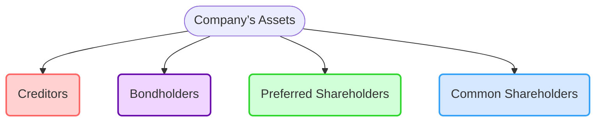

## 8.1 Common Shares

Common shares, often simply referred to as “common stock,” play a pivotal role in global capital markets and form the backbone of equity financing for many corporations. Within the Canadian context, common shares offer investors the opportunity to participate in the growth and governance of some of the country’s largest and most influential companies, such as the Royal Bank of Canada (RBC) or Toronto-Dominion Bank (TD). This section explores the essential characteristics, benefits, and risks of common shares, along with practical guidance for evaluating and investing in this fundamental financial instrument.

---

## What Are Common Shares?

Common shares represent an ownership stake in a corporation. When you purchase common shares of a publicly traded Canadian company, you become a shareholder (part owner) in that enterprise. This ownership confers certain rights and potential rewards, along with inherent risks.

### Ownership and Voting Rights

• As a shareholder, you are entitled to vote on important company matters.  
• Voting often occurs at annual general meetings (AGMs) or special shareholder meetings.  
• Common voting items include electing the board of directors, approving major corporate decisions, and authorizing mergers or acquisitions.  

This voting right is a key feature that separates common shareholders from other types of investors, such as bondholders. Through these votes, shareholders influence the strategic direction of the company.

### Dividends and Income Potential

Many Canadian corporations distribute a portion of their earnings to shareholders in the form of dividends. These dividend payments can provide a source of regular income. However, unlike interest payments on debt securities or the fixed dividends of preferred shares, dividends on common shares:

• Are neither fixed nor guaranteed.  
• Are declared at the discretion of the board of directors.  
• Vary based on the company’s financial performance, overall strategy, and prevailing economic conditions.

As a result, dividends on common shares can fluctuate, be increased in periods of strong profitability, or even be suspended in challenging economic times.  

### Price Volatility

The market price of a company’s common shares can fluctuate significantly. This volatility arises from factors such as:

• Company-specific factors (e.g., earnings releases, management changes, product launches).  
• Broader economic trends (e.g., recession, interest rate movements).  
• Investor sentiment and market psychology.  
• Industry-specific developments (e.g., regulatory changes in the energy sector).

These price movements underscore the inherent risk associated with stock ownership. When investor sentiment is favorable, share prices can rise rapidly. Conversely, share prices may decline quickly should negative news or broader market instability emerge.

### Capital Structure and Priority in Liquidation

Within a firm’s capital structure, common shareholders are at the bottom rung in terms of repayment priority if the company becomes insolvent:

• In the event of bankruptcy or liquidation, the company’s assets are first used to satisfy the claims of creditors and bondholders.  
• Next come preferred shareholders, who usually enjoy a higher claim on remaining assets.  
• Lastly, any remaining value is distributed among common shareholders.

Because common shareholders are last in line, their investment is considered higher risk compared to debt holders or preferred shareholders. In a worst-case scenario, it’s possible for common shareholders to lose their entire investment if the firm’s liabilities exceed its remaining assets.

---

## Potential for Capital Appreciation

Despite being last in line for repayment, common shares offer the potential for significant returns through:

1. Share Price Appreciation – If the market perceives a company’s value to be increasing, its share price could climb substantially over time.  
2. Dividend Payouts – Investors benefit from periodic dividend distributions, which can be reinvested (using a Dividend Reinvestment Plan, or DRIP) to compound returns.

Historically, over the long term, equities have delivered returns that often surpass many other asset classes, including bonds and cash equivalents. However, it’s essential to note that past performance does not guarantee future outcomes.

---

## Evaluating Common Shares

When evaluating a common share investment, investors usually consider a range of quantitative and qualitative factors:

### Fundamental Analysis

This approach involves studying a company’s financial statements, industry dynamics, and overall economic conditions to estimate the intrinsic value of its shares. Key considerations include:

• Earnings Growth: Has the company demonstrated steady earnings growth over recent quarters or years?  
• Price-to-Earnings (P/E) Ratio: A measure that helps investors gauge how “expensive” or “cheap” a stock is relative to its earnings.  
• Dividend Yield: The annual dividend payment divided by the current share price, expressed as a percentage.  
• Company-Specific Factors: Management effectiveness, product pipeline, competitive environment, and regulatory outlook.  

Fundamental analysis can help determine whether shares are overvalued (price above fair value), undervalued (price below fair value), or fairly valued.

### Technical Analysis

Technical analysis studies patterns in market price and volume data to predict future price movements:

• Chart Patterns: Analysts look for recognizable shapes (e.g., “head and shoulders,” “ascending triangle”) that may indicate bullish or bearish trends.  
• Technical Indicators: Tools like moving averages, relative strength index (RSI), and moving average convergence divergence (MACD) help identify potential entry and exit points.  
• Market Trends: Identifying whether the broader market is in an uptrend (bull market) or downtrend (bear market) can impact timing decisions.

While fundamental analysis focuses on a company’s intrinsic worth, technical analysis emphasizes the psychology of market participants and price momentum.

---

## Practical Example: RBC (Royal Bank of Canada)

Let’s consider a simplified example of evaluating RBC common shares:

1. Market Price: Suppose RBC’s shares trade at $130 per share.  
2. Earnings per Share (EPS): If RBC reports an EPS of $10 for the year, its P/E ratio is $130 ÷ $10 = 13×.  
3. Dividend Yield: If RBC pays an annual dividend of $5.20 per share, then the dividend yield is $5.20 ÷ $130 = 4%.  
4. Growth Outlook: Analysts may look at RBC’s market dominance, expansion strategies, and interest rate environment to project future earnings growth.  

An investor might compare RBC’s P/E ratio to that of peer banks, assess industry trends, and consider whether a 4% yield is attractive relative to other opportunities or in light of the current interest rate environment. If the result suggests that RBC’s shares are attractively priced with stable dividends and solid long-term prospects, an investor may be inclined to acquire the shares.

---

## Navigating Risks and Rewards

Investing in common shares entails balancing the potential for higher returns against the risks of market volatility and capital loss. Prudent investors often diversify their portfolios by holding a range of securities across different sectors and asset classes (e.g., bonds, mutual funds, or exchange-traded funds) to help mitigate the impact of one underperforming investment.

Moreover, factors such as individual risk tolerance, investment horizon, and financial goals play a critical role in determining the appropriateness of heavy equity allocations in a portfolio. Younger investors commonly have a higher equity allocation, intending to ride out market cycles over a longer time frame. Retirees, conversely, often shift towards lower-volatility assets to preserve capital and maintain steady income.

---

## Step-by-Step Guidance: Conducting a Basic Stock Evaluation

Below is a simplified sequence to guide prospective investors through preliminary due diligence on a common share:

1. Identify the Company: Choose a familiar Canadian firm (e.g., a major bank or a leading tech company).  
2. Retrieve Financial Data: Access financial statements and relevant news via sources such as SEDAR+ (System for Electronic Document Analysis and Retrieval) at https://www.sedarplus.ca/ or open-source financial data websites such as Yahoo Finance (https://finance.yahoo.com/).  
3. Analyze Key Metrics: Evaluate EPS, P/E ratio, dividend yield, and revenue/earnings growth trends.  
4. Check Regulatory Filings: Visit the Canadian Securities Administrators (CSA) website (https://www.securities-administrators.ca/) or corporate disclosures for additional insights (e.g., MD&A — Management Discussion and Analysis).  
5. Assess Risks: Consider current economic conditions, industry competition, potential regulatory changes, or interest rate impacts.  
6. Form an Opinion: Make an initial judgment about the investment’s long-term prospects.  
7. Compare Alternatives: Look at other companies or different sectors before finalizing a buy or sell decision.  

Investors should continuously monitor their holdings and remain informed about both company-specific developments and broader market factors.

---

## Visualizing a Company’s Capital Structure

Below is a simple diagram illustrating where common shareholders stand in the capital structure relative to other stakeholders:

As the chart shows, common shareholders only receive remaining capital after higher-priority claims (creditors, bondholders, preferred shareholders) have been satisfied in any liquidation.

---

## Canadian Regulatory Insights and Resources

Navigating the Canadian market and ensuring regulatory compliance can be supported by these key organizations and tools:

• Canadian Investment Regulatory Organization (CIRO): https://www.ciro.ca  
  - Provides guidelines regarding equity trading, broker-dealer regulation, and investor protection.  

• Canadian Securities Administrators (CSA): https://www.securities-administrators.ca/  
  - Offers coordinated policy and regulation across the provincial and territorial securities commissions.  

• SEDAR+ (System for Electronic Document Analysis and Retrieval): https://www.sedarplus.ca/  
  - Allows investors to find official company filings, including financial statements and Management Discussion & Analysis (MD&A).  

• CSI (Canadian Securities Institute) Official Site: https://www.csi.ca  
  - Offers courses and resources on equity securities, regulations, and advanced financial topics to deepen professional knowledge.  

• Books and Online Resources:  
  - “Stocks for the Long Run” by Jeremy Siegel presents a historical perspective on equity performance.  
  - Open-source financial data platforms like Yahoo Finance (https://finance.yahoo.com/) provide quotations, stock charts, basic analytics, and financial news.

---

## Glossary of Key Terms

• **Equity:** The value of a company’s assets after deducting liabilities; also used to describe ownership through common or preferred shares.  
• **Dividend Yield:** The annual dividend paid per share divided by the share price, expressed as a percentage.  
• **Voting Rights:** The right of shareholders to vote on important matters at a corporation’s meetings.  
• **Price-to-Earnings (P/E) Ratio:** A measure of a company’s share price relative to its earnings per share (EPS).

---

## Best Practices, Common Pitfalls, and Practical Tips

1. **Diversification:** Avoid placing an overly large portion of your portfolio in a single common stock, especially high-volatility or rapidly growing sectors.  
2. **Long-Term Perspective:** Understand that fluctuations are part of equity investing, and a long-term horizon may help ride out short-term volatility.  
3. **Fundamental Due Diligence:** Regularly review company financials and industry developments to ensure the investment thesis remains intact.  
4. **Be Cautious with Leverage:** Margin trading can amplify gains but also significantly increase losses if share prices move against your position.  
5. **Stay Informed of Regulation:** Canada’s regulatory environment (via CIRO, CSA, etc.) continues to evolve. Keeping abreast of changes can help avoid unexpected compliance issues or misunderstandings about shareholder rights.

---

## Applying What You’ve Learned

• Assess your personal risk tolerance and timeframe before investing in common shares.  
• Conduct thorough research using both fundamental and technical approaches.  
• Pay attention to economic indicators like interest rates and GDP growth, as these influence corporate earnings and market sentiment.  
• Use reputable sources—SEDAR+ for corporate filings, Yahoo Finance for market data, and official regulator sites for the latest guidelines.  
• Remain disciplined in your strategy, and periodically review your portfolio to ensure it reflects your objectives and risk profile.

---

## Common Shares Mastery Quiz



### Which statement best describes the core feature of common shares?

- [ ] They represent a debt obligation of the issuing corporation.  
- [x] They confer ownership rights in the issuing corporation.  
- [ ] They guarantee fixed dividend payments.  
- [ ] They are short-term money market instruments.  

> **Explanation:**( Common shares represent ownership in the company, entitling investors to voting rights and residual claims on assets and earnings.)

### In the event of bankruptcy, who has the lowest priority for repayment?

- [ ] Bondholders  
- [ ] Preferred shareholders  
- [x] Common shareholders  
- [ ] Secured creditors  

> **Explanation:**( Common shareholders stand last in the capital structure when a company’s assets are distributed during liquidation, only receiving any remainder after creditors and other security holders are paid.)

### Which of the following is typically not a responsibility bestowed upon common shareholders?

- [ ] Voting on major corporate decisions  
- [x] Ensuring all outstanding corporate debts are paid  
- [ ] Electing the board of directors  
- [ ] Approving mergers or acquisitions  

> **Explanation:**( Common shareholders have voting rights but are not individually responsible for corporate debts.)

### What is a key reason an investor might choose common shares over bonds or preferred shares?

- [ ] Guaranteed fixed dividend payments  
- [ ] Lower volatility of returns  
- [ ] Guaranteed principal repayment  
- [x] Potential for higher long-term capital appreciation  

> **Explanation:**( Common shares can offer greater long-term growth potential and total return, although with higher risk and no guaranteed payments.)

### Which metric is calculated by dividing a company’s current share price by its earnings per share (EPS)?

- [ ] Dividend Yield  
- [ ] Return on Equity (ROE)  
- [x] Price-to-Earnings (P/E) Ratio  
- [ ] Price-to-Book (P/B) Ratio  

> **Explanation:**( The P/E ratio is a commonly used valuation tool that helps assess whether a stock is under- or overvalued relative to its earnings.)

### What is a primary focus of fundamental analysis when evaluating common shares?

- [ ] Short-term price movements  
- [ ] Chart patterns and technical indicators  
- [ ] Intraday trading volume  
- [x] Company financial statements, industry trends, and economic conditions  

> **Explanation:**( Fundamental analysis looks into a company’s books, its industry context, and wider economic data to determine its intrinsic value.)

### Which of the following organizations offers comprehensive financial filings for publicly traded companies in Canada?

- [ ] CSI  
- [ ] CIRO  
- [x] SEDAR+  
- [ ] IIROC  

> **Explanation:**( SEDAR+ (System for Electronic Document Analysis and Retrieval) is the platform where public companies file their official disclosure documents in Canada.)

### How do dividend payments for common shares differ from those for preferred shares?

- [ ] Common dividends are guaranteed by regulation.  
- [x] Common dividends are declared at the discretion of the board and are not fixed.  
- [ ] Common dividends are always higher than preferred dividends.  
- [ ] Common dividends must be paid before preferred dividends.  

> **Explanation:**( Common shareholders receive dividends only if and when the board decides to declare them, unlike preferred shareholders who often have a set dividend rate.)

### Which factor most directly influences the day-to-day price movements of common shares?

- [x] Market supply and demand dynamics  
- [ ] Scheduled redemption by the company  
- [ ] Government-controlled price caps  
- [ ] Mandatory board-level valuations  

> **Explanation:**( The price of common shares is largely determined by the balance of buying and selling pressures (supply and demand) in the stock market.)

### Common shareholders influence corporate governance primarily through:

- [x] Voting in the election of the board of directors  
- [ ] Submitting routine corporate expense reports  
- [ ] Setting government regulations  
- [ ] Structuring secured credit arrangements  

> **Explanation:** Common shareholders typically vote to elect the board of directors, who then make key decisions about the company’s strategy, executive appointments, and corporate actions.



---

## For Additional Practice and Deeper Preparation

**Elevate your exam readiness with our comprehensive app, "Securities CA: Mock Exams," designed to challenge and refine your skills.**

* **Master Challenging Questions:** Dive into expertly crafted sample exam questions that go beyond standard references.
* **Scenario-Driven Learning:** Experience scenario-driven case questions and in-depth solutions to build practical expertise.
* **Sharpen Exam Strategies:** Build confidence with step-by-step explanations designed to refine your exam-day tactics.
* **Gain Real-World Insights:** Acquire practical tips and detailed rationales that demystify complex concepts.
* **CIRO and CSI Alignment:** Stay current with CIRO guidelines and CSI’s exam structure, with questions intentionally more challenging than the actual exam.

**Download the App Today:**

> Note: While these courses are specifically crafted to align with the CSC® exams outlines, they are independently developed and not endorsed by CSI or CIRO.

---

By understanding the foundational features of common shares—ranging from voting rights and dividend fluctuations to capital structure risks—investors can make more informed decisions about whether to include these securities in their broader portfolio. The next time you consider adding a high-potential Canadian stock to your holdings, recall the principles discussed here and apply both fundamental and technical insights to gauge its suitability.
