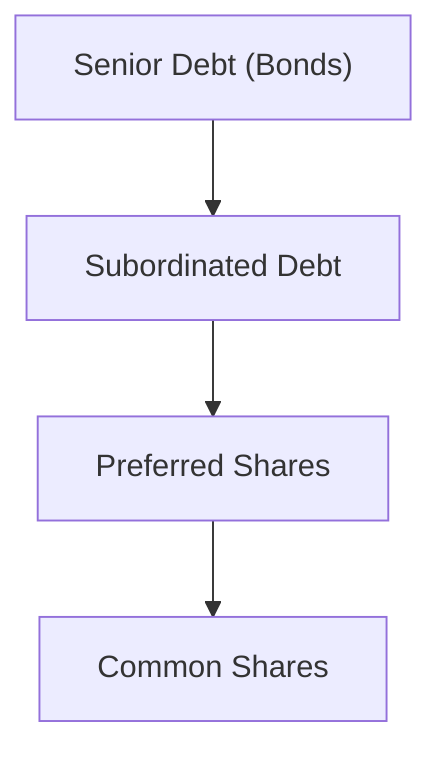

## 8.2 Preferred Shares

Preferred shares represent a unique class of equity that offers investors certain distinct features compared to common shares. They typically occupy a middle ground between common equity and debt securities such as bonds. Holders of preferred shares enjoy priority over common shareholders in receiving dividends and claiming assets if the corporation faces liquidation. However, preferred shares generally lack the same voting rights as common shares, and their dividend payout often follows a fixed or formula-based rate. In Canada, preferred share dividends may be eligible for the dividend tax credit, which can make them more tax-efficient than interest-bearing investments.

This chapter dives into the structure, benefits, risks, tax considerations, and real-world applications of preferred shares within the Canadian market. It also offers guidelines for integrating preferred shares into a well-balanced portfolio, highlighting ways investors can use them to achieve specific income and diversification goals.

---

### Overview and Key Features

Preferred shares, also known simply as “preferreds,” grant holders a higher claim on earnings and corporate assets than common shares. This privileged position can be particularly attractive to income-seeking investors because:

1. Priority Over Common Shares for Dividends:  
   Preferred shareholders typically receive dividend payments before any common shareholder dividends are declared. 

2. Potentially Fixed or Formula-Based Dividend:  
   Most preferred shares pay a fixed or adjustable dividend and are not required to participate in the residual growth of the company’s earnings, unlike common shareholders. 

3. Limited Voting Rights:  
   Under normal circumstances, preferred shareholders do not have voting rights. However, if the issuer fails to pay dividends for a predetermined period, some preferred shares may grant limited voting power as a protective measure.

4. Position in Corporate Capital Structure:  
   Preferred shares sit higher than common shares in a company’s capital structure but rank below debt obligations such as bonds or debentures. In the event of liquidation or insolvency, preferred shareholders have a stronger claim to the company’s assets than common shareholders, but a weaker claim than bondholders.

Below is a simplified visualization of a company’s capital structure, depicting where preferred shares fit relative to other securities:

---

### Types and Structures of Preferred Shares

Preferred shares can come in different forms, each offering unique benefits and risks. The primary categories include:

#### Cumulative and Non-Cumulative Preferred Shares

• Cumulative Preferred Shares:  
  These shares ensure that any missed or “skipped” dividends accumulate. The company must pay all past unpaid dividends (called dividend arrears) to cumulative preferred shareholders before any dividends can be paid on common shares.  

• Non-Cumulative Preferred Shares:  
  In contrast, non-cumulative preferred shares do not accumulate unpaid dividends. If a company omits or reduces a dividend payment in a given period, holders of non-cumulative preferred shares cannot claim those forgone dividends in the future.

#### Callable (Redeemable) Preferred Shares

Callable preferred shares permit the issuing company to repurchase (or “call”) them at a predetermined price after a specified date. These shares provide the issuer with flexibility to reduce financing costs if interest rates decline or improve its capital structure if market conditions become favorable. Callable features, however, limit the investor’s upside potential because the company can redeem the shares if their market value rises significantly above the call price.

#### Convertible Preferred Shares

Convertible preferred shares offer investors the option to convert their shares into a predetermined number of common shares, typically at a defined conversion ratio (e.g., 1:1, 1:2, etc.). This mechanism enables investors to participate in potential equity price appreciation. However, convertibility comes at a cost: often, the fixed dividend rate of convertible preferred shares is lower than that of similar non-convertible issues due to the embedded conversion feature.

#### Variable-Rate (Floating-Rate) Preferred Shares

Variable-rate or floating-rate preferred shares link their dividend payments to an underlying index or benchmark interest rate (e.g., prime rate, three-month Treasury Bill yield). Dividend amounts adjust periodically to reflect changes in that reference rate. The advantage is reduced interest rate risk compared to fixed-rate preferreds, but the variability in dividend income can affect an investor’s cash flow planning.

---

### Dividend Characteristics and Tax Treatment

One of the main attractions of preferred shares in Canada is the potential tax advantage on dividend income. Most dividends paid by Canadian companies to Canadian residents qualify for the Dividend Tax Credit (DTC). This credit effectively reduces the amount of personal tax payable on dividend income, leading to a more favorable after-tax yield compared to interest from bonds or GICs, which is fully taxable at the investor’s marginal tax rate.

Here is a simplified equation to illustrate the advantage, noting that actual rates depend on an investor’s marginal tax bracket and whether the dividend is eligible or non-eligible:

Dividends (gross-up) = Dividend received × (1 + gross-up rate)  
Taxable amount after applying DTC < Interest income (in many cases, for the same nominal amount)

As a result, some income-oriented portfolios in Canada will favor eligible dividend income over interest-bearing securities to optimize after-tax returns.

---

### Market and Credit Risks

While preferred shares are often considered less volatile than common shares, they are not without risks:

1. Interest Rate Risk:  
   Because many preferred shares pay a fixed rate, their market prices can decline when interest rates rise. Investors holding fixed-rate preferreds in a rising rate environment may see price depreciation in secondary markets.

2. Credit Risk:  
   Preferred shareholders are subject to the company’s creditworthiness. If the issuing company experiences financial difficulty, dividend payments may be reduced or halted, especially with non-cumulative shares. Investors must also be aware of the priority of bondholders and other creditors in any liquidation scenario.

3. Market Liquidity:  
   Some issues of preferred shares may be thinly traded, especially those from smaller or less well-known companies. Limited market liquidity can lead to higher bid-ask spreads and potential difficulties in selling shares on short notice.

4. Regulatory and Redemption Risks:  
   Callable features on preferred shares mean that the company can repurchase shares if it becomes advantageous for them, potentially depriving long-term investors of future upside.

---

### Real-World Examples and Case Studies

Preferred shares are used extensively by Canadian financial institutions—large banks such as RBC, TD, and Bank of Montreal often issue preferred stock to bolster their Tier 1 capital under regulations overseen by the Office of the Superintendent of Financial Institutions (OSFI). Let’s look at two simplified case scenarios:

#### RBC Preferred Shares with a Fixed Dividend

RBC (Royal Bank of Canada) issues a series of preferred shares that pay a fixed quarterly dividend at an annual rate of 5%. Investors seeking stable income find these attractive. If the Bank of Canada raises interest rates significantly, however, the market price of these fixed-rate preferred shares may drop as new securities could offer higher returns.

#### TD’s Convertible Preferred Shares

TD Bank issues convertible preferred shares with a 4% annual dividend rate that can be exchanged for common shares after five years at a 1:1 ratio. If TD’s common share price soars, the convertible feature offers additional upside to preferred shareholders. However, if the share price lags and interest rates climb, the fixed dividend becomes less attractive relative to newly issued fixed-income instruments.

---

### Incorporating Preferred Shares into an Investment Strategy

Preferred shares can play a valuable role in a diversified portfolio by providing a source of fixed or semi-fixed income, typically with higher yields than government bonds or high-grade corporate bonds (though with commensurate credit risk). Below are common ways investors use preferred shares:

• Income Generation: Preferred shares are especially popular among retirees or investors aiming for a stable cash flow. Coupled with the dividend tax credit, they can be more tax-efficient than bond interest for many Canadian investors.

• Portfolio Diversification: Mixing different types of preferred shares—fixed, floating, convertible—can help manage interest rate sensitivity and offer moderate exposure to equity-like growth potential.

• Defensive Investment: In periods of market stress, preferred shares generally exhibit less price volatility than common shares, though they do not offer the same growth potential.

---

### Best Practices for Holding Preferred Shares

1. Understand Redemption Features:  
   Always review callable or redeemable terms. If a preferred share is trading well above its call price, there is a higher risk of redemption, capping potential gains.

2. Evaluate Credit Quality of the Issuer:  
   Review credit ratings (from DBRS Morningstar, Moody’s, or S&P). Higher-rated issuers reduce default or dividend-suspension risk.

3. Diversify Across Types and Issuers:  
   Rather than buying one type of preferred from a single issuer, consider a variety (e.g., some fixed, some floating, some from financial institutions, some from utilities, etc.).

4. Monitor the Yield Curve and Economic Indicators:  
   Preferred share prices hinge on interest rates and credit spreads. Keeping track of the Bank of Canada’s monetary policy can help investors anticipate rate-driven price movements.

5. Leverage Registered Plans if Appropriate:  
   Canadian investors may hold preferred shares in registered accounts such as RRSPs, TFSAs, or RRIFs to defer or eliminate taxes based on contribution and withdrawal rules. Although the dividend tax credit does not apply in the same way within a registered account, these vehicles can still offer significant tax advantages.

---

### Regulatory Considerations

Preferred shares in Canada are regulated by various authorities:

• The Canadian Investment Regulatory Organization (CIRO):  
  CIRO develops and enforces rules regarding trading and oversight of mutual fund and investment dealers. CIRO also monitors market conduct rules that apply to firms and their representatives who sell preferred shares to retail investors.  
  Website: [https://www.ciro.ca](https://www.ciro.ca)

• The Office of the Superintendent of Financial Institutions (OSFI):  
  OSFI regulates federally registered financial institutions, including banks that issue preferred shares. This agency sets guidelines for capital adequacy (e.g., how preferred shares count toward a bank’s Tier 1 capital).  
  Website: [https://www.osfi-bsif.gc.ca/](https://www.osfi-bsif.gc.ca/)

• Provincial Securities Commissions:  
  Each province and territory in Canada has a securities commission that helps administer regulations for new issues, continuous disclosure requirements, and investor protections around preferred share offerings. SEDAR+ (System for Electronic Document Analysis and Retrieval +) is the centralized repository for publicly-filed documents relating to Canadian securities issuers.  
  Website: [https://www.sedarplus.ca/](https://www.sedarplus.ca/)

---

### Practical Tools and Resources

• Detailed corporate financial statements, including information on preferred share structures, can be found on [SEDAR+](https://www.sedarplus.ca/).  
• “[Bond and Money Markets: Strategy, Trading, Analysis](https://www.amazon.ca/Bond-Money-Markets-Strategy-Trading/dp/0750689522)” by Moorad Choudhry provides an in-depth perspective on fixed-income and hybrid instruments such as preferred shares.  
• Mock and practice exams provided by the Canadian Securities Institute (CSI) can test your knowledge of how preferred shares are structured, traded, and taxed.

---

### Glossary of Key Terms

• **Cumulative Preferred Shares**: Preferred shares whose unpaid dividends accumulate until paid in full.  
• **Callable (Redeemable) Preferred Shares**: Shares that can be repurchased by the issuing company at a set price after a certain date.  
• **Convertible Preferred Shares**: Shares that can be exchanged for a predetermined number of common shares, allowing partial participation in share price appreciation.  
• **Non-Cumulative Preferred Shares**: Preferred shares where unpaid dividends do not accumulate.  
• **Dividend Tax Credit**: A Canadian tax credit that applies to eligible dividends, effectively lowering the tax on dividend income.

---

### Summary

Preferred shares combine elements of both equity and fixed-income securities, offering investors a hybrid form of ownership that yields regular, often tax-advantaged dividends. They take precedence over common shares in receiving dividend payments and in claiming remaining assets if the company dissolves. While some features, such as callability, convertibility, and cumulative dividends, provide benefits to both issuers and investors, they also introduce unique risks like interest rate sensitivity and potential redemption by the issuer. 

When used effectively in a portfolio—especially as part of an income-focused or diversified strategy—preferred shares can provide a relatively stable stream of income. Nonetheless, investors must remain vigilant about the issuer’s financial strength and the specific terms of the preferred share issue, as these can greatly influence the security’s risk/reward profile. A balanced perspective on potential market volatility, interest rates, and broader economic conditions is crucial when determining whether preferred shares fit your investment objectives.

---

## Test Your Knowledge of Preferred Shares: 10 Essential Questions



### Which type of preferred share allows investors to exchange their shares into common stock at a predetermined ratio?

- [ ] Callable preferred shares
- [x] Convertible preferred shares
- [ ] Cumulative preferred shares
- [ ] Non-cumulative preferred shares

> **Explanation:** Convertible preferred shares have an embedded option allowing them to be converted into common shares at a specified conversion ratio, offering equity upside potential.

### Which regulatory body oversees the capital adequacy requirements of Canadian banks that issue preferred shares?

- [ ] The Canadian Investment Regulatory Organization (CIRO)
- [x] The Office of the Superintendent of Financial Institutions (OSFI)
- [ ] The Canada Revenue Agency (CRA)
- [ ] Provincial Securities Commissions

> **Explanation:** OSFI sets guidelines and enforces regulations for capital adequacy at federally regulated financial institutions, including banks issuing preferred shares.

### What is one potential advantage of preferred share dividends under the Canadian tax system?

- [x] They may qualify for the dividend tax credit, potentially reducing the investor’s tax liability.
- [ ] They are always exempt from all federal taxes.
- [ ] They generate the same level of taxation as interest payments.
- [ ] They cannot be held in registered accounts.

> **Explanation:** Many dividends on Canadian preferred shares generate a dividend tax credit, decreasing the effective tax burden compared to interest income.

### What is the main difference between cumulative and non-cumulative preferred shares?

- [x] Unpaid dividends on cumulative preferred shares must be paid before common dividend payments can resume.
- [ ] Non-cumulative preferred shares provide higher voting rights.
- [ ] Cumulative preferred shares are only issued by financial institutions.
- [ ] Non-cumulative preferred shares guarantee dividends.

> **Explanation:** Cumulative preferred shares accumulate unpaid dividends, making the issuer liable to pay all missing dividends before common shareholders receive any payments again.

### Which of the following statements is TRUE regarding callable preferred shares?

- [x] They can be repurchased by the issuing company at a predetermined price after a certain date.
- [ ] They must convert into bonds when interest rates rise.
- [x] They limit upside potential if the market price rises above the call price.
- [ ] They cannot be traded in secondary markets.

> **Explanation:** Callable preferred shares allow the issuer to “call” or repurchase the security at a specified call price, capping the investor’s potential gains if the market price rises above that call level.

### What risk factor primarily affects the market price of fixed-rate preferred shares when interest rates move significantly?

- [x] Interest Rate Risk
- [ ] Currency Exchange Risk
- [ ] Liquidity Risk
- [ ] None of the above

> **Explanation:** Fixed-rate preferred shares often lose value when interest rates rise because investors can obtain higher yields elsewhere. The inverse happens when rates decline.

### When might a preferred shareholder typically gain limited voting rights?

- [x] If the issuer fails to pay dividends for a specified period.
- [ ] When the common shareholders vote to grant them.
- [x] In the event of a share buyback by the company.
- [ ] Upon reaching a certain age.

> **Explanation:** Some preferred shares stipulate that shareholders receive limited voting rights if dividends are unpaid for a certain time, as a protective provision.

### Which of the following Canadian banks is known to issue preferred shares for Tier 1 capital?

- [x] Royal Bank of Canada (RBC)
- [ ] Japan Bank for International Cooperation (JBIC)
- [ ] Bank of America
- [ ] Federal Reserve Bank of New York

> **Explanation:** RBC is a Canadian chartered bank regulated by OSFI. It issues preferred shares as part of its Tier 1 capital structure. Other major Canadian banks, like TD and BMO, do the same.

### How can an investor potentially benefit from holding convertible preferred shares during times of strong equity market performance?

- [x] By converting the preferred shares into common shares and participating in share price appreciation.
- [ ] By receiving full voting rights equal to common shareholders.
- [ ] By earning a higher fixed dividend than common shares.
- [ ] By eliminating all interest rate risk.

> **Explanation:** Convertible preferred shares allow conversion to common stock, letting investors benefit if the common share price rises substantially.

### Preferred shareholders have a higher claim to a company’s assets than bondholders in the event of liquidation.  
- [ ] True  
- [x] False  

> **Explanation:** Bondholders generally have priority over preferred shareholders in a liquidation scenario, ranking higher in the capital structure.



---

