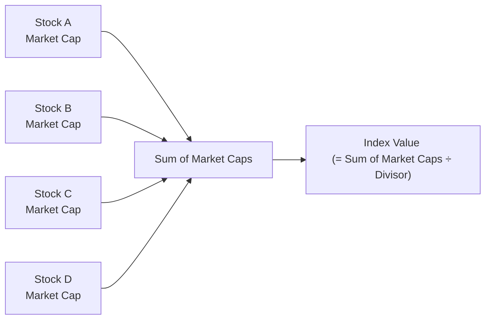

## 8.3 Stock Indexes and Averages

Stock market indexes are indispensable tools in the world of equity investing. They empower investors to measure market performance, track trends, and evaluate the effectiveness of their investment strategies. By understanding how these benchmarks function, investors gain invaluable insights into overall market behavior as well as individual stock performance.

In this section, we will explore the importance of stock indexes and averages, examine calculations and methodologies, and delve into real-world examples illustrating their applications in the Canadian market context. We will also discuss how financial advisors, institutional investors, and individual traders use these benchmarks to make better-informed portfolio decisions and manage risk.

--------------------------------------------------------------------------------
## Defining Stock Market Indexes

### What Is a Stock Market Index?

A stock market index is a statistical measure of the changes in a group of stocks representing a portion of the overall market or a specific sector. The goal of an index is to capture the performance of that sector, enabling investors to compare the sector’s performance against:

• Other market segments  
• Broader market indexes  
• Their own portfolios  

These comparisons help investors identify trends, grasp market sentiments, and make strategic investment decisions—whether they aim to outperform an index (active management) or match its returns (passive management).

### Why Are Indexes Important?

Indexes are used as benchmarks. For instance, if you hold a Canadian equity portfolio, you might gauge its performance against a benchmark like the S&P/TSX Composite Index. If your portfolio’s returns exceed the index, you’ve outperformed the market; if they’re lower, you’ve underperformed. Some key benefits of indexes are:

• Providing a snapshot of market conditions  
• Helping identify trends, booms, and recessions  
• Benchmarking individual stocks and portfolios  
• Aiding in risk management and diversification strategies  

--------------------------------------------------------------------------------
## Overview of Major Indexes

### Canadian Indexes

Within Canada, the most notable benchmark is the S&P/TSX Composite Index. This index tracks a broad selection of Canadian stocks listed on the Toronto Stock Exchange (TSX), capturing roughly 70% of its total market capitalization. Other Canadian indexes include:

• S&P/TSX 60: A subset of the Composite Index focusing on 60 large, liquid stocks.  
• S&P/TSX SmallCap Index: Highlights smaller-capitalization companies listed on the TSX.  

Canadian investors, including asset managers at RBC and TD, frequently use these benchmarks to measure performance in domestic equities, informing investment decisions and portfolio rebalancing.

### U.S. Indexes

In the United States, you will often see references to:

• Dow Jones Industrial Average (DJIA): A price-weighted average of 30 large U.S. companies.  
• S&P 500: A market capitalization-weighted index of 500 large U.S. companies.  
• NASDAQ Composite: Tracks a broad range of stocks listed on the NASDAQ market, featuring numerous technology-driven companies.  

### Global Indexes

Investors broaden their horizons by also keeping track of these global benchmarks:

• FTSE 100 (U.K.)  
• Nikkei 225 (Japan)  
• DAX (Germany)  
• Hang Seng (Hong Kong)  

These international indexes provide opportunities for Canadian investors to diversify across international markets and compare performance on a global scale.

--------------------------------------------------------------------------------
## Methods for Calculating Indexes

Not all indexes are constructed the same way. Different weighting methods can significantly affect which stocks drive the index’s performance. The primary calculation methods are:

### Price-Weighted Index

In a price-weighted index, a stock’s influence on the index is proportional to its share price. This means higher-priced stocks carry more weight, even if the issuing company is relatively small in market capitalization. The most famous example is the Dow Jones Industrial Average (DJIA).

Example of Calculating a Simple Price-Weighted Index (Hypothetical):

Let’s say we have three stocks in an index, with share prices of $10, $20, and $30. The value of the index could be:

Index Value = (Sum of Stock Prices) / (Number of Stocks)

Index Value = (10 + 20 + 30) / 3 = 60 / 3 = 20

In practice, the Dow uses a divisor that is adjusted for stock splits, changes to the basket of stocks, and other corporate actions.

### Market Capitalization-Weighted Index

Market capitalization (market cap) is the total market value of a company’s outstanding shares (stock price × number of outstanding shares). In a market cap-weighted index:

• Companies with larger market caps exert a greater influence on the index.  
• The index’s performance leans heavily on large-cap stocks.  

Examples include the S&P/TSX Composite and the S&P 500.

A simplified formula for a market cap-weighted index might be modeled as:

I = ( Σ (Pᵢ × Qᵢ) ) / D

• Pᵢ = Price per share of stock i  
• Qᵢ = Number of shares outstanding for stock i  
• Σ = Summation across all stocks in the index  
• D = Divisor (adjusted as needed for corporate actions)  

### Equal-Weighted Index

In an equal-weighted index, each stock in the index carries the same importance regardless of its share price or market cap. This construction is seen in certain benchmark indexes or specialized funds that aim to avoid concentration in large caps. Equal-weighted indexes:

• Can experience higher turnover due to frequent rebalancing.  
• Potentially place greater emphasis on mid- and small-cap stocks.  

--------------------------------------------------------------------------------
## Averages: Simpler Measures of Market Performance

Alongside indexes, the term “average” in a market context typically refers to the tradition of summing stock prices and dividing by a particular figure. The Dow Jones Industrial Average (DJIA) is one such example, though it is often referred to as an index. Initially, Charles Dow created it by adding stock prices together and dividing by the number of stocks in the average.

Over time, the divisor changed to adjust for stock splits, changes in index constituents, and other market factors. Today, the DJIA remains price-weighted but uses a specialized divisor to maintain its continuity as companies enter and leave the 30-issue lineup.

--------------------------------------------------------------------------------
## Practical Applications and Investment Strategies

### Benchmarking Portfolio Performance

Investors, portfolio managers, and financial advisors frequently compare individual holdings or entire portfolios against a representative index. For example, a Canadian pension fund manager holding a diverse portfolio of TSX-listed equities may measure success by comparing the fund’s returns, volatility, and sector allocations against the S&P/TSX Composite Index.

### Passive vs. Active Investment Strategies

• Passive investing: Many exchange-traded funds (ETFs) and mutual funds simply track an index (e.g., an S&P/TSX 60 ETF) to replicate its returns, minimizing cost and turnover.  
• Active investing: Fund managers apply research, market analysis, and proprietary models to try to beat the benchmark index through superior security selection and market timing.  

### Risk Management and Diversification

Indexes also provide a way for investors to visualize and manage risk. If an investor’s holdings deviate significantly from an index composition, it can signal either superior insight or higher concentration risk. By lining up sector allocations with those of a well-known index, investors ensure they’re not accidentally overweight in a specific market segment (e.g., energy or technology).

--------------------------------------------------------------------------------
## Real-World Example: Canadian Bank Stocks and the S&P/TSX Composite

Canadian bank stocks—like RBC, TD, Scotiabank, and others—often comprise a large portion of the S&P/TSX Composite. Suppose an investor wants broad exposure to the Canadian financial sector. Instead of picking individual bank stocks, they could invest in an ETF that mirrors the S&P/TSX Capped Financials Index, thus diversifying across a variety of financial institutions.

Alternatively, an investor might attempt to outperform the index by overweighting a particular bank stock they believe is undervalued. Either way, the benchmark index provides a reference point for performance, risk, and market sentiment.

--------------------------------------------------------------------------------
## Monitoring Key Indexes

Regularly tracking indexes helps investors:

• Compare an individual stock to its relevant benchmark.  
• Assess whether a sector’s weakness is part of a broader market decline or unique to specific companies.  
• Understand how macroeconomic trends (e.g., interest rate changes, global trade tensions) can affect market sentiment.  

By paying close attention to key indexes, an investor can make more informed decisions about sector rotations, asset allocation, and potential rebalancing opportunities.

--------------------------------------------------------------------------------
## Visualizing Index Composition

Below is a simple Mermaid diagram illustrating how different stocks feed into a market cap-weighted index calculation.

Explanation:  
• Each stock contributes its value (price × shares outstanding) to the total “Sum of Market Caps.”  
• This sum is divided by an index-specific divisor, which is adjusted periodically for splits, dividends, and other corporate events.  
• The resulting figure is the index level, which changes in real time based on price movements.

--------------------------------------------------------------------------------
## Best Practices, Challenges, and Pitfalls

### Best Practices

• Use the right benchmark. If your portfolio consists primarily of small-cap stocks, the S&P/TSX Composite may not be the most accurate comparison.  
• Monitor and rebalance. Over time, certain stocks within a portfolio can grow to dominate total returns, skewing your risk profile. Indexed portfolios should be periodically rebalanced to maintain target weights.  
• Stay informed. Corporate actions (splits, mergers, acquisitions) affect index composition. Following index announcements can help you anticipate changes in the benchmark.

### Common Pitfalls

• Benchmark mismatch. Evaluating a portfolio of emerging tech companies against a broad composite index can lead to misleading conclusions.  
• Overreliance on large-cap drivers. Market cap-weighted indexes may be disproportionately driven by a few giants; be aware of concentration risks.  
• Ignoring sector differences. Two indexes tracking different sectors can generate entirely different performance patterns, even during the same market climate.

--------------------------------------------------------------------------------
## Additional Resources and References

• Canadian Investment Regulatory Organization (CIRO):  
  Visit <https://www.ciro.ca> for updated guidelines on market trading, derivative products, and index-linked instruments.  

• S&P Global:  
  Learn how indexes like the S&P/TSX Composite are constructed at <https://www.spglobal.com/>.  

• FTSE Russell:  
  Research global benchmarks and their methodologies at <https://www.ftserussell.com/>.  

• Online Market Data:  
  Obtain global indices and historical performance data from sites like:  
  – Yahoo Finance: <https://finance.yahoo.com/>  
  – Investing.com: <https://www.investing.com/>  

• Textbooks and Courses:  
  – “Handbook of Fixed Income Securities” by Frank J. Fabozzi (sections on index construction)  
  – Coursera’s “Financial Markets” for deeper insights into index analysis  

--------------------------------------------------------------------------------
## Summary

Stock market indexes and averages play a critical role in today’s investment landscape. By measuring segments of the equity market, these benchmarks help stakeholders compare, evaluate, and optimize their strategies in line with overall market direction. Canadian investors most commonly monitor the S&P/TSX Composite Index for domestic benchmarks, though global comparisons can shape more diversified portfolios. Alongside direct stock investment, index-tracking funds such as ETFs provide convenient, cost-effective ways to participate in market performance without having to research and manage individual stock positions constantly.

Whether you pursue a passive or active strategy, a solid understanding of indexes, their construction, and their behaviors will allow you to gauge performance effectively and stay aligned with your financial goals.

--------------------------------------------------------------------------------

## Boost Your Knowledge: Stock Indexes and Averages in Canada Quiz



### Which of the following best describes a price-weighted index?

- [x] An index where each stock’s impact is based on its share price.
- [ ] An index where each stock is weighted by its market capitalization.
- [ ] An index where no weight is given to share price or market cap.
- [ ] An equally weighted index across all components.

> **Explanation:** A price-weighted index’s calculation hinges on the share price alone, making higher-priced stocks more influential.

### Which major Canadian index tracks roughly 70% of the total market capitalization of the Toronto Stock Exchange?

- [x] The S&P/TSX Composite Index
- [ ] The NASDAQ Composite
- [ ] The FTSE 100
- [ ] The Nikkei 225

> **Explanation:** The S&P/TSX Composite Index is Canada’s primary market benchmark, capturing the majority of TSX-listed companies by capitalization.

### In a market capitalization-weighted index, which factor most significantly influences a stock’s impact on the index?

- [ ] Dividend yield
- [ ] Stock’s P/E ratio
- [x] Market cap (price × shares outstanding)
- [ ] Volume of shares traded daily

> **Explanation:** By its design, market cap weighting gives larger companies a proportionally greater influence on index performance.

### The Dow Jones Industrial Average (DJIA) is primarily known as what type of index?

- [x] Price-weighted average
- [ ] Market cap-weighted index
- [ ] Equal-weighted index
- [ ] Free-float adjusted index

> **Explanation:** The DJIA was historically constructed by summing component stock prices and dividing by a specific divisor, making it a classic example of a price-weighted average/index.

### Which of the following is a common pitfall when using stock market indexes for performance comparison?

- [x] Using an index that doesn’t represent your portfolio’s market sector
- [ ] Collecting data on sector allocation
- [x] Relying solely on fundamental balance sheet ratios
- [ ] Rebalancing regularly

> **Explanation:** Choosing an index that does not closely match your portfolio exposure (e.g., comparing small-cap stocks to a large-cap benchmark) can distort your performance evaluation.

### Why might an investor choose an index-tracking ETF?

- [x] For passive market exposure and low-cost diversification
- [ ] To maximize outperformance of the index
- [ ] To engage in speculative short-selling strategies
- [ ] To eliminate all market risk

> **Explanation:** Index-tracking ETFs replicate the returns of a benchmark, offering diversified market exposure with minimal management fees.

### Which of the following is true about the S&P/TSX 60?

- [x] It contains 60 large, liquid stocks from the TSX.
- [ ] It includes only small-cap Canadian companies.
- [x] It excludes all financial firms.
- [ ] It tracks only U.S. technology stocks.

> **Explanation:** The S&P/TSX 60 is composed of large-cap Canadian companies that are typically more liquid.

### What is a key reason a market cap-weighted index adjusts its divisor over time?

- [x] To account for corporate actions like stock splits
- [ ] To make the index less volatile
- [ ] To ensure only small-cap stocks are included
- [ ] To inflate reported returns artificially

> **Explanation:** The divisor is adjusted to maintain consistency in the index when companies issue more shares, execute splits, or undergo mergers.

### Which index would a technology-focused Canadian investor most likely use to benchmark a portfolio of large U.S. tech companies?

- [ ] S&P/TSX Composite
- [ ] DAX
- [x] NASDAQ Composite
- [ ] FTSE 100

> **Explanation:** The NASDAQ Composite is heavily weighted toward technology firms, making it a more suitable benchmark for a U.S. tech-focused portfolio.

### True or False: In an equal-weighted index, each stock’s influence on the index returns remains constant without any rebalancing.

- [x] True
- [ ] False

> **Explanation:** An equal-weighted index gives each constituent an identical position initially. However, in practice, frequent rebalancing is needed to maintain equal weights because individual stock prices move in different directions.



--------------------------------------------------------------------------------

