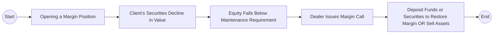

## 9.1 Cash Accounts and Margin Accounts

Equity transactions in the Canadian marketplace involve a variety of account types, each designed to meet different investor objectives and risk profiles. The two most common are cash accounts and margin accounts. In this section, we delve into these account structures, exploring their key characteristics, regulatory frameworks, and best practices for Canadian investors.

---

### Understanding Cash Accounts

A cash account is a brokerage account in which you, as the investor, must pay the full cost of the securities you purchase by the settlement date. No borrowing is involved, which typically simplifies the investment process.

#### Key Features of Cash Accounts

• Full Payment Required:  
Unlike other forms of financing, all transactions in a cash account must be fully funded using your own money. As a result, you do not owe any interest because there is no borrowing.

• Lower Risk Profile:  
Cash accounts generally entail lower risk relative to margin accounts because there is no leverage. The absence of borrowed funds ensures that losses cannot exceed your invested principal.

• Ideal for Conservative or Beginning Investors:  
Investors who want to avoid complicated borrowing structures often choose cash accounts. In Canada, many new investors open a Registered Retirement Savings Plan (RRSP) or Tax-Free Savings Account (TFSA) in the form of a cash account when starting out.

#### Practical Example

Suppose you have a cash account with a large Canadian financial institution, such as RBC or TD. You decide to purchase 100 shares of a Canadian blue-chip stock trading at $50 per share:  
• Total cost of purchase = 100 shares × \$50 = \$5,000.  
• You must ensure \$5,000 is available in your account by the settlement date (usually T+2 trading days in Canada).  
• If you do not have sufficient funds, the purchase will not be authorized, or you may face penalties for late or missed payments.

---

### Understanding Margin Accounts

A margin account allows you to borrow money from your investment dealer to finance part of your securities purchase. By depositing a “margin”—a percentage of the total trade value—you increase your potential liquidity, but also face higher risk.

#### Key Features of Margin Accounts

• Use of Leverage:  
Leverage amplifies both gains and losses. By borrowing to invest, you can buy more securities than you could in a cash account.

• Margin Requirement:  
The initial margin requirement is the percentage of the total purchase price you must fund with your own cash or eligible securities. The remaining amount is financed by the dealer member firm.  
– Regulatory margin requirements in Canada are set or influenced by federal and provincial authorities, as well as the Canadian Investment Regulatory Organization (CIRO).  
– Margin requirements vary according to security type, market volatility, and dealer policies.

• Ongoing Maintenance Margin:  
After the initial trade, your account must maintain a certain level of equity, known as the maintenance margin. If the equity in your account falls below this threshold, you’ll receive a margin call.

• Margin Call:  
A margin call is a request from your dealer for additional funds or securities to restore the margin to the required level. Failing to meet the margin call can result in the forced sale of your securities to bring your account back in line.

#### Practical Example

Imagine you open a margin account at a dealer such as TD Direct Investing. You wish to purchase a total of \$10,000 worth of shares in a Canadian technology firm. The dealer sets an initial margin requirement at 50%.  
• Your deposit = \$5,000 (50% of \$10,000).  
• Margin loan from the dealer = \$5,000.  
If the value of your shares rises to \$12,000, your profit is magnified because your total initial equity was \$5,000. However, if the share price drops significantly, your losses also accelerate because you must still repay the \$5,000 margin loan plus any interest accrued.

---

### Margin Requirements and Canadian Regulations

Margin requirements in Canada are regulated through a combination of federal, provincial, and self-regulatory frameworks. Dealers customarily rely on CIRO guidelines when setting their internal policies.

• CIRO (Canadian Investment Regulatory Organization):  
  – Responsible for regulating margin rates and overseeing the structure of margin accounts.  
  – Provides minimum guidelines that dealers must follow.  
  – Dealers may implement stricter requirements based on the perceived risk of certain securities or market conditions.

• Provincial Securities Commissions:  
  – Provincial regulators, such as the Ontario Securities Commission (OSC) or the Autorité des marchés financiers (AMF) in Québec, can influence margin requirements through local regulations.  
  – They coordinate closely with CIRO to ensure consistent policies.

• The Bank of Canada:  
  – While not directly setting margin requirements, the Bank of Canada’s interest rate decisions influence the cost of borrowing, ultimately affecting margin usage.

---

### The Margin Call Process

A margin call occurs if the equity in a margin account falls below the minimum maintenance requirement. Several factors contribute to triggering a margin call, including market volatility, fluctuations in share prices, and changes to the margin requirements themselves.

Below is a basic representation of how a margin call event flows:

1. You purchase securities on margin.  
2. The market price of your securities declines.  
3. Your equity position (value of securities minus borrowed amount) slips under the maintenance margin.  
4. The dealer issues a margin call.  
5. You must either deposit more cash or securities or instruct the dealer to sell some of your holdings to cover the shortfall.

Missing or ignoring a margin call can result in forced liquidation of positions by the broker, often at unfavorable prices.

---

### Risk and Reward Comparison

| Feature/Aspect       | Cash Account                                                                           | Margin Account                                                                 |
|----------------------|-----------------------------------------------------------------------------------------|--------------------------------------------------------------------------------|
| Leverage             | None; full payment required                                                             | Yes; borrow part of the purchase cost                                          |
| Risk Level           | Lower; limited to the invested capital                                                 | Higher; amplified gains and losses                                             |
| Potential Gains      | Based on the performance of fully paid securities                                       | Potentially higher gains due to leverage                                       |
| Potential Losses     | Loss capped at initial capital                                                         | Magnified losses; can exceed the initial margin deposit                        |
| Interest Cost        | Not applicable                                                                         | Owed on the borrowed portion of the investment                                 |
| Who Should Use       | Conservative/Beginners: Seeking minimal risk, straightforward mechanics                 | Experienced/Active Traders: Comfortable with leverage and monitoring positions |

---

### Best Practices and Pitfalls

#### Best Practices

1. **Monitor Your Positions Regularly**  
   – Whether you use a cash or margin account, keep an eye on price movements and review your holdings.  
   – Use open-source portfolio tracking tools or your dealer’s trading platform to stay informed.

2. **Plan Your Exit Strategies**  
   – Before initiating a leveraged trade, decide how much loss you can tolerate and at what point you will exit the trade.

3. **Maintain Cash Reserves**  
   – In a margin account, a well-funded reserve keeps you prepared to meet margin calls quickly.

4. **Stay Educated**  
   – Make use of resources like CIRO’s website (<https://www.ciro.ca>) for margin rules, or Bank of Canada (<https://www.bankofcanada.ca>) for interest rate announcements.

#### Common Pitfalls

1. **Over-Leveraging**  
   – Borrowing too much can deplete your equity in a down market.  
   – Understand the full scope of your potential losses.

2. **Ignoring Margin Calls**  
   – Failing to meet a margin call promptly can lead to forced liquidation at a disadvantageous time.

3. **Misjudging Market Volatility**  
   – Rapid price swings can instantly reduce your account equity.  
   – Securities with higher volatility often have higher margin requirements.

4. **Neglecting Costs**  
   – Margin interest costs can erode profits.  
   – Keep track of interest rates and any additional fees.

---

### Practical Tools, Resources, and Further Reading

• **Interactive Brokers Margin Calculator** (Example):  
  – Many dealers offer online calculators to help you gauge how much margin you can access and the interest you’ll pay.  
  – Tools like open-source margin calculators can be found on various websites to estimate borrowing costs and margin requirements.

• **CIRO (Canadian Investment Regulatory Organization)**  
  – <https://www.ciro.ca>  
  – Outlines margin rules, regulatory updates, and investment industry standards.

• **Bank of Canada**  
  – <https://www.bankofcanada.ca>  
  – Monitors and sets key interest rates, crucial for understanding your margin loan costs.

• **Suggested Reading**  
  – “Investments” by Bodie, Kane, and Marcus (particularly the sections addressing margin trading).  
  – “Margin Trading from A to Z” (browse specialized brokerage educational portals for updated articles).

---

### Applying Concepts in a Canadian Context

Many Canadian investors use margin accounts selectively, adding borrowing capacity to seize short-term market opportunities. Institutional investors like pension funds might also employ leverage through different structures, though more sophisticated than a standard margin account. Meanwhile, conservative or novice investors will often stick to fully funded cash accounts, leveraging the straightforward structure and lower risk profile.

When deciding between a cash account and a margin account, assess your risk tolerance, investment objectives, and financial capacity. In booming markets, margin accounts can significantly boost returns, but they demand responsible oversight, continuous monitoring, and awareness of margin call procedures. Conversely, a cash account, while simpler, limits your potential for quick expansions in position size but offers a stable foundation for wealth accumulation.

---

### Summary

Cash and margin accounts serve different investor goals and risk profiles. While a cash account demands full payment and thus offers a simpler, lower-risk approach, a margin account allows investors to utilize borrowed funds—potentially enhancing returns but also heightening losses. Understanding regulatory requirements, margin calls, and best practices is crucial for effective—and compliant—use of these account types in the Canadian market.

---

## Test Your Knowledge: Cash and Margin Accounts Quiz



### Which of the following is a key characteristic of a cash account?

- [x] The investor must pay the full amount for securities by the settlement date.
- [ ] The investor can borrow from the broker to help finance purchases.
- [ ] The investor faces potentially unlimited losses.
- [ ] The investor is not required to meet any settlement date.

> **Explanation:** In a cash account, the investor pays for securities in full by the settlement date, so there is no borrowing involved.

### What is the primary function of margin in a margin account?

- [x] It represents the investor’s required contribution of the total transaction value.
- [ ] It is the fee the dealer charges for administration.
- [x] It is a safeguard to ensure the investor has a minimum stake in the transaction.
- [ ] It is a guarantee to prevent the broker from executing any trades.

> **Explanation:** Margin is both the investor’s initial equity contribution toward a leveraged trade and a safeguard that provides a cushion for potential price declines.

### Which option best describes a margin call?

- [x] A demand from the dealer for more funds or securities when equity falls below the required level.
- [ ] A phone call from a friend recommending a new stock.
- [ ] A signal to place a new trade.
- [ ] A signal to switch from cash to margin investing.

> **Explanation:** A margin call occurs when the account’s equity dips below the maintenance requirement. The client must deposit more funds or securities to meet the shortfall.

### What is a major benefit of using a cash account for new investors?

- [x] Limited risk, as there is no leverage in a cash account.
- [ ] The ability to borrow unlimited funds.
- [ ] The avoidance of transaction fees.
- [ ] Guaranteed profits on every trade.

> **Explanation:** Cash accounts inherently limit risk because they do not involve borrowed funds, making them suitable for beginners seeking simpler structures.

### Which statement about interest in margin accounts is correct?

- [x] Investors pay interest on the borrowed amount.
- [ ] Interest is only charged if the account shows a profit.
- [x] The Bank of Canada’s rate decisions can influence the cost of borrowed funds.
- [ ] CIRO directly controls the interest rates charged by dealers.

> **Explanation:** Margin interest is applied to the borrower’s outstanding balance, influenced by prevailing rates (Bank of Canada), not directly controlled by CIRO.

### If a client fails to meet a margin call:

- [x] The dealer may liquidate some or all of the client’s positions.
- [ ] The dealer increases the size of the margin loan.
- [ ] The client switches to a cash account automatically.
- [ ] The client faces only minor administrative fees.

> **Explanation:** If the margin call is not met, the dealer has the right to sell securities to restore the account to the required maintenance margin level.

### Which of the following would most likely have the highest margin requirement?

- [x] A highly volatile small-cap stock.
- [ ] A stable blue-chip utility stock.
- [x] A high-priced technology growth stock with rapid price swings.
- [ ] A Government of Canada Treasury bill.

> **Explanation:** Securities with higher volatility (e.g., small-cap or high-growth tech stocks) often have higher margin requirements.

### What is one key difference between a cash account and a margin account?

- [x] In a cash account, the investor must fund the entire purchase; in a margin account, borrowing is permitted.
- [ ] In a cash account, the investor can only buy mutual funds; in a margin account, the investor buys stocks.
- [ ] In a cash account, the settlement period is always 30 days; margin accounts have no settlement.
- [ ] There is no actual difference beyond the name.

> **Explanation:** The essential distinction is that a margin account allows for the borrowing of funds to purchase securities, while a cash account does not.

### How might changes in the Bank of Canada’s overnight rate most directly impact margin investors?

- [x] It would influence the interest rates charged on margin loans.
- [ ] It has no direct effect on margin loans.
- [ ] It only affects rates on Government of Canada bonds.
- [ ] It eliminates the need for a margin requirement.

> **Explanation:** Margin interest rates generally follow benchmark interest rates, such as the overnight rate set by the Bank of Canada.

### A margin account can expose an investor to losses exceeding their initial deposit.

- [x] True
- [ ] False

> **Explanation:** Because margin accounts involve borrowing, losses can exceed the investor’s original equity, making them potentially more risky than cash accounts.



---

