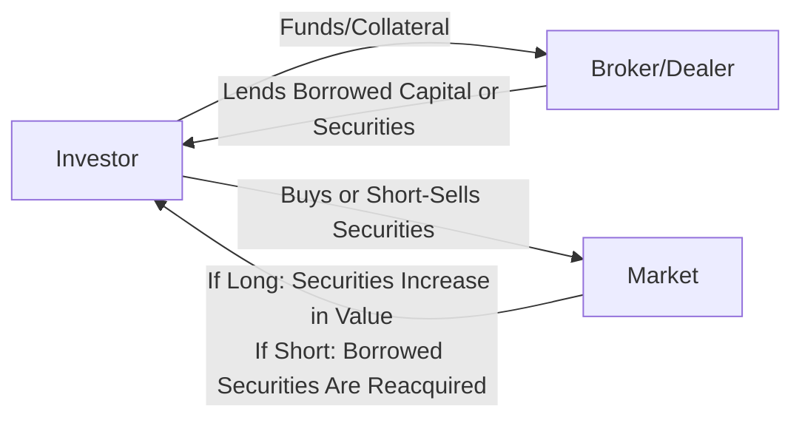

## 9.2 Margin Account Transactions

Margin accounts are powerful tools that allow investors to borrow funds (or securities) from a brokerage firm to finance part of their investment transactions. By leveraging borrowed capital, investors aim to amplify returns. However, margin trading also amplifies risks, requiring careful management of regulatory requirements, risk exposure, and liquidity. This section outlines the core concepts, strategies, and best practices for margin trading in the Canadian context, with focus on both long and short positions.

---

## Introduction to Margin Accounts

In a traditional cash account, investors must pay the full price of the securities. Margin accounts differ by allowing investors to borrow capital from their broker to purchase (long) or borrow securities to sell (short). The regulatory body that governs margin requirements in Canada is the Canadian Investment Regulatory Organization (CIRO). CIRO rules dictate the minimum equity portion you must maintain in a margin account, helping ensure prudent leverage and risk management.

### Key Benefits
• Increased buying power: Investors can control larger positions with lower initial capital.  
• Flexibility: Margin can be used for both long and short positions.  
• Potential for higher returns on equity: Profits can be magnified relative to the invested capital.

### Key Risks
• Losses Amplified: Losses are equally magnified, sometimes exceeding the investor’s initial capital.  
• Margin Calls: If the value of the assets falls below regulatory thresholds, additional funds or securities must be deposited.  
• Forced Liquidation: Failure to meet margin calls may result in the broker selling off securities to recompute margin balances.

---

## Understanding Long and Short Positions

### Long Position
A long position consists of buying securities (such as common shares) with the expectation that their price will rise. In a margin account, the investor contributes part of the purchase price, while the brokerage firm loans the rest of the funds.

• Example: Suppose an investor wants to buy 100 shares of a company trading at CAD 50 each (for a total of CAD 5,000). If the margin requirement is 30%, the investor can use CAD 1,500 of their own funds, while the broker fronts the remaining CAD 3,500.

### Short Position
A short position is initiated by borrowing shares from the broker (who locates them from other clients or its own inventory) and then selling those shares on the market. The investor’s objective is to buy back the shares later at a lower price, returning the borrowed shares to the broker and profiting from the difference.

• Example: An investor believes the share price of ABC Corp. (currently trading at CAD 70) will fall. They short-sell 100 shares. If the price drops to CAD 60, the investor buys back the shares at the lower price, realizes a profit of CAD 10 per share, or CAD 1,000 total, minus any transaction fees and margin interest.

Unlike a long trade, short selling carries the risk of potentially unlimited losses—for instance, if the stock’s price rises significantly, the short seller must buy it back at a much higher price to cover (return) the borrowed shares.

---

## Margin Requirements and Equity Calculations

Margin requirements under CIRO rules ensure investors maintain sufficient equity in their accounts. Equity is the investor’s stake in the position—essentially the difference between the market value of the securities and the borrowed amount.

### Minimum Equity
If CIRO mandates a 30% margin for a stock, the investor’s equity must remain at or above 30% of that position’s market value. For long positions, if the stock price falls, so does the equity value. For short positions, if the stock price rises, the investor’s liability increases, reducing the percentage of equity.

### Margin Calls
A margin call occurs when the margin’s equity percentage drops below the mandated threshold. Investors typically receive a request from their broker to deposit additional cash or securities to restore the equity level. Failure to meet the margin call may trigger forced liquidation to bring the account back in compliance.

#### Practical “Margin Call” Example
• Initial Investment: CAD 10,000 of Stock X (with 30% margin requirement, the investor contributes CAD 3,000 in equity).  
• Price Decline: The stock’s value drops from CAD 10,000 to CAD 8,000. Now the investor’s equity is CAD 8,000 – CAD 7,000 borrowed = CAD 1,000, which is 12.5% (1,000 / 8,000).  
• Margin Call: The investor must deposit additional funds or liquidate some holdings to re-establish a 30% margin ratio (i.e., 30% of CAD 8,000 = CAD 2,400). Thus, the broker can ask the investor to deposit CAD 1,400 or more to bring equity to CAD 2,400.

---

## The Margin Account Structure

Below is a simplified diagram illustrating the flow of funds and securities in a margin trade.

• The investor provides some capital (or collateral), and the broker supplies the balance (money for a long position or borrowed shares for a short position).  
• The investor executes trades on the market.  
• Gains or losses accrue to the investor, but the borrowed portion must be repaid or covered, often with interest or fees.

---

## Short Selling: Rules, Techniques, and Risks

### Basic Mechanics
1. Locate and Borrow Shares: The brokerage must confirm the availability of the shares.  
2. Sell Borrowed Shares: The investor sells the borrowed shares on the open market.  
3. Repurchase (Cover) at a Later Date: The investor eventually buys the same number of shares to return them to the lender.

### Regulatory Requirements
• Short Marking Exempt: Traders must properly mark short order tickets to comply with trading rules.  
• Locate Requirement: The broker must have a reasonable belief it can deliver shares by settlement, known as a “pre-borrow” or locate process.  
• Settlement Obligations: In Canada, most equity transactions settle on a T+2 basis (two business days after the trade date).

### Risk of a Short Squeeze
A “short squeeze” arises when a stock’s price rises sharply, prompting short sellers to buy shares quickly to cut losses, thereby accelerating the upward price move. This feedback loop can cause dramatic spikes in stock price, leading to significant short-term volatility.

### Unlimited Upside Risk
Theoretically, a stock’s price can climb indefinitely, resulting in unlimited losses for an unhedged short position. Hence, risk management measures—like stop-loss orders—can potentially mitigate some losses.

---

## Real-World Canadian Examples

1. Canadian Bank Shares (Long):  
   A client at RBC Direct Investing uses 40% margin to buy shares of Royal Bank of Canada (RY). If the share price rises from CAD 120 to CAD 130, profits are amplified compared to a fully paid position. However, if the price falls to CAD 110, losses are similarly magnified.

2. Blue-Chip Short on TSX:  
   An institutional investor shorted a high-profile mining stock in anticipation of falling metal prices. They had to ensure that the brokerage could locate the shares before executing the short. As expected, metal prices dropped, and the mining stock fell, providing a profitable cover transaction after a few weeks.

3. Pension Fund Strategy:  
   Large Canadian pension funds may use margin trading to hedge certain positions or to facilitate short exposure. Though they have substantial capital, margin transactions can help them optimize returns and manage portfolio risks, provided they adhere to internal investment policy statements and CIRO guidelines.

---

## Best Practices and Risk Mitigation

• Maintain Adequate Cash Reserves: Always be prepared for margin calls.  
• Use Stop-Loss or Stop-Limit Orders: Particularly important for short positions, to limit mounting losses.  
• Diversify: Spreading risks across sectors, asset classes, and instruments can help manage margin-related volatility.  
• Track Economic Indicators: Use resources like SEDAR (https://www.sedar.com) to research a company’s fundamentals, disclosures, and prospectus before entering leveraged trades.  
• Follow Technical and Fundamental Analyses: Employ tools like moving averages, relative strength indicators, or macroeconomic data to decide optimal entry and exit points.  
• Stay Current with CIRO Regulations (https://www.ciro.ca): Periodically review margin rules and short sale regulatory updates.

---

## Glossary of Key Terms

• **Long Position:** Buying and owning securities in anticipation of a price increase.  
• **Short Position:** Borrowing securities, selling them, and later repurchasing if you expect the price to drop.  
• **Margin Call:** A broker’s demand for a deposit of more funds when the equity in a margin account falls below the required level.  
• **Equity (in a Margin Account):** The investor’s portion of the position—(Market Value of Securities – Borrowed Amount).  
• **Short Squeeze:** A rapid escalation in the stock price that forces short sellers to cover positions, thereby driving the price further up.

---

## Additional Resources and References

• **CIRO**: [Short selling rules, margin guidelines, and best practices](https://www.ciro.ca)  
• **SEDAR**: [Company disclosures and filings for due diligence](https://www.sedar.com)  
• **Technical Analysis of the Financial Markets** by John J. Murphy: In-depth coverage of charting and technical indicators useful for timing both long and short trades.  
• **When Genius Failed** by Roger Lowenstein: Explores leverage and the perils of unmitigated risk, providing vital lessons for investors using margin.

---

## Conclusion

Margin accounts enable investors to leverage their capital for both long and short positions, offering potentially higher returns at increased risk. By understanding regulatory requirements, diligently monitoring positions, and employing sound risk management strategies, investors can optimize their use of margin in alignment with their financial goals. Always maintain adequate capital buffers to handle market fluctuations, margin calls, and evolving market conditions.

---

## Margin Account Transactions Quiz: Master Your Short and Long Strategies



### Which of the following best describes a long position in a margin account?

- [x] Buying securities with the expectation that their price will rise, using borrowed funds.
- [ ] Selling previously owned securities at a profit.
- [ ] Borrowing securities from a broker to sell on the market.
- [ ] Buying put options to hedge a portfolio.

> **Explanation:**( A long position in a margin account involves purchasing securities, partially financed by a broker, with the hope that the price will rise.)

### In Canada, if an investor fails to meet a margin call, the broker may:

- [x] Liquidate some or all of the securities in the account to restore margin compliance.
- [ ] Cancel the investor’s trade retroactively.
- [ ] Apply for an extension with CIRO without notifying the client.
- [ ] Waive the margin requirement indefinitely.

> **Explanation:**( Brokers have the authority to sell off positions or liquidate holdings in the margin account to restore required equity levels if investors do not meet their margin calls.)

### What is the principal risk of a short position?

- [x] Potentially unlimited losses if the stock price rises significantly.
- [ ] No losses are possible.
- [ ] Fixed maximum loss at the initial borrowed amount.
- [ ] The investor cannot close the position if the price goes down.

> **Explanation:**( In short selling, a rising stock price can lead to theoretically unlimited losses, since the stock may climb indefinitely.)

### Which regulatory organization primarily oversees margin requirements in Canada?

- [x] CIRO (Canadian Investment Regulatory Organization)
- [ ] SEC (Securities and Exchange Commission)
- [ ] OSC (Ontario Securities Commission)
- [ ] FINTRAC

> **Explanation:**( CIRO is the main self-regulatory organization overseeing investment dealers and enforcing margin rules in Canada.)

### What is a margin call?

- [x] A broker’s demand for additional funds or securities when the equity in a margin account falls below a required level.
- [ ] A way to purchase securities at a discount using options.
- [x] A process involving a phone call to confirm client identity.
- [ ] A direct instruction from the market exchange to pause trading.

> **Explanation:**( When the equity percentage falls below the mandated minimum, the broker issues a margin call requiring the investor to deposit more funds or securities.)

### Why might large Canadian pension funds use short selling?

- [x] To hedge against market or sector downturns.
- [ ] To eliminate all risk.
- [ ] Because it guarantees higher returns than long-only strategies.
- [ ] To take advantage of daily exchange market maker rebates.

> **Explanation:**( Large institutions can use short selling to hedge portfolio risks or to express a bearish view on certain market segments while maintaining broader diversification.)

### Which scenario could trigger a margin call in a margin account?

- [x] A decline in the stock price causes the account’s equity to drop below the required margin percentage.
- [ ] The investor chooses to add more securities without any market movement.
- [x] The investor’s stock price rises significantly, increasing the equity above the requirement.
- [ ] The brokerage lowers the margin requirement to 10% unexpectedly.

> **Explanation:**( If the value of securities in a margin account falls, the investor’s equity portion may slip below mandated levels, prompting a margin call.)

### What is a “locate requirement” in short selling?

- [x] The broker’s obligation to ensure shares are available to borrow before executing a short sale.
- [ ] A requirement for the investor to “locate” the best option chain for a stock.
- [ ] A measure to find the best interest rate on margin loans.
- [ ] A system for verifying client identity in margin accounts.

> **Explanation:**( The locate requirement ensures that the brokerage can deliver borrowed shares for settlement in a short sale, thus preventing naked short selling.)

### If an investor uses margin to buy CAD 10,000 worth of shares with a 30% margin requirement, how much must the investor contribute?

- [x] CAD 3,000
- [ ] CAD 10,000
- [ ] CAD 7,000
- [ ] CAD 4,500

> **Explanation:**( With a 30% margin requirement, the investor provides 30% of the purchase value: 0.30 × 10,000 = 3,000.)

### True or False: A short squeeze can cause sharp price increases, forcing short sellers to close their positions.

- [x] True
- [ ] False

> **Explanation:** A short squeeze happens when short sellers rush to buy back shares to cover positions amid rapidly rising prices, driving prices even higher.



---

## For Additional Practice and Deeper Preparation

**Elevate your exam readiness with our comprehensive app, "Securities CA: Mock Exams," designed to challenge and refine your skills.**

* **Master Challenging Questions:** Dive into expertly crafted sample exam questions that go beyond standard references.
* **Scenario-Driven Learning:** Experience scenario-driven case questions and in-depth solutions to build practical expertise.
* **Sharpen Exam Strategies:** Build confidence with step-by-step explanations designed to refine your exam-day tactics.
* **Gain Real-World Insights:** Acquire practical tips and detailed rationales that demystify complex concepts.
* **CIRO and CSI Alignment:** Stay current with CIRO guidelines and CSI’s exam structure, with questions intentionally more challenging than the actual exam.

**Download the App Today:**

> Note: While these courses are specifically crafted to align with the CSC® exams outlines, they are independently developed and not endorsed by CSI or CIRO.
