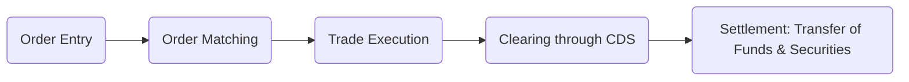

## 9.3 Trading and Settlement Procedures

Trading and settling equity securities in Canada require a clear understanding of the processes, timelines, and obligations that govern execution, clearing, and settlement. The Canadian Securities Exchange (CSE) and Toronto Stock Exchange (TSX) operate under a regulatory framework ensuring smooth transactions with minimal default risk. This section delves into each stage of the trading lifecycle—covering order entry, matching, execution, clearing, and settlement. We also explore critical concepts like the T+2 settlement cycle, cash and margin account requirements, and what happens if one party fails to deliver or pay.

Throughout this chapter, we will integrate real-world examples from Canadian financial institutions, examine practical strategies, and illustrate the processes with diagrams and tables. This knowledge will be vital for anyone seeking to navigate the Canadian equity markets effectively.

---

## Overview of the Trading Lifecycle

The trading lifecycle can be broken into five primary steps:

1. Order Entry  
2. Order Matching  
3. Trade Execution  
4. Clearing  
5. Settlement  

Before exploring these phases in depth, it is helpful to visualize the entire process.

### Order Entry

Order entry involves an investor relaying trading instructions to their dealer (investment firm or broker). In Canada, dealers typically capture the following information:  
• The ticker symbol of the security (e.g., RBC on TSX: RY).  
• Order type (e.g., market order, limit order).  
• Order size (e.g., 100 shares, 1,000 shares).  
• Validity period (e.g., day order, good-till-cancelled).  

The dealer routes the order to the appropriate exchange or an alternative trading system (ATS) consistent with best-execution policies and regulatory guidelines issued by the self‐regulatory organizations.

### Order Matching

Once the order arrives on the marketplace, the matching engine pairs buy orders with sell orders based on factors such as price and time. Key points include:  
• Price Priority: Orders at the best price (highest bid for buyers, lowest ask for sellers) get filled first.  
• Time Priority: Among competing orders at the same price, the earliest order takes precedence.

### Trade Execution

A “trade” occurs when a buy order and a sell order match. At this point, the exchange or ATS transmits trade details—price, quantity, time, and unique identifiers—to the dealer and ultimately to back-office systems for clearing.

---

## Clearing Through CDS

Clearing is the intermediary step between trade execution and settlement. It consists of determining the obligations of each party and verifying that each side can meet its responsibilities. In Canada, the primary clearing agent for equity trades is CDS Clearing and Depository Services Inc. (CDS).

### Netting and Risk Reduction

CDS employs a netting process, aggregating all buy and sell activity for each dealer. For example, if Dealer A buys 1,000 shares of Bank of Nova Scotia (BNS) from Dealer B, and simultaneously sells 500 shares of BNS to Dealer B, CDS calculates a net position:  
• Dealer A owes Dealer B only 500 shares (1,000 – 500).  

Netting reduces the volume of securities and funds that move between dealers, minimizing settlement risk and enhancing market efficiency.

### Final Confirmation

Before settlement, CDS provides all participants (broker/dealers) with a summary of net obligations. These records act as confirmation for each firm regarding how many securities they must deliver or receive, and how much money they should pay or expect to receive.

More information on CDS and its clearing rules can be found on the official CDS website:  
• [CDS Clearing and Depository Services](https://www.cds.ca)

---

## Settlement Procedures

Settlement constitutes the actual exchange of securities for money. Under current Canadian regulations, most equity securities, including common shares, settle on a T+2 basis. “T” stands for the trade date—and “+2” means two business days following the trade date.

### T+2 Settlement

For a trade executed on Monday (assuming no holidays during the week), payment and delivery must occur by the close of business on Wednesday. This T+2 cycle applies to most equity trades on Canadian markets, aligning with major global marketplaces such as the New York Stock Exchange.

| Day of Trade (T) | Settlement Due (T+2) |
|------------------|----------------------|
| Monday           | Wednesday           |
| Tuesday          | Thursday            |
| Wednesday        | Friday              |
| Thursday         | Monday              |
| Friday           | Tuesday             |

### Cash Accounts vs. Margin Accounts

In both a cash account and a margin account, T+2 is the standard timeline. However, the requirements differ:

1. **Cash Account**:  
   • Investors must pay the full purchase amount by T+2.  
   • If buying 100 shares of a company like RBC at $60 per share, the total cost ($6,000 plus commissions) must be in the account by settlement day.

2. **Margin Account**:  
   • Initial margin requirements must be posted by T+2.  
   • If an investor has a margin account with a Canadian broker such as TD Direct Investing, they may be required to post 50% of the security’s purchase price, depending on margin regulations and the security’s status (e.g., if it’s marginable).

---

## Electronic Record-Keeping and Delivery

Physical share certificates have become rare. Instead, securities are typically held in “street name” (the dealer holds the securities on behalf of the client) or via electronic book-entry forms. Book-entry ensures convenient transfers and significantly reduces administrative overhead.

### Role of the Canadian Depository for Securities

CDS holds and tracks securities electronically. When settlement occurs:  
• CDS updates its records to reflect the transfer of ownership.  
• Funds move via the Large Value Transfer System (LVTS) or other electronic payment networks to complete the transaction.  

For more details on settlement infrastructure, the [Bank of Canada Settlement Systems](https://www.bankofcanada.ca) provides resources on LVTS and Canada’s financial market infrastructure.

---

## Buy-Ins and Sell-Outs

Even though most trades settle seamlessly under T+2 guidelines, the system includes measures to handle defaults. Two crucial mechanisms are buy-ins and sell-outs:

### Buy-In

If the seller fails to deliver securities by the settlement date, the buyer’s brokerage can engage in a buy-in. Essentially, the buyer’s brokerage firm purchases the same securities in the market to deliver to the buyer, then charges all associated costs (e.g., any additional market price increase) to the failing seller’s brokerage.

### Sell-Out

Conversely, if the buyer cannot pay or does not deliver the required funds by settlement, the brokerage firm can perform a sell-out, selling the securities in the market and deducting any shortfall from the buyer’s account.

These remedies encourage discipline, ensure investors honor their commitments, and protect purchasers and sellers from non-delivery or non-payment.

---

## Regulatory Landscape

Clearing and settlement in Canada function within a regulatory environment overseen by agencies such as:

1. **Canadian Investment Regulatory Organization (CIRO)**:  
   • Provides industry rules and guidelines on trade settlement obligations and timelines.  
   • [Official CIRO Website](https://www.ciro.ca)

2. **Provincial Securities Commissions** (e.g., the Ontario Securities Commission):  
   • Enforce laws governing dealer obligations and investor protections.

3. **Canada’s National Instrument 24-101**:  
   • Addresses rules around matching, clearing, and settlement cycles.

Staying current with the latest regulatory notices ensures compliance and reduces the risk of fines or reputational damage for broker/dealers and individual advisers.

---

## Practical Examples and Case Studies

### Case Study 1: Large Canadian Bank Trade

• Scenario: An institutional fund manager at RBC Asset Management decides to purchase 50,000 shares of a Canadian technology company listed on the TSX.  
• Steps:  
  1. Order is placed via RBC’s trading desk.  
  2. Order is matched with a seller at the best offer, and a trade is executed on Monday (T).  
  3. RBC Asset Management receives confirmation that settlement will be on Wednesday (T+2).  
  4. CDS nets RBC’s overall buy and sell activity before settlement day.  
  5. By Wednesday, RBC Asset Management pays the net amount through its settlement accounts, and the ownership of the 50,000 shares transfers.

### Case Study 2: Margin Purchase with a Canadian Discount Broker

• Scenario: A retail investor uses a TD Direct Investing margin account to buy 1,000 shares of a dividend-paying Canadian bank.  
• Steps:  
  1. The investor places a limit order on Tuesday, which is filled at $60 per share (T).  
  2. The total cost is $60,000 + commission; half of this amount must appear in the margin account by T+2.  
  3. By Thursday, the investor’s final margin requirement is verified.  
  4. CDS confirms that TD Direct is responsible for delivering the funds to the seller’s broker.  
  5. Electronic book-entry finalizes the transfer of ownership.

These examples underscore the importance of meeting payment or delivery obligations on time to avoid forced buy-ins or sell-outs.

---

## Best Practices and Common Pitfalls

### Best Practices

• Always Verify Funding or Security Availability: Ensure the proper funds or shares are in the account well before T+2.  
• Track Margins Carefully: Keep track of margin requirements, especially in volatile markets where security values can fluctuate.  
• Stay Abreast of Settlement Cycles: Global markets sometimes have different settlement cycles, so know the differences if trading cross-border.  
• Maintain Good Communication with Brokerage Firms: Promptly respond to margin calls or settlement issues to avoid forced transactions.

### Common Pitfalls

• Overlooking Settlement Holidays: Settlement timetables exclude weekends and statutory holidays. Failing to account for holidays can lead to missed settlement deadlines.  
• Insufficient Funds in Cash Accounts: New investors sometimes forget to deposit funds into their accounts, causing avoidable sell-out procedures.  
• Misunderstanding Buy-In or Sell-Out Procedures: Not realizing the consequences of failing to deliver or pay can result in unexpected, additional costs.

---

## Additional Resources and References

• [CDS Clearing and Depository Services](https://www.cds.ca): Official source of clearing and settlement practices.  
• [CIRO](https://www.ciro.ca): Trade-related compliance and regulatory updates.  
• [Bank of Canada Settlement Systems](https://www.bankofcanada.ca): Insights into the LVTS and broader payment infrastructure.  
• [International Securities Services Association (ISSA)](https://issanet.org): Articles and research on evolving settlement and clearing best practices.  
• Open-Source Financial Tools: Platforms like R or Python’s “quantmod” and “pandas” libraries to help track investment portfolios and settlement cycles.

---

## Key Takeaways

1. Canadian equity trades typically operate on a T+2 settlement cycle.  
2. Clearing through CDS reduces transaction risk by netting buy and sell orders among dealers.  
3. Settlement involves transferring money to the seller and shares to the buyer—usually done electronically.  
4. Failing to settle on time can result in a forced buy-in (if a seller fails) or sell-out (if a buyer fails).  
5. Maintaining smooth settlement hinges on regulatory compliance, proper funding, clarity in margin requirements, and reliable communication with your brokerage.

By mastering these procedures and adhering to Canadian regulatory guidelines, investors can confidently participate in the equity markets, minimize risk, and ensure timely delivery of both cash and securities.

---

## Test Your Knowledge: Trading & Settlement Procedures in Canadian Equity Markets



### Which organization primarily handles the clearing of equity trades in Canada?

- [ ] The Toronto Stock Exchange (TSX)  
- [x] CDS Clearing and Depository Services Inc.  
- [ ] Investment Industry Regulatory Organization of Canada (IIROC)  
- [ ] Canadian Investment Regulatory Organization (CIRO)  

> **Explanation:** CDS Clearing and Depository Services Inc. is responsible for clearing equity trades, netting transactions, and ensuring the efficient settlement of securities in Canada.

### Which of the following best describes a T+2 settlement cycle?

- [ ] Trades settle two hours after execution.  
- [ ] Trades must settle two months after the trade date.  
- [x] Trades must settle two business days following the trade date.  
- [ ] Trades settle on the same day.  

> **Explanation:** A T+2 cycle requires settlement two business days after the trade date, aligning with major international markets.

### In a margin account, how long does the investor typically have to post the initial margin for a new tree?

- [ ] Immediately upon executing the trade.  
- [x] By T+2, the same day funds are due in a cash account.  
- [ ] Within one week to ensure regulatory compliance.  
- [ ] Margin is only required if the share price increases.  

> **Explanation:** Under Canadian regulations, margin must be posted by T+2, just like the settlement date for cash trades.

### What is a buy-in?

- [ ] A process where the buyer returns securities to the seller.  
- [x] A forced purchase of securities in the market to cover a failing seller’s obligations.  
- [ ] An agreement between buyer and seller to postpone settlement indefinitely.  
- [ ] A regulatory penalty for not reporting trades on time.  

> **Explanation:** When the seller fails to deliver securities, the buy-side firm can buy the necessary securities on the market, charging the cost difference to the seller.

### Which statement accurately describes netting in the clearing process?

- [x] Netting offsets buy and sell transactions to reduce the total number of securities and funds exchanged.  
- [ ] Netting is used to transfer physical share certificates among investors directly.  
- [x] Netting helps decrease settlement risk and costs for custody firms.  
- [ ] Netting provides margin requirement updates daily.  

> **Explanation:** Netting is the practice of aggregating buy and sell obligations to reduce the total volume exchanged, consequently lowering operational risk and costs.

### What can happen if a buyer fails to pay for securities by T+2?

- [x] The brokerage firm may perform a sell-out.  
- [ ] The trade is automatically canceled and has no consequences.  
- [ ] The seller compensates the buyer for any price fluctuations.  
- [ ] The settlement date extends by two more days.  

> **Explanation:** A sell-out allows the brokerage to sell the shares in the market, with the buyer absorbing any resulting cost or loss.

### Which regulatory body establishes rules on trade settlement timelines and dealer obligations?

- [x] CIRO  
- [ ] Canada Revenue Agency  
- [x] Provincial Securities Commissions  
- [ ] Canada Pension Plan Investment Board  

> **Explanation:** CIRO (and the relevant Provincial Securities Commissions) establish guidelines and rules dealers must follow with respect to settlements, timelines, and standards of conduct.

### How is settlement different from clearing in the trading process?

- [x] Settlement is the actual exchange of funds and securities; clearing is the process of reconciling and netting trade obligations.  
- [ ] Clearing and settlement are the same step performed together.  
- [ ] Settlement is merely a regulatory term, while clearing covers the movement of money.  
- [ ] Clearing occurs after settlement is fully complete.  

> **Explanation:** Clearing is the process of netting and confirms what each party owes, while settlement is when the actual exchange of assets for payment happens.

### Which of the following is a best practice to avoid settlement delays?

- [x] Verifying that the required funds or margin are in the account by T+2.  
- [ ] Relying on physical share certificates for easier record-keeping.  
- [ ] Ignoring notifications from your brokerage regarding margin calls.  
- [ ] Conducting all trades on foreign exchanges with different settlement cycles.  

> **Explanation:** Ensuring that funds and securities are available for settlement by T+2 is crucial to prevent delays and penalties.

### A “sell-out” occurs when:

- [x] A buyer fails to pay for purchased securities in a timely manner.  
- [ ] A seller mistakenly delivers twice the required shares.  
- [ ] A brokerage firm incorrectly records the trade date.  
- [ ] The exchange’s electronic systems experience an outage.  

> **Explanation:** If a buyer cannot fulfill the payment obligations by T+2, the brokerage initiates a sell-out, returning the shares to the market and recouping costs.



---

## For Additional Practice and Deeper Preparation

**Elevate your exam readiness with our comprehensive app, "Securities CA: Mock Exams," designed to challenge and refine your skills.**

* **Master Challenging Questions:** Dive into expertly crafted sample exam questions that go beyond standard references.
* **Scenario-Driven Learning:** Experience scenario-driven case questions and in-depth solutions to build practical expertise.
* **Sharpen Exam Strategies:** Build confidence with step-by-step explanations designed to refine your exam-day tactics.
* **Gain Real-World Insights:** Acquire practical tips and detailed rationales that demystify complex concepts.
* **CIRO and CSI Alignment:** Stay current with CIRO guidelines and CSI’s exam structure, with questions intentionally more challenging than the actual exam.

**Download the App Today:**

> Note: While these courses are specifically crafted to align with the CSC® exams outlines, they are independently developed and not endorsed by CSI or CIRO.
