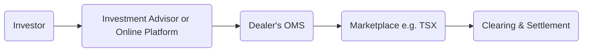

## 9.4 How Securities Are Bought and Sold

In Canada, equity trades involving stocks, exchange-traded funds (ETFs), and other listed securities are typically conducted on regulated marketplaces such as the Toronto Stock Exchange (TSX). While the fundamental process—placing an order, matching it with a corresponding buy or sell order, and settling the transaction—may seem straightforward, the actual mechanics are governed by an intricate set of rules and protective measures overseen by the Canadian Investment Regulatory Organization (CIRO). As a registrant or active participant in the Canadian securities market, it is vital to understand how various order types function and the ways investors can specify their desired conditions for trade execution.

This section discusses how securities are bought and sold, emphasizing the different order types, regulatory framework, and practical strategies that facilitate smooth and accurate execution of investors’ instructions.

---

## Understanding the Order Flow in the Canadian Markets

At the heart of a securities transaction is the order flow: the path an order travels from the investor to the marketplace where it is matched with a corresponding buy or sell order. The major participants in this process are:

1. The investor or client.  
2. The investment advisor (if applicable), discount brokerage platform, or order-entry interface.  
3. The dealer/firm’s order management system (OMS).  
4. The marketplace (e.g., the TSX).  
5. The clearing and settlement systems (e.g., CDS Clearing and Depository Services).

Below is a simplified diagram showing the typical order flow:

Investors choose an appropriate order type based on their goals, risk tolerance, and desired outcome. An understanding of the primary order types—market orders, limit orders, stop or stop-loss orders, and stop-limit orders—is essential for effective portfolio management and for mitigating unforeseen market risks.

---

## Market Orders

A market order instructs the brokerage or trading platform to buy or sell a security immediately at the best available price. Because market orders are executed promptly:

• Advantage:  
  - Fast execution, especially in liquid stocks where large volumes drive narrower bid-ask spreads.

• Disadvantage:  
  - Price uncertainty. In volatile conditions, the final execution price may differ significantly from the quote at the time the order was placed.

### Practical Example

Consider an investor at RBC Direct Investing who places a market order to buy 1,000 shares of ABC Inc. at 10:00 a.m. The most recent bid price may be $20.00, and the ask could be $20.05. With a market order, the investor’s instruction is processed immediately, and shares are purchased at a price close to $20.05, possibly spanning multiple limit orders on the order book if the share volume at each price level is insufficient to fill the entire order at once.

### When to Use a Market Order

• When speed is of utmost importance (e.g., urgent buying or selling).  
• For actively traded stocks that feature tight bid-ask spreads and high liquidity.  
• When small price variances are acceptable, and the investor prioritizes quick execution over price control.

---

## Limit Orders

A limit order sets a specified price—target for buyers (no more than a stated price) and a minimum acceptable price for sellers. This grants the investor significant control over the transaction price but comes with the risk that the order may not execute if the security’s market price does not meet the limit price.

• Advantage:  
  - Greater price control, allowing the investor to limit the maximum purchase price or the minimum selling price.

• Disadvantage:  
  - Non-execution or partial execution risk if the market never hits the specified price.

### How Limit Orders Work

Imagine an investor wants to buy shares of XYZ Corp. at no more than $50.00 per share. They could place a buy limit order at $50.00. If the asking price remains above $50.00, the order will not fill. The order executes only if the market price drops to $50.00 or better (below $50.00).

### Strategic Considerations

• Helpful in volatile markets where prices fluctuate rapidly and an investor wants to avoid paying more (or receiving less) than intended.  
• Often used by more risk-averse or price-conscious traders.  
• Productivity in limit order books is subject to changing market conditions—certain large institutional investors (e.g., Canadian pension funds) might place large limit orders that significantly impact market liquidity.

---

## Stop Orders (Stop-Loss Orders)

A stop-loss (stop) order is triggered once a specified “stop price” is reached or surpassed. After triggering, it converts to a market order and executes at the best available price. **Stop orders** are widely used to limit losses or protect gains in a portfolio.

• Advantage:  
  - Helps to protect unrealized gains or limit further losses if the stock moves adversely.

• Disadvantage:  
  - Execution could occur at a price significantly worse than the stop price in a rapidly falling market or during a market gap.

### Real-World Example

Assume an investor has accumulated shares of DEF Ltd. in a margin account at TD Direct Investing. The shares are trading around $35.00, and the investor places a stop order at $30.00 to exit the position if the price drops significantly. If DEF Ltd. trades below $30.00 for any reason (e.g., a major earnings miss), the stop order is triggered and converts into a market order. If the stock is temporarily very illiquid or experiences a large downward gap, the actual execution price could be $29.50 or even lower.

### Best Practices

• Place stop orders based on support levels identified in fundamental or technical analysis.  
• Recognize that stops do not guarantee execution at or near the stop price.  
• Monitor news and events that could induce price gaps, such as earnings announcements or major economic indicators.

---

## Stop-Limit Orders

A stop-limit order merges the features of a stop order and a limit order. Once the stop price is reached, the order becomes a **limit order** (as specified), rather than a market order. This provides partial protection against slippage but introduces the risk that the position won’t be closed if the limit price is not fulfilled.

### Example: Stop-Limit Order Dynamics

If an investor holds GHI Inc. shares trading at $40.00 and wishes to protect downside below $35.00 but also wants to avoid a massive price gap, they could use a stop-limit order. For instance:

• Stop Price: $35.00  
• Limit Price: $34.00  

Once GHI Inc. hits $35.00, the order transforms into a limit order to sell at $34.00 or better. If the stock temporarily falls below $34.00 without volume in that price range, the order may remain unfilled, leaving the position partly or completely intact.

---

## Day Orders vs. Good-Till-Cancelled (GTC) Orders

An order’s duration is equally important as its type:

1. **Day Order**: Valid only for the current trading session. It automatically expires if not executed by day’s end.  
2. **Good-Till-Cancelled (GTC)**: Remains active until it is executed or explicitly cancelled (often subject to a dealer’s maximum time limit, commonly around 30–90 days).

### Strategic Use of Day vs. GTC Orders

• **Day Orders**: Suitable for short-term traders who frequently adjust trading levels or rely on daily market movements.  
• **GTC Orders**: Favorable for investors operating with longer timelines who do not wish to re-enter orders daily. However, GTC orders can become neglected and fill unexpectedly after corporate announcements, leading to unintended trades at certain price levels.

---

## Special Instructions: Fill or Kill, Immediate or Cancel

When exact timing and certainty are required, special instructions can be added:

1. **Fill or Kill (FOK)**: An instruction for the entire order to be filled immediately, or else it’s cancelled. This is often applied for large block trades.  
2. **Immediate or Cancel (IOC)**: Similar concept but usually allows partial filling, with any unfilled portion cancelled instantly.

Institutional investors sometimes use these instructions to control the market impact of large orders. For instance, a major pension fund seeking to acquire shares without significantly moving share prices might place a fill-or-kill order to “test” available liquidity at specific price levels.

---

## Regulatory Oversight and Order Protection

Regulatory bodies such as CIRO (Canadian Investment Regulatory Organization) exist to ensure an equitable and transparent marketplace:

• **Order Protection Rule (OPR)**: Mandates that all visible, better-priced orders must be executed before inferior-priced orders on any other marketplace.  
• **Fair Access Requirements**: Ensures that all types of investors—ranging from large institutions to retail investors—can participate in the market on equal terms.  
• **Dealer Conflicts and Best Execution**: Dealers are obligated to act in their clients’ best interests, striving for optimal execution quality in terms of price, speed, and total transaction cost.

For detailed guidance on these rules, see:  
• CIRO website (https://www.ciro.ca).  
• “Trading Rules” sections available on TSX (https://www.tsx.com).

---

## Practical Tools and Resources

Modern technology and data tools enable investors to simulate and analyze the potential outcomes of different orders:

- **Market Data Vendors**: Platforms like the Bloomberg Terminal, Refinitiv Eikon, or Yahoo Finance API.  
- **Open-Source Python Libraries**: Tools such as “pandas” and “NumPy” can help analyze historical data and model hypothetical order executions.  
- **Recommended Reading**:  
  - “Algorithmic Trading and DMA” by Barry Johnson — an advanced overview of sophisticated order types and direct market access.  
  - TSX Market Making FAQs (https://www.tsx.com) — clarifications on liquidity provision and special order types.

---

## Putting It All Together: Key Considerations for Investors

Investors should weigh liquidity, volatility, and individual risk tolerance when selecting order types. Below is a summary comparison table of main order types:

| Order Type         | Price Certainty | Execution Certainty | Example Use Case                                                  |
|--------------------|-----------------|----------------------|-------------------------------------------------------------------|
| Market Order       | None           | High                 | Quickly entering or exiting a position, especially in liquid stock|
| Limit Order        | High           | Moderate            | Targeted buy/sell price with risk of partial or no fill           |
| Stop (Stop-Loss)   | None After Stop| High (Once Triggered)| Protecting unrealized gains or limiting losses in downward markets|
| Stop-Limit         | Moderate       | Low-Moderate         | Protecting gains but limiting slippage during triggered events    |  
| Day Order          | N/A            | Expires End of Day   | Short-term strategies needing daily updates                       |
| GTC                | N/A            | Remains Active       | Long-term strategy with a set price aim and no daily monitoring   |

---

## Best Practices and Common Pitfalls

• **Regularly Monitor GTC Orders**: Prices can trigger unexpectedly, especially after earnings announcements or other market-moving news.  
• **Consider Bid-Ask Spreads**: Thinly traded stocks or wide bid-ask spreads can cause unexpected trade prices (especially with market orders).  
• **Watch for Price Gaps**: Stop orders are vulnerable to gapping, resulting in execution far from the intended stop price.  
• **Respect Regulatory Guidelines**: Always comply with CIRO, TSX, and other self-regulatory organizations regarding fair trading practices, insider-information policies, and best execution obligations.  
• **Integrate Risk Management Tools**: Diversify, set appropriate position sizes, and maintain an awareness of margin requirements (especially relevant in short selling or leveraged strategies).

---

## Summary

Securing an optimal outcome when buying or selling equity securities requires thorough knowledge of how different order types function—and how regulatory frameworks in Canada shape their execution. From the immediacy of market orders to the precision of limit orders and the conditional nature of stop or stop-limit orders, investors have a variety of strategic tools. By tailoring specific order types, durations, and conditions (e.g., fill or kill, immediate or cancel) to personal risk tolerance and financial objectives, one can significantly enhance trading results and better safeguard capital.

The next step in developing strong foundational knowledge lies in understanding margin accounts, short-selling mechanics, and how trades are ultimately settled. Together, these insights complete the picture of equity securities transactions in the Canadian marketplace.

---

## Test Your Knowledge of Securities Orders and Execution



### Which of the following best describes a market order in the Canadian equity market?

- [ ] An order that allows you to specify both a maximum and minimum price for execution.  
- [x] An order to buy or sell immediately at the best available price.  
- [ ] An order that only executes once a specific stop price is reached.  
- [ ] An order that will remain open until explicitly cancelled or until a maximum time limit set by the dealer.  

> **Explanation:** A market order is filled as soon as possible at the best available price, without specifying a price limit.

### Which statement accurately reflects the risk associated with limit orders?

- [ ] The risk of execution at a price worse than expected.  
- [x] The risk that the order might never be executed.  
- [ ] The risk of immediate fill without user confirmation.  
- [x] The risk of a partially filled order remaining open.  

> **Explanation:** With limit orders, there is no guarantee the market will reach your limit price, so execution may never occur or only partially fill if insufficient liquidity is available at that price.

### A stop (stop-loss) order becomes a market order:

- [x] Once the specified stop price is reached or exceeded (on the sell side) or dropped below (on the buy side).  
- [ ] When the execution venue confirms the trade.  
- [ ] When the investor cancels the limit condition.  
- [ ] If it remains unfilled by the end of the trading day.  

> **Explanation:** A stop order is activated only upon hitting the stop price, at which point it converts into a market order.

### What sets a stop-limit order apart from a traditional (stop-loss) stop order?

- [ ] The stop-limit order does not require a specific stop price.  
- [ ] The stop-limit order converts into a market order only at the end of the trading day.  
- [x] The stop-limit order becomes a limit order rather than a market order once triggered.  
- [ ] The stop-limit order is only valid for commodity exchanges.  

> **Explanation:** A stop-limit order combines a stop condition with a subsequent limit order, avoiding immediate market execution once triggered but also risking no fill if the limit price is not met.

### Day orders and GTC orders differ in:

- [x] How long they remain open on the marketplace.  
- [ ] The type of security used.  
- [x] The type of instructions traders can include.  
- [ ] Their regulatory approval process.  

> **Explanation:** A day order expires if unfilled at the close of the trading session, whereas a GTC order remains in force until canceled (up to the broker’s time limit). Although both can often incorporate various instructions (e.g., limit, stop), the key difference is the duration.

### Which of the following special instructions requires the entire order to be completed immediately or canceled outright?

- [x] Fill or Kill (FOK).  
- [ ] Immediate or Cancel (IOC).  
- [ ] Day Order.  
- [ ] Stop Order.  

> **Explanation:** A fill or kill instruction means the entire order must be executed instantly. If full execution isn’t possible, the order is canceled right away. IOC is similar but typically allows partial fills.

### What is one advantage of placing a market order when trading a highly liquid stock on the TSX?

- [x] Quick execution due to the high trading volume and tighter spreads.  
- [ ] Guaranteed trade at the bid price.  
- [x] Virtually no difference between the bid and ask price.  
- [ ] The ability to automatically become a limit order.  

> **Explanation:** Highly liquid stocks commonly have narrow bid-ask spreads, so a market order will usually be filled rapidly, often at or near the quoted price. However, full guarantees on final price do not exist.

### What is the main regulatory body that oversees dealers and order handling in Canadian marketplaces?

- [x] CIRO (Canadian Investment Regulatory Organization).  
- [ ] The Bank of Canada.  
- [ ] Canada Mortgage and Housing Corporation (CMHC).  
- [ ] Canada Deposit Insurance Corporation (CDIC).  

> **Explanation:** CIRO oversees investment dealers, order handling, and aims to ensure fairness and transparency in Canada’s capital markets.

### Why might some institutional investors, such as pension funds, utilize “fill or kill” or block limit orders?

- [x] To avoid partially filled orders that could disrupt the market and reveal their trading strategy.  
- [ ] To guarantee the position stays open overnight.  
- [ ] To accumulate shares slowly to avoid market impact.  
- [ ] To pay the highest possible price for a security.  

> **Explanation:** Institutional investors often use block trades with fill or kill or block limit orders to protect their trading strategies (avoid partial fills) and manage market impact effectively.

### In a rapidly falling market, which of the following statements about stop (stop-loss) orders is TRUE?

- [x] They can be triggered but turned into a market order that executes at a significantly lower price.  
- [ ] They never trigger, because they become canceled in volatile market conditions.  
- [ ] They remain at the specified stop price even after being converted.  
- [ ] They are guaranteed to execute at least the specified stop price.  

> **Explanation:** If a stock’s price dives quickly, a stop order will be activated, but the final execution price could be substantially below the stop price due to limited liquidity at or near that threshold.



---

## For Additional Practice and Deeper Preparation

**Elevate your exam readiness with our comprehensive app, "Securities CA: Mock Exams," designed to challenge and refine your skills.**

* **Master Challenging Questions:** Dive into expertly crafted sample exam questions that go beyond standard references.
* **Scenario-Driven Learning:** Experience scenario-driven case questions and in-depth solutions to build practical expertise.
* **Sharpen Exam Strategies:** Build confidence with step-by-step explanations designed to refine your exam-day tactics.
* **Gain Real-World Insights:** Acquire practical tips and detailed rationales that demystify complex concepts.
* **CIRO and CSI Alignment:** Stay current with CIRO guidelines and CSI’s exam structure, with questions intentionally more challenging than the actual exam.

**Download the App Today:**

> Note: While these courses are specifically crafted to align with the CSC® exams outlines, they are independently developed and not endorsed by CSI or CIRO.
