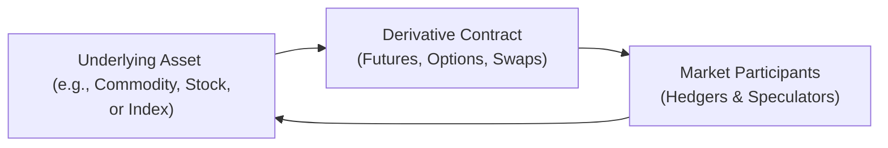

## 1.1 What Is a Derivative?

Let’s start with a quick personal reflection. When I first heard about derivatives, I remember feeling a bit overwhelmed. I thought, “Um, how can something have value if it doesn’t exist as a tangible thing?” Well, derivatives can feel confusing at first because they’re not direct assets—like a stock or a bond—but they’re tied to something else. Actually, that’s exactly what the word “derivative” means: it’s a financial contract whose price is derived from or dependent on the value of another underlying asset, interest rate, or index.

In other words, you don’t just buy a derivative because you like how it looks or because you can hang it on your wall. You buy it (or sell it) because you want or need exposure to the price movements of something else—like gold, wheat, crude oil, a company’s stock, interest rates, or even a broad market index. So let’s dig in and explore.

### Why Derivatives Matter

Derivatives are powerful. They let individuals and institutions manage risk (known as hedging), speculate on market directions, or otherwise gain/leverage market exposure. These uses can be both exciting and, well, potentially risky. Using derivatives to offset risk can be a huge strategic advantage, but using them to take on additional exposure can amplify gains—or losses.

Now, if you ask a Canadian wheat farmer about derivatives, they’ll likely mention selling futures contracts to lock in a price for their upcoming harvest, so they don’t risk a sudden drop in wheat prices. Meanwhile, a pension fund manager might use derivatives based on the S&P/TSX 60 Index to hedge against an unexpected market downturn. Or a trader might just speculate on oil price movements, hoping to profit from a correct bet.

### The Underlying Asset

Here’s the fundamental idea. A derivative’s value doesn’t exist in a vacuum. It’s determined by whatever that derivative references—an underlying asset or index. This could be a commodity such as crude oil or natural gas, a financial security like a corporate bond, an interest rate such as the Canadian Overnight Repo Rate Average (CORRA), or even a market volatility index. If that underlying asset goes up or down in price, so does the derivative’s value. This means derivatives can be exceptionally flexible tools for market participants who need or want to reshape their exposures without necessarily holding the actual assets.

### A Quick Look at Common Derivative Types

• Forwards and Futures: Contracts to buy or sell something at a future date at an agreed-upon price.  
• Options: Contracts that grant the right (but not the obligation) to buy or sell an underlying asset at a specified price by a certain date.  
• Swaps: Agreements to exchange cash flows, typically involving interest rates, currencies, or credit risk.

You’ll see these different contract types mentioned throughout this book. Each comes with its own structure, regulatory requirements, and associated costs or benefits.

### A Simple Visual of How Derivatives Work

Below is a basic Mermaid.js diagram showing the relationship between an underlying asset, a derivative instrument, and the market participants who might trade it.

- The underlying asset (A) influences the value of the derivative contract (B).  
- Market participants (C) trade the derivative contract, either to hedge risk or speculate.  
- The triangle of interactions (A → B → C → A) illustrates how changes in the underlying asset’s price affect the derivative, which in turn influences how hedgers and speculators position themselves.

### Key Characteristics of Derivatives

• They Derive Their Value: If the wheat market collapses, a derivative on wheat is likely to drop in value too. Conversely, if oil prices skyrocket, an oil-based derivative may appreciate as well.  
• They Enable Leverage: With derivatives, you can control a large notional amount of underlying assets by posting only a fraction of the total cost (“margin”). This can be incredibly useful but also introduces more risk if the market moves in the opposite direction.  
• They Involve a Counterparty: For every derivative contract, there’s someone on the other side. Exchange-traded derivatives have clearinghouses that help manage this counterparty risk. Over-the-counter (OTC) derivatives, however, are negotiated directly between two parties.

### Hedging vs. Speculating

In practice, derivatives are often used for two main goals:  
• Hedging: If you already hold a position in an asset that might lose value if prices go down, you can hedge by buying or selling derivatives that ideally offset those losses if the undesired scenario happens. Farmers, exporters, importers, insurance companies, banks, pension funds, and even individual investors can all hedge risk.  
• Speculating: Conversely, some participants use derivatives purely to seek profit from anticipated market moves. For instance, if you think gold is going to go up by 10% next month, you might buy call options or futures on gold. If your prediction is correct, you can make a tidy profit. But if the market heads lower, your losses might be amplified as well.

### Regulatory Oversight in Canada

In Canada, derivatives are overseen by the Canadian Securities Administrators (CSA) and the Canadian Investment Regulatory Organization (CIRO)—the latter formed from the amalgamation of IIROC and the MFDA. Both bodies aim to protect investors, ensure fair markets, and manage systemic risk. CIRO develops rules on margin requirements, sets guidelines for how derivatives can be sold and traded, and enforces compliance among registrants. The CSA coordinates policy across provinces, helping standardize rules and oversight. 

If you’re curious about official updates, you can go to the [CIRO website](https://www.ciro.ca/) to check current regulatory notices or to [CSA’s website](https://www.securities-administrators.ca/) for national policy statements. 

### Advantages and Potential Drawbacks

Let’s do a quick rundown of the pros and cons.  

**Pros**  
• Risk Management: Derivatives go a long way in stabilizing or controlling exposure.  
• Flexibility: They provide ways to go long or short and can be used in a variety of market conditions.  
• Liquidity: Some derivatives (especially exchange-traded) can be highly liquid, with many buyers and sellers.  
• Cost Efficiency: Sometimes it’s cheaper to gain exposure through derivatives than by directly trading the underlying asset.

**Cons**  
• Complexity: Derivatives can be complicated, especially exotic OTC varieties.  
• Leverage Risk: While leverage can magnify returns, it can also magnify losses.  
• Counterparty Risk: In OTC markets, if your counterparty fails to meet its obligations, you could face losses.  
• Regulatory and Operational Risk: Using derivatives requires understanding margin calls, documentation, and compliance obligations.

For instance, I remember a friend who decided to buy call options on a mining stock without really understanding the margin exposure. The market turned south far faster than expected, and they ended up suffering bigger losses than if they had simply held the stock itself. This isn’t to scare you, but just to highlight: knowledge is power when it comes to derivatives.

### Real-World Example: Canadian Wheat Farmer

Consider a wheat farmer in Saskatchewan. They’re worried that by the time harvest season arrives, wheat prices might drop below their break-even point. To hedge this risk, the farmer might sell (or “short”) a wheat futures contract on the Bourse de Montréal or another exchange. If wheat prices indeed fall, the loss in the farmer’s actual crop revenue can be partially offset by gains from the short futures position. That’s a classic hedge.

### Another Example: Bank’s Interest Rate Risk

Imagine a Canadian bank that issues a lot of variable-rate mortgages. If interest rates unexpectedly spike, many variables could shift. The bank might use an interest rate swap, effectively trading floating-rate payments for fixed-rate payments, reducing the volatility in its income statement. Conversely, a corporate borrower might want to transform some of its fixed-rate debt into floating-rate debt, using a swap to suit its exact needs.

### Glossary of Key Terms

Let’s define a few essential terms you’ll see often:

• **Underlying Asset:** The financial asset or commodity that determines the derivative’s value. This could be wheat, a stock price, an interest rate, or an index.  
• **Leverage:** The ability to control a large position with a smaller amount of capital. It amplifies both gains and losses.  
• **Notional Amount (Notional Value):** The face value used to calculate gains, losses, or required collateral in a derivative contract.  
• **Hedging:** Using derivatives to offset potential losses in a related position.  
• **Speculating:** Attempting to profit from anticipated market movements using derivatives.  
• **Counterparty:** The other party in a derivative transaction—such as a bank, dealer, or investor.  
• **CIRO:** The Canadian Investment Regulatory Organization (since January 1, 2023), overseeing investment dealers and mutual fund dealers, among other roles.  
• **CSA:** The Canadian Securities Administrators: Canada’s umbrella organization of provincial and territorial securities regulators.

### Leveraging Technology and Tools

In recent years, derivative pricing and risk management have benefitted immensely from powerful software frameworks. For instance, [QuantLib](https://www.quantlib.org/) is an open-source library in C++ (with wrappers for Python) that provides sophisticated pricing models for derivatives. This can be really helpful if you’re building risk management or valuation tools—especially if you’re a bit more technically inclined.

### Common Pitfalls and Best Practices

**Pitfall 1: Over-Leverage**  
Even though it’s tempting to post a small amount of margin and control a huge contract, you can get burned quickly if the market moves against you. Best practice? Always have a clear understanding of your total exposure.  

**Pitfall 2: Lack of Understanding**  
It’s easy to buy or sell an option or a future without truly understanding how the contract works. (Anyone who’s placed an online order out of curiosity knows this feeling!) Best practice? Study the contract specifications, the margin requirements, and do a quick “what if” scenario analysis.  

**Pitfall 3: Poor Risk Management**  
Sometimes, people treat derivatives like lottery tickets. Instead, adopt a systematic approach. Use stop-loss orders, do stress tests, and keep an eye on your margin cushion.  

**Pitfall 4: Ignoring Regulatory Requirements**  
If you’re aiding clients, you have to follow CIRO and CSA guidelines for KYC (Know Your Client), margin rules, and transaction reporting. Best practice? Never let administrative or regulatory tasks slide. Mistakes can be costly in this department.

### Where to Learn More

• [CIRO](https://www.ciro.ca/): For updates, notices, and guidelines on derivatives for Canadian investment dealers.  
• [CSA](https://www.securities-administrators.ca/): For harmonized national rules and regulations.  
• “Options, Futures, and Other Derivatives” by John Hull: A classic textbook for an in-depth study of derivative pricing and applications.  
• [Bourse de Montréal](https://www.m-x.ca/): For resources on futures and options listed in Canada.  
• [QuantLib](https://www.quantlib.org/): Open-source library for derivative pricing models in C++/Python.

---

If you find yourself occasionally saying, “I’m a bit lost,” don’t sweat it. The world of derivatives can be something of a maze at the start. But trust me, once you understand the fundamentals—that value is derived from something else, that these instruments can manage or amplify risk, and that they’re regulated to protect both you and the broader market—you’ll be in a strong position to navigate advanced strategies. In fact, many of the upcoming chapters will build on these basics, showing how futures, options, swaps, and other derivatives can function in sophisticated ways.

Above all, keep an open mind and embrace continuous learning. Markets evolve, products evolve, and regulations evolve. It’s likely that by the time you’re comfortable with the current environment, something new will hit the market—maybe sustainability-linked derivatives, maybe exotic options tied to crypto assets. Stay eager, stay curious—and enjoy the journey!

---

## Sample Exam Questions: Understanding Derivatives Basics



### 1. Which statement best describes a derivative?

- [x] A financial contract whose value depends on an underlying asset or index.
- [ ] A guaranteed investment whose return is fixed at the time of purchase.
- [ ] A physical asset stored by a clearinghouse.
- [ ] An investment that never expires.

> **Explanation:** The defining characteristic of derivatives is that they derive their value from an underlying asset, commodity, or index.

### 2. Which of the following is an example of an underlying asset commonly used in derivatives markets? (Select all that apply)

- [x] Wheat
- [x] A stock index like the S&P/TSX 60
- [ ] Patents for new technology
- [x] Interest rates

> **Explanation:** Wheat, stock indexes, and interest rates are all common underlyings for derivative contracts; patents are typically not.

### 3. What is one major advantage of derivatives for a wheat farmer?

- [ ] They guarantee unlimited profit.
- [ ] They eliminate all financial risks entirely.
- [x] They can hedge against falling wheat prices.
- [ ] They allow the farmer to store wheat more efficiently.

> **Explanation:** By selling futures or other derivative contracts, farmers can offset the risk of lower prices when harvest time arrives.

### 4. Which entity primarily oversees derivatives regulation and margin requirements among Canadian investment dealers?

- [ ] The Mutual Fund Dealers Association (MFDA)
- [x] The Canadian Investment Regulatory Organization (CIRO)
- [ ] The Bank of Canada
- [ ] The Canada Revenue Agency (CRA)

> **Explanation:** The MFDA and IIROC amalgamated to form CIRO in 2023. CIRO is responsible for overseeing derivatives regulation among investment dealers.

### 5. When we say “notional value” in a derivative contract, what are we referring to?

- [ ] The actual market value of the derivative today.
- [x] The face value used to determine gains and losses.
- [ ] The amount of physical assets stored in a warehouse.
- [ ] The registration fee paid to the clearinghouse.

> **Explanation:** “Notional value” is the reference or face amount upon which contract payouts are based, not the current cost of the contract.

### 6. If you buy an option contract, what does “leverage” typically allow you to do?

- [x] Control a large position with a relatively small capital outlay.
- [ ] Remove all risk associated with the trade.
- [ ] Access margin at zero cost.
- [ ] Eliminate the possibility of price fluctuations.

> **Explanation:** Leverage is the mechanism by which a smaller initial outlay controls a significantly larger notional exposure.

### 7. Which best describes “counterparty risk” in OTC derivatives?

- [x] The risk that the other party to the contract will default on its obligations.
- [ ] The risk of losing money due to poor technical analysis.
- [ ] The risk of a broker issuing a margin call.
- [ ] The risk of daily mark-to-market settlements.

> **Explanation:** Counterparty risk is the chance that the direct party you traded with fails to pay or deliver.

### 8. Which of the following best describes hedging?

- [x] Using derivatives to offset potential losses in another investment.
- [ ] Adding more exposure to a promising stock to increase returns.
- [ ] Buying random assets to diversify risk.
- [ ] Trading derivatives only when the market is bullish.

> **Explanation:** Hedging involves taking a position in a derivative that is intended to reduce or eliminate the risk from another position.

### 9. Which resource is an authoritative open-source resource for pricing models in C++ and Python?

- [ ] CSA
- [ ] CIRO
- [x] QuantLib
- [ ] The Bourse de Montréal

> **Explanation:** QuantLib is a well-known open-source library for financial instrument modeling, especially derivatives.

### 10. True or False: Using derivatives ensures that investors will never face losses because of regulatory protections.

- [ ] True
- [x] False

> **Explanation:** While regulations aim to maintain market integrity and protect investors from fraud or major systemic risks, they do not prevent normal market losses. Derivatives can still result in significant financial gains or losses based on underlying market movements.


