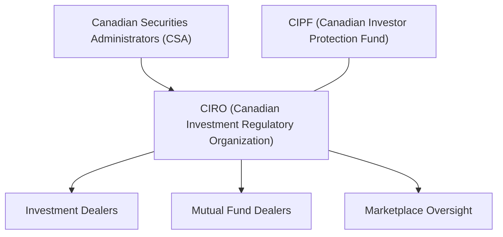

## 1.11 The New CIRO Regulatory Landscape

Let’s talk about something that has significantly reshaped the Canadian investment space. It’s one of those changes that, at first glance, might sound like regulatory jargon—but actually has wide-ranging implications for all of us who participate in the derivatives market (and, hey, even for folks who never want to touch a futures or options contract in their lives!). I’m referring to the amalgamation of the Investment Industry Regulatory Organization of Canada (IIROC) with the Mutual Fund Dealers Association of Canada (MFDA), effective January 1, 2023, and the birth of the Canadian Investment Regulatory Organization (CIRO). 

Maybe you’re thinking: “Okay, so two regulators merged—does that really matter?” Absolutely. Whether you’re a prospective investor, an Approved Person at a dealer firm, or a policy enthusiast who can’t get enough of compliance bulletins, this new regulatory landscape changes how participants enter the derivatives market, how compliance is enforced, and how professional development is managed. 

Below, we’ll dig deeper into how CIRO came about, what it is, why it matters, and how it affects our daily lives in the derivatives world.

---

A Quick Anecdote

I remember when I was an up-and-coming trainee, flipping through multiple manuals—one set from IIROC, another set from the MFDA, plus the old SRO references—and trying to figure out who exactly oversaw which part of the derivatives business. It was, honestly, a bit like having two separate highway routes: you’d constantly check which road to be on so you didn’t violate the wrong traffic sign. The creation of CIRO merged these roads, so now there’s a single, broader highway. That, at least, is the theory—regulatory harmonization that streamlines oversight and protects investors more effectively. 

---

The Reason for Amalgamation

Amalgamation, in regulatory-speak, means legally combining separate entities into a single organization with a new name, mandate, and structure. In this case, IIROC and the MFDA became one legal entity. This new entity was initially referred to as the “New SRO,” but as of June 1, 2023, it officially rebranded as the Canadian Investment Regulatory Organization (CIRO). The goal? Ensure consistent, national oversight for all investment dealers (those who used to report to IIROC) and mutual fund dealers (those who used to fall under the MFDA). 

Here’s a short definition from our glossary:

• Amalgamation: Legally combining separate entities into a single organization.

CIRO now oversees Canadian investment dealers, mutual fund dealers, and marketplace activities. So we have a single Self-Regulatory Organization (SRO)—that is, a non-governmental entity authorized to create and enforce industry regulations. By consolidating IIROC and the MFDA, CIRO aims to reduce regulatory fragmentation and bring clarity to those day-to-day compliance tasks that so many of us used to juggle under two separate sets of rules.

---

The Role and Purpose of an SRO

SRO stands for Self-Regulatory Organization. In Canada, SROs historically have played an integral part in monitoring and supervising the conduct of securities (and now many derivatives) market participants. They do so under the umbrella of the larger Canadian Securities Administrators (CSA)—that’s the umbrella group of provincial securities regulators. In other words, the CSA sets the overarching framework, and the SRO enforces day-to-day compliance, membership rules, and proficiency standards.

Now that we’ve replaced IIROC and the MFDA with CIRO, we can expect a more unified approach regarding rules of conduct, daily compliance monitoring, and new continuing education requirements. 

---

The New CIRO: Structure and Oversight

So how does CIRO fit into the big picture? The following Mermaid diagram might help visualize it:

• The CSA is at the apex: It’s composed of Canada’s provincial and territorial securities regulators.  
• CIRO is right below the CSA, charged with overseeing both investment dealers and mutual fund dealers.  
• CIPF (Canadian Investor Protection Fund) remains independent but is closely linked to CIRO, offering protection of client assets in case a member firm becomes insolvent.  

Prior to 2023, the MFDA Investor Protection Corporation (MFDA IPC) provided coverage specifically for mutual fund dealer insolvencies. Now, that role is handled completely by CIPF, which is mandated to protect financial assets up to specified limits.

---

Impact on the Derivatives Market

What’s most exciting—and perhaps a bit nerve-wracking—for derivatives participants is how everything from licensing and registration to marketplace rules gets filtered through a single SRO. If you’ve ever had to decipher which rulebook governed your role in clearing or settlement, or which continuing education credits you needed for a derivative-based license, you can guess how helpful this is. 

• One SRO means less confusion about which compliance rules to follow if you deal in futures, options, or swaps alongside something like mutual funds.  
• For professional development, you’re no longer crossing between two organizations for accreditation.  
• Investor protection extends across both mutual funds and various derivative instruments under one consistent coverage approach from CIPF.  

In simpler terms, from now on you can (in theory) rely on a single resource—CIRO—for understanding your responsibilities. 

---

Proficiency Standards and Proposed Changes

Let’s think about proficiency. Proficiency Standards are the minimum education and competency requirements necessary to perform regulated activities. For instance, an Approved Person (someone recognized by a regulator as qualified to deal in certain financial products) needs to have the knowledge and expertise to guide clients or manage trades responsibly.

Under CIRO, there are proposed changes to move toward an assessment-centric proficiency model for certain derivatives licensing. That might mean, for example, that rather than just completing a set number of courses, prospective representatives could be asked to pass a robust, standardized exam focusing on skills and practical knowledge. The idea is to ensure that new folks entering the industry prove they really know how derivatives work—even under real-life market conditions.

We’re still waiting on final decisions from the CSA on how precisely this will be implemented. But the expectation is that Approved Persons dealing in derivatives will need to meet new, more consistent benchmarks. 

The official references for these upcoming changes can be found on the CSA website:
• https://www.securities-administrators.ca/

To maintain your status as an Approved Person, you’d likely have to continue fulfilling certain Continuous Professional Development (CPD) obligations. These might be annual “refreshers,” new training modules when regulations change, or specialized courses when new derivative products appear. This ensures that we, as market participants, stay up-to-date on the hottest new instruments and remain well-versed in all relevant rules so we can best serve our clients.

---

Who Needs to Register?

If you’re working at a dealer that handles derivatives, guess what—you need to register with CIRO. Registration is processed through the National Registration Database (NRD), an electronic system that captures registration and reporting info for all sorts of market participants across the country. It’s no longer “some to IIROC, some to MFDA.” Now it’s one place, one process. 

One interesting question arises: “What about foreign dealers or individuals who want to trade derivatives in Canada?” They still have to follow the CSA’s cross-border registration exemptions (if any apply), but if they become a recognized or participating entity within Canada, they’d do so under CIRO’s watchful eye.

---

Client-Focused Reforms

You may have heard the phrase “Client-Focused Reforms” (CFRs). It’s about prioritizing the client’s interests, be that in recommending a product or disclosing fees. Under the new SRO model, CFRs get an even bigger spotlight. The hope is that by harmonizing rules across investment and mutual fund dealers, client interests stay front and center. For example, if a client has both a derivatives account (for, say, trading index futures) and a mutual fund account, they benefit from the same standardized approach to conflict-of-interest disclosure, the same approach to product due diligence, and the same robust oversight if something goes wrong. 

---

Accreditation and Ongoing Training

Dealers must ensure their employees hold the right accreditation, such as the Derivatives Fundamentals and Options Licensing Course (DFOL) or the Canadian Securities Course (CSC®), depending on their roles. This official accreditation, often from the Canadian Securities Institute (CSI), boosts knowledge in areas like futures markets, derivatives pricing, hedging, and speculation. But that’s just the starting point. Under the new regime, there’s a stronger emphasis on ongoing training—sometimes known as CPD (Continuous Professional Development). 

What does CPD look like? Possibly a combination of:  
• Webinars offered by industry associations on new derivative products.  
• Annual ethics training on how to handle potential conflicts of interest.  
• In-house modules to remind you of best practices in reporting and compliance.  

Some folks grumble that it’s more time and cost. But imagine the alternative: you’d buy or sell sophisticated derivative instruments without current knowledge of regulatory updates or new risk management techniques. That’s not a recipe for great client outcomes.

---

Why the Consolidation is Beneficial—With a Personal Story

While the transition to CIRO might feel abrupt, I recall a scenario a few years back when a friend of mine, a derivatives specialist at a small brokerage, had to keep track of multiple rule sets because his firm also offered mutual funds. Monitoring overlapping or conflicting guidelines from IIROC and MFDA was a headache.  

He had two separate continuing ed calendars: one for dealing-rep-related courses under the MFDA, and another for advanced derivatives training under IIROC. A mismatch in scheduling meant he nearly missed a critical compliance deadline. With CIRO in place, having a single set of rules—even if they’re still robust—lets him focus on expanding business and helping clients instead of juggling duplicative compliance tasks. So, yes, it might be complicated for a brief transition period, but in the long run, we expect a more streamlined approach.

---

Investor Protection: The Role of CIPF

Remember how CIPF (the Canadian Investor Protection Fund) used to overlap with the MFDA IPC (Investor Protection Corporation)? Now that’s merged, too. CIPF provides coverage for client assets up to certain limits if a member dealer becomes insolvent. Importantly, CIPF is not a government entity nor is it owned by CIRO. It’s independent, though it works closely with CIRO to ensure any shortfalls are addressed as quickly as possible.

CIPF coverage is more or less uniform whether you’re trading derivatives or mutual funds—though each product can carry its own risk. Keep in mind that investor protection doesn’t mean protection from market losses (if you trade a call option that goes to zero, CIPF won’t reimburse you). Rather, CIPF coverage steps in if the dealer holding your assets goes bankrupt and your holdings are missing. 

---

Practical Implications Going Forward

• Uniformity: With CIRO, derivatives customers no longer wonder if they’re dealing with an IIROC or MFDA firm. You can expect consistent standards, whether your trades settle through an investment dealer or a mutual fund dealer with a derivatives license.  
• Proficiency Upgrades: Proposed new proficiency pathways could mean updated exams and modules for practicing professionals and new entrants. This might boost the overall quality of advice or service in the Canadian derivatives market.  
• Increased Enforcement: A single SRO can shift resources more efficiently, coordinating oversight efforts to catch misconduct in real time.  
• Cross-Canada Consistency: Although the provinces and territories each have their own securities commission, CIRO’s single framework reduces potential disparities.  

---

Common Pitfalls and Best Practices

Pitfalls:  
• Assuming old IIROC or MFDA rules still apply verbatim. Many rules are carried forward but double-check for updates on ciro.ca.  
• Neglecting continuing training after obtaining a license. CIRO’s focus on CPD is real—failing to remain current could put your license in jeopardy.  
• Overlooking the new coverage structure of CIPF if you previously relied on MFDA IPC.  

Best Practices:  
• Bookmark and regularly check the CIRO site (https://www.ciro.ca/) for bulletins and notices.  
• Enroll in official accreditation programs like the Derivatives Fundamentals and Options Licensing Course (DFOL) or the Canadian Securities Course (CSC®) if you haven’t.  
• Monitor CSA bulletins regarding proficiency changes or new compliance rules.  
• Adopt a habit of “compliance journaling”: keep a quick daily or weekly log of new rules or bulletins released by CIRO, ensuring your compliance knowledge never goes stale.

---

A Quick Look at CIRO in the Future

Perhaps we’ll see an assessment-based approach that’s more hands-on, maybe requiring scenario-based testing for derivatives proficiency. This could mimic the real-world conditions of volatile markets, interest rate changes, or sudden market disruptions. The line between a “traditional” investment dealer and a “mutual fund dealer” might become less rigid if both can supervise derivatives with the same professional skill level. Ultimately, as derivatives become more mainstream—particularly with the rise of ESG- or crypto-linked products—CIRO’s oversight structure will be tested in new and unique ways.

Will that lead to more robust risk management or maybe more innovative derivative products in Canada? Possibly. One can only hope that having a unified regulatory approach encourages product innovation while carefully safeguarding the public interest.

---

Additional Resources for Deeper Exploration

• CIRO Official Website: [https://www.ciro.ca/](https://www.ciro.ca/)  
• Canadian Securities Administrators (CSA) Bulletins: [https://www.securities-administrators.ca/](https://www.securities-administrators.ca/)  
• Canadian Investor Protection Fund (CIPF): [https://www.cipf.ca](https://www.cipf.ca)  
• Canadian Securities Institute (CSI), offering courses like the DFOL and CSC®: [https://www.csi.ca](https://www.csi.ca)  

If you want to read the text of any new regulations or get updated memos on how derivatives are regulated under CIRO, you can always check out the official bulletins. Being proactive about these resources, especially if you plan to become or remain an Approved Person, is crucial.

---

Concluding Thoughts

So, yeah—this is quite a shift. When IIROC and the MFDA merged, it was a lot like rearranging the pieces of a well-loved jigsaw puzzle to create a clearer picture. For those of us in derivatives, it’s a big improvement: fewer silos, fewer conflicting rule sets, and hopefully more coherence in how we get licensed, maintain compliance, and serve clients. 

I’m personally excited to see how this single SRO continues to evolve, especially with new product innovations. And if someone asks why we needed to combine two big regulators into one, you can say it’s about harnessing synergy, streamlining oversight, protecting investors, and ensuring uniform standards. Let’s just hope it saves us from the administrative nightmares many of us faced when toggling between multiple regulators!

---

## Sample Exam Questions: The New CIRO Regulatory Landscape



### Which of the following statements best describes the purpose of CIRO?

- [x] It is a single self-regulatory organization responsible for overseeing Canadian investment dealers, mutual fund dealers, and marketplace activities.
- [ ] It is a government entity that sets and enacts statutory laws for the entire Canadian financial system.
- [ ] It only regulates derivatives trading for large institutional clients.
- [ ] It focuses exclusively on securities regulation in British Columbia.

> **Explanation:** CIRO (Canadian Investment Regulatory Organization) was formed to oversee investment dealers, mutual fund dealers, and marketplace functions across Canada.

---

### What is the main advantage of having a single SRO after the amalgamation of IIROC and MFDA?

- [x] Harmonized regulatory standards and reduced overlap for firms dealing with multiple products.
- [ ] Increased segmentation of duties and rules between IIROC- and MFDA-related activities.
- [ ] Elimination of proficiency requirements for dealing in derivatives.
- [ ] Exemption from continuous professional development obligations.

> **Explanation:** Merging two separate SROs into one helps streamline compliance and harmonize rules, saving time and confusion.

---

### True or False: The Canadian Investor Protection Fund (CIPF) became Canada’s sole investor protection fund after IIROC and MFDA amalgamated.

- [x] True
- [ ] False

> **Explanation:** With the consolidation, CIPF merged with the MFDA IPC, resulting in CIPF becoming the single investor protection fund in Canada.

---

### Which entity ultimately provides the overarching framework under which CIRO operates?

- [ ] CIPF
- [x] The Canadian Securities Administrators (CSA)
- [ ] Individual provincial governments
- [ ] The DFOL course provider

> **Explanation:** The CSA (a group of provincial and territorial securities regulators) supervises SROs such as CIRO.

---

### Under the new self-regulatory platform, which of the following is most likely to be emphasized for Approved Persons dealing in derivatives?

- [x] An assessment-centric proficiency model, ensuring practical knowledge of derivatives.
- [ ] The elimination of licensing exams and strict reliance on in-house training only.
- [ ] A universal exemption from continuing education.
- [ ] A preference for manual reporting over electronic filings.

> **Explanation:** One of the goals under the new CIRO framework is to move toward more rigorous, assessment-focused proficiency requirements.

---

### Which statement is most accurate regarding the role of CIPF?

- [ ] CIPF compensates investors for any losses arising from market fluctuations in derivative contracts.
- [x] CIPF protects client assets if a member firm goes insolvent or cannot return assets to clients.
- [ ] CIPF is owned and operated by the government of Canada.
- [ ] CIPF underwrites dealer risk for free.

> **Explanation:** CIPF protects investors primarily against member insolvency, not ordinary trading losses.

---

### Why might the Client-Focused Reforms (CFRs) gain more prominence under CIRO?

- [ ] They are no longer relevant because mutual fund dealers have separate rules.
- [x] A unified SRO can ensure consistent conflict-of-interest and suitability rules, enhancing client outcomes.
- [ ] They apply only to derivatives and not to mutual funds.
- [ ] They merely encourage fee increases for clients.

> **Explanation:** CFRs were already in place, but under CIRO, enforcement is more integrated and consistent.

---

### Which of the following best defines the term "Proficiency Standards"?

- [ ] An administrative document that details CIPF’s coverage obligations.  
- [x] Minimum education and competency requirements to perform regulated activities.  
- [ ] A government-imposed regulation that prohibits derivatives training in Canada.  
- [ ] A list of option products pre-approved by CIRO for trading.  

> **Explanation:** Proficiency Standards outline the baseline knowledge and competencies needed by individuals who handle regulated activities (including derivatives).

---

### According to the new framework, which of the following is most important for maintaining licensure as an Approved Person?

- [ ] Signing up for the CSC® but never following up with continuing education.  
- [x] Completing required courses (e.g., DFOL) and fulfilling ongoing CPD requirements.  
- [ ] Choosing any free online course, regardless of content.  
- [ ] Providing a one-time letter of intent to CIRO.  

> **Explanation:** CIRO emphasizes both initial and ongoing educational requirements, so continuing professional development or CPD is key.

---

### True or False: Foreign dealers operating in Canada may be exempt from CIRO oversight entirely, regardless of any local business activities.

- [ ] True
- [x] False

> **Explanation:** Even foreign dealers must comply with Canadian regulations if they actively operate or solicit clients in Canada, unless specific exemptions apply.


