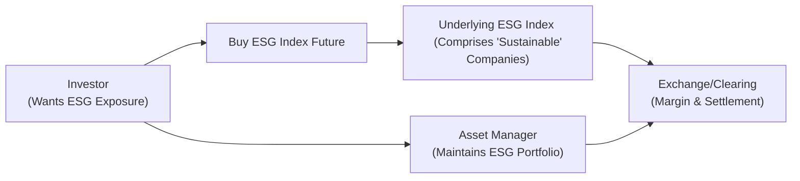

## 1.12 Emerging Asset Classes (ESG and Crypto Derivatives)

Sometimes I think back to an investment conference I attended a few years ago—ESG was the talk of the town. We’d just begun hearing about how environmental, social, and governance factors would reshape the markets. Fast-forward to today, and it’s no longer just talk. ESG has energized entire portfolios, offering new ways to align moral, environmental, and social values with financial objectives. And of course, as soon as something grows in popularity, derivatives soon follow.

In parallel, crypto derivatives popped up (almost out of nowhere) to give us a suite of instruments around Bitcoin, Ether, and a bunch of other digital assets. These have been known to swing wildly in price, sometimes in a single day or even an hour—I’m sure you’ve heard the jokes about folks checking their phone for crypto quotes at 3 a.m. I know I’ve done that more times than I’d like to admit.

This section looks at these two fascinating categories of derivatives—ESG derivatives and crypto derivatives. We’ll explore how they’re structured, how they’re used, the key risks, and a few real-world examples. We’ll also look at the regulatory environment here in Canada, focusing on how the Canadian Investment Regulatory Organization (CIRO) is overseeing these markets. Let’s begin with ESG derivatives, then pivot to crypto derivatives, and wrap up with the regulatory angle plus some honest talk about risk management and volatility.

---

ESG DERIVATIVES

ESG stands for Environmental, Social, and Governance. Think about a company’s carbon footprint (E), its labor practices (S), and corporate board transparency (G). There’s a growing push by institutional investors, pension funds, and even everyday folks to ensure that investments align with broader social values. And guess what? The derivatives world has jumped in with specialized products—like futures and options—that track ESG indexes or baskets of “sustainable” companies.

Why Use ESG Derivatives?  
• Alignment with Sustainable Investing Mandates: If you’re an asset manager who must abide by a sustainability policy, ESG derivatives can help hedge or gain exposure without purchasing every single stock in an underlying ESG index.  
• Portfolio Rebalancing and Tactical Asset Allocation: ESG futures might be used to quickly adjust an entire sustainability-themed portfolio’s factor exposures.  
• Hedging Event Risk: Sometimes, companies in an ESG index face sudden governance scandals or environmental mishaps. ESG derivatives can offer short-term hedges.  

A typical underlying interest for an ESG derivative could be an index like the S&P/TSX 60 ESG Index or MSCI ESG leaders. Futures or options based on these indexes function similarly to broader equity index options and futures (as discussed in earlier sections of this book), except they track only the companies achieving set ESG criteria. The big challenge? ESG criteria can vary. One rating agency might consider a company “green,” while another might not. This phenomenon is sometimes referred to as the lack of uniform ESG standards or the “fragmented ESG rating landscape.”

Carbon Credit Derivatives  
You may also encounter derivatives that revolve around carbon credits—essentially permits to emit a certain amount of greenhouse gases. Carbon credits are traded on specialized exchanges or through over-the-counter markets. A carbon credit future or option might help a large industrial company hedge potential carbon price increases. Or it might help a speculative trader try to guess where carbon markets are headed.  
• Example: The European Union Emissions Trading System (EU ETS) is one of the largest global carbon markets, offering futures linked to emission allowances. Some Canadian compliance markets also exist, though volumes are smaller.  
• Risk of Greenwashing: One risk in this space is that a firm may label its product “carbon neutral” using questionable offsets. Investors need to do independent due diligence—especially in derivatives whose payoffs depend on the authenticity of these carbon offsets.

Here’s a small diagram illustrating a typical ESG derivatives structure from an investor’s viewpoint:

In this flow:  
• The investor acquires an ESG index futures contract.  
• The underlying index is composed of companies that meet specified ESG criteria.  
• The exchange and clearinghouse facilitate transparent margin, settlement, and clearing processes.  
• An asset manager might simultaneously hold a physical ESG portfolio or other offsetting positions.

---

CRYPTO DERIVATIVES

In contrast to ESG, which focuses on environmental and social impact, crypto derivatives revolve around digital tokens like Bitcoin (BTC) or Ether (ETH). This is an area that’s grown rapidly—just think back to how the Chicago Mercantile Exchange (CME) launched Bitcoin futures in 2017. Now, there’s a flurry of offerings: Bitcoin options, Ether futures, perpetual swaps on offshore exchanges, and so on.

Structure of Crypto Derivatives  
• Futures: Bitcoin futures function like other commodity futures. You agree to buy or sell BTC at a future date for a set price. The CME, for instance, standardizes contract terms and uses robust margining systems.  
• Options: Crypto options offer a right, but not an obligation, to buy or sell a specified amount of a digital currency at a certain date or price. They might be exchange-traded or over-the-counter.  
• Perpetual Swaps: These are like futures but without a set expiry date. They’re often found on crypto-specific platforms (some of which may not be authorized in Canada). A “funding rate” mechanism keeps the swap price close to spot.  
• ERC-20 Tokens: Some derivative products might be built on the Ethereum blockchain, referencing tokens that comply with the ERC-20 standard. These can be quite innovative, though the regulatory stance varies.  

Use Cases  
• Speculation: Traders predict price movements in Bitcoin or Ether without owning the coins directly.  
• Hedging: If you’re a miner or a holder of a large crypto position, short-selling Bitcoin futures or buying put options can protect you from a sudden drop.  
• Arbitrage: Discrepancies between the spot and futures prices might offer arbitrage opportunities, but trust me, it’s no layup. Crypto markets can see huge swings in basis, and liquidity can vanish in seconds.  

One day, I tried to explain to a friend how a crypto miner might hedge. She had staked a large chunk of her savings into a small altcoin project—maybe a bit too adventurous, if you ask me. But for professional miners, hedging can be a game-changer, especially in markets where a 10% daily swing is normal.

---

REGULATORY ENVIRONMENT: CANADA AND BEYOND

In Canada, the new SRO—CIRO—oversees investment dealers (formerly under IIROC and MFDA). The Canadian Securities Administrators (CSA) includes representatives from each provincial and territorial securities commission, coordinating the approach to crypto regulation. Some key references:  
• CSA Staff Notices on Crypto: They outline requirements for crypto asset trading platforms, including derivatives. Check the CSA website at <https://www.securities-administrators.ca/> for ongoing updates.  
• Stricter Registration Requirements: Platforms offering crypto futures or options may need to register as derivatives dealers. They might also face margin, clearing, and custody requirements.  
• Custody Solutions: Safekeeping digital assets is a major concern. Firms often rely on specialized custodians that store private keys offline. This is relevant for derivatives that require physical or digital settlement.  

ESG product regulation revolves more around disclosure standards and ensuring no “greenwashing.” Regulators increasingly demand transparency about how an underlying index or product meets sustainability criteria. The Global Reporting Initiative (GRI) at <https://www.globalreporting.org/> publishes frameworks to help companies and investment product providers measure and disclose ESG performance.  

---

RISKS AND VOLATILITY

Crypto markets can produce jaw-dropping price swings in minutes. ESG indexes, by comparison, may be less volatile than small-cap or crypto markets, but they can be subject to sudden moves if major constituents drop out or if broad market sentiment shifts away from “green” themes. Here are a few risk considerations:

• Price Volatility: Crypto derivatives can experience double-digit intraday percentage moves. Proper margin is essential.
• Counterparty Risk: Even with clearinghouses, there's always potential for a default if extreme price movements occur. Over-the-counter ESG swaps may expose you to a single counterparty’s credit risk.  
• Regulatory Risk: Provinces may have varying stances on which crypto derivatives can be offered. The situation changes quickly, so you have to stay updated.
• ESG Measurement Risk: ESG scores can shift if a company faces a governance scandal or a new environmental regulation. This can cause unexpected changes in derivative valuations.  
• Liquidity: Some ESG or crypto products may be thinly traded, resulting in higher bid-ask spreads and slippage.  

From my experience, anyone stepping into these derivatives markets should be comfortable with the possibility that margin calls can appear out of nowhere—especially in a sudden crypto drawdown. It’s important to have risk management protocols (stop-loss orders, protective puts, or diversification strategies) in place.

---

REAL-WORLD EXAMPLES

1) Bitcoin Futures on CME  
   • Launched in late 2017.  
   • Contract Size: 5 BTC per contract.  
   • Settlement: Cash-settled, referencing an index price.  
   • Scenario: A digital asset hedge fund uses short positions on BTC futures to hedge existing Bitcoin holdings.  
   • Risk: Basis risk, where the futures price deviates from the spot market.  

2) Carbon Credit Options  
   • Underlying: Carbon allowances traded in a compliance market.  
   • Trader’s Perspective: An energy company might purchase call options on carbon credits to ensure compliance costs remain capped in case carbon allowance prices spike.  
   • Risk: Regulatory changes might alter the supply of carbon allowances, dramatically shifting market prices.  

3) ESG Index Futures  
   • Underlying: A specialized index of companies meeting certain ESG criteria.  
   • Scenario: A portfolio manager uses ESG futures to maintain full equity exposure in a “green portfolio” while rebalancing out of single stocks that no longer meet ESG standards.  
   • Risk: Potential mismatch in ESG scoring across rating agencies, or abrupt reconstitution of index constituents.  

---

DEFI AND ALTERNATIVE PLATFORMS

Decentralized Finance (DeFi) is an emerging field using blockchain-based platforms to replicate or innovate on traditional financial products—things like lending, borrowing, and (yes) synthetic derivative-like instruments.  
• Some DeFi projects let users create “tokenized derivatives” referencing real-world assets, including ESG or carbon credits.  
• The big question is regulatory compliance. Many DeFi platforms are not recognized as licensed dealers or exchanges in Canada.  
• Extreme caution is needed. Smart contract bugs, governance issues, and market manipulation can lead to sudden losses.

---

BEST PRACTICES AND PITFALLS

• Understand the Underlying: Whether you’re trading a carbon credit future or a Bitcoin option, learn how the underlying asset behaves.  
• Watch for “Greenwashing” in ESG: Verify the actual sustainability credentials by checking documents, third-party verifications, and the GRI.  
• Manage Margin Proactively: Crypto margin calls can come fast. Keep extra capital in the account to avoid forced liquidations.  
• Stay Current on Regulations: They evolve rapidly in both ESG and crypto spaces. The CSA and CIRO websites will guide you.  
• Diversify Across Products: Consider that crypto volatility might not always correlate with equity market movements. This can be good or bad, so plan accordingly.  

---

ADDITIONAL RESOURCES

• Canadian Securities Administrators Staff Notices: <https://www.securities-administrators.ca/>  
• CIRO (Canadian Investment Regulatory Organization): <https://www.ciro.ca/>  
• Global Reporting Initiative (GRI): <https://www.globalreporting.org/>  
• Ethereum.org to explore blockchain fundamentals: <https://ethereum.org/>  
• Chicago Mercantile Exchange (CME) for Bitcoin and Ether futures: <https://www.cmegroup.com/>  

Exploring these sites can open your eyes to how quickly derivative offerings expand around ESG and crypto assets. Honestly, it’s sometimes tough keeping current, but it’s also what makes finance so exciting.

---

CONCLUSION

Whether it’s an institutional investor hedging greenhouse gas emissions compliance costs or a retail trader speculating on BTC price movements, the demand for ESG and crypto derivatives continues to rise. The ability to express advanced views—like going long the “green economy” or shorting “unsustainable” practices, or hedging big bets in digital assets—means these tools can add a dimension of risk management and trading flexibility to a portfolio.

But beware of volatility, liquidity constraints, and the shifting regulatory environment. Canada’s CIRO and the CSA are keeping a close eye on these markets to protect investors and maintain orderly markets. Understand the underlying asset, plan your risk controls, and keep your eyes open for evolving rules. If you can handle these fast-paced markets, ESG and crypto derivatives offer the chance to align values and new technology with your financial goals.

---

## Sample Exam Questions: ESG and Crypto Derivatives



### Which of the following best describes an ESG derivative?

- [ ] A derivative tracking only bitcoin prices.
- [x] A derivative tied to an index of companies that meet certain environmental, social, and governance criteria.
- [ ] A contract to mine carbon credits.
- [ ] None of the above.

> **Explanation:** ESG derivatives track the performance of an index or portfolio comprising companies that meet specific ESG criteria.

### When dealing with crypto derivatives such as bitcoin futures, what is a primary risk consideration?

- [ ] Low volatility.
- [ ] Guaranteed returns.
- [x] High price fluctuations that can trigger margin calls quickly.
- [ ] Zero counterparty risk.

> **Explanation:** Crypto markets can be extremely volatile, leading to large intraday price swings and potential margin calls.

### In Canada, which entity currently oversees investment dealers offering derivatives?

- [ ] The Ontario Securities Commission (OSC) alone.
- [x] The Canadian Investment Regulatory Organization (CIRO).
- [ ] The defunct IIROC with no successor.
- [ ] No regulatory body.

> **Explanation:** CIRO is the existing national self-regulatory organization (SRO) that oversees investment dealers, taking over from the now-defunct IIROC and MFDA.

### What is the main purpose of carbon credit derivatives?

- [ ] To store next-generation cryptocurrencies.
- [ ] To speculate only on foreign exchange rates.
- [x] To hedge or speculate on the price of carbon allowances used in emissions trading programs.
- [ ] To eliminate the need for ESG data providers.

> **Explanation:** Carbon credit derivatives help manage the cost of carbon allowances. Businesses and traders can hedge regulatory or price risks tied to carbon emissions.

### Which of the following might be a red flag for "greenwashing" in an ESG derivative?

- [x] Lack of transparent disclosure on how “sustainability” is measured.
- [ ] The derivative is cleared at a recognized clearinghouse.
- [x] Multiple rating agencies have drastically different ESG scores.
- [ ] Firms providing an official GRI-compliant report.

> **Explanation:** Greenwashing can occur when an ESG-labeled product lacks proper transparency or comprehension of ESG metrics, or when the underlying data sources are contradictory.

### Which organization publishes frameworks to guide ESG investment disclosures?

- [ ] CIRO
- [ ] CME
- [ ] Ethereum.org
- [x] The Global Reporting Initiative (GRI)

> **Explanation:** The Global Reporting Initiative (GRI) helps companies disclose ESG-related data in a structured and globally accepted manner.

### Why might a portfolio manager use ESG index futures?

- [ ] To guarantee a fixed interest rate return.
- [ ] To reduce the cost of physically storing energy commodities.
- [x] To gain or reduce broad exposure to ESG-compliant stocks quickly.
- [ ] To eliminate foreign exchange risks.

> **Explanation:** ESG index futures let managers efficiently adjust allocation to a basket of companies with ESG attributes.

### What is a unique concern regarding decentralized finance (DeFi) platforms offering crypto derivatives?

- [x] They may not be recognized or licensed by Canadian regulators.
- [ ] They are the only legal way to speculate on interest rates in Canada.
- [ ] They are immune to market manipulation due to blockchain technology.
- [ ] DeFi derivatives never require margin.

> **Explanation:** Many DeFi platforms operate without official regulatory authorization, increasing legal and counterparty risks.

### Why might liquidity be a concern in ESG derivatives markets?

- [ ] ESG derivatives trade 24/7 like many crypto assets.
- [x] Some ESG indexes may be thinly traded, increasing bid-ask spreads.
- [ ] All ESG derivatives have unlimited trading volume.
- [ ] ESG derivatives are banned in major jurisdictions.

> **Explanation:** Certain ESG contracts can have lower trading volumes relative to broader index futures, leading to wider spreads and less liquidity.

### True or False: ERC-20 tokens refer to a standardized type of crypto token on the Ethereum blockchain.

- [x] True
- [ ] False

> **Explanation:** ERC-20 is indeed the standard for fungible tokens on the Ethereum blockchain, enabling numerous decentralized applications and tokenized assets.


