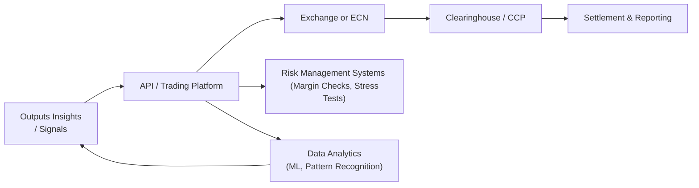

## 1.13 Technology in Derivatives Trading (Electronic Platforms, Algorithmic Trades)

Picture this: a few decades ago, trading floors were bustling with shouting traders waving order tickets in the air. Fast-forward to today, and you’ll see quiet offices where trades are carried out electronically in mere milliseconds. It’s almost surreal how quickly technology revolutionized derivatives trading. Anyway, let’s dive into the nitty-gritty of this transformation—covering electronic platforms, algorithmic strategies, and the unique challenges of cybersecurity in modern derivatives markets.

### The Rise of Electronic Trading Platforms

Electronic trading platforms have essentially replaced the traditional open-outcry pits for many derivative products, such as futures and options. They’ve also forced market participants—both professional and retail—to adapt.

#### Direct Market Access (DMA)

Electronic platforms often offer Direct Market Access (DMA), which means you (or your trading algorithm) can directly place orders in the exchange’s order book without necessarily going through a middleman. For instance, if you have a futures account with a major brokerage, you can often enter limit orders straight into the marketplace. It’s like cutting out a few layers of “telephone tag” to ensure trades execute efficiently.

• Transparent Price Discovery: DMA allows you to see the live order book (bid/ask quotes, depth-of-market). You can gauge market trends and place orders at your preferred price points.  
• Reduced Latency: Fewer intermediaries can mean slightly lower time delays—very important if you’re an active intra-day trader.  
• Competitive Transaction Costs: Electronic platforms are constantly striving to reduce overhead costs.

#### Online Brokerages for Options

Now, if you’re trading equity, index, or currency options, you’ll notice that leading online brokers offer advanced user interfaces. You can view complex option chains, implied volatility data, and Greek risk metrics in real-time, right on your laptop or smartphone. It’s pretty amazing that everything from strike selection to option strategy simulation is just a click away.

Many online platforms also allow you to back-test strategies or simulate trades on historical data. So, you could see how a particular bullish or bearish option spread might have performed last year without risking real capital upfront.

#### Multi-Dealer Platforms for OTC Products

Over-the-counter (OTC) derivatives—like certain interest rate swaps or currency forward agreements—used to be purely negotiated over the phone. Now, specialized multi-dealer platforms enable participants to post quotes and negotiate trades in an electronic environment.

These platforms are particularly relevant in the Canadian context, given that CIRO and the Canadian Securities Administrators (CSA) have increased reporting and clearing obligations for many OTC transactions. Electronic platforms help centralize record-keeping and reduce operational risk.

### Algorithmic Trading: How Machines Outpace Humans

Algorithmic trading uses formalized, pre-programmed formulas (algorithms) to execute trades swiftly—sometimes in microseconds. Let’s say you’ve developed a quantitative strategy that trades E-mini S&P 500 Futures when certain price thresholds are triggered. With algo trading, you don’t have to sit in front of a screen 24/7. You just code the strategy, connect it to the market via an API, and let it handle everything from order entry to exit.

#### High-Frequency Trading (HFT)

High-Frequency Trading (HFT) is a subset of algorithmic trading characterized by extremely short holding periods—seconds, milliseconds, or even microseconds. HFT firms exploit the tiniest price discrepancies across multiple markets (like S&P 500 futures in Chicago vs. an ETF in New York). They aim to capture small profits very frequently and manage huge trade volumes. It’s no secret that latencies measured in fractions of a millisecond can make or break these strategies.

Sure, HFT has critics who argue it can create “unfair” speed advantages or market volatility spikes—like the Flash Crash of 2010. Regulators continuously refine rules to ensure market integrity without stifling innovation. In Canada, CIRO enforces electronic trading rules aimed at mitigating manipulative or disruptive trading practices.

#### APIs and Automation

Application Programming Interfaces (APIs) let you connect your custom trading model directly to a broker or exchange. In practice, you could have a Python-based script that sends a market order for WTI Crude Oil futures the moment a specific pattern emerges in your real-time price feed. No phone calls, no manual input—just pure automation.

But remember, technology can fail. If your internet connection goes down, or your code has a bug, your trading strategy might go rogue. That’s why robust fail-safes, such as circuit breakers and pre-trade risk checks, must be part of any algo-trading setup.

### Risk Management Systems

Derivatives can be extremely leveraged, so adequate risk management systems are non-negotiable. Many sophisticated trading platforms have built-in features that help traders monitor positions, margin requirements, and overall portfolio exposure in real-time.

• Automated Margin Calls: If your futures account dips below the required margin, the system can alert you or automatically liquidate positions to cover the shortfall.  
• Real-Time Position Monitoring: You can track net exposure across multiple accounts and asset classes in seconds.  
• Stress Testing: Simulating how your positions might perform under extreme market scenarios (e.g., a massive overnight interest rate move) is crucial. Modern platforms let you run these stress tests quickly.

#### Example: Automated Margin Monitoring

Let’s say you have an option spread strategy on the S&P/TSX 60 Index futures. If volatility spikes unexpectedly—maybe there’s a global market meltdown—your broker’s platform instantly recalculates your margin requirements. If your account’s equity is insufficient, you might receive a margin call. In older days, you’d wait for a courtesy call from a broker. Now it’s a computerized alert, and you might have minutes or hours to act, or the system could decide to cut losses automatically by closing a portion of your position.

### Data Analytics Tools

In today’s markets, data is king (or queen). Firms and even individual traders rely on machine learning (ML) and other data science techniques to analyze massive amounts of price, volume, and newsflow data. The more nuanced the patterns you can spot, the better positioned you’ll be to execute profitable trades.

• Machine Learning: By analyzing historical data sets, ML models can “learn” how certain market conditions (e.g., interest rate announcements, currency fluctuations) impacted asset prices in the past.  
• Pattern Recognition: Some advanced traders aim to detect cyclical anomalies, anomalies in volume patterns, or cross-asset correlations that might create arbitrage opportunities.  
• Natural Language Processing (NLP): In some cases, algorithms scan news headlines or social media posts for sentiment, to gauge how the market might respond to specific events.

Of course, using big data analytics requires sophisticated infrastructure—cloud computing solutions, advanced coding skills, and robust data feeds. Platforms like QuantConnect (https://www.quantconnect.com/) combine historical data sets and backtesting environments in an open-source ecosystem, letting you easily test your ideas. Libraries such as QuantLib (https://www.quantlib.org/) give developers a wide range of functions for pricing, curve building, and risk analytics.

### Cybersecurity: Protecting Market Integrity and Participant Data

As more trading activity moves online, cybersecurity is paramount. The last thing you need is a hack that compromises your trading system or leaks your trade data. Institutions employ layers of encryption, secure login protocols, firewalls, and intrusion detection systems to minimize these risks.

• Cyber Resilience: Integrating backup servers, redundant data centers, and robust disaster recovery plans ensure that trading can continue—even in the face of a cyberattack.  
• Regulatory Obligations: In Canada, the CSA periodically issues notices and guidance on data protection and operational resilience in capital markets. CIRO also imposes best practices for incident reporting and recordkeeping.  
• Ongoing Monitoring: Real-time threat detection is critical. Some firms use machine learning to identify suspicious network activities that might indicate a cyber breach.

Honestly, even if you’re a small-scale retail trader with a few options positions to your name, you should remember to keep your trading accounts secure with two-factor authentication and a strong password policy.

### Putting It All Together: A Systems View

Below is a simplified diagram (in Mermaid) illustrating how various technology components connect in a modern derivatives trading environment:

- Trader or Algorithm: Initiates the trading idea or automatically triggers orders.  
- API / Trading Platform: The gateway between your strategy and the market.  
- Exchange or ECN: Matches buy/sell orders, providing the liquidity for trades.  
- Risk Management Systems: Real-time checks to ensure your margin is sufficient.  
- Data Analytics: Feeds into the trading logic, helps refine strategy.  
- Clearinghouse: The entity responsible for trade settlement and margining.  
- Reporting: All trades must be reported to the relevant regulators or trade repositories (especially in the case of OTC derivatives).

### Best Practices and Key Considerations

• Test, Test, Test: Always back-test your strategies with historical data, then perform forward-testing on a demo account (or in a paper trading environment).  
• Monitor Latency: For algorithmic and especially high-frequency trading, even minor delays can matter. Co-locating servers near the exchange can reduce latency.  
• Understand Regulations: CIRO’s rules on electronic and algorithmic trading aim to ensure best execution and prevent manipulative practices. That means strict oversight of your algorithms, fail-safe triggers, etc.  
• Manage Complexity: The more code you have, the higher the chance of software bugs. Keep your logic as simple as possible, especially when you start out.

### Glossary

• Direct Market Access (DMA): Allows traders direct order entry into an exchange’s order book.  
• High-Frequency Trading (HFT): Uses ultra-fast algorithms with very short holding periods, capitalizing on microsecond-level price discrepancies.  
• Latency: The time it takes for a trade instruction to reach the exchange and execute.  
• Application Programming Interfaces (APIs): Software “middlemen” that let your code communicate with a trading venue or data source.  
• Machine Learning (ML): Algorithms that “learn” from data trends and improve performance without explicit reprogramming for every scenario.  
• Stress Testing: Evaluating how a trading strategy or portfolio might perform under extreme market conditions.  
• RegTech: Technology solutions that help firms comply with regulatory requirements.  
• Cyber Resilience: The capacity to keep systems safe and operational despite cyber threats or disruptions.

### References and Further Resources

• CIRO (https://www.ciro.ca) – For details on electronic trading rules, best execution requirements, and regulatory updates.  
• CSA Notices – Check the CSA’s website for information on data protection initiatives and market integrity guidelines.  
• Chan, Ernest P. (2013). “Algorithmic Trading: Winning Strategies and Their Rationale.” – A thorough text on systematic trading.  
• QuantConnect (https://www.quantconnect.com/) – A cloud-based platform for algorithmic trading and backtesting.  
• QuantLib (https://www.quantlib.org/) – An open-source library for quantitative finance.

---

At this point, you should have a decent handle on how technology transforms the derivatives trading landscape—no more frantic phone calls or messy hand signals like in the old days. Thanks to the electronification of markets, many tasks are now automated, data-driven, and integrated into robust risk management and compliance systems. But as always, with great power comes great responsibility: advanced tools can magnify your gains but can also magnify your risks if used incorrectly.

## Sample Exam Questions: Technology in Derivatives Trading



### Which of the following best describes Direct Market Access (DMA)?

- [ ] An arrangement where investors must always use a floor broker to execute a trade.
- [ ] A government-mandated procedure for licensing investment advisors.
- [x] A facility allowing traders to place orders directly into the market’s order book.
- [ ] A system that lags real-time prices by 15 minutes.

> **Explanation:** DMA lets market participants place orders directly into the exchange’s order book, bypassing intermediaries and often reducing latency.

### What is one main characteristic of High-Frequency Trading (HFT)?

- [ ] Long holding periods for trades.
- [x] Very short holding periods, often measured in seconds or milliseconds.
- [ ] Reliance on manual phone-based executions.
- [ ] Elimination of all regulatory oversight.

> **Explanation:** HFT typically holds positions for extremely short intervals, relying on speed and volume rather than long-term market trends.

### In modern electronic trading platforms, why is real-time margin monitoring crucial?

- [ ] It replaces the need for back-testing all trading strategies.
- [x] It helps prevent account deficits by automatically initiating margin calls or position liquidations when required.
- [ ] It eliminates the need for clearinghouses in derivatives trading.
- [ ] It reduces regulatory requirements for derivatives brokers.

> **Explanation:** Real-time margin monitoring detects and addresses margin shortfalls promptly, preventing excessive losses for both traders and brokers.

### An API in the context of electronic trading is:

- [ ] A physical location on the trading floor.
- [ ] An advanced form of personal identification for traders.
- [x] A software interface allowing programmatic interaction with a trading system.
- [ ] A standard measure of implied volatility for options.

> **Explanation:** API stands for Application Programming Interface—a bridge that lets software (e.g., a trading algorithm) interact with a broker or exchange platform.

### Machine learning tools often help traders to:

- [x] Identify patterns in large datasets and refine trading signals.
- [ ] Guarantee profits by eliminating all market risk.
- [x] Manage data analysis tasks more effectively than manual methods.
- [ ] Bypass all regulatory rules on electronic trading.

> **Explanation:** ML can discover sophisticated patterns hidden in big data sets, improving strategy development. However, it can’t eliminate market risk nor exempt you from regulatory rules.

### Latency in a trading system refers to:

- [ ] The risk of software bugs in an algorithm.
- [x] The delay between an order being initiated and its execution on the exchange.
- [ ] A regulatory requirement to slow down trades for fair play.
- [ ] The maximum leverage ratio allowed under CIRO rules.

> **Explanation:** Latency is simply the tiny time gap between sending an order and having it executed. In high-speed trading, a small reduction in latency can be a big competitive advantage.

### Which statement about cybersecurity in derivatives trading is correct?

- [x] Firms use robust systems like firewalls, encryption, and intrusion detection to manage cyber risks.
- [ ] Cyberattacks are unlikely to impact online derivatives trading platforms.
- [x] Firms often employ machine learning for real-time threat detection.
- [ ] Regulatory authorities show little concern for cybersecurity in capital markets.

> **Explanation:** With so much trading and data online, cybersecurity is a major concern. Firms and regulators focus on advanced solutions to minimize attack vulnerabilities.

### Which organization oversees investment dealers and market integrity in Canada?

- [ ] The Ontario Securities Commission (OSC) exclusively.
- [ ] IIROC (still existing as a separate entity in 2025).
- [x] CIRO (Canadian Investment Regulatory Organization).
- [ ] The U.S. Securities and Exchange Commission (SEC).

> **Explanation:** As of January 1, 2023, IIROC and MFDA amalgamated to form CIRO, the new self-regulatory organization in Canada.

### Why might automated margin calls be a feature of many derivatives trading platforms?

- [x] They reduce credit risk by quickly liquidating trades if margin drops too low.
- [ ] They simplify the regulatory compliance of floor brokers.
- [ ] They replace the requirement for a clearing corporation.
- [ ] They remove the need for risk disclosures to clients.

> **Explanation:** Automated margin calls protect both the trader and the brokerage by minimizing the chance that losses exceed account equity.

### True or False: RegTech solutions are intended to help firms comply with regulatory requirements.

- [x] True
- [ ] False

> **Explanation:** RegTech—short for Regulatory Technology—helps financial firms manage compliance through technology, streamlining processes like reporting, risk analysis, and recordkeeping.


