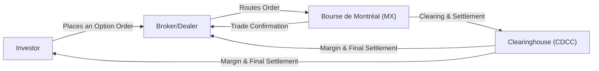

## 1.14 Overview of Bourse de Montréal and Other Global Derivatives Exchanges

Introduction  
I remember the first time I heard about the Bourse de Montréal (sometimes affectionately called the Montreal Exchange or just “MX”) while sipping coffee with a friend who worked in finance. She tossed around phrases like “equity options,” “interest rate futures,” and “CDCC.” I had no idea what any of that meant. But I was curious: how exactly does a Canadian derivatives exchange fit into the global puzzle of financial markets? Turns out, it’s critical for our markets’ stability and for offering specialized products to investors and institutions. And guess what? By the end of this article, you’ll know how and why.

Below, we’ll explore the Bourse de Montréal as Canada’s flagship derivatives exchange, discuss how it sits under the TMX Group umbrella in partnership with the Toronto Stock Exchange, and peek at some of the largest global exchanges like the CME Group, Eurex, ICE, and HKEX. We’ll dip into the unique market structure, product offerings, regulatory environment, and a few real-life anecdotes that might make these big, fancy-sounding names a little more relatable.

Bourse de Montréal: A Homegrown Powerhouse  
Calling the Bourse de Montréal a “homegrown powerhouse” might sound like a stretch at first. Indeed, the Montreal Exchange doesn’t always garner the same global headlines as large U.S. exchanges—but it is Canada’s primary derivatives marketplace. It’s got a fascinating history, dating all the way back to when it became the first exchange in Canada in 1874. Today, it focuses solely on derivative products. Equities? That’s primarily the Toronto Stock Exchange’s domain. But derivatives? That’s MX territory.

• Product Range: The Bourse de Montréal lists equity options on Canadian companies, index futures and options (including the S&P/TSX 60 Index), and interest rate futures contracts. A notable addition in recent years is its 3M CORRA futures, which are designed to help market participants hedge against short-term interest rate fluctuations aligned with the Canadian Overnight Repo Rate Average (CORRA). This became even more relevant after the Canadian market moved away from CDOR-based instruments.  
• Connection to TMX Group: TMX Group is the parent company that manages both the Toronto Stock Exchange (TSX) and the Bourse de Montréal. This synergy allows market participants to trade equities on the TSX and hedge or speculate with derivatives on the MX, all under the same corporate umbrella.  
• Regulatory Oversight: While historically the Investment Industry Regulatory Organization of Canada (IIROC) played a big role, we’re now in the new era where the Canadian Investment Regulatory Organization (CIRO) oversees participant and market conduct. So, the Bourse’s trading activity is under CIRO’s supervision. This ensures the rules remain consistent and protective of investors.  
• Product Innovation: One of the things that resonates with me is how the Bourse de Montréal often customizes products for the local Canadian market. Equity options on Canadian banks? Check. Futures on Canadian interest rates? You bet. These are not just for massive institutions; retail traders can also get involved, though certain strategies might be a bit more advanced.  
• Market Liquidity: Admittedly, liquidity can vary. Certain contracts like the S&P/TSX 60 Index futures or the three-month CORRA futures are actively traded. Others might be thinner, making it important for you to understand the best times to trade and the potential impact on bid-ask spreads.

A Quick Visual: How a Trade Flows  
I’d like to show you a simple flow of how a derivative transaction might pass through participants on the Bourse de Montréal. Imagine you order an S&P/TSX 60 Index option contract through your broker.

• Investor: That’s you, placing an order to buy or sell an option.  
• Broker/Dealer: Your broker or investment dealer routes and executes your trade in the market.  
• MX: The Montreal Exchange processes the order in its central electronic order book.  
• CDCC: The Canadian Derivatives Clearing Corporation (CDCC) takes on the role of clearing and settlement, ensuring both sides of the trade meet margin requirements and final obligations.

This structure might look complicated, but the core idea is simple: the clearing corporation stands between buyer and seller, ensuring both participants fulfill their side of the deal. This stability, combined with robust regulation from CIRO, is why Canada’s derivatives markets remain secure and transparent.

The Global Scene  
Now, how does the Bourse de Montréal compare to, say, the Chicago Mercantile Exchange (CME), Eurex, ICE, or HKEX? Each of these major players has a unique focus and different sets of products and trading hours:

CME Group (Chicago Mercantile Exchange)  
If you’ve ever heard of E-mini S&P 500 futures or Eurodollar futures, you’re dealing with the CME Group. They’re a behemoth in the U.S. derivatives landscape. They offer everything from interest rate futures to equity index futures, FX, agricultural commodities, and even cryptocurrency futures. When I first tried trading a CME product (it was a micro E-mini futures contract on the S&P 500), I was shocked by how liquid it was—spreads were razor-thin, and the order book was huge. It’s a great place for those seeking high-volume markets.

• Product Range: CME is famous for interest rate futures (e.g., SOFR), equity indexes (e.g., the S&P 500), currencies, energies, and metals.  
• Market Liquidity: On a typical trading day, the volume is massive, often in the millions of contracts—ideal for large institutions and active traders.  
• Clearing: Trades are cleared by the CME Clearing, which, like CDCC, manages margin and settlement.

Eurex (Europe)  
Eurex is a primary venue in Europe for trading interest rate derivatives (like European government bond futures) and equity index derivatives. If you want to hedge or speculate on Eurozone interest rates or trade the EURO STOXX 50 index, Eurex is your go-to. They also have robust technology, offering electronic trading almost around the clock.

• Focus on European Interest Rates: Bund, Bobl, and Schatz futures are popular.  
• Equity Index Derivatives: EURO STOXX 50 futures and options lead the pack for Europe’s large-cap stocks.  
• Regulatory Environment: Eurex operates under European regulations, including MiFID II. Cross-border traders must consider these rules.

ICE (Intercontinental Exchange)  
ICE is a bit like the “tech-savvy cousin” in the derivatives family. Starting with energy contracts, ICE expanded into financial products, agriculture, and even clearing services. They own the New York Stock Exchange (NYSE) as well, though that’s primarily an equities marketplace.

• Energy Products: Brent crude futures are a key contract, along with natural gas and other energy derivatives.  
• Agricultural Futures: ICE offers a variety of “soft” commodities like coffee, cocoa, and sugar.  
• Worldwide Reach: ICE has multiple clearinghouses in the U.S. and Europe, and it operates in sync with many global regulatory bodies.

HKEX (Hong Kong Exchange)  
If you’re looking for exposure to Asian markets, HKEX is a prime example. They list equity derivatives on the Hang Seng Index, currency and metals products, and many more. HKEX has also formed important alliances, such as the Stock Connect with mainland China, expanding its product range and global reach.

• Asian Market Gateway: A key venue for accessing China-related instruments and broader Asian markets.  
• Range of Products: Includes FX futures, equity index futures, and precious metals.  
• Regulatory Overseers: Hong Kong’s Securities and Futures Commission (SFC) sets the rules.

Cross-Border Trading and Regulatory Nuances  
One of the biggest reasons to understand multiple exchanges is cross-border arbitrage or hedging. Maybe you’re a Canadian portfolio manager who invests in U.S. stocks and wants to hedge foreign exchange risk. You could use CME currency futures or the Montreal Exchange’s CAD/USD contracts if available. The point is, each exchange has unique product specifications, fees, regulatory requirements, and margin rules. As an informed trader, you’d want to compare:

• Trading Hours: CME might be open nearly 24 hours from Sunday to Friday (U.S. time), while Bourse de Montréal follows more standard North American hours for most of its derivatives.  
• Regulatory Constraints: Don’t forget that in Canada we have CIRO oversight, plus the umbrella of CSA (Canadian Securities Administrators) rules. Over in Europe, a firm might face MiFID II, EMIR, and local country regulations. So, before diving into cross-border trading, do your homework.  
• Liquidity & Volatility: Some contracts might have narrower bid-ask spreads. Others may be less liquid. A lack of liquidity can increase slippage, especially when you’re doing large trades.  
• Settlement and Clearing: While the concept is universally the same—managing margin, ensuring contract performance—the details vary from one clearinghouse to another.

Practical Example: A Canadian Portfolio Manager  
Maybe you manage a Canadian equity portfolio that’s heavily exposed to interest rate fluctuations. You’re expecting the Bank of Canada to raise rates soon, potentially impacting your portfolio’s cost of capital. So you decide to use 3M CORRA futures on the Bourse de Montréal to hedge short-term interest rate risk. Alternatively, you could look to the CME’s SOFR futures if you’re hedging U.S. interest rates. But if your main exposure is Canadian, the Bourse might offer more direct correlation to local rates, potentially providing a more efficient hedge.

Common Pitfalls and Best Practices  
• Pitfall: Jumping into a low-liquidity contract. If you hop into an out-of-the-money option on a lesser-known Canadian equity with very few open interest or daily trades, you might face wide spreads and price gapping.  
• Best Practice: Pay close attention to volume and open interest. That helps you gauge liquidity and see if the contract is actively traded.  
• Pitfall: Ignoring Regulatory Differences. If you’re a Canadian resident trading on a U.S. exchange, you could be subject to margin rules from two jurisdictions, plus currency conversion issues.  
• Best Practice: Understand cross-border rules and talk to a broker well-versed in both markets. This includes the potential withholding taxes or additional compliance forms.  
• Pitfall: Overlooking the Clearing Structure. Sloppy trade management can lead to unexpected margin calls or settlement issues if the clearing rules differ from those you’re used to.  
• Best Practice: Familiarize yourself with the relevant clearinghouse (CDCC for Bourse de Montréal, CME Clearing for CME Group, etc.) so you know how daily settlement prices and margin requirements are determined.

Glossary of Key Terms  
• TMX Group: The parent company that owns the Toronto Stock Exchange and the Bourse de Montréal.  
• Interest Rate Futures: Futures contracts on short-term interest rates or bond yields. Examples include 3M CORRA futures, Eurodollar (now transitioning to SOFR), Bund futures, etc.  
• Cross-Listing: Listing the same or similar derivative product on multiple exchanges for broader market access.  
• Market Open Interest: The total number of outstanding contracts that haven’t been closed or delivered. A higher open interest can indicate deeper liquidity.  
• Clearing Member: An authorized broker/dealer that clears trades through the exchange’s clearinghouse.  
• Settlement Price: The official end-of-day price used to calculate gains, losses, and margin obligations.  
• Electronic Order Book: A digital system that records all buy and sell orders.  
• Extended Trading Hours: Trading sessions that take place outside normal market hours, often crucial for global participants who reside in different time zones.

Regulatory Resources and Reference Links  
• Bourse de Montréal: https://www.m-x.ca/  
• CME Group: https://www.cmegroup.com/  
• Eurex: https://www.eurex.com/  
• ICE: https://www.theice.com/  
• HKEX: https://www.hkex.com.hk/  
• CIRO (successor to IIROC and MFDA): https://www.ciro.ca/  
• IOSCO (International Organization of Securities Commissions): https://www.iosco.org/  
• CSA (Canadian Securities Administrators): Search “CSA Staff Notices” for cross-border derivatives rules.  
• Handbook of Futures Markets by Perry J. Kaufman: A broad overview of how futures markets operate globally.

Anyway, I’ve found that the more you discover about how these exchanges work, the more you see that each one offers a somewhat unique ecosystem of products and trading rules. Whether you’re a local Canadian investor using the Montreal Exchange’s equity options, or a global macro fund using CME’s wide array of products, knowledge of the differences can help you avoid costly pitfalls and seize profitable opportunities.

Conclusion  
Whether you’re trading local Canadian interest rate futures on the Bourse de Montréal or global commodity contracts on the ICE, each derivatives exchange has something special to offer. The Bourse de Montréal stands out as a dedicated space for Canadian derivatives—especially if you’re looking for local interest rate products tied to evolving benchmarks like CORRA. It’s strongly regulated by CIRO, clearing is handled by the CDCC, and the synergy within TMX Group ensures smooth interplay with the Toronto Stock Exchange for equity and index-based strategies.

With that said, cross-border opportunities abound. CME Group, Eurex, ICE, and HKEX open doors to a world of futures and options. It’s like a giant buffet—you just need to know what each dish is, how it’s prepared, and whether it suits your palate (or your risk profile). Maybe next time you have coffee with your “finance friend,” you’ll have some interesting stories to share about these exchanges from your own personal trading adventures.

## Sample Exam Questions: Bourse de Montréal and Other Global Derivatives Exchanges



### Which entity oversees participant and market conduct on the Bourse de Montréal as of 2025?

- [ ] The Mutual Fund Dealers Association (MFDA)
- [ ] The Investment Industry Regulatory Organization of Canada (IIROC)
- [x] The Canadian Investment Regulatory Organization (CIRO)
- [ ] The Ontario Securities Commission (OSC)

> **Explanation:** Since the amalgamation of IIROC and MFDA, CIRO is now responsible for the oversight of investment dealers, including participants on the Montreal Exchange.

### Which of the following best describes the function of the Canadian Derivatives Clearing Corporation (CDCC)?

- [ ] Regulates brokers and dealers in Canada
- [x] Acts as the clearinghouse, managing settlement and margin requirements
- [ ] Oversees the licensing of derivatives traders
- [ ] Sets federal tax guidelines for derivatives trading

> **Explanation:** The CDCC serves as the clearinghouse for the Bourse de Montréal, ensuring both buyer and seller fulfill their contractual obligations.

### What product is often associated with the Bourse de Montréal for hedging short-term Canadian interest rate exposure?

- [ ] E-mini S&P 500 futures
- [ ] ICE Brent Crude futures
- [ ] Eurodollar futures
- [x] 3M CORRA futures

> **Explanation:** The Bourse de Montréal introduced three-month CORRA futures to accommodate short-term interest rate hedging in the Canadian market.

### Which global exchange would be a key choice if an investor wants to trade European bond futures, such as the Bund?

- [ ] CME Group
- [x] Eurex
- [ ] ICE
- [ ] HKEX

> **Explanation:** Eurex is widely recognized for its European derivatives, especially German Bund futures.

### Why is open interest considered an important metric when analyzing a futures or options market?

- [ ] It determines the expiration date of the contract
- [x] It reflects the number of outstanding contracts and liquidity
- [ ] It is the price at which final settlement occurs
- [ ] It is only relevant for commodity futures, not financial futures

> **Explanation:** Open interest measures how many contracts remain open, which helps gauge overall market participation and liquidity.

### Which of the following is a potential risk of trading on less active or low-liquidity contracts?

- [ ] Tighter bid-ask spreads
- [ ] Higher volume and minimal slippage
- [x] Wider bid-ask spreads and potential price gapping
- [ ] No margin requirements

> **Explanation:** Less liquidity generally means wider spreads and higher transaction costs, creating the possibility of considerable price gapping.

### A Canadian portfolio manager seeks to hedge foreign exchange risk on a position in U.S. stocks. Which platform might be most appropriate for trading USD/CAD currency futures?

- [x] Bourse de Montréal (if a USD/CAD contract with sufficient liquidity exists)
- [ ] HKEX
- [ ] Eurex
- [ ] ASX (Australian Securities Exchange)

> **Explanation:** For hedging U.S. dollar versus Canadian dollar risk, the Montreal Exchange or OTC currency trades are often used by Canadian investors. Other global exchanges may not offer a CAD-focused contract.

### Which of the following best defines “Settlement Price” in derivatives trading?

- [ ] A randomly assigned price that never impacts margin
- [ ] The intraday high price
- [ ] The ask price at market close
- [x] The official end-of-day price used for margin calculations

> **Explanation:** The settlement price is the daily official closing figure used to mark positions to market, impacting a trader’s margin obligations.

### An investor complains about facing unexpected margin calls due to varying clearing rules when trading cross-border derivatives. What is the most likely cause?

- [ ] Their brokerage has eliminated all margin variability
- [x] Different exchanges and clearinghouses have distinct margin and settlement processes
- [ ] The investor’s position is in a highly liquid market
- [ ] CIRO is no longer overseeing any trade

> **Explanation:** Margin and settlement processes can differ widely from one clearinghouse to another, especially in cross-border scenarios, leading to confusion about margin calls.

### The Bourse de Montréal focuses on:

- [x] Listing derivatives such as equity options, index futures, and interest rate futures
- [ ] Serving exclusively as a stock exchange for Canadian equities
- [ ] Catering only to foreign currency futures
- [ ] Operating as a regulator to oversee capital markets

> **Explanation:** While the Toronto Stock Exchange handles equities, the Montreal Exchange centers on derivative instruments and is regulated by CIRO for participant and market conduct.


