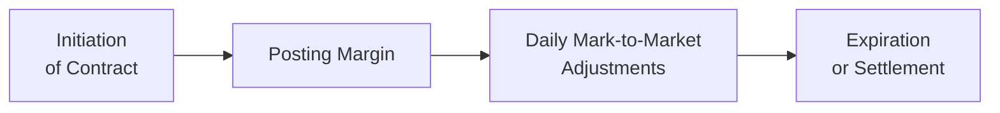

## 1.2 Common Features of All Derivative Instruments

Derivatives can seem flashy, complicated, and—dare I say—intimidating. When I first encountered them, I remember being both excited and anxious. I thought, “These are contracts that derive their value from some underlying asset or financial metric; what does that even mean in practical terms?” Over time, I learned that no matter how fancy a derivative might appear—whether it’s a commodity swap, an equity option, or a complex exotic forward—a handful of common features run through them all. Let’s dig into those features so you can develop a well-rounded understanding of the derivative world.

---

## The Importance of the Contractual Element

At their core, derivatives are legal agreements. It doesn’t matter whether you’re buying a simple put option on a stock or entering into a more structurally complex interest rate swap; there is always a contract specifying the terms of the deal. Without a clearly defined contract, we really don’t have a proper derivative.

• The Contractual Obligation  
  A derivative’s contract establishes each participant’s rights and responsibilities. It clearly states what quantity of the underlying asset is involved, what price or formula will be used to settle the transaction, and when it will expire—or as we sometimes say, “mature.” This set of obligations is more than just a handshake; it is typically a legally binding document. If one party fails to perform, they could face legal consequences, margin calls, or forced liquidations, depending on the framework of the trade.  

• Expiration (or Maturity)  
  Nearly every derivative has some endpoint. For many derivatives, such as futures, there’s a delivery date when the underlying asset is delivered (physically or in cash) according to the contract. Options come with an expiration date, after which the option disappears if not exercised. Swaps have a schedule (often monthly or quarterly payments) over a certain number of years. Knowing a contract’s life span influences everything from pricing to trading strategy.

• Setting the Underlying Asset and Quantity  
  The “underlying interest,” whether it’s a stock, bond, commodity, currency pair, or something more esoteric like carbon credits, has to be standardized or at least well defined. Implementing an exact quantity is crucial. For instance, a single futures contract on West Texas Intermediate (WTI) crude oil typically represents 1,000 barrels of oil. Everyone knows that going in.

Putting all this together, you’ll discover that each derivative contract you come across—exchange-traded, over-the-counter, or something in between—will rely on a precise framework that keeps everything predictable, transparent, and (ideally) fair for all parties involved.

---

## Margin and Collateral Requirements

I often compare margin requirements to a security deposit on an apartment. Think about it: you want to ensure that if something goes wrong—if one party can’t pay or deliver—there’s some kind of financial buffer. In derivative trading, we call that buffer “margin” or sometimes “collateral.”  

From personal experience, there was a time when I first traded a simple futures contract. I recall the moment the broker said, “Please deposit more margin to cover your position.” I felt a twinge of panic, as if my landlord had suddenly demanded extra security deposit mid-lease! In derivatives, these margin calls can happen if the market moves against you.  

### Why Margin Matters  
• Risk Mitigation: Margin ensures that neither party can just walk away if the market goes against them.  
• Frequent Adjustments: On many exchange-traded derivatives, margins are adjusted daily—or even intraday—based on price fluctuations. This is called “mark-to-market.”  
• Regulatory Requirements: The Canadian Investment Regulatory Organization (CIRO) imposes minimum margin rules for many derivatives. You can check their Rulebook at the CIRO website (https://www.ciro.ca/) for details.

### Collateral in OTC Markets  
Not all derivatives trade on formal exchanges. Over-the-counter (OTC) derivatives—like certain bond forwards or customized swaps—also entail collateral posting. According to Canadian Securities Administrators (CSA) guidelines, large OTC positions often must be reported to trade repositories and cleared through central clearinghouses if they exceed certain thresholds. Collateral or “initial margin” is then posted to a clearinghouse, significantly reducing counterparty credit risk.  

---

## Leverage: A Double-Edged Sword

Let me be honest: leverage is a thrill. Imagine controlling a notional value of $100,000 worth of gold with only a margin deposit of, say, $5,000. That is the power of leverage in derivatives, and it attracts both cautious hedgers and daring speculators. But it’s also something that can quickly turn profitable trades into painful losses if you’re not careful.  

### How Leverage Works  
• Amplify Gains (and Losses): If the underlying moves in your favor, you can make a large profit relative to your small initial investment. However, if the market moves against you, you can lose more than your initial margin.  
• Built-In Feature: Nearly all derivatives—futures, options, swaps—reflect a degree of leverage because you’re not typically paying the full notional value of the underlying asset.  
• Margin Calls in Action: With leverage comes the possibility of margin calls. If your position drops below a certain threshold, you must top up your account. If you don’t, your broker can liquidate your position to protect their capital.

### Simple Example  
Picture an investor buying one gold futures contract that represents 100 ounces of gold. Suppose each ounce is $2,000, so the notional amount is $200,000. Typically, the margin required might be around $10,000 or less. If gold moves up $20 per ounce, that $2,000 total move ($20 × 100 ounces) on a $10,000 margin deposit is a 20% gain. But if the price moves against you, the same math shows an equally dramatic downside.

Leverage is powerful—like driving a race car. You can get places quickly, but you also risk crashing if you’re not prepared for volatility.  

---

## Liquidity in Derivatives

Liquidity refers to how easily you can buy or sell your position without significantly moving the price. Some derivative markets—like the S&P/TSX 60 Index* futures at the Bourse de Montréal—are super liquid. Others, especially specialized OTC contracts on exotic underlyings, can be quite illiquid.  

I recall talking to a friend who worked as a commodity trader focusing on a small agricultural product. She mentioned that some days, the market was so quiet she could hardly find a counterparty. That’s an example of low liquidity. When you can’t exit your position easily, you face the risk of sudden price jumps or having to accept poor prices just to get out.

### Factors Affecting Liquidity  
• Market Participation: The more participants (speculators, hedgers, arbitrageurs), the deeper the liquidity.  
• Exchange-Traded vs. OTC: Exchange-traded contracts tend to be more standardized, with many market participants, while OTC instruments can be very customized and less liquid.  
• Time of Day: Even for popular contracts, liquidity can vary by trading session. Some global currency futures are more liquid when certain markets are open.  

For those wanting to gauge liquidity before trading, you can often look at volume data or open interest. A large open interest usually indicates a healthy secondary market.  

---

## Ongoing Costs and Time Decay

When I first learned about options, I remember glancing at the price chart, noticing how an out-of-the-money option’s time value would gradually approach zero if the underlying didn’t move in the expected direction. This phenomenon, often called “time decay” (or Theta), is a significant factor for anyone trading options. But ongoing costs aren’t unique to options.  

### Potential Costs in Derivatives  
• Roll Costs: Futures contracts have finite lives. If you want to maintain a long-term position, you might have to “roll” your expiring contract into a new one, incurring transaction costs and possibly differences in pricing.  
• Cost of Carry: Holding certain futures involves financing costs and storage fees for the underlying commodity. These affect futures pricing.  
• Time Decay in Options: Theta is the “rent” option buyers pay for the right but not the obligation to exercise. Writers (sellers) of options effectively collect this “rent,” but they also bear unlimited or high risk.  
• Bid-Ask Spread: This is especially relevant in less liquid markets. Widening spreads can add costs whenever you adjust or exit your positions.  

Paying attention to these costs can be the difference between a successful long-term trading strategy and a slow bleed of capital.  

---

## Regulatory Frameworks and Market Oversight

I can’t overstate how crucial the regulatory environment is in the world of derivatives. These aren’t unregulated markets where anything goes—especially not in Canada.  

### CIRO and CSA  
• CIRO (Canadian Investment Regulatory Organization): Formerly known as IIROC and the MFDA before their amalgamation, CIRO has wide-ranging oversight for investment dealers and is responsible for ensuring fair and transparent market practices.  
• CSA (Canadian Securities Administrators): This umbrella organization unifies provincial-level securities regulators in Canada, coordinating policy and rulemaking across all provinces and territories. They guide derivatives reporting, margin requirements, and clearing mandates.  

### The Clearinghouse  
For exchange-traded contracts, the clearinghouse steps in between the buyer and the seller, guaranteeing each side’s performance. In Canada, the Canadian Derivatives Clearing Corporation (CDCC) is a major player. If you’re trading a Bourse de Montréal futures contract, your ultimate counterparty is the CDCC. This structure significantly reduces credit risk.  

### Reporting and Margin Requirements  
Because derivatives can carry systemic risk, regulators want to keep tabs on large positions. For instance, if you hold a position that might affect the overall stability of the market, you may be required to submit additional disclosures to trade repositories or the exchange. The CIRO Rulebook (which you can find at https://www.ciro.ca/) details minimum margin requirements and risk disclosures.  

Maintaining confidence in these markets is paramount—regulations and reporting requirements are what make derivatives safer for everyone.  

---

## A Typical Derivative Life Cycle

To see how these features connect, it helps to visualize a derivative’s life cycle: from the initial agreement, through daily mark-to-market (if applicable), to final settlement or delivery.

• Initiation of Contract: This is where you lock in the terms—underlying asset, quantity, maturity date, and pricing.  
• Posting Margin: Depending on the type of derivative and whether it’s exchange-traded or OTC, you’ll need to deposit margin or collateral.  
• Daily Mark-to-Market Adjustments: Your position’s value will be recalculated based on market movement. Gains or losses are typically credited or debited from your margin account.  
• Expiration or Settlement: At maturity, the contract is settled. For futures, that may mean physical delivery or cash settlement; for options, they might be exercised or expire worthless; for swaps, it could be a final exchange of payments.

---

## Common Pitfalls

Given these core features, let’s not sugarcoat things: derivatives can be treacherous if you dive in unprepared.

• Over-Leveraging: The lure of high returns can tempt traders to open large positions relative to their capital. Remember, margin calls are real and can be swift.  
• Not Understanding Time Decay: Especially with options, if you don’t grasp Theta, you might wonder why the option price withers even when the underlying moves sideways.  
• Liquidity Traps: Trading thin markets can lead to getting stuck in positions or facing huge spreads.  
• Insufficient Risk Management: Failing to set exit strategies or mental stop-losses can turn small losses into catastrophes.

A friend once confided in me how a single bet on short-dated options nearly wiped out his trading account because he didn’t realize how quickly time value evaporates. Let’s hope you never face that scenario.  

---

## Best Practices and Strategies to Overcome Challenges

• Use Stop-Loss Orders or Alerts: These help manage downside risk.  
• Diversify: Avoid putting all your capital in one derivative or one asset class.  
• Understand the Product: Before trading, really know whether you’re dealing with a forward, future, swap, or an option. Different derivatives behave in starkly different ways.  
• Consult Regulations: Keep up with CIRO and CSA rules, because they can and do change. If you’re uncertain, read the official rulebooks or consult compliance professionals.  
• Start Small: Particularly for new derivatives traders, smaller positions help you stay calm if markets get choppy.  

---

## Real-World Example: Hedging a Commodity Price

Imagine you’re a Canadian wheat farmer worried about a drop in wheat prices. You enter into wheat futures contracts (traded on an exchange) to lock in the selling price for your upcoming harvest.  

1. You sign a futures contract that matures around the time you expect to harvest and sell your wheat.  
2. You post an initial margin, say $5,000, which is a fraction of the total value of the wheat you plan to deliver.  
3. Each day, your futures position is marked to market. If wheat prices fall, you gain on the futures; if wheat prices rise, you lose on the futures (but benefit in the cash market with a higher selling price).  
4. By the time the contract reaches maturity (expiration), you deliver your wheat at the agreed-upon futures price or close the position in the futures market. Either way, you’ve effectively locked in a price.  

In this scenario, the key features we’ve been discussing appear in real life: a contract, margin, potential leverage (though as a hedger, you’re more offsetting risk than amplifying returns), daily mark-to-market, and the final settlement or delivery.

---

## Glossary

• **Contractual Obligation:** The legally binding terms that define each participant’s rights and responsibilities in a derivative contract.  
• **Expiration/Maturity:** The date on which the derivative contract settles or ceases to exist.  
• **Collateral:** Assets or cash posted to secure a derivative position, reducing credit risk for both parties.  
• **Mark-to-Market:** The daily revaluation of a derivative contract based on prevailing market prices. This can trigger margin calls.  
• **Clearinghouse:** A central institution, like the Canadian Derivatives Clearing Corporation (CDCC), that interposes itself between buyers and sellers to guarantee contract performance.  
• **Liquidity:** The ease with which a contract can be bought or sold without significantly impacting its price.  
• **Time Decay (Theta):** In options, the loss of extrinsic (time) value as the expiration date approaches.  
• **Counterparty Risk:** The risk that the other party to a derivative contract might default on their obligations.

---

## Recommended Resources

• **CIRO Rulebook:**  
  Access the latest margin rules, position limits, and reporting standards here:  
  https://www.ciro.ca/  

• **Canadian Derivatives Clearing Corporation (CDCC):**  
  Learn about Canada’s central clearing counterparty for exchange-traded derivatives:  
  https://www.cdcc.ca/  

• **Bank of Canada Glossary:**  
  For official definitions of financial market terms in Canada:  
  https://www.bankofcanada.ca/terminology/  

• **RQuantLib Package in R:**  
  If you’re curious about applying quantitative finance models in a programming environment, check out RQuantLib:  
  https://cran.r-project.org/web/packages/RQuantLib/index.html  

• **Hedging and Risk Management Texts:**  
  A well-written book on hedging strategies (e.g., “Options as a Strategic Investment” by Lawrence G. McMillan) can deepen your understanding of how derivatives can protect portfolios.

---

## Final Thoughts

Derivatives share common DNA: they’re contractual, involve margin or collateral posting, incorporate leverage, and carry varying degrees of liquidity, cost, and regulatory oversight. Whether you’re hedging a commodity, speculating on currency movements, or simply curious about how an interest rate swap offsets borrowing costs, these universal features frame every move in the derivative space.  

It’s always wise to keep two truths in mind: (1) derivatives can be powerful tools for both risk management and speculation, and (2) proper education, risk management, and awareness of regulatory requirements are essential ingredients for success. Start small, stay curious, and never be afraid to consult an expert or do that extra bit of homework before you hit the “trade” button.

---

## Sample Exam Questions: Common Features of Derivative Instruments



### Which of the following statements best describes the contractual element of a derivative?

- [ ] It is a non-binding agreement that allows for unlimited flexibility.
- [ ] It is a type of insurance policy that covers underlying assets with no legal constraints.
- [ ] It is a legally enforceable agreement specifying obligations, maturity, and pricing terms.
- [ ] It is an informal arrangement relying solely on trust between parties.

> **Explanation:** A derivative contract is a legally enforceable agreement. It defines the underlying asset, its quantity, the price or formula for settlement, and the expiration or maturity date.

### What is the primary function of margin in derivative trading?

- [ ] To increase the total notional value of a trade with minimal risk.
- [ ] To ensure both parties can meet their obligations by providing a financial buffer.
- [ ] To avoid regulatory scrutiny by reducing transparency.
- [ ] To eliminate transaction costs when rolling forward contracts.

> **Explanation:** Margin or collateral is posted to mitigate counterparty risk and reassure the market that participants can meet their obligations. It’s not about hiding from regulators or increasing risk-free leverage.

### How does leverage commonly manifest in derivative instruments?

- [ ] Derivatives typically require payment of the full notional value upfront.
- [x] Participants control a much larger notional value than the capital they post.
- [ ] It guarantees a profit if the underlying asset moves in the investor’s favor.
- [ ] It eliminates the possibility of margin calls because initial outlay is small.

> **Explanation:** Leverage allows control of a large notional amount with a relatively small margin deposit. This feature magnifies gains and losses.

### Which factor does NOT directly affect the liquidity of a derivative?

- [ ] Market participation and the number of active traders.
- [ ] The underlying asset's popularity.
- [x] The daily weather forecast (in most cases, ignoring commodity specifics).
- [ ] The time of day or trading session.

> **Explanation:** While the weather can matter for some agricultural commodities, on a general scale it is not typically a direct factor in the liquidity mechanics of financial derivatives. Factors such as the number of market participants, underlying popularity, and time-of-day trading windows are more directly relevant.

### What happens when an option experiences time decay (Theta)?

- [x] Its time value gradually diminishes as expiration approaches.
- [ ] Its intrinsic value automatically increases, compensating for lost time value.
- [ ] It instantly loses half its value every trading day.
- [ ] It stops trading immediately after it loses time value.

> **Explanation:** Time decay refers to the gradual loss of an option’s extrinsic (time) value. It does not affect intrinsic value unless the underlying price changes.

### What is the main advantage of having a clearinghouse for exchange-traded derivatives?

- [ ] It complicates the process by adding multiple intermediaries.
- [ ] It enables participants to avoid regulatory reporting obligations.
- [x] It becomes the central counterparty, reducing credit risk and guaranteeing trades.
- [ ] It removes the possibility of margin calls.

> **Explanation:** A clearinghouse (such as the CDCC in Canada) acts as the buyer to every seller and the seller to every buyer, thereby dramatically reducing counterparty credit risk.

### Which of the following is a valid reason why a trader might be required to post extra margin?

- [ ] They have closed their position and don’t hold any contracts.
- [ ] They are trading in a market with zero volatility.
- [ ] Their position is profitable and the broker wants to reward them.
- [x] Their derivative position suffers losses, dropping the margin balance below the maintenance threshold.

> **Explanation:** Margin calls occur when losses reduce the margin balance below required levels. Traders must deposit more funds or risk having their positions liquidated.

### How does the liquidity of a derivative market typically affect transaction costs?

- [ ] Highly liquid markets often have wider bid-ask spreads, increasing costs.
- [x] Highly liquid markets usually have narrower bid-ask spreads, reducing costs.
- [ ] Liquidity has no impact on transaction costs.
- [ ] Liquidity only matters for OTC derivatives, not exchange-traded derivatives.

> **Explanation:** Liquidity usually narrows the bid-ask spread because many participants are actively buying and selling, thus stabilizing prices and lowering transaction costs.

### In a derivative contract with daily mark-to-market, what does “mark-to-market” signify?

- [ ] A monthly adjustment of prices that only benefits the buyer.
- [ ] The process of grouping all trades by year-end for tax purposes.
- [x] The daily adjustment of contract values to reflect current market prices.
- [ ] An annual audit requirement by the clearinghouse.

> **Explanation:** Mark-to-market is the daily (or intraday) recalculation of gains or losses based on prevailing market prices. This ensures that each party’s margin account reflects real-time exposure.

### True or False: The Canadian Investment Regulatory Organization (CIRO) is now responsible for regulating investment dealers and overseeing transparency in Canadian derivative markets, replacing the functions of IIROC and MFDA.

- [x] True
- [ ] False

> **Explanation:** As of 2023, the amalgamation of the Mutual Fund Dealers Association (MFDA) and the Investment Industry Regulatory Organization of Canada (IIROC) created CIRO, which now oversees both investment dealers and mutual fund dealers, ensuring transparency and stability in the Canadian market.


