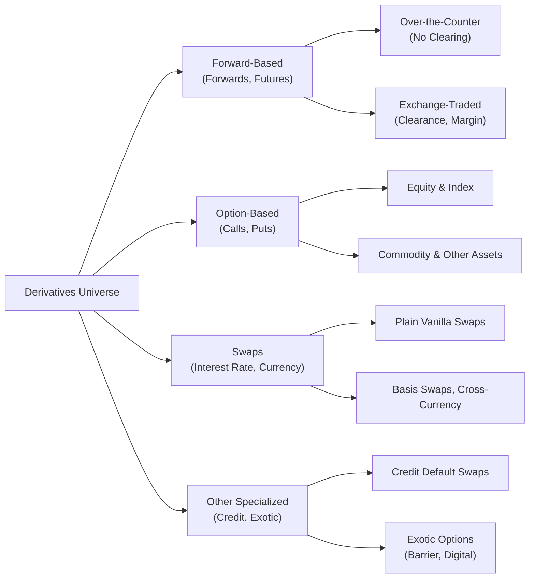

## 1.3 Types of Derivative Instruments

So I remember the first time I tried explaining derivatives to a friend—we were chatting over coffee (as you do), and they just stared at me like I was talking about some exotic recipe they’d never heard of. Derivatives can feel intimidating at first, but once you understand their basic building blocks—Forwards, Futures, Options, Swaps, and other specialized structures—they start to feel less like an alien concept and more like interesting (and sometimes very useful) financial tools.

Below, we’ll walk through each major type of derivative instrument, share some real-world examples, and point out a few best practices. We’ll also consider the Canadian regulatory backdrop (like the role of the Canadian Investment Regulatory Organization—CIRO—and the Bourse de Montréal) because these things matter a lot when you’re actually trading or advising clients. In Canada, we’ve also got some interesting frameworks around mandatory clearing, reporting, and risk management, so we’ll tie that discussion into our big picture.

Feel free, by the way, to read this as if we’re hanging out and you’re just peppering me with questions. You might have your own experiences or examples, and I encourage you to keep them in mind as we go through this.

  
### Understanding Forwards

Let’s start with forwards. You know that feeling when you strike a deal with someone—maybe to buy something in the future at a fixed price? That’s basically a forward contract. It’s a private contract between two parties to buy (or sell) an underlying asset at a specified price at some future date.

• Key Characteristics:  
  – Over-the-counter (OTC), which means they’re negotiated and customized privately.  
  – No centralized clearing, so each party bears the default risk of the other.  
  – Tailor-made: Quantity, quality (if it’s a commodity), delivery date, and location can be adjusted per agreement.

• Real-World Example:  
  Suppose a local wheat farmer is worried about a potential drop in wheat prices by harvest time. So the farmer enters into a forward contract with a bread manufacturer who wants to lock in wheat supply at a predictable price. Both sides reduce uncertainty because the farmer secures a guaranteed price, and the manufacturer knows exactly how much the wheat will cost come harvest.

• Pitfalls:  
  – Counterparty Risk: If your counterparty can’t (or won’t) fulfill their side of the deal, you could be left holding the bag.  
  – Illiquidity: If circumstances change and you want out, it’s not always easy to terminate or modify a forward.  
  – Marking-to-Market: Typically, you don’t have daily cash settlements with forwards, so big swings in the underlying asset’s price could lead to significant unrealized gains or losses before the contract’s maturity.

  
### The Magic of Futures

When people talk about “futures,” they’re basically talking about a more structured version of forwards—listed on an exchange, standardized, and with daily settlement. You might have heard of the Bourse de Montréal or the Chicago Mercantile Exchange. These are major futures trading hubs. They make the process of buying or selling a standardized contract much easier.

• Key Characteristics:  
  – Exchange-Traded: The exchange sets the contract specifications (delivery date, contract size, etc.).  
  – Clearinghouse Involvement: The clearinghouse guarantees the contract performance, drastically reducing counterparty risk.  
  – Margin & Daily Settlement: Each day, gains or losses in your position are settled (marked-to-market), and margin ensures participants have “skin in the game.”

• Real-World Example:  
  Consider you’re an airline concerned about rising jet fuel prices. You could buy futures on crude oil (or related fuel futures) on the Bourse de Montréal or another futures exchange. This helps lock in a purchase price, so if oil spikes, you’re somewhat protected. Of course, if oil drops, you miss out on cheaper prices.  

• Why They Matter in Canada:  
  – Bourse de Montréal is a key venue for interest rate futures, index futures (e.g., on the S&P/TSX 60), and more.  
  – CIRO sets margin requirements, and trades must follow the rules for daily marking-to-market.  

• Pitfalls:  
  – Leverage: Futures require only a fraction of the contract’s total value as margin, so profits (and losses) can balloon quickly.  
  – Complexity: Understanding how daily settlements work can be tricky for newcomers.  
  – Basis Risk: The futures contract might not exactly match your underlying asset or risk profile, creating potential mismatches.

  
### Exploring Options

Have you ever wished you could buy something but only if it turned out to be a good deal, and then walk away if it wasn’t? Options allow you to do precisely that. An option gives you the right (but not the obligation) to buy or sell an underlying asset at a specific price (the strike price) before or on expiration.

• Call Option: The right to buy. If you have a call option on 100 shares of a stock at a strike of CAD 50, and the stock’s price rises to CAD 60, you could exercise the option to buy at CAD 50, then sell in the market at CAD 60 (or hold for further gains).  
• Put Option: The right to sell. This can be useful if you think the underlying asset might drop in price and you want to profit (or hedge) from that move.

• Real-World Example:  
  – Let’s say you own 1,000 shares of a major Canadian bank and you want to protect against a potential crash in the financial sector. So you buy put options on that bank’s stock. If a market downturn hits, those puts will offset losses on your shares.  

• Pitfalls:  
  – Premium Cost: Options aren’t free; you pay a premium to the seller (writer). That premium can become a large sunk cost if the market never moves in your favor.  
  – Time Decay: Options have an expiration date, so their time value (Theta) erodes as the expiry date approaches.  
  – Complexity in Pricing: Black–Scholes–Merton and other models try to incorporate factors like volatility, interest rates, and time, but option pricing can still feel like magic sometimes.

• Canadian Angle:  
  – The Bourse de Montréal lists many equity and index options. Check out their website (https://www.m-x.ca/) for the various listings, expiry cycles, and margin guidelines.  
  – CIRO enforces rules on how dealers handle options trades, margin, and risk disclosures for clients.

  
### Swaps and Their Role

Swaps might sound complicated, but a friend once explained it to me this way: “It’s like you have two different types of payments, and you just decide to swap them with someone else, usually because it helps both of you manage risk.” In real finance terms, a swap is an agreement to exchange cash flows over time—often interest rates (like a fixed rate for a floating rate) or currencies (a currency swap).

• Interest Rate Swaps:  
  – One party pays a fixed rate, the other pays a floating rate (e.g., tied to CORRA in Canada or SOFR in the U.S.).  
  – Often used by corporations or financial institutions to convert floating-rate debt into fixed-rate obligations or vice versa.  

• Currency Swaps:  
  – Exchange principal and interest in one currency for principal and interest in another currency.  
  – Multinational corporations often use these to hedge foreign exchange risk when issuing debt or funding projects abroad.

• Canadian Considerations:  
  – The upcoming or ongoing shift from Canadian Dollar Offered Rate (CDOR) to CORRA has impacted how interest rate swaps are structured.  
  – CIRO, alongside CSA (Canadian Securities Administrators), sets the standards for swap transaction reporting, clearing mandates, and compliance. Look at CSA’s National Instrument 94-101 on mandatory central counterparty clearing of derivatives (https://www.securities-administrators.ca/).  

• Pitfalls:  
  – Counterparty Risk: While many swaps are now cleared through central counterparties, bilateral swaps still pose the risk your counterparty might default.  
  – Complexity: Swaps can be multi-layered, with embedded optionality or custom resets. Good luck explaining that at a casual dinner party!  

  
### Other Specialized Contracts

Now, let’s talk about derivatives that get a little fancier. Once you move beyond plain-vanilla forwards, futures, options, and swaps, you stumble upon exotics. These can include:

• Credit Derivatives:  
  – Credit Default Swaps (CDSs): A way to “insure” against the default risk of a corporate or government bond.  
  – Index CDS: Baskets of underlying credit exposures.  

• Exotic Options:  
  – Barrier Options (knock-in, knock-out)  
  – Binary (Digital) Options  
  – Asian Options (payoff depends on the average price of the underlying).  

• Why These Matter:  
  – They offer customization to precise risk profiles.  
  – They can be used in corporate finance (e.g., technology companies might use exotic options to hedge complex exposures).  

• Pitfalls:  
  – Complexity: You better have good modeling capabilities (and maybe a strong background in quantitative finance) because these can be super intricate.  
  – Limited Liquidity: Exotic derivatives might be thinly traded or purely OTC.  
  – Regulatory Overlays: In Canada, exotic OTC derivatives must comply with stricter documentation, reporting, and collateral requirements to ensure transparency.

  
### A Quick Visual Overview

Below is a simple Mermaid diagram to visualize how these different derivatives fit within the broader “derivatives universe.” Don’t worry if it looks a bit cartoonish—visual aids can help keep things clear.

  
### Practical Tools and Frameworks

If you’re a bit of a tech tinkerer, you might want to play with valuations or scenario analyses on your own. Tools you can explore include:  
• Python libraries like NumPy, SciPy, and Pandas. They’re often used for building pricing models and simulating risk exposures.  
• Derivatives: Markets, Valuation, and Risk Management by Robert L. McDonald is a solid text if you want deeper mathematical coverage.  
• Bourse de Montréal’s official website (https://www.m-x.ca/) for market data, contract specifications, and educational resources.

  
### Common Pitfalls to Watch Out For

• Not Knowing Your Counterparty: In OTC instruments, do thorough due diligence about the other side.  
• Over-Leverage: Futures, options, or certain swap structures can amplify exposure.  
• Documentation Gaps: With specialized or exotic derivatives, your legal documentation is key. Failing to understand the fine print can cause big headaches (and big losses).  
• Regulatory Non-Compliance: In Canada, derivatives trading must align with CSA’s regulations on clearing and reporting. If you’re working at a dealer, CIRO rules also apply, particularly regarding margin and risk disclosures.

  
### A Note on the Canadian Regulatory Landscape

If you remember IIROC and the MFDA, well, they merged into the new Canadian Investment Regulatory Organization (CIRO) on January 1, 2023. So if you see references to IIROC or MFDA in older materials, just know those have been superseded by CIRO. This new entity focuses on overseeing investment dealers, mutual fund dealers, and market integrity. Because derivatives can involve significant financial risk, CIRO helps maintain protective measures for investors. Meanwhile, the Canadian Investor Protection Fund (CIPF) remains the single investor protection fund in case a CIRO member firm becomes insolvent.

  
### Glossary

Forward Contract  
: A private, customized contract specifying future delivery of an asset at an agreed-upon price and date.

Futures Contract  
: A standardized, exchange-traded version of a forward contract with centralized clearing and margin requirements.

Call Option  
: An options contract granting the holder the right, but not the obligation, to buy the underlying asset at a specified strike price before or on expiration.

Put Option  
: An options contract granting the holder the right, but not the obligation, to sell the underlying asset at a specified strike price before or on expiration.

Swap  
: An agreement between two parties to exchange a series of cash flows based on a specified notional amount. Common examples include interest rate swaps and currency swaps.

OTC Derivatives  
: Contracts privately negotiated between parties (not traded on a formal exchange), often with more customization and less liquidity.

Basis Swap  
: A type of swap where two parties exchange floating interest rate payments based on different reference rates (e.g., exchanging CORRA + a spread for another floating benchmark).

Exotic Derivatives  
: Derivatives with more complex features or payoff structures, such as barrier options, digital/binary options, or credit default swaps.

  
### Further References

• “Derivatives: Markets, Valuation, and Risk Management” by Robert L. McDonald.  
• Bourse de Montréal (https://www.m-x.ca/) for Canadian futures and options.  
• CSA’s National Instrument 94-101 (https://www.securities-administrators.ca/) for mandatory clearing.  
• Python libraries—NumPy, SciPy, Pandas—for building custom models.

## Sample Exam Questions: Mastering Derivative Instruments



### A futures contract differs from a forward contract primarily because it is:
- [x] Standardized and exchange-traded with daily settlements and a clearinghouse.  
- [ ] Negotiated directly between two parties.  
- [ ] Unregulated and illiquid.  
- [ ] Always customized based on user preferences.  

> **Explanation:** Futures are standardized, traded on an exchange, and involve daily mark-to-market settlement. Forwards are negotiated privately and are not typically marked to market daily.

### Which of the following is an example of an exotic derivative?
- [ ] A standard fixed-for-floating interest rate swap.  
- [x] A barrier (knock-out) option.  
- [ ] A short call option on a common stock.  
- [ ] A plain vanilla call option on a currency.  

> **Explanation:** Exotic derivatives involve payoff structures or features not found in standard derivatives. Barrier options have price triggers that either knock in or knock out the option, making them exotic.

### An airline seeking to lock in its fuel costs for the next year due to concerns about price volatility is most likely to use:
- [ ] Long puts on equities.  
- [x] Crude oil (or jet fuel) futures contracts.  
- [ ] Credit default swaps (CDS).  
- [ ] Basis swaps.  

> **Explanation:** An airline can hedge fuel price volatility by using futures (or forward) contracts tied to energy products, ensuring a fixed purchase price.

### One major risk in entering into a forward contract is:
- [x] Counterparty default risk, as there is no clearinghouse.  
- [ ] Institutional oversight by a clearing corporation.  
- [ ] Less flexibility in setting contract terms.  
- [ ] Daily settlement risk with margins.  

> **Explanation:** Forward contracts are private OTC contracts without a clearinghouse, leaving each party exposed if the counterparty defaults on its obligation.

### Which of the following best describes the function of a swap?
- [ ] To buy or sell shares of a single stock at a specified price.  
- [ ] To lock in the price of a commodity for future delivery.  
- [x] To exchange one stream of cash flows for another over time.  
- [ ] To eliminate all market risk permanently.  

> **Explanation:** Swaps allow two parties to exchange sets of cash flows (e.g., fixed rate for floating rate), commonly used for interest rates or currencies.

### In a call option, the holder has:
- [x] The right but not the obligation to buy an underlying asset.  
- [ ] A contractual obligation to deliver the underlying asset.  
- [ ] The right but not the obligation to sell an underlying asset.  
- [ ] The responsibility to pay daily margin settlements.  

> **Explanation:** A call option holder has the right (not the obligation) to buy. The option seller, on the other hand, might be required to deliver if the holder exercises.

### Basis swaps typically involve the exchange of:
- [x] Floating rates based on different reference rates.  
- [ ] A fixed interest rate for a floating interest rate.  
- [ ] Equity positions for commodity positions.  
- [ ] A swap of default protection on a corporate bond.  

> **Explanation:** Basis swaps are a specialized form of interest rate swaps where both legs are floating, but they reference different benchmarks (e.g., CORRA vs. another index).

### One advantage of standardized futures contracts is:
- [x] Reduced credit risk due to the clearinghouse guarantee.  
- [ ] Unlimited customization of contract size and delivery.  
- [ ] Absence of daily marking-to-market practices.  
- [ ] That they are free from any regulation.  

> **Explanation:** Futures have the benefit of a clearinghouse, which mitigates counterparty risk by guaranteeing the performance of contracts.

### Which derivative instrument is most often used to protect against a bond issuer’s default risk?
- [ ] A call option on the bond’s underlying interest rate.  
- [x] A credit default swap (CDS).  
- [ ] A currency swap.  
- [ ] A plain vanilla interest rate swap.  

> **Explanation:** Credit default swaps are specifically designed to manage or hedge against the default risk of a bond issuer.

### True or False: The CIRO replaced both IIROC and MFDA, becoming Canada’s single self-regulatory organization for investment dealers and mutual fund dealers.
- [x] True  
- [ ] False  

> **Explanation:** As of January 1, 2023, the MFDA and IIROC amalgamated into CIRO, which now oversees investment and mutual fund dealers under one umbrella.


