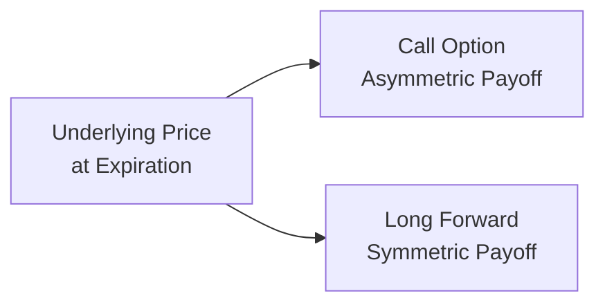

## 1.4 Key Differences Between Option-Based and Forward-Based Derivatives

It’s funny—when I first stumbled upon the world of derivatives, I actually thought an option and a forward were basically the same thing. I mean, they’re both contractual agreements with future settlement dates, right? Ah, how naïve I was. Over the years, I’ve heard a bunch of folks get a bit confused over these two fundamental forms of derivatives. So let’s get to the bottom of this, once and for all, and explore how option-based and forward-based derivatives truly differ. We’ll talk about rights vs. obligations, costs, payoff profiles, risk exposures, and even toss in some personal stories. By the time we’re done, you’ll (hopefully) have a new kind of clarity that might just forever change how you see derivatives.

Keep in mind that Canada’s regulatory environment is governed by the Canadian Investment Regulatory Organization (CIRO), which replaced the prior self-regulatory agencies. If you need more details about how derivatives are monitored and enforced, especially in Canadian markets, you can check out CIRO’s official site (https://www.ciro.ca). Let’s walk through all these differences step by step.

### Key Distinction: Right vs. Obligation

To me, the most important difference—like, the first principle of derivatives 101—is understanding that an option contract grants the buyer a right, not an obligation. A forward-based contract (which includes both forwards and futures) obligates the buyer and the seller to transact under the agreed-upon terms at maturity.

• Option-Based Derivatives  
  – The buyer pays a premium for the right to exercise (buy or sell) the underlying asset at a specified strike price before or at maturity (depending on whether it’s an American or European style).  
  – If the underlying asset price moves favorably, the option buyer can “exercise” the contract and potentially generate a profit. If the underlying price moves unfavorably, the option buyer can simply walk away and let the option expire worthless, losing only the premium.  
  – The seller of the option (also called the writer) receives the premium but now bears an obligation. If the buyer exercises, the seller must deliver or purchase the underlying at the strike price.  

• Forward-Based Derivatives (Forwards and Futures)  
  – Both parties are locked in. The forward or futures buyer must take delivery (or settle in cash, if it’s cash-settled) and the seller must deliver. There’s no optionality to back out.  
  – Forwards are often traded over-the-counter (OTC) and are customized. Futures are standardized and exchange-traded.  
  – Because there’s an obligation on both sides, neither party naturally has a built-in “escape hatch” if the price moves against them.

When I first started trading, I distinctly remember a friend of mine telling me: “Just buy some futures. It’s basically the same thing as an option.” Believe me, it’s not the same experience when your futures position starts accumulating losses each day and you can’t just say, “No thanks.” If the market’s moving against you, you have to either close out or keep meeting margin calls. That’s a stark contrast from an option buyer who can just watch the premium shrink and decide if they want to exercise or not.

### Cost or Premium

Another huge difference is upfront costs. Options typically require a premium payment (the buyer pays the seller for that ‘right’). Forwards and futures do not require an upfront payment in the same sense (although futures and some forwards call for margin deposits, which we’ll cover in a moment).

- Option Premium  
  – Let’s say you buy an option to purchase 100 shares of a stock at $50/share in three months. You might pay, for example, $2.00 per share as your premium. So you’re shelling out $200 upfront (not counting commissions).  
  – That $200 is gone whether you exercise or not. Think of it as a down payment granting you the privilege to buy the shares at $50 if you choose.  

- Margins in Forwards/Futures  
  – With a forward contract (especially in an OTC setting), there’s usually no upfront premium, but there may be credit support or collateral requirements.  
  – Futures, by contrast, typically require you to post “initial margin,” which is a percentage of the contract’s total value, plus ongoing “variation margin” if your position moves against you.  
  – Unlike an option premium, margin is not a cost in the same sense, because you might eventually get it back if the trade goes in your favor or if you offset the position. And the cost of carry or financing might be minimal if the markets don’t move drastically against you.

### Payoff Profiles

Now, let’s get into the heart of it: payoff profiles. This is where things get a bit visual, so let’s first outline them conceptually.

• Option-Based Derivatives  
  – Asymmetric payoff. If you’re the buyer, your losses are limited to the premium, but your potential gains can be substantial (potentially unlimited for a call option).  
  – If you’re the writer of a call, your profit maxes out at the premium you received, but your losses can, in theory, be unlimited.  

• Forward-Based Derivatives (Forwards/Futures)  
  – Symmetric payoff. If the price of the underlying goes up, the buyer gains and the seller loses by the same amount. If the price goes down, the buyer loses and the seller gains by the same amount.  

The best way to see this is with a simple payoff chart. Let’s illustrate a vanilla call option vs. a long forward on the same underlying asset.

In a call option’s payoff diagram, you see a flat line (loss capped at premium paid) until you hit the strike price. Then the payoff line slopes upward steadily if the underlying price goes above the strike.

For a forward or futures contract, the payoff is a straight line crossing zero at the agreed-upon forward price. Above that price, you win dollar-for-dollar (if you’re the buyer). Below it, you lose dollar-for-dollar.

### Risk Exposure

Risk is probably the #1 reason we use derivatives in the first place: to manage it, to take it on, or to lay it off. Here’s how it plays out differently:

- Options:  
  – If you buy an option (call or put), your maximum potential loss is the premium. That’s it. This is crucial for new entrants who want to mitigate risk; you know exactly how much you can lose.  
  – On the flip side, writing an option could expose you to significant risk (especially if you write an uncovered call or put). So from the seller’s perspective, an option can have a risk profile similar to a forward if the trade moves against them.  

- Forwards/Futures:  
  – Both the buyer and the seller face unlimited potential gains or losses because the price of the underlying can theoretically swing infinitely high or low.  
  – In practical terms, you must maintain margin to keep your futures position open. If the market goes against you, you might be required to deposit additional funds to cover losses.  

Years ago, a colleague of mine wrote some naked calls on gold futures because he “didn’t think the gold price would ever shoot up that much.” A few months later, a global economic scare caused gold to spike, he had huge margin calls, and he promptly closed out his position at a massive loss. Meanwhile, if he had just bought a call option, his risk would have been capped at the premium—though, of course, it would’ve swapped the indefinite risk for a certain initial cost.

### Trading Motivation

So—why do we trade these instruments differently?

• Options:  
  – Strategic Combinations: You can craft multi-leg strategies (spreads, straddles, collars, etc.) to profit from or hedge against various market outcomes.  
  – Hedging: Protect the downside of your portfolio by purchasing puts on the underlying (think “portfolio insurance”).  
  – Speculation: Take directional bets or volatility plays using calls or puts. If you think the market will be super volatile, you might buy a straddle.  

• Forwards/Futures:  
  – Hedging: Often used by farmers, exporters, importers to lock in sale or purchase prices. Also used by financial institutions to offset interest rate or currency risk.  
  – Speculation: You can go long or short on futures with minimal upfront capital. If you expect the market to rise, you buy futures; if you expect it to fall, you short.  
  – Arbitrage: Large institutions might use futures to exploit price discrepancies between cash markets and futures markets.

### Real-World Example

Let’s illustrate with a simple example involving the Canadian dollar (CAD) exchange rate. Suppose you’re a Canadian exporter who’ll receive USD payments in three months. You can:

• Buy a put option on USD/CAD. This lets you buy CAD at a certain exchange rate if the USD weakens. Your only upfront cost is the premium. If the USD/CAD rate doesn’t move against you, you can let the option expire.  
• Enter a forward contract to sell USD and buy CAD in three months at a fixed rate. There’s no upfront premium. However, you’re fully locked in. If the USD suddenly appreciates, you lose out on the potential windfall.  

If you’re extremely certain that you want to convert USD to CAD with no intention of letting any upside slip by, the forward might be your best bet. If you want flexibility—maybe you suspect the USD might get stronger but you still want some protection—a put option is more appropriate, even though you’ll pay a premium.

### Glossary Deep Dive

- **Premium (Option):** The amount paid by the option buyer to the option writer for the right to exercise. This is non-refundable.  
- **Contingent Claim:** The payoff depends on whether a certain threshold or condition is met (e.g., has the market price exceeded the strike price?).  
- **Obligation (Futures/Forwards):** Both the buyer and the seller must fulfill the terms at expiration unless the position is offset prior.  
- **Asymmetric Payoff:** A payoff structure where the upside and downside are not mirror images, typical of options.  
- **Symmetric Payoff:** Gains and losses are equal in magnitude on both sides, typical of forwards/futures.  
- **Strike Price:** The price at which the holder of an option may exercise the right (buy or sell).  
- **Exercise:** The act of using the option to buy or sell the underlying asset. With an American style, you can do this any time before expiry. With a European style, only at expiry.  
- **Margin (Forwards/Futures):** Collateral posted to ensure performance under the contract.

### Diagrams and Comparisons

Below is a basic table summarizing these differences:

| Aspect                      | Option-Based Derivatives                          | Forward-Based Derivatives                     |
|----------------------------|---------------------------------------------------|-----------------------------------------------|
| Right vs. Obligation       | Buyer has a right, not an obligation              | Both parties obligated to fulfill contract    |
| Upfront Cost               | Option premium required                           | No premium, but margin may be required        |
| Payoff Profile             | Asymmetric (limited loss, unlimited gain potential)| Symmetric (unlimited gain/loss)              |
| Maximum Loss (Buyer)       | Limited to premium                                | Potentially unlimited                         |
| Settlement                 | Exercise is optional                               | Mandatory settlement or delivery              |
| Common Uses                | Hedging with limited downside, speculating on volatility, multi-leg strategies | Price locking, systematic hedging, speculation on directional moves |
| Regulation & Clearing      | Exchange-traded or OTC (but heavily exchange-based for vanilla options), cleared through a derivatives clearing corp. | Futures are exchange-traded & cleared; forwards often OTC with bilateral settlement |

### Regulatory Environment in Canada

Here in Canada, the Bourse de Montréal is a key marketplace for trading futures and options on several underlyings—be it equity indexes, interest rates, or currency derivatives. All member firms and individuals dealing in these derivatives are under CIRO’s oversight. If you’re studying for any derivatives licensing exam, you’ll keep hearing about how important it is to follow CIRO’s guidelines for margin, trade reporting, and best execution.

Historically, we had the Investment Industry Regulatory Organization of Canada (IIROC) and the Mutual Fund Dealers Association of Canada (MFDA). But as of January 1, 2023, they merged into the Canadian Investment Regulatory Organization (CIRO). All relevant compliance notices and enforcement actions can now be found at https://www.ciro.ca. If you want to see how serious regulators get about “improper use of derivatives”, you can read some of their enforcement notices—they can be both enlightening and sobering.

### Tools and Resources

- **Bourse de Montréal Education Tools:**  
  Check out https://www.m-x.ca/education_en.php for courses, webinars, and interactive tools that break down options and futures for beginners and seasoned traders alike.  
- **John C. Hull’s “Fundamentals of Futures and Options Markets”:**  
  A must-read for those who want a deeper dive into payoff diagrams, pricing, and hedging concepts. Hull’s style is concise but thorough.  
- **CIRO Enforcement Notices:**  
  Head to https://www.ciro.ca for real-life regulatory cases that illustrate what can go wrong if derivatives are misused or if margin requirements aren’t followed.  
- **QuantLib-Python:**  
  Visit https://www.quantlib.org/python_documentation.shtml if you’re into modeling and analytics. This open-source library helps you simulate various derivative payoffs, compute implied volatility, and run scenario analyses.  

### Practical Considerations and Best Practices

1. **Know Your Objective**  
   Are you hedging, speculating, or arbitraging? Your goal dictates whether you pick an option or a forward/futures contract. If you need strict price certainty, consider a forward. If you need a safety net but want to leave room for potential gain, think options.

2. **Understand Margin Requirements**  
   Futures (and sometimes forwards) require margin posting, with potential daily margin calls. If you’re not prepared to meet them, your brokerage can close out your position.  
   In Canada, the Bourse de Montréal sets margin rules for exchange-traded derivatives, and member firms must abide by CIRO’s standards.

3. **Beware the Greeks (For Options)**  
   Options have a Greek alphabet’s worth of risk measures (Delta, Gamma, Theta, Vega, and Rho). If you plan on trading options actively, get comfortable with how these measure your sensitivity to price changes, volatility, time decay, and interest rate movements.

4. **Exercising vs. Offsetting**  
   Often, option traders will simply offset (or close out) a position by trading an opposite position rather than physically exercising the option. This can be more efficient, especially if you don’t actually want the underlying asset.

5. **Keep an Eye on Liquidity**  
   Forwards can be illiquid, especially in exotic or low-volume markets. Futures are usually quite liquid, while options can vary drastically depending on the underlying and the strike. Liquidity affects the ease of entering or exiting positions and the bid-ask spread you’ll face.

6. **Hedging Pitfalls**  
   There’s an old saying: “A hedge is never perfect.” Bear in mind that many hedges end up being “imperfect” if the underlying asset or quantity differs from the hedge. Cross-hedging can introduce basis risk or correlation risk.

7. **Stay Current on Regulations**  
   Regulators update margin requirements, capital requirements, or position limits from time to time—especially in volatile markets (consider the spikes in volatility seen during global market shocks). Keep checking official sources like https://www.ciro.ca.

### Personal Anecdote

Let me share a quick personal moment. I once tried to hedge a foreign investment using currency options. My thinking: “I’ll pay a premium to protect against the Canadian dollar strengthening.” But a part of me was worried about “wasting” the premium. Sure enough, the currency didn’t move against me, so my option ended up worthless. At first, I was annoyed—until it dawned on me that I had, in fact, successfully hedged my potential risk. My position was intact, and that minor premium was basically the cost of peace of mind. If I had used a forward contract, I would have locked in an exchange rate and missed out on any favorable move. It was a great lesson in the trade-offs between optionality and obligation.

### Conclusion

Let’s wrap up. Option-based derivatives and forward-based derivatives aren’t just semantic differences in contract language. They represent fundamentally different ways to manage—and take on—market risk. The presence of an upfront premium, the asymmetry of rolling the dice on an option payoff, and the structure of margin requirements all combine to shape how these derivatives fit into your strategy.

Take some time to think about what your specific goals are—do you want to ensure a price or yield no matter what, or do you just want a safety net while keeping upside potential open? Your answer might tell you whether you should pick an option-based strategy or a forward/futures-based approach.

And hey, if you’re curious to dig deeper, definitely check out the recommended resources: the Bourse de Montréal’s education page, John Hull’s timeless reference, the QuantLib-Python toolkit, and CIRO’s official site for regulatory guidelines.  

No matter which path you take, make sure you do your homework. Remember: derivatives aren’t inherently risky, but using them without a plan or an understanding can definitely lead to trouble. That’s about it—forward-based or option-based, both can be powerful tools in your financial toolkit if used properly.

---

## Sample Exam Questions: Key Differences Between Option-Based and Forward-Based Derivatives



### Which statement best defines the key difference between an option and a forward/futures contract?

- [ ] Both give the buyer an obligation to buy or sell the underlying asset at maturity.
- [x] Options grant the buyer a right with no obligation, whereas forwards/futures oblige both parties.
- [ ] Forwards/futures require an upfront premium, whereas options do not.
- [ ] Forwards/futures have no margin requirements.

> **Explanation:** An option provides the holder with a right (but not an obligation) to exercise, whereas forwards/futures obligate both parties to perform.

### Which of the following best describes the payoff profile of an option buyer compared to a forward buyer?

- [ ] Both are symmetric.
- [x] The option buyer has an asymmetric payoff (limited loss, unlimited potential gain).
- [ ] The forward buyer and the option buyer both have unlimited loss potential.
- [ ] The forward buyer’s payoff is asymmetric like an option buyer’s payoff.

> **Explanation:** Option buyers have an asymmetric payoff, limiting losses to the premium but offering substantial upside potential. Forwards are symmetric.

### In the context of margins, which is true about forward-based derivatives?

- [x] Forward or futures traders typically must post margin to cover potential losses.
- [ ] They never require any form of collateral.
- [ ] Only option sellers must post margin.
- [ ] Margins are automatically returned in full at expiration, regardless of losses.

> **Explanation:** Forward-based derivatives often involve initial and ongoing margin requirements to ensure each counterparty can meet potential obligations.

### For an individual simply wishing to cap risk without forfeiting potential upside, which derivative is generally preferred?

- [ ] Entering a forward contract to lock in the sales price.
- [x] Buying a call or put option, paying the option premium.
- [ ] Writing a naked call option with no upfront premium.
- [ ] Using a swap with floating rate payments.

> **Explanation:** Buying options allows the buyer to limit downside risk while keeping the possibility of benefiting from favorable moves above the strike (for calls) or below the strike (for puts).

### A Canadian exporter wants to protect against a decline in USD/CAD but remain open to gains if the US dollar rises. Which derivative fits best?

- [ ] A forward contract to sell USD at a fixed rate.
- [x] A put option on USD/CAD to lock in a worst-case exchange rate.
- [ ] A short futures position on CAD against USD.
- [ ] An interest rate swap.

> **Explanation:** A put option on USD/CAD ensures a minimum exchange rate to convert USD to CAD, while still allowing the exporter to benefit if USD/CAD appreciates.

### In terms of maximum loss for the buyer, how do options differ from forwards and futures?

- [x] The maximum loss for an option buyer is the premium, whereas a forward/futures buyer has unlimited potential losses.
- [ ] There is no difference; both have unlimited potential losses.
- [ ] Forwards and futures have limited losses; options do not.
- [ ] Option buyers are obligated to pay margin calls throughout the contract’s life.

> **Explanation:** An option buyer can only lose the premium. Forward/futures buyers have theoretically unlimited risk as the price can move dramatically adverse.

### Which resource would one consult for official regulatory notices and past enforcement cases in the Canadian derivatives market?

- [ ] Montreal Stock Exchange archived site
- [ ] The defunct MFDA website
- [x] CIRO’s Enforcement Notices at https://www.ciro.ca
- [ ] The SEC’s website in the U.S.

> **Explanation:** Canada’s primary self-regulatory body is CIRO, and its website has enforcement notices for cases of improper derivatives usage.

### What is the primary reason that forward-based derivatives exhibit a “symmetric payoff” structure?

- [ ] They include optionality at no extra cost.
- [ ] All payoffs are capped at zero for the seller.
- [x] Both the buyer and the seller can gain or lose equally depending on price movements.
- [ ] Symmetric payoff only applies to equity forwards but not commodity forwards.

> **Explanation:** Forward contracts enforce obligations on both sides, so gains or losses mirror each other.

### An “asymmetric payoff” is most closely associated with which characteristic of an option?

- [ ] The requirement of initial margin.
- [ ] Unlimited potential loss for the buyer.
- [ ] The buyer and seller both have equal obligations.
- [x] The buyer’s loss is limited to the premium but gains can be much larger.

> **Explanation:** In an asymmetric payoff structure, the option buyer’s risk is capped by the premium, while the potential gain can be significantly higher.

### If you have a long call option, what is your maximum risk?

- [x] The premium paid for the call.
- [ ] The entire value of the underlying security.
- [ ] There is no limit; it can exceed whatever you pay for the contract.
- [ ] The interest rate implied by the forward curve.

> **Explanation:** With a long call, your only possible loss is the premium, even if the underlying asset’s price goes nowhere or declines.


