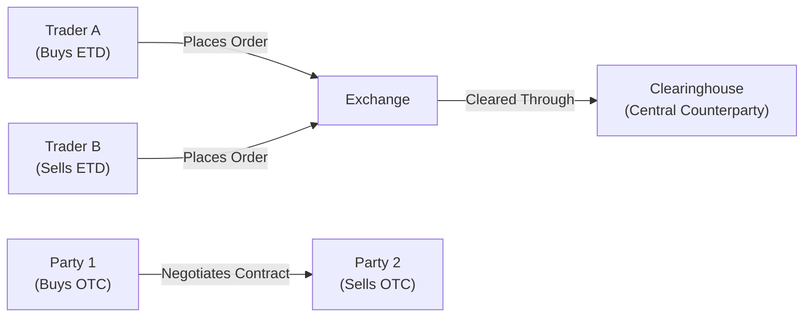
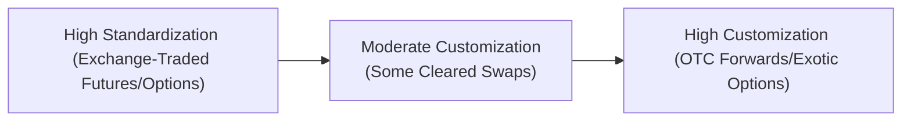

## 1.5 Exchange-Traded and Over-the-Counter Derivatives

Sometimes, when I think back to my first experience in the derivatives world, I remember feeling that I was stepping into a place with way too many letters, abbreviations, and fancy math. Back then, I couldn’t keep track of acronyms like “OTC,” “CDCC,” or “CSA.” So if you’re feeling that way too—don’t worry. It’s totally normal. Let’s simplify it all. In this section, we’ll compare Exchange-Traded Derivatives (ETDs) and Over-the-Counter (OTC) Derivatives: what they are, how they’re traded, and what kind of regulations and typical use cases apply to each. By the time you’re done reading this, I think you’ll see that—yes—these products can get complicated, but they follow some core principles that are surprisingly straightforward once you break them down.

### The Big Picture: Exchange-Traded vs. OTC

Derivatives, at heart, allow us to manage (or take on) risk. You can buy or sell risk, if you will. But not all derivatives trade in the same “place.” Some trade on recognized exchanges, with rules that everyone plays by. Others get created and negotiated privately, between just two parties—like a made-to-order item from a tailor. Let’s delve into the distinct features of each.

#### Exchange-Traded Derivatives (ETDs)

When we talk about exchange-traded derivatives, we’re typically referring to standardized products such as futures and listed options. These instruments trade on regulated platforms, including the Bourse de Montréal in Canada, CME Group in the U.S., or ICE Futures in Europe, among many others. You can think of these exchanges like a huge digital marketplace with well-defined rules. The key highlights:

• Standardization.  
• Central clearing via a clearinghouse.  
• Transparent pricing and regulated trading.  
• Margin requirements set by the exchange and by regulators.  
• Highly liquid (most of the time), supporting robust daily trading volumes.

#### Over-the-Counter (OTC) Derivatives

Over-the-counter derivatives are privately negotiated contracts, such as forwards, swaps, and tailor-made options. They don’t trade on official exchanges. Instead, they’re arranged between two parties—often large institutions or corporations seeking customized exposure or hedges. If you or I want an ultra-specific maturity date, a certain notional amount, a particular underlying asset, or a unique payoff structure, an OTC product can deliver that more readily. Some key features:

• Customization is possible.  
• No central order book; deals are concluded bilaterally.  
• Higher (or at least different) counterparty credit risk.  
• Historically less transparent, though regulations have evolved substantially post-2008.  
• Trade reporting obligations now required under various CSA rules (in Canada) and global standards.

### Standardization and Central Clearing

When you hear the term “exchange-traded,” you can generally assume there’s a clearinghouse. A clearinghouse is like the universal middleman that helps guarantee trades. For instance, if I buy 10 S&P/TSX 60 index futures on the Bourse de Montréal, the clearinghouse (CDCC in Canada) steps in. So effectively, I’m facing the clearinghouse, not the individual who sold me those contracts. This arrangement massively reduces my counterparty credit risk.

In contrast, with an OTC derivative—like a forward contract—there is no automatic central clearing mechanism (unless the forward is centrally cleared through a mandated clearing arrangement). The trade is just between me and my counterparty. If my counterparty fails to pay or deliver, that’s a problem. In the wake of the 2008 financial crisis, regulators around the world rolled out new rules—like the Dodd-Frank Act in the U.S. or, here in Canada, reforms by the Canadian Securities Administrators (CSA)—to increase transparency and reduce systemic risk in the OTC space. One of the biggest changes has been the push to clear more OTC derivatives through central clearinghouses and to demand collateral or “margin” under legally binding documentation.

#### Quick Mermaid Diagram

Below is a simplified diagram comparing a standard exchange-traded derivative workflow to an OTC derivative workflow:

• On the left: Trader A and Trader B interact via an **Exchange**; the **Clearinghouse** is in the middle, ensuring each side’s obligations are honored.  
• On the right: The OTC structure is direct, with no centralized institution guaranteeing performance.

### Counterparty Risk and Credit Considerations

You won’t be surprised to learn that in an OTC derivative, credit risk is front and center. We’re reliant on the solvency and good faith of the counterparty. This is where we hear about credit support annexes (CSAs), margining arrangements, and tri-party collateral agreements. All these terms revolve around managing the potential for one side to default.

With exchange-traded derivatives, that risk is mostly absorbed by the clearinghouse. They set margin requirements that are collected from both sides. If one side defaults, the clearinghouse can step in, use posted margins, and keep the contract afloat or close it out in an orderly fashion. Essentially, the clearinghouse acts like a giant cushion in the event any single participant fails to meet their contract obligations.

### Regulation and Transparency

Modern financial systems rely on firm regulation. That’s especially true for derivatives, as we learned after 2008. In Canada, the brand-new Canadian Investment Regulatory Organization (CIRO) is central to overseeing investment dealers and regulating marketplace conduct for equity and debt products. Before 2023, this role was split between the Investment Industry Regulatory Organization of Canada (IIROC) and the Mutual Fund Dealers Association of Canada (MFDA), but both have amalgamated into the new CIRO.  

Exchange-traded derivatives come under the direct watch of the exchanges themselves, plus the relevant provincial securities regulators and, effectively, CIRO. Typically, there are daily reporting obligations, capital requirements for dealers, trade position limits, and standard margin frameworks that must be followed.

On the OTC side, it used to be a bit like a free-for-all—there was no central repository of trades. But now, after the crisis-driven reforms, all significant OTC trades must be reported to recognized trade repositories under CSA regulations such as National Instrument 94-102 (Derivatives: Customer Clearing and Protection of Customer Collateral and Positions). This is so regulators get a better handle on the size, scope, and type of risks being taken in the markets. Additionally, large banks often face capital charges for their OTC derivative exposures, encouraging them to standardize trades or push them onto exchanges or central clearing platforms.

### Product Customization

The hallmark of OTC derivatives is customization. Let’s say your company wants a foreign exchange forward that settles in 37 days, for an unusual currency pair. Good luck finding a 37-day contract on a public futures exchange. Instead, you’d likely turn to your bank’s treasury desk and get an OTC forward contract with your desired maturity date, pay-off structure, etc.

Exchange-traded contracts, by contrast, come in standard contract sizes—like 100 shares for stock options or 1,000 barrels for an oil futures contract. And their maturities are set by the exchange. Yes, you can often roll over your position. But if you need a very specific tenor that’s not on the list, or you want an unusual underlying, you may have no choice but to go OTC.

### Operational Logistics and Documentation

When I had my first big job working on derivatives documentation, I was stunned by how different the paperwork was for exchange-traded products versus OTC deals. For an OTC transaction, you typically have an International Swaps and Derivatives Association (ISDA) Master Agreement plus a schedule, and possibly a credit support annex. You might spend weeks (or months) hammering out the clauses and credit terms with a client.  

For an exchange-traded derivative, all you need is to open an account with your broker under standard terms, keep enough margin, and place your trade. The “documentation” is basically the exchange’s rulebook plus your brokerage agreement. That’s part of why exchange-traded products are simpler and more accessible to many retail investors.

### Settlement and Clearing

Settlement risk is closely tied to counterparty risk. In an exchange environment, settlement and clearing are facilitated by the clearinghouse. Each day, the clearinghouse calculates variation margin (the daily mark-to-market on futures or short options) to ensure that the losing side pays up daily, so that there isn’t a big accumulation of losses waiting to be realized at expiration.

In OTC markets, settlement terms can be flexible. Maybe you settle at maturity, or monthly, or some other arrangement. But that freedom means one side could owe a boatload of money at once if the underlying moves significantly. That’s precisely where the systemic risk can come from.

### Margins, Collateral, and Regulatory Capital

When you trade an exchange-traded derivative, your broker requires you to post margin, which is basically a good-faith deposit to ensure you can meet your obligations. CIRO sets minimum margin guidelines for equity and index options or futures trades, but the exchange or your broker might impose higher “house” requirements.

In an OTC transaction, “margin” is typically negotiated bilaterally. For instance, if you’re a hedge fund trading interest rate swaps with a bank, you might have a credit support annex (CSA) that demands daily, weekly, or monthly margin calls depending on the mark-to-market of the swap. Big banks also have to set aside regulatory capital (under Basel III frameworks or OSFI guidelines in Canada) to reflect the risk that the swap might go sour.

### Practical Example: Futures vs. Forward

Let’s do a quick example to highlight the difference. Suppose you want to hedge your exposure to 1,000 barrels of crude oil for delivery in three months:

• Exchange-Traded Path: You buy 1,000 barrels worth of standard crude oil futures on (for instance) the NYMEX. You post margin and meet daily variation margin calls. The contract is standardized in lot size, settlement date, and quality of the crude.  

• OTC Path: You arrange a forward with a commodity dealer for 1,100 barrels of “specific grade” crude for delivery in exactly 92 days for a negotiated price. No daily variation margin is typically required unless you have a separate collateral agreement. But you face direct exposure to that commodity dealer’s ability to deliver or pay you.

In the first scenario, transparency is high. Everyone sees futures prices in real time. Daily settlement is guaranteed by the clearinghouse. In the second scenario, the price might remain private. The forward contract may be custom. But you’ll shoulder the entire risk if your counterparty doesn’t perform.

### Post-Financial-Crisis Reforms and Their Impact

The meltdown of 2008 taught us all about systemic risk. Big banks loaded up on complex OTC derivatives tied to housing markets, and the chain reaction from defaults was enormous. In response, global regulators required more transactions to be cleared or at least reported. In Canada, the CSA introduced mandatory OTC trade reporting. Institutions frequently must submit their trades to recognized trade repositories like DTCC or others, so that regulators can track exposures.

Importantly, CIRO requires its member firms (formerly the separate IIROC and MFDA members, but now under one SRO body) to hold adequate capital for derivative exposures and to maintain robust risk management frameworks. That includes stress testing potential defaults and ensuring they can handle large swings in the market.

### Emerging Landscape: More Convergence?

With more mandatory clearing for some OTC derivatives, the line between “exchange” and “OTC” can get blurry. Some interest rate swaps, for instance, are now cleared through central counterparties. Parties may also trade standardized swap contracts on swap execution facilities, or SEFs, which behave somewhat like exchanges but still allow some custom features. So you might see “OTC” products that start to look more standardized, bridging the gap with the fully exchange-traded domain.

### Common Pitfalls and Lessons Learned

• Overleveraging. Even though exchange-traded products have margin limits, it’s surprisingly easy to get overextended. For example, taking on too many futures positions without a realistic plan for daily margin changes is a recipe for a margin call meltdown.

• Counterparty Overconcentration. In OTC deals, if your only counterparty is a single institution, your concentration of risk is high. That’s sometimes overlooked—until it isn’t.

• Overly Complex Documentation. Negotiating ISDA schedules can become a labyrinth. Many new entrants (and even some old hands) fail to read the fine print, like cross-default clauses or thresholds for collateral calls.

• Liquidity Surprises. While an OTC contract might be custom, you might discover it’s not so easy to exit or offset that contract. In exchange-traded markets, you can almost always unwind a position quickly, especially if it’s a liquid contract.

### Best Practices

• Understand the Product. Whether exchange-traded or OTC, it’s essential to truly grasp the payoff structure, expiration, margin rules, and potential gaps in liquidity.

• Diversify Counterparties. If you do a lot of OTC trading, don’t put all your eggs in one basket. Manage your credit lines and negotiate collateral provisions carefully.

• Stay Current on Regulations. CIRO guidelines, CSA rules, and even global standards can shift quickly. For instance, new margin rules can significantly affect the cost of holding a position.  

• Use Reputable Intermediaries. Whether it’s a prime broker for OTC trades or a reliable brokerage for exchange-traded products, working with partners who have robust risk frameworks can be a lifesaver.

### Real-World Case Study: A Currency Hedge

Imagine a small import/export business in Toronto worried about fluctuations in the CAD/EUR exchange rate. They might consider:

• Exchange-Traded: Buying Canadian dollar currency futures on the Bourse de Montréal. However, the contract standard might not match their exact exposure or timing. They may have to roll the futures contract every three months if their exposure extends beyond that horizon.

• OTC: Negotiating a custom forward contract with their bank for a specific amount of EUR in 47 days to settle an invoice. This lines up perfectly with the date the business expects to pay its European supplier. But the business has direct risk to the bank. Usually, that bank is well-capitalized, so the risk can be small—but it’s still there.

### Additional Resources and References

• CSA’s National Instrument 94-102 (Derivatives: Customer Clearing and Protection of Customer Collateral and Positions):  
  https://www.securities-administrators.ca  
• Bank for International Settlements (BIS): https://www.bis.org/ for global OTC derivatives market statistics.  
• International Swaps and Derivatives Association (ISDA): https://www.isda.org/ for documentation frameworks and market research.  
• CME Group, ICE, Eurex websites: Provide rich data sets on futures trading volumes, open interest, and market trends.  
• CIRO: https://www.ciro.ca for current regulations, margin requirements, and policy guidelines.

### Diagram: Relative Transparency and Liquidity Spectrum

Let’s illustrate how common derivative products stack up in terms of standardization, customization, and typical liquidity:

As you move from left to right, you generally see more specialization, less standardized liquidity, and a greater reliance on private negotiation.

### Parting Thoughts

Whether you lean towards the clarity and transparency of exchange-traded products or crave the flexibility of OTC derivatives, both worlds are crucial to modern finance. They help businesses manage real risks—like exchange rate or interest rate fluctuations—and they help speculators express their views on market movements.  

But it’s good to remember that derivatives can be quite powerful. So approach them with respect. In the next sections, we’ll dig deeper into other aspects of derivatives—like margin calculation, differences in forward and futures pricing, and how these instruments get used for hedging, speculation, or yield enhancement.  

Now you’ve got a decent sense of how exchange-traded derivatives differ from OTC contracts, and hopefully, you feel less intimidated by all the acronyms. If not, well…just remind yourself it’s normal to be a bit overwhelmed. Seriously, I still discover new corners of the OTC world from time to time, and that’s what keeps it exciting.

---

## Sample Exam Questions: Exchange-Traded vs. OTC Derivatives Essentials



### Which of the following best describes how a clearinghouse reduces counterparty risk for exchange-traded derivatives?

- [ ] It forces traders to negotiate contracts directly.
- [x] It becomes the buyer to every seller and the seller to every buyer.
- [ ] It eliminates daily margin requirements.
- [ ] It guarantees profit for both sides.

> **Explanation:** By inserting itself in the middle of each trade, the clearinghouse assumes the counterparty credit risk, so each party effectively faces the clearinghouse rather than the other trader, reducing default and settlement risk.

### What is the primary advantage of OTC derivatives over exchange-traded derivatives?

- [ ] Guaranteed central clearing.
- [ ] Higher transparency and trade reporting.
- [x] Tailored contract specifications.
- [ ] Lower overall market risk.

> **Explanation:** OTC contracts are negotiated between counterparties, allowing them to tailor the contract’s substance (e.g., maturity, notional, underlying asset) to their precise needs.

### Which regulatory development significantly increased transparency in the OTC derivatives market post-2008?

- [ ] Removal of margin requirements for OTC trades.
- [x] Mandatory reporting of OTC trades to recognized trade repositories.
- [ ] Complete prohibition of OTC futures.
- [ ] Merger of MFDA and IIROC into CIRO.

> **Explanation:** In Canada and globally, the financial crisis spurred requirements that OTC trades must be reported to help regulators monitor market sizes and risk exposures. MFDA-IIROC merger is about SRO consolidation, not direct trade reporting.

### Which of the following is a key publicly available resource for global OTC derivatives market statistics?

- [ ] The Bourse de Montréal Rulebook.
- [ ] CIRO website.
- [x] Bank for International Settlements (BIS).
- [ ] Local daily newspapers.

> **Explanation:** The BIS website publishes comprehensive data on global OTC derivatives notional amounts and trading activity.

### Which statement about settlement in OTC derivatives is correct?

- [x] Settlement terms can be agreed upon bilaterally and vary significantly from one trade to another.
- [ ] All OTC derivatives settle daily through variation margin calls.
- [ ] There is no settlement risk if a trade takes place off-exchange.
- [ ] Settlement isn’t possible unless your contract is reported to CSA.

> **Explanation:** In OTC trades, settlement timing and mechanics are typically negotiated as part of the deal. Daily variation margin is standard for exchange-traded futures but not mandatory for all OTC deals unless specified in credit support annexes.

### Among the following, which is a recognized advantage of exchange-traded products?

- [ ] Zero cost to enter a position.
- [x] High liquidity and established margin procedures.
- [ ] Unlimited flexibility in contract specifications.
- [ ] Complete immunity from price fluctuations.

> **Explanation:** Exchange-traded derivatives often enjoy deeper liquidity, a transparent price-discovery process, and standard margin procedures enforced by the clearinghouse.

### What is a potential drawback of relying heavily on OTC derivative contracts?

- [ ] Having to post margin every day to a clearinghouse.
- [ ] Lack of any documentation.
- [x] Increased counterparty credit risk.
- [ ] Obliged real-time pre-trade transparency.

> **Explanation:** Because OTC derivatives are privately negotiated between two parties, if one party fails to fulfill its obligations, the other may suffer a loss with no central clearinghouse stepping in.

### What type of documentation framework is commonly used when negotiating OTC derivatives contracts?

- [ ] The Bourse de Montréal trading manual.
- [ ] A standard broker account application form.
- [ ] The Basel III capital directive.
- [x] The ISDA Master Agreement and accompanying schedules.

> **Explanation:** Bilateral OTC trades are typically governed by ISDA documentation to cover terms, collateral arrangements (CSA), and default triggers.

### Why do big banks need higher regulatory capital for certain OTC derivative positions?

- [ ] Because the trades never settle.
- [ ] Regulators punish all OTC instruments with higher fees.
- [x] To cushion potential losses if counterparties default on large exposures.
- [ ] To eliminate the need for margin.

> **Explanation:** Banks hold more capital for high-risk or large-volume OTC exposures to protect against counterparty defaults, as mandated by Basel III/OSFI guidelines in Canada.

### True or False: By default, all OTC derivatives in Canada are required to be centrally cleared.

- [ ] True
- [x] False

> **Explanation:** Although regulators have encouraged central clearing for standardized OTC derivatives, not all must be cleared. Many remain bilaterally negotiated and uncleared, though they may still require trade reporting.


