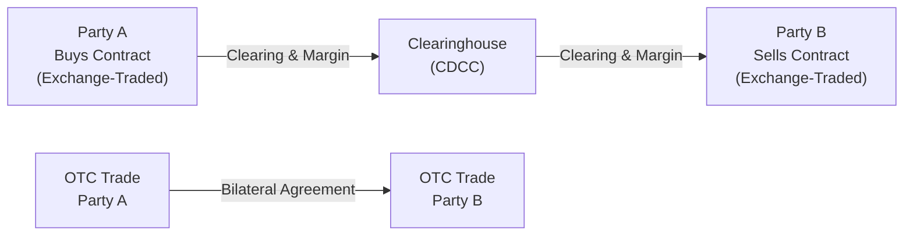

## 1.6 Key Differences Between Exchange-Traded and Over-the-Counter Derivatives

It’s funny—I remember the first time I heard the term “derivatives.” I was sitting in a small classroom, and all I could think was, “What on earth is this stuff?” If you’ve ever felt that way, you’re definitely not alone. Well, let’s break it down together, focusing on one of the core ideas in the world of derivatives: the difference between exchange-traded instruments and their less-regulated cousins, over-the-counter products. 

You might have already noticed that the derivatives space is huge—and I mean huge—encompassing everything from tiny equity options to giant interest rate swap transactions that can move billions of dollars. But not all derivatives are created equal. Some trade on official exchanges (like the Bourse de Montréal here in Canada), whereas others are privately negotiated deals between two parties, known as OTC (over-the-counter) derivatives. 

Below, we’ll explore how these two branches of the same derivative tree compare. We’ll talk standardization vs. customization, liquidity and price discovery, clearing mechanisms, and more. By the end, we’ll hopefully have made sense of these differences—without sounding too much like a textbook.

  
## Standardization vs. Customization

It’s hard to ignore: Exchange-traded derivatives are basically the “one-size-fits-all” version of derivative contracts. Think about it like shopping at a bulk store—you get products pre-packaged in standard sizes and shapes, with uniform rules on underlying assets, expiration dates, and contract sizes.

• In an exchange-traded contract (like an equity option listed on the Bourse de Montréal), everything is fixed. Contract specifications, such as the number of shares covered by one option or the expiry dates, are decided by the exchange.  
• If you need something more bespoke—maybe an exact notional amount for your interest rate hedging, or a special date that doesn’t fit the standard calendar—then you’re looking at the over-the-counter market. OTC derivatives can be tailored to meet highly specific investment or hedging requirements.  

I once saw a power company use an OTC swap to manage the exact timing of its operating cash flows. This was so customized—down to particular days—an exchange-traded contract simply wouldn’t cut it. While that level of precision is awesome, it comes at a cost: more negotiation time, plus the possibility of higher counterparty risk.

### Key Takeaways  
• Exchange-Traded: Uniform (everyone gets the same standard contract).  
• OTC: Flexible (customizable to almost any need).  

That’s the main difference in a nutshell: standardized “off-the-shelf” solutions vs. tailor-made “bespoke suits.”

  
## Clearing Mechanism

If you’ve never heard of a clearinghouse, it might sound a bit dull, but trust me—clearinghouses are the unsung heroes ensuring the financial world doesn’t crash on a daily basis. When you trade on an exchange, there’s this big safe net behind you known as a central clearinghouse (in Canada, the Canadian Derivatives Clearing Corporation or CDCC is a prime example). The clearinghouse stands between the buyer and the seller, guaranteeing the trade will be honored even if one side goes belly-up.

### Exchange-Traded Approach  
• Central Clearing: Trades on an exchange funnel through an approved clearing corporation.  
• Counterparty Risk Mitigation: The clearinghouse becomes the legal counterparty, so you effectively have zero direct exposure to the other side’s credit risk.  
• Margin Requirements: The clearinghouse requires you to post margin (cash or securities) based on your daily positions and potential risk.  

### OTC Approach  
• Bilateral Relationship: You have a direct agreement with your counterparty, which means if they fail, well…that could be your problem.  
• Collateral Arrangements: Many OTC participants use an ISDA Credit Support Annex (CSA) to post collateral. But this is more flexible and can be negotiated.  
• Counterparty Risk: A large chunk of OTC market participants rely on the creditworthiness of their counterparties or on netting agreements across multiple trades.  

When the 2008 financial crisis hit, people realized how important clearing could be, because the collapse of big counterparties (think Lehman Brothers) left many OTC trades in limbo. In response, global reforms started pushing certain standardized OTC derivatives into central clearing. If you’re curious, you can check out [CDCC’s](https://www.cdcc.ca/) website, which outlines how they manage this crucial role for exchange-traded derivatives in Canada.

  
## Liquidity and Price Discovery

Liquidity is a fancy word for how fast you can get in or out of a position without moving the market too much (or at all). Price discovery is basically about how easily you can figure out the “fair” or market price for a contract. 

### Exchange-Traded Markets  
• Transparent Quotes: Exchanges typically publish real-time bids and offers, meaning everyone can see current pricing.  
• Higher Liquidity, Lower Transaction Costs: Because there are many participants trading standardized contracts, it’s easy to enter or exit.  
• Central Order Book: Matching of trades is done through an electronic system (or a pit in the older days!) that aggregates everyone’s orders.  

### OTC Markets  
• Dealer or Broker Quotes: Price discovery is more decentralized. You might have to call multiple dealers to get a quote.  
• Potentially Lower Liquidity: Because each contract can be custom, there may not be another party standing by to buy or sell the exact same structure.  
• Wider Bid-Ask Spreads: If an OTC contract is highly specialized, it’s tougher to hedge or offload. This often leads to more expensive transaction costs.  

Whenever I compare the two, it’s a bit like a bustling open-air market (exchange-traded) vs. a private one-on-one negotiation (OTC). Both can work well, but if you want immediate and transparent pricing, the exchange is your friend. If you need something obscure or specialized, you might have to rummage off-exchange.

  
## Regulatory Oversight vs. Private Negotiation

Exchange-traded instruments function under the watchful eyes of both the exchange itself and the Canadian Investment Regulatory Organization (CIRO). CIRO was formed by the merger of two predecessor organizations (IIROC and the MFDA) back in early 2023. Now it’s the main regulatory body in Canada overseeing member firms that deal with exchange-traded securities and derivatives.

### Exchange-Traded Regulation  
• Rules & Audits: The exchange sets rules on listing, reporting, position limits, margin requirements, etc. CIRO enforces these for dealer members.  
• Transparency: All trades are publicly reported, so regulators can track large positions.  
• Investor Protection: The Canadian Investor Protection Fund (CIPF) is in place for accounts held at member firms, providing coverage if a broker-dealer goes insolvent.  

### OTC Regulation  
• Bilateral & Private: Historically, OTC trades were private deals between two sophisticated parties.  
• Post-2008 Reforms: Regulators introduced mandatory reporting (to trade repositories), central clearing for some standardized contracts, higher capital requirements, and margin rules for uncleared swaps.  
• Global Convergence: Bodies like the CSA (Canadian Securities Administrators) coordinate with CIRO, and there’s a push to standardize reporting across jurisdictions.  

Although OTC trades are still mostly private affairs, the days of “wild west” minimal regulation are long gone. Many trades—especially in interest rate swaps—must now be reported and, in some cases, centrally cleared. That move significantly reduces systemic risk but also introduces additional compliance steps.

  
## Visual Overview with Mermaid

Below is a simple Mermaid diagram showing two paths: one with a clearinghouse at the center (exchange-traded) and another with a direct OTC relationship.

• **Top Flow**: Exchange-traded derivative with a clearinghouse in the middle.  
• **Bottom Flow**: OTC derivative with direct negotiation and risk shared between the two parties.  

As you can see, exchange-traded derivatives funnel their trades through the clearing entity, while OTC trades skip that step.

  
## Practical Example: Equity Options vs. Custom Commodity Swap

Let’s say you’re an individual investor who thinks XYZ stock (listed on the Toronto Stock Exchange) is going to skyrocket. You might buy a standardized call option. It has an expiration date set by the exchange and covers 100 shares per contract, with set strike prices. You’ll see real-time quotes on the Bourse de Montréal’s platform, and if you want to exit, you can usually do so without too much hassle.

Now, imagine you’re a Canadian mining company wanting to hedge a unique blend of different metals you produce. You might negotiate an OTC commodity swap with a bank that references the average monthly price of your specific metals. The volumes, settlement dates, and calculation methods are all customized to your supply chain. This deal has no centralized order book and no clearinghouse—so the bank will want to monitor your credit risk (and vice versa), possibly requiring you to post collateral if market prices move against you.

  
## Best Practices and Common Pitfalls

### Best Practices  
• Assess Your Needs: If you only need a standard contract (like a simple call option on a publicly traded equity or a standard interest rate hedge), exchange-traded might be simpler and safer.  
• Use Collateral and Documentation: If you go the OTC route, an ISDA Master Agreement (see [ISDA Guides](https://www.isda.org/book/isda-master-agreements/)) is a must to clearly define termination events, netting provisions, and margin rules.  
• Monitor Regulatory Requirements: CIRO oversight, margin calculations, and mandatory clearing thresholds change periodically—so stay up-to-date with the latest guidelines.  

### Common Pitfalls  
• Underestimating Counterparty Risk: In an OTC deal, you need to be sure your counterparty can pay if things go south.  
• Over-Customization: While customization can be a strength, it can also mean illiquidity. If you want to exit a complex position prematurely, you might struggle to find a willing party.  
• Ignoring Margin Calls: Both exchange-traded and OTC trades can involve margin calls. Failing to post required collateral can lead to forced liquidation or default.  

I remember a friend who jumped into a lightly traded OTC structure to speculate on interest rates. She realized too late that unwinding it would require paying a hefty early-termination fee because there was no secondary market to speak of. The entire experience taught her how important liquidity can be.

  
## Quick Glance at Key Terms (Glossary)

**Price Transparency**  
The ease with which market participants can see current prices. Exchanges excel at this; OTC markets rely on dealer quotes.

**Bilateral Agreement**  
A contract between two parties without a central intermediary. OTC derivatives rely heavily on these.

**ISDA Master Agreement**  
The standard legal framework governing most OTC derivative trades. It includes provisions for netting and collateral.

**Position Limits**  
Limits imposed on the maximum position one can hold in an exchange-traded derivative. This helps prevent market manipulation and manage risk concentration.

**Reporting Entity**  
A participant that must disclose trade details to regulators. In Canada, certain OTC derivatives must be reported to trade repositories under CSA rules.

**Collateral Management**  
The process of posting and adjusting collateral daily (or intraday) based on market value changes. Typically more flexible in OTC markets but still crucial.

**Margin Calculation**  
Exchanges often use SPAN (Standard Portfolio Analysis of Risk) or similar models, while OTC participants might use Value at Risk (VaR) or other proprietary measures.

**Regulatory Capital Charge**  
Capital that banks and dealers must hold against their derivative exposures. Uncollateralized OTC trades often incur higher charges because they’re riskier.

  
## Additional Resources

• [CDCC Website](https://www.cdcc.ca/) – Canada’s main clearinghouse for exchange-traded derivatives.  
• [ISDA Guides](https://www.isda.org/book/isda-master-agreements/) – Key documentation for OTC transactions.  
• “FIA Handbook” – Published by the Futures Industry Association, covers global best practices in futures and options.  
• [CIRO Website](https://www.ciro.ca) – Canada’s national self-regulatory organization, providing updated rules and guidelines.

  
## Encouragement for Further Study

At first, it can feel overwhelming—sort of like you’re lost in a financial jungle. But don’t worry. As you begin to grasp the differences between exchange-traded and OTC derivatives, you start seeing how each product can serve unique purposes. There’s a lot more to explore (like margin expansions, stress testing, or advanced strategies), and if you keep your curious mindset, you’ll build the deeper expertise your role might demand.

Anyway, we’ve practically scratched only the surface here. Keep exploring, ask questions, and gradually piece together how these instruments operate. With a good foundation and ongoing learning, you’ll be able to navigate the derivative markets confidently—no matter how they’re traded.

  
## Sample Exam Questions: Key Differences Between Exchange-Traded and Over-the-Counter Derivatives



### Among the primary differences between exchange-traded and OTC derivatives, which element typically applies only to exchange-traded products?

- [ ] Tailored maturity and payoff structure  
- [ ] Negotiated bilateral credit terms  
- [x] Centralized clearing through a clearinghouse  
- [ ] Highly individualized collateral agreements  

> **Explanation:** Exchange-traded products clear through a central clearinghouse, whereas OTC derivatives are bilaterally negotiated.

### Which statement best describes position limits in the derivatives space?

- [x] Position limits are set by exchanges to manage systemic risk.  
- [ ] Position limits apply only to OTC derivatives, not exchange-traded ones.  
- [ ] Position limits are exclusive to interest rate products.  
- [ ] Position limits are enforced only by the ISDA Master Agreement.  

> **Explanation:** Exchanges impose position limits to manage the size of positions any individual party can hold, helping prevent manipulation and concentration risk.

### Which type of derivative transaction is most likely to feature a unique, tailor-made notional schedule?

- [ ] A standardized equity option on the Bourse de Montréal  
- [ ] A listed futures contract on a commodity exchange  
- [ ] A widely traded government bond future  
- [x] A custom OTC swap negotiated between two counterparties  

> **Explanation:** OTC swaps can be uniquely tailored to meet very specific payment schedules and notional amounts.

### Why are bid-ask spreads generally wider in OTC derivatives than in exchange-traded derivatives?

- [x] OTC contracts are often customized, making them less liquid.  
- [ ] There is more regulatory oversight in OTC markets, increasing transaction costs.  
- [ ] Exchanges forbid competitive quoting by dealers.  
- [ ] Central clearinghouses enforce minimum bid-ask spreads.  

> **Explanation:** In OTC markets, customization reduces liquidity and makes pricing more complex, which typically leads to wider bid-ask spreads.

### Which best practice helps mitigate counterparty risk in an OTC derivative transaction?

- [ ] Using daily market orders on an exchange  
- [x] Executing an ISDA Master Agreement with collateral terms  
- [ ] Relying solely on the other party’s credit rating  
- [ ] Only trading in standard contracts with fixed expiries  

> **Explanation:** Negotiating an ISDA Master Agreement with a Credit Support Annex helps ensure collateral is posted and can reduce counterparty risk.

### In the wake of the 2008 financial crisis, why did regulators push for greater use of central clearing in OTC markets?

- [x] To reduce systemic risk by mitigating bilateral counterparty credit exposure  
- [ ] To eliminate all customization in the OTC market  
- [ ] To promote the default of high-risk counterparties  
- [ ] To allow for future transactions to remain unreported  

> **Explanation:** Central clearing can significantly reduce the risk that a large and sudden default will spread contagion across markets.

### Which statement is accurate about margin calculations in the derivatives markets?

- [ ] Only OTC markets require initial margin.  
- [ ] SPAN margin is mandatory for all OTC swaps.  
- [x] Exchanges usually use a standardized margin system (like SPAN), while OTC markets may rely on varied or customized models.  
- [ ] OTC products never require collateral posting.  

> **Explanation:** Exchanges typically adopt standardized margining models such as SPAN, while OTC participants can negotiate margin requirements or use Value at Risk (VaR) models.

### What is a central motivation for holding an OTC derivative instead of using an exchange-traded instrument?

- [ ] Preference for high transparency  
- [ ] Reduction of credit risk through central clearing  
- [ ] Breaching exchange-imposed position limits  
- [x] Achieving a contract tailored to a specific hedging or financing need  

> **Explanation:** The main benefit of OTC transactions is their flexibility and customization, which is not always possible on an exchange.

### How does the ISDA Master Agreement typically support OTC derivative transactions?

- [x] It standardizes the legal framework, netting provisions, and termination events between counterparties.  
- [ ] It serves as the main regulatory enforcement mechanism for futures brokers.  
- [ ] It is exclusively used for equity and index options.  
- [ ] It prevents all forms of collateral posting.  

> **Explanation:** The ISDA Master Agreement standardizes legal terms across multiple transactions, including netting and collateral rules.

### True or False: OTC transactions have become subject to more regulatory reporting requirements post-2008 crisis.

- [x] True  
- [ ] False  

> **Explanation:** After the 2008 financial crisis, regulators worldwide introduced stringent reporting and clearing requirements for certain categories of OTC derivatives.


