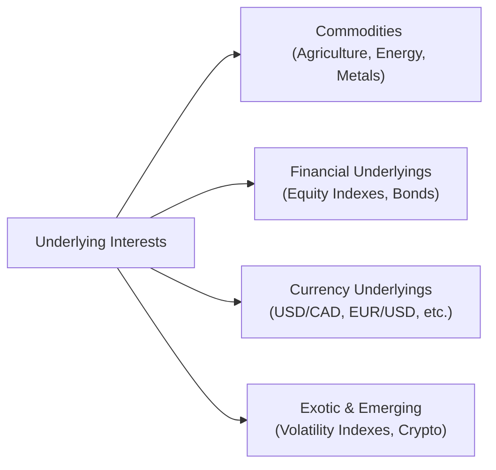
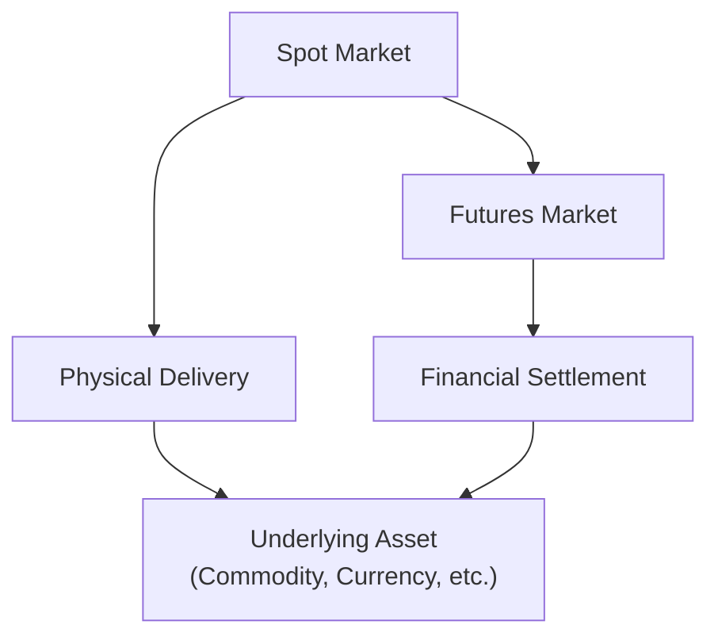

## 1.7 Types of Underlying Interests (Commodities, Financials)

So, you want to get a full grasp of what really underpins those nifty derivatives everyone’s talking about? This section is your go-to guide (with a dash of informality) on the different types of assets—commodities, financials, currencies, and beyond—that can serve as the foundation for a derivative contract. Maybe you’ve heard about gold futures on the evening news or you’ve read about using interest rate swaps to hedge your mortgage portfolio. Either way, understanding these underlying interests is vital. Let’s dig in and explore the wide world of commodities, financial assets, and other emerging fields in the underlying markets.

### Why Underlying Interests Matter

In derivatives, the "underlying interest" represents the asset on which the contract’s value is based. When market participants buy or sell derivatives, they’re essentially trading exposure to whatever that underlying is: maybe it’s oil, maybe it’s a stock index, maybe it’s a currency like USD/CAD. The movement of that underlying market sets the tone for gains or losses on the derivative position.

But the underlying can be so many different things. Think farmland products like wheat and soybeans, or intangible assets like interest rates. Understanding each type of underlying helps you figure out how best to hedge, speculate, or manage corporate exposures in the real world. Let’s walk through several common (and a few unusual) categories of underlyings.

```

```

Above is a simple schematic showing broad categories of underlying assets. Each of these categories branches into subcategories—there are countless ways the financial industry packages risk, but these represent some of the most fundamental building blocks.

---

### Commodity Underlyings

When someone says “commodity,” you might think: “Oh, that’s just gold or crude oil, right?” True, but the commodity space is huge and often subdivided into "hard" and "soft" commodities.

#### Hard vs. Soft Commodities

• Hard commodities are typically natural resources that are mined or extracted. We’re talking metals like gold, silver, copper, or energy products like crude oil and natural gas.  
• Soft commodities are typically agricultural goods: wheat, corn, soybeans, coffee, cocoa, sugar, livestock, and so on.

These categories matter because each commodity market has its own supply-and-demand quirks. For instance, a drought in a major wheat-producing region might send wheat futures soaring, whereas an oversight in an OPEC+ oil production deal might shift crude oil prices overnight.

Many commodity derivatives are traded on specialized exchanges. For example, in Canada, the Bourse de Montréal offers futures and options on certain commodities (though historically it’s been stronger in financial derivatives). On the global stage, you have major exchanges like the Intercontinental Exchange (ICE), the Chicago Mercantile Exchange (CME), and the London Metal Exchange (LME), each focusing on different sets of commodities.

#### Agricultural Commodities Example

Let’s say you’re a wheat farmer in Saskatchewan. You’ve painstakingly planted, watered, and monitored your crop. Now, you want some certainty that a sudden drop in market prices won’t ruin your entire season. This is where wheat futures on the ICE or CME can help. You can lock in a price on some or all of your expected production by going short on wheat futures. If prices drop by harvest time, your losses in the cash market are offset by gains on your futures position.

On the flip side, a bread manufacturer might go long on wheat futures to secure stable input costs for their chain of bakeries across Canada. If wheat prices skyrocket, that futures position helps offset the rising cost of flour.

#### Energy Commodities Example

Energy markets are famously volatile—just ask anyone who’s followed crude oil prices in the last decade. Even natural gas can see wild price swings, particularly in winter when heating demand spikes or supply constraints arise. Energy companies, transportation firms, and even airlines often use crude oil or jet fuel derivatives to stabilize costs.  
I remember a friend once telling me about how an airline locked in Jet A fuel prices at a certain level, only to watch prices drop in real life. They sort of kicked themselves that time—but the next year, when energy soared, they were patting each other on the back for being hedged. So it’s definitely a two-edged sword.

Energy derivatives also trade on ICE (for Brent Crude), CME (for WTI), and other global venues. Canada’s crude oil markets revolve heavily around Western Canadian Select (WCS) benchmarks, which also have derivative products to help producers hedge local price differentials.

---

### Financial Underlyings

Financial underlyings refer to intangible assets like equity indexes, single stocks, bonds, and interest rates. In Canada, the Bourse de Montréal lists numerous financial derivatives, including futures on the S&P/TSX 60 Index and Government of Canada bond futures. Let’s unpack these a bit.

#### Equity Indexes

An equity index (e.g., S&P/TSX 60, S&P 500, or the NASDAQ-100) is a basket of stocks that tracks the performance of a particular market segment. Derivatives on these indexes—like index futures or index options—are among the most widely traded in the world. Traders and institutional investors often use these for broad market exposure or hedging equity portfolios.

For example, if you manage a Canadian equity mutual fund heavily invested in large-cap stocks, you might short S&P/TSX 60 futures to hedge against a potential downturn. Conversely, speculators might go long on those same futures if they expect a bullish run in major Canadian stocks.

#### Single Stocks

Single-stock futures and options allow you to zero in on the price of a specific publicly-traded company. While used less frequently by large institutions for hedging (they often prefer basket hedges at the portfolio level), single-stock derivatives remain popular with active traders, market makers, and those seeking targeted coverage.

#### Bonds and Interest Rates

Bonds and interest rates are the foundation for a vast array of financial derivatives. From Government of Canada bond futures to interest rate swaps, these instruments let market participants lock in yields or manage interest rate exposures.

• Bond futures: Typically trade on standardized bonds, like the 10-year Government of Canada bond. If you expect interest rates to rise, you might go short on the bond futures because bond prices usually fall when rates go up.  
• Interest rate swaps: A company paying a floating rate on its debt might enter a plain vanilla interest rate swap to “swap” that floating rate for a fixed rate. That way, if rates spike, the company’s monthly interest payment remains predictable.

Canada is undergoing a shift away from the Canadian Dollar Offered Rate (CDOR) toward the Canadian Overnight Repo Rate Average (CORRA) as a major interest rate benchmark. This has big implications for the structure and pricing of interest rate derivatives—both in over-the-counter (OTC) markets and in exchange-traded products. If you want to read up on how CORRA works, check out resources at the Bank of Canada (https://www.bankofcanada.ca/core-functions/financial-system/corra/).

---

### Currency Underlyings

Currency underlyings often come in pairs: USD/CAD, EUR/USD, GBP/JPY, and so forth. By definition, a currency derivative references the exchange rate between two currencies. Many people and organizations want to lock in an exchange rate ahead of time. This might involve something as straightforward as a Canadian exporter nervous about changes in the USD/CAD rate, or a global corporation wanting to hedge monthly payroll denominated in Japanese yen.

#### Different Ways to Hedge FX

• A cocoa importer from Europe might purchase CAD/EUR forwards if they’re buying cocoa from a producer in the Ivory Coast but paying in another currency. (Yes, it can get complicated quickly!)  
• A Canadian pension fund investing in U.S. stocks might leave the currency exposure unhedged, hoping to gain from favorable moves in the USD/CAD pair, or hedge it using currency futures or forwards.

Foreign exchange derivatives can be traded on exchanges (like currency futures at the CME) or over the counter through currency swaps and forward agreements. The OTC market is extremely large, but exchange-listed FX derivatives provide transparency and potential cost efficiency.

---

### Exotic and Emerging Underlyings

Over the last couple of decades, new forms of underlyings have cropped up. We’re talking volatility indexes (like the VIX), crypto assets, ESG-based indexes, and new interest rate benchmarks. Let’s spotlight some of these interesting areas.

#### Volatility Indexes (VIX and Others)

Volatility indexes like the VIX measure the market’s expectation of near-term price fluctuations in an equity segment—commonly the S&P 500 for the VIX. Think of the VIX as a “fear index,” since high VIX readings often indicate market uncertainty or panic. Traders hedge or speculate on market volatility itself by using derivatives that track these volatility indexes.

Interestingly, the Bourse de Montréal offers a volatility index called the “VIXC” (related to the Canadian market), though it’s not as liquid or frequently referenced as the U.S. VIX. Nonetheless, these volatility derivatives have become popular with hedge funds and sophisticated traders who try to capitalize on changes in implied volatility.

#### Crypto Assets

While still somewhat limited and mostly found in unregulated or lightly regulated segments, crypto derivatives are growing rapidly. Exchanges like CME now list bitcoin and ether futures, and certain Canadian jurisdictions have begun approving crypto-based ETFs that can include derivative overlays. It’s an emerging space, loaded with regulatory complexities. CIRO continues to watch crypto derivatives carefully due to their heightened risk and investor protection issues.

#### ESG-Based Indexes

ESG—Environmental, Social, and Governance—has taken center stage in many investing strategies. As ESG indexes have launched (e.g., the MSCI ESG Leaders indexes), the derivatives world has followed suit with futures or options on those indexes. Many institutional investors want a “green tilt” or to hedge exposure to certain carbon-heavy sectors. It’s all about aligning financial returns with social responsibility.  
That said, not all ESG indexes are created equal. Different providers weigh environmental, social, and governance factors differently, so if you’re considering derivatives on these indexes, read the fine print—actually, read it twice.

#### Bespoke Interest Rate Benchmarks

We already touched on CORRA replacing CDOR in Canada. Globally, the big shift has been from LIBOR to SONIA (U.K.), SOFR (U.S.), and other new benchmarks. Because these new rates are calculated differently from the old LIBOR, the derivatives referencing them can behave in subtle (and not-so-subtle) ways that differ from older interest rate derivatives. The new benchmarks are generally considered more robust and less prone to manipulation, but it’s still a learning curve for the entire market.

---

### A Quick Glossary in Context

Below are a few key terms to keep at hand. Some of these you might already know, but it never hurts to reaffirm:

• Spot Price: The current trading price of a particular asset, like a barrel of oil or an ounce of gold, for immediate delivery. For derivatives, the spot price is often the reference point for determining the derivative’s fair value.  
• Benchmark Index: A standard measure, such as the S&P/TSX 60 in Canada, used to track or compare performance. Could also be a commodity index like the Bloomberg Commodity Index.  
• Hard Commodity: Natural resources typically mined or extracted (oil, metals).  
• Soft Commodity: Crops or livestock (wheat, corn, coffee).  
• Interest Rate Benchmark: A reference interest rate like CORRA or SOFR.  
• FX Pair: A quote of two currencies, illustrating how much one is worth in terms of the other (e.g., USD/CAD).  
• Volatility Index (VIX): A measure of the market’s expectation of near-term volatility in an index (often the S&P 500).  
• ESG Index: An index tracking companies based on their Environmental, Social, and Governance performance.

---

### Regulatory and Institutional References

From the perspective of Canadian participants:  
• The Canadian Investment Regulatory Organization (CIRO) oversees investment dealers and emerging derivative products. Remember that “IIROC” and “MFDA” are only historical references now.   
• The Bourse de Montréal (https://www.m-x.ca/) remains Canada’s main derivatives exchange, listing futures and options on both commodities and financial underlyings (though with a stronger emphasis on the latter).  
• The Intercontinental Exchange (ICE) (https://www.theice.com/) is a global powerhouse for energy and soft commodity markets.  
• If you want fresh data or advanced analytics, exploring the Bloomberg Commodity Index or Thomson Reuters/CoreCommodity CRB Index can be an excellent way to track broad commodity movements.  
• The Bank of Canada provides resources on the CORRA interest rate (https://www.bankofcanada.ca/core-functions/financial-system/corra/), including how it’s calculated and updated.  

```

```
In this simple flowchart, we see how the spot market and futures market connect to the actual underlying asset. Depending on the commodity, traders can opt for physical delivery or cash settlement.

---

### Practical Examples and Case Studies

• Hedging Corn Prices: A food manufacturing company in Montréal that uses corn syrup in various products might buy corn futures to secure stable input prices, especially during the high production season.  
• Bond Duration Hedging: A Canadian pension fund might shorten its portfolio duration via short positions in 10-year Government of Canada bond futures if it’s concerned about rising interest rates.  
• Currency Overlay: A Toronto-based importer of French wines could short EUR/CAD futures (or forward contracts) to lock in favorable exchange rates for upcoming shipments.  
• Volatility Play: A hedge fund that believes markets will remain calm despite an upcoming election might sell VIX futures, hoping the index will stay low and they can profit from time decay in those futures.  
• Crypto Curiosity: A retail investor might dabble in bitcoin futures on the CME to get exposure to crypto without holding actual coins, mindful of the new margin and regulatory considerations that come with such a product.

---

### Best Practices, Pitfalls, and Strategies

• Understand Correlations: If you’re hedging a portfolio of stocks, an equity index future that underrepresents your portfolio’s sector exposures might leave you under-hedged or over-hedged.  
• Keep an Eye on Liquidity: Some commodity contracts—like wheat, corn, or oil—are highly liquid, making them easier to trade. Others, such as certain exotic metals or micro-currencies, can be thinly traded.  
• Watch Storage Costs and Seasonality: For agricultural commodities, storage costs and seasonal patterns can drastically affect forward prices. Energy markets also exhibit seasonal patterns, especially in natural gas.  
• Regulatory Requirements: CIRO has margin requirements, trade reporting obligations, and best execution guidelines to protect investors. If you’re new to these products, confirm that your broker is authorized and that you’ve complied with all relevant KYC (Know Your Client) processes.  
• Volatility Hedges: If you’re trading VIX or other volatility-based products, remember that they respond to implied volatility, not just the underlying price movements. This can catch newbies off guard.  
• Mind the Shift to New Benchmarks: With Canada moving from CDOR to CORRA—and globally from LIBOR to SOFR—existing swap books and forward rate agreements need to be updated. Mismatches might result in basis risk if not handled carefully.

---

### Additional Resources

Below is a curated list of resources if you want to dive deeper:

• Bourse de Montréal: https://www.m-x.ca/  
• Intercontinental Exchange (ICE): https://www.theice.com/  
• CME Group: https://www.cmegroup.com/  
• Bank of Canada on CORRA: https://www.bankofcanada.ca/core-functions/financial-system/corra/  
• Bloomberg Commodity Index: https://www.bloomberg.com/quote/BCOM:IND  
• Thomson Reuters/CoreCommodity CRB Index: https://www.thomsonreuters.com/ (search for CRB Index)  
• CIRO (for the latest regulatory updates): https://www.ciro.ca  

---

### Final Thoughts

Anyway, if anything, this discussion is simply to underscore that the derivatives world is massive. The underlying asset you choose to trade on can be as everyday as a bushel of corn or as cutting-edge as a volatility index on crypto markets. Once you master the nuances of these underlying markets, you’ll be way better equipped to manage risk or pursue alpha.

I recall a colleague who once hedged her entire coffee chain business using coffee futures. She told me that her biggest relief was not having to worry constantly about her input costs. If coffee prices skyrocketed, she still had her futures in place to offset the difference. In times of surplus, well, she might lose on the hedge but still benefit from cheaper coffee beans in real life. That’s derivatives in action: they’re all about shifting (or accepting) risk, depending on your viewpoint.

Keep exploring, keep asking questions, and keep an eye out for the next big shift in underlying interests—because markets are nothing if not creative.

---

## Sample Exam Questions: Exploring Commodity and Financial Underlyings



### Which of the following is considered a “hard” commodity?

- [ ] Wheat
- [ ] Corn
- [ ] Coffee
- [x] Gold

> **Explanation:** Hard commodities are typically mined or extracted (e.g., metals like gold). Wheat, corn, and coffee are agricultural (or “soft”) commodities.

### A Canadian farmer concerned about decreasing wheat prices can reduce risk by:

- [x] Going short wheat futures
- [ ] Going long wheat futures
- [ ] Buying a VIX option
- [ ] Using short call options on EUR/USD

> **Explanation:** Going short wheat futures locks in a selling price. If the spot wheat price falls, gains on the short futures position help offset the lower cash sales.

### A pension fund expecting rising Canadian interest rates might:

- [x] Short Canadian government bond futures
- [ ] Go long a soft commodity index
- [ ] Buy single-stock futures
- [ ] Short the S&P/TSX 60 index

> **Explanation:** When interest rates rise, government bond prices usually fall. By shorting bond futures, the pension fund aims to profit (or offset losses on existing bond positions) from the anticipated price drop.

### When a Canadian-based importer of European goods uses EUR/CAD forwards to control future costs, they are:

- [x] Hedging their currency exposure
- [ ] Speculating on the price of EUR calls
- [ ] Buying gold to hedge inflation
- [ ] Shorting a bond index

> **Explanation:** By entering forward contracts on EUR/CAD, the importer locks in a rate, mitigating currency risk related to future transactions.

### A volatility index like the VIX measures:

- [ ] The expansion of gold mining
- [x] The market’s expectation of near-term price fluctuations
- [ ] The correlation between CAD and USD
- [ ] Only realized volatility over the last year

> **Explanation:** The VIX (and other volatility indexes) gauge the implied volatility in near-term options, indicating how much the market thinks prices will move.

### If a company with floating-rate debt enters a swap to pay fixed and receive floating, the company is:

- [x] Converting its floating-rate obligation into a fixed-rate payment
- [ ] Speculating on currency movements
- [ ] Buying a put on its own debt
- [ ] Selling a call on gold

> **Explanation:** By paying a fixed rate and receiving a floating rate, the company effectively “locks in” a fixed interest cost, hedging against rises in the floating rate.

### Which of the following statements about hard and soft commodities is correct?

- [x] Soft commodities typically include agricultural products like corn or coffee
- [ ] Hard commodities include farmland
- [x] Hard commodities often include metals and energy resources
- [ ] Soft commodities are never traded on regulated exchanges

> **Explanation:** Soft commodities are agricultural in nature, while hard commodities are typically mined or extracted. Both can be traded on regulated exchanges.

### An ESG index derivative could help an investor:

- [x] Gain exposure to companies with strong environmental, social, and governance ratings
- [ ] Speculate on rising oil prices
- [ ] Hedge their farmland production
- [ ] Predict interest rate moves

> **Explanation:** ESG index derivatives focus on a basket of companies selected for their environmental, social, and governance profiles.

### If a derivatives trader believes the USD/CAD rate will rise significantly, they might profit by:

- [x] Buying USD/CAD futures
- [ ] Selling USD/CAD futures
- [ ] Buying short-term bond futures
- [ ] Shorting a corn futures contract

> **Explanation:** Buying USD/CAD futures profits if the U.S. dollar appreciates against the Canadian dollar, which means the futures price on USD/CAD would likely rise.

### A “fear index” in the market often refers to:

- [x] The VIX
- [ ] The CRB Index
- [ ] CORRA
- [ ] EUR/USD

> **Explanation:** The VIX is commonly called the “fear index,” reflecting market anxieties about impending volatility.


