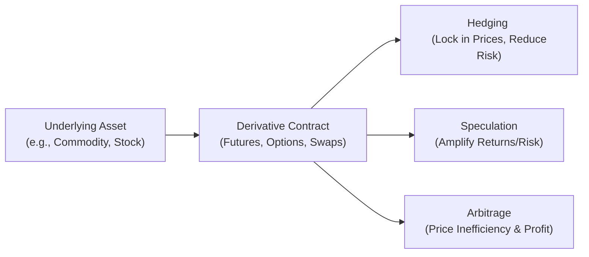

## 1.8 Why Are Derivatives Useful?

So, you might be thinking: "Why all this fuss about derivatives? Why do traders, corporations, and investors get so excited when they talk about futures and options?" Well, I have a confession: when I was new to finance, I used to wonder the same thing. I’d see the flurry of trades on my screen—futures contracts flying by, options on wheat, currencies, energy, and even something called a swap on interest rates—and I’d think, “Um, okay, but why?” Over time, I realized that derivatives are not just fancy “risk tools.” They are basically the Swiss Army knife of finance. They can hedge risk, provide access to speculation, enhance market liquidity, aid price discovery, and help in all sorts of complex transactions. Let’s unravel these layers step by step, exploring the key reasons why derivatives have become indispensable.

---

### The Essence of Derivatives

At their core, derivatives are financial instruments whose value depends on an underlying asset or interest—like a stock index, a commodity, an exchange rate, or an interest rate. You might see them as side bets on the future direction of prices or rates, but it’s wise to remember that they’re not just for speculation. They can be wonderfully useful for risk management, strategic positioning, and even bridging gaps between markets. Whether you’re a coffee shop chain trying to lock in the cost of next year’s beans or a pension fund trying to immunize its portfolio against interest rate changes, derivatives can be your secret weapon.

**Canadian Context and CIRO Oversight**  
In Canada, the Canadian Investment Regulatory Organization (CIRO) is responsible for overseeing investment dealers and ensuring the integrity of the marketplace. After the amalgamation of IIROC and the MFDA on January 1, 2023, CIRO took over the role of regulating both equity and debt markets, along with mutual fund and investment dealers. If you’re using derivatives for hedging in Canada, or for speculation, you better believe that CIRO has guidelines on margin, disclosures, risk disclosure statements, and so on. The details might seem daunting, but guess what—they exist to protect you and to keep markets stable.

---

### Hedging as a Protective Measure

One of the biggest reasons large companies and financial institutions embrace derivatives is hedging. Think of hedging as buying an umbrella because you suspect it might rain. If it rains, you’re protected. If it doesn’t, sure, you spent some money, but at least you had peace of mind. In financial terms, hedging is about offsetting unwanted risk from fluctuations in things like commodity prices, currency exchange rates, and interest rates.

• A Canadian coffee importer: Perhaps I used to take my morning coffee for granted. But I once chatted with a friend who works for a major coffee importer. She explained how they use coffee futures on the Intercontinental Exchange (ICE) to lock in prices for the beans. If coffee prices skyrocket, their futures contracts protect them; if prices plummet, they may miss out on cheaper beans, but they’re not exposed to the horror of uncertain spikes.  
• A wheat farmer: Similarly, a farmer might use wheat futures on the Chicago Board of Trade (CBOT)—or in Canada, canola futures on the Bourse de Montréal—to lock in a favorable sale price for upcoming harvests. That’s “Locking in a Price,” a term in our mini glossary.  

In both examples, these participants are using forward-based or futures-based derivatives to “hedge” their exposure. They are not necessarily aiming to profit from price movements; they just want to manage risk. That’s it. By using derivatives, they can focus on their core business—farming or roasting beans—rather than losing sleep over volatile commodity markets.

**Hedge Ratios**  
You might hear about the “hedge ratio,” which is basically the proportion of the underlying exposure that you’re covering with derivatives. If you produce 1,000 barrels of oil, for instance, and you hedge 750 barrels using futures, your hedge ratio is 75%. In the real world, this can get more nuanced; you might use something called “beta” adjustments for equity indexes or “duration” adjustments for interest rates. But the gist is the same: match the size and sensitivity of your underlying exposure with an appropriate derivative position.

---

### Speculation for Enhanced Returns

Yes, speculation can be a dirty word in some circles, but it’s actually a vital function of the market. When you speculate with derivatives, you’re basically taking a position that profits if you’re correct about a future price move, and loses if you’re wrong. Whether that position is a call option on gold or a futures contract on the S&P/TSX 60 Index, speculation amplifies returns (and, well, amplifies risks).

• **Example**: A speculator believes that the Canadian dollar (CAD) will appreciate against the U.S. dollar (USD). They might buy Canadian dollar futures on the Bourse de Montréal (or an equivalent currency futures market). If CAD strengthens, the speculator profits from the upward move. If it weakens, they incur losses.  

Speculation also provides liquidity to the market because speculators, by entering derivatives contracts, take on the other side of hedgers’ trades. Without speculators, it might be a lot harder for a farmer to find a buyer for that canola futures contract or for a coffee importer to offset their cost risk.  

**Leverage Ratio**  
One reason speculation with derivatives is so attractive is leverage. You generally post a margin (a fraction of the contract’s notional value) rather than the full notional exposure. So you might control a $100,000 notional futures position by posting, say, $10,000. That’s a 10:1 leverage ratio. Returns—and losses—are magnified. In a sense, that’s part of the excitement and the danger.

---

### Arbitrage: Exploiting Price Inefficiencies

Another fascinating role of derivatives is in arbitrage—basically, capturing price discrepancies across different markets or instruments. An **arbitrageur** might spot that the price of a commodity futures contract is slightly misaligned relative to the commodity’s spot price, factoring in storage costs, interest rates, and so forth.

**Basis Trading**  
“Basis trading” is a type of arbitrage that involves taking offsetting positions in the spot market and futures or forward market. For example, imagine a wheat exporter noticing that the futures price for wheat is higher than it theoretically should be compared to the spot price. The exporter can buy spot wheat at the lower price, immediately sell a futures contract at the higher price, and lock in a risk-free (or near risk-free) profit. While pure arbitrage opportunities can be rare and might last mere seconds, the presence of capital prepared to execute these trades increases market efficiency.  

**Market Efficiency**  
All these tiny arbitrages happening around the clock mean that derivatives markets tend to keep the prices of the underlying assets in line with real-world fundamentals. The notion that prices reflect all available information—known as market efficiency—gets a boost from these activities. After all, if a price goes out of line, an arbitrageur is there to snap it back into place, generating a tidy profit in the process.

---

### Liquidity Enhancement

Have you ever wondered why some stock or commodity might not be traded as heavily in the cash market, yet its futures contract sees tons of volume? Indeed, derivatives often bolster liquidity because:

• They attract a broader range of participants (hedgers, speculators, arbitrageurs).  
• The products can be easier or cheaper to trade than the underlying, especially if the underlying is expensive or less liquid (think big corporate bonds or certain commodities).  
• A “delta one” future contract might track the underlying price so closely that participants prefer the future for quick positions or short-term bets.  

**Cash vs. Derivatives Markets**  
In some cases, the derivatives market is so liquid and popular that it practically leads the price discovery process. For Commodity X, you might see the futures price respond faster to new data than the spot price. This synergy often benefits everyone because it compresses bid-ask spreads, reduces transaction costs, and can create a virtuous cycle of more participation.

---

### Price Discovery

Speaking of price discovery, one of the main benefits of having an active derivatives market is that it helps reveal the market’s consensus. It's a bit like an opinion poll—lots of independent actors placing trades based on their expectations of future supply, demand, and economic conditions. As these buy and sell orders come in, the futures price or option premium becomes a live barometer of market sentiment.

**Interest Rate Futures as an Example**  
An example close to home is the use of interest rate futures to gauge the market’s forecast for the Bank of Canada’s policy rate decisions. Traders around the world trade Canadian interest rate futures, factoring in everything from inflation data and GDP reports to global risk sentiment. Thus, the prices quoted on these futures can give real-time insight into where rates might land in a few months. Even the Bank of Canada, in its Financial System Review, sometimes notes the signals gleaned from interest rate markets to gauge market expectations.

---

### Customization in OTC Markets

While exchange-traded contracts (like standardized futures and options) get a lot of press, there’s a whole universe of over-the-counter (OTC) derivatives. These can be tailored (customized) to the specific needs of the participants. Think about an energy company that needs a very specific hedge with a unique settlement date, or a pension fund that wants to precisely hedge the duration of a specialized basket of bonds. They can use an OTC swap or forward tailored to their exact risk profile.

• **Interest Rate Swaps**: Typically arranged with a bank or swap dealer, an interest rate swap can turn a floating rate liability into a fixed rate or vice versa.  
• **Currency Swaps**: Might help a corporation with cross-border operations manage foreign exchange exposures more effectively by exchanging principal and interest payments in one currency for principal and interest in another.  

These OTC instruments offer a level of precision that exchange-traded instruments sometimes can’t. Of course, with freedom comes responsibility: the credit risk can be higher since there’s no central clearinghouse guaranteeing the contract (unless it’s a “cleared” swap). This is why regulators, including the Canadian Securities Administrators (CSA), have guidelines on OTC derivatives reporting, clearing thresholds, and documentation standards via International Swaps and Derivatives Association (ISDA) Master Agreements.

---

### Real-World Examples and Case Studies

Let’s ground these ideas with some quick stories:

**Case Study: An Oil Refinery Hedge**  
A Canadian oil refinery might face wide swings in the cost of crude oil. So they buy futures (or enter into forward contracts) to lock in the input cost of oil for the next six months. That’s hedging. If crude prices rise, the refinery gains on its futures position, offsetting the higher cost of acquiring the physical crude.

**Case Study: A Pension Fund’s Liability Matching**  
Pension funds often have to pay out fixed amounts in retirement benefits, so they might worry about falling bond yields or rising inflation. By entering into long-term interest rate swaps—where they receive a fixed rate and pay a floating rate—they can match the timing and amount of future liabilities more closely. This is customization at work.

**Case Study: Event-Driven Speculation**  
Speculators sometimes bet on company mergers or central bank policy decisions. For example, if a speculator strongly believes that a central bank will cut interest rates, they might buy interest rate futures, expecting to sell them at a profit if the rate cut indeed occurs (since bond prices often move inversely to interest rates).

---

### A Visual Overview

Below is a simplified mermaid diagram that illustrates a basic relationship between an underlying asset, a derivative contract, and its uses (hedging, speculation, arbitrage).

In reality, derivatives can do all of these things simultaneously. An oil futures contract doesn’t care whether you’re hedging or speculating; it’s the same contract. It’s just that different participants have different motives.

---

### Regulatory Landscape in Canada

**CIRO, CSA, and Others**  
In Canada, the Canadian Investment Regulatory Organization (CIRO) is the main self-regulatory organization you’ll run into. For broader oversight on how derivatives fit into capital markets, you’ll look at the Canadian Securities Administrators (CSA), which coordinates policy across provincial regulators like the Ontario Securities Commission (OSC) and the Autorité des marchés financiers (AMF) in Québec. They issue notices and rules on everything from margin requirements to position limits.

**Clearing and the Role of CDCC**  
The Canadian Derivatives Clearing Corporation (CDCC) clears derivatives traded on the Bourse de Montréal. This clearing function means the CDCC acts as the central counterparty, reducing credit risk between counterparties. For many exchange-traded contracts, that’s how participants can rest assured that if the other side defaults, the clearinghouse has their back.

**Investor Protection**  
It’s worth noting that the Canadian Investor Protection Fund (CIPF) covers client assets if a member firm of CIRO becomes insolvent. This is crucial for retail investors who are growing increasingly active in derivatives markets—often facilitated by lower commissions and robust educational platforms.

---

### Best Practices, Pitfalls, and Strategies

**Best Practices**  
• Establish a clear objective: Are you hedging, speculating, or arbitraging?  
• Conduct stress tests: Derivatives can bite back if you don’t measure the downside risk.  
• Familiarize yourself with margin requirements: Leverage is a double-edged sword.  
• Keep track of the regulatory updates (visit https://www.ciro.ca for the latest).  

**Common Pitfalls**  
• Overleveraging: Getting too large a position can lead to margin calls and forced liquidations.  
• Misunderstanding basis risk: Even if you hedge with a derivative tied to a similar but not identical underlying, you might face imperfect correlation.  
• Neglecting credit risk in OTC trades: Know who your counterparty is and consider collateral or clearing solutions.  

**Practical Tools**  
• **Bloomberg Terminal** or **Refinitiv Eikon**: Real-time data, analytics, and charting for derivatives.  
• **Open-Source Python Libraries** (e.g., `Pandas`, `NumPy`): Great for performing your own scenario analyses.  
• **CSA Resources**: Check the Canadian Securities Administrators website (https://www.securities-administrators.ca/) for notices that could impact your compliance or product usage.

---

### Concluding Reflections

So, are derivatives just complicated bets? Not at all. They’re basically multipurpose tools that can help you manage or even exploit risk. They enhance liquidity, improve price discovery, and open up opportunities for both institutional and retail players. Whether you’re a corporate treasurer hedging foreign exchange exposure, a day-trader speculating on an interest rate announcement, or an arbitrageur scanning the markets for small mispricings, derivatives can be incredibly valuable.  

And that’s the magic of derivatives. They occupy a central place in modern finance, bridging the gap between different markets and helping participants tailor exposure. In fact, the next time you hear folks loudly debating the ethics of derivatives or marveling at how big the derivatives market has become, you can smile, knowing they are indeed the cutting edge where risk management, speculation, and arbitrage converge.

If you’re hungry for more, dig into the Bank of Canada’s Financial System Review, which often highlights the role of derivatives in Canadian markets. Browse the CSA’s official notices on derivatives usage. And hold on tight—this is just the start of your journey in understanding how powerful these instruments can be, and how some of the smartest people in finance harness them every single day.

---

## Sample Exam Questions: Why Are Derivatives Useful?



### Which of the following is the BEST description of hedging with derivatives?

- [ ] Using derivatives exclusively for high-risk speculation.
- [ ] Avoiding all types of risk and eliminating market exposure.
- [x] Offsetting specific market risks by taking an opposite position in a related derivative.
- [ ] Exploiting price discrepancies to profit from arbitrage.

> **Explanation:** Hedging is about reducing unwanted risk exposure. It involves taking an offsetting position in a derivative or related instrument so that losses in the underlying are mitigated.

### Investors often use derivatives to speculate because:

- [ ] Derivatives have zero risk.
- [x] They can gain exposure with relatively small amounts of capital (leverage) and potentially amplify returns.
- [ ] Speculative derivatives trades cannot result in losses.
- [ ] They guarantee profits in all market conditions.

> **Explanation:** Speculators often seek leverage and potentially high returns. That said, higher returns come with higher risks, including the possibility of substantial losses.

### Arbitrage in derivatives markets generally involves:

- [x] Exploiting price inefficiencies between related markets or instruments for potential profit.
- [ ] Speculating on short-term news events that may or may not occur.
- [ ] Hedging an existing exposure in the underlying market.
- [ ] Manipulating prices in multiple markets simultaneously.

> **Explanation:** Arbitrageurs seek out riskless (or near-riskless) profit by capitalizing on short-term mispricing of related instruments.

### Which statement best captures the role of price discovery in futures and options markets?

- [x] Derivatives markets aggregate information from various market participants, producing transparent price signals.
- [ ] Only the underlying asset determines its own price, and derivatives merely copy it.
- [ ] Price discovery involves ignoring supply and demand factors.
- [ ] Futures and options markets have no impact on how the underlying is priced.

> **Explanation:** An active derivatives market pools diverse views from hedgers, speculators, and arbitrageurs. This helps generate up-to-date pricing that often influences the underlying asset’s spot price.

### Liquidity in derivative markets is enhanced by all of the following EXCEPT:

- [ ] Participation from speculators.
- [ ] Standardization of exchange-traded contracts.
- [ ] Availability of central clearing, reducing credit risk.
- [x] Restricting market access solely to hedgers.

> **Explanation:** Liquidity typically increases when a variety of participants can trade. Restricting access only to hedgers would limit the pool of participants, reducing liquidity.

### When a corporation uses an interest rate swap to switch from a floating rate to a fixed rate, this is an example of:

- [ ] Speculation by gambling on interest rate movements.
- [ ] Arbitrage by locking in the spot price of a bond.
- [x] Hedging to achieve certainty over future interest payments.
- [ ] Market manipulation.

> **Explanation:** By entering a swap, the corporation is removing the uncertainty of floating rates and gaining a predictable fixed rate. That’s hedging in action.

### The hedge ratio refers to:

- [ ] The difference between the spot and futures prices.
- [ ] The total margin posted for a derivative transaction.
- [x] The proportion of one’s underlying risk covered by a derivatives position.
- [ ] The maximum potential profit from a hedged trade.

> **Explanation:** The hedge ratio measures how much of your underlying exposure is offset by your derivative position.

### One key difference between exchange-traded options and OTC options is:

- [x] Exchange-traded options are standardized and cleared through a clearinghouse, whereas OTC options can be tailored and subject to counterparty credit risk.
- [ ] There is no difference in terms of standardization or credit risk.
- [ ] OTC options have no counterparty credit risk, while exchange-traded options do.
- [ ] OTC options must be traded through a central limit order book.

> **Explanation:** Exchange-traded products are standardized in terms of contract size and settlement. OTC options can be customized but often require credit risk management via credit support annexes or collateral.

### Basis trading is a strategy that:

- [x] Seeks to profit from the difference between a futures (or forward) price and the underlying spot price.
- [ ] Involves taking a naked option position with no offsetting hedge.
- [ ] Relies on central bank announcements only.
- [ ] Focuses purely on volatility-based trades.

> **Explanation:** Basis trading specifically exploits the gap between spot and futures prices. If the basis deviates from what’s theoretically fair, a trader could lock in a near risk-free profit.

### True or False: Using derivatives always guarantees profit, since one can hedge away all market risk.

- [ ] True
- [x] False

> **Explanation:** Although derivatives provide tools for managing or transferring risk, they cannot eliminate all forms of risk. Margin calls, basis risk, or unexpected market behavior can still lead to losses.


