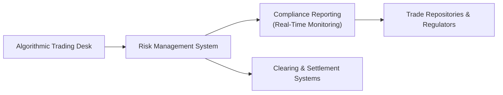

## 1.9 Operational Considerations

If there’s one thing I’ve learned after watching traders—both novices and pros—scramble to fix an error right before a looming derivatives expiry date, it’s that operational details can make or break you. Sure, you can have a genius strategy, a bright forecast, and a robust risk model. But if you can’t properly confirm or settle a trade, or if your margin call triggers a frantic 24-hour meltdown, you could lose more than your shirt. Let’s chat about these operational issues. We’ll dig into everything from the basic flows of trade processing through to the big-picture technology upgrades that keep us safe when markets get rowdy.

Before we get rolling, a small confession: I once forgot to double-check a trade confirmation on a simple commodity forward. The small mismatch between the agreed-upon price and the recorded price caused days of back-and-forth. It wasn’t fun, but boy did I learn the importance of “operational discipline.” Let’s explore how to avoid that type of fiasco.

Operational considerations revolve around the nitty-gritty details that keep the entire derivatives ecosystem running smoothly. Whether you’re dealing with exchange-listed futures, options, or more customized over-the-counter (OTC) swaps, these are the key issues that demand your attention. 

## Trade Processing

The first stop on our adventure is trade processing. This is where a trade is executed, captured, confirmed, cleared, and ultimately settled. It’s a good idea to think of trade processing as a well-choreographed dance: each step is precise, and if one dancer stumbles, the whole show can be ruined. Let’s break it down briefly.

Trade capture is basically the “record-keeping” stage. Once you strike a deal with a counterparty or place an order on an exchange, you need to log essential details: quantity, price, expiry, underlying, instructions on settlement, and so forth. In old-school floors, someone might scribble a note with a stubby pencil, but nowadays everything is digital. Real-time trade capture is crucial—especially if you want to track your positions and risk on the fly.

Confirmation is a final mutual agreement between you and your counterparty about the key details of the trade. You might have heard horror stories where two parties believe they’ve done the same trade but at different prices or volumes. Confirmation ensures you both see eye to eye on what was agreed—no more, no less. Mismatches in confirmations are not exactly “fun,” so be sure to confirm quickly and thoroughly. In the realm of exchange-traded products, the clearing corporation usually handles much of the post-trade confirmation. In an OTC setup, the parties themselves (or their platforms) shoulder that responsibility.

Clearing is the step where a clearinghouse (like the Canadian Derivatives Clearing Corporation (CDCC) in Canada) steps in to guarantee the trade. This process transforms the bilateral relationship between buyer and seller into two separate relationships (with the clearinghouse in the middle). It drastically reduces counterparty risk—important stuff if you want to sleep at night.

Finally, settlement is all about the actual exchange of the underlying asset or cash. It might be daily (like in futures) or at expiry (like in some forward contracts). Straight-through processing (STP) is often championed by regulators and market participants alike to reduce errors or delays. With STP, data flows smoothly from one system to another without manual intervention, decreasing the chance that a single “typo” or missed keystroke will derail everything.

By the way—if you want an in-depth exploration of the clearing and settlement side, check out the CPSS-IOSCO “Principles for Financial Market Infrastructures.” They lay out international standards for smooth settlement and risk management.

## Infrastructure

Now let’s pivot to infrastructure. A stable and secure operational infrastructure is the beating heart of any high-functioning derivatives operation. This includes your technology stack (hardware, software, data networks, APIs), but also your organizational processes, governance frameworks, and the good old “back office.”

Back-office functions tend to get overshadowed by more glamorous “front office” trading. However, the folks in the back office play a pivotal role in making sure all trades are recorded properly, matched, and processed. Without them, even small hiccups can become big operational catastrophes.

One key aspect is real-time monitoring of positions and exposures. Especially in a world of algorithmic and high-frequency trading, you want to see your position changes in real time so you can manage and hedge risk. This might mean advanced trade management systems that can integrate with major derivatives exchanges or OTC trade repositories. If your firm is small or just starting out, you might rely on simpler solutions or open-source financial platforms. But at some point, scaling up means investing in robust commercial systems.

Cybersecurity is also huge. Let’s be honest—there’s just no room for lax security. Ci is not the place to be taking shortcuts. A single data breach can expose sensitive positions or beneficial ownership details, not to mention the potential for catastrophic financial loss. So everything from encryption to multi-factor authentication is critical. On top of that, regulators like CIRO (the Canadian Investment Regulatory Organization) will expect you to have top-notch data protection protocols.

## Margin and Collateral Management

Margin calls are something you never want to ignore—like a smoke alarm in your house. It might be annoying, but ignore it at your own peril. Margin and collateral management revolve around ensuring that you and your counterparty each have enough skin in the game. Exchanges, clearinghouses, and even bilateral agreements tend to outline margin requirements, which you must meet daily (or intraday if volatility is nuts).

A typical process is marking-to-market, where your positions get repriced at the current market value. If your positions are losing money, you might face a margin call demanding that you post extra collateral. If your positions are gaining in value, you might get some margin relief. Collateral can be cash or securities, although some counterparties also accept letters of credit, precious metals, or other forms of collateral—each with a “haircut” to account for potential volatility in the collateral’s value.

Why do haircuts matter? Let’s say you post $1 million in corporate bonds as collateral. Your clearinghouse might apply a 10% haircut and treat it as only $900,000 in collateral, just in case those bonds lose value. As a result, you might need to post more to meet the shortfall. It’s all about controlling credit risk.

Many participants use specialized software or risk engines to manage intraday margin exposures. Larger institutions might invest heavily in real-time margin analytics that tie directly into the trading desk. Smaller operations might rely on their clearing firm or outsource margin calculations. However you do it, stay on top of your margin. Think of it like fueling up your car before a road trip—running on fumes is dangerous, especially if the markets decide to “take a wild turn.”

## Regulatory Compliance

Compliance might sound like a drag, but it’s absolutely essential to the smooth functioning of derivatives markets. In Canada, CIRO (established after the MFDA and IIROC merged into a single self-regulatory body) requires that all derivatives transactions—both exchange-traded and certain OTC products—be reported accurately and on time. The same goes for the Canadian Securities Administrators (CSA), which maintain the overarching regulatory framework.

Most trades must be reported to authorized trade repositories. These are centralized registries that capture critical data on notional amount, maturity, underlying references, and so forth. Done right, this data helps regulators keep tabs on systemic risks (like a bubble in certain credit derivatives or a build-up of currency positions in emerging markets). Done poorly—like if you consistently delay reporting or mis-report the trade details—and you risk hefty fines and scrapes with regulatory bodies.

It’s not just about the data, though. There are rules on record-keeping, policies, and procedures that demonstrate you’re not a rogue operator. You might have to show an audit trail of trades, confirm that your staff is licensed, and prove that you’ve got adequate capital buffers to handle unexpected losses. And if you’re dealing with OTC derivatives, you’ll likely need to sign a robust contract with your counterparties. Over the years, the International Swaps and Derivatives Association (ISDA) Master Agreement has become the gold standard for OTC derivatives documentation, including clauses on collateral, events of default, and termination conditions.

For official guidelines, check out the “Reporting FAQs” on the CIRO website (https://www.ciro.ca/) and the ISDA “Collateral Management Transformation Toolkit” (https://www.isda.org/). Those resources are jam-packed with insights on how to handle compliance, from trade reporting to clearing requirements.

## Technology Upgrades

Algorithmic trading, electronic exchanges, and direct market access have revolutionized the derivatives world. And with that, there’s been a parallel need for better risk controls and robust technology systems. It’s not enough to just code up a quick algo, cross your fingers, and hope it works. You need pre-trade risk checks, volume controls, kill switches that can quickly cut off an algorithm if it starts misbehaving, and real-time compliance monitoring.

If you’re building an in-house trading platform, be prepared for ongoing upgrades, patch management, and occasional hardware refreshes. Sluggish or outdated systems can hamper your ability to capture trades quickly or to meet regulatory reporting in near real-time. Also, the complexities with algo trading have led regulators to become more stringent with oversight. They might require a full track record of every change to your code, a demonstration of your testing environment, or a plan for dealing with “runaway algos.”

Let’s illustrate these relationships in a simple diagram that outlines how technology interacts with the major stakeholders:

In this picture, the trading desk runs the algos (A), which feed the risk management system (B). The system monitors real-time positions (B -> C), and also sends relevant data to regulators (D). Simultaneously, the clearing and settlement processes (E) rely on that same risk data. All these pieces must talk to each other without glitching out. 

When you have well-integrated technology, you can see instantly if your margin usage is skyrocketing, or if your compliance flags a mismatch in trade volume. That’s super useful because you’d rather catch a discrepancy in the blink of an eye (on your screen) than discover it the next day when trade confirmations have already been issued.

## Best Practices and Pitfalls

It’s always good to talk about best practices and also shine a light on common mistakes. Here are a few that spring to mind:

• Double-check your confirmations. Any mismatch here leads to a chaotic scramble later.  
• Keep your margin and collateral processes tight. Surprises in margin calls can devastate your liquidity.  
• Invest in staff training. Operational risk often arises from human error, not just from fancy systems or complex modeling.  
• Document everything thoroughly for compliance. Regulators and internal auditors will want to see robust logs.  
• Don’t skimp on cybersecurity. Even the best systems can be compromised if you’re not vigilant.  

On the flipside, some pitfalls might include overreliance on manual spreadsheets or ignoring recommended technology upgrades. Also watch out for “siloed data.” If your front office’s trade data can’t talk to your risk system, you might be missing or duplicating trades. Another pitfall is complacency—just because your operational flows work fine today doesn’t mean they’ll hold up under a major volatility spike in currency rates or a wave of corporate defaults.

## Real-World Scenario

Suppose your firm is a medium-sized commodity trading shop focusing on energy futures. You have trades on multiple exchanges across North America, and you also dabble in some OTC swaps with a single large bank counterparty. One day, there’s unexpected geopolitical news, spiking crude oil volatility. In the blink of an eye, you see your margin usage triple. Because you have real-time monitoring and robust technology, your risk management system flags it immediately. You quickly arrange additional collateral, which you wire to the clearinghouse. That prevents a margin default scenario. Meanwhile, your back office confirms each trade, and your compliance system automatically reports the day’s activity to the relevant trade repositories. Everything stays calm. 

Contrast that with a shop that’s using ad hoc systems, delayed end-of-day margin checks, and manual spreadsheets for trade capture. Suddenly they notice the margin shortfall only after the clearinghouse issues an urgent call. By then, it’s too late to transfer enough collateral in the same business day, resulting in a potential forced liquidation of some positions. Lost profits, big penalties, and a possible regulatory breach all loom. Not pretty.

## Glossary

• **Operational Risk**: The danger that arises from internal issues such as process failures, system breakdowns, or even human error.  
• **Confirmation**: The stage where two counterparties validate trade details to ensure each side agrees fully on the terms.  
• **Trade Repository**: A centralized database where derivatives transactions are reported, helping regulators monitor systemic risk.  
• **Real-Time Monitoring**: Technology-driven oversight letting you track open positions, exposures, and potential red flags the moment they arise.  
• **Settlement**: The final exchange of cash, securities, or other assets once a trade is completed or expires.  
• **Collateral Haircut**: A discount applied to the posted collateral’s market value to account for possible price fluctuations.  
• **Back Office**: The administrative, recordkeeping, and settlement functions that underpin trading operations.  
• **Algorithmic Trading**: Automated trading strategies governed by pre-set instructions on price, timing, or volume.

## Additional Resources

• CIRO’s Operational Guidelines and “Reporting FAQs”:  
  https://www.ciro.ca/  
• ISDA “Collateral Management Transformation Toolkit” for best practices in margin processes:  
  https://www.isda.org/  
• CPSS-IOSCO “Principles for Financial Market Infrastructures”:  
  https://www.bis.org/cpmi/publ/d101.htm  
• “Inside the Black Box: The Simple Truth About Quantitative Trading” by Rishi K. Narang (for a glimpse into the engines behind algorithmic and quantitative markets).  

When in doubt, consult official regulatory documents and recognized industry bodies like CIRO and the CSA. Their guidelines, bulletins, and online training materials can shed light on any territory that feels murky or underexplored.

Remember: the markets are fast, and sometimes chaotic. By nailing the operational details, you keep your foot firmly on stable ground—even if the market decides to spin like a whirlwind around you.

---

## Sample Exam Questions: Operational Considerations in Derivatives



### Which stage of trade processing involves ensuring both parties agree on the details of a trade?

- [ ] Clearing
- [ ] Settlement
- [ ] Trade Capture
- [x] Confirmation

> **Explanation:** Confirmation ensures both sides fully agree on the essential terms (quantity, price, instrument, etc.) of the trade. It reduces the likelihood of disputes or errors later in the lifecycle.

### What is a key benefit of using a clearinghouse in derivatives transactions?

- [x] Reduced counterparty risk
- [ ] Increased manual reporting
- [ ] Zero margin requirements
- [ ] No need for regulatory oversight

> **Explanation:** A clearinghouse stands between counterparties, effectively guaranteeing both sides of the trade, thus reducing the risk that one party defaults on its obligations.

### Which of the following is part of real-time monitoring in derivatives operations?

- [x] Immediate tracking of positions
- [ ] Manual trade notations
- [ ] Delayed day-end confirmations
- [ ] Offline data entry only

> **Explanation:** Real-time monitoring means you have immediate visibility of trades, positions, and potential exposures, which is critical for modern risk management.

### Back-office functions typically include which of the following?

- [x] Trade settlement and reconciliation
- [ ] High-frequency trading strategy design
- [ ] Generating market-moving news
- [ ] Underwriting initial public offerings

> **Explanation:** The back office is responsible for settlement, reconciliation, and various administrative tasks that occur after (or around) trade execution.

### Why might a clearinghouse apply a haircut to posted collateral?

- [x] To account for the potential decline in the collateral’s market value
- [ ] To make the collateral appear more valuable
- [ ] To deter trading in volatile markets
- [ ] To penalize large institutional traders

> **Explanation:** Collateral haircuts are used to reduce the recognized value of an asset to protect against sudden drops in that asset’s price.

### Which regulatory body in Canada oversees the investment industry and replaced the MFDA and IIROC?

- [x] CIRO
- [ ] The defunct IIROC
- [ ] The defunct MFDA
- [ ] CIPF

> **Explanation:** CIRO is the current national self-regulatory organization, which came into effect after the amalgamation of the MFDA and IIROC. CIPF protects client assets but is not a regulator.

### If a derivatives firm experiences slow reporting and mismatch of trade data, which operational risk is most evident?

- [x] Operational Risk
- [ ] Liquidity Risk
- [ ] Market Risk
- [ ] Residual Risk

> **Explanation:** Operational risk arises from outdated systems, slow reporting, or mismatched data, which can lead to trade confirmation or settlement failures.

### Why is cybersecurity critical for derivatives market participants?

- [x] To protect sensitive trade data and guard against financial loss
- [ ] To increase regulatory burdens
- [ ] To inflate trading volumes artificially
- [ ] To slow down trade execution times

> **Explanation:** Cybersecurity measures protect trade and client data, preserve firm reputation, and prevent financial and operational damage from hacks or system breaches.

### What is the main advantage of real-time collateral monitoring in derivatives trading?

- [ ] It eliminates all risk
- [x] It alerts traders instantly to margin shortfalls
- [ ] It removes the need for confirmations
- [ ] It replaces the need for trade repositories

> **Explanation:** Real-time collateral monitoring helps traders quickly spot and address margin shortfalls, reducing the chance of a default or forced liquidation.

### True or False: Overreliance on manual spreadsheets can increase the likelihood of operational errors in derivatives trading.

- [x] True
- [ ] False

> **Explanation:** Manual processes create room for error, especially with large data sets. Automated systems are preferred to reduce the risk of inconsistent data entry.


