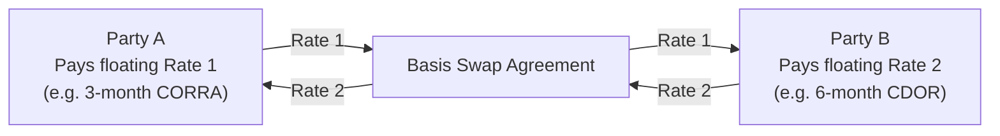

## 10.10 Other Types of Interest Rate Swaps

### Introduction
I still remember the first time I encountered a forward start swap. I was working at a firm that specialized in infrastructure financing, and we had this big renewable energy project with a two-year construction phase. The sponsor was worried about where interest rates might be by the time their project reached completion. So, they needed a product that locked in future interest rates without paying anything extra in the interim. In came the forward start swap—like a delayed flight that you book in advance, ensuring you already have your seat when you’re ready to depart.  

That anecdote always reminds me: not all interest rate swaps are the “plain vanilla” type (i.e., fixed-for-floating). So, let's dig deeper into several specialized interest rate swaps. These structures cater to unique needs—like matching a loan’s changing balance or referencing multiple floating rates. While they might sound fancy, each one addresses particular problems or market predictions that folks like you and me might face in the world of finance.

### Floating-to-Floating (Basis) Swaps
A floating-to-floating swap—often called a “basis swap”—is a swap where each party pays a floating rate, but these floating rates are based on different reference indices. Think of it as two individuals exchanging shipments of apples, but each orchard grows a different variety. Both are apples, but the variety (and thus the price, taste, etc.) differs.  

Common reference rates might include Canada’s CORRA, the U.S. SOFR, a 3-month T-bill rate, or even a prime lending rate published by a local bank. By exchanging payments tied to different floating rates, each party can hedge against or gain exposure to the spread between those rates.  

Suppose a Canadian exporter is receiving payments tied to 3-month CORRA but has obligations linked to 6-month CDOR. If the exporter believes 6-month CDOR will rise more quickly than CORRA, they might enter into a basis swap to convert their exposure. They pay the 3-month CORRA to a counterparty and receive 6-month CDOR. This way, they effectively lock in or manage the difference (the basis) between these two rates.

Below is a simple Mermaid diagram illustrating the structure of a basis swap:

Note how both parties pay and receive floating rates referenced to different benchmarks. The typical rationale is risk management: it aligns cash flows so that each side is comfortable with the net effect of the spread between those floating rates.

### Amortizing Swaps
Ever had a mortgage or auto loan where your outstanding principal goes down over time? An amortizing swap works similarly. The notional principal on this swap gradually decreases according to some schedule—often matching the amortization of an underlying loan or bond.  

• For example, let’s say Company X has a term loan of $100 million that amortizes (i.e., pays down principal) by $10 million every year for 10 years. Company X may want to hedge the interest rate on that declining balance. Instead of doing multiple smaller swaps, they can execute a single amortizing swap whose notional principal also steps down $10 million each year.  
• By structuring it this way, the hedge aligns perfectly with the actual loan. So if interest rates spike in year five, the company pays the original fixed rate on only the outstanding notional.  

This approach can be useful for large-scale projects—like real estate developments, pipeline expansions, or engineering megaprojects—where financing is repaid in a structured manner. Organizations feel quite comfortable knowing their swap notional mirrors their financing arrangement.

### Accreting Swaps
Accreting swaps go in the opposite direction of amortizing swaps: the notional amount grows over time. Maybe you’re thinking: “Why on earth would anyone want the notional to get bigger?”  

Well, consider a construction project. Early on, the sponsor may need only $20 million, but after a few years, they might require $80 million more. The cost of interest rates in the future is uncertain. Enter the accreting swap: you start with a smaller notional and gradually step up the principal as your financing draws increase.  

• Let’s say a hospital is being built. The project sponsor wants to lock in a fixed interest rate but only needs partial funds at the beginning. So, they do an accreting swap that begins with a $10 million notional and increases to $90 million over five years as the project requires more capital.  
• The sponsor’s interest payments are lower at the start (because the notional is smaller), and as the notional “accretes,” they pay more. But hey, that aligns with the actual loan balance or the capital infusion schedule.  

Accreting swaps are especially handy in capital-intensive ventures that deploy funds gradually, from big real estate deals to expansions in the energy sector.

### Forward Start Swaps
Some folks like to think of a forward start swap as a “futuristic” swap: an agreement you sign today where the actual swapping of interest payments doesn’t kick off until a predetermined future date.  

Consider that anecdote I shared in the introduction: an infrastructure project with a two-year construction period. The project sponsor might not need to lock in a rate right now (since it’s not paying interest on a big chunk of money yet)—but they’re still worried about future rates. So they set up a forward start swap to begin two years from now, fixing their rate in advance.  

• This means no immediate net settlement (besides maybe some initial fees or credit support requirements). But once that future date hits, the sponsor is locked into paying or receiving a fixed rate, or floating rate, depending on how they set it up.  
• The advantage is planning. The sponsor effectively hedges their risk of rising interest rates by securing the swap’s terms upfront. The downside could be that if rates fall dramatically, they miss out on that potential savings (unless they want to unwind or restructure the swap, which might cost them).

### Regulatory Oversight and Risk Disclosures
Regardless of customizations—basis swaps, amortizing, accreting, forward starts—these are all overseen by regulatory bodies, including CIRO in Canada. CIRO (Canadian Investment Regulatory Organization) requires that dealers provide sufficient disclosure to ensure counterparties (especially smaller or less sophisticated ones) understand the complexities.  

• The Canadian Securities Administrators (CSA) also outline rules around trade reporting, collateral management, and clearing for certain types of OTC derivatives.  
• When a swap is particularly complex, participants will often need to produce a more detailed term sheet or supplement to the ISDA Master Agreement.  
• Given the new regulatory frameworks, especially after global financial reforms, many of these swaps must be reported to authorized trade repositories. In some cases, participants might have to clear them through recognized clearing organizations—though that depends on whether the product is mandated for clearing.

In other words, while these specialized swaps solve unique financing and hedging puzzles, they come with additional documentation, compliance, and margin requirements. You’ll want to check the official CIRO website at [https://www.ciro.ca](https://www.ciro.ca) for the most recent regulatory guidelines and bulletins.

### Real-World Examples and Case Studies
You might see these swaps in action in all sorts of ways:

• A renewable energy developer with a ramp-up in funding could use an accreting swap.  
• A municipality that’s refinancing debt in a stepped manner might match that with an amortizing swap.  
• A multinational corporation that receives revenue based on LIBOR but pays costs tied to CORRA or SOFR rates might use a basis swap.  
• A hospital construction project with a future date for a big bond issuance might lock in rates ahead of time through a forward start swap.

One of my colleagues at a financial advisory firm once joked, “Swaps are like clothing—lots of different sizes and styles, but best if tailored to you.” That’s exactly right. Each type of swap suits a very particular scenario.

### Best Practices and Potential Pitfalls
Even though these swaps can be fantastic tools, you can guess there might be pitfalls:

• Mismatch Risk: If your amortization schedule changes or your expected capital need is delayed, your swap might not match your loan as well. That mismatch can introduce unwanted basis risk.  
• Credit Risk: Swaps expose each counterparty to the other’s credit risk. For longer-dated or more specialized swaps, the risk can be significant.  
• Early Termination Costs: If you decide to end your swap early (maybe interest rates moved in your favor, or you no longer need the swap), the termination cost can be big.  
• Regulatory and Documentation Complexity: Specialized swaps often require more elaborate contract language. Missing a detail in the documentation can lead to confusion or unanticipated fees.

I remember a friend who worked in corporate treasury. She had an amortizing swap that was supposed to mirror a term loan, but the company refinanced early, which left her swap “naked” for a period of time. It wasn’t the end of the world, but it caused some headaches and an unexpected termination fee.

### Additional Resources
If you’re intrigued and want to dive deeper, definitely check out these resources:

• “Interest Rate Swaps and Their Derivatives” by Amir Sufi and Siddharth Sharma. It provides a clear overview of both plain vanilla and more exotic structures.  
• ISDA Documentation: ISDA (International Swaps and Derivatives Association) offers standard definitions and sample schedules for basis swaps, amortizing swaps, and forward start provisions.  
• CIRO/CSA Guidelines on Complex OTC Derivatives: You can find the latest rules and best practices on the CIRO website (https://www.ciro.ca) or through the CSA’s resource portal.  
• Quantitative Tools: If you’re comfortable coding, open-source libraries like QuantLib in Python or C++ let you model these swaps, price them, and analyze risk through scenario tests.

### Conclusion
From basis swaps to amortizing, accreting, and forward start swaps, these variations each solve different real-world challenges. They’re “interest rate swaps with a twist,” as I like to call them. Whether it’s adapting to a declining principal balance or locking in rates for a future date, these instruments help businesses manage unpredictable interest rates in a more precise, tailored manner.

Still, it’s crucial to grasp the complexities, weigh the costs, and ensure you have the right regulatory backing. The Canadian landscape, now overseen by CIRO and the CSA, offers robust frameworks for transparency and risk management. As always, do your homework—talk to an experienced advisor, stress-test your scenarios, read the fine print in your ISDA schedules, and you’ll be well on your way to harnessing these specialized swaps effectively.

---

## Sample Exam Questions: Advanced Interest Rate Swap Structures



### Which best describes a basis (floating-to-floating) swap?

- [ ] A swap exchanging a fixed rate for another fixed rate.
- [ ] A swap that adjusts notional principal each quarter.
- [x] A swap where both parties pay floating rates tied to different reference indices.
- [ ] A swap that starts at a future date.

> **Explanation:** A basis swap involves exchanging one floating-rate index for another floating-rate index, often to manage different interest rate exposures.

### In an amortizing swap, the notional principal:

- [x] Decreases over time according to a set schedule.
- [ ] Increases over time according to a set schedule.
- [ ] Remains fixed throughout the life of the swap.
- [ ] Is reset daily based on an index.

> **Explanation:** Amortizing swaps reduce their notional schedule over time, aligning with the declining balance of certain loans or amortizing bonds.

### What is a key reason to use an accreting swap?

- [ ] You expect to refinance your debt sooner.
- [x] You anticipate a gradual increase in your future financing or project funding needs.
- [ ] You want to lock in the difference between two floating rates.
- [ ] You can speculate on currency fluctuations without an FX swap.

> **Explanation:** An accreting swap increases the notional principal over time, aligning with phased or staged funding requirements.

### Which of the following is true about a forward start swap?

- [ ] It typically begins immediately and ends after a short period.
- [x] It is agreed upon now but takes effect at a specified future date.
- [ ] It always requires physical delivery of a commodity.
- [ ] It is only used by governments and not corporations.

> **Explanation:** A forward start swap is signed at present, though the swap payments don’t start until the agreed-upon future date, allowing parties to lock in interest rates in advance.

### How would CIRO likely view specialized swaps like forward start or basis swaps?

- [ ] They fall outside CIRO’s purview altogether.
- [ ] They are traded exclusively on an exchange without oversight.
- [x] They are subject to the same broad regulations governing OTC derivatives, including trade reporting and disclosure.
- [ ] They’re not permitted under Canadian regulations.

> **Explanation:** CIRO oversees investment and derivatives regulation in Canada; specialized swaps remain subject to OTC derivatives reporting, margin, and disclosure requirements.

### Which feature is not typically associated with an amortizing or accreting swap?

- [ ] A notional that changes over time.
- [ ] Cash flows tied to the changing notional.
- [ ] Alignment with a project’s or loan’s principal balance evolution.
- [x] A fixed notional from start to end.

> **Explanation:** By definition, amortizing and accreting swaps have notional principals that change over time.

### What is a basis risk in the context of a floating-to-floating swap?

- [ ] The risk that the fixed rate will move contrary to the floating rate.
- [x] The risk that the two floating rates reference different benchmarks and move unpredictably relative to each other.
- [ ] The risk that the swap notional principal doesn’t match the underlying loan or bond.
- [ ] The risk that interest rates remain constant.

> **Explanation:** In a basis swap, each floating payment follows a separate index, so the possible divergence of these indices is referred to as basis risk.

### What might happen if you wind down an amortizing swap earlier than planned?

- [ ] The swap automatically converts to a basis swap.
- [ ] There are no financial consequences.
- [ ] The notional principal remains the same.
- [x] You may face an early termination fee or an off-market value settlement.

> **Explanation:** Terminating any swap prematurely can lead to termination or unwinding costs, reflecting the market value differential at the time.

### In a forward start swap for a project that isn’t starting for two years, how do payments work in the interim (i.e., before the effective date)?

- [ ] Payments begin immediately on a notional based on estimated project costs.
- [x] No exchange of interest payments occurs until the swap’s specified start date.
- [ ] The swap is automatically unwound if rates move significantly.
- [ ] The swap resets weekly but no payments are made.

> **Explanation:** With a forward start swap, there’s typically no payment exchange until the agreed future start date.

### Forward start swaps are especially useful for:

- [x] Locking in future interest rates for anticipated funding needs.
- [ ] Saving on bank fees by bundling currency exchange and interest rate hedges.
- [ ] Accessing custom commodity indexes.
- [ ] Eliminating foreign exchange risk in cross-border deals.

> **Explanation:** Forward start swaps help secure interest rate protection in advance, especially when major funding occurs down the road.


