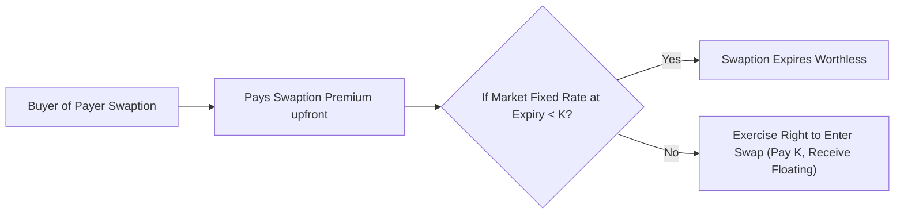
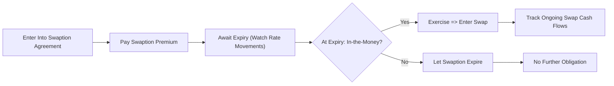

## 10.11 Swaptions

Swaptions can be a bit of a mouthful—some folks even pause for a second to connect “swap” plus “option” in their heads. Yet the concept is simpler than it may sound (I promise!). A swaption is essentially an option on a swap. It provides the buyer with the right, but not the obligation, to enter into a predetermined swap contract at or by a specified future date. This is a powerful tool for those who want to hedge (or speculate) on interest rates without committing to the swap right away. Let’s dig in.

––––––––––––––––––––––

### Overview of Swaptions

A swaption gives its holder a choice: do they want to start paying a fixed rate and receiving a floating rate (a payer swaption) or receiving a fixed rate and paying a floating rate (a receiver swaption)? The terms of the underlying swap—such as the fixed interest rate, notional amount, and maturity—are all baked into the swaption at inception. If by the time the swaption’s expiry arrives the choice is advantageous, the holder can exercise the swaption and enter the swap. If not, the holder can simply let it expire and walk away. That’s quite similar to a standard option’s payoff profile, but here the underlying instrument is a swap instead of an equity or commodity.

Swaptions can be physically settled (you literally enter into the swap if exercised) or cash settled (you receive a cash payoff that corresponds to the theoretical value of the swap at the time of exercise). The physical settlement approach is more common when the user’s main goal is to genuinely hedge interest rate exposures that might crop up in the future.

> Quick Anecdote:  
> I once walked into a corporate treasury meeting where the CFO said, “We might want to lock in a future interest rate in case rates rise, but we’re not 100% sure if we’ll need the funding.” They ended up buying a receiver swaption—giving them the right to receive fixed and pay floating—just in case they had to refinance at unknown rates down the line. They used the swaption’s flexibility strategically, and it felt like a perfect example of the practical problem swaptions can solve.

––––––––––––––––––––––

### Types of Swaptions

While the idea of “option on a swap” might be broad, swaptions typically come in two main flavors:

• Payer Swaption:  
  The buyer gains the right to become the fixed-rate payer and floating-rate receiver. This is usually purchased if one expects (or fears) interest rates will go up in the future and wants to lock in a rate now. If rates spike, paying the old (lower) fixed rate can be advantageous compared to paying a new, higher fixed rate in a freshly negotiated swap.  

• Receiver Swaption:  
  The buyer gets the right to be the fixed-rate receiver and floating-rate payer. This usually signals an expectation or fear that interest rates will fall, or a desire to lock in a certain fixed rate to be received (thereby hedging or profiting if the market rate for receiving fixed later goes down).

There are variations, of course: European-style swaptions can only be exercised at maturity; Bermudan-style swaptions can be exercised on a set of discrete dates; and American-style swaptions can be exercised at any time before expiry. But the core idea remains that you can control whether to enter the swap or not.

––––––––––––––––––––––

### Entering a Swap Later: Why is This Useful?

You might ask: “Why not just enter into a swap now?” Often, the buyer of a swaption wants to hedge a potential but not guaranteed need for a swap. If you lock yourself into a swap prematurely and the scenario you feared never materializes, you might be stuck with an unnecessary hedge. A swaption’s premium might be the cost of flexibility, allowing you to respond appropriately if interest rates move in an unfavorable way.

> Another Real-Life Example:  
> A real estate developer might plan to break ground on a major project in six months, financing it with a floating-rate loan. Concerned about potential interest rate swings in the near future, they could purchase a payer swaption. If interest rates jump, they exercise the swaption to lock in a more favorable fixed rate. If rates stay moderate or drop, they may let the swaption expire and enjoy the lower debt cost.  

––––––––––––––––––––––

### Key Swaption Terminology

Just like with all derivatives, swaptions come with their own lingo. Here’s a small glossary to keep your bearings:

• Swaption Premium:  
  The upfront fee that the buyer of the swaption pays to the seller for the right to enter into the underlying swap. Think of it like the cost of insurance on interest rate movements.

• Payer Swaption:  
  A right (but not the obligation) to **pay fixed** and **receive floating** in a swap at the future date.

• Receiver Swaption:  
  A right (but not the obligation) to **receive fixed** and **pay floating** in a swap at the future date.

• Volatility:  
  This is the expected fluctuation in interest rates. Higher volatility means higher premiums because there’s more “uncertainty” on where rates might go, and that uncertainty makes an option more valuable.

––––––––––––––––––––––

### Swaption Payoff Diagram (Conceptual)

If you’d like a quick mental picture, consider the following simple mermaid diagram. Let’s assume a payer swaption with a strike rate (the fixed rate on the underlying swap) denoted as K. If, at expiry, the relevant swap fixed rate in the market (let’s call it R) is well above K, the swaption’s payoff to the buyer is positive. If R stays below K, the swaption might expire worthless. The same concept is reversed for the receiver swaption.

We can see a fork: if interest rates are too low, no need to exercise a payer swaption. If they go high, the swaption is valuable. The buyer’s maximum loss is the premium.

––––––––––––––––––––––

### Pricing of Swaptions

Pricing a swaption builds on option pricing concepts (like how you might price an equity or commodity option) but applies them to an interest rate swap context. Some of the key variables:

• Forward Yield Curve:  
  The relevant forward rates for each payment period of the swap help define the fair fixed swap rate at future points in time. The difference between this forward swap rate and your swaption strike rate is central to the payoff calculation.

• Interest Rate Volatility:  
  Just like equity options rely on volatility of the underlying stock, swaptions need to know how much interest rates are expected to fluctuate. If rates are expected to swing widely, the potential payoff (and premium) is higher.

• Time to Expiry:  
  The longer the swaption’s life, the more time there is for rates to move, hence a higher premium in normal circumstances.

• Notional Amount & Duration:  
  The payoff is multiplied by the notional principal of the underlying swap, and the length of the swap also impacts the magnitude of the interest payments and potential gains/losses.

Often, specialized interest-rate option pricing models—such as the Black model (adapted for swaptions) or a more advanced short-rate model—are used to calculate the fair premium. Practitioners also use modern open-source libraries like QuantLib to handle complicated interest rate derivatives pricing.  

A simplified formula for a European-style payer swaption using the Black model might look like this:

K is the strike, F is the forward swap rate, σ is volatility, P is the discount factor, and \\( N(d_1), N(d_2) \\) are standard normal cumulative distribution values:


\text{Payer Swaption Price} = P \times [\, F \times N(d_1) - K \times N(d_2) \,] \times \text{(Annualized Period * Notional)}


Where:


d_1 = \frac{\ln \left(\frac{F}{K}\right) + \frac{1}{2} \sigma^2 T}{\sigma \sqrt{T}} 
\quad,\quad
d_2 = d_1 - \sigma \sqrt{T}


Of course, that’s a simplified view, but it captures the essence.

––––––––––––––––––––––

### Uses and Applications

Wondering why anyone would pay the additional premium for a swaption instead of jumping into a swap (or ignoring it altogether)? The reasons can be numerous:

1. **Hedging Uncertain Cash Flows:**  
   A corporate treasurer might anticipate a future debt issuance but not be 100% sure of the timing or final conditions. A receiver swaption can lock in an advantageous rate to hedge future interest expenses if they do issue the debt. If they don’t issue, they lose only the premium.

2. **Speculative Positions:**  
   If an asset manager believes interest rate volatility is underpriced or has a strong directional view on rates (i.e., they expect rates to crash or spike in the near future), they can purchase or sell swaptions for a speculative gain.

3. **Reducing ‘Over-Hedging’ Risk:**  
   If you lock into a swap and find out you didn’t need it, unwinding that swap can be complicated or lead to accounting complexities. A swaption’s optionality can be more flexible.

4. **Pre-Hedging M&A or Corporate Activity:**  
   Companies planning mergers or acquisitions may need to refinance large sums. A swaption can secure rates in advance, providing budget certainty without committing to the swap if the M&A falls through.

––––––––––––––––––––––

### Regulatory Environment in Canada

Under Canadian rules, OTC derivatives such as swaptions generally fall under the purview of the Canadian Securities Administrators (CSA) and are subject to trade reporting obligations under National Instrument 91-507 (Trade Repositories and Derivatives Data Reporting). Since 2023, we also have oversight from the Canadian Investment Regulatory Organization (CIRO), which replaced the old IIROC and MFDA. You should be aware of:

• **Trade Reporting:**  
  If you trade a swaption, details like the notional, counterparties, and expiry may need to be reported to a recognized trade repository.

• **Clearing Requirements:**  
  While many plain vanilla interest rate swaps are subject to mandatory clearing in some jurisdictions, swaptions’ clearing rules can vary. Check if your swaption needs clearing or if it remains bilaterally settled.

• **Margin and Collateral:**  
  Many dealers may require posting initial margin or collateral for swaptions to mitigate counterparty credit risk.

• **Documentation:**  
  Swaptions typically exist under a standard International Swaps and Derivatives Association (ISDA) Master Agreement. Traders should confirm that the relevant definitions and annexes (such as the 2006 ISDA Definitions) cover the specifics of their swaption.

––––––––––––––––––––––

### Practical Case Study: Corporate Refinancing

Let’s consider a mid-sized Canadian corporation—call it MapleTech—that’s uncertain about whether it will expand its manufacturing plant next year. If MapleTech goes forward, they’ll need CAD 50 million in financing at a floating rate. MapleTech’s CFO is worried that interest rates might rise. They buy a payer swaption with a strike fixed rate of 5.00%. The swap maturity if exercised would be 5 years, notional of CAD 50 million. The premium for this swaption is CAD 1 million, reflecting current volatility levels, forward rates, and time to expiry.

Scenario A: Rates spike to 6.25% by next year, and MapleTech proceeds with the facility. They exercise the swaption and lock in paying 5.00% fixed instead of 6.25%. The difference is 1.25% on the CAD 50 million notional. Over time, that cost saving probably justifies the CAD 1 million premium paid.

Scenario B: The project is canceled or interest rates actually drop (say, to 4.00%), so MapleTech doesn’t exercise the swaption. They lose the CAD 1 million premium, but that’s far less painful than being locked into unnecessary or unfavorable hedges.

––––––––––––––––––––––

### Risk Management Considerations

Swaptions come with two principal categories of risk to be aware of:

• **Interest Rate Risk:**  
  Even though it’s an option, the holder is still betting on interest rate directions or volatility. Adverse movements in rates may render the swaption worthless at expiry.

• **Counterparty Risk:**  
  If the swaption is not cleared and is handled bilaterally, there’s the risk that the counterparty won’t be able to fulfill its obligations. Collateralization and robust legal documentation are typically used to mitigate these risks.

> My Tip: As a risk officer once told me, “Anytime you bring an option into the mix, you have to watch your premium expenditures. It’s easy to get excited about the optionality and forget you’re consistently paying away those premiums. That can add up if you buy a ton of swaptions that never end up in the money.”

––––––––––––––––––––––

### Canadian Market Nuances

We have some unique elements in Canada. For instance:

• **Reference Rates:**  
  With the ongoing transition from CDOR (Canadian Dollar Offered Rate) to CORRA (Canadian Overnight Repo Rate Average), new derivatives might be aligned to CORRA-based floating rates. That directly impacts how we set up the floating legs for new swaptions.

• **Monetary Policy Sensitivities:**  
  The Bank of Canada’s policy decisions can create periods of pronounced volatility in short-term interest rates. For swaption pricing, that means local “event volatility” at Bank of Canada rate announcement dates can be significant.

• **CIRO Oversight:**  
  Now that CIRO is the single self-regulatory organization (replacing the older IIROC and MFDA as of 2023), participants in the derivatives market should keep an eye on CIRO bulletins or guidelines on capital requirements, margin, or best practices.

––––––––––––––––––––––

### Diagram: Swaption Lifecycle

Below is a simple mermaid diagram illustrating the lifecycle of a swaption from inception to expiry or exercise:

––––––––––––––––––––––

### Common Pitfalls and Practical Tips

• **Forgetting the Premium:**  
  It’s surprisingly easy to overlook how the premium can chip away at the economics. If you spend a fortune on the swaption premium, you might need a sizeable rate movement in your favor just to break even.

• **Wrong Type of Swaption:**  
  Sometimes, users accidentally purchase a payer swaption when they’re more exposed to falling rates (which might call for a receiver swaption). Always double-check the exposure you intend to hedge.

• **Ineffective Hedge Accounting:**  
  Hedge accounting under IFRS or other frameworks can be more complicated for options than for straightforward swaps. If you need specialized accounting treatment, be sure you meet the documentation and effectiveness testing requirements.

• **Ignoring Settlement Terms:**  
  Some swaptions are cash-settled. Others are physically settled. You need to be crystal-clear about the settlement mechanics. If you actually want to do the swap, you might prefer physical settlement.

––––––––––––––––––––––

### References for Further Learning

For those who’d like to do a deeper dive:

• **CSA Swap Trade Reporting Requirements (NI 91-507):**  
  Up-to-date information on derivatives data reporting obligations in Canada.  
  (https://www.securities-administrators.ca)

• **CIRO Resources:**  
  The new single self-regulatory organization in Canada.  
  (https://www.ciro.ca)

• **John Hull, “Options, Futures, and Other Derivatives”:**  
  A classic text covering a broad range of derivatives, featuring sections on swaps and swaptions.

• **Sheldon Natenberg, “Option Volatility & Pricing”:**  
  While more equity-focused, it illuminates volatility concepts that heavily influence swaption pricing.

• **QuantLib (Open-Source Library):**  
  A powerful toolkit for modeling interest rate derivatives, including swaptions.

––––––––––––––––––––––

### Concluding Thoughts

Swaptions are a flexible way to hedge or speculate on changes in the interest rate environment. They’re especially handy when the need for a swap is conditional—when a project isn’t guaranteed or you’re unsure if you really want to lock in a rate right away. Of course, you’ll pay a premium for that flexibility. In the uncertain world of interest rates and global monetary policy, though, sometimes paying a little upfront is a small price for sleeping better at night.

I always encourage folks to start small, consult with experienced practitioners, and use robust risk metrics to guide your decisions. There’s nothing wrong with adding an extra layer of optionality when you need it, especially if your entire business plan might change course depending on future interest rate conditions.

––––––––––––––––––––––

## Sample Exam Questions: Swaptions in Interest Rate Strategies



### Which of the following best defines a swaption?
- [ ] A type of forward contract on commodities
- [x] An option giving the right to enter into an interest rate swap
- [ ] A bond with embedded call features
- [ ] A mortgage-backed security
> **Explanation:** A swaption is an option on an interest rate swap, providing the buyer the right (but not the obligation) to enter a swap.

### What is the primary characteristic of a payer swaption?
- [ ] The holder receives a floating rate when they exercise
- [x] The holder has the right to pay fixed and receive floating
- [ ] The holder has the obligation to pay floating and receive fixed
- [ ] The holder gains an immediate fixed rate with no premium
> **Explanation:** The payer swaption grants the right to pay fixed and receive floating upon exercise.

### Why would a firm choose to purchase a receiver swaption?
- [x] To hedge against the risk of falling rates, ensuring they can receive a specific fixed rate
- [ ] To lock in a floating rate
- [ ] To speculate solely on equity movements
- [ ] To guarantee a favorable commodity price
> **Explanation:** A receiver swaption grants the right to receive fixed and pay floating, benefiting from a higher fixed rate if rates fall later.

### Which factor typically has the greatest impact on the premium of a swaption?
- [ ] The notional amount only
- [ ] The credit spread between counterparties
- [x] The volatility of the underlying interest rates
- [ ] The broker fee schedule
> **Explanation:** Volatility is a key determinant of option (and swaption) prices, as it affects the probability of the option finishing in-the-money.

### In which situation might a company most likely let its swaption expire worthless?
- [ ] When interest rates move in their favor, making the underlying swap unnecessary
- [x] When the market-fixed rate is below the strike for a payer swaption or above the strike for a receiver swaption
- [ ] When a new regulatory requirement disallows them from holding derivatives
- [ ] When there is no trade repository available
> **Explanation:** If the swap is out-of-the-money at expiry (e.g., for a payer swaption the market rate is below the strike), there is no advantage in exercising.

### Under Canadian regulations, which entity oversees swaption reporting obligations for investment dealers?
- [ ] The defunct IIROC
- [ ] The defunct MFDA
- [x] CIRO (Canadian Investment Regulatory Organization)
- [ ] The Federal Reserve
> **Explanation:** After IIROC and MFDA amalgamated, CIRO is now the single self-regulatory organization in Canada overseeing investment dealers.

### What happens if a payer swaption is physically settled at expiry and is in the money?
- [ ] The counterparties exchange shares of a specific equity
- [ ] The buyer of the swaption receives a lump sum cash payment
- [x] The buyer enters into a swap as the fixed-rate payer and floating-rate receiver
- [ ] The buyer must renegotiate the strike
> **Explanation:** Physical settlement means actually entering into the swap (paying fixed, receiving floating for a payer swaption).

### Which best describes the interest rate environment in which a payer swaption generally increases in value?
- [ ] A stable rate environment with low volatility
- [x] A rising rate environment with higher volatility
- [ ] A declining rate environment
- [ ] A negative interest rate environment for short-term T-bills only
> **Explanation:** A payer swaption grants the right to pay a lower fixed rate in an environment where rates might rise. Rising rates plus higher volatility typically add value to a payer swaption.

### Which document typically governs a swaption transaction?
- [ ] The corporate bond indenture
- [x] An ISDA Master Agreement
- [ ] A standard stock subscription agreement
- [ ] A real estate leasing contract
> **Explanation:** Swaptions, like most over-the-counter derivatives, are governed by the ISDA Master Agreement.

### True or False: A receiver swaption can only be exercised if the buyer wants to pay a fixed rate and receive a floating rate.
- [ ] True
- [x] False
> **Explanation:** A receiver swaption is exactly the opposite; it grants the right to receive a fixed rate and pay a floating rate.  


