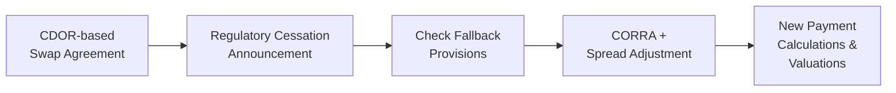

## 10.12 Transition from CDOR to CORRA in Canada & Global LIBOR Phase-Out

Sometimes I still remember my very first experience dealing with interest rate benchmarks—it was both fascinating and nerve-racking at the same time. I recall sitting in a meeting where everyone around me was talking about LIBOR, CDOR, and what was at the time a very new acronym, CORRA. Right away, I wondered if I'd ever fully “get it.” If you're reading this wondering the same thing—don’t worry. Before you know it, you’ll be using these terms like a pro. In this section, we’ll walk through why Canada has switched from CDOR (Canadian Dollar Offered Rate) to CORRA (Canadian Overnight Repo Rate Average), plus how that shift is part of a bigger global transition away from traditional interbank offered rates (like LIBOR). We’ll explore the reasons, the mechanics, and the ramifications for derivatives, especially interest rate swaps.

Let’s dig in step by step and shed some light on how all of this is shaping the Canadian and global interest rate landscape. 

---

### Historical Context: CDOR and LIBOR

If you've heard of LIBOR (the London Interbank Offered Rate), you might already know that it was once dubbed “the world’s most important number.” For decades, LIBOR served as the benchmark for trillions of dollars’ worth of financial contracts, from home mortgages to complex interest rate swaps. At the same time, in Canada, we had our own local champion: CDOR. While LIBOR was widely used internationally, CDOR was specific to the Canadian dollar (CAD) and commonly referenced for bankers acceptances and some floating-rate note (FRN) structures.

Both CDOR and LIBOR were essentially meant to capture the cost at which major banks could borrow unsecured funds. But, as global markets evolved, regulators and market participants began prioritizing newly defined “risk-free rates” (RFRs) to provide a more reliable basis for pricing than the old interbank rates. As a result, regulators worldwide launched what we call the IBOR (Interbank Offered Rate) reform process. Key transitions include:
• Replacing USD LIBOR with SOFR (Secured Overnight Financing Rate).  
• Replacing GBP LIBOR with SONIA (Sterling Overnight Index Average).  
• Replacing CDOR with CORRA in Canada.  

A variety of drivers (including the infamous LIBOR manipulation scandals and the diminishing volume of underlying unsecured bank-to-bank transactions) pushed regulators to find newer, more robust benchmarks that reflect real transactions in liquid markets.

---

### CDOR vs. CORRA: What’s the Difference?

1. **CDOR (Canadian Dollar Offered Rate)**  
   CDOR was historically determined based on the rates at which banks would lend to one another through bankers acceptances (BAs). Think of BAs as a short-term promissory note “accepted” by a bank, which commits to pay the holder of the note its face value at maturity. Over time, the underlying market for BAs shrank, so CDOR was increasingly determined from less robust data. 

2. **CORRA (Canadian Overnight Repo Rate Average)**  
   CORRA is an overnight risk-free reference rate published by the Bank of Canada. It’s based on actual transaction data in the overnight repo market, where market participants (like banks, dealers, and large institutions) lend or borrow funds overnight, secured by Government of Canada Treasury bills or bonds. Because CORRA is derived from real trades (and it’s backed by collateral), it’s considered more transparent and less susceptible to manipulation.  

From a user’s perspective, CORRA differs from CDOR in many ways, such as how it’s calculated, how often it’s published, and the day count conventions used for calculations in the derivatives markets. CORRA is often seen as a “risk-free” rate because it’s secured by government collateral, whereas CDOR was more credit-based and involved some elements of bank credit risk.

---

### Global LIBOR Phase-Out and its Link to Canada

You might have heard about the scandal that tarnished LIBOR’s reputation and led regulators around the world to say, “Let’s fix this.” Well, the same push to find better benchmark rates caught on in Canada. While LIBOR had been the biggest name in the global context, the Canadian regulators recognized that CDOR, too, had issues. The average daily volume of activity underlying CDOR (bankers acceptances) was dwindling, making it not as representative or robust as it could be.

As part of the global benchmark reforms, a consortium of global regulators—led by the FSB (Financial Stability Board), IOSCO (International Organization of Securities Commissions), and local authorities like the Bank of Canada—recommended or mandated transitions to new RFRs. This is why we get transitions like:
• LIBOR → SOFR, SONIA, €STR (Euro Short-Term Rate)  
• CDOR → CORRA  

---

### Why Phasing Out CDOR Matters for Interest Rate Swaps

If you think about CDOR-based swaps, the floating leg of those swaps typically used CDOR as the reference. For example, in a plain vanilla interest rate swap, one side might pay a fixed rate while the other side pays a floating rate linked to 3-month CDOR. With the phase-out of CDOR, all these existing contracts would need to either shift to a new reference rate or incorporate fallback provisions.  

Some of the key changes you might see include:

• **Valuation Changes**: The shift from CDOR to CORRA can affect how swaps are priced. CORRA is usually lower than CDOR since CDOR contains a measure of bank credit risk, whereas CORRA is nearly risk-free.  
• **Fallback Provisions**: Market participants who still hold CDOR-based swaps need to rely on contractual language that effectively says, “If CDOR ceases to exist, we switch to CORRA + some spread adjustment.”  
• **Day Count Conventions**: CDOR-based instruments often used an Actual/365 or Actual/365(Fixed) day count, while CORRA derivatives might use different day count conventions, such as Actual/365(OK) or Actual/360 (depending on the product). This difference can impact precise calculations.  
• **Margin and Settlement Adjustments**: Because CORRA is an overnight rate, the compounding method for interest accrual might come with nuances that affect how margin is posted or how final settlement is calculated.

This transition—while essential—is not always a walk in the park. Institutions have had to reconfigure systems, recalibrate risk models, and update legal documents, all while ensuring minimal disruption for clients.

---

### Key Regulatory Oversight for the Transition

Historically, Canada’s investment markets had separate self-regulatory organizations called IIROC and MFDA. As of January 1, 2023, these two bodies merged into the Canadian Investment Regulatory Organization (CIRO), which oversees investment dealers, mutual fund dealers, and marketplace operations. CIRO and the Canadian Securities Administrators (CSA) closely monitor how the market handles benchmark transitions, ensuring that:

• **Adequate Fallback Language** is included in new and legacy contracts.  
• **Clients Are Properly Notified** of changes in benchmark rates.  
• **Market Stability** is maintained, avoiding mispricing or confusion.  

Beyond Canadian regulators, the International Swaps and Derivatives Association (ISDA) published IBOR Fallbacks Protocols to help standardize how derivatives should pivot from a non-existent or unreliable benchmark to a robust new rate (like CORRA). By adhering to the ISDA protocols, many counterparties can automatically amend their contracts and adopt standard fallback language.

---

### Fallback Provisions: Fine-Tuning the Transition

Sometimes, you see “fallback provisions” and think, “Okay, that’s just some legal paragraph that says ‘go from Rate A to Rate B.’” Actually, it can be more involved than that. When a contract transitions from CDOR to CORRA, both parties must account for the historical spread between these two rates. Typically, CDOR has been higher than CORRA because it includes the bank-related credit risk premium.

#### Spread Adjustment

The solution? A **spread adjustment**. It’s basically a small margin added on top of the new CORRA-based rate to ensure the swap’s net present value (NPV) remains roughly the same as it was using CDOR. If that difference is ignored, either the floating-rate payer or receiver could get a windfall gain or an unintended loss when the rate changes. 

One widely accepted method for calculating this spread is to look at the median difference between CDOR and CORRA over a specified historical lookback period. This ensures no one day or short period of market stress skews the entire calculation.

---

### Market Liquidity and CORRA-Based Swaps

Now that we know the “why” and “what” behind the transition, how about the “when” and “how” from a market-liquidity standpoint? Many participants want to be absolutely sure that if they’re using CORRA-based swaps, they can hedge or exit positions easily without excessive costs or slippage.

Luckily, the Canadian swap market has evolved rapidly to incorporate CORRA-based products. Liquidity has been on the rise, with a growing number of brokers quoting CORRA-based swaps, dealers providing two-way markets, and even standardization in swap terms. Is it as liquid as the old CDOR-based swap market? Well, it’s getting there. The Bank of Canada has been working with market participants to ensure the transition is smooth and promotes active trading volumes.

---

### Practical Example: CDOR vs. CORRA Swap Transition

Let’s say you have a 5-year interest rate swap, where you pay a fixed rate of 2.00% and receive 3-month CDOR. The notional is $50 million. You’re only 2 years into the swap and still have 3 years left until maturity. Then the official cessation date for 3-month CDOR is announced, and the fallback states that on that date, you’ll transition from receiving 3-month CDOR to receiving daily-compounded CORRA plus a spread adjustment of 0.05% (5 basis points).  

Before the fallback triggers, your floating rate might have been 2.10% if CDOR was at 2.10%. After the fallback, if daily CORRA hovers around 2.00%, you’ll effectively receive 2.05% (2.00% + 0.05% spread). That 0.05% spread is designed to keep your break-even roughly consistent with the old contract. However, fluctuations in CORRA can be different than fluctuations in CDOR, so you’ll need to be mindful of the ongoing difference in rate behavior.

---

### Implementation Challenges and Best Practices

Switching from one reference rate to another can be tricky. Some common challenges include:

• **Systems Upgrades**: Legacy systems may not be equipped to handle daily compounding or the new day count conventions used for CORRA.  
• **Legal Documentation**: Tens of thousands of existing contracts may need to be amended or adhered to the ISDA Protocol. Missing or ambiguous fallback language can create disputes.  
• **Operational Complexity**: Payment calculations, settlement cycles, and margin calls might look slightly different under a daily compounding regime.  
• **Client Communication**: Ensuring clients understand how the transition affects their existing and future contracts.  

#### Best Practices

• **Early Adoption**: If possible, shift new deals to CORRA-based conventions sooner rather than waiting for forced conversion.  
• **System Testing**: Confirm that your front- and back-office systems are ready to handle CORRA calculations and reference data.  
• **Education and Training**: Make sure your staff, colleagues, and clients understand these changes. Talking from experience, no matter how seasoned you are, there’s always a learning curve.  
• **Regulatory Engagement**: Stay in touch with guidance from CIRO and CSA. They issue bulletins and checklists to help firms.  

---

### Day Count Conventions and Compounding

CORRA is typically used in derivatives on a compounded basis, meaning the interest for each period is based on the accumulation of daily rates. This approach can be a bit more involved than something like simple 3-month CDOR:

• **Daily Summation**: Each business day’s CORRA is recorded (adjusted for day count).  
• **Compounding**: Each day’s interest is added to the day’s outstanding notional, effectively creating a compounding effect.  
• **Payment Lag**: There’s often a small time lag before payments are due, so the final rate can be determined.  

If your current system is used to reading a single 3-month CDOR fix at the start of each quarter, well, going to daily-overnight compounding might feel like a jump. But the shift can also yield more accurate (and arguably fairer) interest accruals that reflect actual cost of funds day by day.

---

### Diagram: Transition Workflow

Below is a simplified Mermaid diagram that illustrates a high-level transition workflow from a CDOR-referenced swap to a CORRA-referenced swap:

• **A**: The original swap is based on CDOR.  
• **B**: Regulators and the Bank of Canada announce a final date for CDOR cessation.  
• **C**: Parties review the fallback language in the contract or sign up to the relevant ISDA protocols.  
• **D**: If fallback triggers, the rate becomes CORRA plus a spread adjustment.  
• **E**: Payments, margin, and valuations are updated accordingly going forward.

---

### Amendments for Legacy Swaps

For existing swaps that don’t have robust fallback provisions, counterparties might need to renegotiate. This could involve:
• **Bilateral Amendments**: Parties sit down (virtually or physically) and execute an amendment specifying the new reference rate and spread.  
• **Adherence to ISDA Protocol**: By adhering to the protocol, parties automatically incorporate standard fallback provisions.  
• **Negotiation of Economic Terms**: In some cases, adjusting the fixed rate or rebalancing the notional might be warranted to realign the swap with the original economic intent.  

If a party fails to address the fallback issue, the next best thing might be to rely on the fallback of “last known published rate” or something similarly suboptimal, which can be messy. That’s why regulators strongly encourage proactive transition planning.

---

### Global Considerations: SOFR, SONIA, and Beyond

The wave of benchmark reform hasn’t only affected Canada. Globally, you’ll see:
• **SOFR (USD)**: An overnight rate derived from U.S. Treasuries’ repo transactions.  
• **SONIA (GBP)**: A measure of overnight unsecured sterling lending.  
• **€STR (EUR)**: A euro short-term rate.  
• **TONA (JPY)**: Tokyo Overnight Average Rate.  

Each of these RFRs has different credit risk, day count conventions, and compounding methods. If you’re dealing with cross-currency swaps referencing multiple rates (say, LIBOR on your USD leg and CDOR on your CAD leg), you might end up transitioning each leg to a distinct new reference rate. This can create complexities, but also new opportunities for arbitrage or hedging across different rate regimes, especially if the transitions happen at different times.

---

### Role of CIRO and CSA

CIRO and the Canadian Securities Administrators together coordinate Canada’s compliance environment. In the post-2023 world, CIRO is the single self-regulatory organization for investment dealers and mutual fund dealers—a big shift from the old IIROC/MFDA environment. Among other duties, CIRO is paying close attention to:

• **Margin Guidelines** for new CORRA-based swaps.  
• **Disclosure Requirements** around benchmark transitions.  
• **Trade Reporting** to recognized trade repositories.  
• **Market Integrity** to ensure no manipulation or dislocation occurs as a result of the transition.

The CSA, on the other hand, sets overarching securities regulations across Canadian provinces, often aligning with international best practices. They’ve published guidelines on how to incorporate fallback language and handle changes to the “material terms” of existing derivatives.

---

### Common Pitfalls and Ways to Avoid Them

1. **Last-Minute Scramble**: Waiting until the forced cessation date to pivot from CDOR to CORRA can create operational chaos.  
   - *Solution*: Plan early, test your systems, train your staff.  

2. **Incomplete Documentation**: Missing or weak fallback clauses lead to confusion.  
   - *Solution*: Use standardized language from ISDA protocols.  

3. **Spread Miscalculation**: Underestimating or misapplying the historical basis between CDOR and CORRA might favor one counterparty over the other.  
   - *Solution*: Use accurate, transparent data to calculate fair spread adjustments.  

4. **Ignoring Communication**: Failing to communicate properly with clients or counterparties can lead to disputes or mistrust.  
   - *Solution*: Provide clear, timely updates on contract changes, calculation methods, and potential impacts on payments.  

---

### Personal Reflections

I remember the first time I had to explain the transition from LIBOR to SOFR to a friend in the mortgage industry. She was kinda taken aback, saying, “Wait, it’s such a big rate—how can it just go away?” That’s similar in Canada. Many folks are so used to hearing “CDOR” that the idea it’s being phased out seems jarring. But, trust me, once you understand the reasons—more robust data, less manipulation risk, stronger reflection of real market activity—it starts making sense. Yes, it can be a bit tough to keep all these acronyms straight, but as soon as you see how the puzzle fits together, it gets darn interesting.

---

### Additional Resources

Below are some resources if you want to dive deeper:

• **Bank of Canada CORRA Transition**  
  [https://www.bankofcanada.ca/markets/corra/](https://www.bankofcanada.ca/markets/corra/)  
  The official page detailing CORRA and the transition timeline, including updates and methodology.

• **CSA & CIRO Guidance on Benchmark Transition**  
  [https://www.ciro.ca](https://www.ciro.ca/) (CIRO Website)  
  Look for bulletins discussing how members can comply with benchmark reforms.

• **ISDA IBOR Fallbacks Supplement & Protocol**  
  [https://www.isda.org](https://www.isda.org)  
  Comprehensive outlines of how fallback language works for swaps under ISDA.

• **Global Rate Advisors**  
  Many consultancies and financial data providers offer free web tools to monitor daily changes between old and new benchmarks.

---

### Concluding Thoughts

The transition from CDOR to CORRA in Canada is a microcosm of the larger global shift away from interbank offered rates. While this is a chore—updating software, rewriting contracts, explaining it all to clients—it’s also an opportunity to modernize and improve market integrity. As more participants embrace CORRA, we’ll see deeper liquidity, consistent pricing, and confidence that rates represent actual market conditions.

If you’re in the interest rate swap space, keep these steps in mind:  
• Check and update your contracts.  
• Know your fallback provisions and spread adjustments.  
• Talk with your counterparties, regulators, and clients.  
• Stay tuned to official communications from the Bank of Canada, CSA, and CIRO for any fresh guidance.  

Yes, it’s a big change—but with the right preparation and mindset, it’s totally manageable. And, honestly, having been through it so far, it can even be pretty exciting to be part of a once-in-a-generation overhaul of how markets measure basic borrowing costs. Let’s embrace the future with CORRA leading the way in Canada, and risk-free benchmarks redefining global finance overall.

---

## Sample Exam Questions: Transition from CDOR to CORRA in Canada & Global LIBOR Phase-Out



### Which of the following statements best describes the primary reason for transitioning from CDOR to CORRA in Canada?

- [ ] CDOR is more heavily regulated by CIRO than CORRA.  
- [x] CORRA is considered a more robust and risk-free benchmark based on overnight Repo transactions.  
- [ ] CDOR had lower daily volatility than CORRA.  
- [ ] CORRA is mandated only for retail loans.  

> **Explanation:** The main motivation is that CORRA reflects actual overnight repo transactions, which are collateralized and thus more robust and less prone to manipulation than CDOR.

---

### What is the purpose of the spread adjustment when switching a legacy interest rate swap from CDOR to CORRA?

- [x] To compensate for the historical difference between CDOR and CORRA, preventing economic value transfer.  
- [ ] To speed up the settlement period.  
- [ ] To reduce the notional amount of the swap.  
- [ ] To eliminate any margin requirements.  

> **Explanation:** When transitioning from CDOR (which includes a credit premium) to CORRA (which is risk-free), a spread adjustment is typically added to CORRA to ensure the swap’s economic value remains consistent.

---

### Under the fallback provisions in an ISDA swap agreement, what generally happens when CDOR is permanently discontinued?

- [x] The floating rate references CORRA plus a spread adjustment.  
- [ ] The fixed leg payments automatically double.  
- [ ] The swap terminates immediately without compensation.  
- [ ] The swap is converted into an equity swap.  

> **Explanation:** If CDOR ceases, most ISDA fallback protocols shift the reference rate to CORRA plus a calculated spread to maintain value parity.

---

### Which of the following best characterizes daily-compounded CORRA in a standard CORRA-based swap?

- [x] The floating rate is updated each day based on the overnight CORRA reading, then compounded throughout the accrual period.  
- [ ] The floating rate is set once at the start of the quarter and remains unchanged.  
- [ ] CORRA is not relevant to swap calculations and is only used for mortgages.  
- [ ] The floating rate cannot be compounded and is simple interest only.  

> **Explanation:** CORRA-based swaps use a daily-compounded methodology, reflecting each day’s overnight repo rate.

---

### Which organization in Canada is now primarily responsible for self-regulatory oversight of benchmark transitions and derivatives markets?

- [ ] IIROC  
- [ ] MFDA  
- [x] CIRO  
- [ ] OCC  

> **Explanation:** IIROC and MFDA merged to form CIRO as of January 1, 2023, making CIRO the primary self-regulatory organization for investment dealers and mutual fund dealers in Canada.

---

### Why is CDOR considered less robust than CORRA?

- [x] CDOR was based on fewer real underlying transactions in the bankers acceptance market.  
- [ ] CDOR had no historical usage in Canadian derivatives.  
- [ ] CORRA contains a large credit-risk component, which is absent in CDOR.  
- [ ] CDOR was only calculated once a year.  

> **Explanation:** Over time, the bankers acceptance market shrank, making CDOR less representative of broad market conditions. CORRA, by contrast, is based on daily repo transactions, increasing its reliability.

---

### If an existing 3-year swap with a floating leg referencing 3-month CDOR is forced to transition to daily-compounded CORRA plus a 0.04% annual spread, what is the primary goal of adding this 0.04% spread?

- [ ] To penalize the receiving party for using a new benchmark.  
- [x] To preserve the swap’s original economic value by offsetting the historical difference between CDOR and CORRA.  
- [ ] To eliminate any margin payments for either party.  
- [ ] To keep the floating rate uncompetitive with market rates.  

> **Explanation:** The spread is designed to maintain value neutrality, ensuring one party doesn’t gain or lose solely due to the benchmark change.

---

### What is the main reason regulators worldwide are encouraging the move from LIBOR, CDOR, and similar rates to newer risk-free rates (RFRs)?

- [x] To increase transparency and reduce manipulation by basing rates on actual transactions.  
- [ ] To generate higher interest rates for all borrowers.  
- [ ] To reduce overall derivatives trading volume.  
- [ ] To phase out any use of derivatives in financial markets.  

> **Explanation:** RFRs (like CORRA, SOFR, SONIA) are based on real, collateralized transactions, which minimize the manipulation risk that undermined legacy rates.

---

### Which of the following is a potential challenge to implementing the CDOR-to-CORRA transition?

- [ ] Fewer parties can trade or hedge indices linked to CORRA.  
- [x] Systems, documentation, and operational frameworks must all be updated simultaneously.  
- [ ] The spread between the two rates is negative, making transitions impossible.  
- [ ] CORRA-based swaps are unregulated by Canadian authorities.  

> **Explanation:** Adopting CORRA involves updating internal IT systems, operational processes, fallback language in legal documentation, and staff training.

---

### True or False: CORRA is an unsecured benchmark like CDOR.

- [ ] True  
- [x] False  

> **Explanation:** CORRA is considered nearly risk-free because it is secured by high-quality government debt in the overnight repo market, whereas CDOR involves unsecured bank credit risk.


