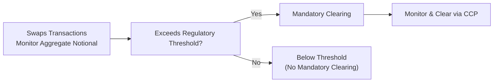

## 10.13 Mandatory Clearing Thresholds for Certain Swaps

Clearing might not sound all that exciting at first. It’s tempting to shrug and say, “Sure, they tell us to clear some swaps. So what?” But once you realize how mandatory clearing thresholds can completely change how firms manage counterparty risk, well, it’s suddenly not so boring! In this article, we’ll walk through what these clearing thresholds are all about, why regulators impose them, and what everyday practitioners (like you and me) need to do to comply—especially when dealing with interest rate swaps in the Canadian market.

### Why We Have Mandatory Clearing Thresholds

So, have you ever heard of the phrase “systemic risk”? That’s the big fear in finance—the idea that if one large player fails, it drags others down, and eventually the whole system tumbles like dominoes. Mandatory clearing thresholds exist to help prevent that domino effect. Essentially, regulators say: “Hey, if your notional exposures go above a certain level, you have to clear your swaps with a central counterparty.” A central counterparty (CCP) standardizes margin rules, ensures daily marking-to-market, and steps in if a default ever occurs. This eliminates a ton of bilateral risk that might otherwise creep into markets.

In Canada, the relevant rules come from the Canadian Securities Administrators (CSA) via National Instrument 94-101 (and 94-102). The main takeaway? If your derivatives positions blow past a specified notional limit, you are required to move them into a clearinghouse environment like the London Clearing House (LCH) or CME Clearing, or a local CCP that’s approved by regulators. This measure helps ensure the stability of the broader financial system.

### How Thresholds Are Determined

Threshold calculations may feel like rocket science at first, but let’s simplify. Typically, regulators look at the sum of notional amounts outstanding for a category of derivatives, such as interest rate swaps, credit default swaps, equity swaps, etc. If your firm’s total derivative exposures exceed the threshold (over a certain measurement period—often the preceding 12 months), you must clear subsequent eligible trades.

Let’s imagine you’re a modest portfolio manager at “Friendly Maple Asset Management Inc.” Maybe it’s 2018 and your notional swirl of interest rate swaps was CAD $500 million. It wasn’t a huge deal—you didn’t have to clear. But now it’s 2025, you’re doing more business, and your notional exposures balloon to CAD $1.5 billion. You cross the threshold. Suddenly, that new position you’re about to enter might be subject to mandatory clearing. That’s the gist.

### Mechanics of Clearing

Once your swaps are cleared, you enter them through a central counterparty. The CCP manages margin requirements (both initial and variation margin). They do something called “mark-to-market,” which means they recalculate the value of your swap daily—or even multiple times a day—according to the latest prices. If you’re on the losing side of a trade, you pony up more margin. If you’re on the winning side, margin comes back your way. This process ensures that nobody’s building up a massive uncollateralized loss behind the scenes.

Here’s a quick visual overview of the process:

Once you reach that threshold, the clearing requirement kicks in. Even if your total exposure later dips under (say due to trade unwinds), you may still remain subject to clearing requirements for a prescribed period—depending on the rules, you might need to demonstrate that you’ve stayed below the threshold consistently for a set amount of time to be exempt from future clearing.

### CSA Regulations: National Instrument 94-101

The Canadian Securities Administrators introduced National Instrument 94-101 to bring our environment up to global G20 commitments on OTC derivative reforms. The key bits:

• Firms must aggregate their positions in certain over-the-counter (OTC) derivatives.  
• If total notional exposures exceed the threshold for a specific derivative class, newly executed or novated transactions must be cleared through a recognized or exempt clearing agency.  
• The rules also set out various “product determination” categories—so it’s not just any derivative. Rather, it’s specifically interest rate swaps (IRS) of certain maturities or reference rates that are typically mandated for clearing.  

Let’s say you have a portfolio made up purely of short-dated interest rate swaps that the CSA hasn’t designated as mandatory for clearing (maybe they have very short maturities). If that’s the case, you might dodge the clearing requirement. But watch out: new categories or expansions to existing categories can be introduced. Regulators often broaden the net over time.

### Indexed to Systemic Risk

Think of mandatory clearing thresholds as a safety net. If a market participant has minimal positions, that participant is probably not a huge threat to the broader system if it fails to meet margin calls. But if a participant’s total derivative exposure is massive, it poses systemic risk. The threshold ensures that those large players operate under a more stringent risk management regime, with standardized and transparent daily margining by a CCP.

### CIRO Member Obligations

CIRO (the Canadian Investment Regulatory Organization) expects its member firms to keep track of notional exposures and comply with the clearing obligations when thresholds are hit. Member firms should have policies that:

• Identify trades subject to mandatory clearing.  
• Classify new and existing trades by derivative type.  
• Track total exposures and maintain updated records.  
• Have robust technology or manual processes to route eligible swaps to the appropriate CCP.  

Offshore swaps (for example, a Canadian global bank’s London branch trading EUR interest rate swaps) can still fall under Canadian rules if the underlying entity is subject to local regulation. In some cases, equivalency or substituted compliance might permit them to clear through a recognized foreign CCP under rules considered comparable to Canadian legislation. But you can’t just assume that—do your homework. If you’re a smaller entity trading overseas, you need to check whether your trades are still captured by Canada’s clearing rules.

### A Personal Tale: Getting Surprised by the Threshold

I remember a friend who worked at a mid-sized investment firm. Initially, they thought they were way below the threshold for their IRS exposures. But they forgot to add in a big chunk of forward rate agreements, which also qualified as interest rate derivatives. The methodology included all interest-rate-linked derivatives in aggregate. Suddenly, they realized they were well over the threshold, which meant the next trade had to be cleared. Let me tell you, they scrambled to set up clearing relationships with LCH and to negotiate clearing agreements with their futures commission merchants (FCMs). It wasn’t the end of the world, but it was an eye-opener on the importance of accurate exposures data.

### Mark-to-Market and Collateral Management

Daily mark-to-market is a huge benefit of clearing: it forces everyone to keep track of the real-time value of derivatives. The CCP’s robust default-management procedures also help create a firewall that prevents one participant’s meltdown from snowballing. 

However, to keep pace with frequent margin calls, your firm might need greater liquidity than in a bilateral arrangement. So be aware—this can tie up more capital. Nonetheless, from a systemic lens, it’s a fair trade-off.  

### Potential Exemptions and Ongoing Monitoring

Regulators do offer carve-outs in some scenarios. For instance, small banking cooperatives or certain public banks might have an exemption. Pension funds sometimes get transitional relief. But none of these are automatic or indefinite—be sure to check the specifics in National Instrument 94-101, CIRO Bulletins, or any official CSA staff notices.  

You need to keep monitoring your positions to ensure you’re not creeping over that threshold. Relying on a static calculation once a year just won’t cut it. If your business is growing or if you’re seeing big inflows in your derivatives volumes, you have to track that rolling notional. 

### A Quick Example

Let’s say your firm deals in CAD interest rate swaps referencing the 5-year Government of Canada bond yield. Over the last 12 months, your rolling notional average was $1.4 billion across your IRS positions. Then in the last quarter, you put on new trades worth $800 million, bringing your total up to $2.2 billion. That might be beyond the relevant threshold (the exact threshold can shift with regulations, so be sure to check the latest official documents—that’s your best bet).

Once you pass that line, the next time you trade an IRS that falls under mandatory clearing categories, you must clear it. And if you fail to do so, well, let’s just say the regulatory fines and reputational harm ain’t pretty. 

### Equivalency or Substituted Compliance

Ever done that thing where you go on a trip abroad and your phone plan covers roaming, so you don’t need to buy a new plan in every country? Equivalency in derivatives regulation is kind of like that. If you clear your intangible interest rate swaps in, say, the U.K., and the CSA has deemed the U.K. rules “equivalent,” then you might be considered in compliance with Canadian rules. This is known as “substituted compliance.” It’s not always automatic, but it can definitely reduce duplicative compliance burdens. 

### Glossary Recap

• **Threshold:** The notional limit above which your firm must clear swaps.  
• **Systemic Risk:** The risk of a financial meltdown spreading through interconnected institutions.  
• **Mark-to-Market:** Updating a derivative’s valuation daily (or intraday) to reflect the current market price.  
• **Equivalency (Substituted Compliance):** The recognition that another jurisdiction’s rules are comparable, so you can comply with those instead of domestic rules.

### Best Practices and Pitfalls

• **Regularly Monitor Exposure:** Don’t wait until year-end. Make it part of your monthly or quarterly risk checks.  
• **Engage in Legal Reviews:** Ensure your agreements with CCPs and clearing members (FCMs) are in place before crossing a threshold.  
• **Include All Relevant Products:** Don’t forget to count forwards, FRAs, structured swaps, or even those exotic index-based IRS that might be subject to clearing.  
• **Stay on Top of Changing Rules:** This is not static. As the market evolves, the CSA can amend or expand mandatory clearing categories.  
• **Document, Document, Document:** If you ever want to prove to regulators that you’re below the threshold or that you’ve complied with clearing, thorough documentation is your friend.

### Further Resources

• CSA National Instrument 94-101 and 94-102: Check the official documents for the definitive rules, formulas, and thresholds.  
• CIRO (https://www.ciro.ca): Look for Derivatives Compliance Bulletins and relevant notices for updates on threshold changes or clarifications.  
• Global CCP Resources: LCH (London Clearing House) and CME Clearing each have extensive documentation on membership requirements, margin frameworks, and operational steps for clearing interest rate swaps.  
• “Clearing Services for Global Derivatives” by R. Tee and M. Clark: A great reference that offers deeper insights into the global CCP ecosystem and how clearing has evolved over the last decade.

### Concluding Thoughts

So, mandatory clearing thresholds aren’t just some pointless compliance box to tick. They’re a key component of modern market infrastructure, designed to manage and reduce systemic risk. By centralizing the clearing process for large-scale derivatives traders, regulators help keep the financial system’s gears from getting jammed by a localized default. For you, as a participant, the best approach is to stay informed, maintain good data management, and set up efficient protocols so that if your notional exposures start to tip into clearing territory, you’re not caught off guard.

And honestly, if you’re crossing these thresholds, you’re probably big enough that the benefits of clearing—enhanced netting, robust margin processes, and standardized administration—will serve you well. Stay prepared, stay open to adjusting your compliance processes, and you’ll handle mandatory clearing like a pro.

--------------------------------------------------------------------------------

## Sample Exam Questions: Mandatory Clearing Thresholds for Swaps



### Which of the following is a primary goal of mandatory clearing for certain swaps?

- [x] Reducing systemic risk by centralizing risk management
- [ ] Eliminating the need for margin requirements
- [ ] Increasing bilateral counterparty exposure
- [ ] Encouraging unregulated OTC trading

> **Explanation:** The key purpose of mandatory clearing thresholds is to ensure that large market participants clear their trades through a central counterparty, thereby reducing systemic risk.

### A Canadian resident firm trading from its London branch may still need to clear swaps under Canadian regulations if:

- [x] The firm falls under Canadian jurisdiction or equivalency does not apply
- [ ] The firm always trades with non-Canadian counterparties only
- [ ] It only trades short-term FX swaps
- [ ] It uses U.S. banks for all transactions

> **Explanation:** Canadian rules can apply to offshore activities if the entity is still regulated in Canada or if no equivalency arrangement is in place. 

### When does a firm typically become subject to mandatory clearing requirements?

- [ ] Immediately after onboarding its first swap trade
- [ ] Only if it starts trading less than $100 million in notional
- [x] Once its notional exposures exceed specific thresholds, as defined by regulations
- [ ] Whenever regulators issue an advisory notice without formal thresholds

> **Explanation:** A firm must clear eligible trades once it exceeds the prescribed clearing threshold set out in regulations, such as CSA National Instrument 94-101.

### Mark-to-market processes in a centrally cleared swap arrangement generally:

- [x] Require daily or intraday value adjustments based on market prices
- [ ] Are optional if both sides agree to skip them
- [ ] Only apply when the trade is about to expire
- [ ] Are used only for futures, not swaps

> **Explanation:** One of the hallmarks of CCP-based clearing is the regular (often daily) mark-to-market of open positions.

### Which entity oversees Canadian investment dealers to ensure they comply with mandatory clearing requirements?

- [ ] Bank of Canada directly
- [ ] The defunct IIROC
- [x] CIRO (Canadian Investment Regulatory Organization)
- [ ] CSA Staff Notice 21-315

> **Explanation:** IIROC was historically the self-regulatory organization in Canada, but in the current landscape, CIRO is the SRO that oversees investment dealers and enforces compliance with derivatives and clearing rules.

### What is the purpose of Equivalency (Substituted Compliance) under Canadian derivatives regulation?

- [x] It allows trades cleared under foreign rules deemed comparable to count as meeting Canadian requirements
- [ ] It suspends margin calls for cross-border trades
- [ ] It terminates all non-Canadian derivative positions
- [ ] It provides a legal immunity shield for foreign trades

> **Explanation:** Equivalency, or substituted compliance, lets Canadian participants comply with foreign clearing rules if those rules are recognized as being broadly similar to Canadian requirements.

### A firm that breaches the clearing threshold but fails to clear its eligible swaps might face:

- [x] Penalties from regulators and reputational harm
- [ ] Automatic exemption from future mandates
- [ ] Zero consequences if the trades are profitable
- [ ] A waiver from mandatory margin requirements

> **Explanation:** Firms that do not comply with mandatory clearing obligations risk potential regulatory penalties, fines, and reputational damage.

### Which of the following statements is true about systemic risk?

- [ ] It only affects the smallest financial institutions
- [x] It can spread when large interconnected entities fail to meet their obligations
- [ ] It is unrelated to derivatives markets
- [ ] It disappears when using bilateral contracts only

> **Explanation:** Systemic risk is precisely the risk that a single significant failure or default cascades to others, making mandatory clearing thresholds important to curb contagion in heavily interconnected markets.

### According to best practices, how often should a firm monitor its notional exposures to avoid unexpectedly surpassing clearing thresholds?

- [x] On a regular ongoing basis, such as monthly or quarterly
- [ ] Only at the end of the fiscal year
- [ ] Whenever the regulator sends a reminder
- [ ] Never, as the threshold resets automatically

> **Explanation:** Ongoing monitoring prevents surprises. Firms must track exposures routinely to ensure they are prepared to clear if required.

### True or False: If a firm’s exposures exceed the clearing threshold, it is immediately prohibited from trading swaps until the exposures drop below the threshold.

- [x] True
- [ ] False

> **Explanation:** Generally, once a participant exceeds the threshold, its new swaps that fall under the clearing category must be cleared. While “prohibited” may be a simplified way to phrase it, in essence, it cannot continue to trade OTC bilaterally outside clearing without violating the mandatory clearing rules.


