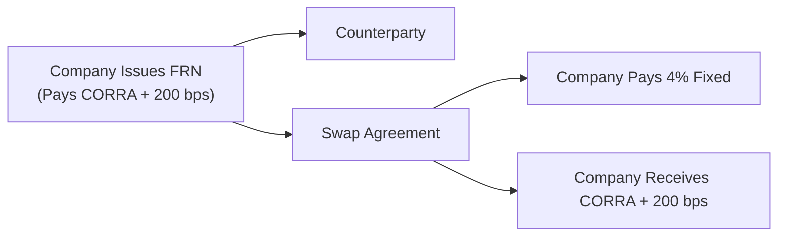
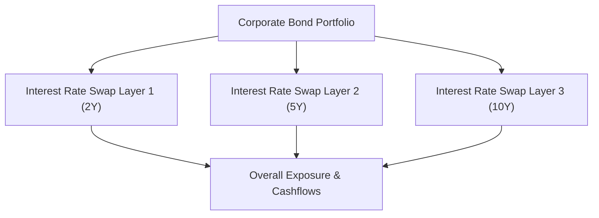

## 10.14 Advanced Uses (Hedging Corporate Bonds or Floating-Rate Notes)

So you've heard about interest rate swaps in previous sections: plain vanilla swaps, day count conventions, and all those mechanical details, right? But you might be wondering: How do organizations really use these instruments in the real world? Well, a huge part of the answer lies in hedging corporate bonds and floating-rate notes (FRNs). In other words, interest rate swaps can be your hidden gem if you're trying to manage the exposure on a corporate bond portfolio or the coupon risk on a brand-new floating-rate issuance.

Why is this so important? Corporations face interest rate volatility all the time. A CFO friend of mine once sighed and said, "We just can't keep guessing where rates will go next quarter." And honestly, who can? Rates can zigzag in surprising ways. That's where interest rate swaps step in as an advanced (but not overly complicated) strategy to stabilize borrowing costs or reduce portfolio risks without necessarily restructuring the entire capital stack.

Below, we'll explore how to use swaps to hedge your corporate bonds or FRNs, how asset managers employ overlay strategies, and where the regulatory frameworks like CIRO in Canada come into play. But let’s keep this conversation a bit informal so we don’t get lost in financial jargon. Buckle up and let’s walk through some practical scenarios together.

### Why Hedging Corporate Bonds or FRNs with Swaps Matters

First things first: A corporate bond is typically a fixed-rate instrument. If you’re an issuer, you pay a fixed coupon to your bondholders. If you’re an investor, you receive that fixed coupon. Floating-rate notes (FRNs), on the other hand, pay a variable coupon tied to a benchmark—like the Canadian Overnight Repo Rate Average (CORRA) or the Secured Overnight Financing Rate (SOFR) in the U.S. If interest rates rise, the FRN coupon resets higher; if rates fall, the coupon resets lower.

Sometimes, that flexible, variable coupon is wonderful for an issuer if the market is stable or if they’re expecting rates to dip. But if you’re worried about rates skyrocketing, you might want to lock in a stable rate. Or maybe you already have a fixed-rate bond portfolio and you’re terrified of interest rate movements hammering your bond prices. In both these scenarios, you can use an interest rate swap to transform your interest rate exposure.

### Transforming a Floating-Rate Note to a Synthetic Fixed-Rate Liability

Imagine you’re the chief financial officer (CFO) of Maple Leaf Widgets Corp., and you’ve just issued a CAD 100 million floating-rate note that resets quarterly at CORRA + 200 basis points. You like the low-floating nature right now, but you’re uneasy. What if interest rates jump 2% in the next year?

Enter the interest rate swap. You can enter into a swap where you pay a fixed rate (say 4%) and receive floating (CORRA + 200 bps). That means:

• Your FRN liability matches the floating rate that you’re receiving on the swap.  
• You pay a fixed rate on the swap side.

The neat thing here is that your net result is effectively paying a fixed coupon. Your floating-rate liability is canceled out by the floating you receive on the swap. The only net outflow over time is that fixed portion to the swap counterparty.

It might look like this in a simple diagram:

Here, the company sets up the swap so they receive the floating rate (matching outflows on the bond) and pay a fixed rate to the counterparty. Net effect: a fixed interest rate structure.

### Hedging a Fixed-Rate Bond With a Pay-Float, Receive-Fixed Swap

Now, flip it around. Let’s say you’re an asset manager holding a big chunk of 10-year corporate bonds yielding 5%. All fine and dandy if you believe rates are going to drop or stay stable, because then your bond’s price might even appreciate. But if the central bank signals rate hikes, you worry the value of those bonds could tumble like tumbleweeds in the wind.

One approach is to quickly sell those corporate bonds. But that might trigger capital gains or losses, or you might not want to disrupt your portfolio for short-term interest rate jitters. So, you do an overlay. You enter a swap where you receive fixed (say 5%) and pay floating (CORRA + some spread). Now your portfolio is effectively immunized from rising rates—what you give up in bond value, you gain from the floating payments. You hold your bonds for income, but the interest rate mismatch is offset by the swap.

This strategy is super popular with portfolio managers who want to “park” a portion of their interest rate exposure without physically selling and re-buying the underlying assets. Meanwhile, the cost of entering the swap is typically minimal compared to the potential transaction costs of selling all those bonds in the open market.

### Reducing Duration Risk With Swap Overlays

In many corporate bond portfolios, duration management is key. Duration is a fancy word for how sensitive a bond’s price is to changes in interest rates. If you hold a bunch of 15-year corporate bonds, your portfolio has a relatively high duration. That can be dangerous if rates are expected to rise. A pay-float, receive-fixed swap shortens your portfolio duration. Meanwhile, a pay-fixed, receive-float swap raises it.

For instance, maybe you want to reduce your portfolio’s duration from 8.0 years to 5.0 years. You can do so by overlaying a sufficient notional amount of pay-float swaps to offset some of that interest rate sensitivity. So that might mean you keep your bond positions intact (yep, those exact corporate bonds in your account remain as is), but you manage your interest rate risk with a derivative that’s more cost-efficient and faster to execute than physically rebalancing your entire portfolio.

### Hedging Embedded Optionality in Corporate Bonds

Some corporate bonds come with embedded calls or puts. For example, your bond might get called away by the issuer if rates drop, or you might have the right to put it back to the issuer if rates rise substantially. Such features complicate your interest rate exposure significantly. You could combine a plain vanilla swap with swaptions or interest rate options to hedge that optionality.

One advanced tactic: you might have a make-whole call on your bond that effectively shortens its duration if interest rates fall. To hedge, you buy an interest rate call option on top of your receive-fixed swap. That call option might recoup some value if the issuer calls the bond, compensating you for the lost coupon stream. This is more specialized territory, but it’s done by many sophisticated bond managers.

### Margin and Regulatory Considerations Under CIRO

You might be thinking, “Sounds great, but how does the regulator see all this?” Well, remember that in Canada, CIRO is the self-regulatory organization overseeing these transactions (since 2023, it replaced IIROC and the MFDA historically). Generally, if you can demonstrate that your swap is a bona fide hedge—meaning it’s truly offsetting risk associated with your underlying position and not just a side bet—then you may be entitled to reduced margin or capital charges.

This approach can significantly lower the cost of carrying these positions. To get that preferential margin treatment, you typically must document the rationale behind your swap transaction, show it’s correlated to the hedged asset or liability, and maintain appropriate records. Some organizations even create policy statements that define the criteria for hedge accounting under IFRS 9, as well as the operational rationale for entering the swaps.

### IFRS 9 Hedge Accounting Guidelines

Speaking of IFRS 9: these guidelines can let you show reduced profit-and-loss volatility from your swaps if they meet hedge accounting criteria. You might remember IFRS 9 replaced IAS 39. Under IFRS 9, you need:

• Documentation of the hedging relationship and objectives.  
• The hedge must be expected to be highly effective.  
• Ongoing verification of the hedge effectiveness.  

In practice, if you’re a corporation hedging your floating-rate debt with a pay-fixed swap, IFRS 9 can allow you to smooth out the changes in fair value from your derivative. Instead of showing big derivative gains/losses in your P&L, they could be offset by changes in the hedged item. This is a big plus for companies wanting stable earnings and fewer “surprises” from market swings.

### Practical Example: Maple Leaf Widgets Corp.

Let’s bring it all together in a hypothetical scenario. Maple Leaf Widgets Corp. issues a 5-year, $100 million floating-rate note at CORRA + 2%. Management invests the proceeds into R&D and expansions. But the CFO, worried about rising rates, decides to pay fixed through a swap. Here’s how the numbers might look:

• Bond: Notional $100 million, pays CORRA + 2%.  
• Swap: Notional $100 million, receive CORRA + 2%, pay a fixed rate of 4%.  
• Effective cost: 4% over the life of the bond (plus or minus any difference if CORRA + 2% goes significantly above or below 4%).  

For accounting, Maple Leaf Widgets Corp. designates the swap as a hedge. Under IFRS 9, changes to the swap’s fair value are recognized in Other Comprehensive Income (OCI) as they effectively offset changes in the FRN’s interest payments. The company can plan its interest expense at around 4%—a stable figure—for the next five years. And from a credit perspective, external investors see that Maple Leaf Widgets has locked in a known interest expense, which might even keep their credit rating more predictable.

### Bond Portfolio Overlay Strategies

If you’re an asset manager or a pension fund holding corporate bonds, you might do the reverse (receive fixed, pay floating) to reduce interest rate risk. Let’s say you have a large suite of 10-year investment-grade corporate bonds. You want to cut your exposure to rising rates while still collecting the credit spread. A straightforward approach:

• Keep the bonds in your portfolio.  
• Enter a receive-fixed, pay-floating swap on a notional that approximates the majority of your bond exposure.  
• Collect the net spread on your corporate bonds (minus the floating rate you pay on the swap).  

Voila! You’ve effectively hedged out the major portion of your interest rate exposure. If rates rise, your bonds’ value might drop, but the swap becomes more valuable (since you’re receiving that higher fixed rate and paying a floating rate that might be going up). This is called a “bond overlay strategy” and is widely used as a cost-efficient method for adjusting portfolio risk.

### Potential Pitfalls and Best Practices

Even though interest rate swaps sound awesome for corporate bond and FRN hedging, watch out for some common pitfalls:

• Credit Risk: Swaps are generally over-the-counter (OTC) instruments. Make sure you have a strong International Swaps and Derivatives Association (ISDA) agreement with your counterparty. Consider clearing solutions (e.g., central clearing) if available, to reduce bilateral credit risk.  
• Basis Risk: Sometimes the index on your bond is not exactly the same as the index on your swap. For instance, you might have a bond tied to 3-month CORRA, but your swap references 1-day CORRA. If there’s a mismatch, your hedge may be imperfect.  
• Cost of Collateral: If your swap requires posting margin or collateral, that could tie up your cash resources. Keep an eye on your liquidity management.  
• Hedge Accounting Complexity: Complying with IFRS 9 is not just ticking a few boxes. You need robust documentation and evidence of hedge effectiveness. If you fail the tests, the derivative’s changes in fair value might hit your P&L.  
• Operational Risks: Some folks might just forget about the ongoing monitoring. You have to periodically check that your hedge ratio is aligned with your actual exposure. If you get sloppy, your hedge might be only partially effective.  

As a best practice, set up internal policies and procedures that document the intended purpose of any swap or swap overlay. Conduct scenario analyses to see how your portfolio stands under different interest rate environments. Many companies use open-source tools like QuantLib for yield curve modeling, scenario generation, or to run “what if” analyses. This helps you avoid nasty surprises when rates move 200–300 basis points in either direction.

### A Quick Note on Swaptions

Swaptions are options on swaps—they give you the right, but not the obligation, to enter a swap in the future. If you suspect that your debt issuance might only need hedging if rates climb past a certain threshold, a payer swaption might do the trick. Or if you hold a callable corporate bond, you might use a receiver swaption to hedge the risk of early redemption. This is advanced territory, but it’s good to be aware of these additional tools when dealing with embedded calls or more nuanced exposures in your bond portfolio.

### Integrating ESG and Sustainability-Linked Swaps

ESG (Environmental, Social, Governance) derivatives have been growing in popularity. Some corporate issuers link their swaps to sustainability targets: if they meet certain carbon reduction goals, the fixed rate they pay might go down a few basis points. If they fail, it might go up. While still relatively new, these structures can also be used for sophisticated hedging. So, if Maple Leaf Widgets Corp. is big on being eco-friendly, they could incorporate performance-based adjustments that tie into their overall interest rate swap structure.

### Regulatory Framework: CIRO and CSA

Remember that the Canadian Investment Regulatory Organization (CIRO) is the main self-regulatory body. The Canadian Securities Administrators (CSA) also set overarching rules on derivatives trade reporting, clearing, and margin. When using swaps for bona fide hedges, you often get margin relief under CIRO’s derivatives rulebook—provided you meet all the recordkeeping requirements. If your hedging transaction is recognized under IFRS 9 and meets the CSA’s definitions, you’ll generally get preferential capital treatment. You can find more details on CIRO’s website at https://www.ciro.ca.

### Using Clearing to Reduce Counterparty Risk

Many forward-based or swap transactions can be cleared through central clearinghouses that act as the buyer to every seller and the seller to every buyer. Clearing can reduce your bilateral credit risk. However, you’ll be subject to initial and variation margin requirements from the clearinghouse. For advanced uses—like a big corporate bond overlay—the stability of cleared swaps might outweigh the additional cost and margin constraints you face.

### Putting It All Together: A Layered Approach

In practice, many companies or fund managers won’t just do one swap. They might layer multiple swaps to shape their exposure across different maturities or yield curve points. For instance, a firm might use a combination of a 2-year pay-fixed swap, a 5-year pay-fixed swap, and a 10-year pay-fixed swap to build a “swap ladder,” matching the cash flow structure of their floating issuance. Meanwhile, they might also use long-dated receive-fixed swaps on a portion of their bond portfolio that’s beyond 10 years. By mixing and matching, they fine-tune the exposures precisely.

### Key Terms (Glossary)

• **Corporate Bond Hedge**: Using swaps or other derivatives to neutralize or reduce interest rate exposure tied to corporate debt.  
• **Floating-Rate Note (FRN)**: A debt instrument whose coupon resets periodically based on a benchmark (e.g., CORRA or SOFR).  
• **Bond Portfolio Overlay**: A derivative strategy (often swaps) applied to a bond portfolio to modify duration, yield curve exposure, or other risk factors without altering the underlying securities.  
• **Bona Fide Hedge**: A documented, legitimate hedging transaction recognized by regulators for favorable margin or capital treatment.  

### References and Additional Resources

• CIRO Derivatives Rulebook on Hedging Exemptions: https://www.ciro.ca  
• IFRS 9 Hedge Accounting Guidelines: Search for the official IFRS website for in-depth documentation.  
• Marshall, John F. (2001). “Financial Engineering: Derivatives and Risk Management.” A detailed text for advanced hedging cases.  
• QuantLib (https://www.quantlib.org/), an open-source library for modeling, pricing, and risk management, particularly helpful for scenario analysis.  
• “Swaps and Other Derivatives” by Richard Flavell (for more advanced swap pricing and hedging theory).

### Concluding Remarks

I get it—interest rate swaps can sound daunting. But truly, for corporates and asset managers dealing with corporate bonds or floating-rate debt, these instruments are among the most versatile tools available. They let you maintain or modify your underlying holdings while shaping your interest rate risk profile to match your outlook, liquidity constraints, and accounting preferences. Once you’ve got the right documentation, an understanding of IFRS 9, and a good handle on your exposures, using swaps to hedge your corporate bonds or FRNs can unlock a stable, predictable cash flow structure and reduce the volatility lurking in your portfolio.

Sure, you might have to do a fair bit of operational work—aligning with CIRO regulatory guidelines and ensuring effective hedge accounting—but the payoff is peace of mind in an ever-shifting interest rate landscape. Ultimately, these advanced uses of swaps are less about chasing complex trades and more about ensuring stability, lowering risk, and making sure your corporation or bond portfolio can weather unexpected rate movements.

---

## Sample Exam Questions: Advanced Uses in Hedging Corporate Bonds or Floating-Rate Notes



### Which of the following describes how a company can use a swap to convert a floating-rate note into a synthetic fixed-rate liability?

- [x] Enter a swap to receive floating and pay fixed.
- [ ] Enter a swap to pay floating and receive fixed.
- [ ] Combine a swaption with a futures contract.
- [ ] There is no way to convert a floating note into a fixed note using swaps.

> **Explanation:** By receiving the same floating rate on the swap that they pay on the note and paying a fixed rate to the swap counterparty, they transform the floating-rate note into a synthetic fixed-rate liability.

### Which statement best describes a bond portfolio overlay?

- [ ] A strategy that only adds more bonds to a portfolio if interest rates drop by a fixed percentage.
- [x] Using derivatives (often interest rate swaps) to modify a portfolio’s duration or yield curve exposure without physically rebalancing the bonds.
- [ ] An arrangement to secure over-the-counter bond trades at a lower cost than exchange-traded products.
- [ ] A technique that automatically reinvests bond coupon payments into zero-coupon bonds.

> **Explanation:** A bond portfolio overlay employs swaps or futures to hedge or adjust exposure to interest rates, curve risk, or volatility without altering the underlying bond holdings.

### Under IFRS 9 hedge accounting rules, which of the following is required for a hedging relationship to qualify?

- [x] The hedge must be documented and expected to be highly effective.
- [ ] The hedge must always include both a swap and a swaption.
- [ ] The entity must designate more than 50% of its total assets for hedging.
- [ ] The hedge must rely solely on exchange-traded products.

> **Explanation:** IFRS 9 requires formal documentation and an expectation the hedge will remain highly effective, along with ongoing effectiveness testing. The other statements are incorrect.

### What is a key advantage of using a swap overlay rather than selling a fixed-rate bond portfolio outright?

- [x] It avoids the need to close out positions in the underlying bonds, reducing transactional costs and market impact.
- [ ] It qualifies for zero margin requirements in all circumstances.
- [ ] It guarantees higher profits if interest rates decrease.
- [ ] It requires no documentation or compliance under CIRO.

> **Explanation:** Swaps allow portfolio managers to efficiently hedge interest rate risk without incurring the costs, taxes, and operational hurdles of liquidating the entire bond portfolio. But they don’t guarantee profit nor grant automatic zero margin.

### If a firm wants to hedge a corporate bond that has an embedded call option, which derivative might be combined with a plain vanilla swap?

- [x] A swaption.
- [ ] A forward rate agreement.
- [ ] An exchange-traded foreign currency option.
- [ ] A commodity futures contract.

> **Explanation:** A swaption provides optionality in entering a swap and can help hedge the embedded call feature in a corporate bond.

### Which of the following is a potential pitfall when hedging a fixed-rate bond portfolio with an interest rate swap?

- [ ] Guaranteed improvement in bond performance.
- [ ] Reduction of credit risk associated with the corporate bond issuer.
- [x] Basis risk if the bond’s reference rate doesn’t match the swap’s.
- [ ] Immunity from all market risks.

> **Explanation:** Even if you’re receiving fixed and paying floating, mismatching indices or using different reference rates can create basis risk, which weakens the hedge effectiveness.

### What does it mean to have a “bona fide hedge” under regulatory guidelines?

- [ ] A swap transaction executed solely for speculation in the bond market.
- [ ] A hedge that is only permitted for institutional clients and not retail accounts.
- [x] A legitimate hedging transaction recognized by regulators (CIRO/CSA) for reduced margin or capital treatment.
- [ ] Any hedging strategy with a notional amount exceeding $100 million.

> **Explanation:** A bona fide hedge is formally recognized by regulators as a legitimate means to offset risk. It often receives favorable margin or capital requirements, provided the hedge is well-documented.

### Which of the following best illustrates the net result of pay-fixed, receive-floating on a newly issued FRN?

- [ ] The entity benefits if the floating rate goes up, as it receives fixed.
- [ ] The entity’s liability is constant if the floating rate goes down, as it pays floating.
- [ ] The net effect is the same as paying a floating rate net, unaffected by interest rate volatility.
- [x] The floating payments on the FRN are offset by the floating received on the swap, resulting in a fixed-rate liability.

> **Explanation:** By using pay-fixed, receive-floating, a firm with an FRN effectively locks in a fixed interest rate, as the floating leg of the swap offsets the FRN payments.

### Why might asset managers prefer swap-based overlays to selling and re-buying the underlying bonds?

- [x] Overlays typically reduce transaction costs, market impact, and potential capital gains taxes.
- [ ] Overlays are only permitted for government bonds under IFRS 9.
- [ ] Overlays eliminate the need to monitor the market after initial setup.
- [ ] Overlays are risk-free by their very nature.

> **Explanation:** Derivative overlays allow managers to fine-tune risk exposures without incurring the substantial costs or taxes from actually liquidating and repurchasing bonds in the open market. They are not risk-free, but they can be more efficient.

### True or False: Swaps can be adapted into ESG or sustainability-linked structures where the fixed rate is adjusted according to certain sustainability performance metrics.

- [x] True
- [ ] False

> **Explanation:** Sustainability-linked swaps are emerging, wherein the swap's fixed rate or floating spread is adjusted based on whether the issuer meets specified ESG targets.


