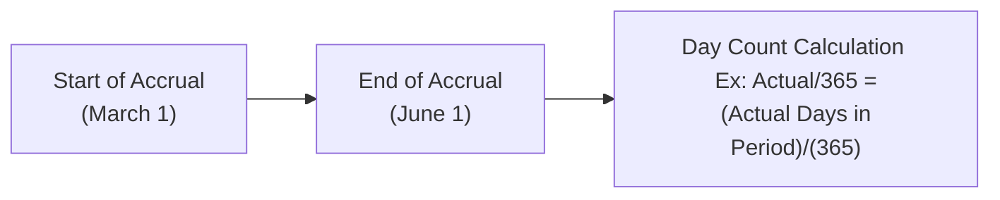

## 10.2 Rate & Day Count Conventions

There was a time, back when I was just getting my feet wet in derivatives, when a small difference in day count conventions nearly led to a big headache. I was working on an interest rate swap where one side insisted on Actual/365 (fixed) while the other side’s documentation called for 30/360. It might sound trivial at first—how could something as small as the size of the “day” cause confusion? But oh, it can. These details, in finance, translate directly to money. If the day count is off by even a fraction, you could end up paying more (or receiving less) interest than you expected. For large notional amounts, that difference can be significant.

This section explores the key dimensions of day count conventions and the rate setting methods in interest rate swaps. We’ll cover the major conventions, how they’re used in Canada and globally, and why they matter so crucially. We’ll also look at how these conventions are changing with the global shift away from legacy benchmarks like LIBOR and, in Canada’s case, from CDOR to CORRA. Let’s jump in.

  
### What Are Day Count Conventions?

A day count convention is essentially a rulebook for counting how many days are in an accrual period and how to compute the fraction of a year for interest calculations. Different markets, currencies, and instruments often use different conventions. Sometimes the differences arise from local tradition. Other times it’s about achieving certain “standardization” in specific markets—like the bond market in the US or the overnight rates in Canada. But the outcome is always the same: the day count convention sets the coupon or interest calculation for a given timeframe.

In interest rate swaps, one party typically pays a fixed rate on a notional principal, while the other party pays a floating rate (often based on some recognized benchmark). Each side’s interest payment is calculated by combining:

• The notional amount (just a reference amount).  
• The agreed-upon interest rate (fixed or floating).  
• The day count fraction (defined by the day count convention).  

So if you’re paying 5% fixed on a notional of $10 million for a three-month period, the interest due is:


\text{Interest for the period} = \text{Notional} \times \text{Interest Rate} \times \text{Day Count Fraction}.


But the day count fraction can vary dramatically based on the convention. And that fraction is what decides your cash flows.

### Common Conventions in Practice

While there are many day count conventions in the world, you’re most likely to see a handful of them on a regular basis in interest rate swaps. Let’s break down three of the most common:

**Actual/365 (Fixed)**  
This approach counts the actual number of days in the accrual period and divides by 365, regardless of whether it’s a leap year or not. For example, if your accrual period runs for 92 days, your fraction is \\( 92 / 365 \approx 0.2521 \\). So if your notional is $10 million and your annual rate is 5%, you pay:


10{,}000{,}000 \times 0.05 \times \frac{92}{365}= \$126{,}301.37


This convention is frequently found in Canadian swap transactions for certain sterling or Canadian dollar benchmarks, especially if the documents explicitly say “Actual/365 (fixed).”  

**Actual/360**  
Here, you again count the actual number of days in the period, but you divide by 360. This method is popular in money market instruments and is still widely used in Europe (e.g., EURIBOR-based swaps often adopt Actual/360). It’s also common in US dollar floating-rate calculations (like older LIBOR-based or modern SOFR-based transactions) because the money market conventions in the US historically used 360-day years.

One might ask: “Why 360?” Well, the older banking conventions simplified calculations by imagining each month has 30 days. Although a bit old-fashioned, it persists because of the liquidity in these markets and the embedded custom over many decades.

**30/360**  
Sometimes referred to as a “bond basis” method, 30/360 is a more standardized approach for certain corporate or government bond calculations. Consider each month to have 30 days—no matter if it’s February, March, or December—and each year to have 360 days total. This is often used on the fixed leg of US-dollar-denominated interest rate swaps or in some corporate bond issues where standardization of interest calculations across different months is desirable.

The difference in results can be subtle or dramatic, depending on how many days are in your accrual period. A mismatch between parties—like paying 30/360 on one side versus Actual/365 on the other—can lead to unintended consequences if not spelled out in the swap confirmation.

### Why These Conventions Matter

When we look at interest rate swaps, we’re dealing with notional amounts that can be anywhere from $1 million up to $100 million or more (especially in institutional or corporate contexts). If the day count fraction for a three-month period shifts from, say, \\( \frac{90}{360} = 0.25 \\) under 30/360, to \\( \frac{90}{365} \approx 0.2466 \\) under Actual/365, that 0.0034 difference over a large notional can very quickly translate to thousands of dollars. If you find yourself on the losing end of that mismatch, you won’t be thrilled.

Another reason is the regulatory environment. Whether you’re clearing your swap through a recognized clearing agency—like the Canadian Derivatives Clearing Corporation (CDCC) or another clearinghouse—or holding it bilaterally, ensuring you have consistent day count references can help avoid compliance or legal issues. CIRO (the Canadian Investment Regulatory Organization)—the national self-regulatory organization overseeing investment dealers—requires accurate reporting and margin calculations, and day count misunderstandings can create operational and settlement issues.

If you’re aiming to hedge or value your swap positions accurately, you absolutely need to account for the correct day count method. Overlooking this piece can produce inaccurate valuations and hamper risk management decisions. In short, day count conventions power the engine that drives your cash flow calculations.

### Currency Variations in Day Counts

Day count conventions aren’t universal—each currency or region often has its own approach. Let’s explore just a few aimed at interest rate swaps:

• **EURIBOR (Euro Interbank Offered Rate):** Generally uses Actual/360 for floating interest payments.  
• **GBP SONIA (Sterling Overnight Index Average):** Tends to use Actual/365.  
• **USD SOFR (Secured Overnight Financing Rate):** Typically Actual/360.  
• **CAD CORRA (Canadian Overnight Repo Rate Average):** Generally Actual/365.  

Historically, many Canadian dollar swaps referencing CDOR (the now-deprecated Canadian Dollar Offered Rate) also used Actual/365 for floating calculations. As the market transitions from CDOR to CORRA, participants must be vigilant about any changes in day count, resetting methodology, and compounding conventions. If you’re rolling an old CDOR-based swap into a new CORRA-based swap, or comparing them side by side, an easy trap is to assume that the day count convention is the same. Always check your documentation or it might be the costliest “small detail” you’ve ever ignored.

### Payment Frequency and Rate Resets

Payment frequency refers to how often the interest rate is locked in (for a floating rate) and paid (or simply accrued) in the swap. You might see quarterly payments on the floating side and semi-annual payments on the fixed side. That’s a pretty standard arrangement for many interest rate swaps. But day count conventions can still differ on each side, even if the payment frequency is the same.

For a standard “plain vanilla” Canadian swap referencing CORRA, you might see:

• **Floating Leg:** Pays or receives CORRA-based rate, reset daily or every business day, then aggregated and paid quarterly. The day count might be Actual/365.  
• **Fixed Leg:** Might pay at a semi-annual frequency on a 30/360 basis, or possibly Actual/365, depending on the contract.  

Every single detail—reset dates, payment dates, day count—should be outlined in the swap confirmation. If it’s not, you want to clarify (and fast). Misalignment in day counts has historically been one of the sneakiest sources of dispute.  

  
### Examples of Day Count Calculations

Below is a simple example to illustrate how day count differences can have a tangible effect on your swap payments.

Let’s say you have a notional of $20 million. Over a 91-day accrual period, you are paying a fixed rate of 4.00% per annum.

1) Under **30/360**, 91 days would typically be interpreted as 3 months of 30 days each = 90 days. So the fraction is \\( 90/360 = 0.25 \\).  
Interest = \$20{,}000{,}000 \\(\times\\) 0.04 \\(\times\\) 0.25 = \$200{,}000.

2) Under **Actual/365**, if it’s exactly 91 calendar days, the day count fraction is \\( 91/365 \approx 0.2493 \\).  
Interest = \$20{,}000{,}000 \\(\times\\) 0.04 \\(\times\\) 0.2493 = \$199{,}440.

That’s a \$560 difference across just a single accrual period. Over multiple accruals or with a higher notional, the gap widens quickly.

  
### Visualizing Day Count Conventions

Here’s a simple Mermaid flowchart to illustrate how a day count fraction might be calculated between two dates in a hypothetical quarter:

In the above (very simplified) timeline, you begin accruing interest on March 1 and end on June 1. The “actual days” portion in Actual/365 is determined by counting every day within that window. If you used 30/360, you’d approximate each of those months as 30 days, ignoring month length differences in March, April, and May.

### Confirmations and Avoiding Disputes

In practice, your final word on these matters is the **swap confirmation** or the official agreement referencing the relevant ISDA definitions. Typically, an interest rate swap is governed by an ISDA Master Agreement plus a Schedule and a Confirmation. Within that Confirmation, you’ll find explicit instructions:

• The Floating Rate Index (e.g., CORRA, SOFR, EURIBOR).  
• The day count basis (Actual/365, Actual/360, 30/360, etc.).  
• The payment frequency for each leg.  
• The reset frequency and any compounding methodology.  
• The notional principal and amortization, if any.  
• Any specific provisions in the event of market disruptions.

Ensuring that each party has read the exact language—and that you double-check any differences between the floating and fixed legs—is crucial. People sometimes rely on memory or market norms (“Oh, I assumed we always do Actual/365 for CAD.”), but that can be a big oversight.  
  

### Transition from CDOR to CORRA

Canadian markets have historically settled many swaps referencing CDOR. Starting in June 2023, the industry has accelerated efforts to move to CORRA-based benchmarks, reflecting a global push away from LIBOR-like rates. CORRA is considered more robust and is published by the Bank of Canada based on overnight repo transactions. Its day count standard is typically Actual/365, and the methodology for daily compounding can be slightly different from older CDOR-based calculations.

Keep in mind the Bank of Canada and CIRO have published guidance on best practices for CORRA-based swaps. If you want to see the technicalities for how day count conventions or compounding might shift, the **Bank of Canada Day Count Guides** (https://www.bankofcanada.ca) and **CSA Staff Notices on OTC Derivatives** (https://www.securities-administrators.ca/) are excellent starting points.  

  
### Regulatory Framework in Canada

All derivatives activities in Canada are subject to oversight by the Canadian Securities Administrators (CSA) and by CIRO for investment and mutual fund dealers. CIRO (https://www.ciro.ca) sets the rules for dealer member firms and enforces standards of conduct. If you’re a dealer inputting your client’s swap trades, you must ensure that the day count details and rate conventions align with the disclosures and that your clients understand how their payments are being calculated. This is not just about being nice—it’s about abiding by margin guidelines, financial disclosures, and ensuring best execution practices.

  
### Best Practices and Pitfalls

• **Always read the fine print:** Even if you or your counterparty “typically” uses a certain convention, do not assume it’s universal.  
• **Cross-currency caution:** For cross-currency swaps, you might have to handle completely different day count practices in each leg. One might be Actual/360, and the other might be 30/360 or Actual/365.  
• **Keep an eye on new benchmarks:** With the LIBOR, CDOR, and other IBOR transitions, new day count or compounding methods might apply to the replacement rates (e.g., daily compounding in arrears, etc.).  
• **Software updates:** Make sure your internal systems reflect the correct day count rules for each currency and each new product. (I remember one time our system was out of date, and we had to adjust thousands of dollars in interest over a small mismatch. Not fun.)  
• **Reconciliation:** Perform periodic checks of your counterparties’ calculations. Settlement disputes often arise from something as straightforward as a day count mismatch.  

  
### Practical Tools and Further Reading

For those of you who love diving into the details:

• **Bank of Canada Day Count Guides:**  
  https://www.bankofcanada.ca  

• **CIRO Rules on Derivatives Supervision:**  
  https://www.ciro.ca  

• **CSA Staff Notices on OTC Derivatives:**  
  https://www.securities-administrators.ca/  

• **The Handbook of Fixed Income Securities** by Frank Fabozzi:  
  A classic reference for day count conventions and much more in fixed-income markets.  

You’ll find open-source financial libraries (for instance, some Python-based libraries like QuantLib) that can handle day count calculations automatically, so you don’t have to become the “human day-count calculator.” But it’s always wise to understand the logic behind the library so you can sense-check the results.  

### Summary Thoughts

At its heart, the day count convention is about fairness and accuracy. It aims to ensure that interest, which is earned or owed over time, reflects the real or standardized number of days in that period. Before you step into any swap, double-check that piece of the contract. Trust me, you’ll spare yourself those late-night phone calls about, “Wait, I thought we were using 30/360. You used Actual/365?”

As the Canadian market pivots more fully from CDOR to CORRA, the details of day count conventions will remain extremely relevant. The good news is that once you’ve nailed down the basics, it’s not that daunting. It’s just about paying attention to the fine print. If you stay mindful of the difference between Actual/360, Actual/365, and 30/360, you’ll have a big advantage in managing your interest rate swap exposures responsibly.

Keep these insights in your back pocket. They’ll protect you from the all-too-common scenario of misaligned expectations, settlement shortfalls, or disputes. Next time someone shrugs off the day count convention as a mere detail, let them know (politely, of course) that those “mere details” have real cash-flow implications. Because they do.

## Sample Exam Questions: Rate & Day Count Conventions



### Which of the following statements best describes a day count convention in interest rate swaps?

- [ ] It is a method of assigning the notional principal to each leg of the swap.
- [x] It is a system for determining how many days are counted in an accrual period and how interest is calculated.
- [ ] It is the mechanism that fixes the exchange rate in cross-currency swaps.
- [ ] It is a regulatory rule governing the maximum length of a swap contract.

> **Explanation:** A day count convention dictates how to count the days in an interest period and how to calculate fractions of a year for interest calculations.

### Under a 30/360 convention, how are months and years treated?

- [x] Each month is assumed to have 30 days, resulting in a 360-day year.
- [ ] Each month is counted by its actual number of days, resulting in a 365-day year.
- [ ] Each month is averaged to 31 days, resulting in a 372-day year.
- [ ] Each month is assumed to have 28 days, resulting in a 336-day year.

> **Explanation:** 30/360 assumes every month has 30 days, giving a 360-day year for interest calculations, which standardizes differences in month lengths.

### A swap's floating leg is referencing EURIBOR. Which day count convention is most commonly used for EURIBOR?

- [ ] Actual/365 (fixed)
- [x] Actual/360
- [ ] 30/360
- [ ] Actual/Actual

> **Explanation:** EURIBOR generally uses an Actual/360 convention for the calculation of interest.

### You have a notional of CAD 10 million on a three-month swap period (90 days). Under Actual/365 (fixed), how is the day count fraction typically computed?

- [x] 90 / 365
- [ ] 90 / 360
- [ ] 30 / 360
- [ ] 365 / 90

> **Explanation:** Actual/365 (fixed) divides the actual days in the period by 365, regardless of leap years.

### Under a plain vanilla Canadian rate swap transitioning from CDOR to CORRA, what should participants pay special attention to?

- [ ] The switch from quarterly to monthly payments
- [x] Potential change in day count convention and rate resetting methodology
- [ ] Lower notional amounts
- [ ] Abolition of payment frequencies

> **Explanation:** CDOR to CORRA transitions can involve changes to the day count approach and resetting methods, so confirming the new details in the swap documentation is critical.

### If a swap is governed by 30/360 on the fixed leg and Actual/365 on the floating leg, what is a potential risk?

- [x] Mismatch in interest accrual leading to disputes over payment amounts.
- [ ] Forced conversion of the notional into another currency.
- [ ] No possibility of early termination.
- [ ] Mandatory monthly compounding.

> **Explanation:** Using different day count conventions on two legs can create differing accrual amounts, risking disputes. This is why the swap confirmation must be clear and consistent.

### Which entity in Canada primarily sets the standards for margining and oversight of derivatives trading by dealer members?

- [ ] MFDA (Historical SRO)
- [x] CIRO
- [ ] SEC
- [ ] OCC

> **Explanation:** CIRO (Canadian Investment Regulatory Organization) oversees investment dealers and sets margin requirements for derivatives in Canada.

### Let’s suppose your swap confirmation omitted explicit mention of any day count convention. What might be the best immediate action?

- [ ] Proceed assuming standard market practice.
- [x] Clarify and amend the confirmation to include the correct day count convention.
- [ ] Assume it defaults to Actual/Actual.
- [ ] Cancel the swap transaction entirely.

> **Explanation:** If your confirmation is missing an explicit day count convention, you should clarify and document it in writing before finalizing. Assuming is risky and can create legal/settlement issues.

### Regarding a notional of $100 million and a rate difference due to a day count mismatch of 0.0025, how significant could the discrepancy be for a single accrual period?

- [x] Potentially thousands of dollars in difference
- [ ] Absolutely zero because day counts are negligible
- [ ] Less than a penny for every $1 million
- [ ] Double the notional amount in interest

> **Explanation:** Even a small fraction can lead to a substantial dollar difference when dealing with large notionals. 0.0025 on a $100 million can be $250,000 times the interest rate factor, which is significant.

### True or False? EURIBOR-based swaps almost always use Actual/365 for floating interest calculations.

- [ ] True
- [x] False

> **Explanation:** EURIBOR-based swaps predominantly use Actual/360.  


