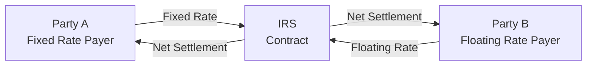

## 10.3 The Structure of an Interest Rate Swap

Imagine you’re sitting at a coffee shop with a friend who’s anxious about rising interest rates on their business loan. Suddenly, they mention that their bank offered them something called an “interest rate swap” to manage that risk. They turn to you and ask: “What is that swap thing about, anyway?” Well, let’s map it out step by step in practical terms—just like explaining it to someone who’s brand new to these concepts, but also exploring enough nuts and bolts for advanced learners. And remember, everyone starts somewhere, so let’s tackle the building blocks one at a time.

---

### Why a Well-Defined Structure Matters

An interest rate swap (IRS) can be described as a handshake deal between two parties to exchange interest rate cash flows, usually fixed for floating. The handshake, however, isn’t a mere verbal agreement—it’s thoroughly documented using legal agreements and confirmations. This structure ensures clarity: “Who pays fixed?” “Who pays floating?” “How often?” and “What happens if I want out?” get answered in black and white.

The structure is crucial because it defines the rights and obligations of both parties, reduces confusion, and accounts for every major “what-if” scenario possible (such as early termination). It also clarifies any credit risk mitigants, including collateral or regulatory requirements like mandatory clearing under Canadian regulations. In a typical scenario, you’ll see references to an ISDA Master Agreement (which truly rules them all in derivative land), a Schedule that customizes specific terms, and a Confirmation that effectively pins down the final details of each individual swap.

---

### The Three Core Documents

#### ISDA Master Agreement

The foundational document for most over-the-counter (OTC) derivative transactions is the International Swaps and Derivatives Association (ISDA) Master Agreement. Historically, it replaced a hodgepodge of multiple, varied contracts with a single standard blueprint. Now, nearly everyone in the derivatives world uses it to define:

• Events of default and termination  
• Payment netting provisions  
• Definitions of key terms  
• Representations, warranties, and covenants  

Think of the ISDA Master Agreement as the skeleton or framework: it applies to all derivative transactions you do with a given counterparty. If you have multiple swaps or other OTC products with the same party, they all rely on the same Master Agreement for consistency.

#### The Schedule

The Schedule acts as an appendix to the Master Agreement. When two parties sign an ISDA Master, they might also add or modify certain provisions in the template to match their specific preferences or local laws.

For instance, you might see additional disclaimers about local bankruptcy rules or amendments to how close-out netting is handled. The Schedule is your chance to tailor the generic (but globally recognized) ISDA terms to your unique situation.

#### Confirmation

Finally, the Confirmation is the specific instruction sheet for each swap. Think of it like the “receipt” that details the exact economics of the trade:

• Notional amount (the underlying principal on which we base the interest calculation)  
• Who’s paying fixed and at what rate  
• Who’s paying floating and based on which benchmark (e.g., CORRA in Canada, SOFR in the U.S., or EURIBOR in Europe)  
• Day count convention (30/360, Actual/365, etc.)  
• Payment frequency (e.g., quarterly, semi-annually)  
• Start date and maturity date  
• Any optional early termination features  

The Confirmation ensures each party knows exactly what’s expected of them—like the difference between paying 5% fixed quarterly vs. receiving a floating rate linked to CORRA plus 25 basis points, reset monthly.

---

### Typical Flow: Fixed vs. Floating

Once the documents are in place, how does the cash actually move? Let’s break it down simply. Party A agrees to pay a fixed rate, while Party B pays a floating rate. Each rate is multiplied by the notional principal to calculate the interest payment.

• Many interest rate swaps only exchange net amounts. If Party A owes $120,000 and Party B owes $110,000 on the same day, a net settlement of $10,000 (Party A paying the difference) might be all that happens in practice.  
• The notional principal itself usually never changes hands; it’s only the difference in interest amounts.  

A quick demonstration can help. Let’s say the notional is CAD 10 million. Party A pays a fixed 3% annual rate, while Party B pays CORRA + 0.50%. On every settlement date, each side calculates what they owe, then the difference is exchanged. Because these amounts revolve around interest rate differentials, each party is effectively locking or hedging an aspect of their interest rate exposure.

---

In the diagram above, “Party A” and “Party B” are the two counterparties. One pays a fixed rate, the other pays a floating rate, and the net settlement flows in whichever direction the difference is owed.

---

### Day Count Conventions and Payment Frequency

It might seem like a small detail to mention that “day count convention” is critical, but it truly is. Essentially, the day count convention clarifies how you count the number of days in an interest period:

• 30/360: Each month has 30 days; a year is 360 days.  
• Actual/365: Use the actual calendar days, but consider 365 days for a year.  
• Actual/360: Actual days, but treat a year as 360 days.  

Payment frequency is how often the settlements occur—quarterly, semi-annually, annually, etc. This might be chosen based on the market standard (in many markets, floating rates reset every three months, matching LIBOR or CORRA resets, though now we are in the era of post-LIBOR for many currencies).

A mismatch in day count conventions between the two legs can drastically affect the amounts owed. So the Confirmation always clarifies if the floating leg uses Actual/365, the fixed leg uses 30/360, etc.

---

### Payment Netting

One of the biggest headaches in finance can be figuring out who owes whom what, especially when multiple transactions or multiple payments are happening simultaneously. Payment netting solves that problem by “netting” the obligations across trades or across payment streams, so only the difference changes hands.

Inside the ISDA Master Agreement, you usually see a section about netting. On each settlement date, the terms allow for netting out payments of the same type and currency. So if Party A owes $2 million and Party B owes $1.5 million, you net to $500,000. Payment netting streamlines operational burdens and reduces credit risk exposure because fewer gross cash transfers happen.

---

### Collateral Arrangements (Credit Support Annex)

Swaps carry credit risk: each counterparty wonders, “What if the other side can’t pay?” Collateral arrangements, often documented in the Credit Support Annex (CSA) appended to the ISDA Master Agreement, address this concern. Under the CSA:

• Counterparties agree on what types of collateral are acceptable (cash, government bonds, etc.).  
• They define thresholds—if your mark-to-market exposure exceeds a certain amount, you have to post collateral.  
• There might be rules on how frequently collateral is valued and how margin calls are made.  

In Canada, CIRO rules and CSA National Instrument 94-101 (Mandatory Central Counterparty Clearing of Derivatives) impose certain margin or clearing mandates for specific swaps. If your interest rate swap is large enough or fits a certain classification, you might clear it through a recognized clearinghouse. That means daily margining becomes standard, and the central counterparty (CCP) stands between you and your counterparty to mitigate credit risk.

---

### Early Termination Clauses and Breakage Costs

Sometimes you just need out. Maybe you decide to refinance a loan or you want to lock in a different type of hedge. Swaps can include early termination options, but you might face breakage costs if the market has moved in your favor (or against you).

Let’s say you’re a pension fund that no longer wants your floating rate exposure. If you terminate a swap early, you’ll generally settle the net present value of the remaining expected cash flows. These early termination fees can sometimes be large, so it’s crucial to account for them in your risk planning. The specifics of how breakage or termination amounts are calculated can appear in both the Schedule and the Confirmation.

---

### Incorporating Regulatory Constraints

In Canada, certain institutional investors, such as pension funds or insurance companies, may face additional regulatory constraints. For instance, a provincial pension regulator might limit how large a derivatives position can be compared to total plan assets or impose stricter reporting requirements.

Meanwhile, if a swap meets thresholds for mandatory clearing, it goes to a clearinghouse. That process reduces bilateral credit risk but introduces the concept of requiring initial and variation margin at the CCP. The result? Additional overhead in terms of collateral management.

CIRO also provides a comprehensive rulebook on margin requirements and capital adequacy guidelines for Canadian dealers. With the merger of IIROC and MFDA into CIRO (as of 2023), members now follow a single set of national regulatory standards.

---

### A Personal Anecdote: Learning by Doing

Years ago, I had a super enthusiastic colleague who jumped into an interest rate swap without fully reading the Confirmation. They knew the basic storyline: pay fixed, receive floating. But—surprise!—the floating rate was calculated using Actual/365 while the fixed side was 30/360, and the reset dates didn’t match up with their company’s regulatory reporting cycle. They ended up with a mismatch that was both complicated and more expensive than expected. The moral of the story? Always read the fine print. This might sound obvious, but I can’t emphasize enough how day count convention, payment frequency, and netting provisions can alter your cost structure.

---

### Real-World Example

Let’s say we have two parties: Maple Bank (a Canadian bank) and Prairie Energy Corp. Prairie Energy wants to lock in stable interest costs for a planned infrastructure project. They sign an interest rate swap with these details:

• Notional: CAD 50 million  
• Tenor: 5 years  
• Maple Bank pays Prairie Energy: floating at CORRA + 0.80%  
• Prairie Energy pays Maple Bank: fixed at 3.20% (annualized)  
• Day count convention: Fixed leg uses 30/360, floating leg uses Actual/365  
• Payments: Quarterly net settlement  

They finalize the ISDA Master Agreement, sign the Schedule with modest changes (like clarifying a local corporate law clause), and pin down the exact details of the swap in the Confirmation. Maple Bank might require Prairie Energy to post collateral if the mark-to-market exposure climbs above a negotiated threshold, or if Prairie Energy’s credit rating drops. Meanwhile, Prairie Energy might have the right to terminate the swap early if Maple Bank merges with another institution that doesn’t meet their credit risk criteria—something spelled out in an “Additional Termination Event” clause in the Schedule.

---

### Common Pitfalls

• **Ignoring the Schedule:** Sometimes, parties sign a “vanilla” ISDA Master but forget that the default clauses in the Master Agreement might not suit their local laws or business model. Carefully customizing the Schedule is crucial.  
• **Mismatch in Reset Dates:** If your floating rate resets on the 1st of each month but your loan resets on the 15th, you might be unhedged for half the month.  
• **Collateral Surprises:** Some parties are caught off guard by a margin call, especially if markets move sharply. Having the liquidity to manage margin calls is key.  
• **Underestimating Breakage Costs:** Early termination can be expensive. If you’re uncertain about the swap’s full term, look into flexible structures like swaptions or shorter-dated instruments.  

---

### Best Practices

• **Clarity on Notional Amount:** The notional is rarely exchanged; it’s a reference number. But ensuring it matches your hedge exposure (like your outstanding loan balance) is essential.  
• **Mark-to-Market Monitoring:** Keep an eye on the swap’s current value. If it moves significantly, anticipate potential margin calls (under your CSA) or changes to your credit line.  
• **Documentation is Key:** Carefully read or have legal counsel review the Confirmation. The devil hides in the details—like rounding conventions, fallback rates (in case your reference rate is discontinued), or forced changes if market conditions shift.  
• **Stay Informed on Regulatory Changes:** Canada’s shift from CDOR to CORRA, global LIBOR phase-outs, and centralized clearing mandates can all affect how your swaps function.  

---

### KaTeX Formula for Net Payment

Sometimes you want to see how net payment is calculated in a single expression. Suppose:

• \\( R_f \\) is the fixed rate,  
• \\( R_{\mathrm{float}} \\) is the floating rate for the period,  
• \\( D \\) is the day count fraction for the period,  
• \\( N \\) is the notional principal.  

Then the fixed leg payment for that period might be:

\text{Fixed Leg Payment} = R_f \times D \times N

Meanwhile, the floating leg payment might be:

\text{Floating Leg Payment} = R_{\mathrm{float}} \times D \times N

And the net payment for that period (assuming netting and the floating rate payer owes the difference) could be:

\text{Net Payment} = (\text{Floating Leg Payment} - \text{Fixed Leg Payment})

Of course, if the result is negative, it indicates the fixed rate payer owes the difference instead.

---

### Additional Resources

• **CSA National Instrument 94-101** (Mandatory Central Counterparty Clearing of Derivatives): covers the clearing requirements for certain interest rate swaps in Canada.  
• **CIRO** (Canadian Investment Regulatory Organization): for margin, capital adequacy, and oversight guidelines on derivatives used by licensed Canadian dealers.  
• **ISDA Market Practice Guidelines**: [https://www.isda.org/](https://www.isda.org/)  
• **“Swaps and Other Derivatives” by Satyajit Das**: A more advanced deep dive into structuring, risk management, and documentation.  

And if you want an open-source tool to experiment with hypothetical swap valuations, you might try Python-based libraries like “QuantLib,” which allows you to model the cash flows, discounting, and day count nuances. You can set up a quick script to see how your fixed vs. floating leg valuations shift as interest rates move.

---

### Pulling It All Together

An interest rate swap’s structure is both elegant (pay fixed, receive floating, done) and complex (what’s the day count convention, how do we handle default, what is the reference rate, who posts collateral?). The key is to remember that each part of the swap’s documentation layer—ISDA Master, Schedule, and Confirmation—plays a crucial role in ensuring the trade goes smoothly. Once you grasp these concepts, you’ll be better equipped to compare different derivatives or weigh the pros and cons of alternative risk management strategies.

Granted, my friend at that coffee shop probably just wants to know if receiving floating is a wise idea or not, but hopefully now you see how the real structure of a swap organizes every last detail. The next time you sign a derivative contract, take a moment to recall these points. Believe me, a little T-crossing and I-dotting at the start can save you a boatload of stress (and money) down the road.

---

## Sample Exam Questions: The Structure of an Interest Rate Swap



### Which of the following is one of the three key documents that govern an interest rate swap?

- [ ] Loan Agreement
- [x] ISDA Master Agreement
- [ ] Debenture Contract
- [ ] Prospectus

> **Explanation:** The ISDA Master Agreement sets the overarching legal framework for OTC derivatives. The Schedule and Confirmation further customize that framework.

### What does the “Confirmation” document primarily detail in an interest rate swap?

- [x] All the specific economic terms (notional, rates, dates, etc.)
- [ ] Standard default terms found in all swaps
- [ ] Collateral standards for all derivatives trades
- [ ] The credit rating of the counterparty

> **Explanation:** The Confirmation specifies the unique economic and transactional details of each individual swap, including notional amount, payment frequency, and rates.

### Which of the following is typically NOT exchanged between the parties in a plain vanilla interest rate swap?

- [ ] Fixed-rate payments
- [ ] Floating-rate payments
- [x] The notional principal
- [ ] Net settlement amounts

> **Explanation:** In most standard swaps, the notional principal is never actually exchanged. Only interest payments or net interest amounts are exchanged.

### Which regulatory body oversees margin and capital requirements for derivatives in Canada post-2023?

- [x] CIRO (Canadian Investment Regulatory Organization)
- [ ] IIROC (Investment Industry Regulatory Organization of Canada)
- [ ] MFDA (Mutual Fund Dealers Association of Canada)
- [ ] SEC (Securities and Exchange Commission)

> **Explanation:** Following the merger of the MFDA and IIROC, CIRO is now Canada’s self-regulatory organization overseeing investment dealers and mutual fund dealers.

### In a typical interest rate swap, how are payments usually settled on each payment date?

- [ ] Both parties pay gross amounts to each other
- [x] Only the net difference between the fixed and floating amounts is exchanged
- [ ] Whichever party owes more pays the other
- [ ] The payments are reinvested immediately in additional swaps

> **Explanation:** With payment netting, the parties calculate what each owes and exchange only the difference.

### How do parties typically address credit risk in an interest rate swap?

- [ ] By ignoring risk for short-tenor swaps
- [ ] By paying a premium up front
- [x] By including a Credit Support Annex (CSA) outlining collateral procedures
- [ ] By reducing the notional by a set percentage each month

> **Explanation:** A CSA details how collateral is posted and valued, mitigating credit risk if one side’s position becomes significantly in-the-money.

### What is a major factor that could trigger early termination costs (breakage costs) in a swap?

- [x] One party wanting to exit the swap before maturity
- [ ] Both parties paying the exact same interest rate
- [ ] The swap being cleared by a central counterparty
- [ ] Using daily resets over quarterly resets

> **Explanation:** If a party chooses to exit prior to the agreed maturity, they must usually compensate the other party for the market value of the remaining payments.

### Day count conventions (like 30/360 vs. Actual/365) affect:

- [ ] The notional only
- [x] The exact calculation of interest amounts due
- [ ] The credit rating of a counterparty
- [ ] Tax treatment of the traded swap

> **Explanation:** Day count conventions influence how many days are counted in the accrual period and thus the interest calculation.

### Which scenario best illustrates a mismatch in a swap's structure?

- [ ] Both legs using the same payment frequency
- [ ] Party A paying fixed, Party B receiving floating
- [x] The floating leg resets monthly while the underlying loan resets quarterly
- [ ] Collateral is required under the CSA

> **Explanation:** When the swap’s floating leg resets at different times than the underlying exposure (like a loan), a mismatch occurs in the hedge.

### A net payment in an interest rate swap is typically calculated by subtracting:

- [x] The fixed leg payment from the floating leg payment (or vice versa)
- [ ] The notional from the floating-rate payment
- [ ] The floating leg payment from the collateral posted
- [ ] The sum of all payments made to date

> **Explanation:** The net payment is generally the difference between the two legs for the specified period. If it’s positive, one party receives money; if negative, that party pays.


