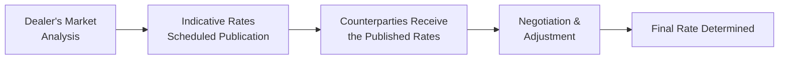

## 10.5 Indication Pricing Schedule

Imagine you’re sitting at your desk on a Monday morning, sipping your coffee, and you get an email from a potential swap counterparty with a thick PDF attached. The subject line reads: “Indicative Pricing Schedule – Updated Rates.” If you’re new to the interest rate swap world, you might glance at these rates and wonder: “Are these the final numbers?” or “Is this what I’m locked into if I want a swap?” The short answer is—nope! They’re not set in stone. These are “indication rates” or “indicative rates,” meaning they’re preliminary guides that show what’s possible under current market conditions. They can change a few hours from now, or even by the time you finish your next coffee.

This section dives deep into what an indication pricing schedule typically looks like in Interest Rate Swaps (IRS). We’ll explore why dealers publish these rates, how they’re affected by market conditions, and even share a few personal anecdotes about the joys (and occasional frustrations) of using indicative quotes. We’ll also look at disclaimers, regulatory frameworks, real-world scenarios, plus some best practices around negotiating final rates.

By the end, you should be able to read an indicative pricing schedule and confidently say, “Yep, I see what’s going on here, and I know the next steps if I want to lock in an interest rate swap.”

  
### Purpose and Importance of Indicative Pricing Schedules

An indicative pricing schedule for interest rate swaps is essentially a menu of possible swap rates for different maturities. For example, you might see something like this:

• 1-year swap rate: 2.70%  
• 2-year swap rate: 2.85%  
• 5-year swap rate: 3.10%  
• 10-year swap rate: 3.45%  
• 30-year swap rate: 4.00%  

But you know, these aren’t chiseled into granite. They’re a starting point for discussions. If you’re paying fixed and receiving floating, these rates show what your fixed rate might be, depending on the maturity you choose. If you’re on the other side of the trade—receiving fixed and paying floating—the indication schedule may list additional spreads or adjustments.

Dealers release these rates with the understanding that market conditions are fluid. If the Bank of Canada issues a surprise statement that influences the yield curve, or if global markets suddenly shift, you could see those rates fluctuate significantly within a single day. Also, the schedule usually contains disclaimers (often in fine print) about final rates requiring credit approval and a formal negotiation process.

#### A Quick Personal Anecdote

Years ago, I got my first “official-looking” pricing schedule for a 5-year interest rate swap from a major dealer. I excitedly printed it out and proudly showed it around the office as if it confirmed the perfect rate. But after a bit of back-and-forth with the counterparty’s swap desk, that rate changed twice—once in the afternoon and again by the next morning. In short, don’t plan your entire business model off the first schedule you see. Treat these rates as informational signals, not final commitments.

  
### Components of an Indication Pricing Schedule

An indication pricing schedule typically includes several key elements:

1. Maturity Ladder: Lists standard swap tenors, such as 1-year, 2-year, 3-year, 5-year, 7-year, 10-year, 15-year, 20-year, or 30-year.  
2. Fixed Rate (Pay): The rate at which a counterparty would be paying fixed if they receive floating.  
3. Floating Rate Option: Usually pegged to a benchmark such as CORRA (Canadian Overnight Repo Rate Average) in Canada, or so-called global equivalents like SOFR (Secured Overnight Financing Rate) in the U.S.  
4. Spread to Benchmark: If you’re paying floating, the schedule might list how many basis points over or under a reference rate you’d pay (e.g., CORRA + 30bps).  
5. Disclaimers: Important disclaimers about the non-binding nature of the quotes and any credit or liquidity premiums that may apply.  

  
### Credit Risk Appetite and Market Liquidity

One big driver of these indicative rates is the dealer’s credit risk appetite. In many interest rate swaps, you rely on the counterparty’s ability to fulfill its obligations for the entire life of the swap. A highly rated financial institution might score better rates than a smaller corporate with limited credit history.

Additionally, market liquidity matters a lot. This is especially relevant for longer maturities (e.g., 30-year swaps), or for shorter maturities during times of market stress. The more liquid a particular maturity is, the narrower the bid-ask spread, and the more consistently you’ll see stable indicative pricing. If liquidity dries up—say, during a major global event or if everyone’s heading for the exits in the 5-year sector—swap rates become more volatile or might momentarily disappear from the schedule altogether.

  
### Impact of Supply, Demand, and Yield Curve Slope

Supply and demand dynamics heavily influence these published rates. If many market participants are keen to pay fixed at a certain tenor—perhaps anticipating that interest rates will fall—swap dealers might price those swaps differently. And the yield curve shape (steep, flat, or inverted) is likewise a significant factor. 

• Steep yield curve: Rates for longer tenors (like 10-year, 30-year) will be higher than shorter tenors. Expect your 10-year or 30-year quotes to reflect an additional risk premium.  
• Flat yield curve: The difference between, say, the 2-year and 10-year might be minimal, so the indicative rates for those maturities could be very close.  
• Inverted yield curve: It might look downright odd to see a lower quote for 30 years than for 1 year, but that’s how the market signals its expectations for future rates or potential recessions.

  
### Typical Format of an Indication Pricing Schedule

Below is an example of what a simplified indication schedule table might look like:

| Maturity | Pay Fixed Rate (%) | Receive Fixed Rate (%) | Floating Spread (Pay) | Floating Spread (Receive) |
|----------|--------------------|------------------------|-----------------------|---------------------------|
| 1Y       | 2.75              | 2.70                  | CORRA + 15bps        | CORRA - 5bps             |
| 2Y       | 2.90              | 2.85                  | CORRA + 20bps        | CORRA - 3bps             |
| 5Y       | 3.20              | 3.10                  | CORRA + 25bps        | CORRA + 0bps             |
| 10Y      | 3.50              | 3.45                  | CORRA + 30bps        | CORRA + 3bps             |
| 30Y      | 4.10              | 4.00                  | CORRA + 40bps        | CORRA + 5bps             |

Notice how the differences can be subtle. For instance, a dealer might quote a 3.20% pay fixed rate but only a 3.10% receive fixed rate. That 10 basis point difference often covers transaction costs, liquidity premiums, or expected risk the dealer is taking on.

  
### Disclaimers: Subject to Negotiation and Credit Approval

Never skip the fine print. Indication schedules often include disclaimers such as:

• “Subject to credit approval.”  
• “Rates are for informational purposes only.”  
• “Final pricing is subject to the conditions of the market at the time of execution.”  

These disclaimers give the dealer an out if something changes in the market or if the potential client’s credit situation is weaker than originally anticipated. If, for example, your corporate credit rating declines significantly, the final fixed rate might be higher than what you see in the indicated schedule.  

And let’s be real: relationships matter. If you have a long-standing, high-volume relationship with a major dealer, they may quote you a tighter spread compared to a brand-new client with minimal or uncertain business potential.

  
### Regulatory and Transparency Requirements

Since the creation of the Canadian Investment Regulatory Organization (CIRO) in 2023, after the amalgamation of IIROC and the MFDA, regulatory requirements for transparency in OTC derivatives have continued to evolve. The Canadian Securities Administrators (CSA) also has frameworks in place for trade reporting and clearing obligations. Indicative pricing schedules themselves aren’t strictly regulated in the sense that a dealer must publish them, but once trades are done, certain post-trade details must be reported.

Regulations you might see referenced in disclaimers:

• CIRO guidelines on derivatives recordkeeping.  
• CSA Transparency Requirements for OTC Derivatives, focusing on reporting obligations.  
• Bank of Canada or official data releases for intraday reference yields (e.g., CORRA).  

By the way, if you want super up-to-date info on where rates are moving, the Bank of Canada Market Data is usually your best friend. They publish daily rates, yield curves, and key benchmarks that feed into many of these schedules.

  
### Example of Intraday Shift

It’s not unusual for schedules to shift intraday. Suppose in the morning the 5-year pay-fixed swap rate is at 3.15%. If key employment data or an important inflation reading comes out around noon, and it signals weaker-than-expected economic activity, the yield curve might compress. By 2 p.m., the pay-fixed rate could drop to 3.05% for the same 5-year maturity. If you had that morning’s schedule, it’s effectively outdated a few hours later. This underscores why indication schedules carry disclaimers about market movements.  

#### Quick Case Study

1. Monday 9:00 a.m.: Dealer ABC publishes: 5-year pay fixed: 3.15%.  
2. Monday 9:30 a.m.: Economic data reveals unexpectedly low inflation.  
3. Monday 10:15 a.m.: Government bond yields are rallying; new 5-year yields decline 10 basis points from the previous close.  
4. Monday 11:00 a.m.: Dealer ABC updates its schedule: 5-year pay fixed: 3.05%.  

If you had locked in your swap in the early morning, you might feel a bit of “rate envy” seeing the better rate just hours later. But that’s life in the fast lane of interest rates.

  
### Diagrams: Flow of Indicative Rates

Below is a simple Mermaid diagram illustrating the flow of how indicative rates are determined and communicated.

Explanation:  
• The dealer runs internal models and market analysis (A).  
• Then publishes an indicative schedule (B).  
• Counterparties see these rates (C) and engage in back-and-forth (D).  
• Eventually, after factoring credit approval, liquidity, and final market conditions, the two parties lock in a final rate (E).

  
### Impact on Hedge Accounting and Corporate Strategy

If you’re a corporate treasurer using hedge accounting models under IFRS or U.S. GAAP, the indicative pricing can help you plan your future interest expense or forecast interest rate risk. However, remember the difference between “indicative” and “executed” rates. Most accounting rules require that you base your hedge documentation on actual executed rates rather than early, preliminary numbers. So while an indication schedule helps with preliminary planning scenarios, your internal finance team needs the final deal’s “birth certificate” before you record anything on the books.

  
### Best Practices for Using an Indication Pricing Schedule

• Don’t Fix Your Strategy on the First Quote: Market conditions change, so gather multiple quotes if you can.  
• Confirm Credit Terms in Advance: If your credit rating is borderline, be aware the final quote might differ significantly.  
• Stay Informed of Economic Events: Keep an eye on upcoming announcements (like central bank policy statements) that might swing the market.  
• Use Tools and Resources: Most dealers guide you through potential changes if you’re not a pro at reading yield curves. But it’s also helpful to consult resources like the Bank of Canada’s daily update or open-source platforms for real-time data analytics (e.g., specialized Python libraries that track yield curves).  

  
### Common Pitfalls and Challenges

• Relying solely on published indication rates without verifying them in real time.  
• Ignoring disclaimers that final rates depend on your credit risk profile.  
• Underestimating intraday volatility—morning rates can be very different by the afternoon.  
• Overlooking the liquidity premium for longer maturities or “off-the-run” tenors.  

  
### Additional Resources and References

Below are a few places to look when you want to stay on top of swap pricing schedules and understand the broader regulatory environment in Canada:

• [CIRO](https://www.ciro.ca): Canada’s new self-regulatory organization that oversees investment dealers and helps ensure market integrity, including some aspects of OTC derivatives.  
• [Bank of Canada – Market Data](https://www.bankofcanada.ca/rates): Monitors intraday yield curves and overnight rates. Extremely useful for a broad picture of the rate environment.  
• CSA (Canadian Securities Administrators): For OTC derivatives transparency requirements and compliance details.  
• “The Swap Dealer’s Handbook”: A collaborative resource by seasoned swap traders. This text goes deeper into quoting conventions, advanced pricing models, and best execution strategies.  
• Open-source financial tools like QuantLib (for Python or C++) or specialized Excel templates, which let you model different swap structures, forecast interest rate scenarios, and compare indicative quotes across multiple dealers.

  
### Putting It All Together

An indication pricing schedule is a snapshot of the market’s best guess for swap rates at a particular moment in time, influenced by supply and demand, the yield curve, your creditworthiness, and other external factors. If you’re paying fixed, you might find yourself scanning the schedule to lock in a comfortable long-term rate. If you’re receiving fixed, maybe you want to take advantage of a market environment you think is about to shift. As soon as you negotiate a final rate, you’ll want to confirm everything in writing—knowing that an indicative schedule is a great starting place, but it’s not the final deal.

In my opinion, it’s helpful to see these schedules as a map. They guide you toward your destination (hedging or speculating on interest rates), but the road might have some detours (market data releases, credit approvals, or liquidity shortages). Once you’re comfortable reading and interpreting these schedules, you’ll be in a better position to navigate the interest rate swap market and land on terms that best suit your financial objectives.

  
## Sample Exam Questions: Indication Pricing Schedules in Interest Rate Swaps



### Which of the following best describes an indicative pricing schedule in the context of interest rate swaps?
- [ ] A legally binding contract for a specific swap rate.  
- [x] A preliminary quote or guidance useful for negotiations.  
- [ ] The final rate set by central banks for all OTC transactions.  
- [ ] A historical record of average swap rates from the previous quarter.  

> **Explanation:** An indicative pricing schedule provides preliminary rates and is not legally binding. It serves as a negotiation tool.

### What is the primary factor that often causes intraday shifts in an indication pricing schedule?
- [ ] Dealer’s internal credit rating.  
- [ ] The client’s level of experience in swap transactions.  
- [x] Changes in market conditions, such as yield curve shifts.  
- [ ] Fixed-income analysts’ personal opinions on credit risk.  

> **Explanation:** Intraday changes in supply and demand, yield curves, or unexpected news can drive swap rate fluctuations.

### When a counterparty is paying fixed and receiving floating, what entry are they likely to look for in an indication pricing schedule?
- [x] The fixed pay rate for the chosen maturity.  
- [ ] The floating spread to CORRA or LIBOR for the chosen maturity.  
- [ ] The overall cost of setting up the swap at a major exchange.  
- [ ] The historical average for interest rates over the past decade.  

> **Explanation:** A paying fixed/receiving floating party focuses on the fixed rate they’ll pay. The floating spread is more relevant if the counterparty is paying floating and receiving fixed.

### Which of the following disclaimers is commonly found in an indication pricing schedule?
- [x] “Subject to credit approval.”  
- [ ] “Guaranteed by all clearinghouses globally.”  
- [ ] “Insured by the CIPF for the entire notional amount.”  
- [ ] “Not available for private corporations.”  

> **Explanation:** Indication rates are often subject to credit approval and final negotiation. They are not guaranteed coverage by clearinghouses or CIPF.

### How do dealers typically account for illiquid maturities in an indication pricing schedule?
- [ ] By stating that no swap is available at those maturities.  
- [ ] By offering fixed rates below the market average to entice participation.  
- [x] By adding a liquidity premium to the swap rate.  
- [ ] By using only publicly traded equities to hedge risk.  

> **Explanation:** Illiquid maturities often carry a liquidity premium to compensate the dealer for higher risk and potential difficulty in hedging positions.

### Why might a 10-year swap rate sometimes be lower than a 2-year rate in an indicative schedule?
- [x] Because the yield curve can invert, making longer-term rates cheaper than shorter-term rates.  
- [ ] Because dealers typically overcharge for 2-year swaps.  
- [ ] Because it’s illegal to quote higher long-term rates in certain jurisdictions.  
- [ ] Because the 2-year market is more creditworthy.  

> **Explanation:** An inverted yield curve will lead to the phenomenon where a long-term maturity might have a lower interest rate than a short-term maturity.

### A corporate treasurer consults an indication pricing schedule on Monday morning but finalizes a swap rate on Tuesday afternoon at different levels. Which statement best explains this situation?
- [ ] The morning schedule was definitively incorrect.  
- [x] Market conditions and possibly credit requirements changed between Monday and Tuesday.  
- [ ] The final swap was not legally executed.  
- [ ] The treasurer broke a contractual obligation.  

> **Explanation:** Indicative rates are subject to change due to market fluctuations or new credit information, leading to differences on the final rate.

### In most indication schedules, what is the typical representation for the floating leg of a swap?
- [x] A benchmark rate (e.g., CORRA) plus or minus a spread.  
- [ ] A guaranteed daily rate set by the Bank of Canada.  
- [ ] A lump-sum fixed amount payable annually.  
- [ ] A monthly dividend determined by the stock market.  

> **Explanation:** The floating leg is often referenced to a benchmark like CORRA (or equivalent) plus or minus a spread, depending on the deal structure.

### Which regulatory guidance primarily discusses reporting obligations related to OTC swaps in Canada?
- [ ] The CIPF coverage guidelines.  
- [ ] The old MFDA guidelines superseded by CIRO.  
- [x] CSA Transparency Requirements for OTC Derivatives.  
- [ ] The IFRS standard on intangible assets classification.  

> **Explanation:** The CSA (Canadian Securities Administrators) outlines transparency and reporting obligations for OTC derivatives in Canada.

### True or False: An indicative pricing schedule can be used for final hedge accounting documentation without any adjustments.
- [ ] True  
- [x] False  

> **Explanation:** Hedge accounting typically requires actual, executed swap rates for documentation. Indicative rates are only a preliminary guide.


