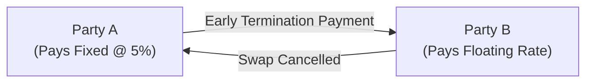
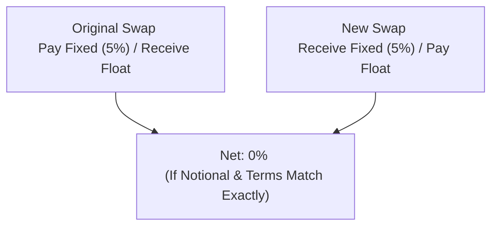
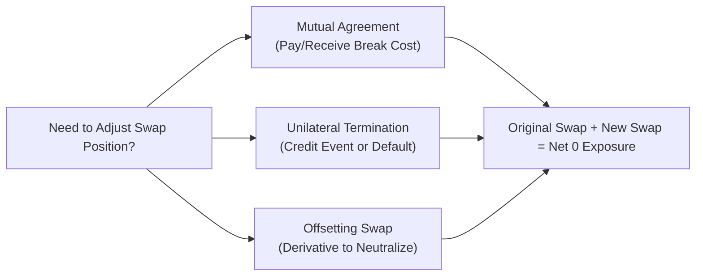

## 10.7 Terminating an Interest Rate Swap

Have you ever found yourself sitting across the table from someone, happily sipping a coffee, discussing the long life of a swap contract, only to realize a few months later that you need to shut that same swap down early? Well, in the wonderful world of derivatives, this happens more often than you might think. While interest rate swaps are commonly set up to last for years—from two or three years up to 30 years or sometimes longer—situations can change, and counterparties may need to exit a swap prematurely.

Maybe you’ve experienced a scenario where your company had a pay-fixed swap to hedge against rising interest rates, but later discovered that the hedge was no longer needed. Or perhaps you encountered a credit event that triggered urgent termination rights. Either way, understanding how to terminate an interest rate swap properly (and the associated costs) is crucial for both risk management and regulatory compliance.

Below, we’ll take a close look at the various methods of terminating a swap, the nuances of break costs, offsetting strategies, relevant accounting considerations under IFRS, reporting to the Canadian Investment Regulatory Organization (CIRO), and more. We’ll also explore some real-life anecdotes and diagrams to help you visualize the entire process.

---

Early Termination Approaches

There are generally two primary approaches to terminating an interest rate swap early: (1) mutual agreement to cancel or (2) entering an offsetting swap transaction. Additionally, there is a vital but more painful route of unilateral termination when a credit event or default triggers a contract break. Here’s a quick overview before we dive deeper:

• Mutual Agreement of Both Parties: Both counterparties agree to close the swap.  
• Unilateral Termination (Credit Event): One counterparty enforces provisions that allow it to terminate, typically because the other party defaulted on a payment or hit a credit trigger.  
• Offsetting Swap: Instead of closing the original swap, one counterparty opens an inverse position, effectively neutralizing the swap’s net cash flows.  

Once you see how these methods work in real-world settings, you’ll have a better sense of which option is suitable under different circumstances.

---

Mutual Agreement and Calculating Break Cost

When two parties happily decide, “Let’s close this swap early,” they typically must settle any net amounts owed based on what the swap is worth at the time of termination. This settlement amount is sometimes referred to as the “break cost.” It might be a cost or a gain to one side, depending on market conditions. Put differently, the swap is marked to its fair market value at termination, and the party that is out-of-the-money pays the in-the-money party. 

For example, if you’re paying a fixed rate of 5% on a swap, but market interest rates have dropped significantly and the fixed rate on a new swap is now 3%, your position in the original swap could hold a negative value for you—because you’re locked into paying a higher fixed rate than the market presently requires. If you want to close out that swap, you will likely have to compensate your counterparty through a break cost. Conversely, if you’re receiving 5% from your counterparty in a falling rate environment, you hold a more favorable position that likely has positive value.

The concept can be illustrated in a simple flow diagram:

In the diagram, Party A agrees to pay Party B a fixed rate (which may now be higher than the current market rate), so Party A might have to compensate Party B to cancel. The early termination payment would be roughly equal to the present value of future differences between the fixed notional rate and the floating reference rate. 

At times, especially for large notional amounts, the break cost can be hefty. In some deals, the termination agreement might be structured in a way that prolongs or spreads out the payment, but typically it’s a lump sum. By the way, if you ever find yourself in a negotiation about break costs, it’s important to reference your International Swaps and Derivatives Association (ISDA) Master Agreement. The schedule to the ISDA typically dictates how the calculation should be done (e.g., Mid-Market Valuation, relying on quotes from reference banks, or a widely recognized valuation model).

---

Unilateral Termination (Credit Events and Defaults)

Next, let’s talk about the less friendly path: termination triggered by a credit event. Sometimes a party defaults on its obligations or experiences a deterioration in credit quality significant enough to trigger a right of termination. These provisions are spelled out in the ISDA documentation. The standard ISDA Master Agreement includes “Events of Default” and “Termination Events.” If your counterparty fails to fulfill its payment obligations, or if a rating downgrade below a certain threshold occurs, or if there’s bankruptcy, the other side may have the right to terminate the swap unilaterally.

In this scenario, as with a mutual termination, there typically is a break cost or settlement amount, calculated according to the valuation rules in the ISDA. The difference is that the termination might not be purely “mutual”—it’s more forced than voluntary. The exact path to settlement can get complicated if the party in default is in financial distress or insolvency. A default scenario might transform a once straightforward transaction into a labyrinth of legal claims and netting arrangements across multiple outstanding transactions. 

Regulators such as CIRO (historically IIROC, but now consolidated and named CIRO), have guidelines about reporting a default event if it poses a significant threat to the financial stability of the member firm. Although the spirit of the termination process is similar to a friendly cancellation, credit events can trigger additional protective or legal maneuvers for the innocent party, including netting arrangements that offset gains and losses across different transactions.

---

Offsetting Swaps

Offsetting swaps (sometimes referred to as an opposite swap) is a technique used when a party wants to neutralize the economic effect of an existing swap without formally terminating the original contract. I remember the first time I heard about offsetting swaps, I pictured something akin to a seesaw, where one end is going down while the other is going up and they end up balancing out somewhere in the middle.

Let’s say you’re locked into a pay-fixed, receive-floating swap. Now you realize you no longer want that position. Instead of officially tearing up the old contract (and incurring a break cost), you might enter into a second swap, where you receive the same fixed rate (5%) and pay floating. 

Now, do note that the first swap is still on your books as a liability or asset— it doesn’t simply go away. But mathematically (or “economically”), the net effect is close to zero. You pay 5% fixed on the original swap, you receive ~5% fixed on the new swap. The floating amounts, ideally pegged to the same index, effectively cancel each other out, at least for future cash flows. 

Here’s a quick flow diagram:

While your net exposure becomes nearly zero, legally speaking, you still have two separate contracts that can generate accounting complexities—especially if the floating indexes aren’t precisely matched (e.g., 3-month LIBOR vs. 1-month CORRA, or different reset dates). 

Offsetting is also commonly used when the original swap has a series of complicated credit triggers, or perhaps the documentation or the relationship with the original counterparty complicates direct termination. Another scenario might be that you just want to keep the original swap in place for record-keeping or operational reasons, but you still need to “reverse out” the exposure. 

The advantage is that you won’t need to pay a large break cost upfront. The disadvantage: you could have ongoing net administrative, operational, or credit risk from having two outstanding swaps. If your new swap is with a different counterparty, each relationship imposes its own margin or collateral requirements. There is also the possibility of basis risk, if the indexes or settlement dates differ.

---

Accounting Considerations Under IFRS

Many folks find IFRS accounting to be, well, a bit dense. But let’s break it down. If you terminate an interest rate swap, the relevant IFRS rules—mainly IFRS 9 (Financial Instruments) and IFRS 13 (Fair Value Measurement)—guide you on how to record gains or losses. Under IFRS:

• When you terminate a hedge that was designated under hedge accounting, you might have to immediately recognize gains or losses on that derivative in your Profit & Loss (P&L), or you might reclassify them into other comprehensive income depending on the type of hedge.  
• For a swap that’s not designated for hedge accounting, it’s essentially a standalone financial instrument at fair value through profit or loss. Termination or settlement gains/losses would typically hit the P&L immediately.  

An example: Suppose you had recognized a fair value liability of $1 million on your books for a pay-fixed interest rate swap. When you terminate it, you pay $1.05 million to your counterparty. The difference ($50,000 in this case) might appear as a loss in your P&L, reflecting the final settlement relative to the previously recorded fair value.

Additionally, IFRS 7 (Financial Instruments: Disclosures) might require you to disclose the nature of the derivative and the reasons for termination if it materially affects your financial statements. 

For more detailed coverage on precisely how to handle each account entry, see “Accounting for Derivatives” by Juan Ramirez, which is a go-to reference for many accountants in the derivative space. The International Accounting Standards Board (IASB) website at [https://www.ifrs.org/](https://www.ifrs.org/) is also an official resource for up-to-date standards and interpretations.

---

Tax Rules in Canada

From a Canadian tax perspective, the big question is often: Is this termination gain or loss considered on account of capital or income? The answer depends on whether the underlying swap was for speculation, hedging, or some other purpose. If you used the swap to hedge, then the termination amount might follow the tax treatment of the underlying hedged item. If it’s purely speculative, you might book it as income. 

The Canada Revenue Agency (CRA) periodically issues interpretations about derivative gains and losses, so it’s essential to consult the latest guidance or hire a tax professional experienced with derivatives. Keep in mind that these rules can be complicated by cross-border aspects, such as if you or your counterparty is located outside of Canada. In that case, additional withholding or foreign-exchange rules might apply.

In a typical scenario, let’s say your Canadian corporation enters a pay-fixed swap for hedging interest payments on a variable-rate loan. If you terminate that swap early, the break cost or credit you receive (if you’re in-the-money) follows the loan’s treatment. This can be quite complex if the loan is partially repaid, or if your hedge is only partial. Documenting the nature of the hedge at inception is a best practice to ensure correct treatment at termination.

---

CIRO Reporting Requirements

You might be wondering, “Do I need to tell anyone that my firm is terminating a swap?” The short answer is: Possibly yes. If you are regulated by the Canadian Investment Regulatory Organization (CIRO)—the current self-regulatory body in Canada for investment and mutual fund dealers—you may need to comply with certain notification rules.

Historically, IIROC (one of CIRO’s predecessor SROs) had guidelines about reporting material changes in your financial condition. Today, CIRO effectively continues these guidelines. If the scale of your termination is large enough to materially affect your capital position, you might be required to submit a notice. This can be particularly relevant for smaller firms or those that maintain a large derivatives book but have limited capital.

Each firm’s Chief Compliance Officer or Chief Financial Officer typically oversees such regulatory reporting to CIRO. They may also consult the relevant provincial securities regulators if the notional or market value of the terminated swap is significant or if the event triggers certain risk-based capital thresholds.

For more specifics, you might want to check out official CIRO notices regarding material derivatives events—these define what “significant” means in different contexts, referencing net capital requirements. You can find up-to-date releases at [https://www.ciro.ca/](https://www.ciro.ca/). 

---

Practical Case Study

Let’s walk through a hypothetical example to pin down these concepts. Suppose Maple Leaf Manufacturing, a mid-sized Canadian company, took out a $10 million floating-rate loan to finance an expansion. To hedge the risk of rising rates, Maple Leaf executed a pay-fixed (4%) and receive-floating (3M CORRA + 75 bps) swap. 

Months later, interest rates started to move in unexpected ways, and Maple Leaf realized it no longer needed the hedge because they refinanced the loan at a different rate structure. Maple Leaf decided to terminate the existing swap, which (unfortunately for them) had a negative fair value of $200,000. That means Maple Leaf owes the counterparty $200,000 if they want to end the swap right now. 

Maple Leaf checks its loan termination rules, coordinate with its CFO and risk managers, and receives a quote from the counterparty for the break cost. They confirm they must pay $210,000 once all mid-market adjustments are done. Maple Leaf’s financial statements already had recognized a $200,000 liability, so they end up recognizing an additional $10,000 loss in the P&L upon settlement. The total cash outflow is $210,000, but the incremental P&L cost is $10,000. Maple Leaf’s CFO documents the termination rationale, ensuring compliance with IFRS 7 disclosures regarding derivatives. They also inform their auditors.  

Since $210,000 is a relatively modest amount for Maple Leaf’s balance sheet, the CFO decides it’s not large enough to affect the firm’s CIRO capital adequacy, so no special filing is required. If it had been $2.1 million, that might have triggered additional oversight from both Maple Leaf’s board of directors and CIRO.

---

Offsetting Strategy Example

Imagine a second scenario: Maple Leaf chooses not to terminate the unfavorable swap. Instead, it enters into a new swap with a different bank. The new swap has Maple Leaf receiving 4% fixed and paying 3M CORRA + 80 bps (slightly less favorable, given current market conditions). By doing so, Maple Leaf’s net exposure to interest rates becomes close to zero, except for a minor 5 bps difference in the floating rates. 

No direct cash payment to close out the original swap is needed, but Maple Leaf must pay (or receive) net monthly differences on the two swaps. The original swap remains recognized in the financial statements. The new swap also sits on the books, ideally offset in value. Maple Leaf might still have to post collateral for both swaps, incurring certain liquidity demands. Over time, if it decides to exit both swaps, it could face different valuations than initially anticipated. So, while offsetting can relieve immediate pressure to pay a large break cost, it can introduce new complexities.

---

Best Practices and Pitfalls

• Confirm the Type of Termination: Are you allowed to break the swap without your counterparty’s consent under the ISDA? Or do you need mutual agreement? Always check the Master Agreement.  
• Document Everything: Record your reason for termination, the calculation of the break cost, and the associated accounting entries. This helps with external audits and, potentially, with future tax or regulatory inquiries.  
• Analyze the Effect on Collateral and Margin: If you’re posted collateral, how does termination or offsetting affect margin calls?  
• Review Tax Implications: If it’s a hedge, ensure you follow Canadian tax rules on hedge accounting. If it’s speculative, the gain or loss might be booked differently.  
• Consider Market Liquidity: For extremely large notional amounts, you might face some difficulty obtaining accurate quotes for fair market value from multiple dealers.  

A quick personal take: In one of my earliest derivative roles, I encountered a scenario where an unexpected early termination resulted in a break cost that nearly equaled the entire annual hedge budget. It taught me the value of regularly monitoring the mark-to-market (MTM) of the swap. Had we recognized how far out-of-the-money the position was, we might have entered a partial offset earlier or structured a more gradual unwind.

---

Diagrams Summarizing Your Choices

One more bit of visualization: let’s show the overall flow of decision-making on whether to terminate or to offset.

---

Additional Resources

• CIRO Notice on Reporting Material Derivatives Events: [https://www.ciro.ca/](https://www.ciro.ca/)  
• IFRS Standards: [https://www.ifrs.org/](https://www.ifrs.org/)  
• “Accounting for Derivatives” by Juan Ramirez  
• The Canadian Derivatives Clearing Corporation (CDCC) resources on clearing and netting essential in case of default sci.  
• Government of Canada websites and the CRA bulletins on tax treatment of derivatives.  
• Additional perspective on best practices in documentation and negotiation can be found in ISDA-published materials on early terminations.  

For regulated investment dealers, always cross-check your firm’s compliance manual and internal governance procedures.

---

Conclusion

Terminating an interest rate swap early is not as simple as saying, “Alright, let’s rip up this contract.” On the contrary, it involves carefully calculating break costs, evaluating potential credit events, or considering an offsetting (opposing) swap to neutralize risk. Each route poses its own set of challenges: break costs can be high, credit issues might complicate negotiations, and offsetting swaps can create complex, layered positions on your balance sheet. 

Accounting for the termination involves IFRS rules—particularly IFRS 9 and IFRS 13—while Canadian tax authorities may treat the transaction differently depending on whether it’s speculation or a hedge. Regulated dealers need to keep an eye on CIRO reporting requirements if the transaction is large enough to affect their net capital. 

Regardless of the route chosen, it’s best to have proper documentation, a sound understanding of the ISDA Master Agreement, and a watchful eye on both the legal and accounting nuances. Sometimes, strong planning and frequent valuation checks can limit the shock of a large unexpected break cost if early termination becomes necessary. And if all else fails, you might just find yourself offsetting your way to a more comfortable, albeit more complex, position.

---

## Sample Exam Questions: Key Aspects of Terminating an Interest Rate Swap



### Which of the following describes the primary factor in calculating a swap's break cost upon mutual termination?

- [ ] The notional amount of the original swap only
- [ ] The net annual interest expense on the underlying loan
- [ ] The book value of the swap at inception
- [x] The fair market value of the swap on the date of termination

> **Explanation:** When terminating a swap early by mutual consent, the break cost is essentially the present value of future net cash flows (i.e., the fair market value) that one party owes to the other.

### Which event typically triggers the right to a “unilateral termination” of a swap under ISDA documentation?

- [ ] A minor fluctuation in interest rates
- [ ] A strong performance by the floating-rate payer
- [ ] A new convertible bond issuance
- [x] A default or credit event of one of the counterparties

> **Explanation:** Under ISDA, unilateral termination rights generally arise when one party defaults or experiences a defined credit event, such as insolvency or failure to make a payment.

### What is a key advantage of using an offsetting swap to manage an unwanted swap position?

- [x] It neutralizes the economic exposure without requiring immediate break cost payment
- [ ] It completely removes the original swap from the firm's financial statements
- [ ] It guarantees a profit from both swaps
- [ ] It simplifies ongoing accounting disclosures

> **Explanation:** An offsetting swap allows a party to neutralize future cash flows without incurring the lump-sum costs of termination, although the original swap remains on the books and can add complexity to accounting.

### Under IFRS, how are gains or losses from terminating a swap designated as a hedge typically recognized?

- [x] They may be reported in profit or loss or reclassified to other comprehensive income, depending on the nature of the hedge
- [ ] They are strictly recorded as a direct subtraction from retained earnings
- [ ] They are ignored for financial statements and only disclosed in footnotes
- [ ] They are deferred indefinitely until the next fiscal year

> **Explanation:** IFRS 9 sets out specific rules on how to de-recognize a hedging instrument; the accounting treatment for gains/losses differs depending on whether the hedge is cash flow, fair value, or net investment, and may involve other comprehensive income or direct recognition in P&L.

### When offsetting a pay-fixed, receive-floating swap with a receive-fixed, pay-floating swap, which of the following best describes the resulting net exposure?

- [ ] It doubles the net fixed rate payments, creating more risk
- [x] It ideally reduces future net interest rate risk to near zero, assuming matched terms
- [ ] It locks in a guaranteed loss that must be recognized immediately
- [ ] It creates a net short interest rate position

> **Explanation:** With matching notional amounts and identical rate indexes, offsetting swaps largely cancel out the interest rate exposure, bringing net risk close to zero.

### If a company had recorded a $300,000 liability for a swap on its balance sheet and it pays $320,000 to terminate the swap, how much additional cost is likely recognized at termination?

- [ ] $0  
- [ ] $320,000  
- [x] $20,000  
- [ ] $300,000  

> **Explanation:** The company has already accounted for a $300,000 liability. Paying $320,000 indicates an extra $20,000 beyond the recorded liability, which would be recognized as an additional loss.

### Which of the following statements about CIRO reporting requirements for early termination is accurate?

- [ ] All swap terminations must always be reported to CIRO
- [x] Significant swap terminations that might affect a firm’s financial condition must be reported
- [ ] Only swap terminations that result in gains are subject to reporting
- [ ] CIRO no longer regulates swap terminations

> **Explanation:** CIRO requires reporting of material changes that could affect a firm’s capital or liquidity position; small or routine terminations typically do not need formal reporting unless they meet the thresholds defined by CIRO guidelines.

### Which IFRS standard primarily addresses fair value measurement for derivatives?

- [x] IFRS 13
- [ ] IFRS 15
- [ ] IFRS 7
- [ ] IFRS 16

> **Explanation:** IFRS 13 sets out the framework for measuring fair value of financial instruments, including derivatives.

### What is one potential disadvantage of using an offsetting swap rather than terminating the original swap?

- [ ] It immediately triggers a large break cost payment
- [ ] It automatically defaults the original contract
- [ ] It removes the original swap from the balance sheet prematurely
- [x] It can create ongoing administrative and collateral requirements for two outstanding contracts

> **Explanation:** Offsetting reduces market exposure but leaves two swaps on the books, which can require additional collateral management, accounting disclosures, and administrative oversight.

### True or False: Under a mutual early termination, the party that is “in-the-money” typically pays the break cost to the party that is “out-of-the-money.”

- [x] True
- [ ] False

> **Explanation:** In a mutual termination scenario, the “out-of-the-money” party pays the “in-the-money” party. If you’re “in-the-money,” you receive the net present value, meaning the other side compensates you.


