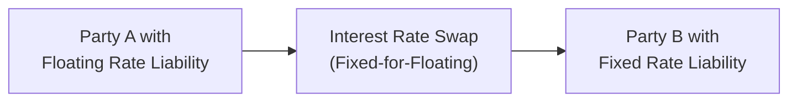

## 10.8 Why Interest Rate Swaps Are Used

Have you ever found yourself worrying about whether interest rates are going to skyrocket just as you’ve committed to a long-term mortgage or a business loan? Well, that’s exactly the sort of anxiety interest rate swaps can help with—except we’re talking about it on a corporate or institutional scale. Think of an interest rate swap as a financial handshake between two parties who agree to exchange interest rate payment obligations, typically from fixed to floating or vice versa. This arrangement can help both participants achieve what they want: maybe one craves the stability of a fixed rate, while the other wants to ride the wave of a variable rate. In this section, we’ll explore the reasons behind the popularity of interest rate swaps, show you how they work in real-life scenarios, and offer a few personal anecdotes that might make these complex instruments just a bit more relatable.

### Transforming Liabilities from Floating to Fixed (or Vice Versa)
One of the biggest draws for folks who use interest rate swaps is the ability to flip-flop between floating-rate and fixed-rate payments, depending on what best suits their needs at any given time. Imagine a company that has issued a large floating-rate bond because, at the time of issuance, floating rates were super attractive—maybe the company believed that interest rates would stay low. However, a year later, the economic environment looks shaky, and management thinks rates might spike. Uh oh. That’s where a plain vanilla interest rate swap often shows its worth. 

By entering into a swap, the company can effectively pay a fixed rate instead of a floating rate. This helps the company lock in a predictable interest expense and, in turn, stabilize its cash flows. Conversely, a business that has locked into a higher fixed rate might decide it wants to switch to a floating rate if it believes interest rates will decline or remain relatively low, hoping to reduce its total interest cost. An interest rate swap can achieve that switch.

Below is a simple visual representation of how an interest rate swap might look, in the most basic sense.

In this diagram, Party A pays a fixed interest rate to Party B through the swap contract and receives a floating rate in exchange. Meanwhile, Party B does the opposite. The result? Each party transforms the nature of its outstanding liability—either from floating to fixed or from fixed to floating—without the need to refinance or restructure the original debt.

### Hedging and Interest Rate Risk Management
Hedging, in the simplest sense, is like buying insurance for your financial positions. Just as you might buy winter tires to hedge against the risk of icy roads, financial institutions and corporations use interest rate swaps to hedge against adverse interest rate movements. If you pay floating but worry about market rates spiking, you can hedge that risk with a swap that converts your obligation to a more predictable fixed rate.

I recall my first experience with interest rate swaps: a friend of mine worked at a real estate investment trust (REIT), and they had a ton of floating rate mortgages because that was cheaper at the time. But as soon as the central bank signaled potential rate hikes, the REIT scrambled to lock in fixed-rate payments for a portion of their portfolio. They did this by entering into a series of interest rate swaps—essentially turning those uncertain floating mortgages into stable, predictable streams for budgeting.

### Speculative Opportunities
Sometimes, users jump into interest rate swaps not because they have an existing exposure to hedge, but because they want to profit from anticipated changes in interest rates. This is speculation. For instance, you might expect interest rates to rise in the near term. By entering into a swap as a fixed-rate payer and floating-rate receiver, you could stand to gain if the floating rate indeed moves higher than the fixed rate you locked in.

But, let’s be honest, speculation can be a big gamble—if you’re wrong, you might end up losing money instead. Professional speculators, such as hedge funds, might have more sophisticated strategies and risk controls, but swaps provide them with a pure way to play interest rate movements without having to invest in the underlying bonds or treasury bills themselves.

### Exploiting Comparative Advantages
Let’s say Company X can borrow money from a bank at a lower fixed rate than Company Y, but Company X struggles to get a decent floating rate. Meanwhile, Company Y can borrow at a great floating rate but faces less competitive fixed rates. If these two companies swap their interest payment profiles, each one ends up with the more favorable structure relative to their credit and institutional advantage. The net effect is that each company can theoretically lower its overall cost of capital. This scenario is precisely what textbook authors describe as “comparative advantage” in interest rate swap markets.

If it’s done right, both sides of the swap can gain value from the arrangement. Now, in practice, each side has to pay some fees and perhaps face certain credit requirements, but it’s often a net plus. This concept was once famously taught in business schools (maybe you’ve flipped through a John C. Hull chapter about swaps?), and it remains a core rationale behind many real-world swap transactions.

### Balancing the Books through Asset/Liability Management
Canadian financial institutions—banks, credit unions, insurance companies—regularly find themselves juggling assets and liabilities with different interest rate structures. Perhaps you have a bank that’s issuing fixed-rate GICs to depositors but making variable-rate loans to individuals and businesses. This mismatch can create all sorts of exposures. If interest rates change dramatically, the bank could get squeezed.

What to do? Enter the interest rate swap. By swapping its floating inflows for fixed inflows, or vice versa, a bank can better match the structure of its deposit liabilities with the structure of its loans and investments. You can think of it as a form of housekeeping, or a bit like rearranging your living room furniture to make it safer and more comfortable. In the grander scheme, asset/liability management aims to minimize the risk that a shift in interest rates harms the financial institution’s profitability and regulatory capital ratios.

### Regulatory Considerations and Capital Efficiency
Here in Canada, the Office of the Superintendent of Financial Institutions (OSFI) sets the rules for how banks manage their capital, while the Canadian Investment Regulatory Organization (CIRO) and the Canadian Securities Administrators (CSA) have some oversight for how swaps (and other derivatives) are reported and cleared. Many large institutions structure their interest rate swaps in ways that meet these regulatory requirements in an efficient manner. For example:
- Swaps that are centrally cleared can reduce counterparty credit risk and free up capital that would otherwise be held against potential defaults.
- Regulators often require robust hedge documentation to confirm that swaps are genuinely used for hedging (not speculation) if the bank wants more favorable accounting treatment.

These guidelines, along with the need to optimize capital usage, motivate market participants to enter into swaps that lock in desired risk exposures while minimizing regulatory capital hits. It might sound a bit dry, but saving on regulatory capital costs can be a big deal for banks, trust companies, and insurance firms. They often pass on these savings to the end customer via more competitive rates or better product offerings.

### Locking In Favorable Market Conditions
You’ve probably seen interest rates fluctuate over time—sometimes, it feels like they bounce around for no obvious reason. Firms can use swaps as “insurance” to lock in a sweet spot in the interest rate cycle. Suppose you’re a finance manager who believes that floating rates are historically low, but your firm is currently paying fixed rates on an older bond issuance. You could enter into a swap that offsets those higher fixed payments with a floating stream, effectively capturing today’s lower rates—at least for the duration of the swap. 

If your hunch turns out right and floating rates remain significantly lower than the fixed rate you’re paying, you come out ahead. Of course, you might also lose that bet, but the beauty of interest rate swaps is that they allow you to custom-tailor your positioning more precisely than, say, a complete refinancing of your existing debt package.

### A Quick Math Glimpse
Swaps can sometimes feel like algebra. If you’re keen on the technical side, we can express the net payment for a simple plain vanilla interest rate swap as:


\text{Payment} = \text{Notional} \times (r_\text{floating} - r_\text{fixed}) \times \left(\frac{d}{360}\right),


where:
- Notional is the principal amount upon which the interest is computed (often not exchanged).
- \\(r_\text{floating}\\) is the current floating rate (e.g., CDOR in Canadian markets) applied for that payment period.
- \\(r_\text{fixed}\\) is the agreed-upon fixed rate.
- \\(d\\) is the number of days in the payment period (using a day-count convention, often 360 in swap markets).

This formula basically shows that the difference between floating and fixed rates, multiplied by the notional, determines who pays whom. If \\(r_\text{floating}\\) is higher than \\(r_\text{fixed}\\) in a given period, the floating-rate receiver (and fixed-rate payer) typically receives a net payment.

### Real-World Case Study: Midsize Manufacturing Firm
Picture a mediumsized Canadian manufacturing company that financed a big plant expansion using a five-year floating-rate loan. At the time, they believed floating rates were cheap—smart move, right? A couple of years down the road, the Bank of Canada has raised benchmark rates several times. Now, the finance folks are sweating. Their monthly interest costs just bumped up, and they’re afraid another rate hike is coming soon.

So, the CFO decides to lock in a fixed rate for the remainder of the term. Instead of refinancing (which could be expensive or complicated), the firm enters into an interest rate swap with a financial institution. Under that swap, the manufacturer pays a fixed rate—slightly higher than the current floating rate but still acceptable—and receives a floating rate in return. This effectively stabilizes the interest cost and reduces the CFO’s headache over unexpected monthly spikes.

### Common Pitfalls and Best Practices
Even though swaps can be extremely useful, there are a few potential pitfalls:

• Market Timing: If you “lock in” a fixed rate when the market is high, you might regret it if rates plunge right after.  
• Credit Risk: Swaps are generally off-balance-sheet instruments. However, each party faces the risk that the other side could default on payments. Central clearing through recognized clearing houses, such as the Canadian Derivatives Clearing Corporation (CDCC), can minimize that risk.  
• Documentation: Under CIRO and CSA guidelines, you need robust hedge documentation, especially if you’re claiming hedge accounting treatment under IFRS or a similar framework. Missing or incomplete documentation can lead to unfavorable accounting outcomes.  
• Overhedging: Sometimes, parties lock into a bigger hedge than they actually need. That can create issues if the underlying exposure changes—like if you pay down your debt faster than expected.  

Best practices include:
• Conducting scenario analyses and stress tests to see how your cash flows might fare under different interest rate environments.  
• Using standardized swap contracts and clearing them through a central counterparty when possible.  
• Keeping thorough documentation (both for your own sanity and to comply with regulatory requirements).  
• Monitoring ongoing developments, such as the transition from CDOR to CORRA in Canada, which can affect floating rates referenced in swaps.

### Canadian Market Outlook and Noteworthy Trends
As the Canadian market evolves, more participants use interest rate swaps for everything from locking in mortgage rates to hedging corporate bonds. In parallel, new regulations from CIRO or new guidelines from OSFI can shift how swaps are documented and reported. Canada has also seen an increase in sustainable finance or “ESG-linked” swaps, where the interest rate might adjust based on the participant’s environmental or social performance metrics—an emerging trend that could shape the future.

### Quick Glossary
Hedging: Reducing or eliminating risk exposure by taking an offsetting position.  
Asset/Liability Management: Coordinating maturities and interest rate exposures between a firm’s assets and liabilities.  
Comparative Advantage: An entity’s relative ability to borrow cheaply at a fixed or floating rate, leading to swap-based gains.  
Speculation: Entering a financial contract primarily to profit from anticipated price or rate movements.

### Additional Resources and References
• Canadian Investment Regulatory Organization (CIRO): <https://www.ciro.ca>  
• Canadian Securities Administrators (CSA): <https://www.securities-administrators.ca>  
• Bank of Canada: <https://www.bankofcanada.ca>  
• Office of the Superintendent of Financial Institutions (OSFI): <https://www.osfi-bsif.gc.ca>  
• “Options, Futures, and Other Derivatives” by John C. Hull (especially the chapter on interest rate swaps)  
• Detailed guide on hedge documentation requirements from CSA and CIRO  
• Open-source financial libraries like QuantLib (<https://www.quantlib.org>) can model and price various interest rate swaps

So, that’s the gist of why interest rate swaps get used so frequently. They provide immense flexibility for hedging interest rate exposure, speculating on rate movements, or cleverly managing the interplay between assets and liabilities. In many ways, they’ve become a mainstay in the toolkit of modern finance, helping everyone from major banks to smaller manufacturing outfits handle the ebb and flow of global interest rate cycles.

---

## Sample Exam Questions: Why Interest Rate Swaps Are Used



### Which of the following best describes a key motivation for using an interest rate swap?
- [ ] To eliminate all forms of credit risk.
- [ ] To directly invest in foreign equity markets.
- [x] To transform the nature of an interest payment from floating to fixed (or vice versa).
- [ ] To consolidate corporate debt into a single payment.

> **Explanation:** One of the principal uses of an interest rate swap is to change a floating-rate liability to a fixed-rate liability (or vice versa) to better match a company’s financial goals.

### Which term refers to the concept that each party can borrow more cheaply at a particular rate, leading them to swap payment structures for mutual benefit?
- [ ] Absolute advantage
- [x] Comparative advantage
- [ ] Opportunity cost
- [ ] Exchange advantage

> **Explanation:** Comparative advantage is the idea that entities can each borrow at a lower rate in different markets (fixed vs. floating), and by swapping, both can potentially reduce their overall costs.

### In a plain vanilla interest rate swap, which payment is typically exchanged?
- [ ] Principal amounts up front.
- [x] A fixed interest payment for a floating interest payment.
- [ ] Currency conversions for foreign exchange.
- [ ] Dividend payments on preferred shares.

> **Explanation:** A plain vanilla interest rate swap usually involves exchanging fixed interest payments for floating interest payments on an agreed notional principal, without exchanging the principal amount itself.

### Why might a corporation with floating-rate debt choose to enter into a swap to pay fixed and receive floating?
- [x] They anticipate future interest rate increases.
- [ ] They expect the floating rate to remain lower forever.
- [ ] They are required by regulators to hold only fixed-rate debt.
- [ ] They have chosen not to use any hedging strategy.

> **Explanation:** When a corporation expects rates to rise, swapping to pay fixed and receive floating can lock in a stable rate and hedge against rising interest costs.

### Which entity sets capital requirements in Canada for banks that often influence how swaps are structured?
- [ ] The Bank of Canada
- [ ] CIRO
- [ ] The CSA  
- [x] OSFI

> **Explanation:** The Office of the Superintendent of Financial Institutions (OSFI) oversees capital requirements for banks and thus influences how swaps are used to hedge or manage capital.

### Which of the following is a potential risk when entering into interest rate swaps?
- [ ] Only the risk that interest rates remain unchanged.
- [x] Counterparty default risk.
- [ ] The risk of never having to pay any interest at all.
- [ ] No risk is associated with swaps.

> **Explanation:** While interest rates do matter, a key risk in swaps is the possibility that one party defaults on its obligation, hence the focus on counterparty credit risk.

### A floating-rate receiver in a plain vanilla swap benefits when:
- [x] The floating rate exceeds the fixed rate they pay.
- [ ] The floating rate is zero.
- [ ] The floating rate is always below the fixed rate they pay.
- [ ] There is no difference between floating and fixed rates.

> **Explanation:** Receiving floating payments and paying fixed means you profit if the floating rate rises above the fixed rate you committed to pay.

### How can a smaller manufacturing firm manage exposure to rising rates on an existing floating-rate loan?
- [ ] By issuing more short-term bills.
- [x] By entering into a swap to pay fixed and receive floating.
- [ ] By eliminating its entire debt load at once.
- [ ] By borrowing more money at variable rates.

> **Explanation:** A straightforward approach for a smaller firm to hedge interest rate risk on floating debt is to enter into a swap that converts their obligation to a fixed rate.

### Which best practice is crucial for achieving favorable accounting treatment for hedged items in swap transactions?
- [ ] Ignoring all financial statements.
- [ ] Entering into the largest swap possible.
- [ ] Using an unregulated swap execution venue.
- [x] Preparing robust hedge documentation.

> **Explanation:** Regulators and accounting standards require clear, thorough hedge documentation to allow beneficial accounting treatment for swaps designated as hedging instruments.

### True or False: Speculators routinely use interest rate swaps to profit from expected changes in interest rates even if they have no underlying exposure to hedge.
- [x] True
- [ ] False

> **Explanation:** Speculators can and do enter swaps purely to seek gains, without any underlying debt or asset position, based on their view of where interest rates will head.


