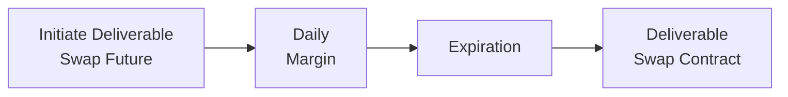
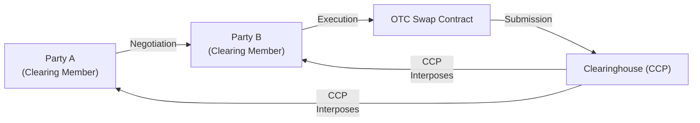

## 10.9 Deliverable Interest Rate Swap Futures & Centrally Cleared Swaps

You might be wondering: Could the world of interest rate swaps get any more interesting than, well, just plain old swaps? Surprisingly, yes. Let’s talk about deliverable interest rate swap futures and centrally cleared swaps. If that sounds intimidating, don’t worry—by the end of this section, you’ll feel more confident about how these instruments work and how market participants use them. Maybe you’re just curious, or maybe you’re someone who’s exploring advanced hedging strategies. In any case, let’s dig in.

### Overview and Rationale

Deliverable interest rate swap futures and centrally cleared swaps have grown in popularity due to heightened regulatory focus on mitigating counterparty risk. Many folks, myself included, remember the 2008 financial crisis vividly—margin calls, massive volatility, plus a whole lot of fear about who was on the other side of each trade. Regulatory bodies worldwide responded by saying, in effect, “We want these derivatives to be safer.” Hence the move toward centralized clearing and standardized contracts.

#### Why These Instruments Matter

• They reduce risk by:
  – Using standardized structures.  
  – Mandating margin requirements and daily marking-to-market.  
  – Involving a credible central clearing counterparty (CCP).

• They increase transparency and liquidity.  
• They allow a broader base of participants—like smaller financial institutions or corporate treasury desks—to hedge interest rate exposures without taking on significant counterparty-credit exposure.  

### Deliverable Interest Rate Swap Futures

A deliverable interest rate swap future is a specialized futures contract where, at the expiration date, you don’t just settle in cash (like you typically do with many interest rate futures). Instead, you “deliver” into an actual interest rate swap contract. This means you’ll effectively convert your futures position into a standard over-the-counter (OTC) swap position with the predetermined terms.

#### Core Structure

To better understand the difference, consider a typical interest rate future (for example, a Three-Month Canadian Bankers’ Acceptance future or a government bond future). At expiration, those settle in cash or deliver a bond. Deliverable swap futures, on the other hand, give you a path directly into a plain vanilla interest rate swap. In Canadian markets, these might be swaps referencing CDOR (although the transition to CORRA-based swaps is ongoing) or other benchmark rates.

It’s actually easier to visualize with a little flow diagram. Here’s a basic mermaid diagram that outlines the path from a deliverable swap future to the final swap position upon expiration:

• A is where you open the futures position.  
• B is the process of daily margining and adjustments typical of futures.  
• C is the point in time where, if you hold the contract to expiration, you face the conversion event.  
• D is the actual interest rate swap position you “receive” at expiry.  

#### Use Cases

– Hedgers who want a standard swap in the future but need short-term price transparency and standardization.  
– Speculators who anticipate interest rate changes and prefer a smaller or standardized contract size.  
– Financial institutions that want the convenience and liquidity of a futures market but eventually require an OTC swap settlement.

From my own perspective, I recall a conversation with a colleague who was excited because deliverable interest rate swap futures helped the bank reduce the complexities of “rolling” hedges. Instead of constantly adjusting a purely OTC swap, they used a short-term deliverable swap future to fine-tune their exposures, and when it expired, it neatly became an OTC swap. They found it surprisingly straightforward—like melding the best of both futures and swaps.

### Centrally Cleared Swaps

Centrally cleared swaps are slightly different. You still have an OTC swap agreement between two parties, but once the trade is executed, it gets submitted to a clearinghouse (the central counterparty—CCP). The clearinghouse then essentially steps in and becomes the buyer to every seller and the seller to every buyer. “What does that even mean?” you might ask. Well, it means that instead of you worrying about whether your counterparty might default, your primary concern is whether the clearinghouse can pay. And central clearinghouses are typically well-capitalized and heavily regulated—reducing overall systemic risk.

#### Benefits of Central Clearing

• Counterparty Risk Reduction: The CCP handles daily margin calls (initial and variation margin) to keep your risk in check.  
• Regulatory Compliance: In Canada, the Canadian Securities Administrators (CSA) introduced mandatory clearing requirements for certain swaps. These are captured under instruments such as CSA National Instrument 94-101.  
• Netting Efficiency: If you have multiple deals with multiple counterparties, a CCP can net your exposures, significantly reducing the amount of collateral you have to post.  
• Transparency and Reporting: Clearinghouses require standardized reporting, daily mark-to-market, and transparent margin models.

A friend of mine once described central clearing as a “friendship circle” in the derivatives world—everyone gets to rely on the same “big buddy” (the CCP) for credit performance, rather than having to individually worry about each other going under. You know, it’s not a perfect analogy, but it gets the point across: you shift your counterparty risk from dozens of bilateral relationships to just one relationship with the CCP.

### Mechanics and Process

Let’s do a quick rundown of how a swap goes from a plain bilateral negotiation to a fully cleared position:

1. Two parties (could be banks, hedge funds, corporations, etc.) agree on swap terms (notional, tenor, fixed/floating rate, payment frequency).  
2. The swap is executed but subject to clearing.  
3. The trade is submitted to a recognized CCP (in Canada, the Canadian Derivatives Clearing Corporation—CDCC—often steps in).  
4. The CCP assigns each party an identical but opposite contract. So, from your perspective, you now have a contract with the CCP, not the original counterparty.  
5. The CCP calculates initial margin requirements. Both parties must post initial margin according to the CCP’s risk methodology.  
6. Each day, the CCP marks the swap to market, and either party might owe or receive variation margin to reflect daily changes in swap value.  

Here’s a simple mermaid diagram to illustrate this flow:

Once the swap is “novated” (meaning the original contract is replaced by two new contracts with the CCP), daily margin flows begin. The risk is no longer bilateral but centralized.

### Collateral and Margin Requirements

Margin is the lifeblood that keeps the system stable. You might be thinking, “But didn’t we have margin with exchange-traded futures, too?” Absolutely. The main distinction is that with an OTC swap, you traditionally had something called a credit-support annex (CSA) if you even had margin at all—some big players used to skip it altogether, trusting each other’s credit worthiness. With central clearing, margin is mandatory and strictly enforced.

#### Types of Margin

• Initial Margin: A good-faith deposit reflecting the potential future exposure of the swap.  
• Variation Margin: Mark-to-market payments that move daily (or intraday) to ensure the contract’s current value is fully collateralized.  

#### Stress Testing

Clearinghouses run daily (and often intraday) stress tests to ensure they have enough collateral on hand to manage extreme market events. After the global financial crisis, regulators worldwide demanded that clearinghouses demonstrate their resilience under “worst-case” scenarios.

### Mandatory Clearing Thresholds

In Canada, the CSA has set forth rules like National Instrument 94-101 (“Mandatory Central Counterparty Clearing of Derivatives”). Under these regulations, certain types of market participants—those with notional exposures above a specified threshold—are required to clear specific classes of interest rate swaps. The logic is: if you’re big enough to pose systemic risk, we want to ensure your trades are as safe and transparent as possible.

Smaller players might still choose clearing voluntarily because it can be cost-effective and reduce bilateral credit lines. But once the threshold is triggered, clearing becomes mandatory.

### Comparing Deliverable Swap Futures and Cleared Swaps

Both deliverable swap futures and cleared swaps aim to reduce risk and standardize processes. But they’re not identical.

| Feature                      | Deliverable IR Swap Futures                                                                                                                       | Centrally Cleared Swaps                                                                                                                                                                      |
|-----------------------------|------------------------------------------------------------------------------------------------------------------------------------------------------|------------------------------------------------------------------------------------------------------------------------------------------------------------------------------------------------|
| Standardization             | Highly standardized (exchange-traded contract specifications)                                                                                       | More flexible terms than futures, but still must meet CCP-accepted parameters                                                                                                                  |
| Counterparty Risk Management| Managed by the exchange clearinghouse (futures model)                                                                                                | Managed by a specialized CCP (swap clearing model)                                                                                                                                             |
| Daily Margin                | Required (futures margin regime)                                                                                                                     | Required (CCP margin regime)                                                                                                                                                                   |
| Conversion at Expiry        | Converts into an OTC swap at expiration                                                                                                              | Remains an OTC contract but novated to a CCP upon execution                                                                                                                                   |
| Customization Availability  | Limited: Exchange defines contract size, maturity, etc.                                                                                             | Greater flexibility in setting notional amounts, maturities, payment frequency, etc. as long as they fall under standard clearable categories                                                  |
| Examples of Use             | Traders who want short-term liquidity, eventually require a standard swap after expiry                                                               | Banks, institutional investors, and corporates seeking long-term hedges but wanting to reduce bilateral credit risk through CCP clearing                                                      |

### Practical Examples and Case Studies

#### Case Study: Corporate Hedger Moves from Bilateral to Deliverable Swap Futures

Imagine a Canadian manufacturing company that has a big floating-rate loan coming due in 9 months. They plan to lock in a fixed rate for the next five years but aren’t ready to finalize those swap terms yet. The CFO decides to use deliverable interest rate swap futures:

• Buys a deliverable swap future for a notional of CAD 10 million.  
• Posts initial margin with the exchange clearinghouse.  
• Monitors daily margin calls and pays or receives variation margin.  
• In 9 months, the future expires, and the CFO “delivers” into a 5-year interest rate swap at the fixed rate established in the futures contract.  
• The CFO is now effectively hedged for the next five years against rising interest rates, all while enjoying the standardization and transparency of the futures market.

The CFO’s feedback later? They were happy about the price transparency they got from the futures market. They also said it saved them from negotiating complicated bilateral credit terms early on.

#### Case Study: Swap Dealer Using Centrally Cleared Swaps

A Canadian swap dealer at a major bank is frequently entering into offsetting or partially offsetting swaps—some with corporate clients, others with hedge funds. Instead of maintaining countless bilateral agreements, the dealer chooses to clear through CDCC. Because all trades go to the CCP:

• The dealer posts an initial margin that reflects the net risk across all positions.  
• Variation margin is aggregated, simplifying daily operational overhead.  
• The dealer’s internal credit risk managers find it easier to track counterparty risk—since, effectively, the risk is consolidated at the clearinghouse.  
• The bank meets regulatory requirements, especially if they surpass the mandatory clearing threshold.  

In the end, the swap dealer can handle more trades at lower cost, because collateral is netted out across multiple transactions at the CCP. This netting advantage can be huge, especially for big financial institutions juggling hundreds (or thousands) of swap trades.

### Best Practices and Common Pitfalls

Best practices:

• Monitor margin calls proactively. Failing to meet a margin call can lead to forced liquidation or closed-out positions.  
• Keep an eye on liquidity. Deliverable swap futures are still evolving. While they typically carry good liquidity, it’s wise to confirm daily volumes and open interest.  
• Stay current with regulatory changes. The CSA sometimes updates thresholds or adds new categories of derivatives subject to mandatory clearing.  

Common pitfalls:

• Underestimating margin requirements. If the market moves significantly, you might face large variation margin calls.  
• Overlooking operational complexities. Even though clearing streamlines credit risk, it adds other operational tasks, such as daily reporting, technology integration with CCP systems, and robust back-office processes.  
• Confusing deliverable swap futures with standard interest rate futures. They share many features, but you absolutely need to understand that final “delivery” step into an OTC swap.  

### Margin Calculations (A Quick Peek)

While entire textbooks are devoted to margining calculations, here’s a small KaTeX snippet to illustrate:


\text{Variation Margin} = (\text{Settlement Price}_{\text{today}} - \text{Settlement Price}_{\text{yesterday}}) \times \text{Contract Value}


In simpler terms, each day’s profit or loss is calculated based on the change in the futures’ settlement price (for deliverable swap futures) or the swap’s updated valuation (for cleared OTC swaps). That difference is either paid or received as variation margin. If the notional is CAD 1 million and the contract changes by 0.10 points (which equals CAD 1,000 in underlying value), you’d pay or receive CAD 1,000. Of course, actual margin calculations can be more complex depending on the clearinghouse’s risk model.

### Regulatory Context in Canada

Because we’re focusing on Canadian markets:

• CIRO (Canadian Investment Regulatory Organization) oversees investment dealers.  
• The Canadian Derivatives Clearing Corporation (CDCC) is the main clearinghouse for exchange-traded derivatives and certain cleared OTC transactions in Canada.  
• The CSA (Canadian Securities Administrators) sets national instruments that unify rules across provinces—like 94-101 for mandatory clearing.  

To remain in compliance:

• Know your reporting requirements to trade repositories (e.g., timeline for post-trade reporting).  
• Watch for new categories of derivatives that become subject to mandatory clearing.  
• Keep relationship lines open with the CCP to address collateral issues quickly.

### Future Trends

Deliverable swap futures and centrally cleared swaps continue to evolve:

• Shift Towards Risk-Free Rates (RFRs): With Canada transitioning away from CDOR to CORRA-based swaps, expect deliverable swap futures to adapt.  
• Greater Automation and Electronification: We’ll likely see more technology to facilitate seamless margin calculations, real-time risk management, and automated compliance checks.  
• Expanding Product Range: We might see new maturities, tenors, or even specialized features (like ESG-linked deliverable swap futures).  

### Glossary

Deliverable Swap Futures: A futures contract where, upon expiration, a standard interest rate swap is created.  
Centrally Cleared Swaps: OTC swaps that are novated to a central clearinghouse to reduce bilateral counterparty risk.  
Margin Requirements: Collateral posted to the clearinghouse or exchange to cover potential losses.  
CDCC (Canadian Derivatives Clearing Corporation): The primary clearing entity for derivatives in Canada.

### Additional Resources

• Canadian Derivatives Clearing Corporation:  
  https://www.cdcc.ca/  
• CSA National Instrument 94-101 (CCP Clearing)  
• Colin A. Carter, “Futures and Options Markets” – an academic resource for those wanting a deeper dive.  
• CIRO: https://www.ciro.ca – for up-to-date regulatory information in Canada.  

### Final Thoughts

At first glance, deliverable interest rate swap futures and centrally cleared swaps might look complicated—there’s daily margining, standardized contract terms, and shifting requirements to keep track of. But once you get the hang of them, these instruments are invaluable for managing interest rate risk in a safer, more transparent way. They bring the best of both worlds: the flexibility of a traditional OTC swap combined with the standardization, liquidity, and security of an exchange or CCP environment.

If you’re brand new to all this, maybe start by tracking actual market data on deliverable swap futures. Watch how the daily settlement prices fluctuate. That alone can be a great lesson in how interest rate expectations shift over time. Then, if you feel more adventurous, simulate a small swap strategy in a mock portfolio. You’ll see firsthand how margin calls, daily price changes, and eventually, a final swap position unfold.

In any case, you’re now equipped with foundational knowledge to dive deeper into these innovative interest rate instruments. Good luck—and keep exploring!

---

## Sample Exam Questions: Deliverable Interest Rate Swap Futures & Centrally Cleared Swaps



### Deliverable interest rate swap futures are unique because:
- [ ] They do not involve margin payments.
- [x] They convert into an OTC swap position at expiration.
- [ ] Their underlying is always a corporate bond.
- [ ] They are not subject to regulation in Canada.
> **Explanation:** Deliverable swap futures transition into a standard OTC swap at expiration, which distinguishes them from standard futures contracts.

### Which of the following is a key benefit of centrally cleared swaps?
- [x] Counterparty risk is significantly reduced by using a CCP.
- [ ] They allow for unlimited contract customization with no standard terms.
- [ ] They eliminate all forms of margin requirements.
- [ ] They are not permitted under Canadian regulations.
> **Explanation:** By centralizing the clearing function in a CCP, counterparty risk is reduced through margining and standardized processes.

### What daily process does a CCP typically perform on a centrally cleared swap?
- [ ] Weekly netting of exposures with no daily adjustments.
- [x] Marking-to-market and collecting/remitting variation margin.
- [ ] Only initial margin collection with no variation margin.
- [ ] Mandatory physical delivery of government bonds.
> **Explanation:** CCPs recalculate the market value of positions daily and collect variation margin to reflect gains or losses.

### A corporate treasurer uses a deliverable interest rate swap future to lock in interest rates. At the expiration of that future, they:
- [ ] Must settle entirely in cash without any further obligations.
- [x] Automatically enter into a standard OTC swap at the agreed fixed rate.
- [ ] Receive shares in the clearinghouse.
- [ ] Are subject only to a final margin call and no swap contract is created.
> **Explanation:** Deliverable futures convert into an OTC swap at the prearranged terms upon contract expiration.

### Under Canadian regulations, which entity is primarily responsible for overseeing the clearing of derivatives?
- [ ] The Canadian Federal Reserve.
- [ ] MFDA, which remains the main regulator.
- [x] The Canadian Derivatives Clearing Corporation (CDCC).
- [ ] Provincial securities regulators have no role in this process.
> **Explanation:** CDCC is the main recognized clearing entity in Canada for derivatives, operating under the oversight of the CSA and CIRO.

### Mandatory clearing thresholds determined by the CSA are designed to:
- [x] Require large market participants to centrally clear certain swaps.
- [ ] Prevent the use of centrally cleared swaps by large institutions.
- [ ] Force the closure of all bilateral swap relationships.
- [ ] Exempt major banks from posting margin.
> **Explanation:** The CSA sets thresholds requiring major participants to clear certain types of swaps to reduce systemic risk.

### Which of the following is NOT true about margin requirements in cleared swaps?
- [ ] Margin includes both initial and variation components.
- [x] Margin is required only at the inception of the swap and never updated.
- [ ] Variation margin reflects the daily change in the swap’s market value.
- [ ] CCPs run stress tests to determine sufficient margin models.
> **Explanation:** Cleared swaps require ongoing margin updates. Variation margin is posted daily or even intraday.

### One main advantage deliverable swap futures have over standard interest rate futures is:
- [ ] Lower regulatory scrutiny.
- [ ] The absence of margin calls.
- [x] The ability to seamlessly transition into a longer-term OTC swap.
- [ ] Zero capital requirements for brokers.
> **Explanation:** Deliverable swap futures allow holders to move into a standard interest rate swap upon expiry, differentiating them from standard interest rate futures.

### Why might large banks prefer to clear their swaps?
- [x] Because netting of multiple positions at the CCP reduces collateral costs.
- [ ] Because bilateral credit risk is more attractive to them.
- [ ] Because clearing eliminates all compliance procedures.
- [ ] Because it increases the complexity of their hedging strategies.
> **Explanation:** Clearinghouses allow netting, which typically reduces the total margin needed compared to bilateral agreements with multiple counterparties.

### True or False: With deliverable swap futures, final settlement always involves a physical exchange of government bonds.
- [ ] True
- [x] False
> **Explanation:** Deliverable swap futures do not necessarily settle via bonds; they deliver into an OTC interest rate swap, not a bond.


