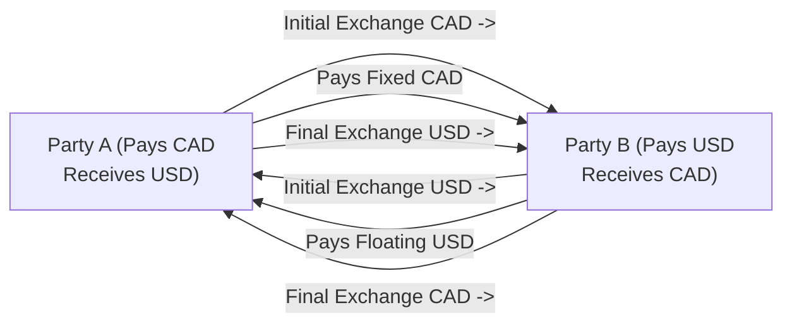

## 11.1 The Structure of a Currency Swap

Imagine you're driving through two different countries with two different currencies—say Canada and the United States. You need both Canadian dollars (CAD) and U.S. dollars (USD) at different points in your journey. Now, suppose your friend has USD but needs CAD. Rather than both of you going to a currency exchange booth and paying transaction fees (and dealing with unpredictable exchange rates!), you decide to swap amounts and pay each other interest for the time you hold the other’s currency. That’s kind of like how a currency swap works—except, of course, a currency swap is usually more formal, spelled out in a contract, and involves a lot more zeros in the notional amounts.

Currency swaps can feel a bit intimidating at first, but trust me, once you get the hang of the basic structure, it really just clicks. Let’s explore what a currency swap is, why it exists, and how it’s put together. We’ll look at some real-world examples and diagrams, while also bringing in some personal anecdotes and usage tips that might help you connect with the concepts. And to keep things interesting, I’ll occasionally sprinkle in a question to nudge you toward thinking it through for yourself: “Why might a company in Canada borrow in USD if it ultimately needs CAD?” Let’s find out together.

### The Essence of a Currency Swap

A currency swap is a formal agreement between two parties—often large financial institutions or corporations—to exchange principal amounts and/or interest rate payments in different currencies. One party pays interest in one currency, while the other party pays interest in another currency. At maturity, the principal amounts are swapped back (or “exchanged back”) to their original owners, although sometimes there is also an initial exchange right at the start.

Although the structure has many variations, the basic formula is:

• Party A: Borrows an amount in Currency 1, pays interest on that Currency 1, and receives interest in Currency 2.  
• Party B: Borrows an amount in Currency 2, pays interest on that Currency 2, and receives interest in Currency 1.

The twist (and the reason we call it a “swap”) is that each party commits to providing the other with the currency they inherently “need.” So if a Canadian exporter is flush with CAD but needs USD, it might swap currency flows with a U.S. importer that’s swimming in USD but needs CAD. Each side ends up paying interest primarily on the currency borrowed, while receiving interest on the currency lent.

### Key Components and Terms

Before diving deeper into the structure, let’s define a few building blocks. If this feels like looking at a dictionary, hey, trust me, this quick glossary will help you immensely:

• Notional Principal: The theoretical base amount on which the interest calculations are made. It’s usually not physically exchanged except at the start (if they choose to) and at the final maturity—unless, of course, they’ve opted not to do any initial exchange.  
• Fixed Rate Leg: A leg where one party pays a fixed interest rate on the notional principal.  
• Floating Rate Leg: A leg where a party pays a floating interest rate (for instance, referencing rates like CORRA in Canada or SOFR in the U.S.).  
• Currency Exchange Rate: The agreed rate used to determine the equivalent notional amounts when the currencies get exchanged (initially, at maturity, or both).  
• ISDA Master Agreement: A standardized contract widely used in OTC derivatives. It outlines the legal terms, default provisions, netting, and other big-picture items.  
• Credit Support Annex (CSA): A document that rides on top of the ISDA Master Agreement and lays out how collateral (like cash or securities) is posted between the swap parties, helping to reduce credit risk.  
• Start-of-Swap Exchange (Initial Exchange): The optional up-front exchange of principal amounts in different currencies.  
• End-of-Swap Exchange (Final Exchange): The standard practice of returning principal amounts to each other when the swap ends (i.e., the notional amounts in each currency are “swapped back”).

These define how money flows, how risk is handled, and how each party’s obligations are spelled out. If you need a quick mental image: picture two parallel highways, each carrying traffic in opposite directions (one highway for CAD, the other for USD), and the travelers are paying “tolls” in interest.

### Why Currency Swaps Exist

You might wonder, “Why do we need all this complexity?” Well, currency swaps solve a handful of real-world challenges:

• Hedging Foreign Exchange (FX) Risk: Companies with cross-border operations might have income denominated in one currency but expenses (like debt repayments) in another. A currency swap lines up their cash inflows and outflows more naturally.  
• Accessing Favorable Borrowing Rates: Maybe a European corporation can borrow euros cheaply, but it desperately needs U.S. dollars for an acquisition in the U.S. Meanwhile, a U.S. bank can borrow dollars cheaply, but it needs euros for a European investment. By swapping, both parties can effectively “bring their own best rates to the table.”  
• Diversifying Currency Exposure: Investors or corporations might want to hold assets in multiple currencies to hedge global risks or gain a strategic foothold in foreign markets.

On a personal note, I once worked with a client who was exporting processed foods from Canada to the U.K. and receiving British pounds. They had borrowed in Canadian dollars at a floating rate, and the exchange rate risk was swallowing their profits. A simple currency swap helped them convert incoming GBP into CAD at known rates, simultaneously locking in a fixed cost of financing. They were pretty relieved and said, “Guess I just needed a little currency ‘magic’!” But it wasn’t magic—just a standard currency swap.

### Typical Structure of Cash Flows

Let’s break down the mechanics step by step. For simplicity, I’ll describe a swap where Party A pays a fixed rate in CAD and receives a floating rate in USD. Meanwhile, Party B pays a floating rate in USD and receives a fixed rate in CAD. Let’s assume they do exchange notional principal at both the start and the end, so you see the full picture.

1. Initial Exchange (Optional)  
   • Party A delivers an agreed-upon CAD notional to Party B.  
   • Party B delivers the USD notional to Party A, using a pre-agreed exchange rate.  

2. Ongoing Interest Payments  
   • Party A pays a fixed rate on the CAD notional to Party B (e.g., 3.5% fixed).  
   • Party B pays a floating rate on the USD notional to Party A (e.g., SOFR + 1.00%).  

3. Final Exchange (Maturity)  
   • At the end, both revert the initial principals: A gets the CAD notional back, B gets the USD notional back.  

In practice, these interest payments typically happen on a set schedule (semiannual, quarterly, etc.), with the actual frequency spelled out in the swap contract. The floating rate payments get updated each payment period, reflecting the benchmark interest rate’s changes.

Below is a little flow diagram that might help. Let’s consider a simple schematic for these currency flows in Mermaid.

Admittedly, in reality these net payments can be set up so that only the difference is exchanged (netting). But the conceptual flow is that each side owes interest on its leg.

### Fixed-Fixed vs. Fixed-Floating Swaps

Currency swaps often come in two flavors:

• Fixed-Fixed Currency Swaps: Each party agrees to pay a fixed interest rate in its borrowed currency. This might make sense if both companies want interest-rate certainty.  
• Fixed-Floating Currency Swaps: One side pays a fixed rate in one currency, the other pays a floating rate in the other currency. This is common if, for example, one side is worried about rising interest rates in one currency region while the other side might be comfortable with floating rates (or can pass them on to clients).

As you can imagine, you can have floating-floating structures as well, though they get trickier to manage and require a careful approach to referencing interest rate benchmarks (like CORRA, SOFR, EURIBOR, etc.).

### Regulatory Considerations in Canada

Because currency swaps often trade in the Over-the-Counter (OTC) derivatives marketplace, they come under the purview of Canadian authorities such as CIRO (Canadian Investment Regulatory Organization) and the CSA (Canadian Securities Administrators). Historically, we had separate self-regulatory organizations known as IIROC and the MFDA, but they merged into CIRO in 2023. So references to IIROC or MFDA are purely historical. Now, CIRO is the main body overseeing such trades in Canada, alongside the CSA’s provincial and territorial rules.

Regulations can require reporting, clearing (for certain large transactions), margin (collateral) posting if settlement risk arises, and requirements for daily or quarterly disclosure. You typically will see these terms spelled out under your ISDA Master Agreement. Key points:

• Reporting Obligations: Trades must be reported to a recognized trade repository.  
• Clearing Thresholds: Only large or standardized trades might be subject to central clearing, though many currency swaps remain bilateral.  
• Collateral Requirements: Under a Credit Support Annex, each party must post collateral if the mark-to-market (MTM) on the swap moves against them beyond a certain threshold. This helps prevent credit defaults.

For official updates on these topics, check out:  
• CIRO: https://www.ciro.ca  
• CSA: https://www.securities-administrators.ca  

### Documentation and the ISDA Master Agreement

In the world of OTC derivatives, the ISDA Master Agreement is your “umbrella” contract. It lays out:

• The legal definitions and events of default.  
• Netting provisions that let you offset multiple trades with the same counterparty.  
• How to handle a credit event or early termination.  
• Collateral terms specified in the accompanying CSA.  

This agreement can span many years and multiple derivatives transactions. Each new currency swap is captured by a “confirmation” that references the ISDA Master Agreement. So if you decide to do repeated trades, you don’t sign a new master agreement each time—it’s basically an add-on to the existing one.

### Practical Example

Let’s walk through a quick scenario. Suppose we have:

• Canadian Company (CanCo): Can borrow in CAD at 3.00% fixed but requires USD to fund an acquisition. The direct cost of borrowing USD might be 4.50% fixed if it tries to go to the U.S. debt markets.  
• U.S. Company (USCo): Can borrow in USD at 3.00% floating (SOFR + 1.00%). However, it needs some CAD to pay Canadian suppliers and wants fixed CAD payments to avoid interest rate swings. If it tried to borrow CAD directly, maybe it would pay 3.75% fixed.

They agree to do a currency swap:

1. Notional:  
   • CAD $10 million  
   • USD $7.5 million (assuming an exchange rate of, say, 1 CAD = 0.75 USD)

2. Initial Exchange:  
   • CanCo gives $10 million CAD to USCo.  
   • USCo gives $7.5 million USD to CanCo.  

3. Interest Payments:  
   • CanCo “pays” ~3.00% on the CAD notional to USCo and receives from USCo the cost of the floating USD (~3.00% on $7.5 million).  
   • The effect is that CanCo effectively funds its $7.5 million USD at the cheaper rate USCo can obtain, and USCo effectively funds its $10 million CAD at the cheaper rate CanCo can obtain.  

4. Final Exchange at Maturity:  
   • They swap back the $10 million CAD and $7.5 million USD at the contract’s end date (assuming no changes in the exchange rate for the principal amounts if that was the agreed structure).

In effect, each party “earned” a better interest rate in the foreign currency because they leveraged the other’s credit advantage in that market.

### Duration and Flexibility

Currency swaps can have durations from a few months to 20+ years. The tenor is chosen based on the underlying business purpose. If your cross-border construction project will take five years, you might prefer a five-year swap so that you lock in exactly the foreign currency flows you need.

Sometimes it’s not just about locking in a set timeframe. Swaps can be terminated or restructured midstream if conditions change (though typically at a cost). A friend of mine in corporate treasury once had to terminate a currency swap halfway through because the project in Europe got canceled. They ended up paying the “market value” of the swap’s net present value, which turned out to be fairly expensive. So be mindful that these contracts can be large financial instruments with their own valuation and potential early-termination charges.

### Common Pitfalls

Though currency swaps are a great tool, they can come with their share of pitfalls if not used carefully:

• Mismatch of Cash Flows: If your actual foreign currency inflows don’t line up with the swap’s schedule, you can face liquidity issues.  
• Counterparty Risk: If your swap counterparty defaults, you’re left in the lurch unless you have robust collateral and netting arrangements.  
• Regulatory Scrutiny: Failing to properly report or clear trades could lead to penalties.  
• Market Risk at Termination: If you need to unwind a swap early, you could face big gains or losses depending on how market rates and exchange rates have moved.

### Tools and Resources

For those who want to see how these swaps get valued in real time, open-source libraries can offer a frame of reference. Tools like QuantLib (https://www.quantlib.org/) provide frameworks to model interest rates, discount factors, and currency conversions. They’re particularly handy for building net present value (NPV) models of your swap’s projected cash flows.

Some relevant references:

• CIRO (for Canadian regulatory oversight): https://www.ciro.ca  
• CSA (for Canadian Securities Administrators guidance): https://www.securities-administrators.ca  
• ISDA (for standardized OTC derivatives documentation): https://www.isda.org/  
• “Options, Futures, and Other Derivatives” by John C. Hull (classic text)  
• “Fixed Income Securities” by Tuckman & Serrat (deep dive into fixed income markets and derivatives)

### Bringing It All Together

A currency swap is one of those financial instruments that can solve a lot of real-world financing problems—if you structure it right and manage it well. You can hedge against unexpected shifts in exchange rates, leverage another party’s borrowing strengths in a different currency market, or simply lock in stable foreign currency inflows and outflows.

Even though we live in an interconnected global economy, currencies remain distinct and tradeable. A currency swap harnesses those differences for mutual benefit—think of it as a handshake across borders. “Let’s each do what we’re good at, and we can swap the benefits.” Of course, to keep that handshake going until maturity, you’ll need the right legal documents (ISDA Master Agreement plus the CSA), a good handle on reporting obligations to regulators like CIRO, and a savvy approach to evaluating credit risk and collateral.

And here’s the kicker: once you “get” one currency swap, you’ve laid the groundwork for many other swaps—interest rate swaps, commodity swaps, etc. The difference is the underlying risk you’re addressing. So if you find yourself strolling around the finance department saying, “Huh, maybe we can do a swap for that issue,” you’re now speaking the language of global finance.

Happy swapping, folks!

---

## Sample Exam Questions: The Structure of a Currency Swap



### Which of the following best describes a currency swap?

- [x] An agreement to exchange principal amounts and/or interest payments in different currencies.
- [ ] A guarantee to protect against stock market declines.
- [ ] A type of currency future traded on an exchange.
- [ ] A short-term collateralized loan between two central banks.

> **Explanation:** A currency swap specifically involves exchanging interest or principal in different currencies under a contractual agreement. It is not the same as a futures contract, nor is it simply a guarantee protecting stock market investments.

### In a fixed-for-floating currency swap, which of the following is true?

- [x] One party pays a fixed rate in one currency while receiving a floating rate in another currency.
- [ ] Both parties pay fixed rates in their respective currencies.
- [ ] Both parties receive floating rates in their respective currencies.
- [ ] Neither party exchanges principal amounts at the start or end of the contract.

> **Explanation:** A fixed-for-floating currency swap involves one party paying a fixed rate on its notional in one currency, while receiving a floating rate on another currency's notional. Principal exchange can occur at the start and/or the end; that’s optional but frequently part of the contract.

### What is the primary purpose of a Credit Support Annex (CSA) in a currency swap?

- [ ] To determine the exact dates for final exchange of principal.
- [x] To define the collateral, margining, and credit support terms between counterparties.
- [ ] To enforce insurance requirements for currency fluctuations.
- [ ] To set the floating rate reference benchmark.

> **Explanation:** A CSA spells out how counterparties will post, manage, and return collateral for the duration of the swap. It is an integral part of managing credit risk.

### Party A enters a currency swap to manage FX risk. Which of the following is the most likely motivation?

- [ ] To arbitrage short-term interest rates across all major financial hubs.
- [x] To hedge future foreign currency payments or receipts.
- [ ] To bypass local financial regulations.
- [ ] To reduce the cost of equity issuance.

> **Explanation:** One of the main motives for using a currency swap is to hedge FX risk. For instance, a company receiving revenue in USD but paying expenses in CAD might want to lock in predictable exchange rates.

### In a typical currency swap, which party is responsible for interest payments in a floating-for-floating exchange setup?

- [x] Each party pays floating interest on the notional in the currency it borrows.
- [ ] Only one party makes floating interest payments, while the other pays a lump sum at maturity.
- [ ] Neither party pays any interest when both legs are floating.
- [ ] The floating rate is continuously paid daily rather than on scheduled intervals.

> **Explanation:** In a floating-for-floating currency swap, each side pays the floating rate on the borrowed notional of its specific currency. Payments usually happen at agreed intervals, not continuously daily.

### When parties choose to exchange notional principal at the start of a currency swap, this exchange is commonly referred to as:

- [x] The initial exchange.
- [ ] The partial redemption.
- [ ] The final settlement.
- [ ] The early termination.

> **Explanation:** The upfront transfer of principal in different currencies is known as the initial exchange. The final exchange occurs at maturity.

### Which regulatory body oversees reporting obligations for currency swaps in Canada following the amalgamation of IIROC and MFDA?

- [ ] ISDA
- [x] CIRO
- [ ] OCC
- [ ] FINRA

> **Explanation:** Following the merger of IIROC and the MFDA, Canada’s primary self-regulator for investment dealers and mutual fund dealers is CIRO (Canadian Investment Regulatory Organization).

### One important advantage of a currency swap to a company with an international business footprint is:

- [ ] It guarantees a profit on the currency exchange.
- [ x] It can lock in known interest costs and hedge FX exposure simultaneously.
- [ ] It eliminates the need for hedging other risks, such as commodity prices.
- [ ] It immediately increases the company’s stock price.

> **Explanation:** By using a currency swap, a firm can match its currency inflows and outflows more predictably, thereby stabilizing interest expenses and exchange rates. However, it doesn’t guarantee profits or manage unrelated risks like commodities.

### Which of the following resources would be most useful for modeling swap cash flows and interest rates on an open-source platform?

- [ ] A personal spreadsheet shared in an email thread.
- [ ] The official stock exchange ticker page.
- [x] QuantLib, an open‑source library for quantitative finance.
- [ ] A national data archive for equity-only transactions.

> **Explanation:** QuantLib (https://www.quantlib.org/) is a widely used open-source library specifically designed to handle modeling of cash flows, swaps, interest rates, and other quantitative finance tasks.

### True or False: In a currency swap, the notional principal of both currencies is always physically exchanged at the start of the contract.

- [x] True
- [ ] False

> **Explanation:** While some swaps do not require initial exchange, a significant portion of currency swaps involve at least a final exchange, and many also have an initial exchange. It’s not mandatory, but it is indeed common practice.


