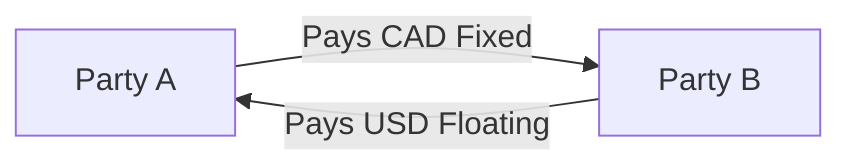
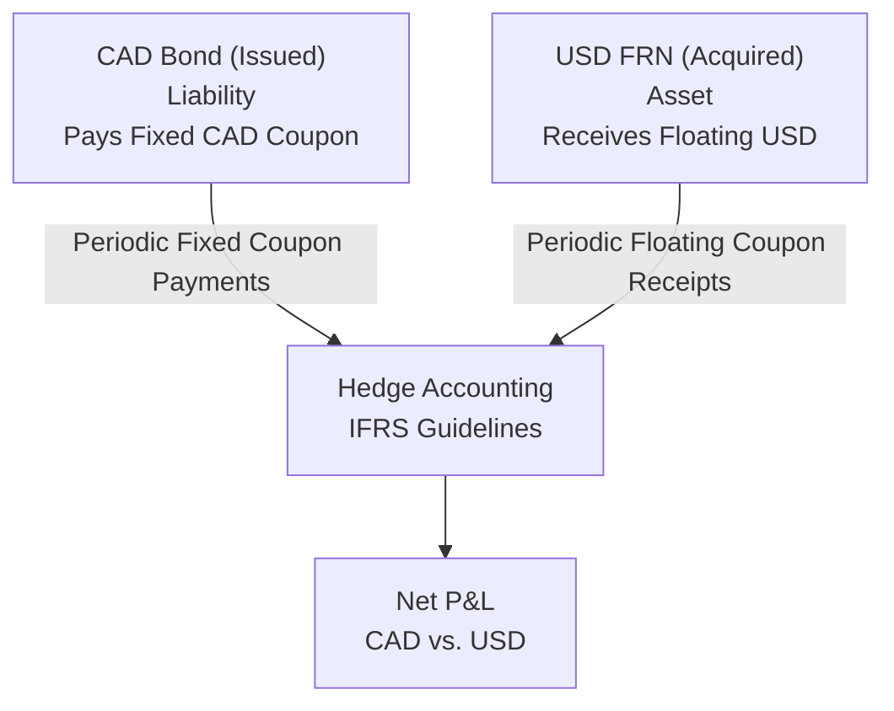

## 11.2 Currency Swaps as a Portfolio of Fixed- and/or Floating-Rate Bonds

Have you ever tried to juggle two things at once—maybe a cup of coffee and a phone call, or balancing your own checkbook while also reconciling a friend’s? Sometimes it feels like we’re just swapping tasks back and forth. Interestingly, that’s kind of how currency swaps can be visualized in the real financial world (minus the spilled coffee, hopefully). The idea is that a single currency swap can be viewed as essentially holding one bond position while issuing another. When a swap calls for one party to pay a fixed rate in Canadian dollars (CAD) and receive a floating rate in U.S. dollars (USD), it’s almost like you’ve borrowed money in CAD at a fixed rate and simultaneously loaned money in the U.S. market at a floating rate—or vice versa. This “bond analogy” clarifies how interest rates, principal exchanges, and credit exposures work in practice.

Below, we’ll break down the key points that make this perspective powerful and how it helps with risk management, modeling, and even accounting for these transactions. We’ll keep it slightly informal, though, so feel free to imagine you and I chatting about this at a coffee shop with laptops out, scanning our favorite financial analytics tools.

### The Basic Bond Analogy

When two parties enter into a currency swap, each side agrees to:

• Exchange principal amounts in two different currencies at the start (or sometimes only notionally keep track of principals).  
• Periodically exchange interest payments—one leg typically being fixed and the other floating.  
• Re-exchange the principal amounts at maturity (unless it’s a non-principal-exchange structure).  

From a purely economic viewpoint, you can think of this in terms of “assets” and “liabilities,” akin to having two bonds:

• Bond A: A fixed-rate bond (liability) in CAD.  
• Bond B: A floating-rate note (asset) in USD.  

Why does this matter? Because each of these “bonds” has its own characteristic risk profile. By conceptually splitting the swap into “Bond A” and “Bond B,” institutional treasurers, risk managers, and even individuals new to swaps can more intuitively track interest rate exposures, measure currency risk, and plan for cash flows over time.

Imagine you hold a bond that pays you interest in USD every quarter. Meanwhile, you owe interest on a fixed-rate CAD bond every six months. If you’re netting these out, you effectively see how the currency swap’s net cash flows map to the difference between those two hypothetical bond coupons. That’s the essence of the bond analogy.

### Mapping Payment Flows

Let’s paint a picture of how the payments might flow between two counterparties—Party A and Party B. Suppose Party A pays fixed CAD and receives floating USD. Economically, it looks like this:

- Party A has “issued” a notional CAD bond (i.e., it owes fixed interest in CAD).  
- Party A holds a “floating-rate note” in USD (so it receives floating USD interest).  

Here’s a simple Mermaid diagram to illustrate the flow:

In practice, there can also be an initial exchange of principal (CAD for USD) and a final exchange at maturity. Each side is effectively “borrowing” in one currency and “lending” in another. Of course, the question arises: “Which side is the asset, and which side is the liability?” That depends on whether you’re paying or receiving on the specific leg (fixed or floating) and in which currency you do it.

### Interest Rate Risk and Duration

Now, let’s step beyond mere payment flows and talk interest rate risk. Say you’re paying a fixed CAD rate. This side behaves like a bond with a certain duration—meaning if CAD interest rates abruptly shift, the value of that “synthetic bond” changes according to how many years remain and how sensitive it is (the “duration”). Meanwhile, receiving floating USD rate behaves more like a floating-rate note (FRN) with generally lower duration because floating coupons reset periodically.  

By decomposing a currency swap, you can measure each leg’s duration individually rather than guessing, “Will my swap portfolio do well if USD or CAD interest rates climb?” You’d see that your net interest rate sensitivity is the difference in durations between your synthetic fixed bond and your synthetic floating bond. This is super handy for risk management. Treasury departments often use advanced systems—like Moody’s Analytics or S&P Global risk solutions—to measure these durations more precisely. And folks with an itch for open-source frameworks can look at options like QuantLib for modeling swap cash flows.

### Principal Exchanges as Bond Redemptions

In many currency swaps, the parties also exchange the notional amounts at the start and then re-exchange them at maturity. From the bond analogy perspective:

• At inception, it’s like simultaneously issuing a CAD bond (you receive CAD) and buying a USD note (you pay out USD).  
• At maturity, you redeem the CAD bond (paying back the CAD principal) and get repaid on your USD note (receiving USD principal).  

This re-exchange is effectively paying off one bond while collecting redemption from the other. And if your swap doesn’t include an initial principal exchange, it’s akin to just having the interest portions. But the big difference is that, in many cases, currency swaps are structured without an upfront exchange of principal—only at the end. This can be done to reduce complexity or credit exposure.

### Currency Risk and FX Movements

Of course, we can’t talk about currency swaps without highlighting the currency risk. If you’re paying CAD but receiving USD, the net value of the contract depends significantly on the CAD/USD exchange rate. Decomposing the swap helps you see this because you realize you truly shorted a USD bond and gone long a CAD bond, or vice versa, depending on your perspective.

In practice, major institutions watch these exposures closely. Maybe you’ve got a corporate client that sells products in the U.S. but is headquartered in Canada and pays employees in CAD. By using a currency swap, they effectively lock in a more predictable interest cost in one currency while converting some of their revenues or expenses in another. If you treat it like you’re holding two bonds, that simplifies measuring the net effect of a shift in the CAD/USD exchange rate.

### Credit Risk Under the Bond Analogy

Credit risk emerges from your counterparty’s ability (or inability) to meet its obligations under the swap contract. If your “bond counterparty” fails to pay its coupon or principal, you’re at risk. Similarly, with a swap, if the other side defaults, you might not receive your expected USD floating payments. That’s why banks often apply netting agreements, collateral arrangements, or central clearing houses. We have the Canadian Derivatives Clearing Corporation (CDCC) for listed derivatives in Canada, though currency swaps can also be cleared or remain bilateral OTC deals.  

From a bond viewpoint, you’re concerned that the “floating-rate note you hold” might default and that the “CAD bond you issued” will still require you to keep paying. Some counterparties use International Swaps and Derivatives Association (ISDA) Master Agreements with added Credit Support Annexes (CSA) to mitigate this risk. Others rely on additional credit risk tools from rating agencies or scenario analyses from S&P Global or Moody’s.

### Net Present Value (NPV) Calculations

If you mark your swaps to market, you’re essentially calculating the present value of each leg—just like discounting bond cash flows:

• The CAD leg (the “bond liability”) is discounted using appropriate CAD discount factors.  
• The USD leg (the “floating-rate note asset”) is discounted using USD discount factors.  

The difference between these two sets of present values is the net value of the swap to the holder. If interest rates or exchange rates move around, the value of each leg changes. But because you can see each side as a distinct bond, it’s simpler to track the changes. Usually, risk managers have their systems automatically do these discounting calculations, especially at large financial institutions or corporate treasuries.

### Hedge Accounting Under IFRS

In Canada, many companies that engage in currency swaps for hedging purposes might want to apply hedge accounting to reduce reported earnings volatility. Under International Financial Reporting Standards (IFRS), you can designate a currency swap as a hedge (for example, a fair value hedge or cash flow hedge) if:

1. You have proper hedge documentation in place from day one.  
2. The swap is expected to be highly effective in offsetting the hedged item’s risk.  
3. You monitor effectiveness on an ongoing basis.  

When the swap is viewed as a pair of bond positions, evaluating effectiveness for IFRS can be more intuitive. You look at whether the “synthetic bond” offsets the risk of the actual exposure (like a foreign-currency-denominated debt or a forecast sale in USD). If done properly, hedge accounting allows netting certain gains and losses in other comprehensive income rather than running them through your profit and loss statement. For more details, an excellent resource is CPA Canada’s site (https://www.cpacanada.ca/) which outlines IFRS guidelines and hedge accounting practices for Canadian corporations.

### Treasury Management and P&L

Now let’s dig into how real treasury desks use the bond analogy in daily practice. I have a friend, let’s call him Ben, who works in the treasury department of a mid-sized manufacturing company in Ontario. They do a fair amount of business in both the U.S. and EU. Ben once told me how they monitor daily changes in net interest expense for the next few quarters. When they map out their currency swaps as if they’re holding a EUR floating note (because they receive floating EUR payments) and issuing a fixed CAD bond—this helps them see how a shift in USD or EUR short-term rates could impact the net cost. They can also factor in that if they lose a major customer in the U.S., they might want to shrink or terminate the swap (close out that bond position).

Anyway, it’s neat how many treasury folks think about their positions as a simple net basket of bonds. They might adjust the notional amounts, the fixed vs. floating mix, or the timing of principal exchanges, all to maintain the best cost advantage or hedge effectiveness.

### Typical Pitfalls

Even though the bond analogy is helpful, there are a few pitfalls:

• Overlooking Different Compounding Conventions: Sometimes the float leg might reference 3-month LIBOR or SOFR in the U.S. (with monthly or quarterly resets), while the fixed leg is annual or semiannual in CAD. This can create complexities in discounting or accruals.  
• Misjudging Cross-Currency Basis: There can be a cross-currency basis spread that is separate from just the static swap spread.  
• Credit Valuation Adjustment (CVA): When you think about holding or issuing a bond, you might easily incorporate a spread for credit risk. But with swaps, you have to consider CVA—an adjustment to account for the possibility of your counterparty defaulting.  
• Operational Complexities: Payment calendars, holiday mismatches (like a U.S. bank holiday vs. a Canadian holiday), and cutoff times can cause unexpected “oops” moments in daily settlement.  

### Best Practices and Mitigation Strategies

In the real world, best practices to manage your currency swap portfolio effectively include:  

• Using robust swap valuation tools—whether in-house or third-party. QuantLib is a popular open-source library that can be customized for many scenarios.  
• Incorporating credit risk metrics—like Probability of Default (PD) and Loss Given Default (LGD)—from rating agencies such as Moody’s or S&P.  
• Keeping thorough documentation for hedge accounting—so you can demonstrate compliance with IFRS or other relevant standards.  
• Engaging in netting and collateral arrangements under the ISDA Master Agreement framework.  

Also, CIRO (the Canadian Investment Regulatory Organization) expects investment professionals to understand the structure and risks of OTC derivatives like currency swaps. If you’re going for any derivatives licensing or are subject to CIRO’s supervisory guidelines, ensuring you fully grasp the bond analogy helps in explaining these products to clients—and it helps you measure your firm’s capital requirements, keep margin in check, and maintain robust risk oversight. For the latest on proficiency requirements, head to https://www.ciro.ca.

### Practical Example

Let’s say you’re a Canadian company wanting to lock in your debt cost in CAD but you are forced to borrow in USD (maybe the U.S. bond market is more liquid or has more favorable terms). You do an issue of USD 100 million at a floating rate of USD 3-month term SOFR + a 1.00% spread. Meanwhile, you enter a currency swap where:

- You pay a fixed rate in CAD on a notional amount of CAD-equivalent to USD 100 million.  
- You receive floating USD (SOFR + 1.00%).  

Under the bond analogy:

• You’ve effectively “issued” a CAD fixed bond.  
• You’ve “purchased” a USD floating note paying SOFR + 1.00%.  

But physically, you’re still paying the floating rate on your actual USD bond. The currency swap receipts from the swap, though, offset that floating interest, resulting in a net CAD fixed payment. This helps you plan your cash flows more reliably, especially if your revenues are mostly in CAD.

### Visual Representation of a Two-Bond Perspective

For clarity, here’s a second Mermaid diagram focusing on the “two bonds” viewpoint:

Both bond positions combine to give you a net P&L in CAD. If the swap is designated as a hedge, IFRS guidelines allow specialized accounting treatment that can smooth out the volatility you’d otherwise record in your financial statements.

### Conclusion

Currency swaps, at their core, link two currencies and two interest rate environments. Understanding them as a portfolio of fixed- and floating-rate bonds offers a handy mental framework. It clarifies how interest, principal, and credit risk interplay in real time. It also simplifies tasks like measuring duration, marking positions to market, and ensuring IFRS hedge compliance.  

Whether you’re a corporate treasurer, a risk manager at a bank, or a finance student fascinated by cross-border financing, this “bond analogy” can unlock a deeper understanding. It helps you see the real mechanics beyond just the arcane “swap terms” on a contract. For further reading, you could check out:

- CPA Canada’s resources on IFRS hedge accounting (https://www.cpacanada.ca/)  
- Moody’s Analytics and S&P Global for credit risk assessments and analytics.  
- CIRO’s official website (https://www.ciro.ca) for proficiency standards, regulatory updates, and best practices on OTC derivatives.  
- Open-source modeling libraries like QuantLib for building your own swap valuation and scenario analysis.  

Feel free to experiment with “synthetic bond positions” in a spreadsheet or specialized software—my friend Ben would say it’s much clearer than staring at a giant table of swap reset dates. And who knows, maybe by seeing currency swaps through the lens of bonds, you’ll avoid a few headaches down the road (and maybe keep your coffee cup a little steadier in the process).

---

## Sample Exam Questions: Currency Swaps as a Portfolio of Fixed- or Floating-Rate Bonds



### A currency swap can be viewed as a combination of two bonds because:
- [ ] both legs pay fixed rates simultaneously.  
- [x] one party effectively issues a notional bond in one currency and invests in another.  
- [ ] credit risk disappears when using bond-based analysis.  
- [ ] the principal exchange is always optional.  

> **Explanation:** Economically, each leg of the currency swap resembles either issuing or purchasing a bond in that currency, making the swap structurally similar to holding two bond positions.

### In a swap where Party A pays a fixed rate in CAD and receives a floating rate in USD, Party A can be seen as:
- [ ] holding two floating-rate USD bonds.  
- [x] issuing a fixed-rate CAD bond and holding a floating-rate USD note.  
- [ ] holding only an equity-like instrument in Canada.  
- [ ] exempt from all currency risk.  

> **Explanation:** Payment of CAD fixed resembles issuing a fixed-rate CAD bond, while receiving USD floating can be compared to holding a floating-rate USD note.

### Which of the following is a clear advantage of viewing a currency swap under the bond analogy?
- [ ] It eliminates foreign exchange risk.  
- [x] It clarifies interest rate exposure by splitting it into two bond positions.  
- [ ] It hides the need for hedge accounting under IFRS.  
- [ ] It prevents mark-to-market accounting.  

> **Explanation:** The bond analogy helps break down interest rate risk, making it more intuitive to measure duration and other risk factors.

### When the currency swap matures, the exchange of principal can be viewed as:
- [ ] an optional feature that depends on credit spreads.  
- [ ] standard in all swaps with no cash movement.  
- [x] paying off one bond while receiving redemption from the other.  
- [ ] an early termination event requiring regulatory approval.  

> **Explanation:** The bond analogy treats the final principal exchange as if you are repaying your synthetic bond in one currency and redeeming the bond in the other currency.

### If a Canadian importer uses a currency swap to hedge USD debt costs, which statement is most accurate?
- [ ] They are free to record the swap gains and losses outside the P&L indefinitely.  
- [x] They may apply hedge accounting under IFRS if strict documentation and effectiveness tests are met.  
- [ ] They cannot net payments under IFRS rules.  
- [ ] They have no credit risk exposure.  

> **Explanation:** Hedge accounting in Canada requires compliance with IFRS rules, including documentation and effectiveness validation. If these are met, the Canadian importer can apply hedge accounting.

### An entity paying CAD fixed and receiving USD floating would be concerned with:
- [x] changes in interest rates, foreign exchange rates, and credit risk.  
- [ ] only local CAD interest rates.  
- [ ] only the credit rating of their counterparties.  
- [ ] the marginal tax rate for shareholders only.  

> **Explanation:** Such a swap faces combined interest rate risk in CAD, foreign exchange risk from CAD/USD fluctuations, and counterparty default risk.

### Under the bond analogy, the net interest payment of a currency swap is effectively:
- [ ] the sum of the cheapest bond coupons in each currency.  
- [ ] zero for all parties.  
- [x] the difference between the interest coupons on the two notional “bonds.”  
- [ ] always fixed since the floating leg resets periodically.  

> **Explanation:** Viewing each swap leg like a bond reveals that the net payment is the difference between the bond coupons for each notional amount.

### Which of the following resources would best support a deeper credit risk analysis for currency swaps?
- [x] Moody’s Analytics and S&P Global tools.  
- [ ] Basic spreadsheets without any default probabilities.  
- [ ] The corporation’s marketing department.  
- [ ] Low-yield government savings bonds.  

> **Explanation:** Moody’s Analytics and S&P Global both offer sophisticated analytics tools that help assess the credit risk of counterparties in OTC derivatives.

### Which statement is correct concerning hedge accounting for currency swaps under IFRS?
- [x] Proper documentation and hedge effectiveness assessments are critical.  
- [ ] Hedge accounting is automatically granted to all OTC derivatives.  
- [ ] It cannot be used for cross-border situations.  
- [ ] IFRS prohibits currency swaps from netting interest or principal amounts.  

> **Explanation:** IFRS allows hedge accounting for currency swaps only if strict documentation rules and effectiveness testing are met. There is no automatic hedge treatment for derivatives.

### A Canadian company wants to convert floating USD interest costs into fixed CAD costs using a swap. What does this say about their risk profile?
- [x] They are aiming to lock in a stable interest rate in CAD while offsetting floating USD payments.  
- [ ] They believe USD interest rates will remain completely unchanged.  
- [ ] They have zero currency risk from the time the swap is initiated.  
- [ ] They consider swaps purely as speculative instruments.  

> **Explanation:** By entering into such a swap, the Canadian company is stabilizing its interest expense in CAD while offsetting USD floating-rate liabilities, which is a classic way to reduce interest rate and currency uncertainty.


