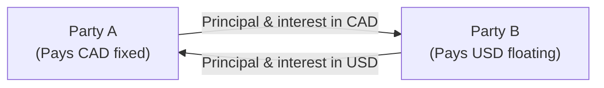

## 11.3 Pricing of Currency Swaps

Imagine you’re walking into a busy trading floor for the very first time. Maybe you hear one trader shout about USD/CAD forwards, someone else rummaging through OIS discount factors, and a colleague excitedly updating swap quotes on a screen. At first, it might seem like a chaotic orchestra—but every piece is crucial. That’s sort of how it feels when you jump into the details of pricing currency swaps: There are lots of moving parts, but ultimately, it’s all about comparing interest rates and exchange rates in an orderly way.

This section explores how market participants price currency swaps, walking through concepts of discounting, spot and forward exchange rates, floating rate projections, and everything else you need for accurately valuing these cross-currency agreements. We’ll also add some personal observations to keep things a bit more grounded—because, hey, explaining these concepts in purely theoretical terms can feel lifeless sometimes. As we go, we’ll tie in definitions of key terms and highlight relevant references from Canadian markets and around the globe.

### Overview of Currency Swaps

A currency swap typically involves two counterparties exchanging principal and interest payments in different currencies for a defined period. One side might pay a fixed rate in CAD, while receiving a floating rate in USD—plus a notional exchange of principal at the beginning and end of the swap. Or the arrangement might be vice versa. The goal behind these transactions usually relates to hedging currency exposures, locking in future cash flows, or sometimes speculating on interest rate differentials.

From a conceptual standpoint, you can think of a currency swap as a portfolio of bonds: for instance, a fixed-rate CAD liability swapped for a floating-rate USD asset, or perhaps a floating-rate CAD liability swapped for a fixed-rate USD asset. Pricing such swaps draws on the same building blocks as interest rate swaps—only here, you also have to factor in the foreign exchange (FX) component and separate discount rates for each currency.

### Zero Value at Inception

At inception, the fair value of a currency swap is usually zero. That means if you’re entering into this contract today, and there’s no initial premium, the present value (PV) of your expected future incoming cash flows equals the present value of your expected outgoing cash flows. This balancing act is very intentional. Dealers quote a “swap rate” to ensure that, based on current market information, neither party gains or loses money when they sign.

In practice, the notional amounts exchanged at the start and maturity of the swap are set according to the exchange rate (spot or near-term forward) and the net present value of each side’s interest payments. As soon as interest rates or currency exchange rates change over time, the value of each side’s position can wander away from zero. That’s how a mark-to-market (MTM) gain or loss emerges.

### Key Components: Interest Rate Differentials and Exchange Rates

Pricing currency swaps is usually an interplay of:

• The interest rate differential between the two currencies, which can be gleaned from yield curves.  
• The spot exchange rate and any forward FX rates for the relevant currency pairs.  
• The credit or liquidity spread (if any) required to compensate for counterparty risk or less liquid markets.  

You’ll typically see dealers referring to the relevant money market or bond market yields to set the fixed swap rate. For instance, if you’re dealing with a USD/CAD swap, the U.S. leg might be pegged to a USD interest rate (like a floating rate tied to SOFR), while the Canadian leg might be pegged to a CAD interest rate (like CORRA or a short-term T-bill yield, depending on the structure).

#### Influence of OIS Discounting

In modern markets, the discounting method has shifted heavily toward using OIS (Overnight Indexed Swap) rates in the relevant currency. In Canada, that’s typically the CORRA OIS curve, while in the U.S., it’s the SOFR OIS curve. By discounting each leg of the swap using near-risk-free rates in the appropriate currency, market participants aim to get a more accurate reflection of a theoretical “risk-free” environment. If you’d like to dive deeper into these rates, a great resource is the Bank of Canada’s benchmark rate data at  
[https://www.bankofcanada.ca/rates/](https://www.bankofcanada.ca/rates/).

### Discounted Cash Flow Approach

Let’s outline the discounted cash flow (DCF) approach often used when pricing a currency swap. Suppose Party A is set to receive a fixed rate in CAD and pay a floating rate in USD. The steps for each leg typically go like this:

• Identify the notional principal amounts in each currency.  
• Forecast the cash flows for each currency leg:
  - For the fixed leg: coupon payments at every payment date and the final notional exchange if it applies.  
  - For the floating leg: use forward rates to generate expected floating payments for each future reset period.  
• Convert all future cash flows into present values using the relevant discount factors for each currency. In Canada, that might be the CORRA OIS discount curve; in the U.S., the SOFR OIS.  
• Convert one currency’s present values into a common currency if you want the swap’s value from the perspective of a single currency. Often, folks measure everything in the “domestic currency” (say CAD).  
• The net present value is the difference between the sum of discounted incoming flows and the sum of discounted outgoing flows.

When the swap is set up, the fixed rate is chosen so that these net present values equal zero. If we want a small math representation:

Let’s define:

• \\( CF_{fixed}(t) \\): the fixed payment in CAD at time \\( t \\).  
• \\( CF_{floating}(t) \\): the floating payment in USD at time \\( t \\).  
• \\( D_{CAD}(t) \\): the discount factor for CAD at time \\( t \\).  
• \\( D_{USD}(t) \\): the discount factor for USD at time \\( t \\).  
• \\( X_t \\): the forward FX rate enabling you to convert USD into CAD at time \\( t \\).  

Then, conceptually, the present value of the CAD leg might be:


\text{PV}_{\text{CAD leg}} = \sum_{t=1}^{T} \Bigl(CF_{\text{fixed}}(t) \times D_{\text{CAD}}(t)\Bigr).


And, for the USD leg, if you wish to see its value in CAD terms, you’d do:


\text{PV}_{\text{USD leg in CAD}} = \sum_{t=1}^{T} \Bigl( CF_{\text{floating}}(t) \times X_t \times D_{\text{USD}}(t) \Bigr).


For the swap to have zero value at initiation, you want:


\text{PV}_{\text{CAD leg}} - \text{PV}_{\text{USD leg in CAD}} = 0.


In reality, you also have to factor in the initial principal exchanges, but conceptually it’s similar: discount each side’s principal exchange to the present and ensure they net out.

### Floating-Rate Leg Projections

One tricky part is estimating what the floating payments will look like in the future. Typically, we rely on forward rate curves like forward LIBOR, forward SOFR, forward CORRA, or forward EURIBOR, depending on the currencies in question. (Though keep in mind, LIBOR in USD is mostly phased out by 2025, replaced by SOFR. Similarly, in Canada we’re shifting from CDOR to CORRA.)

These forward curves come from market data sources such as Bloomberg Terminal or Refinitiv Eikon. Traders piece together quotes from short-term interest rate futures, interest rate swaps, deposit rates, and other instruments to generate a consistent yield or forward curve. Then, each floating coupon is forecast using these forward rates, on the assumption that future short rates will converge to the implied forward rates.

### Mark-to-Market Valuation Over Time

The moment the swap is in place, its value won’t likely remain at zero (unless interest rates and FX rates never change, which almost never happens). As interest rates and FX rates fluctuate, the present value of each leg changes, and so does the net mark-to-market. A quick personal aside: I remember early on in my career, we had a cross-currency swap that was pegged to CAD/JPY. I swear, we spent half our time re-checking the daily changes in the yen exchange rate. It was almost comedic how a tiny shift in one country’s interest rates suddenly caused big jumps in the swap’s daily P&L.

#### Posting Collateral

Because the value can swing up or down, counterparties often post collateral to limit credit exposure. Collateral is typically cash or high-grade securities that the out-of-the-money party (the one with a negative market value) posts to the in-the-money party. This practice helps mitigate the risk that one side might default when the swap is deeply positive for the other side. Under many International Swaps and Derivatives Association (ISDA) Master Agreements, there will be a “Credit Support Annex” (CSA) that spells out precisely how, when, and in what form collateral is exchanged.

### Swap Rates and Spread Quoting

Dealers often quote cross-currency swap rates in terms of the fixed rate on one leg and a spread on the floating rate of the other leg. For instance, you might hear something like: “USD/CAD cross-currency swap, paying fixed 3.00% on CAD side vs. receiving 3-month USD SOFR plus 25 basis points.” That “plus 25 bps” is a sort of liquidity or credit spread intended to reflect the market’s appetite for that currency pair, the creditworthiness of the counterparties, and overall supply and demand.

Sometimes the quoting might revolve around the foreign exchange forward points that represent the difference between the spot rate and the forward rate. If the local currency interest rate is higher than the foreign one, the forward points are typically negative or reflect a forward discount. Traders can glean whether the cross-currency swap is priced “in line” with interest rate parity by comparing the implied forward rate to the difference in each currency’s yield.

### Diagram: Basic Cash Flow Structure

Below is a simple Mermaid diagram showing the high-level flow of payments in a typical fixed-for-floating cross-currency swap. Let’s assume Party A pays fixed in CAD and receives floating in USD.

1. At inception, A and B might exchange notional amounts based on the current spot exchange rate.  
2. During the swap’s life, A pays B fixed CAD interest, while B pays A floating USD interest.  
3. At maturity, they typically re-exchange the notional amounts (some cross-currency swaps do a notional exchange only at maturity).

Of course, the exact structure can vary. Some currency swaps skip the initial notional exchange and only do a final exchange, or they might do none if the exposure is purely interest-based.

### Credit Risk and Regulatory Considerations

Whenever you have a cross-currency exchange, the credit risk can be more pronounced than it is in a single-currency interest rate swap, simply because the notionals often cross borders. That’s one reason regulators, including Canada’s “CIRO” (Canadian Investment Regulatory Organization), emphasize robust reporting, margin requirements, and central clearing (where feasible) for swaps.

Historically, IIROC and the MFDA existed separately, but as of January 1, 2023, these merged into CIRO. So, references to IIROC or MFDA are purely historical. The same is true for the investor protection fund CIPF, which merged with the MFDA IPC. To learn more about margin guidelines and clearing thresholds in Canada’s derivative markets, you can check out official CIRO resources at [https://www.ciro.ca](https://www.ciro.ca).

For globally active participants, cross-currency swaps might also be subject to the Dodd-Frank Act in the U.S. or EMIR rules in Europe, each of which can require trade reporting, clearing, and bilateral margin if no central clearing is in place.

### Practical Example: USD/CAD Swap

Let’s say you want to enter a 3-year currency swap. You’ll receive a fixed rate in CAD and pay a floating rate in USD. Let’s keep it simple:

• CAD notional: 10 million CAD.  
• USD notional: 7.5 million USD (implying a 1.3333 USD/CAD exchange rate at inception).  
• Fixed rate on the CAD side: 3.00% per annum, payable semiannually.  
• Floating rate on the USD side: SOFR + 20 bps, resetting quarterly.  
• Principal exchanged at inception and at maturity.  

Step-by-step:

1. Determine the forward curves for CAD and USD.  
2. Forecast your semiannual fixed CAD payments: 10,000,000 * 3.00% * (0.5-year fraction) = 150,000 CAD every six months.  
3. Forecast your quarterly USD floating payments using forward SOFR estimates plus 20 bps. For instance, if your first quarter’s projected SOFR is 3.10%, you’d have a payment of: 7,500,000 * (3.10% + 0.20%) * (0.25) = 7,500,000 * 3.30% * 0.25 = 6,187.50 USD for that quarter. (Of course, that’s an annualized rate multiplied by the fraction of the year, which is 0.25 for a quarter.)  
4. Discount each currency’s series of flows back to present value using the relevant discount factor derived from the OIS curve in each currency.  
5. Convert the USD leg’s discounted cash flows into CAD using the forward exchange rates consistent with the interest rate differentials (or discount them in USD and then convert using the forward or spot rate as appropriate for final valuation).  
6. If everything is fair, the net present value (NPV) should be zero at inception. But changes in realized floating rates, the underlying exchange rate, or benchmark yields over time will create a positive or negative NPV for the swap.

### Data Sources and Modeling Tools

Several specialized tools and data providers can help you get a handle on real-time or historical pricing elements:

- Bloomberg Terminal (SWPM function) for swap pricing.  
- Refinitiv Eikon for yield curves, forward points, volatility surfaces.  
- ICE Data Services for interest rate swap and FX forward data.  
- Open-source libraries like PyQuant or R’s “quantmod” for building custom swap valuation models.

In professional settings, it’s common to combine these data feeds with proprietary analytics. But if you’re a student or you’re just trying to replicate a simplified swap model, you might use publicly available yield curve data from central banks or other open data repositories.

### Ongoing Monitoring and Adjustments

Even after a currency swap is priced and executed, participants don’t just forget about it. They’ll:

• Update the valuation daily (or more frequently) based on new market data.  
• Post or receive collateral if credit support annexes require it.  
• Potentially unwind the swap early if market conditions or hedging needs change.  
• Track the P&L impacts for accounting and regulatory reporting purposes.

Given that currency swaps can be large and long-lived, institutions want robust systems in place to ensure that the sums are correct, potential margin calls are anticipated, and any changes in underlying benchmarks (like the shift from LIBOR to SOFR or from CDOR to CORRA) don’t cause unexpected hiccups.

### Best Practices and Pitfalls

• Best Practice: Always treat each currency leg with its own appropriate discount curve. Using the “wrong” discount curve can create inaccurate valuations.  
• Pitfall: Neglecting to check the credit or liquidity spreads can lead to mispricing. The raw interest rate from a government bond or deposit might not reflect the actual swap rate environment.  
• Best Practice: Keep an eye on upcoming economic data or central bank announcements that might drastically change interest rate expectations or exchange rates.  
• Pitfall: Improper or inconsistent forward rate generation. If your forward curve is off, your floating leg cash flows—and the overall swap price—might be very misleading.

### Conclusion

When you dive into pricing currency swaps, you’re quickly enveloped by topics like interest rate theory, FX parity, discounting frameworks, credit considerations, and a fair bit of market-savviness. In the simplest sense, it’s all about leveling the playing field so that the present value of what you’ll pay roughly matches the present value of what you’ll receive—until the market inevitably shifts. That might sound a little nerve-racking, but it’s also what makes it interesting. The next time you see an exotic cross-currency trade, take a moment to reflect on the interest rate differentials and forward currency rates that keep the entire arrangement afloat.

If you’d like to explore more, here are some resources:

• [Bank of Canada – Rates](https://www.bankofcanada.ca/rates/)  
• [CIRO Homepage](https://www.ciro.ca) – for understanding modern Canadian regulatory requirements  
• [Bloomberg Terminal](https://www.bloomberg.com/professional/) or [Refinitiv Eikon](https://www.refinitiv.com/) – for real-time data on yield curves, FX forward points, and more  
• Open-source quant libraries: [PyQuant GitHub community](https://github.com/search?q=pyquant) or the R “quantmod” package for building and backtesting your own pricing models  

Practice often, experiment in sandbox environments, and keep an eye on real swaps in the market. The best way to truly grasp the mechanics is by seeing them in action—no matter how daunting that first look at a busy trading floor might seem.

---

## Sample Exam Questions: Pricing of Currency Swaps



### Which of the following best describes why a currency swap typically has zero value at the start?

- [x] The present value of expected inflows equals the present value of expected outflows.
- [ ] The notional amounts in both currencies have to be equal.
- [ ] One party pays a credit premium at the outset.
- [ ] All currency swaps must post collateral cash at inception.

> **Explanation:** At inception, dealers set the swap terms so that the PV of incoming and outgoing cash flows nets to zero, ensuring neither side gains nor loses value initially.

### When discounting CAD-denominated cash flows in a currency swap, which reference rate is most commonly used under current market conventions in Canada?

- [ ] CDOR
- [x] CORRA OIS
- [ ] LIBOR
- [ ] EURIBOR

> **Explanation:** Short-term swaps in Canada often use CORRA OIS for discounting, reflecting near-risk-free rates.

### In a fixed-for-floating USD/CAD currency swap, a fixed rate is set on the CAD leg. Which of the following mainly determines that fixed CAD swap rate?

- [ ] Historical average of the CAD prime rate
- [ ] Arbitrary negotiations with no market references
- [x] CAD yield curves (including OIS) plus any relevant credit spreads
- [ ] Government of Canada bond yields with no adjustments

> **Explanation:** The CAD fixed swap rate is determined by market-based yield curves, plus or minus any credit or liquidity spread that applies to the counterparties.

### What happens to the mark-to-market (MTM) value of a currency swap if the domestic currency suddenly appreciates versus the foreign currency?

- [ ] It remains zero.
- [ ] The fixed leg always gains in value.
- [x] The value of future foreign currency inflows might decrease when converted to domestic currency.
- [ ] The floating rate leg is not affected by exchange rate changes.

> **Explanation:** When the domestic currency strengthens, any foreign currency payments are worth fewer domestic units, affecting the swap’s MTM value.

### Which data sources are often used to project the floating leg of a currency swap?

- [ ] Purely historical averages of deposit rates
- [ ] Government bond yield data only
- [x] Forward rate curves derived from interest rate futures, swaps, and deposit rates
- [ ] Credit rating agency reports

> **Explanation:** The floating leg is based on forward estimates, usually compiled from futures and swap market quotes for the relevant benchmark (e.g., SOFR, CORRA).

### When do counterparties typically post collateral for a currency swap?

- [ ] Only if the swap fails to trade on an exchange
- [x] When the mark-to-market of a party’s position moves significantly out of the money
- [ ] Once a year on a fixed schedule
- [ ] Collateral is not used in currency swaps

> **Explanation:** Under many ISDA Master Agreements, counterparties post collateral if their position has negative market value beyond a threshold set in the Credit Support Annex.

### Which statement is correct regarding the discounting approach in modern currency swap markets?

- [ ] Only LIBOR-based discounting is allowed
- [ ] OIS discounting is used for floating-leg calculations, but fixed legs use prime rates
- [x] Each currency’s leg is discounted using its own OIS curve or near-risk-free reference rate
- [ ] Discounting is no longer required in a zero-cost swap

> **Explanation:** In practice, each leg is discounted using the respective OIS curve (e.g., SOFR for USD, CORRA for CAD) to capture near-risk-free valuations.

### If an institution wants to hedge its existing USD liability using a CAD/USD currency swap where it pays USD and receives CAD, what is the primary benefit?

- [ ] The institution avoids all credit risk.
- [ ] It captures exchange gains if USD appreciates.
- [ ] It leverages negative interest rates in Europe.
- [x] It can lock in or manage currency exposure, turning its USD liability into an effectively CAD-based one.

> **Explanation:** By paying USD and receiving CAD, the institution is effectively offsetting risk related to its USD liabilities.

### What role does the foreign exchange (FX) forward rate play in pricing a currency swap?

- [ ] It is irrelevant to currency swaps.
- [x] It helps determine the conversion of future foreign currency cash flows to a domestic currency value.
- [ ] It sets a fixed foreign currency dividend yield.
- [ ] It eliminates the need to consider credit risk.

> **Explanation:** The FX forward rate is used to translate future foreign currency flows into domestic currency terms or vice versa, a crucial step in calculating PV and fair value.

### A currency swap’s value can become positive or negative to one party over time primarily due to which factor?

- [x] Changes in interest rates and exchange rates
- [ ] Dealer margin fees
- [ ] Offsetting custody charges
- [ ] Changes in credit rating agency policies only

> **Explanation:** As interest and FX rates fluctuate, the discounted value of future cash flows changes, causing the swap’s market value to shift from its initial zero level.


