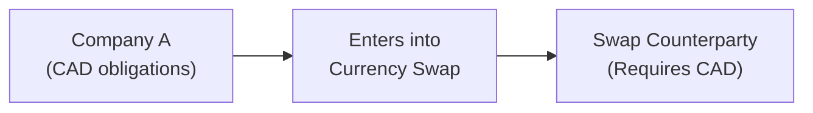

## 11.4 Reasons for Currency Swaps

Sometimes, when people first hear about currency swaps, they imagine a dense forest of financial jargon and tricky exchange rates—and to be honest, they’re not entirely wrong. But once you start exploring the reasons why large corporations, banks, and even government entities dive into these swaps, it can get surprisingly fascinating. I remember when my company tried to expand to the United States, our CFO grew more anxious over currency risk than the operational details of launching a new product. That’s how pivotal currency swaps can be!

Below, we’ll walk through some of the key reasons for entering into currency swaps, keeping both a practical and slightly informal lens. We’ll explore why global market participants use these instruments, identify how they can reduce costs or stabilize cash flows, and see their common (and sometimes colorful) role in the world of finance. Let’s dive right in.

-------------------------------------

### Interest Rate Arbitrage

One major reason organizations enter currency swaps is to capitalize on differences in interest rates across different markets—something fancy folks call “interest rate arbitrage.” The idea is straightforward: suppose Company X in Canada can borrow Canadian dollars (CAD) at a favorable rate, while simultaneously, there is a need for U.S. dollars (USD) to finance an expansion south of the border. If Company X just goes to a U.S. bank for a USD loan, they might face higher interest rates or less attractive terms. However, by using a currency swap, they can tap into Canada’s cheaper CAD rates and then swap those CAD proceeds into USD, effectively lowering their overall financing costs.

A typical arrangement might look like this:

• Company X borrows CAD at an interest rate of, say, 5%.  
• It simultaneously enters a currency swap to exchange CAD for USD, receiving an agreed-upon USD amount at a (locked-in) spot or forward exchange rate.  
• Over the term of the swap, Company X pays a USD-based rate (possibly floating, possibly fixed, depending on the swap terms) to the swap counterparty, and the swap counterparty pays the 5% CAD interest back to Company X.  

If all goes according to plan, Company X ends up paying the equivalent of, for example, 4% in USD terms instead of 6% if they had borrowed USD in the first place. That discrepancy—where you exploit the difference in borrowing costs across currencies—is precisely the “arbitrage” portion.

But be cautious: in real life, these deals must be carefully structured to account for prevailing foreign exchange (FX) rates, possible future changes in exchange rates, and each party’s credit risk. Let’s visualize an ultra-simplified currency swap flow between a Canadian company and a U.S. institution:

In reality, you’ll see more complex shapes, including references to floating LIBOR or CORRA rates (in Canada) and day count conventions. But this diagram is enough to give you a sense of how funds and obligations move back and forth.

-------------------------------------

### Hedging Foreign Currency Obligations

Now, let’s say you’re a Canadian corporation, and you’ve got significant costs tied to USD. Maybe you import your raw materials from the U.S., so each month you have to pay for shipments in USD. If the CAD weakens suddenly, your costs shoot up, blowing through your budget. That’s not fun.

To mitigate that exchange rate risk, you could use a currency swap to lock in a future exchange rate. This effectively stabilizes your cash flows and keeps your CFO from pacing the room every time the loonie dips. By bringing a currency swap into the mix, your net obligations become more predictable. Instead of sweating about the daily CAD/USD fluctuations, you decide on a set exchange mechanism through the swap, thereby converting that variable expense into something far more manageable.

Example: A Canadian electronics manufacturer expects to owe USD 10 million next year for critical components. One approach is to wait and hope the CAD remains strong. Another safer approach is to execute a currency swap that ensures, for instance, an effective exchange rate of 1 CAD = 0.75 USD (if that’s the going rate or close to it). The Canadian company would commit to paying a certain periodic CAD amount in exchange for receiving USD for the supplier payments. If the actual CAD/USD rate moves, the company is protected because their swap fixes or stabilizes that exposure.

-------------------------------------

### Diversifying Currency Exposure

Global corporations often like to keep a basket of currencies on their books, akin to diversifying stock investments. Too many eggs in one basket can create risk that a single currency meltdown (or meltdown-lite) could hamper the entire business. Multinational organizations, therefore, use currency swaps to maintain balanced exposure among multiple currencies. For instance, if you’re a Canadian multinational with heavy ties in Europe, you might have lots of EUR (Euros) from your sales. Meanwhile, your biggest raw materials supplier could be in Japan (where your expenses would be in JPY). By strategically using currency swaps, you can smooth out the lumps and bumps of holding, say, 90% of your revenue in one currency.

In other words, currency swaps allow you to:

• Convert an unwanted concentration of currency into another currency.  
• Avoid the cost of physically converting huge lumps of currency at unhelpful times.  
• Pave the way for better cash flow matching across different business units.  

From personal experience, I worked with a friend’s startup that expanded into Asia. They soon realized they had more USD receipts from North America and less local currency to pay their local staff. So they used a series of small currency swaps to ensure adequate local currency each quarter. That way, they didn’t have weird shortfalls or giant lumps of leftover foreign currency.

-------------------------------------

### Asset-Liability Management (ALM)

Banks, insurance companies, and other financial institutions often talk about Asset-Liability Management (ALM). If that phrase makes your eyes glaze over, think of it this way: you want your assets (like loans, mortgages, or bonds) to match your liabilities (like deposits or insurance claims) in currency, duration, and interest rate characteristics. Imagine a bank with predominantly CAD deposits but an investment portfolio that’s partially denominated in USD. If the CAD devalues or the USD portfolio changes in value, the bank might struggle to meet obligations to depositors (in CAD) unless it’s carefully hedged.

A currency swap can bridge that mismatch. By using a currency swap, the bank can convert its USD investment proceeds into CAD or vice versa, matching the liability side more neatly. This can smooth out net interest margins and reduce the volatility in earnings. Insurers do something similar: if they expect to pay out claims in multiple currencies (especially in cross-border insurance), they want to ensure their reserves are stacked accordingly. A well-structured network of currency swaps can keep an insurer’s currency exposures aligned with the currencies in which claims will be paid out.

-------------------------------------

### Converting Cash Flows

Another reason for currency swaps is to convert the currency denomination of a set of existing or upcoming cash flows. Let’s say a Canadian retailer decides to issue a bond in CAD. But, they ultimately need USD to finance new store expansions in the U.S. They can draw on the CAD bond proceeds and use a currency swap to receive USD in return, promising to pay a floating (or fixed) rate in CAD while receiving a USD-based rate from the swap’s counterparty.

You might find in real-world examples that companies already have a bundle of existing CAD-denominated debt but realize, “Wait, we have USD-based revenue streams from our e-commerce platform—maybe we should pay our obligations in USD.” A currency swap can effectively convert those CAD payments you owe bondholders into USD payments that better match your incoming cash flows. This significantly reduces foreign exchange risk and generally makes planning a whole lot easier.

-------------------------------------

### Refinancing Existing Debt

Currency swaps also come in handy if you want to “refinance” your debt under more favorable market conditions. You can’t always just walk in and tear up your existing loan or refund your outstanding bond, especially if it’s not cost-effective to do so or if it triggers early redemption penalties. Sometimes, it’s just easier to keep the same underlying debt but overlay a new currency swap on top.

Say your firm has a 10-year bond in CAD paying a fixed 5% coupon. Market transformations now suggest that paying in USD at 4% based on some floating arrangement is cheaper. Instead of going through the hassle of retiring the old bond and issuing a new one in USD, you might enter a currency swap where you agree to pay a floating USD interest rate, and the swap counterparty pays your 5% CAD rate to service the bond. The net effect? You have effectively refinanced the cost structure without messing up your original debt contract.

This approach became particularly popular during certain periods of interest rate volatility, where the foreign currency environment offered significant cost advantages. But, as always, watch out for credit risk. If the swap counterparty defaults, guess who’s stuck with the original higher rate? You are.

-------------------------------------

### Speculative Gains

So far, we’ve looked at corporate end-users. But in the wild, currency swaps aren’t always about “serious-sounding” commercial objectives. Hedge funds, proprietary trading desks, or even high-net-worth individuals can and do use currency swaps to take positions on interest rate differentials and exchange rate movements in search of profit. It’s a bit like betting on how the future cost of borrowing or future exchange rates will shift. They might enter a swap to pay a certain currency’s fixed rate if they think that rate will drop in the future, or if they speculate that the relative exchange rate movements will net them a profit.

Speculative use, though, is definitely more advanced, carries higher risk, and generally requires sophisticated risk management procedures. If used unwisely, currency swaps can become a leveraged way to lose money quickly, especially in volatile FX environments.

-------------------------------------

### Strategic Partnerships

Once in a while, you’ll come across a cross-border joint venture or strategic alliance where two parties exchange not only knowledge or distribution channels but also engage in currency swaps to optimize financing synergy. For example, a Japanese firm entering a strategic partnership with a Canadian entity might have cheaper sources of JPY financing, while the Canadian partner can easily borrow in CAD. If they’re co-investing in a project that requires both currencies, they can swap with each other. It’s like each partner saying, “I got you covered in my home market,” while the other partner reciprocates, thereby reducing the combined costs for both sides.

It can also function as a signal of trust and deeper cooperation since both sides rely on each other’s creditworthiness. These strategic currency swaps sometimes appear in large multinational deals, where cultural synergy meets financial synergy—making for a more integrated alliance.

-------------------------------------

### Common Glossary Terms

Below are a few brief definitions—some you’ve seen used in context already:

- **Arbitrage:** Profit from price differences in different markets. In the context of swaps, it often involves leveraging differences in borrowing costs or exchange rates.  
- **Asset-Liability Management (ALM):** Techniques to match a firm’s (or financial institution’s) assets and liabilities in timing and currency composition to mitigate risk and optimize returns.  
- **Refinancing:** Restructuring or replacing an existing debt with new terms, potentially via a swap instead of physically replacing the entire debt.  
- **Exchange Rate Risk (FX Risk):** Potential losses or gains due to fluctuations in currency exchange rates.  
- **Cross-Currency Basis Swap:** A specialized swap involving the exchange of floating interest rates in two different currencies.  
- **Currency Exposure:** The degree to which changes in exchange rates impact a company’s financial statements or cash flows.  
- **Counterparty Credit Risk:** The risk of the other party in a swap defaulting on its payment obligations.  
- **Hedge Fund:** An investment fund employing various (often complex) strategies, including derivatives, to achieve returns for investors.

-------------------------------------

### Regulatory Considerations in Canada

If you’re operating in Canada, it’s important to remember that currency swaps—like many derivative instruments—fall under the oversight of CIRO (Canadian Investment Regulatory Organization) for dealer and market integrity matters. Although IIROC and the MFDA are defunct legacy organizations, their roles have now been consolidated into CIRO. Meanwhile, the Canadian Securities Administrators (CSA) also have guidelines specifically addressing currency derivatives transactions. Ensuring compliance with these guidelines is crucial, especially around documentation, reporting, and transparency. If you want to nerd out and read more official info, feel free to check the CSA website, as well as CIRO’s resources at:

• https://www.ciro.ca  
• https://www.securities-administrators.ca/  

Additionally, the Bank for International Settlements (BIS) publishes regular reviews and data on foreign exchange (FX) swap markets globally, providing stats on daily volumes, open interest, or trends in cross-currency trades. The BIS website at https://www.bis.org/ offers a wealth of research materials if you want to take a deeper dive.

-------------------------------------

### Practical Example

Imagine a mid-sized Canadian mining company that has significant U.S. dollar costs for importing specialized equipment. They wish to diversify their currency risk and reduce the total interest expense on a new USD loan. After exploring direct borrowing in U.S. markets, they find that domestic CAD borrowing at, say, 5.0% is more affordable. By entering into a CAD-to-USD currency swap with a large bank, they effectively pay the bank a USD LIBOR-based rate (or USD Secured Overnight Financing Rate, depending on the contract) while receiving the 5.0% CAD rate from the bank. The result? They’ve locked in a rate that’s slightly cheaper than the direct USD borrowing alternative. They’ve also stabilized their cash flows by ensuring the right currency is available for paying their equipment invoices, all while mitigating the ongoing fluctuations between CAD and USD.  

-------------------------------------

### Best Practices and Pitfalls

• **Credit Risk Management:** Always assess your swap counterparty’s creditworthiness. Even large banks can run into difficulties.  
• **Documentation:** Swap agreements can be complex. Clear contractual language, especially regarding termination events and collateral, is paramount.  
• **Valuation and Market Risk:** Currency swaps aren’t one-and-done. You need to track market values and potential exposures throughout the life of the swap.  
• **Hedging vs. Speculation:** Always clarify your objective. If it’s hedging, define the risk you’re hedging, measure it, and choose the instrument accordingly. If you’re speculating, do so with your eyes wide open about potential losses.  
• **Regulatory Compliance:** Each jurisdiction has its own rules about disclosure, margin, or clearing. Canadian participants must adhere to CIRO and CSA guidelines.  

-------------------------------------

### Additional Resources

• CIRO (Canadian Investment Regulatory Organization): https://www.ciro.ca  
• Canadian Securities Administrators (CSA): https://www.securities-administrators.ca/  
• Bank for International Settlements (BIS): https://www.bis.org/  
• ISO 4217 Currency Codes: https://www.currency-iso.org/  
• Various open-source finance libraries (e.g., QuantLib, JQuantLib) provide modules to model swaps.  

If you’re a curious soul, or if you’re prepping for licensing exams, diving into these resources can help you develop a thorough understanding of both theoretical frameworks and the nitty-gritty of real-world swap transactions.

-------------------------------------

## Sample Exam Questions: Currency Swaps Fundamentals



### Which of the following best describes the primary reason a company might enter into a currency swap for interest rate arbitrage?

- [x] To obtain cheaper financing by exploiting differences in borrowing costs across currencies.
- [ ] To benefit from fluctuations in equity markets.
- [ ] To eliminate all forms of credit risk.
- [ ] To convert debt into equity.

> **Explanation:** Companies often use currency swaps to take advantage of interest rate disparities between different currencies. By borrowing in a cheaper market and then swapping that currency for one in which financing costs are typically more expensive, they can reduce their overall borrowing cost.

### How can currency swaps help a company with foreign currency obligations?

- [ ] They allow a company to avoid issuing any foreign currency debt.
- [ ] They increase exposure to foreign exchange risk to maximize potential profit.
- [x] They can lock in exchange rates for future obligations, stabilizing cash flows.
- [ ] They permanently eliminate credit risk for both parties.

> **Explanation:** When a Canadian firm faces recurring USD obligations, using a currency swap can lock in the effective exchange rate, protecting against adverse movements and providing predictable payment amounts.

### Why might a financial institution use currency swaps for Asset-Liability Management (ALM)?

- [ ] To replace equity with short-term debt.
- [x] To ensure that the currency composition of their assets matches the currency composition of their liabilities.
- [ ] To speculate on precious metals prices.
- [ ] To reduce the effective interest rate on government bonds.

> **Explanation:** Financial institutions often rely on currency swaps to align the currency of their assets (loans, investments) with the currency of their liabilities (deposits, insurance payables). This reduces mismatch risk and stabilizes earnings.

### When converting cash flows using currency swaps, what is a primary risk factor?

- [ ] Enhanced returns due to increased investment in domestic projects.
- [x] Counterparty credit risk if the swap provider cannot meet obligations.
- [ ] Guaranteed short-term profits regardless of market conditions.
- [ ] Automatic compliance with all regulatory requirements.

> **Explanation:** A key risk in swaps is that the counterparty may default, leaving a company unable to convert or hedge its payments effectively. Monitoring credit quality and requiring collateral can help mitigate this.

### Which of the following scenarios best illustrates refinancing existing debt via a currency swap?

- [ ] Issuing an entirely new bond in another currency and retiring the old bond.
- [ ] Entering a forward contract to buy domestic currency.
- [x] Maintaining an existing bond but swapping its interest obligations into another currency at more favorable rates.
- [ ] Using futures contracts to lock in commodity prices.

> **Explanation:** Refinancing debt through a swap means you keep the original bond outstanding (thus, you still pay principal and interest there) but overlay it with a currency swap that effectively changes the cost structure to a different currency or interest rate type.

### What is one major draw for hedge funds using currency swaps?

- [ ] Eliminating all possibility of market volatility.
- [x] Speculating on interest rate differentials and exchange rate fluctuations to earn profits.
- [ ] Avoiding all regulatory disclosures.
- [ ] Accessing special government-backed swap facilities.

> **Explanation:** Hedge funds often use swaps to take leveraged positions on interest rate markets or currencies. This speculation can yield profitable trades if done correctly, although it carries considerable risk.

### How can a currency swap strengthen a strategic partnership between two cross-border companies?

- [x] By allowing each partner to borrow in its home market and then swap to meet the joint venture’s currency needs.
- [ ] By eliminating the need for each partner to obtain separate legal counsel.
- [ ] By granting each partner free access to the other’s distribution facilities.
- [ ] By universally lowering all global interest rates.

> **Explanation:** A currency swap can let each partner leverage its home-market borrowing advantage and collaborate for more favorable financing, thereby deepening financial ties.

### Which best describes the regulatory landscape for currency swaps in Canada post-2023?

- [ ] MFDA remains the sole authority on currency swaps.
- [ ] IIROC enforces margin especially for currency futures only.
- [ ] There is no regulation on OTC derivatives in Canada.
- [x] CIRO oversees investment dealer activity, while CSA provides guidance on derivatives regulation.

> **Explanation:** After the amalgamation of the MFDA and IIROC, CIRO became the national self-regulatory organization in Canada. The CSA also issues regulatory guidance for derivatives, including currency swaps.

### What is a potential pitfall of relying solely on currency swaps for risk management?

- [ ] All counterparties are guaranteed by central banks.
- [x] They can introduce or amplify counterparty and liquidity risks if not properly managed.
- [ ] They permanently prevent any interest rate hedging.
- [ ] They must be used exclusively with commodity-based currencies.

> **Explanation:** While currency swaps can be powerful hedging tools, they also introduce credit risk (default by the counterparty) and liquidity risk (the possibility of not being able to close or transition the swap easily). Hence, they must be monitored carefully.

### True or False: A currency swap can help a Canadian company stabilize USD payments for raw materials, even if the underlying spot USD/CAD exchange rate continues to fluctuate daily.

- [x] True
- [ ] False

> **Explanation:** Yes, the company can lock in an agreed-upon exchange rate for meeting its USD obligations by using a currency swap. The daily fluctuations in the spot USD/CAD rate become largely irrelevant to the hedged payments.


