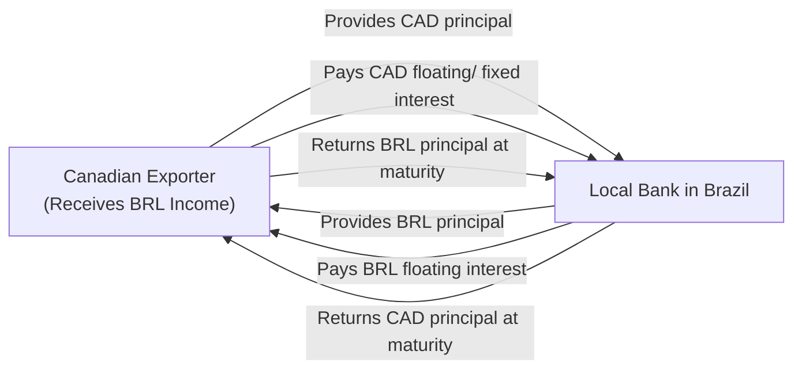

## 11.6 Emerging Markets Currencies (Liquidity, Volatility)

Sometimes, when I think about emerging markets (EM) currencies, I recall a conversation I had with a friend who ran a small import-export business in South East Asia. She told me how one sudden political announcement shifted her local currency’s exchange rate against the U.S. dollar by nearly 5% overnight—and basically changed her monthly profit margin in a flash. Anyway, those moments remind me just how critical it is to understand the quirks of EM currencies, especially when it comes to swaps and hedging. 

The global derivatives market is vast, yet emerging markets stand out as having unique challenges and opportunities. EM currencies can be dynamic, offering growth potential and diversification for international portfolios. But if you’re not careful, you could get blindsided by sudden moves in liquidity, capital controls, or even political developments that make the currency in question far more volatile than you might see in, say, EUR/USD or USD/JPY. Below, we’ll walk through some of the main points to keep in mind regarding EM currencies: liquidity constraints, regulations and capital controls, volatility drivers, credit and political risk, local interbank market dynamics, tax and repatriation issues, collateral constraints, and risk management strategies.

Before we jump into each of these, let’s begin with a quick refresher on EM currency swaps. A traditional currency swap involves exchanging principal and interest payments in one currency for principal and interest payments in another currency—like a contract between you and a counterparty to swap your Brazilian Real (BRL) interest payments for the other’s U.S. dollar (USD) interest payments. These swaps are extremely useful for companies that want to hedge currency risk, or for investors interested in cross-currency arbitrage. However, if that currency is from an emerging market, you’ll likely face a host of additional complexities.

Remember that in Canada, the Canadian Investment Regulatory Organization (CIRO) provides oversight for derivatives transactions to ensure fair and transparent markets. For cross-border currency swaps, various regulatory bodies also come into play, including global standard-setters like the International Organization of Securities Commissions (IOSCO) and local regulations in each emerging market. Because MFDA and IIROC are now part of history, replaced by CIRO, always confirm that you’re checking the most up-to-date guidance from [https://www.ciro.ca](https://www.ciro.ca) when dealing with derivatives in Canada.  

---

### Understanding Emerging Markets and Their Currencies

Emerging markets (EMs) are countries whose economies are in the process of rapid growth and industrialization. Examples include Brazil, Russia, India, China, South Africa, and many others across Latin America, Eastern Europe, Asia, and Africa. These nations often have developing financial markets, which can be less liquid and more volatile than those of advanced economies. The currencies of EM countries typically experience wider price swings, reflecting changing investor sentiments, political uncertainties, trade balances, and local monetary policies.

Because of these factors, currency swaps involving EM currencies require extra caution, especially if you plan to hedge or invest across borders. On top of the usual considerations—like interest rate differentials, notional amounts, and maturity—participants must consider constraints around liquidity, volatility, and government regulations that may abruptly alter how easy (or expensive) it is to transact in a particular currency.

---

### Liquidity in Emerging Market Currency Swaps

One of the biggest roadblocks I came across in EM currency hedging was the wide bid-ask spreads on local swaps. You might see what looks like a beautiful arbitrage opportunity—until you factor in a bid-ask spread that’s three or four times bigger than what you’d see in a major currency pair. That large spread quickly erodes profit margins on any potential deal, and it also raises the cost of hedging. Why?

• Limited Market Participants: Fewer dealers may offer swap contracts on a specific EM currency, limiting price competition.  
• Restricted Access: Some countries require foreign participants to set up local entities to trade derivatives, which not all firms are willing or able to do.  
• Lower Trading Volumes: With less trading activity, it can be tricky to find good quotes or to unwind positions without significant slippage.  

Because a narrower range of dealers competes for your business, the quotes you receive might be less favorable than if you were swapping, say, EUR and USD. Liquidity can also evaporate quickly during times of market stress. In a moment of crisis—perhaps a government announcement of new capital controls or election-related uncertainty—bid-ask spreads can balloon further.

---

### Regulatory and Capital Controls

In Canada, we can typically freely convert CAD to a variety of currencies, but that’s not guaranteed in many emerging markets. Some governments impose capital controls that limit how much currency can be bought or sold at any given time, or they restrict cross-border fund flows to stabilize their exchange rates.

• **Examples of Controls:** A government might require a special license to convert more than USD 1 million in local currency, or limit the repatriation of profits to a certain proportion each year.  
• **Impact on Swaps:** Even if you see an attractive swap rate, you might not be able to fully execute or settle your transaction if the regulator prevents you from exchanging large amounts of local currency.  

In practice, these controls may mean fewer dealers are able to provide robust swap quotes or that you need onshore legal structures to comply with local regulations. It’s always a good idea to consult official resources like Export Development Canada ([https://www.edc.ca](https://www.edc.ca)) or the World Bank to get updated profiles of each country’s restrictions.

---

### Volatility in EM Currencies

Probably the single biggest complaint you’ll hear from folks who trade EM currencies: you can get whipsawed pretty hard. An announcement from the central bank about interest rate adjustments, or unexpected violence in the region, or even something as routine as a change in commodity prices can lead to intraday swings of several percentage points in value.

This is both an opportunity and a risk:

• **High Returns:** You might see potentially profitable trades if you can accurately predict currency movements or if you time your hedge well.  
• **High Risk:** Market swings can amplify hedging costs if your swap’s mark-to-market moves sharply against you—possibly leading to frequent margin calls.  

When deciding on how to hedge your EM exposure, ensure you build in a buffer for that volatility. Using layered hedges (e.g., partial forward contracts plus a local currency interest rate swap) can help spread the risk while letting you adjust your position as market conditions shift.

---

### Credit and Political Risk

It’s one thing to worry about your counterparty’s creditworthiness in a well-established market. But if you’re dealing with a smaller or less transparent financial institution in an emerging market, you might be facing greater counterparty credit risk. Sometimes local banks may not have robust capital buffers, or entire regions might get hammered by capital flight if investors lose confidence. Plus, there’s always the possibility of political events or civil unrest leading to policy changes that impact your swap obligations.

• **Counterparty Due Diligence:** It’s crucial to examine the financial health of potential counterparties, including their capital adequacy.  
• **Political Risk:** Keep abreast of local headlines and policy signals (e.g., potential nationalization of key industries, changes to foreign ownership laws).  

In some jurisdictions, obtaining credit insurance or using a global bank as an intermediary can help manage these risks. Make sure to assess the cost-benefit trade-off because the added layer of security will come at a premium.

---

### Local Interbank Markets and Reference Rates

Emerging markets often rely on local interbank rates such as Brazil’s DI rate or China’s SHIBOR as the floating benchmark in currency swaps. These rates can be subject to:

• **Monetary Policy Shifts:** When a central bank raises or lowers interest rates to control inflation, it can directly impact the reference rates used in swaps.  
• **Seasonal or Idiosyncratic Factors:** Some cultures have seasonal demand for currency (e.g., around national holidays), which can tighten or loosen liquidity in the interbank market.  
• **Sovereign Influence:** Government or central bank directives about liquidity in local markets can move the reference rate significantly in a short time.  

Because these rates might be less globally standardized or recognized compared to LIBOR or CORRA, they can be more volatile. And if they deviate from market expectations, you might see sudden changes in the valuation of your swap.

---

### Tax and Repatriation Issues

Here’s something that I personally found a bit painful with a client who was doing business in Latin America: after carefully crafting a cross-currency swap, the local authorities imposed a withholding tax on cross-border interest payments, effectively raising the cost of the transaction. We found ourselves reworking the entire structure to account for the new tax reality.

• **Withholding Taxes:** Many emerging markets require taxes to be withheld at the source when interest or principal is paid to a non-resident. This changes the net cash flow of swap payments.  
• **Repatriation Restrictions:** Governments might limit foreign investors from sending funds out of the country, or they might impose taxes or restrictions on how money is remitted.  

When designing your currency swap, factor in all local tax implications. If necessary, consult with local legal counsel and check guidelines from organizations like the IMF or the World Bank for up-to-date commentary on these rules.

---

### Collateral and Margin Requirements

In an ideal environment, you’ll pledge cash or high-quality government bonds to your counterparty as collateral—if you’re using an over-the-counter (OTC) swap that isn’t cleared through a central clearinghouse. However, in some emerging markets:

• **Limited Access to Top-Quality Collateral:** Local sovereign debt might not be as liquid or as highly rated as G7 government bonds, leading to higher haircuts.  
• **Currency Mismatch in Collateral**: You might post collateral in a different currency than your swap’s denominating currency, raising mismatch risks.  
• **Local Acceptance Rules:** Foreign institutions might be reluctant to accept local currency-denominated securities as collateral.  

These challenges can drive up cost or complexity in structuring an EM currency swap. If the local central bank doesn’t accept certain assets as collateral, or if the haircuts are significant, you may find your required margin goes well above what you expect in developed markets.

---

### Risk Management Strategies

Hedging EM currency exposure requires a multi-layered approach. Why? Because the risk factors aren’t just the standard shifts in exchange rates; you also have to consider regulatory changes, local reference rate volatility, creditworthiness of local counterparties, and more. Strategies often include:

• **Layered Hedges:** Use a combination of currency forwards, currency swaps, local interest rate swaps, or options so you can gradually roll over or adjust positions as the market evolves.  
• **Diversification of Counterparties:** Rather than relying on a single local bank, traders may spread transactions across multiple counterparties to reduce concentration risk.  
• **Collecting Real-Time Data:** Emerging markets can change quickly; real-time data from local news outlets, mobile banking apps, and social media can give you insights into developing political or economic events.  
• **Staggered Tenors:** Instead of locking into a single large notional swap with a single maturity date, some institutions stagger maturities over different periods to reduce the potential “cliff effect” where everything comes due at once.  

Beyond these strategies, the role of robust internal risk management controls cannot be overstated. This includes scenario testing for currency stress events, ensuring your treasury department or investment committee regularly reviews positions, and maintaining open lines of communication with your local or global banks for updated market intelligence.

---

### Example: Brazilian Real (BRL) Currency Swaps

Imagine a Canadian exporter planning to sell goods in Brazil. They anticipate receiving BRL over the next 12 months and want to swap those inflows into CAD. They enter a BRL-CAD swap with a local Brazilian bank. The swap involves paying a floating rate based on Brazil’s DI (interbank deposit) rate, while receiving a fixed or floating rate in CAD. Because of Brazil’s relatively robust but sometimes volatile market, the bank quotes a wide bid-ask spread on the swap. 

During the trade, if the Brazilian central bank unexpectedly hikes rates to combat rising inflation, DI rates jump. The Canadian exporter now faces changes in swap valuations and any posted collateral might need to increase if the trade moves significantly out of the money. Additionally, there’s always a risk that new capital controls could hamper the free movement of BRL back into CAD. 

---

### Mermaid Diagram: Flow of a Basic EM Currency Swap

Below is a simplified Mermaid diagram illustrating how a cross-currency swap might look. Note how each party exchanges principal at the start (in some cases, principal exchange might be optional or only at maturity) and then periodically exchanges interest payments before returning principal at maturity.

In emerging markets, each arrow can represent a more challenging step if there are capital controls or if local interest rates spike rapidly.

---

### Glossary of Key Terms

**Emerging Market (EM) Currency:** A currency from an economy classified as developing or transitioning.  
**Bid-Ask Spread:** The difference between the price at which dealers buy (bid) and sell (ask) a financial instrument.  
**Capital Controls:** Government measures regulating inflows and outflows of foreign capital.  
**Political Risk:** The risk that government policy changes or instability will negatively affect markets.  
**Local Reference Rate:** A benchmark interest rate unique to a particular country’s financial market (e.g., Brazil’s DI rate, China’s SHIBOR).  
**Withholding Tax:** A tax deducted at the source on cross-border payments.  
**Haircut (Collateral):** The percentage discount applied on the market value of collateral.  
**Layered Hedge:** A combination of different derivatives (forwards, swaps, options) to manage multiple dimensions of risk.

---

### Additional References and Resources

• **Export Development Canada (EDC)** [https://www.edc.ca](https://www.edc.ca): EDC offers country profiles, risk assessments, and trade insurance for Canadian companies operating in emerging markets.  
• **World Bank & IMF**: Both publish regular reports on emerging market currency volatility, capital flows, and economic outlooks.  
• **Global Finance** and **S&P Emerging Markets Indices**: Country-specific risk indices that gauge volatility, liquidity, and political developments in EMs.  
• **CIRO** [https://www.ciro.ca](https://www.ciro.ca): For Canadian regulatory guidelines on derivatives, margin rules, and best practices.

If you’re looking to delve deeper into currency swaps for your portfolio, I think reading case studies from real Canadian exporters in EM countries is invaluable. Also, double-check the local laws: sometimes an obscure regulation, discovered at the last minute, can derail what looks like a perfectly hedged strategy.

---

## Sample Exam Questions: Emerging Markets Currencies (Liquidity, Volatility)



### Which factor often causes wider bid-ask spreads in emerging market currency swaps?

- [ ] Limited credit risk
- [ ] Excessive competition among dealers
- [x] Lower trading volume and fewer market participants
- [ ] Zero government interference

> **Explanation:** Because emerging markets generally have fewer participants and more concentrated liquidity, there’s often limited competition among dealers, resulting in wider bid-ask spreads.

### Which event most likely triggers sudden exchange rate moves in emerging markets?

- [ ] Predicted changes in G7 country inflation
- [x] Unexpected local political or economic news
- [ ] Routine daily settlement procedures
- [ ] Seasonal retail promotions

> **Explanation:** Emerging markets can be highly sensitive to local political or economic developments. An unexpected election result, policy announcement, or economic figure can quickly move currency rates.

### What is a common regulatory hurdle faced by foreign investors in some emerging market currencies?

- [ ] Mandatory transactions only in USD
- [x] Capital controls restricting cross-border currency flows
- [ ] No restrictions on converting currency
- [ ] Universal acceptance of local collateral without haircuts

> **Explanation:** Many EM countries have rules that limit how much currency can be bought or sold, or impose regulations on foreign ownership and fund repatriation, making it difficult for foreign participants to freely transact in a local currency.

### Why do local financial institutions in emerging markets sometimes carry higher counterparty risk?

- [ ] They have a monopoly on international markets
- [ ] They are tightly regulated by multiple offshore agencies
- [x] They may be less capitalized, with weaker buffers
- [ ] They do not accept any form of collateral

> **Explanation:** Smaller or less transparent institutions in emerging markets can pose greater credit risk due to insufficient capital or less robust oversight, increasing default risk in a swap transaction.

### Which reference rate might be used in a Brazilian currency swap?

- [ ] EONIA
- [x] DI (Interbank Deposit) rate
- [ ] EURIBOR
- [ ] SONIA

> **Explanation:** Brazil uses the DI (Interbank Deposit) rate as one key local benchmark. Currency swaps in Brazil often feature DI-based floating interest payments on the local currency side.

### How might withholding taxes impact emerging market currency swaps?

- [x] They reduce the net amount of cross-border interest payments
- [ ] They eliminate capital controls
- [ ] They have no effect on net cash flows
- [ ] They ensure no tax liabilities exist

> **Explanation:** Withholding taxes can significantly cut into the actual interest received in a cross-border swap transaction by taxing interest payments at the source, affecting net returns and hedging costs.

### How can layered hedges benefit a firm exposed to EM currency risk?

- [ ] They reduce the number of transactions
- [x] They allow the firm to address multiple risk factors and adjust positions more flexibly
- [ ] They eliminate currency risk entirely
- [ ] They are only used in fully developed markets

> **Explanation:** Layered hedging strategies spread out risk over different derivatives and time frames, allowing a dynamic approach to managing volatile EM exposures.

### Which organization replaced MFDA and IIROC as Canada’s self-regulatory body overseeing derivatives markets?

- [ ] The Bank of Canada
- [ ] OSC
- [x] CIRO
- [ ] BIS

> **Explanation:** On January 1, 2023, the Mutual Fund Dealers Association of Canada (MFDA) and the Investment Industry Regulatory Organization of Canada (IIROC) amalgamated into the Canadian Investment Regulatory Organization (CIRO).

### What is a common challenge regarding collateral posted in EM currency swaps?

- [ ] Collateral never experiences a haircut
- [ ] There is limitless availability of high-quality local assets
- [x] Local sovereign debt may incur substantial haircuts
- [ ] Margin calls are illegal

> **Explanation:** In many emerging markets, the quality and liquidity of local sovereign debt is viewed as lower compared to developed market government bonds, leading to larger haircuts when used as collateral.

### Is it true that emerging market currencies are generally less volatile than major currencies?

- [ ] True
- [x] False

> **Explanation:** Emerging market currencies typically experience greater volatility due to factors like lower liquidity, political risks, capital controls, and other market frictions.


