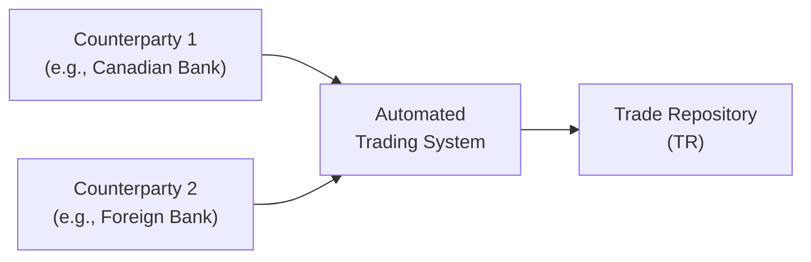

## 11.7 Reporting Cross-Currency Swaps to Trade Repositories

Cross-currency swaps can feel a bit mysterious at first glance. One day, I remember standing in the middle of my busy trading floor, overhearing a conversation about a cross-currency swap between two global banks. My colleague turned to me and asked, “Hey, did we file that trade report yet?” and I realized how crucial timely reporting is. Reporting these transactions to a trade repository (TR) is more than just a regulatory checkbox—it’s a key pillar for transparency and risk management in today’s markets. Let’s unravel the how and why of reporting cross-currency swaps, focusing primarily on Canadian regulations and the role of the Canadian Investment Regulatory Organization (CIRO).

### Introduction to Reporting Obligations

In the Canadian regulatory landscape, reporting obligations for cross-currency swaps (and other OTC derivatives) are governed by the Canadian Securities Administrators (CSA) and enforced on an operational basis by CIRO. CIRO was formed when the Investment Industry Regulatory Organization of Canada (IIROC) and the Mutual Fund Dealers Association of Canada (MFDA) merged as of January 1, 2023. Although IIROC and MFDA no longer exist as separate entities, many regulatory frameworks they implemented are still in force under CIRO’s umbrella. 

Why is reporting so important? When cross-currency swaps go unreported, systemic risk can accumulate undetected. Regulators gather data on who holds which types of swaps, which currencies are most exposed, and how counterparties are hedging or speculating in the derivatives market. This data helps protect the financial system from instability. In Canada, these requirements are enshrined in various CSA Multilateral Instruments related to OTC derivatives (see the CSA website at https://www.securities-administrators.ca/ for more details).

### The Canadian Regulatory Framework

Under the CSA and CIRO rules, all OTC derivatives transactions—including cross-currency swaps—must be reported to an authorized trade repository. These rules state that:

• Each Canadian counterparty has a reporting obligation—though often only one party is designated the “reporting counterparty.”  
• Reporting typically happens on a T+1 basis (the first business day after the trade date).  
• Market participants must maintain accurate and complete records of their trades, ensuring their systems can generate the required data fields.

Firms that fail to report or that submit erroneous data could face regulatory penalties, which can be financial or operational in nature. In some cases, repeated or material breaches may invite increased scrutiny from CIRO, including more frequent audits. While it’s never fun to get an audit notice, the best remedy is to maintain robust reporting procedures and keep thorough documentation.

### Key Data Fields to Report

When we talk about “exchanging data with a trade repository,” we’re referring to a detailed set of fields that build a comprehensive picture of the transaction. These typically include:

• Unique Transaction Identifier (UTI): A standardized code used to uniquely identify each trade. Think of it like a fingerprint for your swap.  
• Legal Entity Identifier (LEI): This is a global reference number that identifies every legal entity involved in the transaction. If you don’t already have an LEI, you can register for one through the Global LEI Foundation at https://www.gleif.org/.  
• Notional Amounts: Each currency’s notional value (e.g., CAD 10 million swapped for USD 7.5 million).  
• Payment Schedules: Specifies how often interest payments occur (e.g., quarterly, semi-annually), along with the applicable floating or fixed rates.  
• Currency Codes and Exchange Rates: The specific ISO codes for each currency (e.g., “CAD,” “USD,” “EUR”) and any reference to the exchange rates or indexes used to settle the contracts.  
• Trade Date and Effective Date: The day the trade was executed, plus the start date for the swap exchanges.  
• Maturity Date: When the swap ends.  
• Counterparty Identifiers: Which party is the reporting counterparty and which is the non-reporting counterparty.  

Depending on your jurisdiction, you might also need to flag whether your transaction is subject to clearing, the name of any clearinghouse, or other risk mitigation measures. 

### Reporting Timeline

One of the biggest operational hurdles is the compliance timeline. In Canada—and honestly in most major jurisdictions—cross-currency swaps must be reported within strict deadlines (frequently the next business day, T+1). That means if you strike a deal at 3 p.m. on a Monday, you’d better have your systems ready to submit all the necessary fields by Tuesday’s close of business. 

In practice, you want to design your workflows so that the swap details—like the notional amounts and reference currency codes—can be captured accurately at the point of execution. Many banks and brokerage firms rely on specialized software that integrates with their trading desks, automatically sending the relevant data to the trade repository.

### Public Dissemination of Data

Now, here’s where some people get confused. In certain jurisdictions, aggregates of data (like total notional volumes and open interest in cross-currency swaps) might be published so that authorities, academics, and the public can see broader market trends. However, sensitive details like the names of counterparties or the exact terms of each trade remain private. These aggregated reports help analysts gauge overall market liquidity and risk. 

In Canada, the CSA and CIRO provide guidelines on how and when data may be published or shared. The main goal is to keep the market transparent enough to foster trust yet protect counterparty identities and proprietary trade details.

### Lifecycle Event Reporting

A cross-currency swap doesn’t always remain static from inception to maturity. Several events can occur along the way:

• Terminations: If the counterparties agree to terminate the swap early.  
• Novations: If one counterparty steps out and is replaced by a new entity.  
• Partial Unwinds or Options to Increase/Decrease the Notional: Sometimes the notional amounts are adjusted for risk management or strategic shifts.  
• Rate Fixing Amendments: If the reference rate changes or the contract terms are adjusted.  

Whenever these “lifecycle events” take place, an updated report must be filed with the trade repository. This ensures the data remain accurate over the swap’s entire life and allows regulators to see how positions change.  

### Technology Infrastructure and Reconciliation

Let’s face it, we live in an era where manual spreadsheets are no longer sufficient for tracking and reporting swaps—particularly when multiple swaps might be executed daily. Once I tried reconciling a cross-currency swap by hand, and, believe me, it was no small task. These days, your technology approach might include:

• Automated trade capture systems.  
• Specialized third-party or proprietary middleware that enriches the trade data.  
• Integration with TRs (e.g., DTCC Derivatives Repository, ICE Trade Vault), which receive your data and store it.  
• Real-time validation that checks for duplicate trades or missing fields.  

On top of that, you’ll likely want to conduct periodic reconciliation. That means matching the trades in your internal records against what the TR says you reported. Reconciliation might show a mismatch in notional amounts or point out trades that you forgot to close. Regular verification can help you avoid panic situations where you discover major discrepancies right before a regulatory exam.

### Mermaid Diagram: Reporting Flow

Below’s a simple Mermaid diagram illustrating how trades flow from counterparties to the trade repository:

Explanation: When two counterparties enter a cross-currency swap, details from both sides are processed through the automated trading system (or a similar in-house platform). This platform finalizes the data into a standard format (including UTIs and LEIs) and submits it to the trade repository.

### Global Coordination and Cross-Border Trades

Cross-currency swaps often involve counterparties operating under different regulators—like a Canadian bank and a European institution. You might need to comply with not only CSA/CIRO rules but also the U.S. Commodity Futures Trading Commission (CFTC) or the European Securities and Markets Authority (ESMA) mandates, among others. In these cases, you might face overlapping or even slightly conflicting requirements.  

• Double Reporting: Some cross-border trades must be reported in both jurisdictions.  
• Substituted Compliance: If each regulator deems the other’s regime “equivalent,” one set of filings might suffice for both.  
• LEI Requirements: Each counterparty worldwide often needs a valid LEI.  

Staying on top of multiple reporting obligations can be tricky, so having a compliance team or third-party solution that understands international nuances is huge.  

### Operational Best Practices

• Establish Clear Responsibility: Decide internally which desk or which person is ensuring the data get reported. If you’re a large organization, create a dedicated long-term role for derivatives reporting.  
• Maintain Data Quality: Use consistent naming conventions and reference data, especially for currency codes and LEIs. Even minor mismatches can create a real headache.  
• Automate: Manual tasks lead to mistakes, especially if you’re dealing with high trade volumes. Automated systems can reduce error rates dramatically.  
• Schedule Reconciliation: A monthly, weekly, or even daily reconciliation process can help fix errors before they accumulate.  
• Stay Updated: Regulations evolve—just look at the shift from LIBOR to risk-free rates or the new clearing requirements that sometimes come into effect without much notice.  

### Common Pitfalls

• Reporting Delays: Missing the T+1 deadline can expose you to fines or regulatory scrutiny.  
• Incorrect Notional Amounts: Because cross-currency swaps involve multiple currencies, it’s easy to mix up the FX conversion or misreport the notional in the wrong currency.  
• Failing to Report Lifecycle Events: The swap’s details change over time, so you have to keep the TR up to date.  
• Overcomplicating LEIs: Using the wrong LEI or letting it lapse can cause major confusions in your reporting as well as in your counterparties’ records.  
• Neglecting Cross-Border Rules: Overlapping regulations can be overwhelming, but ignoring them can land you in hot water.  

### Real-World Example: Early Termination of a USD/CAD Cross-Currency Swap

Let’s say ABC Corp. (a Canadian company with LEI 5493001KJTIIGC8Y1R12) enters into a USD/CAD cross-currency swap with XYZ Bank (a U.S. entity with LEI 758AA9T23BSJSXCB7085). ABC is the “reporting counterparty” under Canadian rules. The notional is USD 5 million for CAD 6.5 million. The swap is set to mature in three years.  

• Day 0 (Trade Execution): ABC notifies its operations team, who enters the trade details—including UTIs, LEIs, notional amounts, currency codes—into the system and sends that info to a recognized trade repository.  
• Day 18 (Lifecycle Event): ABC decides to terminate the swap early because the floating rate environment changes drastically. They contact XYZ Bank, who negotiates an unwind cost.  
• Lifecycle Reporting: Because the swap is terminated early, ABC must file an updated report with the TR that reflects the new final settlement date and the termination payment.  

Failure to update the TR after the early termination would mean ABC’s record looks open and outstanding when it’s actually closed. That discrepancy could lead to confusion during future audits or regulatory inquiries.

### Reference Table: Key Reporting Deadlines

| Jurisdiction        | Reporting Deadline     | Primary Regulator    | Notes                                                    |
|---------------------|------------------------|----------------------|----------------------------------------------------------|
| Canada (CSA/CIRO)  | T+1                   | CIRO                 | Applies to all OTC derivatives with a Canadian counterparty. |
| United States       | T+1 or T+15 Minutes*  | CFTC                 | *Real-time reporting for certain trades is required.     |
| European Union      | T+1                   | ESMA                 | EMIR framework demands standardized reporting.           |

*(These deadlines are subject to updates and clarifications; always check the regulator’s official website.)*

### References and Additional Resources
- CSA Multilateral Instruments on OTC Derivatives Reporting:  
  https://www.securities-administrators.ca/  
- CIRO’s guidelines on derivatives reporting frameworks:  
  https://www.ciro.ca  
- Global LEI System for issuing and verifying LEIs:  
  https://www.gleif.org/  
- Trade Repositories such as DTCC (Depository Trust & Clearing Corporation) and ICE Trade Vault:  
  For more information on registration and reporting procedures.

### Conclusion

Reporting cross-currency swaps to trade repositories isn’t just about checking boxes or meeting deadlines; it’s a central aspect of market integrity and transparency. Knowing which data fields you need, how to manage lifecycle events, and how to integrate technology can greatly reduce compliance headaches. By focusing on data quality, timeliness, and cross-border coordination, your organization can minimize operational risk and help maintain a stable, transparent global derivatives marketplace. 

If you adopt these best practices, you’ll be in a good position to handle any future regulatory changes—because, let’s be honest, they’ll come sooner or later. Cross-currency swaps might sound complicated, but a robust reporting system ensures you’re never in the dark about what’s happening beneath the surface.

---

## Sample Exam Questions: Reporting Cross-Currency Swaps to Trade Repositories



### Which entity enforces OTC derivatives reporting requirements for Canadian investment firms operating in 2025?

- [ ] Investment Industry Regulatory Organization of Canada (IIROC)
- [ ] Mutual Fund Dealers Association of Canada (MFDA)
- [x] Canadian Investment Regulatory Organization (CIRO)
- [ ] Canadian Imperial Reporting Office

> **Explanation:** IIROC and MFDA merged to form CIRO as of January 1, 2023. CIRO is now responsible for overseeing Canadian investment dealers.

### What is the primary purpose of assigning a Unique Transaction Identifier (UTI) to a cross-currency swap?

- [ ] To track changes in contractual interest rates
- [x] To uniquely identify each derivatives transaction
- [ ] To measure counterparty credit risk
- [ ] To simplify margining for the swap

> **Explanation:** A UTI is a standardized code ensuring each derivative contract is distinguishable from any other, aiding in accurate reporting.

### Which of the following best describes a Lifecycle Event in the context of OTC derivatives reporting?

- [ ] A routine compliance meeting
- [x] Any post-trade event that changes an existing contract’s characteristics
- [ ] The daily mark-to-market calculation for a swap
- [ ] The reconciliation process with the clearing house

> **Explanation:** Lifecycle events include partial unwinds, novations, notional changes, or early terminations that affect a contract’s terms.

### How soon after execution must most Canadian cross-currency swaps be reported to a trade repository?

- [ ] Same day (T+0)
- [x] Next business day (T+1)
- [ ] Within 3 days
- [ ] Within 1 week

> **Explanation:** The common requirement in Canada is that trades be reported by the next business day, ensuring prompt market transparency.

### If a Canadian firm enters into a swap with a European counterparty, which statement about reporting obligations is most accurate?

- [x] They may need to comply with both Canada’s CIRO rules and EU rules under EMIR.
- [ ] Only the Canadian rules apply because the transaction is denominated in CAD.
- [ ] Only the European rules apply if the notional is below CAD 10 million.
- [ ] No reporting obligation exists because it’s a cross-border transaction.

> **Explanation:** Cross-border swaps can trigger multiple reporting requirements. One might satisfy both regulators if substituted compliance is recognized, but in many cases, reporting in both jurisdictions is required.

### What commonly happens when a firm fails to file a timely report of a cross-currency swap to the trade repository?

- [ ] The swap automatically expires.
- [x] The firm may face regulatory scrutiny and potential penalties.
- [ ] The firm is forced to novate the trade to a compliant counterparty.
- [ ] The Canada Revenue Agency imposes a capital gains tax.

> **Explanation:** Not reporting on time can lead to fines, regulatory censure, or other enforcement actions by CIRO or provincial securities commissions.

### Which type of event would require an updated report to the trade repository?

- [x] Notional increase or decrease
- [ ] Routine margin call
- [x] Change of counterparty via novation
- [ ] Normal daily mark-to-market adjustments

> **Explanation:** Material changes like novation or notional adjustments are considered lifecycle events. Margins and daily marks aren’t typically filed as separate events unless they alter the contract’s terms.

### What is one key reason for regular reconciliation of reported data?

- [ ] To inflate trade volumes on public disseminations
- [ ] To meet cross-margining requirements
- [x] To ensure data accuracy and detect any reporting discrepancies
- [ ] Reconciliation is only required for trades cleared at a CCP

> **Explanation:** Reconciliation helps confirm that the trade repository’s records match the firm’s internal records, reducing the risk of inaccuracies or omissions.

### Which entity or organization in Canada is primarily responsible for collecting and maintaining records of OTC derivatives trades submitted by market participants?

- [x] Registered trade repositories (e.g., DTCC or ICE Trade Vault)
- [ ] The Bank of Canada
- [ ] The Canada Revenue Agency (CRA)
- [ ] CIPF (Canadian Investor Protection Fund)

> **Explanation:** Regulatory-approved trade repositories, such as DTCC Derivatives Repository or ICE Trade Vault, gather and store swap data for the regulators.

### True or False: Under Canadian regulations, tabled aggregate data from trade repositories may be publicly disseminated without exposing individual counterparty details.

- [x] True
- [ ] False

> **Explanation:** Aggregated market data can be shared with the public to enhance market transparency, but sensitive details remain confidential.


