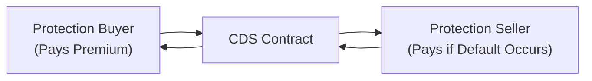

## 12.1 Credit Derivatives

When I first stumbled into the world of credit derivatives, I have to admit I was a bit intimidated. There was all this talk about “credit events,” “counterparty risk,” and “ISDA Master Agreements,” and it seemed like yet another complicated corner of finance. But, over time, I realized credit derivatives serve a crucial purpose: they let folks in the financial markets isolate and trade the risk that a borrower might not repay what they owe. They’re basically a way to buy or sell “insurance” on a loan or a bond without necessarily having to hold the underlying debt. If that already sounds intriguing, buckle up—we’re going to explore how credit derivatives work, why people use them, and how Canada’s regulations help keep everything on track.

### Introduction and Basic Concepts

Credit derivatives are financial instruments designed to separate or transfer the credit risk of a borrower or issuer. This risk could come from a corporation (like a major telecom company), a government (like Canada’s federal government), or even a basket of issuers. The overarching goal is to manage or profit from the likelihood (or unlikelihood) that someone will default on their debt. Sometimes, people use them to hedge exposure they already have, and sometimes they’re used to speculate purely on credit events.

Before diving into the intricacies, let’s clarify a few jargon terms you’ll encounter a lot:

• “Credit Risk” is the possibility of loss when a borrower can’t meet its obligations.  
• “Credit Exposure” is the extent to which your portfolio or institution stands to lose if the borrower defaults.  
• “Counterparty Risk” is the worry that the other party in your credit derivative deal (the one who’s promising to pay if bad stuff happens) might not follow through.  
• “ISDA Master Agreement” is the standard contract that governs most over-the-counter (OTC) derivatives, including credit derivatives.  
• “CSA” (Canadian Securities Administrators) is the collective of provincial and territorial securities regulators in Canada.  
• “CIRO” (Canadian Investment Regulatory Organization) is the current self-regulatory organization in Canada that oversees investment dealers, mutual fund dealers, and market integrity.  
• “OTC Market” is where financial instruments are traded directly between parties, not on a formal exchange.  

Don’t worry if you’re feeling overwhelmed; credit derivatives became popular precisely because they solve certain problems that large institutions (insurance companies, banks, pension funds) face daily: “How do we move credit risk around to those willing to take it?” Let’s see how that actually works in practice.

### A Quick Glimpse into History and Rationale

Banks have always wrestled with the possibility that borrowers might default. For instance, if a commercial bank extends a sizable loan to a tech company, that bank might want some form of insurance if the tech company gets in trouble. Enter the credit derivative. Instead of that bank having to sell the loan outright or find a complicated scheme to offload the risk, it can enter into a contract with a “protection seller” who agrees to cover losses if the tech company defaults. In exchange, the bank pays a premium.

In the late 1990s and early 2000s, credit derivatives took off because they offered new ways to manage risk—and, well, to speculate. By the mid-2000s, you had credit default swaps (CDSs), credit-linked notes (CLNs), total return swaps (TRSs), and a bunch of other acronyms swirling around the market. The global financial crisis of 2008 definitely highlighted the complexity and potential pitfalls of these instruments, but it also reinforced why they exist: to shift credit risk to those who want it.

### Common Types of Credit Derivatives

Broadly, credit derivatives come in several flavors. Let’s unpack some of the most common.

#### Credit Default Swaps (CDSs)
A CDS is like an insurance policy on a bond or loan. You pay a periodic fee (the “spread” or “premium”) to a protection seller, and if the entity specified in the agreement defaults or experiences a “credit event” (like failing to pay interest, going bankrupt, or restructuring its debt), the protection seller compensates you. This compensation usually equals the loss in market value of the underlying debt.

CDSs are widely used for hedging (if you already hold the underlying bond and you want to insure it) and for speculation (if you think a particular bond issuer might run into trouble, or if you believe the market is underpricing that probability).

Here’s a simple diagram to illustrate the flow:

• The protection buyer pays a premium to the protection seller.  
• If there’s no credit event, the trade simply continues until maturity, and the seller keeps the premium.  
• If there’s a credit event, the seller makes a payment to the buyer, typically offsetting (in whole or part) the buyer’s loss on the underlying bond or capital structure.

#### Credit-Linked Notes (CLNs)
A credit-linked note is a structured debt instrument. Suppose you invest in a CLN issued by a bank. The coupon or redemption amount you receive depends on the performance of a specific reference entity’s credit (like a certain corporation). If there’s a credit event, the redemption value of the note might be reduced. Investors might earn a higher yield compared to standard bonds because they’re effectively selling protection.

#### Total Return Swaps (TRSs) on Credit
A total return swap is a contract in which one party receives the “total return” of a reference asset (including coupon payments, interest, and changes in market value) while paying a floating rate (say, based on CORRA in Canada or a recognized benchmark rate). Usually, the reference asset is a bond or a portfolio of bonds. This can isolate credit risk (and market risk) for whichever party is more comfortable managing it.

#### Credit Spread Options
These are options where the payoff depends on the spread of a particular bond or index over a benchmark interest rate. If the credit spread widens beyond a certain strike spread, the buyer of the option can profit. Essentially, it’s a way to speculate or hedge on changes in issuers’ credit risk perceptions.

### The Canadian Regulatory Landscape

Like so many financial instruments, credit derivatives in Canada are primarily traded over the counter. The CSA (Canadian Securities Administrators) set the overall rules and coordinate securities regulation, while CIRO sets standards for investment dealers and oversees that they’re abiding by best practices and capital requirements. If you’re dealing with credit derivatives in Canada, you’ll often see references to:

• National Instruments from the CSA that define how derivatives must be reported, cleared, and margined.  
• CIRO guidelines for capital, margin, and sales practices (especially relevant if you’re dealing with retail clients, but also for institutional accounts).  
• ISDA Master Agreements, which remain the gold standard for the legal framework that sets out each party’s rights and obligations.

Since credit derivatives introduce counterparty risk, regulators push for central clearing where possible. Central clearing typically reduces the systemic risk: if one major player goes bust, the clearinghouse steps in to ensure everyone else’s trades get settled. CIRO monitoring also includes ensuring that dealers handle margin properly and identify potential systemic vulnerabilities.

If you’re curious about the nitty-gritty of official rules, you can review the CSA’s National Instruments at their website (<https://www.securities-administrators.ca>)—it has everything from definitions of derivatives to clearing and reporting obligations. Meanwhile, <https://www.ciro.ca> is your go-to for updates on margin rules, compliance bulletins, and enforcement notices related to derivatives.

### The ISDA Master Agreement and Documentation

Let’s face it, folks: dealing in any OTC derivative without a solid legal framework is pretty scary stuff. That’s where the International Swaps and Derivatives Association (ISDA) steps in. They’ve developed a standard “Master Agreement” that, along with trade confirmations, definitions booklets, and schedules, lays out the legal foundation for basically all these deals. The Master Agreement addresses:

• Which events constitute a default  
• How payments should be exchanged  
• What happens if there’s a dispute on valuations  
• How netting is handled when multiple trades are outstanding between the same parties  
• Which jurisdiction’s law governs the contract  

In Canada, dealers and institutional investors almost always abide by the ISDA Master Agreement to reduce legal and operational uncertainty. It’s like the universal handshake that says, “We both know the rules, so let’s trade confidently.”

### Why Use Credit Derivatives?

It’s a fair question—why not just buy or sell the actual bond or loan? Often, the bond might be illiquid, or you might not have permission to hold the underlying asset. A credit derivative, on the other hand, lets you manage credit risk short-term or speculatively without necessarily needing the underlying. Some typical motivations:

• Hedging a position: If you hold a corporate bond but aren’t sure it’ll maintain its credit quality, buying a CDS can hedge that risk.  
• Yield enhancement: Selling protection on a stable issuer might earn you a steady premium if you think the issuer’s default risk is really low.  
• Portfolio diversification: Credit derivatives can provide exposure to assets (like emerging market corporate debt) that you might not buy outright due to liquidity or regulatory constraints.  
• Speculating on credit spreads: If you think a certain issuer will improve in credit standing, you might sell protection. If correct, the CDS spreads narrow, and you profit when you close the position.

### Practical Scenarios

Imagine a Canadian pension fund that’s holding significant provincial bonds. The pension fund might worry about a potential downgrade if there’s a slump in the local economy. By purchasing credit protection in the CDS market, the pension fund effectively insures itself. Should a downgrade or default scenario occur, the seller of the CDS compensates the fund. Meanwhile, if nothing dire happens, the fund simply loses the cost of the premium, and life goes on.

In a second scenario, consider a smaller Canadian bank wanting to reduce the credit risk on its corporate loan portfolio. Rather than selling off the actual loans— which might upset local corporate relationships—the bank can enter into a total return swap or buy a basket-based credit default swap referencing those loans. That way, they pass on the risk (for a cost) and keep the client relationships intact.

### Common Pitfalls and Best Practices

Now, credit derivatives aren’t exactly “danger proof.” If they were, the 2008 crisis might have been a lot gentler. Here are some of the big challenges:

• Counterparty risk: If you’re buying protection from a shaky counterparty, you could be left high and dry when you actually need a payout. Mitigate this by trading with well-capitalized entities or through central clearing.  
• Incorrect documentation: A mismatch (even a small one) in your contract can lead to huge legal headaches in the event of a credit event. Always cross-check that your ISDA schedules and definitions match.  
• Liquidity risk: Some credit derivative markets are more liquid than others. Smaller or emerging-market issuers might have wide bid-ask spreads, so be prepared for that.  
• Model risk: Valuing a CDS or a CLN requires assumptions about default probabilities and recovery rates. If your model assumptions are off, you can lose a lot of money in a flash.  
• Regulatory changes: Yes, the rules around derivatives reporting, central clearing, and margin can evolve quickly. Stay in touch with CSA and CIRO bulletins and consult your firm’s compliance department.

### Real-World Case Studies

To illustrate the real-world implications, let’s consider a big-tech U.S. company that ran into financial trouble a few years ago (hypothetical scenario). Canadian institutions might have had exposure to that company via its corporate bonds. If they purchased CDS protection before the trouble became public, they would have been covered when the bond’s value hit the floor. Institutions who sold that protection would have lost money but might have hedged their exposure by shorting the underlying bond or entering offsetting positions.

Another example: a large Canadian insurer might issue or invest in credit-linked notes referencing a variety of corporate or municipal issuers. If none of those issuers default, the insurer pockets the premium. If defaults occur, the insurer may face claims or reduced redemption. This juggling act of risk and reward is at the heart of credit derivatives.

### Use of Technology and Open-Source Tools

If you’re into the quantitative side of things, you might find open-source libraries like QuantLib (<https://www.quantlib.org>) extremely helpful. QuantLib is a free toolkit for modeling and pricing many types of derivatives, including credit derivatives. You can attempt to model hazard rates, calibrate credit curves, and simulate default scenarios. It’s a brilliant way to see the math behind these instruments without paying a fortune for proprietary software.

Many banks and asset managers build their internal systems on top of libraries like these, adding specialized modules for risk management, real-time data feeds, and integration with trade-capture systems. But if you’re just starting, QuantLib is a great place to get your hands dirty.

### Emerging Trends & ESG

Environmental, Social, and Governance (ESG) considerations are sneaking their way into every aspect of finance, and credit derivatives are no exception. Some folks are working on “ESG-driven credit derivatives” or “sustainability-linked credit swap structures.” For instance, a reference entity might be subject to certain environmental performance metrics. If the entity fails to meet them, it triggers a specific adjustment in the cash flow of the derivative.

Now, it’s still a growing field. But it’s likely that in the not-too-distant future, credit derivatives will incorporate more nuanced features that align with green finance and global sustainability goals.

### Key Takeaways

• Credit derivatives let you trade and manage the risk of a borrower’s default.  
• CDSs, CLNs, and TRSs address different objectives: from hedging a single bond to insuring a whole portfolio or capturing spreads.  
• Counterparty risk is a big deal; always ensure your trade is well-documented and, where possible, centrally cleared.  
• In Canada, CIRO and the CSA set the ground rules, including compliance and margin requirements.  
• Technological tools like QuantLib can help you or your firm model credit risk and price credit derivatives.  
• This market continues to evolve, with ESG considerations and new clearing requirements shaping the future direction.

Remember, credit derivatives aren’t inherently “bad” or “risky” in themselves. They become risky if used improperly or if participants ignore the fine print. I like to think of them as specialized tools: in the right hands, they can be wonderful. In the wrong hands, well, they can do some real damage.

### Additional Resources

If you’re hungry for more:

• The CSA Website (<https://www.securities-administrators.ca>): Has the actual texts of National Instruments covering derivatives.  
• CIRO (<https://www.ciro.ca>): Canada’s main self-regulatory body for investment dealers and mutual fund dealers. Look for their guidelines on OTC derivatives oversight, margin, and capital.  
• ISDA (<https://www.isda.org>): Tons of documentation on Master Agreements and definitions, plus best practices.  
• QuantLib (<https://www.quantlib.org>): An open-source library for pricing and risk managing credit derivatives, among other instruments.  
• “Options, Futures, and Other Derivatives” by John C. Hull: A classic textbook that covers credit derivatives in detail, including the mathematics behind them.

I hope this overview helps you feel more comfortable with the basics of credit derivatives. The next time you hear about a credit default swap or a credit-linked note, you’ll know the motivation is usually to either hedge default exposure or place a bet on a credit-specific outcome. In Canada and beyond, these instruments are a well-established part of the financial ecosystem—just make sure you’ve got the right documentation, partners, and regulatory knowledge before diving in.

---

## Sample Exam Questions: Credit Derivatives Essentials



### Which statement best describes a credit derivative?

- [ ] A derivative used exclusively for hedging interest rate risk.
- [ ] A mechanism that automatically converts equities into bonds under certain conditions.
- [x] A financial instrument designed to transfer or hedge the credit risk of a borrower or issuer.
- [ ] A type of government-issued security aimed at stabilizing currency values.

> **Explanation:** Credit derivatives explicitly transfer or hedge a borrower’s risk of default. They don’t automate equity-to-bond conversions, and they’re not limited to interest rate risk or currency management.

### Which of the following is the most widely used credit derivative?

- [ ] Credit Spread Option
- [x] Credit Default Swap (CDS)
- [ ] Equity Option
- [ ] Foreign Exchange Swap

> **Explanation:** While there are several credit derivatives, CDSs are by far the most common. They allow protection buyers to hedge against default risk on a reference entity.

### One of the key roles of the International Swaps and Derivatives Association (ISDA) in the OTC credit derivatives market is to:

- [ ] Lend money to failing firms.
- [x] Provide standardized legal documentation through Master Agreements.
- [ ] Force all trades onto exchanges.
- [ ] Offer insurance guarantees for CDS contracts.

> **Explanation:** ISDA doesn’t lend money or insure trades directly; it sets global standards and documentation (Master Agreements) to help market participants manage their OTC derivatives.

### When a credit event occurs in a CDS contract, which of the following generally happens?

- [ ] The protection buyer pays an additional premium to the protection seller.
- [x] The protection seller compensates the protection buyer for the loss on the underlying bond or loan.
- [ ] The CDS contract is automatically transferred to a new counterparty.
- [ ] Nothing occurs; CDS contracts only settle at maturity.

> **Explanation:** In a typical CDS, if the reference entity defaults, the protection seller pays the protection buyer an amount to offset the loss. That’s the main purpose of a CDS.

### Why might a Canadian pension fund purchase CDS protection?

- [ ] To convert its existing bond portfolio into equity securities.
- [ ] To reduce the coupon payments it receives from a bond.
- [x] To hedge against the risk of default on its bond holdings.
- [ ] To speculate on interest rate movements in the equity market.

> **Explanation:** Pension funds often hold large bond positions and might use CDS to hedge default risk, ensuring the ability to meet future obligations even if certain issuers fail.

### Which of the following is NOT typically considered a credit derivative?

- [ ] Credit-Linked Note (CLN)
- [ ] Total Return Swap referencing a corporate bond
- [ ] Credit Default Swap (CDS)
- [x] Currency Exchange Traded Fund (ETF)

> **Explanation:** CLNs, TRSs (on credit assets), and CDSs all handle credit risk. A currency ETF deals primarily with exchange rates, not credit risk.

### In Canada, who sets the overarching standards for derivatives reporting requirements, including credit derivatives?

- [x] Canadian Securities Administrators (CSA)
- [ ] Office of the Superintendent of Financial Institutions (OSFI)
- [ ] Canada Deposit Insurance Corporation (CDIC)
- [ ] The Canadian Bankers Association (CBA)

> **Explanation:** The CSA coordinates securities regulation across provinces and territories and is responsible for overarching derivatives reporting obligations (like National Instruments).

### If you’re concerned about counterparty risk in an OTC credit derivative, a recommended approach is:

- [ ] Forget about it and hope for the best.
- [x] Use a central clearinghouse or maintain robust collateral agreements via ISDA.
- [ ] Only trade with very small counterparties.
- [ ] Never engage in credit derivatives of any kind.

> **Explanation:** Mitigating counterparty risk often involves central clearing or well-crafted collateral arrangements in line with an ISDA Master Agreement. Simply avoiding the market altogether might not be a viable business strategy.

### How do credit-linked notes (CLNs) differ from conventional corporate bonds?

- [ ] CLNs have no maturity date and pay no coupon.
- [ ] CLNs can only be issued by governments.
- [x] CLNs tie part of their payoff to the credit performance of a reference entity.
- [ ] CLNs are only sold in the secondary market.

> **Explanation:** Unlike a plain vanilla corporate bond, the redemption or coupon on a CLN is linked to the credit event of a reference entity, which makes it part of the credit derivatives family.

### True or False: Under a CDS contract, the protection seller typically receives periodic payments from the protection buyer.

- [x] True
- [ ] False

> **Explanation:** The protection buyer pays a periodic premium to the protection seller, who is taking on the credit risk. This is analogous to paying insurance premiums.


