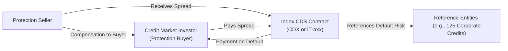

## 12.4 What are Index CDSs?

Imagine you’re sitting around chatting with a friend—maybe someone who’s totally fascinated by the credit markets—and they ask, “So what’s the fastest way to get broad exposure to the creditworthiness of a bunch of companies without buying all their bonds directly?” You might respond: “Have you heard of Index CDSs?” This single question captures the essence of why Index Credit Default Swaps (Index CDSs) are such an appealing instrument for both investors and risk managers.

They’re basically credit default swaps on a basket of corporate or sovereign credits. With a single transaction, you can gain or hedge exposure to many different names. But let’s backtrack a bit and build our understanding step-by-step. We’ll start with the basic concept, then explore how they’re structured, how they roll, and why they’re so valuable from a diversification standpoint.

---

### Understanding the Concept of Index CDS

An Index CDS is a standardized credit derivative that references a “basket”—an index—of various underlying entities (often corporations, sometimes sovereigns). Instead of a single reference entity (like a single corporate bond issuer in a typical single-name CDS), the Index CDS lumps multiple issuers together under one contract. This means if you buy or sell protection on the index, you’re effectively dealing with the credit exposure of all those issuers at once.

Common Index CDS families include:  
- **CDX:** Relates to North American corporate credits.  
- **iTraxx:** Relates to European, Asian, and sometimes emerging-market credits.

These indices are typically well-known brand names in the credit derivative space, each containing dozens or even hundreds of names (e.g., 100+ corporate credits). By trading a single Index CDS, you can be long or short the credit risk of all constituent names together, which can be a huge time-saver if your strategy calls for broad market exposure or risk hedging.

---

### A Quick Glossary

Before we dive deeper, here are some quick definitions:

- **CDX**: A family of credit derivative indices focusing on North American issuers.  
- **iTraxx**: A family of indices covering European, Asian, and emerging markets.  
- **Index Roll**: The periodic reconstitution of the reference entities in a CDS index (often every six months).  
- **Single-Name CDS**: A credit default swap referencing a single corporate or sovereign issuer.  
- **Diversification**: Reducing your exposure to a single default risk by holding a broader basket.

---

### Why Go the Index Route?

If you’re familiar with single-name CDS, you know it’s a contract that protects you against default (or certain other specified credit events) of a single entity. Let’s say you’re worried about a particular automotive manufacturer defaulting on its debts; you can buy protection via a single-name CDS. But what if you want to hedge or gain exposure to the entire automotive sector—or maybe the entire North American investment grade corporate market? Placing one trade for each individual entity could be cumbersome, time-consuming, and expensive.

Enter Index CDS. By choosing an index that contains many different names—e.g., top 125 investment-grade corporate issuers in North America for the CDX—investors can handle all that with one contract. It’s sort of like an “ETF” concept, but in the world of credit derivatives. They’re standardized, liquid, and transparent.

**Real talk**: I once chatted with a friend who managed a corporate bond portfolio. They realized that if they wanted to hedge their entire portfolio’s default risk quickly—maybe the bond market was looking grim, or the central bank was set to raise interest rates—they could buy or sell Index CDS on the relevant basket. Suddenly, their entire credit exposure was adjusted with a couple of keystrokes. They didn’t need to fuss with dozens or hundreds of single-name CDS contracts.

---

### Structure and Mechanics (A Bird’s-Eye View)

Index CDS generally have two main parties: the buyer of credit protection and the seller of credit protection. The underlying is a credit index comprised of multiple issuers (like 100 or 125).

If you **buy** protection on an index:
- You pay a spread (periodic payments) to the seller.  
- If a credit event (like a default) occurs on one or more of those constituents, the buyer receives a settlement (which could be a cash payout or a physical delivery settlement) proportional to that company’s weighting in the index.  

If you **sell** protection on that index:
- You receive the spread.  
- You’re obligated to compensate the protection buyer if one or more of the underlying reference entities experience a credit event.  

In other words, it’s the same fundamental concept as a single-name CDS, except the notional and default events can be triggered by multiple entities. The final settlement can be more complex, since the index can drop some constituents (due to default) while continuing coverage for the remaining ones.

The payoff leg in an Index CDS can be conceptualized with a formula. Though it’s generally more complex, a simplified version might look like:


\text{Protection Payout} = \text{Notional} \times \sum \left( \text{Defaulted Entity Weight} \times (1 - \text{Recovery Rate}) \right)


But that’s a bit too academic—just remember that the protection buyer is made whole (less the recovery) for the portion of their notional that’s tied to a defaulted entity.

---

### Index Rolls: Keeping Track of the Changes

One of the fun parts of Index CDS is the concept of the index roll. Typically, these indices renew or “roll” every six months, in March and September. During a roll, some names might get dropped (say, if they’ve defaulted or if their credit rating has changed drastically), and new ones are added to keep the index aligned with the market’s evolving credit landscape. That means each index family has a “series,” identified by the year and month of inception, such as “CDX.NA.IG Series 39 (Sep 2023).”  

This rolling process can impact the pricing, because the “on-the-run” series tends to be the most liquid. Just like a new bond issue may trade more actively than older ones, the current series of an Index CDS is generally the most popular. Over time, that series ages a bit (becomes “off-the-run”), and attention shifts toward the brand-new series with updated constituents.

**A quick personal side note**: I remember a time when a colleague and I had positions in multiple off-the-run series—like Series 30 or 31—because they had interesting relative value compared to the brand-new Series 32. We had to track carefully which companies had defaulted, and how that influenced the net notional at risk. Let’s just say you can quickly get a headache juggling multiple series if you’re not well organized!

---

### Adding Diversification to the Picture

Why does diversification matter here? In a single-name CDS, you’re exposed to one entity’s credit risk. If that entity defaults, it’s a major event for your position. Index CDS spread that credit risk across many entities. Even if a few of them default, you still have the rest of the index—and your losses are capped at the weighting of each defaulted name. This approach can be especially appealing for portfolio managers who want broad exposure or to hedge a well-diversified credit portfolio.

In more practical language, an Index CDS is a good “middle ground” if you want to dip your toe into credit default swaps without focusing on the complexities of analyzing every single corporate issuer. You’re effectively saying: “I’m bullish (or bearish) on the overall credit environment for these types of companies.”  

**However**, be mindful that a meltdown in a broad market or sector can still lead to higher correlation among names. During a financial crisis, defaults can be more correlated. In that scenario, an Index CDS may come under significant stress if multiple entities default in rapid succession.

---

### A Quick Mermaid Diagram of an Index CDS Transaction

Below is a simplified diagram illustrating how an Index CDS might look, focusing on the main participants and the underlying basket of reference entities:

In practice, the contract is typically facilitated by a dealer or a central counterparty. But from a conceptual standpoint, you can think of it as a simple transaction in which the buyer and seller of protection are exchanging default risk for a stream of premium payments.

---

### Practical Use Cases

**Hedging a Corporate Bond Portfolio**  
Suppose you manage a large corporate bond portfolio concentrated in investment-grade North American names. You expect some macroeconomic headwinds—a slowdown in consumer spending, supply chain disruptions, or maybe a sudden rate hike from the Bank of Canada. You could hedge systematically by buying protection on the CDX.NA.IG index. This single trade offers a broad hedge across investment-grade issuers in North America.

**Directional Speculation**  
On the flipside, if you believe credit quality is improving, you might opt to sell protection on the index. You collect the spread, on the assumption that defaults will be minimal. At the same time, you’ve got to be aware of the potential losses if defaults start piling up. If you’re right, you earn that spread, which can be a tidy profit. If you’re wrong… well, you might be on the hook for those losses.

**Relative Value Trades**  
You can also do interesting strategies around on-the-run vs. off-the-run series. For instance, you might buy protection on an older series and sell protection on the newest one if you detect a mispricing. Or you might exploit differences between iTraxx Europe and CDX North America if you think one region’s credit risk is under- or overvalued compared to the other.

---

### Regulatory and Canadian Market Considerations

Here in Canada, credit derivatives—particularly those involving Canadian counterparties—must comply with guidelines from the Canadian Securities Administrators (CSA) and, where applicable, the Canadian Investment Regulatory Organization (CIRO). Remember that as of 2023, the MFDA and IIROC (historical organizations) have been amalgamated into CIRO, the new national self-regulatory body overseeing investment dealers and market integrity. So any mention of “IIROC” is purely historical. For present-day regulations, we look to CIRO rules for trading, margin requirements, and reporting obligations for derivative transactions.

The CSA has published frameworks on clearing requirements, trade reporting, and risk management for over-the-counter derivatives. Index CDS often fall under these categories, especially if trades are large, cross-border, or done with institutional counterparties. Broadly speaking:  
- If you’re a Canadian-incorporated firm, or if you’re dealing with a Canadian counterparty, you likely need to meet certain reporting requirements to trade repositories.  
- In many cases, certain standardized Index CDS might be centrally cleared, which can reduce counterparty risk.  

If you’re new to these rules, the CSA website (https://www.securities-administrators.ca/) and CIRO (https://www.ciro.ca) have plenty of resources outlining compliance steps and best practices.

And don’t forget about the Canadian Investor Protection Fund (CIPF), which protects client assets if a member firm becomes insolvent. CIPF is now Canada’s sole protection fund after merging with the MFDA IPC. It doesn’t exactly protect you against market losses on an Index CDS trade, of course, but it does help if your broker or dealer goes bankrupt.

---

### Index CDS vs. Single-Name CDS: Key Differences

Index CDS differ from single-name swaps in a few critical ways:

**Diversification**  
Index CDS is inherently diversified across multiple issuers, while a single-name CDS focuses on one issuer. This can reduce single-issuer default risk but can still leave broad market risk.

**Standardization**  
Because an index is widely traded with known constituents and rebalancing schedules, it tends to be more liquid. Single-name CDS liquidity can vary greatly with each issuer.

**Pricing**  
Index CDS might have tighter bid-ask spreads than single-names, thanks to higher trading volume and standardization. However, the index spread is an average measure, influenced by many names. If you have knowledge that one particular issuer is about to blow up, a single-name CDS might give you a more targeted position.

**Restructuring and Default Events**  
Index documentation typically outlines how each default or credit event is settled among the index constituents. With single-name CDS, it’s more straightforward: The one name either defaults or doesn’t.

---

### Market Platforms and Tools

Index CDS are often traded in the over-the-counter (OTC) market, facilitated by large dealers. However, a growing portion of Index CDS transactions are cleared through central counterparties for risk management. For up-to-date pricing, volumes, and composition details, you can check resources such as:

- **S&P Global** (previously Markit, now integrated with S&P’s offerings): https://www.spglobal.com
- **MarketAxess**: https://www.marketaxess.com

Additionally, open-source libraries like **QuantLib** (https://www.quantlib.org) can model and price credit derivatives (including Index CDS). If you’re a detail-oriented analyst who loves Python or C++, you can toy around with these tools to simulate default scenarios, price the protection legs, and estimate recovery rates.

---

### Potential Pitfalls and How to Avoid Them

**Over-Reliance on Correlation Assumptions**  
When you buy or sell protection on an index, you’re implicitly relying on certain correlations among the issuers. During normal market conditions, diversification works beautifully. But in times of crisis, correlations can spike. Be sure your risk management system accounts for those “tail event” scenarios.

**Ignoring Roll Dates**  
Index roll dates can lead to big changes in liquidity. If you’re holding an off-the-run series, you might see less trading interest once a new series is launched. This can impact your exit strategy.

**Underestimating Recovery Rate Uncertainty**  
While Index CDS might quote a standard recovery assumption, actual recoveries can vary widely. A single default with unexpectedly low recovery can have a bigger impact than you think.

**Neglecting Regulatory Requirements**  
Canadian derivatives regulations can be nuanced. Failure to comply with trade-reporting obligations or margin requirements can lead to regulatory headaches, fines, or forced position close-outs. Stay on top of CIRO and CSA rules—particularly if you’re crossing borders or dealing with large notional amounts.

---

### A Hypothetical Scenario

Let’s picture a scenario in which an investor is concerned about the North American high-yield space—perhaps expecting a wave of defaults. Instead of spending hours analyzing potential defaulters among dozens of high-yield issuers, they buy protection on the **CDX.NA.HY** index. This single trade costs them a spread (paid periodically). If multiple high-yield names default, their Index CDS contract triggers payouts proportionally.

Simultaneously, if they’re actually wrong, and the economy thrives (leading to fewer defaults), they will have expended that periodic premium for nothing—just like an insurance premium. But at least they had a clear, diversified hedge in place.

---

### Best Practices for Market Participants

- **Stay Informed:** Keep an eye on the roll schedule and the reference entities. If you’re transacting in older series, be aware of any reference names that have defaulted.
- **Stress Test**: Even if an index has 125 names, check how correlated they might be in a worst-case scenario. Stress testing helps you anticipate bigger losses than expected.
- **Documentation:** Familiarize yourself with the ISDA standard documentation for credit derivatives. Provisions like “Credit Event definitions” and “Restructuring clauses” matter a lot with Index CDS.
- **Use Trusted Tools:** Platforms like MarketAxess or S&P Global can provide transparency on index constituents and real-time pricing. For advanced modeling, libraries like QuantLib are extremely helpful.
- **Regulatory Compliance:** If you’re trading in Canada or with Canadian counterparties, consult the CSA and CIRO guidelines. Make sure you’re reporting your trades properly; failing to do so can be a costly mistake.

---

### Further Resources

- **S&P Global/Markit Index Rules:** Detailed index construction rules, definitions of credit events, and roll schedules.  
- **QuantLib**: (https://www.quantlib.org) for open-source credit derivative pricing.  
- **CIRO**: (https://www.ciro.ca) for regulatory updates and derivatives guidelines in the Canadian marketplace.  
- **CSA Publications**: (https://www.securities-administrators.ca) for trade reporting, clearing requirements, and cross-border guidelines.  
- **MarketAxess**: (https://www.marketaxess.com) for real-time data, trading, and analytics on credit derivatives.

---

### Concluding Remarks

Index CDSs are a powerful tool in the credit derivatives toolkit. They give you a rapid, diversified way to take a stance on broad credit markets—without the complexity of putting on a dozen (or a hundred) single-name CDS positions. Rolling structures keep them current, liquidity is generally robust, and the standardization helps keep transaction costs lower than you’d expect for that many exposures. But, as always, watch out for the fine print in your documentation, keep an eye on the correlation risk, and stay within the bounds of Canadian or international regulations that apply to your trades.

They’re a bit like a well-organized binder full of credit bets—each tab representing a company—rather than a chaotic stack of loose contracts. In that sense, Index CDS can absolutely make life easier for credit investors and hedgers. Whether you’re hedging, speculating, or gaming nuanced relative value plays, these instruments remain a staple of modern credit markets.

And that’s, in a nutshell, the story of Index CDSs: big coverage, big impact, and big responsibilities for those who use them. If you’re thinking about dabbling in them, I’d suggest reading the official index documentation, exploring CSA guidelines, and maybe running a few scenario analyses to see how the payoff might move in periods of stress. Good luck, and happy trading!

---

## Sample Exam Questions: Index CDS Mastery



### Which of the following best describes an Index CDS?

- [x] A credit default swap referencing a basket of multiple issuers under one contract
- [ ] A contract that references a single issuer’s default risk only
- [ ] A futures contract on interest rates for corporate debt
- [ ] A swap based on agricultural commodity prices

> **Explanation:** An Index CDS provides credit protection on a basket of multiple reference entities, allowing for broad, diversified exposure.

### Which of the following indices is specifically associated with North American corporate credits?

- [x] CDX
- [ ] iTraxx
- [ ] FTSE 100
- [ ] TSX 60

> **Explanation:** CDX is the family of credit derivative indices that focuses on North American corporate spreads, whereas iTraxx covers European, Asian, and emerging-market credits.

### What typically happens during an “index roll” in the context of Index CDS markets?

- [x] The constituents of the index are updated to reflect changes in credit conditions
- [ ] The market halts trading for one day to reset credit spreads
- [ ] The notional of the index doubles automatically
- [ ] The underlying reference entities revert to the original default-free issuers

> **Explanation:** During an index roll (usually every six months), the composition of the index is reviewed and updated to reflect defaults, rating changes, and other market changes.

### How does an Index CDS offer diversification benefits compared to single-name CDS?

- [x] It references multiple issuers, reducing impact from a single default event
- [ ] It guarantees zero losses even if one issuer defaults
- [ ] It fixes the recovery rate for all issuers
- [ ] It eliminates the need for regulatory licensing

> **Explanation:** By referencing multiple issuers, an Index CDS spreads credit risk across numerous entities. One default alone has limited impact because of the weighting of each name.

### Which of the following is NOT typically an advantage of trading Index CDS?

- [ ] Faster execution for broad market exposure
- [x] Guaranteed immunity against credit events
- [ ] Standardized documentation and higher liquidity
- [ ] Reduced single-issuer concentration risk

> **Explanation:** Index CDSs do not guarantee immunity from defaults. Instead, they provide diversified exposure but can still incur losses if multiple defaults occur in the index.

### Why might an investor choose to buy protection via Index CDS if they foresee widespread corporate defaults?

- [x] To hedge or profit from a broad downturn in credit markets
- [ ] To accumulate a single issuer’s credit exposure
- [ ] To increase correlation risk in their portfolio
- [ ] To avoid any reporting requirements

> **Explanation:** Buying protection on an index is a convenient way to hedge or profit if you expect credit conditions to deteriorate across multiple issuers.

### What differentiates on-the-run from off-the-run series for an Index CDS like CDX or iTraxx?

- [x] On-the-run series are the most recently issued and typically the most liquid
- [ ] Off-the-run series always trade at higher premiums
- [ ] On-the-run series never include new issuers
- [ ] Off-the-run series cannot be traded

> **Explanation:** The most recent (on-the-run) series typically sees the highest liquidity. Older series (off-the-run) can still trade but usually have lower volume.

### Which regulatory authority currently oversees Canadian investment dealers and market integrity for derivatives trading?

- [x] CIRO
- [ ] IIROC
- [ ] MFDA
- [ ] US Federal Reserve

> **Explanation:** The Canadian Investment Regulatory Organization (CIRO) came into effect after the amalgamation of the MFDA and IIROC. IIROC and MFDA are defunct as of 2023.

### From a risk management perspective, which factor should be carefully modeled when pricing Index CDS positions?

- [x] Correlation among reference entities
- [ ] The yield curve for soybeans
- [ ] The nominal GDP of Canada
- [ ] The current price of gold

> **Explanation:** Correlation risk among the reference entities is crucial in determining how a broad credit event might impact an index referencing multiple names.

### True or False: Central clearing is sometimes available for standardized Index CDS, reducing counterparty risk.

- [x] True
- [ ] False

> **Explanation:** Many standardized credit derivatives, including certain Index CDS, can be centrally cleared to mitigate counterparty credit risk, following guidelines from regulators and clearinghouses.


