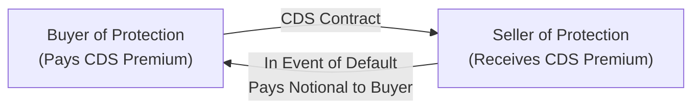

## 12.5 Why are CDSs and Index CDSs Used?

Credit Default Swaps (CDSs) form a cornerstone of the modern credit derivatives market. They serve various purposes—hedging, speculation, arbitrage, portfolio management, and regulatory capital relief—across global markets. Although they're centered around credit risk, CDSs also reflect broader market sentiment, macroeconomic trends, and systemic fluctuations. In Canada, regulatory bodies such as the Canadian Investment Regulatory Organization (CIRO) oversee many aspects of these derivatives and require market participants to adhere to strict guidelines on disclosure, risk management, and reporting. Let’s take a deep dive into why CDSs and Index CDSs have become so widely used.

  
## Hedging with Credit Default Swaps

One of the most common reasons for using CDSs is risk management. Suppose you’re a Canadian pension fund holding a large portfolio of corporate bonds issued by a high-yield (HY) energy company. You might feel pretty good about collecting the relatively higher coupons, but you might occasionally get that pesky feeling: “What if something goes wrong with the issuer’s creditworthiness?” In times of market uncertainty, you can hedge that exposure by purchasing CDS protection on those bonds.

When you buy a CDS, you pay a premium (the CDS spread) to a protection seller—often a bank or specialized firm. If the issuer defaults or experiences a credit event as specified in the CDS contract, you receive compensation that offsets your losses on the bond. This hedging function helps ensure a measure of stability, particularly for institutional investors like pension funds, insurance companies, and asset managers who might otherwise be vulnerable to a single issuer’s deteriorating credit profile.

There’s no doubt that economic cycles can dramatically affect credit. Remember 2008? Several large institutions used CDSs extensively to hedge (and sometimes profit from) the shaky credit environment. On the Canadian side, after the financial crisis, heightened regulatory oversight and stricter capital requirements led to more cautious but still robust use of CDSs. CIRO (formerly IIROC for investment dealers, plus the MFDA for mutual fund dealers, both defunct as separate entities since 2023) continues to publish risk disclosure statements to inform institutions and retail participants—though retail usage of CDSs is less common—about potential pitfalls and rewards of using such instruments.

  
## Speculation in CDS Markets

Let’s face it: speculation is part of the derivatives world, and CDSs are no exception. If you think a particular company’s credit risk is about to worsen, you can purchase CDS protection (go “long” credit risk via the CDS premium). If the issuer’s credit spread widens or a default happens, your CDS contract will pay off. Conversely, if you believe a company is more stable than the market realizes, you might sell CDS protection and collect premium income, effectively “shorting” credit risk by betting that the issuer’s spreads stay tight.

Speculators can capitalize on anticipated changes in corporate credit spreads, sovereign debt risk levels, or even global macroeconomic fluctuations—especially if they foresee, for example, a wave of defaults in a particular sector. It’s a fast-paced environment. Some traders rely on sophisticated fundamental analysis or fancy quantitative models, while others use gut instinct gleaned from years of market watching. Either way, speculation in CDS markets contributes liquidity and price discovery, although it can also amplify market volatility. That’s something regulators, including CIRO in Canada and bodies worldwide, keep a close eye on.

  
## Arbitrage: A Chance to Profit from Mispricing

Have you ever seen someone hunt for bargains in a supermarket, comparing one brand’s sale price to another’s? Arbitrage in finance is a bit like that, but on a more sophisticated level. Discrepancies between a bond’s cash price and its CDS spread can create opportunities for arbitrage. For instance, if a bond is trading at a discount relative to its perceived credit risk (implying that the CDS spread may be too high or too low), a trader can simultaneously execute offsetting trades in the bond market and the CDS market to lock in a profit.

Imagine a scenario where you believe the bond’s yield is too attractive for the risk. You could buy the bond and buy CDS protection, effectively constructing a “cash-and-CDS basis trade.” If the market eventually corrects that mispricing, you can unwind or hold the position for a potential profit. Alternatively, if a bond is overpriced relative to the CDS, you might do the reverse: short the bond and sell CDS protection. These strategies require nimble execution and continuous monitoring, especially if markets move quickly around major credit events or macroeconomic data releases.

  
## Portfolio Management with Index CDS

Index CDSs have become a go-to tool for portfolio managers who want to hedge or even replicate exposures to entire segments of the credit market—like North American high-yield (HY) or investment-grade (IG) corporate debt. A single index, such as the CDX index suite, might include, say, 125 equally weighted investment-grade reference entities. By trading one index instrument, you gain broad exposure to that basket of issuers.

This is incredibly handy for large-scale hedging. If your corporate bond portfolio is heavily tilted toward investment-grade financials and industrials, but you’re worried about a looming economic downturn, you might buy protection on the relevant index to offset potential default risk. Likewise, if you’re bullish on the credit market as a whole, you might sell protection to collect the index’s premium. Index CDSs allow for sweeping portfolio moves without having to pick and choose individual names—almost like a one-stop shop for credit exposure, good or bad.

In my experience, a friend of mine who manages a global credit fund likened Index CDS to “buying or shorting an entire credit landscape in one trade.” If your view is correct, you’ve captured a comprehensive credit move. If you’re wrong, well, you might get it wrong on all 125 components at once. So be mindful: it’s a powerful tool, but it cuts both ways.

  
## Regulatory Capital Relief

Banks, in particular, use CDSs to lower the amount of regulatory capital they have to hold against certain exposures. Under frameworks set by the Basel Committee on Banking Supervision (whose guidelines you can find at https://www.bis.org), financial institutions must maintain enough capital to cover credit risk on loans and other assets. If a bank’s corporate lending portfolio includes a fair amount of risk, the institution might purchase CDS protection on those loans to transfer credit risk to another party. This reduces the expected loss (from a regulatory standpoint) and thus requires less regulatory capital to be held in reserve.

It’s a bit like an insurance policy for the bank. A bank might say, “Look, we are carrying $100 million of exposure to a specific corporate borrower, but we’ve hedged $50 million of that risk through a CDS.” Regulators might then allow the bank to hold less capital in respect of that hedged portion, freeing up resources for other uses (like additional lending or investing in new business lines). However, regulators are careful to make sure this is a real risk transfer. CIRO and global regulators require robust documentation to prove that the bank has effectively mitigated its exposure and is not merely engaging in “regulatory capital arbitrage.”

  
## Common Pitfalls and Critiques

While the uses of CDSs and Index CDSs are numerous, it’s not without perils. It’s possible to overestimate how effective your hedge might be if you fail to read the fine print on default triggers or settlement mechanics. Liquidity can also dry up quickly when the market is in turmoil, making it difficult to exit or adjust positions at favorable prices.

Counterparty risk is another big one—if you buy credit protection, the seller must have the financial strength to pay out in a default scenario. If your counterparty fails at the precise moment you need them most, your hedge might vanish. That’s why the 2008 crisis was so dramatic; sellers of CDS protection realized their exposure was huge, and some were not sufficiently capitalized.

From a speculation standpoint, you might incorrectly gauge the direction of credit spreads, interest rates, or macro data. And for arbitrage strategies, a mismatch in timing or changes in liquidity conditions might hamper the anticipated “snap-back” in prices. In Canada, CIRO has mandated that licensed dealers maintain appropriate capital for derivative positions and has emphasized robust stress testing to ensure markets can handle extreme volatility. On top of that, the Basel Committee guidelines influence how large global banks manage their CDS activities and how they account for capital relief.

  
## Practical Example: Hedging Corporate Bond Risk

Let’s say you manage a bond fund and hold a position in a 7-year corporate bond issued by a large telecom company. You’re slightly concerned about the company’s upcoming merger. You might:

• Buy CDS protection that references that telecom issuer.  
• Pay an annual spread—say 150 basis points (1.50%)—on the notional value of your bond.  
• If the telecom company experiences a credit event (a default or restructuring), you receive compensation from the CDS seller.  

This strategy helps you sleep better at night, knowing that if something goes wrong in the corporate credit structure, you’ve got coverage. Of course, you lose the annual premium if no credit event materializes—but that’s not unlike buying vehicle insurance and never making a claim.

  
## Practical Example: Using Index CDS for Macro Plays

Suppose you have a bullish view on North American investment-grade credit—maybe you think the economy is humming along, corporate defaults look unlikely, and the risk of interest-rate spikes is minimal. You could sell protection on an iTraxx or CDX investment-grade index, thereby earning a spread. If your macro view is correct, the index spread should tighten, and your mark-to-market value on the CDS contract improves. But if corporate default fears suddenly spike, you might face losses on that position.

Alternatively, maybe you’re worried about the entire high-yield market. You’re seeing early signs that a recession is coming and want to protect your HY bond portfolio. You buy Index CDS protection on the relevant high-yield index. If defaults pick up or the credit environment sours, your CDS position could offset losses in your underlying HY bonds.

  
## How a CDS Transaction Flows (Mermaid Diagram)

Below is a simplified depiction of how a single CDS transaction might flow between a buyer and seller of protection:

Explanation:  
1. The buyer pays a periodic CDS premium to the seller.  
2. If a credit event occurs (e.g., default or restructuring), the seller compensates the buyer (usually by making a lump-sum payment reflecting the loss).

  
## Key Definitions

Arbitrage:  
The practice of taking advantage of price differences between two or more markets to generate a risk-free (or near risk-free) profit. In the context of CDSs, arbitrage strategies often involve simultaneous positions in the underlying bond and the credit default swap market.

Regulatory Capital Relief:  
A method for financial institutions—particularly banks—to lower the amount of regulatory capital needed by transferring or mitigating part of their credit risk exposure using CDSs. Under Basel rules, if the institution demonstrates genuine risk mitigation, regulators allow them to hold less capital.

High-Yield (HY) vs. Investment-Grade (IG):  
A classification of bonds based on their credit quality. High-yield bonds (often referred to as “junk” bonds) carry a higher risk of default and thus have higher yields and wider CDS spreads. Investment-grade (IG) bonds have stronger credit ratings and narrower spreads. Both can be referenced in single-name CDS and Index CDS.

  
## CIRO’s Oversight in Canada

CIRO, formed through the amalgamation of IIROC and the MFDA, is now the single self-regulatory organization overseeing investment and mutual fund dealers in Canada. While CDS trading is typically the domain of institutional players (banks, broker-dealers, hedge funds), any Canadian entity that deals in derivatives must comply with CIRO requirements shaped by provincial securities regulators and the Basel guidelines. For instance, banks and dealers must:

• Undergo strict risk disclosure protocols when recommending derivatives strategies.  
• Maintain adequate capital for open derivatives positions, including CDS.  
• Perform robust due diligence to ensure counterparties have the means to honor trades.  

If you’re working at a bank or a large asset manager, your compliance team likely reminds you daily about these guidelines. They’re essential to preserving the integrity of Canada’s financial markets.

  
## Balancing Benefits and Risks

It’s impossible to discuss why CDSs and Index CDSs are used without highlighting that their power comes with responsibility. They can serve as a buffer against unexpected credit events and provide attractive opportunities for returns. At the same time, as seen during the global financial crisis, large unhedged CDS exposures can create systemic risks if not handled properly. Canada weathered that storm relatively well, but we learned important lessons about transparency, collateralization, and appropriate risk limits.

For many institutional investors, their derivatives desk or credit desk uses common software frameworks—sometimes open-source solutions like OpenGamma or proprietary risk management tools—to run daily Value at Risk (VaR) and stress scenarios on CDS positions. This ensures that if volatility spikes or if credit events occur, the firm is prepared.  

  
## Personal Reflections

I remember speaking with a portfolio manager who confessed (with a bit of a sheepish smile) that, at times, he fell in love with the returns from selling CDS protection, but then worried at night about the possibility of a big market downturn. He said, “It’s easy to get hooked on that steady income from CDS premiums, but it’s not free money.” His story is a reminder that every derivatives trade involves potential risk—however appealing the returns might look.

At the same time, I’ve seen how prudent use of Index CDS can quickly adjust a portfolio’s risk profile. Instead of selling off dozens of bonds in a volatile market, managers can keep their fundamental positions intact but overlay a macro hedge for tail-risk events. If all goes well, they can lift the hedge once storm clouds clear, saving them from painful rebalancing costs.  

  
## Encouraging Continuous Learning

CDSs and Index CDSs are constantly evolving products. New index series, new reference obligations, and changing market conventions mean there’s always more to learn. If you’re keen, explore actual CDS quotes on a trading terminal or look into real-time credit spread data. Many references also exist online:  
• Visit https://www.ciro.ca for updated regulatory guidelines in Canada.  
• Check out the Basel Committee’s guidance at https://www.bis.org for capital rules that shape banks’ use of CDSs.  
• Explore open-source risk analytics solutions like OpenGamma to see how real CDS valuations and risk metrics are computed.  
• Periodically review credit rating agencies’ reports to understand evolving credit fundamentals.  

No matter your interest—be it hedging, speculation, arbitrage, portfolio management, or regulatory capital relief—CDSs and Index CDSs will likely remain a fixture in modern finance.  

  
## Sample Exam Questions: Why are CDSs and Index CDSs Used?



### Which of the following best summarizes a primary use of single-name CDSs for institutional investors?

- [ ] They serve only as a speculative tool to bet on commodity price movements.  
- [ ] They are used primarily to amplify equity exposure in a portfolio.  
- [x] They allow institutional investors to hedge credit exposure on a particular bond issuer.  
- [ ] They are deployed mainly to reduce interest rate risk.  

> **Explanation:** CDSs on a single name allow investors to protect against default risk or credit deterioration of a specific corporate or sovereign issuer, making them key instruments for hedging individual credit exposures.

### In the context of speculation, how might a trader profit from widening credit spreads via a CDS position?

- [x] By buying protection (going long the CDS).  
- [ ] By selling protection (going short the CDS).  
- [ ] By ignoring the CDS and focusing only on the underlying equities.  
- [ ] By placing stop-loss orders on a long bond position.  

> **Explanation:** A trader who expects credit spreads to widen (meaning the reference entity’s credit risk might worsen) would buy CDS protection; if the spreads indeed widen, the cost of that protection rises, which benefits the holder of the CDS.

### Which of the following is the best example of an arbitrage strategy using CDS?

- [ ] Buying a single bond and ignoring its CDS spread.  
- [x] Purchasing a bond at a discount while also buying CDS protection if the combined cost is lower than the bond’s true fair value.  
- [ ] Purchasing a CDS and simultaneously selling S&P 500 index futures.  
- [ ] Buying CDS on an issuer with which you have no exposure.  

> **Explanation:** Arbitrage often involves a simultaneous position in both the bond and its related CDS if the pricing discrepancy between the two creates a potential profit.  

### What is a key advantage of Index CDS in portfolio management?

- [x] It provides broad credit exposure or hedging with a single instrument.  
- [ ] It can only reference a single corporate entity in an index.  
- [ ] It is not regulated by any financial authorities.  
- [ ] It requires an exact 50–50 split of investment-grade and high-yield names.  

> **Explanation:** Index CDS allows investors to gain or hedge exposure to an entire “basket” of issuers—often 100+ names—in a single transaction, making it a highly efficient portfolio management tool.

### How can banks benefit from purchasing CDS protection on their loan portfolios?

- [x] They can reduce regulatory capital requirements by demonstrating risk mitigation.  
- [ ] They can entirely avoid compliance with Basel Committee guidelines.  
- [ ] They can eliminate all credit risk without any additional capital costs.  
- [ ] They can bypass the need to diversify their underlying loan exposures.  

> **Explanation:** Banks purchasing CDS protection can transfer some of their credit risk to the protection seller, thus freeing up regulatory capital under Basel rules. However, regulators require thorough documentation to prove genuine risk transfer.

### Which entity in Canada is responsible for overseeing many CDS-related trading activities among investment firms?

- [x] CIRO (Canadian Investment Regulatory Organization).  
- [ ] MFDA in its current form.  
- [ ] IIROC in its current form.  
- [ ] The Bank of Canada alone.  

> **Explanation:** CIRO is now the national self-regulatory organization in Canada, overseeing both investment dealers and mutual fund dealers. MFDA and IIROC are no longer separate entities.

### Which scenario might indicate a mismatch in CDS hedging effectiveness?

- [x] A bond defaults, but the CDS contract references very different event triggers, resulting in no payout.  
- [ ] The CDS seller has plenty of capital to meet default payouts.  
- [x] The reference entity experiences a credit downgrade, and the CDS buyer profits.  
- [ ] The bond’s coupon payment is above the market average.  

> **Explanation:** If the CDS contract’s terms don’t match the actual default or restructuring event triggers for the underlying bond, the hedge may fail to pay out as intended. This mismatch is a common pitfall.

### Why might liquidity issues arise in CDS markets during high-stress periods?

- [x] Fewer traders are willing to take on additional credit risk, leading to wider bid-ask spreads and reduced volume.  
- [ ] More traders want to buy CDS, creating unlimited liquidity.  
- [ ] Governments always intervene to provide liquidity in every CDS contract.  
- [ ] Credit spreads remain constant in market downturns.  

> **Explanation:** In a stressed environment, risk-averse participants may exit the market or widen their spreads, reducing overall liquidity and making it tougher to execute trades without significant price impact.

### What is a reason an investor might sell protection on a high-yield CDS index?

- [ ] To guarantee a fixed payment from the reference entity.  
- [ ] To hedge existing high-yield bond exposure.  
- [x] To collect a steady stream of CDS premiums, profiting if default risk stays low.  
- [ ] To import interest-rate risk into the portfolio.  

> **Explanation:** Selling protection on a high-yield index can be a speculative or income-generating strategy if the investor believes defaults will remain low. The investor collects premiums but takes on the risk of credit deterioration.

### True or False: A single CDS contract can be used by a bank to completely eliminate all capital requirements under current Basel guidelines.

- [x] True  
- [ ] False  

> **Explanation:** This is somewhat of a “trick” question because, in practice, regulators closely scrutinize whether risk has truly been transferred. While it may “reduce” capital requirements, completely eliminating them is highly unlikely. Depending on the terms and the structure, some portion of capital might still be required to account for counterparty risk or other residual exposures.


