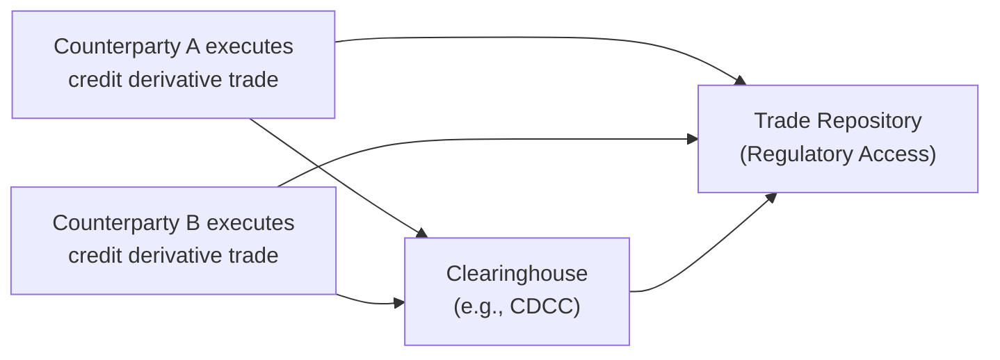
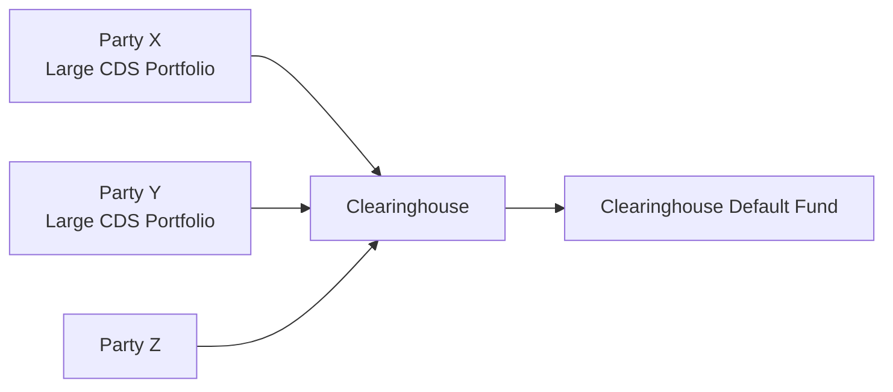

## 12.6 New Regulatory Requirements (Clearing/Reporting) for Credit Derivatives

If you’ve been following credit derivatives markets (and maybe you’ve heard a few stories around the dinner table about the 2008 financial crisis), you probably know that regulators around the world decided it was time to ramp up control and oversight of these products. After all, the meltdown that happened more than a decade ago left policymakers and participants anxiously asking, “So… how can we keep this from happening again?” One of the biggest lessons was that a lack of transparency and centralized clearing for some derivative products—especially credit derivatives—spelled trouble for the global financial system. Hence, new regulations in the form of mandatory clearing, robust reporting, and higher capital standards emerged to, in theory, buffer the world from another meltdown. In Canada, these requirements are primarily formalized under the oversight of the Canadian Securities Administrators (CSA) and the Canadian Investment Regulatory Organization (CIRO). 

Below, we’ll walk through what these regulations mean, why they matter, and how you can maintain compliance—whether you’re a big institutional participant, a small financial firm, or just an inquisitive mind who wants to understand how this all fits together. 

Let’s dig in.

  
### The 2008 Financial Crisis and the Push for Massive Reform

It’s impossible to talk about these new regulatory requirements without first talking about the 2008 financial crisis. Back then, credit default swaps (CDSs) and other credit derivatives were traded with minimal oversight. There was barely any transparency regarding who held which positions, how much counterparty risk was in the system, and what would happen if someone defaulted. If you recall the AIG fiasco—no one truly knew the extent of their CDS exposure until it was way too late.

Regulators and policymakers responded by introducing a bewildering array of rules—some might say “necessary,” others might say “excessive.” But the chief objectives included:

• Enhancing transparency so regulators and market participants could see what was going on.  
• Reducing counterparty risk by encouraging or mandating that standardized derivatives be centrally cleared.  
• Improving the integrity of the financial markets so that no single participants’ collapse could trigger a chain reaction.

Fast forward to Canada, where the CSA, along with CIRO, took an active role in shaping these guidelines and ensuring they were tailored to our local market dynamics.  

### Why Mandatory Clearing Matters

Imagine you’re playing a friendly poker game with a few friends. If each of you is just trading IOUs on the side, it’s easy for someone to have a giant stack of debts that nobody else knows about. That uncertainty can cause panic if you suspect someone might not be able to pay up.

Now, shift that analogy to the derivatives market. If trades are done strictly over-the-counter (OTC) without any central record or clearinghouse, each participant has to rely on all other participants to make good on their obligations. The moment one large counterparty can’t pay, the vulnerabilities cascade.

Mandatory clearing is supposed to fix all that. When you clear standardized credit derivatives through a recognized clearing agency, such as the Canadian Derivatives Clearing Corporation (CDCC), you effectively hand a big part of the counterparty risk over to the clearinghouse. The clearinghouse uses a margin system and default funds to ensure that if one party defaults, the clearinghouse itself has the resources to cover the losses and protect the rest of the market from a catastrophic domino effect.

This approach reduces systemic risk, which is precisely what the government—and the public at large—wants.

  
### The Canadian Regulatory Environment for Credit Derivatives

In Canada, National Instrument (NI) 94-101 and NI 94-102 are the big players in this space:

• NI 94-101 (Mandatory Central Counterparty Clearing of Derivatives): This instrument lays out which OTC derivatives (including many credit derivatives) must be cleared through an authorized central counterparty, and who must comply.  
• NI 94-102 (Derivatives: Customer Clearing and Protection of Customer Collateral and Positions): This one addresses how positions should be cleared on behalf of customers, including collateral protections and default procedures.

If you’re dealing with credit derivatives in Canada, your trades may well be caught by these rules if the product and the counterparties meet certain thresholds or definitions. And these definitions can change—CIRO and the CSA keep a close watch on market conditions and can expand the list of instruments that must be cleared or reported.

  
#### Staying in the Loop

One personal anecdote: back when I was first trying to keep up with new clearing rules, I found myself scouring the CSA’s bulletins once a month, half-dreading to find that something else had just become mandatory for clearing. But you know what? The bulletins often provided clarity on the “why” behind new rules. That made me (and my colleagues) realize these do help keep the market stable.

So, for practitioners, it’s critical to stay on top of CIRO notices and CSA updates, even if it feels like a chore. The rules can and do change, particularly regarding the types of derivatives that must be cleared or the thresholds for mandatory clearing.  

  
### The Reporting Obligation

Hand in hand with mandatory clearing is the requirement to report transactions to a recognized trade repository. 

Think of a trade repository as a giant data warehouse. Everyone trading certain OTC derivatives, including credit default swaps, must submit the details of these trades—terms, counterparties, notional amounts, payment schedules, settlement currency, you name it. Regulators then use this info to see a snapshot of the market. That’s super important. Why? Because it helps them detect if one big player is racking up large positions that could be dangerous to the entire system.

  
#### Key Features of Trade Repositories

1. They are recognized by provincial securities regulators.  
2. They must offer regulators real-time or near real-time access to trade data.  
3. They keep data secure but also accessible to the regulators responsible for overseeing derivatives markets.  

  
### The Mechanics of Reporting: A Quick Visual

Below is a simplistic mermaid diagram that can help you see how a credit derivative transaction might flow from trade execution to reporting:

• Counterparties A and B enter into a credit derivative (like a CDS).  
• Because the product is subject to mandatory clearing, both parties submit to the clearinghouse.  
• Each counterparty independently reports the transaction to a recognized trade repository.  
• The clearinghouse also sends relevant data to the trade repository, ensuring regulators have the full picture of exposures and positions.  

  
### Thresholds, Scope, and Future Updates

Right now, not all credit derivatives necessarily must be cleared—and we’re not talking about your neighbor making a casual bet on a small corporate bond’s credit spread. The regulations mainly target institutional deals, large notional volumes, or standardized products. That said, thresholds can be updated. The CSA occasionally reviews market data, determines that certain products have become sufficiently liquid and standardized, and then lumps these products under mandatory clearing requirements.

For example, if a new type of credit default swap index becomes heavily traded and standardized, the CSA might decide to subject it to mandatory clearing. CIRO updates often appear in bulletins or staff notices, so if you’re an active participant, you’ll want to watch those.  

  
### Reducing Systemic Risk

The ultimate goal of all these new requirements is reducing systemic risk. Prior to 2008, people in the business of credit protection sometimes referred to CDS as “financial weapons of mass destruction.” Overly dramatic? Maybe. But what it hinted at was that big, unregulated exposures across interconnected institutions could cause serious damage if something went awry.

By making sure that trades are cleared, regulators spread the risk around a stable clearinghouse that’s set up precisely to handle defaults. By reporting, they keep an eye on who is building up monstrous positions. This makes it so the meltdown scenario becomes less likely.  

Here’s a simplified schematic to show how central clearing can act as a firewall:

• Parties X, Y, and Z each post initial margin to the clearinghouse.  
• The clearinghouse maintains a default fund (M) that can be used if one party defaults.  
• Losses from a default get covered by the defaulter’s margin first; if that’s not enough, the clearinghouse can draw from the default fund, shielding the rest of the market from immediate losses.  

  
### Practical Example: Implementing Mandatory Clearing on a Plain Vanilla CDS

Let’s say two large Canadian financial institutions enter into a standard credit default swap on a widely traded corporate bond index. According to NI 94-101, this CDS is on the “in-scope” list, meaning it must be cleared if both parties exceed certain thresholds. Because both are big players (and likely way above any threshold), they must route the trade through an approved clearinghouse such as CDCC.

• Step 1: They negotiate the terms (credit spread, notional amount, maturity).  
• Step 2: Before finalizing the trade, they confirm with each other that the product is a mandated clearable derivative.  
• Step 3: They either submit the trade for clearing themselves or via a clearing broker.  
• Step 4: After clearing is accepted, both parties reflect the trade on their balance sheets as a cleared position.  
• Step 5: They report the transaction to a recognized trade repository (e.g., DTCC) with all relevant data.  

Yes, it’s more steps than the old “Handshake and we’re done” approach. But it’s becoming routine in the pursuit of a sturdier market structure.

  
### Common Pitfalls and Best Practices

• Forgetting to report in time: Deadlines for reporting can be tight, often T+1 or even same-day. Missing these windows can result in regulatory headaches.  
• Misidentifying the product: If you’re not sure whether your credit derivative is a “standardized” product, check the CSA guidance. Ambiguity can lead to compliance issues.  
• Neglecting to monitor evolving thresholds: You might be under the threshold one day and over it the next, especially if your trading volume picks up. Keep track!  
• Relying on outdated internal compliance manuals: If your compliance manual hasn’t been updated in two years, you might be missing some critical changes to the clearing or reporting requirements.  

  
### Keeping Infrastructure Up to Date

These requirements demand technological readiness. Small market participants often struggle with the systems needed to handle:

• Real-time data feeds for credit derivative trades.  
• Automated trade reporting to recognized repositories.  
• Connections to central counterparties (CCPs) for clearing.  

Honestly, I remember an endless string of software updates and compliance training sessions after these mandates first rolled out. It wasn’t always fun. But once systems are in place, daily operations get easier—and you’ll rest better knowing your firm is less likely to run afoul of the regulators.  

  
### Role of CIRO and the CSA

As of 2023, the single self-regulatory organization in Canada is the Canadian Investment Regulatory Organization (CIRO), formed by the amalgamation of IIROC and the MFDA (both are now defunct). CIRO works alongside the CSA, which represents provincial securities regulators. CIRO and the CSA coordinate on:

• Setting and updating mandatory clearing thresholds.  
• Defining the scope of products subject to clearing and reporting.  
• Providing guidance (via notices and bulletins) on how to comply.  
• Conducting examinations and enforceable actions against those who violate the rules.  

For official updates, including the most recent changes to margin requirements, clearing thresholds, and recognized trade repositories, head to [https://www.ciro.ca](https://www.ciro.ca) and your local CSA website.

  
### Global Comparisons

Canada isn’t alone in introducing mandatory clearing and reporting. If you’re operating in multiple jurisdictions, you may have to comply with Dodd-Frank (U.S.), EMIR (Europe), or other local frameworks. The processes are broadly similar: find a recognized clearinghouse, connect your systems, and report trades promptly. But each region has slight variations in product scope, threshold levels, and timelines, so watch out for intricacies if you’re cross-border.  

  
### Conclusion

Phew, that’s a lot. But hey, if you’re staying with me so far, I hope you’re seeing the big picture: new regulatory requirements like mandatory clearing and trade reporting for credit derivatives are designed to foster a safer, more transparent market. Sure, it can feel like you’re drowning in forms, portals, or compliance checklists. But the payoff—reduced systemic risk, more stable institutions, and clearer market visibility—can be pretty huge.

Maybe you’ll look back and say, “Well, I never want to repeat 2008!” The idea behind these measures is to prevent that, or at least drastically reduce its likelihood. Keep an eye on CIRO bulletins, check the CSA’s website for updates, and make sure your compliance officer is on speed dial.

Next time you find yourself settling into a conversation about credit derivatives, maybe you’ll recall this discussion with a bit of nostalgia. Because this new era, while more regulated, is hopefully far more resilient.

  
### References and Resources

• Canadian Derivatives Clearing Corporation (CDCC): [https://www.cdcc.ca](https://www.cdcc.ca)  
• CIRO: [https://www.ciro.ca](https://www.ciro.ca)  
• ISDA (International Swaps and Derivatives Association) – Documentation and standards: [https://www.isda.org](https://www.isda.org)  
• Canadian Securities Administrators (CSA) – National Instrument 94-101 and 94-102, plus Staff Notices: [https://www.securities-administrators.ca](https://www.securities-administrators.ca)  
• For additional training modules and open-source tools for derivatives data management, consider exploring Fintech libraries on GitHub (e.g., OpenGamma libraries).  

  
## Sample Exam Questions: Understanding New Regulatory Requirements for Credit Derivatives



### Which event primarily triggered the push for mandatory clearing and enhanced reporting for credit derivatives? 
- [ ] The Asian Financial Crisis of 1997 
- [x] The 2008 financial crisis 
- [ ] The Dot-Com Bubble of 2001 
- [ ] The 1987 Stock Market Crash 

> **Explanation:** The 2008 financial crisis exposed the dangers of opaque OTC derivatives trading, prompting global regulators to require mandatory clearing and reporting to reduce systemic risk.

### In Canada, which piece of legislation outlines the rules for mandatory clearing of certain OTC derivatives, including credit derivatives?
- [ ] National Instrument 81-102
- [x] National Instrument 94-101
- [ ] National Instrument 31-103
- [ ] National Instrument 25-101

> **Explanation:** NI 94-101 (Mandatory Central Counterparty Clearing of Derivatives) defines which OTC derivatives must be cleared and under what conditions.

### What is the primary purpose of a trade repository in the context of credit derivatives reporting?
- [ ] Acting as a broker for OTC trades
- [ ] Retaining all executed trades confidentially, with no regulatory access
- [x] Collecting and storing key transaction data to provide transparency to regulators
- [ ] Issuing regulatory fines to non-compliant market participants

> **Explanation:** Trade repositories keep a central record of transaction data, allowing regulators a comprehensive view of market activity to monitor and mitigate systemic risks.

### Why do regulators focus on standardized credit derivative products for mandatory clearing rather than bespoke or custom structures?
- [ ] Bespoke products no longer exist in modern marketplaces
- [ ] Standardized products cannot be traded if not cleared
- [x] Standardized products have higher liquidity and predictable risk profiles suitable for central clearing
- [ ] Only standardized products are legal in Canada

> **Explanation:** Standardizing the contract terms makes it easier to clear and reduces risk through consistent margining. Custom products lack uniform terms and are generally not mandated for clearing.

### Which organization is primarily responsible for clearing derivatives in Canada, including certain credit derivatives?
- [ ] Federal Reserve
- [ ] CIRO
- [ ] IIROC
- [x] CDCC

> **Explanation:** The Canadian Derivatives Clearing Corporation (CDCC) is Canada’s main clearinghouse, ensuring the financial integrity of derivatives transactions.

### How does a clearinghouse reduce systemic risk among counterparties trading credit derivatives?
- [ ] By guaranteeing profits for all participants 
- [x] By collecting margin and mutualizing default risk through a default fund 
- [ ] By eliminating the need for collateral 
- [ ] By offering unlimited leverage 

> **Explanation:** A clearinghouse centralizes risk management by collecting margin from participants and establishing a default fund, which covers losses if a party fails to meet its obligations.

### Under NI 94-102, which aspect concerning customer collateral is regulated?
- [ ] The prohibition of collateral posting 
- [ ] The automatic transfer of collateral to a third party 
- [x] Protection of customer collateral and the handling of positions in default scenarios 
- [ ] The requirement that no collateral be posted for credit derivative trades

> **Explanation:** NI 94-102 sets out the rules for protecting customer collateral and clarifies how client positions are treated if a clearing member defaults. 

### If two large financial institutions exceed the regulatory threshold and enter a new plain vanilla credit default swap:
- [ ] There is no need to report the trade because both parties are large institutions 
- [x] They are required to clear it through an authorized CCP like the CDCC and report it to a recognized trade repository
- [ ] They can bypass mandatory clearing if they elect to do so 
- [ ] They must terminate all active CDS positions immediately

> **Explanation:** When the notional volume and other criteria align with mandatory clearing rules, the deal must go through a central counterparty and be reported to a recognized trade repository.

### What is the main difference between clearing and reporting obligations?
- [ ] Clearing obligations only apply to banks, whereas reporting obligations apply to all market participants
- [x] Clearing obligations require trades to be routed through a central counterparty, while reporting obligations focus on disclosing transaction details to a trade repository 
- [ ] Clearing obligations are optional, but reporting obligations are mandatory 
- [ ] There is no practical difference; they are the same process

> **Explanation:** Clearing involves centralizing risk management at a clearinghouse, while reporting ensures transparency by sending transaction data to a recognized trade repository.

### True or False: CIRO and the CSA may update the list of credit derivatives subject to mandatory clearing as market conditions change.
- [x] True
- [ ] False

> **Explanation:** Regulators periodically reassess products and thresholds to keep pace with evolving market liquidity and risk profiles, allowing them to update clearing requirements accordingly.


